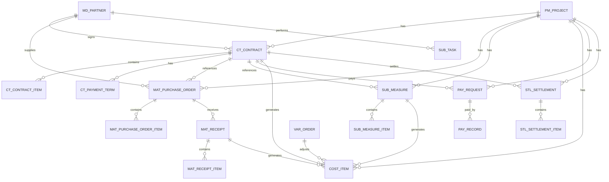

# 建筑工程总包项目全过程管理系统数据库设计方案 MySQL 8.0 正式版

| 项目 | 内容 |
|---|---|
| 文档编号 | JGZB-DEV-05 |
| 版本 | V1.0 正式版 |
| 日期 | 2026-06-10 |
| 适用对象 | 后端研发、DBA、测试、运维 |
| 文档定位 | 明确 MySQL 8.0 数据库基线、核心表结构、字段规范和数据关系 |

---

## 正式版数据库基线

一期数据库统一采用 **MySQL 8.0**。本文件中的字段类型、索引、注释、DDL 脚本、迁移脚本和运维手册均按 MySQL 8.0 口径执行。

### 1. 不默认使用 PostgreSQL 的原因

1. 一期核心目标是打通项目、合同、采购、分包、成本、付款、结算闭环，不是空间地理、复杂 JSONB 检索或分析型数据库。
2. 审批规则、动态表单、节点通过规则、驳回规则等半结构化字段使用 MySQL 8.0 JSON 类型可以满足一期需求。
3. 当前数据库设计和 DDL 风格已经明显偏 MySQL，例如 `DATETIME`、`TINYINT`、`UNIQUE KEY`、表内 `INDEX` 等。
4. 建筑工程总包行业现场和甲方 IT 运维团队通常对 MySQL 更熟悉，MySQL 可降低交付、备份、排障和长期运维风险。

### 2. JSON 字段标准

审批相关表统一使用 MySQL JSON 字段：

```sql
pass_rule_json JSON NULL COMMENT '节点通过规则',
reject_rule_json JSON NULL COMMENT '节点驳回规则',
form_schema JSON NULL COMMENT '动态表单结构',
condition_rule JSON NULL COMMENT '流程匹配条件',
node_config JSON NULL COMMENT '节点扩展配置'
```

### 3. 审批表补充字段

审批相关表必须补充或明确：

| 表 | 字段 | 说明 |
|---|---|---|
| `wf_instance` | `current_round` | 当前审批轮次 |
| `wf_instance` | `resubmit_count` | 重新提交次数 |
| `wf_node_instance` | `round_no` | 节点实例所属轮次 |
| `wf_task` | `round_no` | 任务所属轮次 |
| `wf_task` | `task_version` | 任务乐观锁版本 |
| `wf_record` | `node_instance_id` | 审批记录所属节点实例 |
| `wf_record` | `round_no` | 审批记录所属轮次 |

---
## 一、数据库总体设计原则

本数据库设计围绕建筑工程总包项目全过程管理系统的核心业务主线展开：

> 项目为根，合同为纲，执行为据，成本为果，付款为流，结算为终。

系统数据库设计目标是打通项目、合同、材料设备、分包、成本、付款、结算、审批、资料之间的数据关系，避免重复录入、重复建表和数据口径不一致。

### 1. 核心设计原则

```text
一个项目主线：project_id 贯穿所有业务
一个合同中心：Contract 统一管理总包、分包、采购、租赁合同
一个合作方中心：Partner 统一管理供应商、分包商、租赁商、服务商
一个成本归集中心：CostItem 记录所有成本来源
一个付款闭环：PaymentRequest + PaymentRecord 区分申请和实际付款
一个结算收口：Settlement 汇总合同、计量、验收、付款、签证、成本
```

### 2. 需要避免的问题

```text
不要在分包管理里再建一套分包合同表
不要在材料管理里重复维护采购合同金额
不要在成本管理里手工重复录入合同、采购、计量数据
不要把付款金额等同于成本发生金额
不要到结算阶段重新录入一套结算数据
```

---

## 二、数据库分层设计

建议采用模块化单体数据库设计。初期使用一个业务库，按表名前缀区分模块，后期可根据规模拆分为独立服务库。

| 前缀 | 模块 | 示例 |
|---|---|---|
| `sys_` | 系统权限 | 用户、角色、菜单、字典 |
| `org_` | 组织架构 | 公司、部门、岗位 |
| `pm_` | 项目管理 | 项目、项目成员、项目目标 |
| `md_` | 主数据 | 合作方、材料字典、成本科目 |
| `ct_` | 合同管理 | 合同、合同清单、付款条件、合同变更 |
| `mat_` | 材料设备 | 采购申请、采购订单、验收、入库、出库 |
| `eq_` | 设备管理 | 设备台账、租赁、使用、维保 |
| `sub_` | 分包管理 | 分包任务、分包进度、分包计量 |
| `lab_` | 劳务管理 | 工人、班组、考勤、工资 |
| `cost_` | 成本管理 | 目标成本、成本明细、动态成本 |
| `pay_` | 付款管理 | 付款申请、付款记录、发票 |
| `var_` | 变更签证 | 签证、变更、索赔 |
| `stl_` | 结算管理 | 总包结算、分包结算、采购结算 |
| `wf_` | 审批流程 | 流程模板、流程实例、审批记录 |
| `doc_` | 文件资料 | 文件、目录、业务附件 |
| `log_` | 日志审计 | 操作日志、登录日志 |

---

## 三、核心 ER 关系



---

## 四、公共字段设计

所有核心业务表建议统一包含以下公共字段。

| 字段 | 类型 | 说明 |
|---|---|---|
| `id` | bigint | 主键 |
| `tenant_id` | bigint | 租户 / 公司 ID，多公司场景使用 |
| `project_id` | bigint | 所属项目，核心业务表必须有 |
| `org_id` | bigint | 所属组织 / 项目部 |
| `status` | varchar | 业务状态 |
| `approval_status` | varchar | 审批状态 |
| `created_by` | bigint | 创建人 |
| `created_at` | datetime | 创建时间 |
| `updated_by` | bigint | 更新人 |
| `updated_at` | datetime | 更新时间 |
| `deleted_flag` | tinyint | 逻辑删除标识 |
| `remark` | varchar/text | 备注 |

建议将业务状态和审批状态分开：

```text
status：业务状态，例如履约中、已结算、已关闭
approval_status：审批状态，例如草稿、审批中、已通过、已驳回
```

---

# 五、核心主数据表设计

## 1. 项目表：`pm_project`

项目是所有业务的根节点。

| 字段 | 类型 | 说明 |
|---|---|---|
| `id` | bigint PK | 项目 ID |
| `tenant_id` | bigint | 租户 ID |
| `project_code` | varchar(64) | 项目编号 |
| `project_name` | varchar(200) | 项目名称 |
| `project_type` | varchar(50) | 项目类型 |
| `project_address` | varchar(300) | 项目地址 |
| `owner_unit` | varchar(200) | 建设单位 |
| `supervisor_unit` | varchar(200) | 监理单位 |
| `design_unit` | varchar(200) | 设计单位 |
| `contract_amount` | decimal(18,2) | 总包合同金额 |
| `target_cost` | decimal(18,2) | 目标成本 |
| `planned_start_date` | date | 计划开工日期 |
| `planned_end_date` | date | 计划竣工日期 |
| `actual_start_date` | date | 实际开工日期 |
| `actual_end_date` | date | 实际竣工日期 |
| `project_manager_id` | bigint | 项目经理 |
| `status` | varchar(50) | 项目状态 |

---

## 2. 项目成员表：`pm_project_member`

| 字段 | 类型 | 说明 |
|---|---|---|
| `id` | bigint PK | 主键 |
| `project_id` | bigint FK | 项目 ID |
| `user_id` | bigint FK | 用户 ID |
| `role_code` | varchar(50) | 项目角色 |
| `position_name` | varchar(100) | 岗位名称 |
| `start_date` | date | 进入项目时间 |
| `end_date` | date | 离开项目时间 |
| `status` | varchar(50) | 状态 |

---

## 3. 合作方表：`md_partner`

供应商、分包商、租赁商、服务商统一放到合作方主数据中。

| 字段 | 类型 | 说明 |
|---|---|---|
| `id` | bigint PK | 合作方 ID |
| `partner_code` | varchar(64) | 合作方编号 |
| `partner_name` | varchar(200) | 合作方名称 |
| `partner_type` | varchar(50) | 供应商、分包商、租赁商、服务商 |
| `credit_code` | varchar(100) | 统一社会信用代码 |
| `legal_person` | varchar(100) | 法人 |
| `contact_name` | varchar(100) | 联系人 |
| `contact_phone` | varchar(50) | 联系电话 |
| `bank_name` | varchar(200) | 开户行 |
| `bank_account` | varchar(100) | 银行账号 |
| `qualification_level` | varchar(100) | 资质等级 |
| `blacklist_flag` | tinyint | 是否黑名单 |
| `status` | varchar(50) | 状态 |

---

# 六、合同管理数据库设计

合同管理只维护一套合同数据，其他模块通过 `contract_id` 引用合同，不得重复建立合同主表。

## 1. 合同主表：`ct_contract`

| 字段 | 类型 | 说明 |
|---|---|---|
| `id` | bigint PK | 合同 ID |
| `tenant_id` | bigint | 租户 ID |
| `project_id` | bigint FK | 项目 ID |
| `partner_id` | bigint FK | 合作方 ID |
| `contract_code` | varchar(64) | 合同编号 |
| `contract_name` | varchar(200) | 合同名称 |
| `contract_type` | varchar(50) | 总包、分包、采购、租赁、服务 |
| `party_a` | varchar(200) | 甲方 |
| `party_b` | varchar(200) | 乙方 |
| `contract_amount` | decimal(18,2) | 合同金额 |
| `tax_rate` | decimal(6,2) | 税率 |
| `tax_amount` | decimal(18,2) | 税额 |
| `amount_without_tax` | decimal(18,2) | 不含税金额 |
| `signed_date` | date | 签订日期 |
| `start_date` | date | 合同开始日期 |
| `end_date` | date | 合同结束日期 |
| `payment_method` | varchar(100) | 付款方式 |
| `settlement_method` | varchar(100) | 结算方式 |
| `warranty_rate` | decimal(6,2) | 质保金比例 |
| `warranty_amount` | decimal(18,2) | 质保金金额 |
| `contract_status` | varchar(50) | 草稿、审批中、已签订、履约中、已结算、已归档 |
| `approval_status` | varchar(50) | 审批状态 |

---

## 2. 合同清单表：`ct_contract_item`

| 字段 | 类型 | 说明 |
|---|---|---|
| `id` | bigint PK | 清单 ID |
| `contract_id` | bigint FK | 合同 ID |
| `project_id` | bigint FK | 项目 ID |
| `item_code` | varchar(64) | 清单编码 |
| `item_name` | varchar(200) | 清单名称 |
| `specification` | varchar(200) | 规格型号 |
| `unit` | varchar(20) | 单位 |
| `quantity` | decimal(18,4) | 数量 |
| `unit_price` | decimal(18,4) | 单价 |
| `amount` | decimal(18,2) | 金额 |
| `cost_subject_id` | bigint | 成本科目 |
| `remark` | varchar(500) | 备注 |

---

## 3. 合同付款条件表：`ct_payment_term`

| 字段 | 类型 | 说明 |
|---|---|---|
| `id` | bigint PK | 主键 |
| `contract_id` | bigint FK | 合同 ID |
| `project_id` | bigint FK | 项目 ID |
| `term_name` | varchar(100) | 付款节点名称 |
| `payment_ratio` | decimal(6,2) | 付款比例 |
| `payment_amount` | decimal(18,2) | 付款金额 |
| `trigger_condition` | varchar(500) | 触发条件 |
| `planned_date` | date | 计划付款日期 |
| `status` | varchar(50) | 未触发、可申请、已申请、已支付 |

---

## 4. 合同变更表：`ct_contract_change`

| 字段 | 类型 | 说明 |
|---|---|---|
| `id` | bigint PK | 变更 ID |
| `project_id` | bigint FK | 项目 ID |
| `contract_id` | bigint FK | 合同 ID |
| `change_code` | varchar(64) | 变更编号 |
| `change_name` | varchar(200) | 变更名称 |
| `change_type` | varchar(50) | 金额变更、工期变更、条款变更 |
| `before_amount` | decimal(18,2) | 变更前金额 |
| `change_amount` | decimal(18,2) | 本次变更金额 |
| `after_amount` | decimal(18,2) | 变更后金额 |
| `reason` | text | 变更原因 |
| `approval_status` | varchar(50) | 审批状态 |
| `effective_flag` | tinyint | 是否生效 |

---

# 七、材料设备管理数据库设计

## 1. 材料字典表：`md_material`

| 字段 | 类型 | 说明 |
|---|---|---|
| `id` | bigint PK | 材料 ID |
| `material_code` | varchar(64) | 材料编码 |
| `material_name` | varchar(200) | 材料名称 |
| `category_id` | bigint | 材料分类 |
| `specification` | varchar(200) | 规格型号 |
| `unit` | varchar(20) | 计量单位 |
| `brand` | varchar(100) | 品牌 |
| `default_tax_rate` | decimal(6,2) | 默认税率 |
| `status` | varchar(50) | 状态 |

---

## 2. 采购申请表：`mat_purchase_request`

| 字段 | 类型 | 说明 |
|---|---|---|
| `id` | bigint PK | 采购申请 ID |
| `project_id` | bigint FK | 项目 ID |
| `request_code` | varchar(64) | 申请单号 |
| `request_name` | varchar(200) | 申请名称 |
| `request_type` | varchar(50) | 材料、设备、周转材料 |
| `required_date` | date | 需求日期 |
| `applicant_id` | bigint | 申请人 |
| `total_amount` | decimal(18,2) | 预计金额 |
| `approval_status` | varchar(50) | 审批状态 |
| `status` | varchar(50) | 草稿、审批中、已通过、已生成订单 |

---

## 3. 采购订单表：`mat_purchase_order`

采购订单支持三种场景：有合同采购、零星采购、框架协议采购。

| 字段 | 类型 | 说明 |
|---|---|---|
| `id` | bigint PK | 订单 ID |
| `project_id` | bigint FK | 项目 ID |
| `request_id` | bigint FK | 采购申请 ID |
| `contract_id` | bigint FK nullable | 采购合同 ID，可为空 |
| `partner_id` | bigint FK | 供应商 ID |
| `order_code` | varchar(64) | 订单编号 |
| `order_type` | varchar(50) | 合同采购、零星采购、框架协议采购 |
| `order_date` | date | 下单日期 |
| `delivery_date` | date | 计划到货日期 |
| `total_amount` | decimal(18,2) | 订单总金额 |
| `approval_status` | varchar(50) | 审批状态 |
| `order_status` | varchar(50) | 草稿、已审批、部分到货、已到货、已关闭 |

---

## 4. 采购订单明细表：`mat_purchase_order_item`

| 字段 | 类型 | 说明 |
|---|---|---|
| `id` | bigint PK | 明细 ID |
| `order_id` | bigint FK | 订单 ID |
| `project_id` | bigint FK | 项目 ID |
| `material_id` | bigint FK | 材料 ID |
| `material_name` | varchar(200) | 材料名称 |
| `specification` | varchar(200) | 规格型号 |
| `unit` | varchar(20) | 单位 |
| `quantity` | decimal(18,4) | 订单数量 |
| `unit_price` | decimal(18,4) | 单价 |
| `amount` | decimal(18,2) | 金额 |
| `received_quantity` | decimal(18,4) | 已验收数量 |

---

## 5. 材料验收表：`mat_receipt`

| 字段 | 类型 | 说明 |
|---|---|---|
| `id` | bigint PK | 验收单 ID |
| `project_id` | bigint FK | 项目 ID |
| `order_id` | bigint FK | 采购订单 ID |
| `contract_id` | bigint FK nullable | 合同 ID |
| `partner_id` | bigint FK | 供应商 ID |
| `receipt_code` | varchar(64) | 验收单号 |
| `receipt_date` | date | 验收日期 |
| `warehouse_id` | bigint | 仓库 ID |
| `receiver_id` | bigint | 验收人 |
| `quality_status` | varchar(50) | 合格、不合格、待复检 |
| `total_amount` | decimal(18,2) | 验收金额 |
| `approval_status` | varchar(50) | 审批状态 |
| `cost_generated_flag` | tinyint | 是否已生成成本 |

---

## 6. 材料验收明细表：`mat_receipt_item`

| 字段 | 类型 | 说明 |
|---|---|---|
| `id` | bigint PK | 明细 ID |
| `receipt_id` | bigint FK | 验收单 ID |
| `order_item_id` | bigint FK | 订单明细 ID |
| `material_id` | bigint FK | 材料 ID |
| `actual_quantity` | decimal(18,4) | 实收数量 |
| `qualified_quantity` | decimal(18,4) | 合格数量 |
| `unit_price` | decimal(18,4) | 单价 |
| `amount` | decimal(18,2) | 金额 |
| `use_location` | varchar(200) | 使用部位 |
| `batch_no` | varchar(100) | 批次号 |

---

## 7. 库存表：`mat_stock`

| 字段 | 类型 | 说明 |
|---|---|---|
| `id` | bigint PK | 库存 ID |
| `project_id` | bigint FK | 项目 ID |
| `warehouse_id` | bigint | 仓库 ID |
| `material_id` | bigint FK | 材料 ID |
| `batch_no` | varchar(100) | 批次号 |
| `quantity` | decimal(18,4) | 当前库存数量 |
| `amount` | decimal(18,2) | 当前库存金额 |
| `last_in_date` | date | 最近入库日期 |
| `last_out_date` | date | 最近出库日期 |

---

## 8. 库存流水表：`mat_stock_txn`

| 字段 | 类型 | 说明 |
|---|---|---|
| `id` | bigint PK | 流水 ID |
| `project_id` | bigint FK | 项目 ID |
| `warehouse_id` | bigint | 仓库 ID |
| `material_id` | bigint FK | 材料 ID |
| `txn_type` | varchar(50) | 入库、出库、退库、盘点调整 |
| `source_type` | varchar(50) | Receipt、Issue、Return、Adjust |
| `source_id` | bigint | 来源单据 ID |
| `quantity` | decimal(18,4) | 数量 |
| `unit_price` | decimal(18,4) | 单价 |
| `amount` | decimal(18,2) | 金额 |
| `txn_date` | datetime | 发生时间 |

---

# 八、分包管理数据库设计

## 1. 分包任务表：`sub_task`

| 字段 | 类型 | 说明 |
|---|---|---|
| `id` | bigint PK | 分包任务 ID |
| `project_id` | bigint FK | 项目 ID |
| `contract_id` | bigint FK | 分包合同 ID |
| `partner_id` | bigint FK | 分包单位 ID |
| `task_code` | varchar(64) | 任务编号 |
| `task_name` | varchar(200) | 任务名称 |
| `work_area` | varchar(200) | 作业区域 |
| `planned_start_date` | date | 计划开始 |
| `planned_end_date` | date | 计划结束 |
| `actual_start_date` | date | 实际开始 |
| `actual_end_date` | date | 实际结束 |
| `progress_percent` | decimal(6,2) | 进度百分比 |
| `status` | varchar(50) | 未开始、进行中、已完成、已暂停 |

---

## 2. 分包进度表：`sub_progress`

| 字段 | 类型 | 说明 |
|---|---|---|
| `id` | bigint PK | 进度 ID |
| `project_id` | bigint FK | 项目 ID |
| `task_id` | bigint FK | 分包任务 ID |
| `contract_id` | bigint FK | 分包合同 ID |
| `report_date` | date | 填报日期 |
| `completed_quantity` | decimal(18,4) | 完成工程量 |
| `progress_percent` | decimal(6,2) | 完成比例 |
| `description` | text | 进度说明 |
| `reporter_id` | bigint | 填报人 |
| `approval_status` | varchar(50) | 审批状态 |

---

## 3. 分包计量表：`sub_measure`

分包计量是分包成本形成的核心依据。

| 字段 | 类型 | 说明 |
|---|---|---|
| `id` | bigint PK | 计量 ID |
| `project_id` | bigint FK | 项目 ID |
| `contract_id` | bigint FK | 分包合同 ID |
| `partner_id` | bigint FK | 分包单位 ID |
| `measure_code` | varchar(64) | 计量单号 |
| `measure_period` | varchar(50) | 计量周期 |
| `measure_date` | date | 计量日期 |
| `reported_amount` | decimal(18,2) | 申报金额 |
| `approved_amount` | decimal(18,2) | 审定金额 |
| `deduction_amount` | decimal(18,2) | 扣款金额 |
| `net_amount` | decimal(18,2) | 净计量金额 |
| `approval_status` | varchar(50) | 审批状态 |
| `cost_generated_flag` | tinyint | 是否生成成本 |
| `status` | varchar(50) | 草稿、审批中、已确认、已结算 |

---

## 4. 分包计量明细表：`sub_measure_item`

| 字段 | 类型 | 说明 |
|---|---|---|
| `id` | bigint PK | 明细 ID |
| `measure_id` | bigint FK | 计量 ID |
| `contract_item_id` | bigint FK | 合同清单 ID |
| `item_name` | varchar(200) | 计量项名称 |
| `unit` | varchar(20) | 单位 |
| `contract_quantity` | decimal(18,4) | 合同工程量 |
| `current_quantity` | decimal(18,4) | 本期计量 |
| `cumulative_quantity` | decimal(18,4) | 累计计量 |
| `unit_price` | decimal(18,4) | 单价 |
| `amount` | decimal(18,2) | 金额 |

---

# 九、成本管理数据库设计

成本管理不应成为业务录入入口，而应从合同、采购、材料入库、材料出库、分包计量、设备租赁、劳务记录、签证、合同变更中自动归集成本。

## 1. 成本科目表：`md_cost_subject`

| 字段 | 类型 | 说明 |
|---|---|---|
| `id` | bigint PK | 成本科目 ID |
| `parent_id` | bigint | 父级科目 |
| `subject_code` | varchar(64) | 科目编码 |
| `subject_name` | varchar(200) | 科目名称 |
| `subject_type` | varchar(50) | 人工、材料、机械、分包、措施、管理费 |
| `level` | int | 层级 |
| `enabled_flag` | tinyint | 是否启用 |

---

## 2. 目标成本表：`cost_target`

| 字段 | 类型 | 说明 |
|---|---|---|
| `id` | bigint PK | 目标成本 ID |
| `project_id` | bigint FK | 项目 ID |
| `version_no` | varchar(50) | 版本号 |
| `target_amount` | decimal(18,2) | 目标成本总额 |
| `effective_date` | date | 生效日期 |
| `approval_status` | varchar(50) | 审批状态 |
| `status` | varchar(50) | 草稿、审批中、已生效、已作废 |

---

## 3. 目标成本明细表：`cost_target_item`

| 字段 | 类型 | 说明 |
|---|---|---|
| `id` | bigint PK | 明细 ID |
| `target_id` | bigint FK | 目标成本 ID |
| `project_id` | bigint FK | 项目 ID |
| `cost_subject_id` | bigint FK | 成本科目 |
| `budget_amount` | decimal(18,2) | 目标金额 |
| `remark` | varchar(500) | 备注 |

---

## 4. 成本明细表：`cost_item`

这是整个系统成本归集的核心表，必须通过 `source_type` 和 `source_id` 追溯每一笔成本来源。

| 字段 | 类型 | 说明 |
|---|---|---|
| `id` | bigint PK | 成本 ID |
| `project_id` | bigint FK | 项目 ID |
| `contract_id` | bigint FK nullable | 合同 ID |
| `partner_id` | bigint FK nullable | 合作方 ID |
| `cost_subject_id` | bigint FK | 成本科目 |
| `cost_type` | varchar(50) | 材料、分包、机械、人工、签证、管理费 |
| `amount` | decimal(18,2) | 成本金额 |
| `tax_amount` | decimal(18,2) | 税额 |
| `amount_without_tax` | decimal(18,2) | 不含税金额 |
| `source_type` | varchar(50) | 来源类型 |
| `source_id` | bigint | 来源单据 ID |
| `source_item_id` | bigint | 来源单据明细 ID；不按明细拆分时为 0 |
| `cost_date` | date | 成本发生日期 |
| `cost_status` | varchar(50) | 暂估、已确认、已结算、已冲销 |
| `generated_flag` | tinyint | 是否系统生成 |
| `remark` | varchar(500) | 备注 |

### `source_type` 建议枚举

| 来源 | `source_type` |
|---|---|
| 材料验收 | `MAT_RECEIPT` |
| 材料出库 | `MAT_ISSUE` |
| 分包计量 | `SUB_MEASURE` |
| 设备租赁 | `EQ_LEASE` |
| 劳务工资 | `LAB_PAYROLL` |
| 现场签证 | `VAR_ORDER` |
| 合同变更 | `CT_CHANGE` |
| 手工调整 | `MANUAL_ADJUST` |

---

## 5. 动态成本汇总表：`cost_summary`

该表可通过定时任务、物化视图或实时计算生成。

| 字段 | 类型 | 说明 |
|---|---|---|
| `id` | bigint PK | 汇总 ID |
| `project_id` | bigint FK | 项目 ID |
| `summary_date` | date | 汇总日期 |
| `target_cost` | decimal(18,2) | 目标成本 |
| `contract_locked_cost` | decimal(18,2) | 合同锁定成本 |
| `actual_cost` | decimal(18,2) | 已发生成本 |
| `paid_amount` | decimal(18,2) | 已付款金额 |
| `estimated_remaining_cost` | decimal(18,2) | 预计待发生成本 |
| `dynamic_cost` | decimal(18,2) | 动态成本 |
| `contract_income` | decimal(18,2) | 合同收入 |
| `expected_profit` | decimal(18,2) | 预计利润 |
| `cost_deviation` | decimal(18,2) | 成本偏差 |

---

# 十、付款管理数据库设计

付款应区分：

```text
付款条件：ct_payment_term
付款申请：pay_request
实际付款：pay_record
```

## 1. 付款申请表：`pay_request`

| 字段 | 类型 | 说明 |
|---|---|---|
| `id` | bigint PK | 付款申请 ID |
| `project_id` | bigint FK | 项目 ID |
| `contract_id` | bigint FK | 合同 ID |
| `partner_id` | bigint FK | 收款单位 |
| `request_code` | varchar(64) | 申请单号 |
| `pay_type` | varchar(50) | 材料款、分包款、租赁款、劳务款、质保金 |
| `request_amount` | decimal(18,2) | 本次申请金额 |
| `approved_amount` | decimal(18,2) | 审批通过金额 |
| `payable_amount` | decimal(18,2) | 当前应付金额 |
| `paid_amount` | decimal(18,2) | 已付金额 |
| `unpaid_amount` | decimal(18,2) | 未付金额 |
| `payment_ratio` | decimal(6,2) | 当前付款比例 |
| `basis_type` | varchar(50) | 付款依据类型 |
| `basis_id` | bigint | 付款依据 ID |
| `invoice_required_flag` | tinyint | 是否需要发票 |
| `invoice_status` | varchar(50) | 未开票、部分开票、已开票 |
| `approval_status` | varchar(50) | 审批状态 |
| `pay_status` | varchar(50) | 待付款、部分付款、已付款 |

---

## 2. 付款依据表：`pay_request_basis`

一笔付款申请可能关联多个验收单或计量单。

| 字段 | 类型 | 说明 |
|---|---|---|
| `id` | bigint PK | 主键 |
| `pay_request_id` | bigint FK | 付款申请 ID |
| `basis_type` | varchar(50) | `MAT_RECEIPT`、`SUB_MEASURE`、`EQ_LEASE` |
| `basis_id` | bigint | 依据单据 ID |
| `basis_amount` | decimal(18,2) | 依据金额 |
| `request_amount` | decimal(18,2) | 本次申请金额 |

---

## 3. 实际付款记录表：`pay_record`

实际付款建议从财务系统回写。

| 字段 | 类型 | 说明 |
|---|---|---|
| `id` | bigint PK | 付款记录 ID |
| `project_id` | bigint FK | 项目 ID |
| `contract_id` | bigint FK | 合同 ID |
| `pay_request_id` | bigint FK | 付款申请 ID |
| `partner_id` | bigint FK | 收款单位 |
| `payment_code` | varchar(64) | 付款流水号 |
| `payment_amount` | decimal(18,2) | 实际付款金额 |
| `payment_date` | date | 付款日期 |
| `payment_method` | varchar(50) | 银行转账、承兑、现金等 |
| `bank_account` | varchar(100) | 收款账号 |
| `voucher_no` | varchar(100) | 财务凭证号 |
| `source_system` | varchar(50) | 来源系统 |
| `sync_status` | varchar(50) | 同步状态 |

---

## 4. 发票表：`pay_invoice`

| 字段 | 类型 | 说明 |
|---|---|---|
| `id` | bigint PK | 发票 ID |
| `project_id` | bigint FK | 项目 ID |
| `contract_id` | bigint FK | 合同 ID |
| `partner_id` | bigint FK | 开票单位 |
| `invoice_no` | varchar(100) | 发票号码 |
| `invoice_type` | varchar(50) | 专票、普票 |
| `invoice_amount` | decimal(18,2) | 发票金额 |
| `tax_amount` | decimal(18,2) | 税额 |
| `invoice_date` | date | 开票日期 |
| `verify_status` | varchar(50) | 待认证、已认证、异常 |
| `file_id` | bigint | 发票附件 |

---

# 十一、变更签证数据库设计

## 1. 变更签证主表：`var_order`

| 字段 | 类型 | 说明 |
|---|---|---|
| `id` | bigint PK | 签证 / 变更 ID |
| `project_id` | bigint FK | 项目 ID |
| `contract_id` | bigint FK nullable | 关联合同 |
| `partner_id` | bigint FK nullable | 关联合作方 |
| `var_code` | varchar(64) | 编号 |
| `var_name` | varchar(200) | 名称 |
| `var_type` | varchar(50) | 设计变更、现场签证、索赔、洽商 |
| `direction` | varchar(20) | 收入、成本 |
| `reported_amount` | decimal(18,2) | 申报金额 |
| `approved_amount` | decimal(18,2) | 审定金额 |
| `confirmed_amount` | decimal(18,2) | 确认金额 |
| `owner_confirm_flag` | tinyint | 业主 / 监理是否确认 |
| `impact_days` | int | 影响工期天数 |
| `approval_status` | varchar(50) | 审批状态 |
| `cost_generated_flag` | tinyint | 是否生成成本 |

---

## 2. 变更签证明细表：`var_order_item`

| 字段 | 类型 | 说明 |
|---|---|---|
| `id` | bigint PK | 明细 ID |
| `var_order_id` | bigint FK | 变更签证 ID |
| `item_name` | varchar(200) | 项目名称 |
| `unit` | varchar(20) | 单位 |
| `quantity` | decimal(18,4) | 数量 |
| `unit_price` | decimal(18,4) | 单价 |
| `amount` | decimal(18,2) | 金额 |
| `cost_subject_id` | bigint | 成本科目 |

---

# 十二、结算管理数据库设计

## 1. 结算主表：`stl_settlement`

| 字段 | 类型 | 说明 |
|---|---|---|
| `id` | bigint PK | 结算 ID |
| `project_id` | bigint FK | 项目 ID |
| `contract_id` | bigint FK | 合同 ID |
| `partner_id` | bigint FK nullable | 结算对象 |
| `settlement_code` | varchar(64) | 结算编号 |
| `settlement_type` | varchar(50) | 总包结算、分包结算、采购结算、租赁结算 |
| `contract_amount` | decimal(18,2) | 合同金额 |
| `change_amount` | decimal(18,2) | 变更金额 |
| `measured_amount` | decimal(18,2) | 计量 / 验收金额 |
| `deduction_amount` | decimal(18,2) | 扣款金额 |
| `paid_amount` | decimal(18,2) | 已付款 |
| `final_amount` | decimal(18,2) | 最终结算金额 |
| `unpaid_amount` | decimal(18,2) | 未付金额 |
| `warranty_amount` | decimal(18,2) | 质保金 |
| `approval_status` | varchar(50) | 审批状态 |
| `settlement_status` | varchar(50) | 草稿、审批中、已确认、已归档 |

---

## 2. 结算明细表：`stl_settlement_item`

| 字段 | 类型 | 说明 |
|---|---|---|
| `id` | bigint PK | 明细 ID |
| `settlement_id` | bigint FK | 结算 ID |
| `source_type` | varchar(50) | 合同清单、计量、验收、签证、扣款 |
| `source_id` | bigint | 来源单据 ID |
| `item_name` | varchar(200) | 结算项名称 |
| `amount` | decimal(18,2) | 金额 |
| `remark` | varchar(500) | 备注 |

---

# 十三、审批流程数据库设计

## 1. 审批模板表：`wf_template`

| 字段 | 类型 | 说明 |
|---|---|---|
| `id` | bigint PK | 模板 ID |
| `template_code` | varchar(64) | 模板编码 |
| `template_name` | varchar(200) | 模板名称 |
| `business_type` | varchar(50) | 合同、采购、付款、结算等 |
| `amount_min` | decimal(18,2) | 适用最小金额 |
| `amount_max` | decimal(18,2) | 适用最大金额 |
| `condition_rule` | json | 条件规则 |
| `enabled_flag` | tinyint | 是否启用 |

---

## 2. 审批节点表：`wf_template_node`

| 字段 | 类型 | 说明 |
|---|---|---|
| `id` | bigint PK | 节点 ID |
| `template_id` | bigint FK | 模板 ID |
| `node_name` | varchar(100) | 节点名称 |
| `node_order` | int | 节点顺序 |
| `approver_type` | varchar(50) | 用户、角色、岗位、项目角色 |
| `approver_role` | varchar(100) | 审批角色 |
| `approve_mode` | varchar(50) | 会签、或签、顺序 |
| `timeout_hours` | int | 超时时间 |
| `allow_transfer` | tinyint | 是否允许转办 |
| `allow_add_sign` | tinyint | 是否允许加签 |

---

## 3. 审批实例表：`wf_instance`

| 字段 | 类型 | 说明 |
|---|---|---|
| `id` | bigint PK | 审批实例 ID |
| `template_id` | bigint FK | 模板 ID |
| `business_type` | varchar(50) | 业务类型 |
| `business_id` | bigint | 业务单据 ID |
| `project_id` | bigint | 项目 ID |
| `contract_id` | bigint nullable | 合同 ID |
| `current_node_id` | bigint | 当前节点 |
| `approval_status` | varchar(50) | 审批中、已通过、已驳回、已撤回 |
| `start_user_id` | bigint | 发起人 |
| `start_time` | datetime | 发起时间 |
| `end_time` | datetime | 结束时间 |

---

## 4. 审批任务表：`wf_task`

| 字段 | 类型 | 说明 |
|---|---|---|
| `id` | bigint PK | 任务 ID |
| `instance_id` | bigint FK | 审批实例 ID |
| `node_id` | bigint FK | 审批节点 ID |
| `approver_id` | bigint | 审批人 |
| `task_status` | varchar(50) | 待处理、已处理、已转办、已取消 |
| `received_time` | datetime | 接收时间 |
| `handled_time` | datetime | 处理时间 |

---

## 5. 审批记录表：`wf_record`

| 字段 | 类型 | 说明 |
|---|---|---|
| `id` | bigint PK | 记录 ID |
| `instance_id` | bigint FK | 审批实例 ID |
| `task_id` | bigint FK | 审批任务 ID |
| `approver_id` | bigint | 审批人 |
| `approve_action` | varchar(50) | 同意、驳回、转办、加签、撤回 |
| `approve_comment` | text | 审批意见 |
| `approve_time` | datetime | 审批时间 |

---

# 十四、文件资料数据库设计

工程系统必须把附件体系设计为基础能力。合同、图纸、签证、验收、整改、发票、结算都要关联附件。

## 1. 文件表：`doc_file`

| 字段 | 类型 | 说明 |
|---|---|---|
| `id` | bigint PK | 文件 ID |
| `file_name` | varchar(255) | 文件名 |
| `file_ext` | varchar(20) | 扩展名 |
| `file_size` | bigint | 文件大小 |
| `storage_type` | varchar(50) | 本地、MinIO、OSS |
| `storage_path` | varchar(500) | 存储路径 |
| `preview_url` | varchar(500) | 预览地址 |
| `uploader_id` | bigint | 上传人 |
| `uploaded_at` | datetime | 上传时间 |
| `md5` | varchar(64) | 文件 MD5 |

---

## 2. 文件业务关联表：`doc_relation`

| 字段 | 类型 | 说明 |
|---|---|---|
| `id` | bigint PK | 主键 |
| `file_id` | bigint FK | 文件 ID |
| `project_id` | bigint FK | 项目 ID |
| `business_type` | varchar(50) | 合同、验收、签证、付款、结算等 |
| `business_id` | bigint | 业务 ID |
| `file_category` | varchar(50) | 合同附件、验收照片、发票、结算资料 |
| `sort_no` | int | 排序 |

---

# 十五、质量安全表设计

## 1. 质量问题表：`ql_issue`

| 字段 | 类型 | 说明 |
|---|---|---|
| `id` | bigint PK | 问题 ID |
| `project_id` | bigint FK | 项目 ID |
| `issue_code` | varchar(64) | 问题编号 |
| `issue_type` | varchar(50) | 问题类型 |
| `location` | varchar(200) | 问题位置 |
| `description` | text | 问题描述 |
| `responsible_partner_id` | bigint | 责任单位 |
| `deadline` | date | 整改期限 |
| `rectification_status` | varchar(50) | 待整改、待复查、已关闭 |
| `closed_at` | datetime | 关闭时间 |

---

## 2. 安全隐患表：`sf_issue`

安全隐患表可参考质量问题表结构，增加风险等级字段。

| 字段 | 类型 | 说明 |
|---|---|---|
| `id` | bigint PK | 隐患 ID |
| `project_id` | bigint FK | 项目 ID |
| `issue_code` | varchar(64) | 隐患编号 |
| `hazard_type` | varchar(50) | 临电、高处作业、机械、消防等 |
| `risk_level` | varchar(50) | 一般、较大、重大 |
| `location` | varchar(200) | 隐患位置 |
| `description` | text | 隐患描述 |
| `responsible_partner_id` | bigint | 责任单位 |
| `deadline` | date | 整改期限 |
| `rectification_status` | varchar(50) | 待整改、待复查、已关闭 |
| `closed_at` | datetime | 关闭时间 |

---

# 十六、权限数据库设计

## 1. 用户表：`sys_user`

| 字段 | 类型 | 说明 |
|---|---|---|
| `id` | bigint PK | 用户 ID |
| `username` | varchar(100) | 登录名 |
| `real_name` | varchar(100) | 真实姓名 |
| `mobile` | varchar(50) | 手机号 |
| `email` | varchar(100) | 邮箱 |
| `org_id` | bigint | 所属组织 |
| `status` | varchar(50) | 状态 |

---

## 2. 角色表：`sys_role`

| 字段 | 类型 | 说明 |
|---|---|---|
| `id` | bigint PK | 角色 ID |
| `role_code` | varchar(64) | 角色编码 |
| `role_name` | varchar(100) | 角色名称 |
| `role_type` | varchar(50) | 系统角色、项目角色 |

---

## 3. 用户角色表：`sys_user_role`

| 字段 | 类型 | 说明 |
|---|---|---|
| `user_id` | bigint | 用户 ID |
| `role_id` | bigint | 角色 ID |

---

## 4. 项目用户角色表：`pm_project_user_role`

项目权限需要单独设计，因为同一个人在不同项目中可能承担不同角色。

| 字段 | 类型 | 说明 |
|---|---|---|
| `id` | bigint PK | 主键 |
| `project_id` | bigint FK | 项目 ID |
| `user_id` | bigint FK | 用户 ID |
| `role_code` | varchar(50) | 项目角色 |
| `data_scope` | varchar(50) | 全项目、本部门、本人、指定范围 |

---

# 十七、核心业务生成规则

## 1. 合同生成合同锁定成本

```text
ct_contract 审批通过
→ 根据 contract_type 判断是否计入成本
→ 分包 / 采购 / 租赁合同生成合同锁定成本
→ 总包合同生成项目收入
```

---

## 2. 材料验收生成材料成本

```text
mat_receipt 审批通过
→ 写入 mat_stock_txn 入库流水
→ 更新 mat_stock 库存
→ 写入 cost_item
source_type = MAT_RECEIPT
source_id = receipt_id
cost_type = MATERIAL
```

---

## 3. 分包计量生成分包成本

```text
sub_measure 审批通过
→ 写入 cost_item
source_type = SUB_MEASURE
source_id = measure_id
cost_type = SUBCONTRACT
```

---

## 4. 签证变更生成成本或收入调整

```text
var_order 审批通过
→ direction = 成本：写入 cost_item
→ direction = 收入：调整项目收入或合同变更
```

---

## 5. 付款申请不直接生成成本

```text
pay_request 审批通过
→ 形成待付款
pay_record 财务回写
→ 更新已付款金额
→ 不重复生成 cost_item
```

关键规则：

```text
成本来自业务事实；
付款来自资金支付；
二者不能混为一张表。
```

---

# 十八、推荐索引设计

## 1. 所有业务表通用索引

```sql
CREATE INDEX idx_xxx_project_id ON xxx_table(project_id);
CREATE INDEX idx_xxx_status ON xxx_table(status);
CREATE INDEX idx_xxx_created_at ON xxx_table(created_at);
```

---

## 2. 合同相关索引

```sql
CREATE INDEX idx_ct_contract_project_type ON ct_contract(project_id, contract_type);
CREATE INDEX idx_ct_contract_partner ON ct_contract(partner_id);
CREATE UNIQUE INDEX uk_ct_contract_code ON ct_contract(contract_code);
```

---

## 3. 成本明细索引

```sql
CREATE INDEX idx_cost_project ON cost_item(project_id);
CREATE INDEX idx_cost_contract ON cost_item(contract_id);
CREATE INDEX idx_cost_source ON cost_item(source_type, source_id);
CREATE UNIQUE INDEX uk_cost_source_item ON cost_item(source_type, source_id, source_item_id, cost_type);
CREATE INDEX idx_cost_subject ON cost_item(cost_subject_id);
CREATE INDEX idx_cost_date ON cost_item(cost_date);
```

---

## 4. 付款表索引

```sql
CREATE INDEX idx_pay_request_contract ON pay_request(contract_id);
CREATE INDEX idx_pay_request_project ON pay_request(project_id);
CREATE INDEX idx_pay_record_request ON pay_record(pay_request_id);
```

---

## 5. 文件关联索引

```sql
CREATE INDEX idx_doc_relation_business ON doc_relation(business_type, business_id);
CREATE INDEX idx_doc_relation_project ON doc_relation(project_id);
```

---

# 十九、MVP 第一阶段建表清单

第一阶段不要一次性把所有表做满。建议先建以下核心表。

```text
1. sys_user
2. sys_role
3. sys_user_role
4. org_dept
5. pm_project
6. pm_project_member
7. md_partner
8. md_cost_subject
9. ct_contract
10. ct_contract_item
11. ct_payment_term
12. mat_purchase_request
13. mat_purchase_order
14. mat_purchase_order_item
15. mat_receipt
16. mat_receipt_item
17. mat_stock
18. mat_stock_txn
19. sub_task
20. sub_measure
21. sub_measure_item
22. cost_target
23. cost_target_item
24. cost_item
25. cost_summary
26. pay_request
27. pay_request_basis
28. pay_record
29. var_order
30. stl_settlement
31. stl_settlement_item
32. wf_template
33. wf_template_node
34. wf_instance
35. wf_task
36. wf_record
37. doc_file
38. doc_relation
```

这些表可以支撑第一阶段核心闭环：

```text
项目 → 合同 → 采购 / 分包执行 → 成本归集 → 付款申请 → 实际付款 → 结算
```

---

# 二十、示例 DDL

## 1. 项目表

```sql
CREATE TABLE pm_project (
    id BIGINT PRIMARY KEY,
    tenant_id BIGINT,
    project_code VARCHAR(64) NOT NULL,
    project_name VARCHAR(200) NOT NULL,
    project_type VARCHAR(50),
    project_address VARCHAR(300),
    owner_unit VARCHAR(200),
    supervisor_unit VARCHAR(200),
    contract_amount DECIMAL(18,2) DEFAULT 0,
    target_cost DECIMAL(18,2) DEFAULT 0,
    planned_start_date DATE,
    planned_end_date DATE,
    project_manager_id BIGINT,
    status VARCHAR(50),
    created_by BIGINT,
    created_at DATETIME,
    updated_by BIGINT,
    updated_at DATETIME,
    deleted_flag TINYINT DEFAULT 0,
    UNIQUE KEY uk_project_code (project_code)
);
```

---

## 2. 合同主表

```sql
CREATE TABLE ct_contract (
    id BIGINT PRIMARY KEY,
    tenant_id BIGINT,
    project_id BIGINT NOT NULL,
    partner_id BIGINT,
    contract_code VARCHAR(64) NOT NULL,
    contract_name VARCHAR(200) NOT NULL,
    contract_type VARCHAR(50) NOT NULL,
    party_a VARCHAR(200),
    party_b VARCHAR(200),
    contract_amount DECIMAL(18,2) DEFAULT 0,
    tax_rate DECIMAL(6,2),
    tax_amount DECIMAL(18,2),
    amount_without_tax DECIMAL(18,2),
    signed_date DATE,
    start_date DATE,
    end_date DATE,
    payment_method VARCHAR(100),
    settlement_method VARCHAR(100),
    warranty_rate DECIMAL(6,2),
    warranty_amount DECIMAL(18,2),
    contract_status VARCHAR(50),
    approval_status VARCHAR(50),
    created_by BIGINT,
    created_at DATETIME,
    updated_by BIGINT,
    updated_at DATETIME,
    deleted_flag TINYINT DEFAULT 0,
    UNIQUE KEY uk_contract_code (contract_code),
    INDEX idx_contract_project_type (project_id, contract_type),
    INDEX idx_contract_partner (partner_id)
);
```

---

## 3. 采购订单表

```sql
CREATE TABLE mat_purchase_order (
    id BIGINT PRIMARY KEY,
    tenant_id BIGINT,
    project_id BIGINT NOT NULL,
    request_id BIGINT,
    contract_id BIGINT NULL,
    partner_id BIGINT NOT NULL,
    order_code VARCHAR(64) NOT NULL,
    order_type VARCHAR(50) NOT NULL,
    order_date DATE,
    delivery_date DATE,
    total_amount DECIMAL(18,2) DEFAULT 0,
    approval_status VARCHAR(50),
    order_status VARCHAR(50),
    created_by BIGINT,
    created_at DATETIME,
    updated_by BIGINT,
    updated_at DATETIME,
    deleted_flag TINYINT DEFAULT 0,
    UNIQUE KEY uk_order_code (order_code),
    INDEX idx_order_project (project_id),
    INDEX idx_order_contract (contract_id),
    INDEX idx_order_partner (partner_id)
);
```

---

## 4. 成本明细表

```sql
CREATE TABLE cost_item (
    id BIGINT PRIMARY KEY,
    tenant_id BIGINT,
    project_id BIGINT NOT NULL,
    contract_id BIGINT NULL,
    partner_id BIGINT NULL,
    cost_subject_id BIGINT,
    cost_type VARCHAR(50) NOT NULL,
    amount DECIMAL(18,2) NOT NULL,
    tax_amount DECIMAL(18,2) DEFAULT 0,
    amount_without_tax DECIMAL(18,2) DEFAULT 0,
    source_type VARCHAR(50) NOT NULL,
    source_id BIGINT NOT NULL,
    source_item_id BIGINT NOT NULL DEFAULT 0,
    cost_date DATE NOT NULL,
    cost_status VARCHAR(50),
    generated_flag TINYINT DEFAULT 1,
    remark VARCHAR(500),
    created_by BIGINT,
    created_at DATETIME,
    updated_by BIGINT,
    updated_at DATETIME,
    deleted_flag TINYINT DEFAULT 0,
    INDEX idx_cost_project (project_id),
    INDEX idx_cost_contract (contract_id),
    INDEX idx_cost_source (source_type, source_id),
    UNIQUE KEY uk_cost_source_item (source_type, source_id, source_item_id, cost_type),
    INDEX idx_cost_subject (cost_subject_id),
    INDEX idx_cost_date (cost_date)
);
```

---

## 5. 付款申请表

```sql
CREATE TABLE pay_request (
    id BIGINT PRIMARY KEY,
    tenant_id BIGINT,
    project_id BIGINT NOT NULL,
    contract_id BIGINT NOT NULL,
    partner_id BIGINT NOT NULL,
    request_code VARCHAR(64) NOT NULL,
    pay_type VARCHAR(50) NOT NULL,
    request_amount DECIMAL(18,2) NOT NULL,
    approved_amount DECIMAL(18,2) DEFAULT 0,
    payable_amount DECIMAL(18,2) DEFAULT 0,
    paid_amount DECIMAL(18,2) DEFAULT 0,
    unpaid_amount DECIMAL(18,2) DEFAULT 0,
    payment_ratio DECIMAL(6,2),
    basis_type VARCHAR(50),
    basis_id BIGINT,
    invoice_required_flag TINYINT DEFAULT 1,
    invoice_status VARCHAR(50),
    approval_status VARCHAR(50),
    pay_status VARCHAR(50),
    created_by BIGINT,
    created_at DATETIME,
    updated_by BIGINT,
    updated_at DATETIME,
    deleted_flag TINYINT DEFAULT 0,
    UNIQUE KEY uk_pay_request_code (request_code),
    INDEX idx_pay_project (project_id),
    INDEX idx_pay_contract (contract_id),
    INDEX idx_pay_partner (partner_id)
);
```

---

# 二十一、最终建议

数据库最终要围绕以下关键点落地：

```text
1. project_id 必须贯穿所有业务表
2. contract_id 是采购、分包、付款、结算、成本的重要关联字段
3. Contract 只维护一套合同主数据
4. Partner 统一管理供应商、分包商、租赁商
5. CostItem 必须通过 source_type + source_id 追溯来源
6. PaymentRequest 和 PaymentRecord 分开，审批付款和实际付款分开
7. Settlement 不重新造数据，只汇总合同、计量、验收、签证、付款、成本
8. doc_relation 用于所有业务附件统一关联
9. wf_instance / wf_task / wf_record 统一承载所有审批流程
10. 成本、付款、结算相关数据审批通过后应锁定，避免随意修改
```

推荐第一阶段先完成这条主链：

```text
项目管理
→ 合同管理
→ 采购订单 / 分包计量
→ 材料验收 / 分包确认
→ 成本归集
→ 付款申请
→ 实际付款回写
→ 结算汇总
```

这样数据库不会一开始过度复杂，但可以支撑后续扩展质量、安全、劳务、设备、资料、驾驶舱等模块。

---


## V1.2 修正追加：核心表可执行 Flyway 脚本 `V1__init_schema.sql`

以下脚本用于开发环境初始化核心主链路表，完整生产脚本仍应继续补齐 `sys_`、`org_`、`mat_`、`sub_`、`pay_`、`stl_`、`doc_`、`log_` 等模块表。脚本采用 MySQL 8.0，统一 `ENGINE=InnoDB DEFAULT CHARSET=utf8mb4`，主键由后端雪花 ID 生成，不使用 `AUTO_INCREMENT`。

```sql
-- V1__init_schema.sql
-- 建筑工程总包项目全过程管理系统核心表初始化脚本
-- 数据库：MySQL 8.0+
-- ID 策略：后端雪花 ID / ASSIGN_ID，数据库不使用 AUTO_INCREMENT

SET NAMES utf8mb4;
SET FOREIGN_KEY_CHECKS = 0;

CREATE TABLE IF NOT EXISTS pm_project (
    id BIGINT NOT NULL COMMENT '项目ID，雪花ID',
    tenant_id BIGINT NOT NULL DEFAULT 0 COMMENT '租户ID',
    org_id BIGINT NULL COMMENT '所属组织/项目部ID',
    project_code VARCHAR(64) NOT NULL COMMENT '项目编号',
    project_name VARCHAR(200) NOT NULL COMMENT '项目名称',
    project_type VARCHAR(50) NULL COMMENT '项目类型',
    project_address VARCHAR(300) NULL COMMENT '项目地址',
    owner_unit VARCHAR(200) NULL COMMENT '建设单位',
    supervisor_unit VARCHAR(200) NULL COMMENT '监理单位',
    design_unit VARCHAR(200) NULL COMMENT '设计单位',
    contract_amount DECIMAL(18,2) NOT NULL DEFAULT 0 COMMENT '总包合同金额',
    target_cost DECIMAL(18,2) NOT NULL DEFAULT 0 COMMENT '目标成本',
    planned_start_date DATE NULL COMMENT '计划开工日期',
    planned_end_date DATE NULL COMMENT '计划竣工日期',
    actual_start_date DATE NULL COMMENT '实际开工日期',
    actual_end_date DATE NULL COMMENT '实际竣工日期',
    project_manager_id BIGINT NULL COMMENT '项目经理用户ID',
    status VARCHAR(50) NOT NULL DEFAULT 'DRAFT' COMMENT '项目状态',
    approval_status VARCHAR(50) NULL COMMENT '审批状态',
    created_by BIGINT NULL COMMENT '创建人',
    created_at DATETIME NOT NULL DEFAULT CURRENT_TIMESTAMP COMMENT '创建时间',
    updated_by BIGINT NULL COMMENT '更新人',
    updated_at DATETIME NOT NULL DEFAULT CURRENT_TIMESTAMP ON UPDATE CURRENT_TIMESTAMP COMMENT '更新时间',
    deleted_flag TINYINT NOT NULL DEFAULT 0 COMMENT '逻辑删除：0否，1是',
    remark VARCHAR(500) NULL COMMENT '备注',
    PRIMARY KEY (id),
    UNIQUE KEY uk_pm_project_code (tenant_id, project_code),
    KEY idx_pm_project_name (project_name),
    KEY idx_pm_project_status (status),
    KEY idx_pm_project_manager (project_manager_id)
) ENGINE=InnoDB DEFAULT CHARSET=utf8mb4 COLLATE=utf8mb4_0900_ai_ci COMMENT='项目表';

CREATE TABLE IF NOT EXISTS md_partner (
    id BIGINT NOT NULL COMMENT '合作方ID，雪花ID',
    tenant_id BIGINT NOT NULL DEFAULT 0 COMMENT '租户ID',
    partner_code VARCHAR(64) NOT NULL COMMENT '合作方编号',
    partner_name VARCHAR(200) NOT NULL COMMENT '合作方名称',
    partner_type VARCHAR(50) NOT NULL COMMENT '供应商/分包商/租赁商/服务商等',
    credit_code VARCHAR(100) NULL COMMENT '统一社会信用代码',
    legal_person VARCHAR(100) NULL COMMENT '法人',
    contact_name VARCHAR(100) NULL COMMENT '联系人',
    contact_phone VARCHAR(50) NULL COMMENT '联系电话',
    bank_name VARCHAR(200) NULL COMMENT '开户行',
    bank_account VARCHAR(100) NULL COMMENT '银行账号',
    qualification_level VARCHAR(100) NULL COMMENT '资质等级',
    blacklist_flag TINYINT NOT NULL DEFAULT 0 COMMENT '是否黑名单',
    risk_level VARCHAR(50) NULL COMMENT '风险等级',
    status VARCHAR(50) NOT NULL DEFAULT 'ENABLE' COMMENT '状态',
    created_by BIGINT NULL,
    created_at DATETIME NOT NULL DEFAULT CURRENT_TIMESTAMP,
    updated_by BIGINT NULL,
    updated_at DATETIME NOT NULL DEFAULT CURRENT_TIMESTAMP ON UPDATE CURRENT_TIMESTAMP,
    deleted_flag TINYINT NOT NULL DEFAULT 0,
    remark VARCHAR(500) NULL,
    PRIMARY KEY (id),
    UNIQUE KEY uk_md_partner_code (tenant_id, partner_code),
    KEY idx_md_partner_name (partner_name),
    KEY idx_md_partner_type (partner_type),
    KEY idx_md_partner_blacklist (blacklist_flag)
) ENGINE=InnoDB DEFAULT CHARSET=utf8mb4 COLLATE=utf8mb4_0900_ai_ci COMMENT='合作方表';

CREATE TABLE IF NOT EXISTS ct_contract (
    id BIGINT NOT NULL COMMENT '合同ID，雪花ID',
    tenant_id BIGINT NOT NULL DEFAULT 0 COMMENT '租户ID',
    org_id BIGINT NULL COMMENT '所属组织ID',
    project_id BIGINT NOT NULL COMMENT '项目ID',
    partner_id BIGINT NULL COMMENT '合作方ID',
    contract_code VARCHAR(64) NOT NULL COMMENT '合同编号',
    contract_name VARCHAR(200) NOT NULL COMMENT '合同名称',
    contract_type VARCHAR(50) NOT NULL COMMENT '总包/分包/采购/租赁/服务等',
    party_a VARCHAR(200) NULL COMMENT '甲方',
    party_b VARCHAR(200) NULL COMMENT '乙方',
    contract_amount DECIMAL(18,2) NOT NULL DEFAULT 0 COMMENT '原合同金额',
    current_amount DECIMAL(18,2) NOT NULL DEFAULT 0 COMMENT '当前合同金额=原合同金额+已生效变更',
    tax_rate DECIMAL(6,2) NOT NULL DEFAULT 0 COMMENT '税率',
    tax_amount DECIMAL(18,2) NOT NULL DEFAULT 0 COMMENT '税额',
    amount_without_tax DECIMAL(18,2) NOT NULL DEFAULT 0 COMMENT '不含税金额',
    signed_date DATE NULL COMMENT '签订日期',
    start_date DATE NULL COMMENT '合同开始日期',
    end_date DATE NULL COMMENT '合同结束日期',
    payment_method VARCHAR(100) NULL COMMENT '付款方式',
    settlement_method VARCHAR(100) NULL COMMENT '结算方式',
    warranty_rate DECIMAL(6,2) NOT NULL DEFAULT 0 COMMENT '质保金比例',
    warranty_amount DECIMAL(18,2) NOT NULL DEFAULT 0 COMMENT '质保金金额',
    contract_status VARCHAR(50) NOT NULL DEFAULT 'DRAFT' COMMENT '合同业务状态',
    approval_status VARCHAR(50) NOT NULL DEFAULT 'DRAFT' COMMENT '审批状态',
    created_by BIGINT NULL,
    created_at DATETIME NOT NULL DEFAULT CURRENT_TIMESTAMP,
    updated_by BIGINT NULL,
    updated_at DATETIME NOT NULL DEFAULT CURRENT_TIMESTAMP ON UPDATE CURRENT_TIMESTAMP,
    deleted_flag TINYINT NOT NULL DEFAULT 0,
    remark VARCHAR(500) NULL,
    PRIMARY KEY (id),
    UNIQUE KEY uk_ct_contract_code (tenant_id, contract_code),
    KEY idx_ct_contract_project (project_id),
    KEY idx_ct_contract_partner (partner_id),
    KEY idx_ct_contract_type (contract_type),
    KEY idx_ct_contract_status (contract_status, approval_status)
) ENGINE=InnoDB DEFAULT CHARSET=utf8mb4 COLLATE=utf8mb4_0900_ai_ci COMMENT='合同主表';

CREATE TABLE IF NOT EXISTS cost_item (
    id BIGINT NOT NULL COMMENT '成本ID，雪花ID',
    tenant_id BIGINT NOT NULL DEFAULT 0 COMMENT '租户ID',
    org_id BIGINT NULL COMMENT '所属组织ID',
    project_id BIGINT NOT NULL COMMENT '项目ID',
    contract_id BIGINT NULL COMMENT '合同ID',
    partner_id BIGINT NULL COMMENT '合作方ID',
    cost_subject_id BIGINT NULL COMMENT '成本科目ID',
    cost_type VARCHAR(50) NOT NULL COMMENT '材料/分包/机械/人工/签证/管理费等',
    amount DECIMAL(18,2) NOT NULL DEFAULT 0 COMMENT '成本金额',
    tax_amount DECIMAL(18,2) NOT NULL DEFAULT 0 COMMENT '税额',
    amount_without_tax DECIMAL(18,2) NOT NULL DEFAULT 0 COMMENT '不含税金额',
    source_type VARCHAR(50) NOT NULL COMMENT '来源类型，如 MAT_RECEIPT/SUB_MEASURE/VAR_ORDER',
    source_id BIGINT NOT NULL COMMENT '来源单据主表ID',
    source_item_id BIGINT NOT NULL DEFAULT 0 COMMENT '来源单据明细ID，不按明细拆分时为0',
    cost_date DATE NOT NULL COMMENT '成本发生日期',
    cost_status VARCHAR(50) NOT NULL DEFAULT 'CONFIRMED' COMMENT '暂估/已确认/已结算/已冲销',
    generated_flag TINYINT NOT NULL DEFAULT 1 COMMENT '是否系统生成',
    created_by BIGINT NULL,
    created_at DATETIME NOT NULL DEFAULT CURRENT_TIMESTAMP,
    updated_by BIGINT NULL,
    updated_at DATETIME NOT NULL DEFAULT CURRENT_TIMESTAMP ON UPDATE CURRENT_TIMESTAMP,
    deleted_flag TINYINT NOT NULL DEFAULT 0,
    remark VARCHAR(500) NULL,
    PRIMARY KEY (id),
    UNIQUE KEY uk_cost_source_item (source_type, source_id, source_item_id, cost_type),
    KEY idx_cost_project (project_id),
    KEY idx_cost_contract (contract_id),
    KEY idx_cost_source (source_type, source_id),
    KEY idx_cost_subject (cost_subject_id),
    KEY idx_cost_date (cost_date)
) ENGINE=InnoDB DEFAULT CHARSET=utf8mb4 COLLATE=utf8mb4_0900_ai_ci COMMENT='成本明细表';

CREATE TABLE IF NOT EXISTS wf_template (
    id BIGINT NOT NULL COMMENT '审批模板ID，雪花ID',
    tenant_id BIGINT NOT NULL DEFAULT 0 COMMENT '租户ID',
    template_code VARCHAR(64) NOT NULL COMMENT '模板编码',
    template_name VARCHAR(200) NOT NULL COMMENT '模板名称',
    business_type VARCHAR(50) NOT NULL COMMENT '业务类型',
    enabled TINYINT NOT NULL DEFAULT 1 COMMENT '是否启用',
    amount_min DECIMAL(18,2) NULL COMMENT '适用金额下限',
    amount_max DECIMAL(18,2) NULL COMMENT '适用金额上限',
    condition_rule JSON NULL COMMENT '流程匹配条件',
    form_schema JSON NULL COMMENT '动态表单Schema',
    created_by BIGINT NULL,
    created_at DATETIME NOT NULL DEFAULT CURRENT_TIMESTAMP,
    updated_by BIGINT NULL,
    updated_at DATETIME NOT NULL DEFAULT CURRENT_TIMESTAMP ON UPDATE CURRENT_TIMESTAMP,
    deleted_flag TINYINT NOT NULL DEFAULT 0,
    remark VARCHAR(500) NULL,
    PRIMARY KEY (id),
    UNIQUE KEY uk_wf_template_code (tenant_id, template_code),
    KEY idx_wf_template_business (business_type, enabled)
) ENGINE=InnoDB DEFAULT CHARSET=utf8mb4 COLLATE=utf8mb4_0900_ai_ci COMMENT='审批模板表';

CREATE TABLE IF NOT EXISTS wf_template_node (
    id BIGINT NOT NULL COMMENT '模板节点ID，雪花ID',
    tenant_id BIGINT NOT NULL DEFAULT 0 COMMENT '租户ID',
    template_id BIGINT NOT NULL COMMENT '模板ID',
    node_code VARCHAR(64) NOT NULL COMMENT '节点编码',
    node_name VARCHAR(200) NOT NULL COMMENT '节点名称',
    node_order INT NOT NULL COMMENT '节点顺序',
    node_type VARCHAR(50) NOT NULL DEFAULT 'APPROVAL' COMMENT '节点类型',
    approve_mode VARCHAR(50) NOT NULL DEFAULT 'SEQUENTIAL' COMMENT '审批模式',
    approver_config JSON NOT NULL COMMENT '审批人配置',
    pass_rule_json JSON NULL COMMENT '节点通过规则',
    reject_rule_json JSON NULL COMMENT '节点驳回规则',
    condition_rule JSON NULL COMMENT '节点执行条件',
    node_config JSON NULL COMMENT '节点扩展配置',
    allow_transfer TINYINT NOT NULL DEFAULT 1 COMMENT '是否允许转办',
    allow_add_sign TINYINT NOT NULL DEFAULT 1 COMMENT '是否允许加签',
    timeout_hours INT NULL COMMENT '超时时间',
    created_at DATETIME NOT NULL DEFAULT CURRENT_TIMESTAMP,
    updated_at DATETIME NOT NULL DEFAULT CURRENT_TIMESTAMP ON UPDATE CURRENT_TIMESTAMP,
    deleted_flag TINYINT NOT NULL DEFAULT 0,
    PRIMARY KEY (id),
    UNIQUE KEY uk_wf_template_node_code (template_id, node_code),
    KEY idx_wf_template_node_template (template_id, node_order)
) ENGINE=InnoDB DEFAULT CHARSET=utf8mb4 COLLATE=utf8mb4_0900_ai_ci COMMENT='审批模板节点表';

CREATE TABLE IF NOT EXISTS wf_instance (
    id BIGINT NOT NULL COMMENT '审批实例ID，雪花ID',
    tenant_id BIGINT NOT NULL DEFAULT 0 COMMENT '租户ID',
    template_id BIGINT NOT NULL COMMENT '审批模板ID',
    business_type VARCHAR(50) NOT NULL COMMENT '业务类型',
    business_id BIGINT NOT NULL COMMENT '业务单据ID',
    project_id BIGINT NULL COMMENT '项目ID',
    contract_id BIGINT NULL COMMENT '合同ID',
    title VARCHAR(300) NOT NULL COMMENT '审批标题',
    amount DECIMAL(18,2) NULL COMMENT '审批金额',
    instance_status VARCHAR(50) NOT NULL DEFAULT 'RUNNING' COMMENT '实例状态',
    current_round INT NOT NULL DEFAULT 1 COMMENT '当前审批轮次',
    resubmit_count INT NOT NULL DEFAULT 0 COMMENT '重新提交次数',
    business_revision INT NOT NULL DEFAULT 1 COMMENT '业务版本',
    initiator_id BIGINT NOT NULL COMMENT '发起人ID',
    business_summary JSON NULL COMMENT '业务摘要',
    variables JSON NULL COMMENT '流程变量',
    started_at DATETIME NOT NULL DEFAULT CURRENT_TIMESTAMP COMMENT '发起时间',
    ended_at DATETIME NULL COMMENT '结束时间',
    created_at DATETIME NOT NULL DEFAULT CURRENT_TIMESTAMP,
    updated_at DATETIME NOT NULL DEFAULT CURRENT_TIMESTAMP ON UPDATE CURRENT_TIMESTAMP,
    deleted_flag TINYINT NOT NULL DEFAULT 0,
    PRIMARY KEY (id),
    UNIQUE KEY uk_wf_instance_business (business_type, business_id),
    KEY idx_wf_instance_initiator (initiator_id, instance_status),
    KEY idx_wf_instance_project (project_id),
    KEY idx_wf_instance_status (instance_status, current_round)
) ENGINE=InnoDB DEFAULT CHARSET=utf8mb4 COLLATE=utf8mb4_0900_ai_ci COMMENT='审批实例表';

CREATE TABLE IF NOT EXISTS wf_node_instance (
    id BIGINT NOT NULL COMMENT '节点实例ID，雪花ID',
    tenant_id BIGINT NOT NULL DEFAULT 0 COMMENT '租户ID',
    instance_id BIGINT NOT NULL COMMENT '审批实例ID',
    template_node_id BIGINT NULL COMMENT '模板节点ID',
    node_code VARCHAR(64) NOT NULL COMMENT '节点编码',
    node_name VARCHAR(200) NOT NULL COMMENT '节点名称',
    node_order INT NOT NULL COMMENT '节点顺序',
    approve_mode VARCHAR(50) NOT NULL COMMENT '审批模式',
    node_status VARCHAR(50) NOT NULL DEFAULT 'WAITING' COMMENT '节点状态',
    round_no INT NOT NULL DEFAULT 1 COMMENT '审批轮次',
    pass_rule_json JSON NULL COMMENT '节点通过规则',
    reject_rule_json JSON NULL COMMENT '节点驳回规则',
    started_at DATETIME NULL COMMENT '开始时间',
    ended_at DATETIME NULL COMMENT '结束时间',
    created_at DATETIME NOT NULL DEFAULT CURRENT_TIMESTAMP,
    updated_at DATETIME NOT NULL DEFAULT CURRENT_TIMESTAMP ON UPDATE CURRENT_TIMESTAMP,
    deleted_flag TINYINT NOT NULL DEFAULT 0,
    PRIMARY KEY (id),
    KEY idx_wf_node_instance_instance (instance_id, round_no, node_order),
    KEY idx_wf_node_instance_status (node_status)
) ENGINE=InnoDB DEFAULT CHARSET=utf8mb4 COLLATE=utf8mb4_0900_ai_ci COMMENT='审批节点实例表';

CREATE TABLE IF NOT EXISTS wf_task (
    id BIGINT NOT NULL COMMENT '审批任务ID，雪花ID',
    tenant_id BIGINT NOT NULL DEFAULT 0 COMMENT '租户ID',
    instance_id BIGINT NOT NULL COMMENT '审批实例ID',
    node_instance_id BIGINT NOT NULL COMMENT '节点实例ID',
    business_type VARCHAR(50) NOT NULL COMMENT '业务类型',
    business_id BIGINT NOT NULL COMMENT '业务单据ID',
    approver_id BIGINT NOT NULL COMMENT '审批人ID',
    approver_name VARCHAR(100) NULL COMMENT '审批人姓名',
    task_status VARCHAR(50) NOT NULL DEFAULT 'PENDING' COMMENT '任务状态',
    round_no INT NOT NULL DEFAULT 1 COMMENT '审批轮次',
    task_version INT NOT NULL DEFAULT 1 COMMENT '乐观锁版本',
    received_at DATETIME NOT NULL DEFAULT CURRENT_TIMESTAMP COMMENT '接收时间',
    handled_at DATETIME NULL COMMENT '处理时间',
    action_type VARCHAR(50) NULL COMMENT '处理动作',
    comment VARCHAR(1000) NULL COMMENT '审批意见',
    created_at DATETIME NOT NULL DEFAULT CURRENT_TIMESTAMP,
    updated_at DATETIME NOT NULL DEFAULT CURRENT_TIMESTAMP ON UPDATE CURRENT_TIMESTAMP,
    deleted_flag TINYINT NOT NULL DEFAULT 0,
    PRIMARY KEY (id),
    KEY idx_wf_task_todo (approver_id, task_status, received_at),
    KEY idx_wf_task_instance (instance_id, round_no),
    KEY idx_wf_task_node (node_instance_id),
    KEY idx_wf_task_business (business_type, business_id)
) ENGINE=InnoDB DEFAULT CHARSET=utf8mb4 COLLATE=utf8mb4_0900_ai_ci COMMENT='审批任务表';

CREATE TABLE IF NOT EXISTS wf_record (
    id BIGINT NOT NULL COMMENT '审批记录ID，雪花ID',
    tenant_id BIGINT NOT NULL DEFAULT 0 COMMENT '租户ID',
    instance_id BIGINT NOT NULL COMMENT '审批实例ID',
    node_instance_id BIGINT NULL COMMENT '节点实例ID，提交/撤回等可为空',
    task_id BIGINT NULL COMMENT '审批任务ID',
    round_no INT NOT NULL DEFAULT 1 COMMENT '审批轮次',
    business_type VARCHAR(50) NOT NULL COMMENT '业务类型',
    business_id BIGINT NOT NULL COMMENT '业务单据ID',
    node_code VARCHAR(64) NULL COMMENT '节点编码',
    node_name VARCHAR(200) NULL COMMENT '节点名称',
    action_type VARCHAR(50) NOT NULL COMMENT '动作类型',
    action_name VARCHAR(100) NOT NULL COMMENT '动作名称',
    operator_id BIGINT NOT NULL COMMENT '操作人ID',
    operator_name VARCHAR(100) NULL COMMENT '操作人姓名',
    comment VARCHAR(1000) NULL COMMENT '审批意见',
    record_status VARCHAR(50) NOT NULL DEFAULT 'EFFECTIVE' COMMENT '记录状态',
    created_at DATETIME NOT NULL DEFAULT CURRENT_TIMESTAMP,
    deleted_flag TINYINT NOT NULL DEFAULT 0,
    PRIMARY KEY (id),
    KEY idx_wf_record_instance (instance_id, round_no, created_at),
    KEY idx_wf_record_task (task_id),
    KEY idx_wf_record_node (node_instance_id),
    KEY idx_wf_record_business (business_type, business_id)
) ENGINE=InnoDB DEFAULT CHARSET=utf8mb4 COLLATE=utf8mb4_0900_ai_ci COMMENT='审批记录表';

CREATE TABLE IF NOT EXISTS wf_idempotency (
    id BIGINT NOT NULL COMMENT '幂等记录ID，雪花ID',
    tenant_id BIGINT NOT NULL DEFAULT 0 COMMENT '租户ID',
    user_id BIGINT NOT NULL COMMENT '用户ID',
    idempotency_key VARCHAR(128) NOT NULL COMMENT '幂等键',
    business_type VARCHAR(50) NULL COMMENT '业务类型',
    business_id BIGINT NULL COMMENT '业务ID',
    request_hash VARCHAR(128) NULL COMMENT '请求摘要',
    response_json JSON NULL COMMENT '首次响应结果',
    created_at DATETIME NOT NULL DEFAULT CURRENT_TIMESTAMP,
    expired_at DATETIME NULL COMMENT '过期时间',
    PRIMARY KEY (id),
    UNIQUE KEY uk_wf_idempotency (tenant_id, user_id, idempotency_key),
    KEY idx_wf_idempotency_expired (expired_at)
) ENGINE=InnoDB DEFAULT CHARSET=utf8mb4 COLLATE=utf8mb4_0900_ai_ci COMMENT='审批幂等表';

SET FOREIGN_KEY_CHECKS = 1;

```

## V1.2 增量：DDL 工程化定版

本文件原有表结构继续保留，但在工程实现中必须补充完整可执行 SQL 脚本。05 号文档中的表结构说明不等同于生产级 `init.sql`。

### 1. 数据库定版

| 项目 | 定版 |
|---|---|
| 默认数据库 | MySQL 8.0 |
| 字符集 | `utf8mb4` |
| 排序规则 | `utf8mb4_0900_ai_ci` 或企业统一标准 |
| 表引擎 | `InnoDB` |
| 迁移工具 | Flyway |
| 主键策略 | 雪花 ID / 应用生成 BIGINT |
| JSON 配置 | MySQL `JSON` 类型 |
| 逻辑删除 | `deleted_flag TINYINT DEFAULT 0` |

### 2. 主键策略

V1.2 定版为后端统一生成雪花 ID，数据库表不使用 `AUTO_INCREMENT`。原因：

1. 便于未来多端离线草稿、批量导入、分布式扩展；
2. 避免强依赖单库自增；
3. 与 API 中 ID 按字符串返回的规则一致；
4. 便于前端临时 ID 与后端正式 ID 的映射。

标准写法：

```sql
id BIGINT NOT NULL COMMENT '主键ID',
PRIMARY KEY (id)
```

如企业明确要求数据库自增，可作为部署变体，但必须全局一致，不能部分表自增、部分表雪花 ID。

### 3. Flyway 目录规范

```text
backend/src/main/resources/db/migration
  ├── V1__init_schema.sql
  ├── V2__init_dict.sql
  ├── V3__init_workflow_template.sql
  ├── V4__add_indexes.sql
  └── R__view_contract_summary.sql
```

命名规则：

```text
V{版本号}__{说明}.sql       只执行一次
R__{说明}.sql              可重复执行，适合视图、存储过程
```

### 4. `init.sql` 必须包含内容

| 类型 | 内容 |
|---|---|
| 基础表 | `sys_`、`org_`、`pm_`、`md_` 基础表 |
| 业务表 | 合同、采购、材料、分包、成本、付款、结算、审批、附件 |
| 字典数据 | 合同类型、审批状态、任务状态、成本类型、付款类型 |
| 默认角色 | 超级管理员、项目经理、商务经理、成本经理、财务、材料员、资料员 |
| 默认菜单 | 系统管理、项目管理、合同管理、采购管理、分包管理、成本管理、付款管理、结算管理、审批中心 |
| 索引 | 高频查询、唯一约束、幂等约束 |

### 5. 成本来源幂等索引

成本生成统一使用 `source_type + source_id + source_item_id + cost_type` 作为幂等键。若一张来源单据只生成一条成本记录，则 `source_item_id` 固定写入 `0`。不允许使用 `NULL` 作为幂等占位值，避免 MySQL 唯一索引对 `NULL` 的特殊处理导致重复生成。

```sql
CREATE UNIQUE INDEX uk_cost_source_item
ON cost_item(source_type, source_id, source_item_id, cost_type);
```

成本生成服务必须先按来源查询，再插入。数据库唯一索引作为最终防线。

### 6. 审批幂等索引建议

```sql
CREATE UNIQUE INDEX uk_wf_idempotency
ON wf_idempotency(user_id, idempotency_key);
```

如果不单独建幂等表，也必须在审批动作记录表或任务处理表中保留同等约束能力。

### 7. 初始化字典示例

```sql
INSERT INTO sys_dict_type(id, dict_code, dict_name, status)
VALUES
(1001, 'contract_type', '合同类型', 'ENABLE'),
(1002, 'approval_status', '审批状态', 'ENABLE'),
(1003, 'cost_type', '成本类型', 'ENABLE'),
(1004, 'payment_type', '付款类型', 'ENABLE');

INSERT INTO sys_dict_item(id, dict_code, item_code, item_name, sort_no, status)
VALUES
(2001, 'contract_type', 'GENERAL', '总包合同', 1, 'ENABLE'),
(2002, 'contract_type', 'SUBCONTRACT', '分包合同', 2, 'ENABLE'),
(2003, 'contract_type', 'PURCHASE', '采购合同', 3, 'ENABLE'),
(2004, 'contract_type', 'LEASE', '租赁合同', 4, 'ENABLE'),
(2005, 'contract_type', 'SERVICE', '服务合同', 5, 'ENABLE');
```

