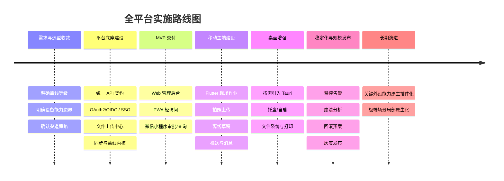

# 全平台终端技术选型研究报告

## 执行摘要

- 对于“审批 + 验收 + 拍照上传 + 附件 + 离线草稿 + 多角色审批”的工程类业务，**不建议一开始就把所有终端都做成重客户端**；最稳妥的路线通常是：**PC 端以 Web 为主、移动现场端以 Flutter 为主、微信小程序保留为轻入口、桌面原生壳按需补齐**。这一判断与 Electron、Tauri、Flutter、React Native、PWA、uni-app/小程序各自的架构、发布模型与能力边界相符。 citeturn40view0turn23view2turn17view1turn19view0turn26view0turn44view1

- 如果**必须做桌面原生能力**，在大多数企业业务场景下，**Tauri 优先级高于 Electron**：Tauri 直接利用系统 WebView，官方强调更小的二进制和更强的权限/能力边界；Electron 胜在生态更成熟、Node 桌面模块更丰富，但包体、内存、攻击面与安全治理成本都更高。 citeturn23view2turn24view0turn22view0turn25view1turn40view1turn39view0turn21view0

- 如果**现场作业端是主战场**，综合性能、一套代码双端、离线数据库、拍照/扫码/文件/推送等需求，**Flutter 是当前最平衡的移动主方案**；**原生 Android/iOS** 仍然是强外设、强打印、强蓝牙、极致性能与高合规要求下的上限方案；**React Native** 适合 React 团队，但原生模块治理、插件一致性和长期维护要求高于 Flutter。 citeturn17view2turn35view1turn17view1turn19view0turn20view0turn20view2turn42view3

- **PWA 与小程序不适合承担“重离线 + 深外设 + 深文件系统 + 深打印”的核心现场生产端**，但非常适合承接轻审批、查询、消息触达、外部协作、供应商/分包商轻入口；PWA 的安装、缓存、离线、地理位置、打印能力成熟，但蓝牙与文件系统等高级能力仍明显受浏览器、安全上下文与用户手势约束。 citeturn26view0turn26view2turn26view3turn31view0turn32view0turn32view1turn34view0turn43view0

- 明确推荐分为两层：**MVP 技术组合**建议采用“**Web 管理后台 + Flutter 现场移动 + 微信小程序保留 + PWA 轻访问**”；**长期演进路线**是在确有桌面托盘、开机自启、深文件系统、外设与本地打印需求时增补 **Tauri 桌面壳**，在极强设备集成或极高稳定性要求下，对局部关键移动能力再下沉到原生插件或原生应用。该组合在上线时效、成本、维护与长期演进之间最平衡。 citeturn25view1turn25view2turn22view0turn17view2turn26view0turn44view1

## 目录

- 决策前提与关键决策点
- 方案横向对比
- 单项技术评估
- 推荐组合与工程落地
- 成本、路线图、风险与结论
- 主要参考来源

## 决策前提与关键决策点

本报告按以下业务假设展开：你的系统属于**企业内部工程/审批/验收/资料上传类**应用，终端覆盖 **PC、手机、Web、微信小程序**，并且至少包含“审批流、验收单、拍照上传、附件、弱网草稿、消息提醒、一定程度离线”这类场景。这类应用通常不是单纯的信息展示系统，技术选型的胜负手不在“能不能做”，而在于**离线等级、原生能力深度、发布节奏、团队技能、长期供给能力**。各方案的官方文档也都清楚表明：Electron/Tauri 更偏桌面原生集成，Flutter/RN 偏移动主端，PWA 偏浏览器能力与离线缓存，uni-app/小程序更偏轻量跨端与平台生态。 citeturn40view1turn23view2turn17view2turn19view0turn26view0turn44view1turn44view3

建议先把决策拆成两个层面。第一层是**移动/现场层**：是否必须强离线、是否要蓝牙/扫码/定位/文件系统/本地数据库/推送/打印。第二层是**桌面/办公层**：是否一定要托盘、开机自启、深度文件访问、自动更新、拖拽、文件关联、静默打印、外设接入。只要其中任一层的需求超过浏览器平台边界，就不应把全部端统一压到 PWA 或小程序上。尤其是文件系统、蓝牙、系统托盘与自动启动，官方文档已经说明这些能力在桌面壳和浏览器端的边界差异非常明显。 citeturn32view0turn32view1turn31view0turn25view1turn25view2turn38view1turn38view2

下表是建议优先讨论的**关键技术决策点**。表中的“高/中/低”表示“**可行性/实现复杂度**”，例如“高/低”表示该方案可行性高、实现复杂度低；“中/高”表示能做，但工程复杂度高、风险较大。该表是基于官方能力边界与工程经验的综合判断，其中复杂度评级属于本报告的规划判断。 citeturn23view2turn22view0turn17view2turn19view0turn26view0turn31view0turn32view0turn44view3

### 移动与轻端关键决策点

| 决策点 | 原生 Android/iOS | Flutter | React Native | uni-app | 小程序 | PWA |
|---|---|---|---|---|---|---|
| 强离线与弱网草稿 | 高/低 | 高/中 | 高/中 | 中/中 | 中/高 | 中/中 |
| 拍照与扫码 | 高/低 | 高/低 | 高/中 | 高/中 | 高/低 | 中/中 |
| 定位 | 高/低 | 高/低 | 高/中 | 高/中 | 高/低 | 高/中 |
| 蓝牙 BLE | 高/中 | 高/中 | 中/高 | 中/高 | 中/高 | 低到中/高 |
| 本地数据库 | 高/低 | 高/中 | 中/中 | 中/中 | 低到中/高 | 中/中 |
| 文件系统与大附件缓存 | 高/中 | 高/中 | 中/高 | 中/高 | 低/高 | 低到中/高 |
| 推送消息 | 高/中 | 高/中 | 中/高 | 中/中 | 高/低 | 中/中 |
| 本地打印 | 高/中 | 中/高 | 中/高 | 低到中/高 | 低/高 | 中/中 |

### 桌面关键决策点

| 决策点 | Electron | Tauri | Web/PWA |
|---|---|---|---|
| 系统托盘 | 高/低 | 高/低 | 低/高 |
| 开机自启 | 高/低 | 高/低 | 低/高 |
| 深度文件系统访问 | 高/低 | 高/中 | 低到中/高 |
| 拖拽/文件关联 | 高/中 | 高/中 | 中/中 |
| 自动更新 | 高/中 | 高/中 | 高/低 |
| 本地打印与打印控制 | 高/中 | 中到高/中 | 中/中 |
| 外设/串口/USB/特殊驱动 | 高/中 | 中/高 | 低/高 |
| 安全最小权限治理 | 中/中 | 高/低 | 高/低 |

如果你必须满足以下任一项，就应把“**移动主端原生化程度**”或“**桌面壳**”提到选型前面：一是**强离线**，包括任务清单、表单、照片、附件都要在断网下可用；二是**深设备能力**，例如 BLE、U 盾、专用扫码枪、票据打印机、串口/USB 外设；三是**深桌面特性**，例如托盘、开机自启、文件目录长期授权、批量拖拽、静默打印、长驻后台；四是**高频拍照上传与本地缓存**，尤其是工地现场弱网场景。反之，如果大多数操作可以在线完成，且移动端主要是“审批、查询、签字、拍照、轻上传”，那么轻端方案的价值会明显上升。 citeturn42view3turn31view0turn32view0turn25view1turn25view2turn38view1turn38view2turn26view3

## 方案横向对比

下面两张表是**决策级总览**。第一张偏产品与研发维度，第二张偏交付与运维维度。表中“包体/内存、周数、人月”均为**中等复杂度审批 + 验收 + 拍照上传 + 离线草稿**场景下的**规划估算区间**，不是官方承诺值；其估算依据来自各框架的官方架构与发布模型，例如 Electron 自带 Chromium/Node、多进程模型，Tauri 基于系统 WebView 与 Rust Core，Flutter 为自包含构建，React Native 为 JS + 原生运行时组合，PWA 基于浏览器与 Service Worker，uni-app 则按 WebView/原生渲染双路线运行。 citeturn40view0turn40view1turn23view2turn24view0turn17view1turn35view1turn19view0turn26view0turn44view3

### 总览对比表

| 方案 | 性能 | 开发成本 | 维护成本 | 上线流程 | 用户体验 | 离线能力 | 原生能力访问 |
|---|---|---|---|---|---|---|---|
| Electron | 中 | 中 | 中到高 | 中 | 好 | 中到高 | 高 |
| Tauri | 中到高 | 中 | 中 | 中 | 好 | 中到高 | 高 |
| 原生 Android/iOS | 很高 | 很高 | 高 | 高 | 最佳 | 很高 | 最高 |
| Flutter | 高 | 中 | 中 | 高 | 很好 | 高 | 高 |
| React Native | 中到高 | 中 | 中到高 | 高 | 好 | 高 | 中到高 |
| PWA | 中 | 低 | 低 | 最低 | 中到好 | 中 | 低到中 |
| uni-app | 中 | 低到中 | 中 | 中 | 中到好 | 中 | 中 |
| 小程序 | 中 | 低 | 低到中 | 中 | 好 | 低到中 | 中 |

### 交付与运维对比表

| 方案 | 典型包体/内存规划估算 | 热更新/灰度 | 人才可得性 | 运维复杂度 | 安全性 |
|---|---|---|---|---|---|
| Electron | 120–250MB / 180–400MB | 桌面自更新成熟；Linux 需额外治理 | 高 | 中到高 | 中 |
| Tauri | 8–30MB / 40–120MB | 官方 updater，签名强约束 | 中 | 中 | 高 |
| 原生 Android/iOS | 20–80MB/端 / 50–150MB | 以商店/企业分发为主 | 中 | 高 | 高 |
| Flutter | 25–60MB / 80–180MB | 开发态 Hot Reload；生产以发版为主 | 中到高 | 中 | 高 |
| React Native | 15–45MB / 70–160MB | 开发态 Fast Refresh；生产 OTA 需框架或自建 | 中 | 中到高 | 中到高 |
| PWA | 初始 1–10MB 级资源 / 50–150MB 浏览器占用 | Web 发布即生效，SW 可控更新 | 很高 | 低 | 高 |
| uni-app | 8–30MB / 80–180MB | App 端可做升级体系，小程序走平台发布 | 高 | 中 | 中 |
| 小程序 | 无独立安装包；受平台上传包规则约束 | 平台版本发布 + 后端配置灰度 | 很高 | 低到中 | 高 |

从总览可以直接得到几个结论。其一，**“性能、原生能力、离线能力”与“研发成本、上线时效”几乎总是反向关系**：原生最好、最贵、最慢；PWA/小程序最快、最轻、但能力边界最早出现。其二，**Flutter 是移动端最均衡的中位解**；其三，**Tauri 是桌面壳中更适合企业业务软件的默认优先项**，而 Electron 更适合“生态优先、现成 Node 模块优先”的团队。其四，**uni-app/小程序更适合轻量端，不宜单独承担重离线与复杂外设主端**。这些结论与官方文档所揭示的架构边界一致。 citeturn23view2turn24view0turn22view0turn40view1turn39view1turn17view2turn19view0turn26view0turn44view1turn44view3

## 单项技术评估

### 桌面路线

**Electron** 的优势非常明确：主进程具备 Node.js 能力，官方提供窗口、对话框、托盘、自启动、自动更新等成熟桌面模块，适配复杂桌面场景和现成 Node 生态非常方便；但官方安全指南同时明确要求对远程内容关闭 Node 集成、启用 Context Isolation、启用沙箱、保持 `webSecurity` 开启，这意味着 Electron 可以做得很安全，但**安全治理不是“顺手就有”，而是工程纪律问题**。另外，官方内置 `autoUpdater` 当前只覆盖 macOS 与 Windows，Linux 需要依赖发行渠道或额外方案。 citeturn40view1turn38view1turn38view2turn21view2turn21view0turn39view0turn39view1turn39view2turn39view3

**Tauri** 更适合“企业中后台桌面化”的典型业务：官方文档强调其多进程模型、Core 进程统一 IPC 与系统权限、WebView 动态链接系统组件而非把浏览器打进安装包，因此天然更利于小体积与最小权限治理；其官方插件体系已覆盖自动更新、系统托盘、自启动、文件系统、SQL、地理位置等，并且 updater 强制签名校验、不可关闭。代价在于：桌面端虽然已很好用，但若你要吃很多非标准桌面模块、冷门外设或现成 Node 第三方库，Tauri 的“开箱即用广度”仍弱于 Electron。 citeturn23view2turn24view0turn22view0turn25view1turn25view2

因此，**桌面结论**很直接：如果你只是想把现有 Web 管理后台“套壳 + 加托盘/自启/本地打印/深文件能力”，优先选 **Tauri**；只有在你明确依赖成熟 Electron/Node 桌面生态、现成桌面插件、或者团队已深度掌握 Electron 的情况下，才把 **Electron** 放在前面。就企业审批/资料/文件类软件而言，Tauri 通常更符合长期总拥有成本目标。 citeturn25view1turn25view2turn22view0turn40view1turn21view0

### 移动路线

**原生 Android/iOS** 依旧是移动端的性能与能力上限。Android 官方体系覆盖 Camera & Media、Connectivity、Data and files，并通过 Room 提供本地数据库与离线缓存能力；Apple 原生框架则分别提供 AVFoundation、Core Location、Core Bluetooth、Core Data 等系统能力。因此在**强离线、复杂蓝牙、复杂打印、深系统集成、高稳定性**的要求下，原生方案仍最稳。缺点同样典型：双端研发与测试成本最高，交付周期最长。 citeturn42view0turn42view1turn42view2turn42view3turn29view0turn29view1turn29view2turn29view3

**Flutter** 的位置非常强：官方明确提供 Android、iOS、Windows、macOS、Linux、Web 的平台支持，也支持通过 platform channels / Pigeon / 原生绑定去访问平台能力；在持久化方面，官方文档直接把文件读写与 SQLite 持久化列为标准路径。Flutter 的发布包是自包含构建，官方也提供了 app size 度量与优化文档；开发态 Hot Reload 非常成熟。对于“审批 + 验收 + 拍照上传 + 离线草稿”这类企业业务，Flutter 的综合收益通常优于 React Native。 citeturn17view2turn35view0turn35view1turn35view2turn35view3turn17view1turn36view0

**React Native** 当前依然是可行方案，尤其适合已有 React 人才和组件资产的团队。官方新架构说明里强调：JSI 用于替换旧异步 Bridge，目标是减少序列化成本、改善高质量交互场景；同时官方明确 Fast Refresh 属于开发态能力，并推荐使用以 Expo 为代表的框架化方式来组织生产级应用。换句话说：RN 没问题，但它比 Flutter 更依赖“插件组合、原生模块治理、团队规范”三件事是否做得漂亮。对中后台/工程类业务，这意味着**团队经验将决定 RN 的上限**。 citeturn19view0turn20view0turn20view2turn17view3

因此，**移动结论**是：如果你现在还没定技术栈，且现场端存在拍照、附件、离线草稿、推送、一定设备能力诉求，优先排位应是 **Flutter > React Native > uni-app**；如果蓝牙/打印/专有设备/极致流畅度很强，则提升为 **原生或 Flutter + 原生插件**。 citeturn17view2turn19view0turn44view3turn42view3

### Web、PWA、uni-app 与小程序路线

**PWA** 不该被低估。官方文档明确指出，PWA 通过现代 Web API 获得 installability、可靠性与增强能力，Service Worker 是离线、缓存、推送等能力的基础；离线数据可由 Cache Storage 与 IndexedDB 组合管理；地理位置、打印也都有成熟 Web API；文件系统与蓝牙也已存在，但明显受安全上下文、用户手势与浏览器支持差异约束。对企业应用来说，PWA 的真正价值是：**它是最便宜的跨设备覆盖层，也是最适合作为外部协作入口与轻办公入口的技术**。 citeturn26view0turn26view1turn26view2turn26view3turn34view0turn43view0turn31view0turn32view0turn32view1

**uni-app** 的优势在中国企业场景里非常现实：官方明确说明“一套代码可发布到 iOS、Android、Web，以及各种小程序”，且 App 端既可以 WebView 渲染 `.vue` 页面，也可以用 `.nvue` 做原生渲染，还支持 UTS/原生 SDK 集成。这意味着如果你的团队已经是 Vue/小程序路线，uni-app 在“多端快速交付、招聘、维护、与微信生态协同”方面会非常有吸引力。它的问题不在“能不能做业务”，而在于**当业务从轻审批升级为重离线、重外设、重原生集成时，复杂度会快速上升**。 citeturn44view1turn44view3

**小程序** 的定位最清楚：它非常适合作为审批、待办、消息、查询、表单填报、轻拍照上传的随手入口，但不适合作为重离线、深文件系统、复杂蓝牙、复杂打印的核心生产终端。对企业来说，小程序最大的价值不是替代 App，而是降低触达门槛、提升首用转化，尤其适合领导审批、供应商协作、临时外部用户与弱使用频次用户。就你这个场景而言，**小程序应该“保留”，但不应承担最重的现场能力**。这一判断与 uni-app 官方多端定位、PWA/浏览器能力边界是一致的。 citeturn44view1turn44view3turn26view0turn32view0turn31view0

### 各方案实施估算与兼容性画像

下表给出你要求的“**开发周期估算、包体/内存、热更新/灰度、API/鉴权兼容性要点、能力支持**”。其中周期与人月为**客户端侧粗估**，默认后端 API 已同步推进，不含核心后端重构；包体与内存为规划值；“热更新”区分**开发态热重载**与**生产态灰度更新**。表中策略性的 API/鉴权建议属于本报告的工程推荐。官方依据主要来自各框架架构、平台能力与发布文档。 citeturn21view0turn22view0turn17view1turn17view2turn19view0turn20view0turn26view0turn44view1turn11view0turn27view1turn27view2

| 技术 | 中等复杂度开发周期 | 粗略人月 | 典型包体/内存估算 | 热更新/灰度发布 | API/鉴权兼容要点 | 插件/原生能力支持摘要 |
|---|---:|---:|---|---|---|---|
| Electron | 8–12 周 | 2–3.5 | 120–250MB / 180–400MB | 官方 autoUpdater；可做渠道灰度；Linux 另治 | 最适合直接复用 Web API；SSO 建议走系统浏览器或安全内嵌流程；本地能力通过 preload/IPC 暴露 | 摄像头、打印、文件系统、托盘、自启、通知、SQLite/IndexedDB 均可 |
| Tauri | 9–14 周 | 2.5–4 | 8–30MB / 40–120MB | 官方 updater；签名验证强制；可配多渠道 | 适合复用 Web API；建议把敏感鉴权逻辑放 Rust/Core 或后端；本地能力经 capability/permission 放权 | 托盘、自启、文件系统、地理位置、SQL、更新等官方插件较全 |
| 原生 Android/iOS | 16–24 周 | 8–12 | 20–80MB/端 / 50–150MB | 商店测试/灰度/企业分发 | 最适合 OAuth2/OIDC/SSO 原生接入；设备标识、证书、推送与后台唤醒能力最完整 | 摄像头、扫码、定位、蓝牙、打印、文件系统、推送、本地 DB 全面 |
| Flutter | 12–18 周 | 4–6 | 25–60MB / 80–180MB | 开发态 Hot Reload；生产以商店/企业发版为主；业务配置可服务端热更 | JSON/REST、GraphQL、JWT/OIDC 均友好；建议统一 Token 容器与离线同步模块 | 摄像头、扫码、定位、蓝牙、文件、推送、SQLite/本地 DB 能力强 |
| React Native | 12–18 周 | 4.5–7 | 15–45MB / 70–160MB | 开发态 Fast Refresh；生产 OTA 通常依赖框架或自建 | 与 Web 鉴权模型高度一致；但原生登录、推送、加密存储更依赖模块治理 | 摄像头、扫码、定位、蓝牙、推送、离线 DB 可做，但社区模块治理成本更高 |
| PWA | 6–10 周 | 2–3.5 | 初始资源 1–10MB / 浏览器占用 50–150MB | Web 部署即生效；SW 可控更新灰度 | 最适合 JWT/OIDC + BFF；必须 HTTPS；SSO、Cookie、前后端跨域策略要早设计 | 相机、定位、打印、缓存/IndexedDB 强；蓝牙/文件系统/推送有浏览器差异 |
| uni-app | 8–14 周 | 3–5 | 8–30MB / 80–180MB | App 端可做升级体系；小程序端走平台发布 | 最适合统一 Vue/小程序风格 API；鉴权可共用后端契约，但平台差异兼容需治理 | 相机、扫码、定位、推送、文件上传常规可行；复杂 BLE/打印/外设视插件质量 |
| 小程序 | 4–8 周 | 1.5–3 | 无独立安装包；运行时受平台约束 | 平台版本发布 + 后端配置灰度 | 适合短会话、轻审批、微信登录/企业身份桥接；不要把复杂鉴权状态留前端太久 | 相机、扫码、定位、上传很好；强离线、深文件、复杂打印与外设不宜做核心 |

## 推荐组合与工程落地

### 推荐技术栈组合

如果不考虑历史包袱，仅从你的业务形态和全平台目标出发，我给出的**默认推荐组合**是：

**PC 管理后台：Web 优先，按需补 Tauri；现场移动主端：Flutter；微信小程序保留；PWA 作为轻协作入口。** 这个组合在绝大多数中型企业、项目制组织、集团二级单位场景下最平衡。原因有三点。第一，PC 管理后台本质仍是复杂表格、流程、主数据、台账、文档协作，Web 是主形态；只有确实需要托盘、自启、深文件与本地打印时，再把同一套前端装进 Tauri 壳。第二，现场移动端是价值核心，Flutter 适合把离线数据库、拍照上传、扫码、消息、附件与复杂表单一次性做稳。第三，小程序保留对领导审批和外部协作很有价值，但不要把它当“重现场端”。 citeturn25view1turn25view2turn22view0turn17view2turn35view1turn26view0turn44view1

如果你的团队**已经深度投入 Vue/uni-app**，且短期上线时效非常紧、现场端的离线需求只是“离线草稿 + 弱网重试”，而不是“完整离线任务作业”，那么可以采用 **Web + uni-app App + 微信小程序** 作为更快的交付路线。这套组合更适合**小团队、预算有限、以审批/查询/拍照上传为主、外设需求较轻**的企业。不过需要明确：它适合作为**快交付路线**，不一定是五年视角下的最优长期承载。 citeturn44view1turn44view3

如果你属于**大型企业/集团化/设备集成很多/现场重离线**的场景，则建议采用更重的路线：**Web 管理后台 + Tauri 桌面壳 + Flutter 移动主端 + 小程序轻入口**；再把其中蓝牙、静默打印、专有扫码、边缘设备等能力通过 Flutter 原生插件或局部原生模块补齐。只有当某类现场流程确实需要“原生级性能与设备能力上限”时，再局部下沉为原生 Android/iOS，而不是一开始就全量双原生。 citeturn22view0turn25view1turn17view2turn42view3

### 适用企业画像

| 推荐组合 | 适用假设 | 优势 | 劣势 |
|---|---|---|---|
| Web + PWA + 微信小程序 | 小团队、预算紧、离线弱、上线急 | 最快、最便宜、覆盖广 | 现场能力上限低 |
| Web + Flutter + 微信小程序 | 中型企业、移动现场较重、希望一套代码双端 | 综合最平衡、长期性好 | 需要建立移动研发规范 |
| Web + Tauri + Flutter + 微信小程序 | 中大型企业、桌面原生需求明确、移动现场重 | 能力完整、长期架构清晰 | 建设成本更高 |
| Web + uni-app + 微信小程序 | 已有 Vue/uni-app 基础、追求快速交付 | 人才易找、上手快、微信生态顺 | 重离线/深设备能力天花板较早 |
| 原生 Android/iOS + Web + 小程序 | 超重设备、超高稳定性/合规、预算充足 | 移动能力与性能上限最高 | 成本最高、双端维护重 |

### API 与鉴权兼容性要求

不管前端组合怎么选，**后端 API 契约必须先统一**。我的建议是采用“**单域 API Gateway/BFF + 统一 JSON 契约 + 端能力扩展头**”模式。PC Web、Tauri/Electron、Flutter、RN、PWA、uni-app、小程序都共用同一套业务 API；差异只体现在终端能力协商，例如 `X-Client-Platform`、`X-App-Version`、`X-Device-Id`、`X-Network-State`、`X-Offline-Capable`。这样做的核心好处是：**业务规则不跟着终端走，终端只负责呈现和本地缓存**。这一层属于工程建议，但和各方案官方所支持的网络、JSON、平台桥接模型是兼容的。 citeturn17view2turn20view2turn26view0turn44view3

鉴权建议统一到 **OAuth2/OIDC + 企业 SSO** 的思路上，同时坚持“**公有客户端不持有真正机密**”的原则。移动 App、桌面壳、PWA、小程序都应使用统一的登录编排，但令牌存储、刷新策略、单点登录桥接方式按终端分层实现：移动和桌面壳建议支持系统浏览器回跳式登录；PWA 与 Web 用标准 Web 会话；小程序则通过平台登录凭证换后端会话，不把复杂权限计算放在小程序前端。对于 App Store 审核类渠道，还要提前准备**可审查账号、可用后端、可演示数据**，Apple 官方已明确这是审核的基础要求。 citeturn11view0

同时，务必把**可变业务配置服务端化**。审批流定义、表单 schema、字典、权限位、按钮策略、文书模板、打印模板、上传策略、消息模板，都应由服务端下发并做版本化。这一设计有两个收益：一是减少客户端频繁发版；二是让 Flutter、PWA、小程序都能消费同一套动态配置。这一点对你当前这种流程系统尤其重要，因为多端真正难的不是页面数，而是配置一致性。 

### 数据同步与离线策略

离线策略要分级，而不是“一刀切”。建议把终端分成三类。**强离线端**是 Flutter 或原生移动：支持任务列表、表单草稿、图片队列、附件元数据、本地字典、操作日志、本地签字图片等完整离线缓存。**弱离线端**是 PWA、uni-app、部分桌面壳：支持最近任务、表单草稿、查询缓存、失败重试，不做完整附件双向同步。**轻离线端**是小程序：只保留必要草稿与少量缓存，不承担复杂冲突处理。Android 官方 Room 文档也明确指出，本地结构化数据缓存的主要价值之一就在于“网络不可达时用户仍可浏览内容”，这与企业审批/现场采集场景完全一致。 citeturn42view3

具体同步模型建议统一成 **Outbox / Inbox + Cursor Sync**。也就是：本地所有“待上传变更”进入 Outbox，所有“服务端增量更新”按业务对象 cursor 拉取。表单与审批动作做幂等设计，附件走分片/断点续传，图片先本地落盘、压缩、生成缩略图，再后台上传。冲突策略要提前定清楚：审批类通常用“**服务端权威 + 客户端重放**”，草稿类可以“**最新编辑优先**”，主数据类可以“**版本号冲突提示人工处理**”。这套策略与 Flutter/原生的本地数据库能力最匹配，PWA 与 uni-app 也能承接简化版。 citeturn26view2turn26view3turn17view2turn42view3turn44view3

对于附件与照片，要格外注意：**离线不等于把大文件长期堆在客户端**。建议只对“未提交、近 7 天、当前项目、最近任务”做附件缓存，历史附件默认在线拉取。这样可以显著控制移动端存储增长与同步时长。PWA 官方资料同样强调了 Cache Storage 与 IndexedDB 各自的边界：前者更适合 URL 资源，后者更适合结构化数据。企业项目里最好不要把所有二进制都塞进 IndexedDB。 citeturn26view2turn26view3

### CI/CD 与发布流程

全平台的 CI/CD 不应按“一个仓库一个流水线”想，而要按“**一个业务版本，多终端交付渠道**”来设计。建议把流水线拆成五层：代码质量层、共享契约层、终端构建层、渠道发布层、观测回滚层。共享契约层至少要输出：OpenAPI/JSON schema、表单 schema、权限位映射、字典版本、移动离线迁移脚本。终端构建层再分别产出 Web/PWA、Flutter、桌面壳、小程序产物。这样可以把“后端接口已变更、某一端忘记跟进”的风险降到最低。 

发布渠道方面，**iOS** 需要纳入 App Store/TestFlight 或企业分发节奏，Apple 明确要求上线应用遵守审核规范，并在审核时提供完整元数据、可用演示账号与可访问后端；对于纯内部分发，Apple Developer Enterprise Program 只适用于大型组织的内部专有应用。**Android** 建议统一采用 App Bundle，并把内部测试、封闭测试、开放测试、生产发布纳入 Play 流程；Google 官方明确提供 internal/closed/open testing，并要求在生产发布前完成测试。**桌面端** 则由 Electron/Tauri 分发 DMG、MSIX、Windows Installer 等；Electron 内置 autoUpdater 覆盖 macOS/Windows，Tauri 则有跨平台 updater 且要求更新签名。**PWA** 走 Web 发布与 Service Worker 版本管理；**小程序** 则纳入平台提审与发布节奏。 citeturn11view0turn27view3turn12view0turn27view1turn27view2turn21view0turn22view0turn17view0turn26view1

建议的渠道发布基线如下表：

| 渠道 | 推荐产物 | 灰度方式 | 必要控制点 |
|---|---|---|---|
| App Store | IPA/TestFlight | TestFlight 分批、正式版分阶段 | 审核账号、演示数据、隐私说明、发版节奏 |
| Google Play | AAB | Internal/Closed/Open/Production | Play App Signing、预发布测试、版本轨道 |
| iOS 企业分发 | 企业签名包/MDM | 组织内按部门或设备组投放 | 仅适合大型组织内部专有应用 |
| Android 企业分发 | AAB/APK + MDM/内部分发 | 组织内白名单灰度 | 设备策略、安装源与合规 |
| 桌面分发 | DMG/MSIX/Windows Installer | 渠道 JSON/更新源分流 | 代码签名、自动更新、回滚 |
| PWA | 静态资源 + SW | SW 分批、CDN/配置开关 | 资源版本、缓存失效、回滚开关 |
| 小程序 | 平台上传包 | 平台发布 + 后端开关 | 提审说明、版本回收、灰度配置 |

## 成本、路线图、风险与结论

### 开发与运维成本估算

如果按客户端侧投入粗估，不含核心后端重构、但包含基本测试、打包、环境与发布脚本建设，那么成本大致如下。**MVP 轻量路线**（Web + PWA + 小程序）约 **4–7 人月**，成本等级 **低**。**平衡路线**（Web + Flutter + 小程序）约 **8–12 人月**，成本等级 **中**。**完整全平台路线**（Web + Flutter + Tauri + 小程序）约 **10–16 人月**，成本等级 **中到高**。**重原生路线**（Web + 原生 Android + 原生 iOS + 小程序）约 **14–22 人月**，成本等级 **高到很高**。这些估算的本质不是“谁最便宜”，而是“谁能把投入集中到真正产生业务价值的终端上”。 

运维成本也要按终端数量乘上发布渠道复杂度来算。通常情况下，**多做一个重客户端，不只是多一个前端项目，而是多一套发版、监控、崩溃、升级、回滚、兼容性测试与插件治理体系**。因此从总拥有成本看，很多企业真正应该优化的不是“统一技术栈”，而是“控制高成本终端的数量”。这也是为什么我不建议把桌面壳、原生 App、小程序、PWA 全部都做成重度一等公民。 

### 实施路线图与优先级

建议路线图遵循“**先统一后分化，先主价值端后补充端，先契约与同步内核再做终端铺开**”的顺序。先把 API、鉴权、动态表单、离线同步、文件上传、消息通道这些跨端共性底座打稳，再让 Web、Flutter、小程序逐步并行；桌面壳则只在确有需求后引入。该顺序能显著降低返工率。 

更细一点看，**阶段优先级**建议是：

1. **MVP**：Web 管理后台、统一 API/鉴权、PWA/微信小程序轻审批，先把流程跑通。  
2. **阶段迭代**：Flutter 移动主端上线，补齐离线草稿、拍照上传、附件队列、消息中心。  
3. **阶段增强**：若出现桌面托盘、自启、批量资料处理、本地打印等需求，再引入 Tauri。  
4. **长期优化**：对少数强设备能力场景，用 Flutter 原生插件或局部原生模块增强，必要时极少量功能原生化。  

### 风险与缓解措施

最大的风险通常不是技术本身，而是**把所有端做成同等级、同优先级**。这会导致路线过重、上下游不同步、端间能力不一致和长期维护成本失控。缓解方式是：明确“主端、辅端、入口端”三级分工，让 Flutter 或原生承担重现场能力，让 Web/Tauri 承担重后台能力，让小程序/PWA 承担轻入口能力。 

第二个高风险点是**离线同步与附件队列**。这类项目最容易在上线后暴露出重复提交、冲突覆盖、图片堆积、缓存膨胀等问题。缓解措施不是换框架，而是提前建立对象版本号、幂等键、Outbox、增量 cursor、失败重试、附件清理与回滚策略。 

第三个风险点是**桌面壳与浏览器边界不清**。很多团队会一开始就上 Electron，最后发现只是为了“本地打印”和“文件选择”付出了很高代价。缓解方式是先问清楚：有没有托盘？有没有开机自启？有没有深文件目录读写？有没有外设？如果没有，先不要上桌面壳。 

第四个风险点是**插件生态质量**。React Native、uni-app、甚至 Flutter 都可能在冷门插件上踩坑。缓解方式是对蓝牙、打印、扫码、推送、地图、加密存储、离线数据库这几类高风险能力先做 POC，再决定是否把主端押在某个框架上。 

### 决策建议

基于企业规模、预算、上线时效、用户分布与离线需求，我给出明确建议如下：

**适合小团队/预算紧/上线急/离线较弱**：  
选 **Web 管理后台 + PWA + 微信小程序**。  
不要一开始做桌面壳，也不要一开始做双端原生。  
适合审批、查询、消息、轻拍照上传、供应商协作。  

**适合中型企业/现场作业较重/需要中长期演进**：  
选 **Web 管理后台 + Flutter 移动主端 + 微信小程序保留**。  
这是我对你当前项目的**首选组合**。  
如果后续出现桌面原生需求，再加 **Tauri**，不要提前加 Electron。  

**适合大型企业/集团化/强离线/强设备/强桌面集成**：  
选 **Web 管理后台 + Flutter 移动主端 + Tauri 桌面壳 + 微信小程序轻入口**。  
其中蓝牙、静默打印、专用设备等关键能力通过原生插件增强。  
只有极端场景再局部原生化。  

**仅在以下情况下优先 Electron**：  
一是团队已有成熟 Electron 经验与资产；  
二是必须大量复用 Node/Electron 桌面生态；  
三是包体和内存不是关键约束。  
否则，企业中后台桌面化更建议 **Tauri**。 citeturn21view0turn39view0turn23view2turn22view0

### 明确推荐

**MVP 技术组合**：  
**Web 管理后台 + Flutter 现场移动 + 微信小程序保留 + PWA 轻访问；桌面壳暂缓，只有明确需求时引入 Tauri。**

**长期演进路线**：  
**先统一 API/鉴权/离线同步底座，再以 Flutter 承担移动主端、Tauri 承担少数重桌面能力、小程序/PWA 承担轻入口；对极少数强设备能力场景做原生插件化，必要时再局部原生化。**

### 开放问题与局限

本报告对 **Electron/Tauri/Flutter/React Native/PWA/uni-app/Android/iOS/App Store/Google Play** 的官方资料核验较充分；对**微信小程序平台后台的最新发布细则、包大小与灰度细节**，本次没有逐页核验到 2026 年全部官方页面，因此文中对小程序发布流程采取了相对保守、原则性的表述。另需说明的是：**包体大小、运行内存、开发周期、人月**均为规划估算，不应当被当作框架官方承诺值；最终结果会显著受到地图/推送/音视频/加密/文档预览/拍照压缩链路等 SDK 组合影响。 

## 主要参考来源

以下为本报告采用的主要优先来源；均为官方文档或官方帮助中心，少量为 MDN/Chrome 官方资料与 uni-app 官方文档：

- Electron 官方文档：Process Model、Security、autoUpdater、Tray、app、dialog。 citeturn40view0turn40view1turn40view2turn39view0turn39view1turn39view2turn39view3turn21view0turn21view2turn38view1turn38view2
- Tauri 官方文档：What is Tauri、Process Model、App Size、Updater、Autostart、System Tray。 citeturn17view0turn23view2turn24view0turn22view0turn25view1turn25view2
- Flutter 官方文档：Measuring app size、Platform channels、Supported platforms、Hot reload。 citeturn17view1turn17view2turn35view0turn35view1turn35view2turn35view3turn36view0
- React Native 官方文档：New Architecture、Fast Refresh、Environment setup、PushNotificationIOS。 citeturn19view0turn20view0turn20view2turn17view3
- Android 官方文档：Android Developers Overview、Room 本地数据库。 citeturn42view0turn42view1turn42view2turn42view3
- Apple 官方文档：App Review Guidelines、Apple Developer Enterprise Program。 citeturn11view0turn27view3
- Google Play 官方文档：Android App Bundle、Testing tracks、Release 流程。 citeturn12view0turn27view0turn27view1turn27view2
- PWA / Web 官方资料：web.dev Learn PWA、Offline data，Chrome for Developers 的 Web Bluetooth、File System Access，MDN 的 Geolocation 与 print。 citeturn26view0turn26view1turn26view2turn26view3turn31view0turn32view0turn32view1turn34view0turn43view0
- uni-app 官方文档：产品介绍、跨端能力、运行时与渲染模式。 citeturn44view1turn44view3