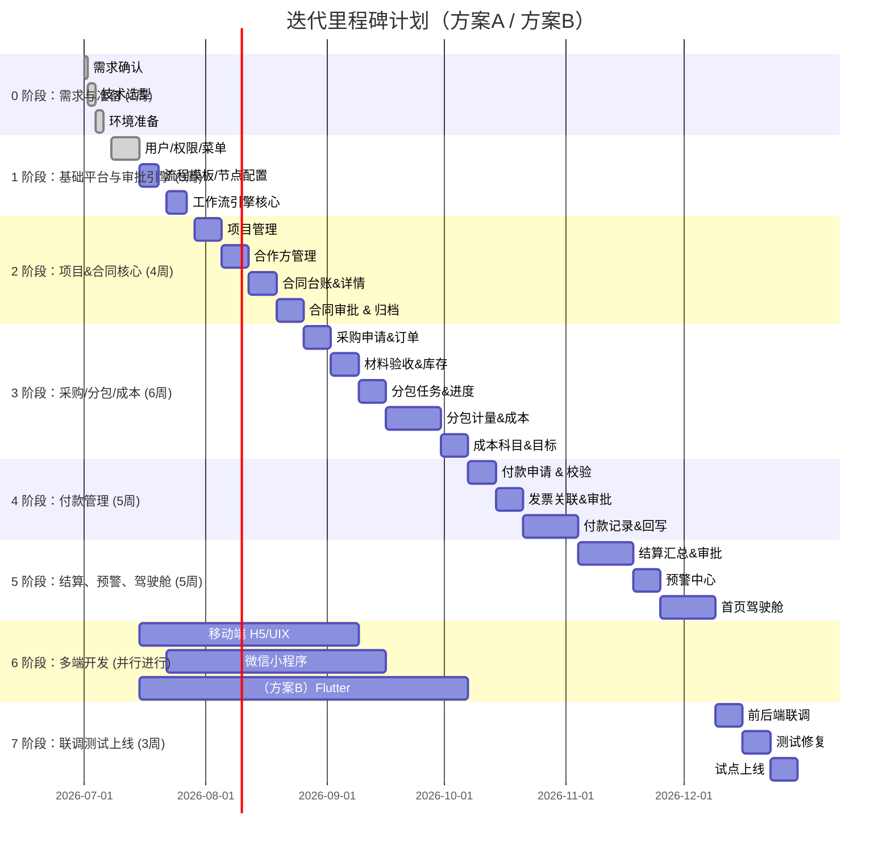

# 建筑工程总包项目全过程管理系统开发计划书（更新版）

## 概要

为满足**PC Web 管理后台**与现场**多端（手机 H5、微信小程序、桌面壳）**协同办公需求，本计划书在前期方案基础上，扩展了全平台终端支持和离线能力设计。核心目标依然是以**项目为根、合同为纲、数据全链路闭环**，覆盖项目、合同、采购、分包、成本、付款、结算等全过程，同时支持顺序审批、会签/或签/转办/加签/撤回等复杂流程。强调全平台统一后端与数据契约、统一审批引擎和权限体系，并引入强/弱/轻离线策略保障工地弱网场景下的业务连续性。本文详细列出可交付范围 (P0/P1/P2)、多端技术选型对比、架构方案、审批与离线设计要点、数据库扩展、CI/CD 运维、测试矩阵、人员分工与工期里程碑、验收标准等，确保最终方案可落地执行。

## 1. 项目背景与目标

本系统面向集团总包单位及项目现场全程管理需求：贯通项目→合同→采购→分包→成本→付款→结算各环节数据链路，形成闭环管理。目标是构建统一的**合同中心**、**项目主线**和**成本归集中心**，所有业务数据关联 `project_id`（项目）、`contract_id`（合同）、`partner_id`（合作方）三条主线，实现财务闭环和经营分析。主要目标包括：  
- 统一审批引擎，支持顺序审批、会签、或签、转办、加签、撤回、驳回重提等多种流程模式；  
- 所有审批动作由后端返回可用操作，前端仅渲染按钮，无需独立判断流程；  
- 核心业务模块（项目、合同、采购、验收、计量、成本、付款、结算等）与审批引擎深度集成，自动生成成本和预警；  
- 支持多终端协同（PC 管理后台、现场移动 H5、微信小程序、可选桌面壳/跨平台 App），并行推进，提升现场使用效率；  
- 全面考虑弱网/离线场景：离线暂存数据、消息队列同步、前端自动重试、全链路幂等控制；  
- 提供角色化驾驶舱和预警中心，为项目经理、商务经理、成本经理、财务、管理层提供不同视角的运营看板。

## 2. 功能范围

根据业务优先级，划分 P0（核心必须）、P1（重要可延后）、P2（后续升级）范围：

- **P0 最小可交付范围：**  
  - **项目管理**：项目台账、新建/编辑项目、成员配置、项目看板。  
  - **合同管理**：合同台账、新建合同（含清单、付款条件、附件）、合同详情、合同审批、合同归档。  
  - **合作方管理**：合作方台账、详情、黑名单控制。  
  - **基础平台**：用户/角色/权限管理、组织架构、字典管理、文件上传。  
  - **审批引擎**：流程模板配置、审批实例流转、待办/已办/抄送、审批记录留痕。支持顺序、会签、或签、转办、前后加签、撤回、驳回重提。`current_round`跟踪审批轮次，`nodeInstanceId`记录节点实例。后端返回可用操作集合。  
  - **采购与验收**：采购申请→订单流程，材料验收、入库出库、库存台账。  
  - **分包管理**：分包任务下达、进度更新、计量填报。  
  - **成本管理**：目标成本编制、成本明细自动生成（验收→材料成本、计量→分包成本），成本科目管理。成本明细可通过 `source_type/source_id` 追溯来源单据。  
  - **付款管理**：付款申请（关联合同、验收、计量依据）、付款审批、付款记录、发票登记。**核心功能：待办审批、校验合同/验收金额约束**。  
  - **结算管理**：分包/采购/总包结算汇总、结算明细追溯、结算审批、归档。  
  - **多端功能**：PC Web 提供完整界面，移动 H5/小程序覆盖高频需求（见下文 P0 移动端功能），前后端统一契约。  
  - **报表驾驶舱**：项目/合同概览、待办、预警统计。  

- **P1 次要功能**：  
  - **成本预算与动态成本分析**：目标成本比较、偏差预警。  
  - **合同变更与现场签证**：变更流程、验收签证单据、成本影响。  
  - **质量安全管理**：整改任务、质量、安全上报与闭环。  
  - **财务接口**：付款/发票与财务系统对接（先可人工回写）。  
  - **常用报表导出**：合同汇总表、付款统计表、成本明细表等 Excel 导出。  
  - **移动增强**：扫码工具、消息通知（微信订阅）、部分移动表单优化。  

- **P2 后续扩展**：  
  - **移动 App（原生/Flutter）**：完善移动端至近似 APP 体验。  
  - **桌面壳**：如有需求，可采用 Tauri/Electron 封装 PC 端。  
  - **OCR 发票、AI 风险分析**、**BI 大屏** 等高级功能。  
  - **第三方接口**：深度ERP对接、供应链数据接入等。  

> **P0 移动端高频功能**：现场人员使用的必备功能，包括「我的待办」（审批签署、转办、加签、撤回），「项目速览」（所负责项目概览），「材料验收单」拍照上传与提交，「现场签证」拍照定位上报，「质量整改」上传照片复查，以及扫描条码/合同号快速查询单据等。这些功能均应支持离线草稿和自动同步。

## 3. 多端技术选型对比

### 3.1 终端技术选型

本文重点比较 PC Web、桌面壳、移动原生/跨平台、PWA、小程序等方案，各技术方案优缺点列于下表（开发成本/维护成本按团队熟悉度和生态成熟度评估）：

| 平台/方案      | 优点                                | 缺点                                      | 适用场景               | 开发成本     | 维护成本     | 包体/性能/离线支持                      |
|:--------------|:---------------------------------|:----------------------------------------|:--------------------|:----------|:----------|:------------------------------------|
| **PC Web (Vue 3)**  | 成熟的企业后台生态，开发效率高；UI丰富（AntD Vue/Element Plus）；热更新便捷，无需安装；平台兼容性佳（跨 Windows/Mac/Linux） | 纯Web前端，不支持离线存储；在移动端体验一般               | 后台管理系统：合同台账、审批配置、图表驾驶舱等   | 较低（团队熟悉） | 较低（生态成熟） | 无包体限制；性能依赖浏览器；可通过 PWA 支持离线缓存（缓存静态资源） |
| **桌面壳：Electron** | 零学习成本（JS/TS全栈）；插件生态成熟，上手快；兼容性强（支持 Win7+/macOS 等）；功能接近原生桌面（系统通知、文件访问等） | 应用体积大（100–300MB）；内存占用高（200–500MB）；启动慢；安全需手动加固（开启 `contextIsolation` 等） | 需要丰富桌面功能的管理系统；不介意较大资源占用   | 低（JS生态）  | 低（成熟稳定） | 包体大；性能依赖 Chromium；不适合极低配设备；可通过本地存储实现离线功能 |
| **桌面壳：Tauri**    | 应用体积小（4–12MB）、启动快、内存占用低；基于系统 WebView，性能优越；本身安全性更高（Rust 后端沙箱） | 学习成本高（需要 Rust 开发能力）；社区生态小，部分功能需自己造轮子；跨平台兼容性依赖系统 WebView（Win7 及以下不支持，需 WebView2） | 对资源敏感的场景；已有Rust后台或设备性能受限时；需极致小体积 | 较高（需Rust团队） | 较高（生态不完善） | 包体小，性能好；但功能接口需要 Rust 封装；离线能力类似于 Electron，可用本地 DB+队列实现 |
| **移动原生 (Android/iOS)** | 最佳性能和原生体验，完全支持离线存储与多媒体；可深度调用设备功能 | 开发成本高（双平台两套代码），维护成本高；迭代发布耗时（应用商店审核） | 追求极致用户体验或需要复杂硬件交互时 | 高（双平台）  | 高（两套代码） | 包体大（几十 MB 起）；性能优异；支持全面离线和后台任务 |
| **Flutter**     | 跨平台（iOS/Android/Web/Desktop）高性能框架；UI 组件丰富，热重载加快迭代；单一代码库减少多端开发成本 | 学习成本（Dart 语言，需团队掌握 Dart/Flutter）；包体较大（基础框架约6-10MB+）；生态成熟度介于原生与 JS 间 | 需要兼顾多平台APP（含Web/桌面）的项目；预算允许时 | 中等（需学Dart） | 中等（插件多、社区活跃） | 包体 ~20MB起（含引擎）；性能优异，帧率高；离线支持健全（可内置本地 DB、持久化队列） |
| **uni-app**    | 一套 Vue.js 代码生成 iOS/Android/Web/小程序；学习门槛低（前端团队易上手）；支持原生组件，体积小；适合快速开发和迭代 | 对高级功能扩展受限（需要自写或插件扩展）；在大型复杂 UI 性能一般；生态相对小程序原生稍弱 | 需要覆盖多端（H5+小程序+App）且团队熟悉 JS/Vue | 低（Vue 生态） | 低（JS生态） | 包体相对小（按 App ~10-20MB）；性能中等；可用离线缓存（LocalStorage/SQLite）和队列实现离线支持 |
| **PWA (渐进式Web)** | 跨平台支持：在浏览器即可运行；无需安装，更新快捷；利用 Service Worker 可实现离线访问；可被搜索引擎索引 | 访问原生能力受限（Web API不及原生全面）；低端设备性能可能不佳（JS引擎效率）；浏览器兼容需关注 | 对 SEO 友好、预算有限需快速上线的内容/工具类应用 | 较低（Web 技术） | 较低（依赖浏览器） | 无包体大小限制；加载取决网络；支持离线缓存（Service Worker）但功能有限 |
| **微信小程序** | 用户无须下载安装、使用门槛低；渲染流畅、资源占用低；丰富原生组件，支持摄像头/定位等；良好的社交平台流量 | 运行于微信容器，功能受限（API受平台审核）；发布需微信审核，更新较慢；脱离微信需打包技术支持 | 面向项目现场人员的轻量化快速操作场景（拍照上报、审批） | 低（小程序框架） | 低（平台生态） | 包体小；页面切换快；可内置缓存或离线包；支持部分离线功能（如离线缓存图片、草稿） |

- **备注：** 针对桌面客户端，**Electron** 技术成熟，适合大部分企业内部管理应用；**Tauri** 适合对资源占用极其敏感或已有 Rust 团队的场景。针对移动端，**Flutter** 性能优越但学习成本较高；**uni-app** 复用 Vue 技术栈，上手快，但在功能扩展性上较弱。**PWA** 虽跨端无安装优势，但设备访问受限；**小程序**体验流畅、天然支持离线安装，但受制于微信生态。

### 3.2 技术栈选型

- **前端（PC Web）**：Vue 3 + TypeScript + Vite + Ant Design Vue + Pinia + VxeTable + ECharts。使用响应式组件库和动态表单渲染。Ant Design Vue 易于创建企业后台界面。审批时间轴、操作区等组件自研。统一的前后端 JSON 契约降低复杂度。
- **前端（移动 H5/小程序）**：**方案A** 采用 uni-app + Vue3；**方案B** Flutter 单独前端。Uni-app 允许共用一套逻辑、组件，适合前端团队。小程序直接使用 uni-app 或其原生框架。界面以卡片列表、抽屉、拍照组件为主，简化PC端布局。
- **后端**：Java 21 + Spring Boot。使用 MyBatis-Plus 编写 SQL，保证复杂查询性能。授权可用 Spring Security 或 Sa-Token 实现 RBAC + 数据权限。审批引擎使用轻量自研实现业务（详见第5节）。使用 Jackson 处理 JSON，Hibernate Validator 进行参数校验。保持统一接口风格、错误码规范。
- **数据库**：PostgreSQL（支持 JSONB 优化审批规则、表单Schema等半结构化数据）。分库方案：当前采用单库，模块表名前缀区分。关键字段索引与多维过滤预先设计。
- **中间件**：Redis（缓存用户会话、权限、字典项、待办计数、幂等键）；MinIO（对象存储合同、照片、发票等附件）；RabbitMQ（异步消息：审批完成->触发成本生成、付款推送、预警通知）；XXL-JOB（定时统计、预警检查）。
- **部署运维**：Docker + Nginx。前后端镜像分离，通过 GitLab CI/CD 自动化构建部署。测试/生产环境隔离。监控：Spring Actuator、Prometheus+Grafana。日志集中：可接ELK/Loki。必要时后期可拆分微服务。

> **技术契约原则：** 所有关键业务接口采用统一版本前缀（如 `/api/v1/...`），并通过 `X-Client-Type` 等请求头区分调用终端。前端不自行判断审批流程、权限等，所有逻辑由后端统一返回。前端展示层仅负责动态渲染、表单提交、数据可视化，不与业务规则耦合。

## 4. 平台方案对比（方案A / 方案B）

本项目考虑两种跨平台开发路线：

- **方案A（推荐）**：**Vue3+uni-app**。PC Web 管理后台使用 Vue3，移动端使用 uni-app（H5、小程序、App统一代码）。桌面客户端（可选）使用 Tauri 封装 Web 应用（或 Electron）。  
- **方案B**：**Vue3+Flutter**。PC Web 管理后台使用 Vue3，移动端使用 Flutter（单独开发 iOS/Android/Web）。桌面客户端可选 Electron/Tauri（使用 Flutter Desktop 或 Web 包）。

| 项目                    | 方案A（Vue3 + uni-app）                 | 方案B（Vue3 + Flutter）              |
|-----------------------|:---------------------------------:|:-------------------------------:|
| **前端团队技能要求**      | 精通 Vue/JS；可快速上手 uni-app 跨端开发；无需掌握新语言 | 需要额外 Dart/Flutter 知识；已有移动开发经验者更易上手 |
| **开发效率**            | 高（共用大量组件、业务逻辑）；**并行能力强**（PC与移动可同步开发） | 中（Flutter 需新编写界面与逻辑）；PC与移动开发相对独立，可并行，但整体工期更长 |
| **UI/体验一致性**        | 可做到接近，但跨端样式需针对性优化；小程序与H5、PC风格区别 | 控件一致（Flutter原生渲染）；可高度定制化界面；**包体较大** |
| **包体大小与性能**      | uni-app App包体 ~10–20MB；依赖 WebView，性能中等；H5/SMP 轻量 | Flutter App 包体 >30MB；性能优良；渲染流畅，适合动画密集场景 |
| **离线能力**            | H5/小程序可利用插件/Cache实现基础离线；使用Storage/SQLite存储草稿 | Flutter 原生支持 SQLite、文件存储，易实现离线缓存与队列；具备完整离线能力 |
| **维护成本**            | 较低（团队已有 Vue 经验；生态成熟）；兼容微信小程序无需二次开发 | 较高（需维护两套前端技术栈）；Flutter生态活跃，但与Web端逻辑同步工作量大 |
| **适用场景**            | 团队以前端为主，小程序需求多；工期紧张需快速上线 | 追求高性能体验、UI高度一致；长期维护、规模化产品；预算充足 |

**人员配置差异：**方案B需额外招募 Flutter 开发或培训现有人员。假设团队为：4 后端、3 前端（PC/H5）、2 移动（Flutter 或 uni-app）、1 QA、1 运维、1 PM。方案A 中，3名前端可承担PC与uni-app开发；方案B 中，可考虑2名前端(PC) + 2名Flutter开发。  

**工期差异：**方案B整体工期约比方案A延长约20–30%。例如：以方案A基础计划 25 周为基线，再加 **约8–12 周** 完成移动端功能（扫码、拍照、离线、状态栏等）；方案B由于需全新编写移动端，**约延长 12–18 周**。两方案均可通过多人并行（PC、移动、小程序团队协作）缩短工期。

**优劣对比：**方案A依赖现有前端技术，更易快速交付，成本较低；方案B可获得更佳原生体验和性能，但团队学习/开发成本更高。对于工程项目管理系统，**推荐方案A**：移动端功能以审批和现场填报为主，uni-app 足以满足；微信小程序和H5能覆盖大部分场景，且团队已有Vue经验，可快速迭代。如果未来需要专属App，则可在方案A基础上引入Flutter或原生做增强。方案B适合企业已有Flutter团队或对移动体验要求极高的场景。

## 5. 统一 API / 认证 / 权限 / 数据契约

- **统一账号体系**：所有终端登录均映射到系统统一用户（`sys_user.id`）。支持多种登录方式：PC Web用户名密码、手机验证码；移动H5和小程序可使用验证码和微信授权登录并绑定手机号；企业微信或AD SSO作为选项。微信小程序登录后与系统用户绑定（openId/unionId关联）。  
- **Token 策略**：采用 JWT 或 Sa-Token 等，两段式 Token（短期 accessToken + 长期 refreshToken），并在 Redis 存储刷新状态。移动端和小程序需支持自动刷新，避免频繁登录。  
- **请求头/参数**：前端请求需携带 `X-Client-Type`（区分终端：`PC_WEB、MOBILE_H5、WECHAT_MINIAPP、APP`）、`X-Client-Version`、`X-Tenant-Id` 等。所有接口统一版本如 `/api/v1/...`。错误码和响应格式统一。  
- **前后端契约**：后端为每接口定义详细 OpenAPI 文档，前后端共用 DTO/VO，避免重复协议解析。重要字段如用户ID、项目ID、合同ID、节点ID、审批轮次等必有明确约定。  
- **权限控制**：后端严格 RBAC + 数据权限统一检查。前端仅通过后端返回的 `availableActions` 渲染操作按钮，无自行决策。所有涉及多项目、多角色的数据查询均加过滤（项目数据权限）。  
- **数据模型契约**：核心表均含 `project_id、tenant_id、created_by/at、updated_by/at` 等字段。审批相关表需扩展字段（见第7节）。所有业务表面向客户端返回 JSON 时遵循统一格式：主键（ID）、状态(status)、审批状态(approval_status)、业务编号、时间等。

## 6. 审批引擎与 JSON 契约要点

审批引擎设计要求统一在后端实现复杂流程逻辑，前端仅触发行动并显示结果。关键要点：

- **轮次 (roundNo)**：每次发起或重提审批时，在 `wf_instance` 或 `wf_node_instance` 中记录 `current_round`，用于区分驳回后重新提交的新轮次。节点实例 `wf_node_instance.current_round` 自增；`wf_record` 记录时关联当前轮次。  
- **节点实例 (nodeInstanceId)**：在审批流程中，每个审批节点产生一个实例。提交审批时生成 `wf_node_instance`，记录节点模板ID、审批人、状态、轮次等。每条审批记录 `wf_record` 添加字段 `node_instance_id`，明确该批准/驳回/转办等行为属于哪个节点实例（可以用于还原具体节点上下文）。  
- **审批记录扩展**：`wf_record` 表增加：`node_instance_id`、`round_no`；并确保记录审批意见、时间、操作人、操作类型（同意/驳回/转办/加签/撤回）、相关任务ID。示例：  
  ```sql
  ALTER TABLE wf_record ADD COLUMN node_instance_id BIGINT NOT NULL;
  ALTER TABLE wf_node_instance ADD COLUMN current_round INT NOT NULL DEFAULT 1;
  ```  
- **示例 API 契约**：  
  - 发起审批（预览）`POST /workflow/instances/preview`：请求体包含业务单据摘要、动态表单 `variables`、审批模板ID等。  
  - 提交审批实例：`POST /workflow/instances/{instanceId}/submit`。后台复制流程模板节点生成任务；返回新实例ID和 `taskId`。  
  - 任务审批：`POST /workflow/tasks/{taskId}/approve`：请求参数示例：  
    ```json
    {
      "idempotencyKey": "abc123", 
      "taskVersion": 3,
      "roundNo": 2,
      "comment": "同意，成本可控", 
      "variables": {"actualAmount": 50000}
    }
    ```  
    后端校验 `taskVersion`（乐观锁）和 `roundNo` 一致，处理通过后标记 `wf_task` 完成、更新 `wf_node_instance.status='PASS'`、生成 `wf_record`（包含 `node_instance_id`），如有后续节点则创建新任务。  
  - 驳回：`POST /workflow/tasks/{taskId}/reject`，类似请求体；后端标记实例为驳回，业务单据进入“已驳回”状态，前端可按 `current_round` 再次提交。  
  - 转办：`POST /workflow/tasks/{taskId}/transfer`：请求体指明新审批人及原因，后端更新当前任务指派，记录在 `wf_record`。  
  - 加签：`POST /workflow/tasks/{taskId}/add-sign`：前加签和后加签区别在于新任务放置位置；并行加签则创建多个待办。  
  - 撤回：`POST /workflow/instances/{instanceId}/withdraw`：如果条件允许（未进入关键环节）调用。系统保留已签记录，终止后续待办，业务单据状态回退。  
- **伪代码示例**：如审批通过后发送成本生成事件的伪代码：  
  ```java
  void approveTask(userId, taskId, comment) {
      // 本地先写入 Outbox 持久化表
      OutboxMessage out = new OutboxMessage(taskId, "APPROVE", userId, comment, now());
      outboxDao.save(out);
      // 异步线程处理 Outbox
      processOutbox();
  }
  
  void processOutbox() {
      for (OutboxMessage msg : outboxDao.listPending()) {
          ApiResponse resp = http.post("/workflow/tasks/" + msg.taskId + "/approve", msg.toJson());
          if (resp.success) {
              outboxDao.markSent(msg.id);
              // 从返回结果更新本地数据库状态、生成 wf_record 等
          } else {
              // 重试或记录失败
          }
      }
  }
  ```  
- **事务与幂等**：所有审批提交接口需使用数据库事务，`taskVersion`（乐观锁）避免并发冲突，`idempotencyKey` 防止重复提交。  

> **引用示例**：客户端使用 `DynamicForm` 渲染审批字段，提交时携带 `variables` JSON。服务端通过审查规则 JSON (`pass_rule_json`) 判断通过条件。后端流程引擎根据当前节点类型（顺序、会签、或签）选择下一步分配机制。

## 7. 离线策略与同步设计

现场弱网环境下，系统需保证核心功能可用并最终一致。设计分三层离线模式：**强离线**、**弱离线**、**轻离线**，并采用 Outbox/Inbox 同步模式。

- **强离线模式**（Offline-First）：如需复杂离线业务（如大规模数据录入），可选用本地数据库（如 SQLite）持久化所有核心表数据。应用设计离线模式时，在本地存储完整的业务模型和审批状态（加密存储）。采用变更日志（像 CQRS：命令+事件）和冲突策略。上线后数据同步通过增量同步协议（服务器提供 API: `GET /sync?lastCursor=xxx` 返回最新变更）。客户端保存同步游标或时间戳，按 Cursor/时间戳拉取增量**事件流**，。典型用例：任务列表、项目库、离线审批单据等。冲突解决以“最后写入胜出”为主，关键冲突可人工合并。
- **弱离线模式**：针对日常轻量办公。前端利用LocalStorage/IndexedDB/SQLite缓存**必要只读数据**（如最近项目列表、合同摘要），并在接口调用失败时显示缓存数据。对于用户操作（审批、填报），在本地 Outbox 持久化队列中记录操作请求，应用界面提示“离线，稍后同步”。上线后，后台任务（或页面激活）自动消费 Outbox，同步请求到后端（见伪代码）。如 `approveTask()` 将记录入 Outbox，等有网络后调用真正接口。该模式只缓存部分表单草稿和操作队列，不完整下载所有数据。
- **轻离线模式**：仅实现基础网络失败提示和局部缓存（如图片缓存、Token 过期自动刷新）。核心数据不离线，仅确保操作不丢失。适用于偶尔断网环境。
- **Outbox/Inbox 模式**：后端提供端点接收客户端离线操作（Outbox），在成功处理后通过响应或后台通知（Inbox）返回执行结果。客户端可利用 WebSocket/Push 或长轮询获取服务端推送（如审批结果、其他用户操作产生的新数据）。
- **示例 API**：实现离线同步接口，例如：
  - `POST /sync/outbox`：客户端批量提交 queued 操作（JSON 数组），服务端顺序执行并返回结果。  
  - `GET /sync/inbox?since={cursor}`：客户端拉取服务器端最新变更（如自己的审批结果、项目更新等），每条推送记录带有唯一 `cursor` 或时间戳，客户端更新本地数据。  
- **差异合并**：后台可使用数据库**变更数据捕获（CDC）**或审计表生成变更事件流，按数据顺序推送给客户端。例如，可对 `cost_item`、`pay_record` 等表记录变更类型（新增/修改/删除）和数据快照，客户端增量应用。  

> **离线设计参考**：企业级离线架构强调“Outbox 持久化用户操作；Inbox 存储服务器差分”。在弱网模式下，应实现操作幂等（`idempotencyKey`）和事务回滚。前端提供清晰的连通状态指示和冲突提醒，确保用户知晓数据同步状态。

## 8. 数据库表扩展与迁移

为支持上述功能，需对数据库表进行扩展和调整。示例 SQL 修改片段如下：

```sql
-- 审批流程表扩展
ALTER TABLE wf_node_instance ADD COLUMN current_round INT NOT NULL DEFAULT 1;  -- 当前轮次
ALTER TABLE wf_record ADD COLUMN node_instance_id BIGINT NULL;                  -- 节点实例ID
-- 新建索引可提高查询性能
CREATE INDEX idx_record_node ON wf_record(node_instance_id);

-- 可在 wf_record 里也存 round_no，冗余或视情况决定
ALTER TABLE wf_record ADD COLUMN round_no INT NULL;

-- 文件资料表扩展（以支持文件元数据）
ALTER TABLE doc_file ADD COLUMN file_size BIGINT NULL;
ALTER TABLE doc_file ADD COLUMN file_type VARCHAR(64) NULL;  -- 如 image/pdf
ALTER TABLE doc_file ADD COLUMN created_by VARCHAR(64) NULL;
-- 文件业务关联关系表：增加分类、排序等
ALTER TABLE doc_relation ADD COLUMN file_category VARCHAR(32) NULL;
ALTER TABLE doc_relation ADD COLUMN file_seq INT NULL;

-- 离线同步所需字段（示例：在业务表添加最后修改时间戳）
ALTER TABLE pm_project ADD COLUMN last_modified TIMESTAMP;
ALTER TABLE ct_contract ADD COLUMN last_modified TIMESTAMP;
-- 对于重要表可加字段last_modified，便于增量拉取
```

**数据迁移与回溯**：在迭代过程中，如需将现有旧系统数据导入新表，可编写一次性迁移脚本。如旧审批记录无 `node_instance_id` 字段，可统一置为 NULL 或根据需要映射。合同、成本等历史数据若需同步，可能需要编写 ETL 将旧表数据插入新表并计算 `last_modified`。同时确保数据库备份与回滚策略落实。

## 9. CI/CD、部署与运维

- **容器化部署**：前后端均采用 Docker 容器，使用 Nginx 反向代理前端静态资源和代理 API 请求。环境分为 dev/test/uat/prod，配置文件`application-{env}.yml`对应管理。敏捷迭代时可利用 Docker Compose 简化联调，正式生产可考虑 Kubernetes（若已有平台）或 Docker Swarm 部署。  
- **持续集成**：使用 GitLab CI/Jenkins：每次提交触发自动构建、单元测试、前端编译、后端打包。合并至主干触发自动部署至测试环境。Release 管道推送至 UAT/生产环境。  
- **自动化测试**：集成单元测试（后端 JUnit、前端 Jest/Vitest）和接口测试（Postman/Apifox）于CI管道。  
- **日志与监控**：Spring Actuator 暴露健康检查；集成 Prometheus 收集 JVM/程序指标，Grafana 可视化展示；部署 ELK 或 Loki 收集访问日志、业务日志（可考虑审计日志）。  
- **安全部署**：开启 HTTPS、WAF/安全策略、定期漏洞扫描；生产机密参数使用 Vault/KMS 管理；细化网络安全组。  

> **上线准备**：确保生产环境数据库初始化脚本、必备配置（文件存储、应用参数、初始字典和审批模板）完备，团队完成安全审计、备份恢复演练。发布前可采用蓝绿/滚动升级方式减少风险。准备完整的回滚方案：保存生产环境数据库备份，确认版本兼容后再关闭旧版本。

## 10. 测试计划

### 10.1 测试矩阵

测试应覆盖所有终端（PC Web、移动 H5、微信小程序）和关键场景，包括弱网和并发情况：

| 测试类型     | PC Web                | 移动 H5 / 小程序              | 注 |
|:-----------|:--------------------|:--------------------------|:--|
| 功能测试     | 页面功能、表单验证、列表操作、按钮状态            | 页面自适应、拍照/附件上传、地理位置           | 测试各角色可访问的页面/权限过滤 |
| 接口测试     | API 参数/响应格式、错误码      | 移动端相应接口调通（限流、校验）          | 依照 OpenAPI 文档验证 |
| 审批流程测试   | 顺序审批、会签、或签节点流转；转办/加签/驳回/撤回流程    | 移动端审批动作触发后端执行一致（可用列表、操作按钮展示） | 模拟多节点多轮次场景 |
| 异常与边界测试  | 价格超限、逻辑校验（如合同金额、成本匹配）         | 离线重连、操作重复（幂等）            | 如付款超合同金额提示、费用超预算警告 |
| 弱网离线测试   | N/A                 | 离线缓存草稿、上传失败重试；提交审批失败恢复 | 强制断网场景验证 Outbox 同步流程 |
| 并发冲突测试   | 多人同时审批同一任务；并发加签，使用 taskVersion 防重 | 移动端同时批准/驳回同任务，并行重连      | 验证 `taskVersion` 乐观锁机制生效 |
| 安全测试     | 权限越权检查（角色/数据）；XSS、CSRF、文件上传安全    | 权限隔离、Token 失效场景         | 确保不同项目用户数据隔离 |
| 性能/压力测试  | 台账列表分页查询（百万级数据）；审批待办查询性能      | 首屏加载时间、离线启动速度        | 小程序/APP 启动速度、渲染速度 |
| 兼容测试     | 浏览器兼容性（Chrome/IE11/Edge）  | Android/iOS 不同机型、微信版本      | 确保 H5 响应式布局正常 |

### 10.2 核心测试用例（示例）

1. **项目与合同流程**：新建项目 → 配置成员 → 新建合同 → 填写合同清单与付款条件 → 提交审批 → 审批通过后合同状态变更 → 该合同可用于采购/付款申请。测试合同超出项目预算时拒绝提交。  
2. **审批流**：发起付款申请后进入“项目经理审批”节点，PM 同意后进入“商务/成本会签”节点；测试两人会签场景：两人同意后流程继续；任一驳回则回退发起人重提。  
3. **或签场景**：进入“财务或签”节点时，多个财务人员同时待办，一人同意后其他待办自动取消。  
4. **转办**：审批人在待办页面选择转办，输入原因，转办后原任务标记转办给新人员，原记录和原因应记录在审批历史中。  
5. **加签**：审批人在任务上点击“前加签”或“后加签”，指定加签人；验证加签流程：前加签时先执行加签人，再回到原人；后加签任务添加在当前任务之后。并行加签时生成并行任务。  
6. **驳回重提**：发起人提交审批，节点审核人驳回；发起人在第1轮提交后页面显示为已驳回；发起人修改后重新提交，第2轮再次发起，`round_no` 递增，审批时间轴标明轮次。原审批记录保留。  
7. **撤回**：发起人已提交流程，审批已部分处理；发起人选择撤回，系统保留已完成节点的记录，撤回后未执行的节点被取消，业务单据状态回“已撤回/待修改”。  
8. **离线操作**：在断网状态下填报材料验收单并点击提交，页面提示“离线保存待同步”；网络恢复后自动尝试提交审批且不产生重复记录（幂等）。类似地测试现场签证单离线提交。  
9. **成本生成**：材料验收审批通过后，系统自动生成对应的 `cost_item` 记录，`source_type = 'MAT_RECEIPT'`，金额匹配验收单；再次修改或重复触发时不重复生成（唯一约束）。  
10. **付款校验**：填写付款申请时，若关联项目下未签合同或验收未完成项，则禁止提交；付款金额不得超过合同剩余可付；超额提示并需要高层审批。审批流测试：若超过设定阈值，审批链路自动增加一层。  
11. **结算校验**：生成分包/采购结算时，校验合同变更、签证、付款等数据完整，缺项不可提交；审批通过后锁定结算总额；结算详情可回溯来源单据。  

### 10.3 上线前检查

- 环境部署：测试/生产环境服务可启动，数据库连接正常，文件存储配置正确。  
- 数据准备：项目、角色、字典、菜单权限、审批模板基础数据初始化完成。  
- 安全审计：确认无越权漏洞、SQL 注入、XSS 漏洞；文件上传、API 访问均有鉴权。  
- 性能评估：关键列表查询（合同台账、待办列表）响应时间在可接受范围。  
- 异常恢复：模拟断电/重启，验证服务自动重启；检查是否有持久化消息和事务回滚功能。  
- 日志监控：测试环境部署日志和监控（Prometheus/Grafana）正常收集指标。  
- 回归测试：完成测试用例验证，无严重缺陷。  
- 文档与培训：API 文档齐全，用户手册更新，培训材料准备完毕。  

## 11. 人员分工与工期规划

**假设团队规模**：4 后端开发、3 前端开发（PC/uni-app）、2 移动开发（Flutter 或 uni-app）、1 测试、1 运维/DevOps、1 项目经理。若团队配置不同，工期需相应调整。

| 角色         | 数量 | 职责简介                                        |
|:-----------|:--:|:--------------------------------------------|
| 项目经理      | 1  | 项目规划、沟通协调、进度跟踪、验收控制                         |
| 产品经理      | 1  | 需求拆解、用例设计、验收定义、功能说明                         |
| 架构师/技术负责人 | 1  | 技术选型、系统架构、数据库设计、审批引擎设计                    |
| 后端开发      | 4  | API 开发、业务逻辑、审批引擎、数据库操作、接口测试                 |
| 前端开发（PC）  | 2  | PC Web 界面、组件、动态表单、图表、驾驶舱                         |
| 前端开发（移动/小程序）| 2  | 移动 H5、小程序 UI 及交互（或 Flutter 界面），离线功能             |
| 测试工程师     | 1  | 功能测试、接口测试、流程测试、安全测试、性能测试                   |
| DevOps/运维  | 1  | 部署环境搭建、CI/CD、监控告警配置、日志管理                        |
| UI/UX 设计   | 1  | 界面设计、交互规范（可共享 PC 和移动原型）                        |
| 业务顾问      | 1  | 工程业务规则确认、成本/审批规则校验、培训支持                     |

**工期估算（并行执行）**：项目共分为若干阶段，大约 30–40 周完成（因方案不同略有差异）。以下为估算里程碑，考虑多角色并行开发。仅供参考，具体需根据团队效率调整。



**说明**：移动端开发（H5/小程序或 Flutter）可以与 PC 开发并行推进。表中“多端开发”并行阶段视方案差异延长时间：方案B（Flutter）预估 12 周，方案A（uni-app）约 8 周。总工期（含缓冲）：方案A 约 32 周，方案B 约 40 周。若团队规模更大，可适当并行更多模块，缩短日历时间。

## 12. 风险与缓解措施

| 风险类别   | 可能问题                                   | 缓解措施                                                            |
|:-------|:--------------------------------------|:----------------------------------------------------------------|
| **需求风险** | 需求不断膨胀，超过原定范围                      | 严格把控范围，明确一期（P0）、二期、后续要素；需求变更需评审并调整计划           |
| **技术风险** | 新技术（Flutter、Tauri、离线同步等）不熟悉        | 进行关键技术预研与原型开发；团队内部分享；重点功能早期 PoC；引入有经验人员或顾问    |
| **离线复杂性** | 数据同步冲突、离线提交丢失、脏数据               | 采用成熟的 Outbox/Inbox 模式；明确冲突解决策略（默认 LWW）；对关键流程进行严密测试 |
| **审批并发冲突** | 多人同时审批导致状态不一致                      | 使用`taskVersion`乐观锁；幂等令牌防重复；后端拒绝冲突操作并提示用户刷新          |
| **数据口径不一致** | 各模块指标定义差异，引发管理层质疑              | 统一数据字典、审批阈值、财务口径；审核规则代码文档化；所有汇总字段可反查来源 |
| **性能瓶颈**   | 大表查询慢、前端渲染卡顿                      | 关键查询建立索引；分页返回；前端懒加载长列表；使用 VxeTable 虚拟滚动；适时缓存统计数据  |
| **移动端兼容** | Android/iOS/Web 中的 UI/功能差异                | 设计自适应页面、用例覆盖各平台；小程序权限适配；弱网测试；确保按 UX 最佳实践开发           |
| **部署运维**   | 多服务部署复杂度高，环境不稳定                  | 简化架构初期不追求过度微服务；Docker+CI/CD自动化部署；配置监控报警；编写详细部署文档       |
| **质量与测试** | 多端测试量大，可能遗漏缺陷                      | 制定详细测试计划，多端覆盖；自动化测试（接口、回归）；关键功能必须编写自动化测试用例      |
| **人员风险**   | 核心人员变动，新人接手影响进度                  | 文档规范化，接口契约化；知识分享；采用 Scrum 每周冲刺和评审提高可视度；建立备份开发      |

## 13. 验收标准与交付物

- **系统闭环验收**：系统能覆盖从项目→合同→采购/分包→验收/计量→成本→付款→结算的全过程，核心数据均关联 `project_id` 和相关主线字段。  
- **审批流程**：支持所有预定审批类型（顺序、会签、或签、转办、加签、撤回、重提），审批记录可完整复现流转路径。前端按钮动作与后端返回 `availableActions` 一致。  
- **核心功能**：项目、合同模块可正常CRUD及审批；项目视图显示正确数据；材料验收/分包计量支持审批并自动生成成本；付款申请符合校验规则并可审批；结算可以自动汇总并追溯。  
- **多端一致性**：PC Web、移动 H5、小程序显示一致性（如合同详情）；移动端审批和PC端审批流一致，操作后数据及时同步；离线草稿和网络恢复功能正常。  
- **测试通过**：P0 功能点无严重缺陷（P0级缺陷消除），P1缺陷有明确处理计划；接口稳定；性能满足规范。  
- **上线准备**：部署环境准备完毕，数据库初始化、审批模板配置完成，用户角色权限建立，用户培训完成。  

**交付物清单**：需求文档、设计说明、数据库设计文档、接口文档、前后端 JSON 契约文档、API SDK 示例、审批配置说明、测试用例与报告、用户/管理员手册、部署说明书、上线方案、培训资料等；系统源码、容器镜像、数据库脚本、数据迁移脚本，测试/生产环境部署并运行。

## 14. 总结

本开发计划以项目主线闭环为核心，结合全平台需求，提出了两套可选技术路线，并覆盖了审批引擎、跨端接口、离线同步、部署运维及测试验收各方面。**方案A（Vue3+uni-app）**为首选，能以较低成本快速实现 P0 功能，同时可灵活扩展；**方案B（Flutter）**在用户体验和性能上更优，但投资与风险也更大。为确保项目成功，应严格分阶段推进，优先完成 P0 范围并通过试点验证，再逐步深入 P1/P2 功能。只要关键路径被持续覆盖并同步测试，本方案将有效支撑建筑工程总包项目全过程管理的业务需求，为管理层、项目经理与现场人员提供高效、可追溯的一体化信息系统。 

**参考资料**：本计划书参考了多篇业内比较与实践经验。所有设计决策均基于当前成熟技术和工程管理需求，后续可根据实际反馈调整迭代。