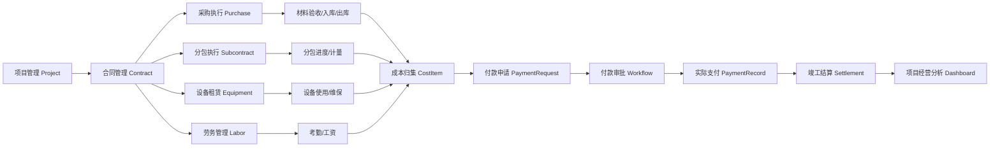

> 文档版本：V1.1 正式修订版  
> 输出日期：2026-06-10  
> 项目名称：建筑工程总包项目全过程管理系统  
> 架构基线：模块化单体优先、MySQL 8.0、统一审批引擎、统一 API 契约、PC Web 优先、移动端后置启动  

# 项目总体方案与业务闭环设计

## 1. 项目定位

本系统面向建筑工程总包单位、项目部、公司职能部门和管理层，建设目标不是单一台账系统，而是覆盖项目、合同、材料设备、分包、成本、付款、审批、资料、结算和经营分析的全过程业务闭环系统。

系统建设总纲：

```text
项目为根
合同为纲
执行为据
成本为果
付款为流
结算为终
```

## 2. 建设目标

| 目标 | 说明 |
|---|---|
| 建立项目主线 | 所有核心业务数据必须关联 `project_id` |
| 建立合同中心 | 总包、分包、采购、租赁、服务合同统一维护，其他模块通过 `contract_id` 引用 |
| 建立合作方中心 | 供应商、分包商、租赁商、服务商、建设单位统一在 `md_partner` 管理 |
| 建立成本归集中心 | 成本由验收、计量、签证、合同变更等业务事实自动生成 |
| 建立付款闭环 | 区分付款条件、付款申请、付款审批、实际支付 |
| 建立结算收口 | 结算从合同、验收、计量、签证、付款、成本自动汇总 |
| 建立统一审批引擎 | 支持顺序、会签、或签、转办、加签、撤回、驳回重提 |
| 建立统一 API 契约 | 前端只负责展示和提交，业务判断由后端返回 |
| 建立角色化驾驶舱 | 项目经理、商务经理、成本经理、财务、管理层看到不同指标 |

## 3. 总体业务链路



## 4. 核心数据主线

| 主线 | 主键字段 | 作用 |
|---|---|---|
| 项目主线 | `project_id` | 所有业务数据归属项目，形成项目全景视图 |
| 合同主线 | `contract_id` | 金额、条款、付款条件、责任主体的唯一依据 |
| 合作方主线 | `partner_id` | 统一识别供应商、分包商、租赁商和服务商 |
| 审批主线 | `instance_id` / `task_id` | 统一追踪审批实例、节点、任务、记录 |
| 成本来源主线 | `source_type` / `source_id` | 成本明细可反查来源单据 |
| 文件资料主线 | `file_id` / `business_id` | 附件归档、资料反查、审计追踪 |

## 5. 业务闭环原则

### 5.1 合同先行

涉及分包、采购、租赁、服务等合同型业务时，原则上必须先完成合同审批，生成可引用的合同台账。

例外场景：零星采购允许不关联合同，但必须标记 `order_type = 零星采购`，并受到金额阈值、审批升级和付款限制。

### 5.2 执行形成事实

材料验收、材料入库、材料出库、分包计量、设备使用、劳务记录、现场签证、合同变更属于业务事实。成本和付款依据必须来自业务事实，而不是手工录入。

### 5.3 成本不是付款

成本以验收、计量、确认、签证等业务事实为依据；付款是资金流，付款金额不能直接代表成本发生金额。

| 口径 | 含义 |
|---|---|
| 目标成本 | 项目初始成本控制目标 |
| 合同锁定成本 | 已签合同对应的成本承诺 |
| 已发生成本 | 已验收、已计量、已确认的实际成本 |
| 已付款金额 | 财务已实际支付金额 |
| 预计待发生成本 | 尚未发生但预计会发生的成本 |
| 动态成本 | 已发生成本 + 预计待发生成本 |
| 成本偏差 | 动态成本 - 目标成本 |

### 5.4 结算不重复录入

竣工结算不应重新录入合同、付款、计量、验收、签证和成本数据，而应从已有业务单据汇总形成结算依据。

## 6. P0 最小可交付范围

| 模块 | P0 范围 |
|---|---|
| 基础平台 | 登录、用户、角色、菜单、按钮权限、数据权限、字典、文件上传 |
| 项目管理 | 项目台账、项目成员、项目全景基本视图 |
| 合作方管理 | 合作方台账、黑名单控制、资质信息 |
| 合同管理 | 合同台账、新建合同、合同清单、付款条件、合同审批、合同归档 |
| 审批引擎 | 模板、实例、节点、任务、记录、待办、已办、会签、或签、转办、加签、撤回、驳回重提 |
| 材料设备 | 采购申请、采购订单、材料验收、入库、出库、库存流水 |
| 分包管理 | 分包任务、进度填报、计量确认 |
| 成本管理 | 目标成本、成本明细、材料成本、分包成本、来源追溯 |
| 付款管理 | 付款申请、付款审批、实际付款记录、发票登记 |
| 结算管理 | 采购结算、分包结算、总包结算汇总和归档 |
| 驾驶舱 | 待办、合同概览、成本概览、付款概览、风险预警统计 |

## 7. 成功验收标志

1. 合同审批通过后，合同可被采购订单、分包任务、付款申请引用。
2. 材料验收审批通过后，自动生成材料成本，且重复审批不会重复生成成本。
3. 分包计量审批通过后，自动生成分包成本。
4. 付款申请必须基于合同、验收、计量或其他付款依据，并受合同金额、付款比例、质保金规则控制。
5. 结算能从合同、变更、签证、验收、计量、付款、成本反查来源。
6. 审批记录完整保留，驳回重提后可以区分第几轮审批。
7. 前端按钮由后端 `availableActions` 返回，前端不自行判断流程权限。
