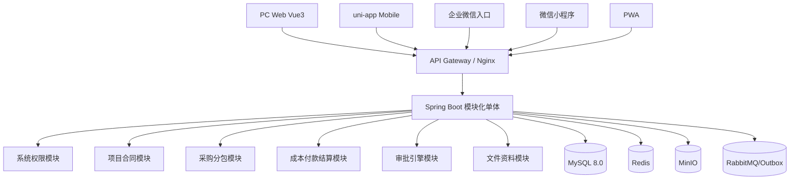

> 文档版本：V1.1 正式修订版  
> 输出日期：2026-06-10  
> 项目名称：建筑工程总包项目全过程管理系统  
> 架构基线：模块化单体优先、MySQL 8.0、统一审批引擎、统一 API 契约、PC Web 优先、移动端后置启动  

# 技术架构与全平台终端方案

## 1. 架构原则

系统一期采用“模块化单体 + 清晰领域边界 + 可演进微服务”的架构方式。不得在一期过早拆分大量微服务，避免增加部署、事务、联调和运维复杂度。

```text
先跑通业务闭环
再优化性能和体验
再考虑服务拆分
```

## 2. 技术栈冻结

### 2.1 PC Web 前端

| 项目 | 定版 |
|---|---|
| 框架 | Vue 3 |
| 语言 | TypeScript |
| 构建 | Vite |
| UI 组件库 | Ant Design Vue |
| 状态管理 | Pinia |
| 路由 | Vue Router |
| 请求 | Axios 封装 |
| 表格 | VxeTable |
| 图表 | ECharts |
| 表单 | 自研动态表单渲染器，支持 `formSchema` |
| 代码规范 | ESLint + Prettier |
| 单元测试 | Vitest |

不再保留 React / Element Plus 二选一，避免开工阶段选型摩擦。

### 2.2 后端

| 项目 | 定版 |
|---|---|
| 语言 | Java 21 |
| 框架 | Spring Boot 3.x |
| ORM | MyBatis-Plus |
| 权限 | Spring Security 或 Sa-Token，二选一需开工前冻结 |
| 数据库 | MySQL 8.0 |
| 缓存 | Redis |
| 文件存储 | MinIO |
| 消息 | RabbitMQ，可先预留，P0 可不强依赖 |
| 定时任务 | XXL-JOB 或 Spring Scheduler，P0 可用轻量方式 |
| API 文档 | OpenAPI / Swagger |
| 日志 | Logback + traceId，后期接 ELK / Loki |
| 构建 | Maven |

### 2.3 移动与轻端

| 终端 | 定版策略 | 优先级 |
|---|---|---|
| PC 浏览器后台 | 主工作端，完整功能 | P0 |
| uni-app 原生 App | 现场主端，拍照、扫码、离线草稿 | P1/P2，后置启动 |
| 企业微信侧 | 内部待办、消息提醒、轻审批 | P1 |
| 微信小程序 | 外部供应商/分包商轻协作 | P2 |
| PWA | 只读、轻填报、兜底访问 | P3 |
| Tauri 桌面壳 | 后期如需桌面能力再做 | P3 |
| Electron | 仅强依赖 Node 桌面生态时备选 | P4 |

## 3. 总体架构



## 4. 后端模块划分

| 模块 | 包名建议 | 说明 |
|---|---|---|
| 系统权限 | `com.company.system` | 用户、角色、菜单、字典、权限 |
| 组织项目 | `com.company.project` | 组织、部门、项目、项目成员 |
| 主数据 | `com.company.master` | 合作方、材料、成本科目 |
| 合同 | `com.company.contract` | 合同、清单、付款条件、变更 |
| 材料设备 | `com.company.material` | 采购、验收、入库、出库 |
| 分包 | `com.company.subcontract` | 分包任务、进度、计量 |
| 成本 | `com.company.cost` | 成本目标、成本明细、成本汇总 |
| 付款 | `com.company.payment` | 付款申请、付款记录、发票 |
| 结算 | `com.company.settlement` | 分包、采购、总包结算 |
| 审批 | `com.company.workflow` | 模板、实例、任务、记录、引擎 |
| 文件 | `com.company.document` | 文件、附件、归档 |
| 日志审计 | `com.company.audit` | 操作日志、审计日志 |

## 5. 前端工程结构

```text
src/
  api/
    contract.ts
    workflow.ts
    project.ts
  assets/
  components/
    AppLayout/
    ProTable/
    DynamicForm/
    ApprovalTimeline/
    FileUploader/
  composables/
  router/
  stores/
    user.ts
    permission.ts
    tabs.ts
  views/
    dashboard/
    contract/
      ContractList.vue
      ContractCreate.vue
      ContractDetail.vue
    workflow/
      TodoList.vue
      ApprovalPage.vue
  utils/
    request.ts
    auth.ts
    format.ts
```

## 6. 参考 HTML 组件化 POC

开工后第一阶段必须将参考 HTML 页面复刻为 Vue 组件，而不是继续维护静态 HTML。

### 6.1 POC 范围

```text
AppLayout：左侧菜单、顶部栏、标签页
ContractList：合同台账页面
SearchForm：筛选区
KpiCards：统计卡片
ContractTable：VxeTable 列表
RightPanel：合同类型、金额分布、状态统计
ColumnSettings：列设置弹窗
```

### 6.2 验收标准

| 项目 | 标准 |
|---|---|
| 路由 | `/contracts` 可访问合同台账 |
| 菜单 | 左侧菜单可根据权限渲染 |
| 表格 | 支持分页、排序、列宽、固定列 |
| 列设置 | 可选择 15+ 合同台账字段 |
| 接口 | 使用 Mock API 或后端接口驱动，不硬编码业务数据 |
| 样式 | 与参考页面视觉一致度 80% 以上 |
| 可复用 | 列表页组件可复用到采购、付款、结算台账 |

## 7. 开发环境要求

### 7.1 本地环境

| 工具 | 建议版本 |
|---|---|
| JDK | 21 LTS |
| Maven | 3.9+ |
| Node.js | 20 LTS |
| pnpm | 9+ |
| MySQL | 8.0+ |
| Redis | 7+ |
| MinIO | RELEASE 版本 |
| Docker | 24+ |
| Git | 2.40+ |

### 7.2 环境变量

```text
SPRING_PROFILES_ACTIVE=dev
MYSQL_HOST=127.0.0.1
MYSQL_PORT=3306
MYSQL_DATABASE=gc_project
MYSQL_USERNAME=root
MYSQL_PASSWORD=******
REDIS_HOST=127.0.0.1
MINIO_ENDPOINT=http://127.0.0.1:9000
MINIO_ACCESS_KEY=******
MINIO_SECRET_KEY=******
```

## 8. 部署架构

### 8.1 P0 简化部署

```text
Nginx
Spring Boot Jar / Docker
MySQL 8.0
Redis
MinIO
```

### 8.2 推荐生产部署

```text
Nginx 双节点
后端应用双节点
MySQL 主从或云 RDS
Redis 高可用
MinIO 多盘或对象存储 OSS
日志集中采集
Prometheus + Grafana 监控
```

## 9. Outbox 使用边界

适合：

```text
审批完成后推送财务系统
审批完成后发送企业微信/短信/站内信
审批完成后同步 BI/数据仓库
移动端离线草稿恢复后提交服务端
```

不适合：

```text
审批服务调用自己的 Controller
同一个后端模块之间绕 HTTP 调用
审批引擎内部状态流转
核心成本生成的强一致链路
```

## 10. 安全原则

```text
所有接口必须鉴权
所有按钮必须校验后端权限
所有数据查询必须带数据权限
所有文件上传必须校验类型、大小、归属业务
小程序 AppSecret 只保存在后端
审批动作必须校验 taskVersion 和 idempotencyKey
敏感操作必须写操作日志
```
