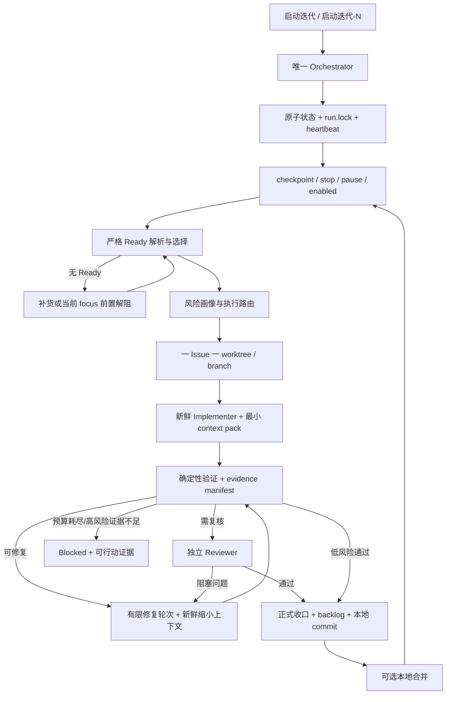

# 第36条主线：本地 AutoPilot 无人值守统一控制面与上下文隔离任务计划书

> **执行约定：** 实施本计划时按任务顺序推进；每个任务先补失败用例或可复现证据，再做最小实现、验证、审查和本地提交。阶段切换、出现阻塞、进入正式裁决前，重新评估直接执行、单子智能体或多子智能体的净收益与模型档位。

**Goal:** 在不引入新常驻服务、数据库或生产权限的前提下，把仓库内旧版连续运行器、新版插件化 checkpoint/classifier、Ready 治理和自适应执行路由收敛为一套可恢复、可审计、可限流的本地 AutoPilot；通过“一 Issue 一隔离工作区一新执行会话”、证据绑定和有限重试，达到低中风险任务可连续无人值守、高风险任务有独立复核、故障后能自动恢复或安全阻塞的目标。

**Architecture:** 复用 `scripts/codex-autopilot/autopilot-run-continuous.ps1` 作为唯一 Orchestrator，复用插件脚本作为 checkpoint、分类器和协议库，不另建第二个循环守护进程。项目事实继续落在 `docs/backlog/**`、`docs/iterations/**`、`docs/quality/**`，运行事实只落在 `.codex-autopilot/**`；Orchestrator 是运行状态唯一写入者。每个 Ready Issue 在独立 worktree 和分支中由新鲜 Implementer 会话执行，验证器以真实命令和绑定到 commit/diff 的证据裁决；需要时由不读取实现推理过程的新鲜 Reviewer 独立复核。禁止把“无人值守”实现成一个持续膨胀上下文的长对话。

**Tech Stack:** PowerShell 7/Windows PowerShell 兼容脚本、Codex CLI、Git worktree、JSON/JSON Schema、Markdown backlog/iteration/quality 文档、现有 Maven/Vitest/TypeScript/Playwright 项目验证命令。

---

## 1. 结论与主线定位

### 1.1 决策结论

采用“统一控制面 + 短生命周期执行会话 + 确定性验证”的演进路线：

1. 旧版连续运行器保留为唯一调度入口，吸收新版治理能力。
2. 插件 runner 不再形成第二套生产循环，只保留 dry-run、checkpoint、分类器和协议复用职责。
3. 最新版自适应路由规则进入可执行策略，不再只依靠提示词约定。
4. 主线程负责无人值守决策，不承担跨多个 Issue 的持续编码上下文。
5. 一个 Issue 的成功必须由 Git diff、验证命令、证据清单和必要的独立复核共同确认，不能信任执行会话自报成功。
6. 默认 `autoPush=false`；只允许本地 dev/test/demo 环境中的本地提交与满足门禁后的可选本地合并。

### 1.2 本计划取代和继承的关系

本计划不删除历史计划，也不改写历史结论；它是以下能力的统一演进载体：

| 既有载体 | 保留能力 | 本计划修正点 |
|---|---|---|
| 第31条主线 | 本地无人值守愿景、连续运行入口 | 补齐隔离执行、状态机、证据绑定和恢复语义 |
| 第33条主线 | 插件化协议、checkpoint、分类器 | 避免插件 runner 与旧 runner 双控制面 |
| 第33-1条主线 | loop engineering、状态与事件协议 | 升级为唯一写入者、原子状态和幂等恢复 |
| 第35条主线 | 主线程直做/派工的自适应路由 | 落成确定性风险策略和阶段重新分档门禁 |
| 当前 `AGENTS*.md` | Ready、A–F、stop/pause、失败分类 | 规则只作为约束源，运行结果必须由脚本和证据验证 |

### 1.3 明确非目标

- 不新建 Web 控制台、消息队列、数据库或长期运行的 Agent 平台。
- 不接入生产环境、生产数据库或生产发布流程。
- 不自动 push，不自动创建 PR，不绕过分支保护和 CI 门禁。
- 不把 A–F 机械映射为六个长期线程。
- 不允许多个执行者共同写 `.codex-autopilot/state.json`。
- 不在 Ready Issue 之外顺手扩大业务范围。
- 不把原始长日志、截图、缓存和运行目录提交进 Git。

---

## 2. 新旧运行机制多维度审视

### 2.1 当前可确认的两套机制

**旧版连续机制**

- 主入口：`scripts/codex-autopilot/autopilot-run-continuous.ps1`
- Issue 执行：`scripts/codex-autopilot/autopilot-exec-issue.ps1`
- 配置：`scripts/codex-autopilot/codex-autopilot.config.json`
- 测试：`scripts/codex-autopilot/test-continuous-runner.ps1`
- 优点：已经具备长驻循环、迭代计数、执行入口和本地状态基础，离真实连续运行最近。
- 主要风险：长生命周期执行和状态耦合较强；若复用同一会话或把全量日志反复注入，容易产生上下文污染；成功裁决、恢复和高风险复核的协议需要加强。

**最新版插件/治理机制**

- 预演入口：`plugins/cgc-pms-autopilot/scripts/autopilot-loop-runner.ps1`
- checkpoint：`plugins/cgc-pms-autopilot/scripts/autopilot-checkpoint.ps1`
- 失败分类：`plugins/cgc-pms-autopilot/scripts/test-failure-classifier.ps1`
- 协议：`plugins/cgc-pms-autopilot/schemas/*.schema.json`
- Ready lint：`scripts/codex-autopilot/ready-lint.ps1`
- 优点：边界、失败分类、Ready 治理、A–F 职责和自适应路由更清晰。
- 主要风险：如果插件 runner 和旧 runner 都能驱动真实迭代，会形成双状态、双心跳、重复计数和恢复歧义；仅有治理文本还不能证明无人值守可靠性。

### 2.2 多维度比较与目标值

现阶段不得编造历史运行时长和完成率；M0 必须先从既有 state、iteration report、Git 历史和测试记录提取可复算基线。下表中的“目标”是验收阈值，不是当前实测值。

| 维度 | 旧版机制倾向 | 最新机制倾向 | 统一后目标 |
|---|---|---|---|
| 任务执行时长 | 单入口连续，但长会话可能后期变慢 | 阶段门禁更完整，人工编排成本偏高 | 记录排队、执行、验证、审查、修复、收口分段时长；同类任务 P50/P95 可比较 |
| 任务完成度 | 容易以执行器返回或文档勾选作为完成信号 | Ready/验收口径更强，但跨载体状态可能不一致 | 完成必须同时满足代码/文档产物、验证证据、backlog 收口、本地提交四项 |
| 产出物 | 运行态与正式报告边界可能混杂 | 正式报告治理较清楚 | 正式产物进 `docs/**`；原始运行产物只在 `.codex-autopilot/runs/**` |
| 代码质量 | 依赖执行会话自检，独立复核不稳定 | 强调 D/E，但未必形成可执行协议 | 目标测试、静态检查、diff-check、风险断言；高风险独立复核覆盖率 100% |
| 上下文稳定性 | 长任务/多轮共享上下文易串题 | 已强调自适应派工，但缺硬隔离数据契约 | 一 Issue 一 worktree 一新会话；上下文包有大小、文件数和摘要上限 |
| 可恢复性 | 进程重启后可能难判断是否已提交/已归档 | state/event schema 提供基础 | 基于 PID、heartbeat、worktree、commit、正式收口状态幂等恢复 |
| 失败处理 | 可能反复重试或过早失败 | 分类规则更完整 | 分类后按固定预算重试；同指纹重复立即阻塞 |
| 风险控制 | 单循环易把不同风险任务同档处理 | 自适应模型/复核规则更完善 | 确定性 risk profile 决定串行、模型档位、Reviewer 和验证集 |
| 并发效率 | 串行稳健但吞吐有限 | 允许完全独立任务并行 | 第一阶段并发上限 1；稳定后最多 2；并发 3 最后开放 |
| 状态真实性 | 状态、报告、Git 可能短时错位 | checkpoint 频繁但可能双写 | Orchestrator 唯一写状态；状态变更原子写入并同步 heartbeat/event |
| 无人值守程度 | 能循环，不等于能安全自治 | 规则更强，不等于可恢复自治 | 连续 20 个低/中风险 Issue 无人工介入，且零越界、零重复完成 |

### 2.3 基线测量口径

M0 为旧机制和最新版机制建立相同口径，至少采集最近可识别的 10 个 Issue；不足 10 个时全量采集并标注样本量：

- `queueWaitSeconds`：进入 Ready 到被选中。
- `activeSeconds`：选中到执行会话退出。
- `verifySeconds`：首次验证到最终验证结束。
- `reviewSeconds`：Reviewer 开始到裁决完成。
- `repairSeconds`：所有修复轮次总和。
- `closeoutSeconds`：最终验证通过到 backlog/report/commit 完成。
- `firstPassSuccess`：首次实现后无需修复即通过。
- `completionIntegrity`：产物、证据、backlog、commit 是否四项齐全。
- `reviewFindingCount`：独立复核发现的阻塞/非阻塞问题数。
- `changeChurn`：最终 diff 与首次 diff 的变更行差异。
- `manualInterventionCount`：人工补上下文、重启、改状态、改命令次数。
- `scopeViolationCount`：越过 allowlist/非目标/风险门禁次数。

基线报告写入：

- `docs/quality/autopilot-evolution-baseline.md`
- 报告只记录可复算摘要和证据路径，不复制原始日志。

---

## 3. 目标架构与职责边界



### 3.1 唯一事实源

**项目事实**

- Ready：`docs/backlog/ready-issues.md`
- 阻塞：`docs/backlog/blocked-issues.md`
- 当前焦点：`docs/backlog/current-focus.md`
- 完成台账：仓库现有 done 载体
- 轮次报告：`docs/iterations/**`
- 正式质量/裁决：`docs/quality/**`

**运行事实**

- `.codex-autopilot/state.json`
- `.codex-autopilot/run.lock`
- `.codex-autopilot/events.ndjson`
- `.codex-autopilot/runs/<run-id>/**`
- `.codex-autopilot/stop.flag`
- `.codex-autopilot/pause.flag`
- `.codex-autopilot/enabled.flag`

规则：只有 Orchestrator 可以写 `state.json`、`run.lock` 和主事件流；Implementer、Reviewer、验证器只能写自己的 run 子目录结果文件，由 Orchestrator校验后归并。

### 3.2 状态机

允许状态：

`DISABLED → IDLE → CHECKPOINT → REFILLING/SELECTING → PLANNING → EXECUTING → VERIFYING → REVIEWING/REPAIRING → CLOSING → COMMITTING → MERGING → CHECKPOINT`

终态或等待态：

- `PAUSED`
- `BLOCKED`
- `LIMIT_REACHED`
- `STOPPED`
- `FAILED`

关键约束：

- 非法状态迁移拒绝并记录 `state_transition_rejected` 事件。
- 每次状态变更同时刷新 `lastHeartbeatAt`。
- 状态先写临时文件、通过 JSON Schema 校验后原子替换。
- `run.lock` 必须包含 runId、PID、startedAt、host、workspaceRoot；活锁不可覆盖。
- `FAILED` 只用于控制面自身不可恢复故障；业务/测试失败应进入 `BLOCKED`。

### 3.3 state v2 最小字段

```json
{
  "schemaVersion": 2,
  "runId": "run-20260711-120000-abc123",
  "status": "EXECUTING",
  "phase": "implement",
  "currentIssue": "AUTO-123",
  "attempt": 1,
  "startedAt": "2026-07-11T12:00:00+08:00",
  "phaseStartedAt": "2026-07-11T12:03:00+08:00",
  "lastHeartbeatAt": "2026-07-11T12:03:30+08:00",
  "iterationLimit": 3,
  "completedImplementationIssues": 0,
  "worktree": "D:/projects-test/cgc-pms/.worktrees/autopilot/AUTO-123",
  "branch": "codex/autopilot/auto-123",
  "executorPid": 12345,
  "lastCommit": null,
  "failureFingerprint": null
}
```

---

## 4. Ready、风险与执行协议

### 4.1 严格 Ready Issue 契约

自动实施前必须解析出唯一 Issue 区块，并满足：

- 唯一 Issue ID。
- `状态：Ready`。
- 任务性质属于：`能力新增`、`缺口修复`、`回归证明`、`运维治理`。
- Goal 和非目标明确。
- 允许修改路径与禁止修改路径明确。
- 验证命令存在，测试类/方法/脚本入口可解析。
- 数据库 migration 声明为“需要”或“不需要”。
- 依赖、风险等级、运行态要求、Reviewer 要求明确。
- Issue 内容 hash 在选中后冻结；发生变化必须重新 checkpoint 和路由。

解析失败时只更新 lint 结果和 backlog，不启动 Implementer，不计入 `启动迭代-N`。

### 4.2 确定性风险画像

Orchestrator 先根据 Ready、允许路径、实际 diff 和关键词形成 risk profile，再决定会话配置：

| 风险/任务 | 执行策略 | 推荐模型基线 | Reviewer |
|---|---|---|---|
| 文档、测试、单文件低风险 | 单 Implementer + 自动验证 | `gpt-5.6-luna/low` 或 `gpt-5.6-terra/medium` | 可省略 |
| 普通常规实现 | 单 Implementer + 自动验证 + 自检 | `gpt-5.6-terra/medium` | 按 diff 升级 |
| 跨 2 个及以上模块 | 串行实现 | `gpt-5.6-terra/high` 或 `gpt-5.6-sol/high` | 必须独立复核 |
| 权限/安全/租户/金额/数据库/状态机 | 串行、高证据强度 | `gpt-5.6-sol/high` 起 | 必须独立复核 |
| 运行态刷新/端口/日志 | 运维执行器 | `gpt-5.6-luna/low` | 以 health gate 为准 |
| 正式上线或通过/不通过裁决 | 验收/审计会话 | `gpt-5.6-sol/high` 起 | 独立证据必需 |

模型名称和 thinking 档位在真实执行时必须从当时工具 schema 获取；表中值是策略基线，不得硬编码成永久固定模型。

### 4.3 Worktree 隔离

- 路径：`.worktrees/autopilot/<issue-id>`
- 分支：`codex/autopilot/<issue-id-lowercase>`
- 基线：选中 Issue 时的 `baseCommit`。
- 启动前校验主工作区 branch/status，并记录既有脏文件；不得把既有脏改动复制进 Issue worktree。
- 执行后 diff 只能命中 allowlist；越界立即停止并进入污染处置。
- Issue 收口后只在门禁通过时本地提交；worktree 清理由后续安全清理任务执行，必须先预览。

### 4.4 Executor 结构化输出

Implementer 必须输出 JSON 结果，至少包含：

- issueId、runId、phase、baseCommit。
- changedFiles。
- commands：命令、退出码、时长、结果摘要、原始日志路径。
- claimedOutcome：`pass`、`needs_repair`、`blocked`。
- risks、unresolvedItems。
- finalCommit；未提交时为 null。

Orchestrator 必须重新读取真实 `git diff`、命令结果和 commit，不以 `claimedOutcome` 直接裁决。

---

## 5. 主线程长任务上下文污染预防与恢复

### 5.1 硬隔离原则

“主线程默认执行”在无人值守模式中解释为：主线程拥有决策权、调度权和最终裁决权；不解释为同一 LLM 会话连续读取所有 Issue、全部源码和完整日志。

强制执行：

1. 一个 Issue = 一个 worktree = 一个分支 = 一个新鲜 Implementer 会话。
2. 每个修复阶段使用新的缩小上下文，不复用已经漂移的长会话。
3. Reviewer 不读取 Implementer 的思维过程，只读取 Ready、diff、验证证据和相关规范。
4. 原始日志留在磁盘；进入模型的只有摘要和必要错误片段。
5. 每一份证据绑定 issueId、baseCommit、diffHash、时间和命令。

### 5.2 Context Compiler

每阶段生成 `.codex-autopilot/runs/<run-id>/<issue-id>/<phase>/context.json`：

```json
{
  "schemaVersion": 1,
  "issueId": "AUTO-123",
  "phase": "implement",
  "baseCommit": "<sha>",
  "contextGeneratedAt": "<iso-8601>",
  "readyContentHash": "<sha256>",
  "diffHash": null,
  "goal": "<ready goal>",
  "nonGoals": ["<explicit non-goal>"],
  "allowedPaths": ["backend/src/..."],
  "forbiddenPaths": ["deploy/**"],
  "requiredCommands": ["<validated command>"],
  "relevantSymbols": ["<symbol or file:line>"],
  "acceptedDecisions": ["<current issue decision>"],
  "openRisks": ["<risk>"],
  "previousPhaseSummary": null
}
```

Context Compiler 只读取本 Issue 的 Ready 区块、当前 commit/diff、显式相关源码和上一阶段压缩摘要；禁止默认注入整个 backlog、全部历史报告、整个 Git diff 或上一 Issue 的对话。

### 5.3 上下文预算

初始硬上限：

- Implementer 会话：45 分钟。
- Repair 会话：20 分钟。
- 修复轮次：最多 2 轮。
- 注入源码：最多 12 个文件；超限先由 Orchestrator缩小符号范围。
- 注入原始日志：最多 200 行。
- 上一阶段摘要：最多 5 KB。
- 单 Issue 改动文件：默认最多 20 个；Ready 明确说明且风险路由升级后才可放宽。
- Reviewer 只获取最终 diff、必需源码、证据清单和规范，不继承 Implementer 聊天历史。

### 5.4 证据有效性

每条验证证据必须包含：

```json
{
  "issueId": "AUTO-123",
  "baseCommit": "<sha>",
  "commit": "<sha-or-null>",
  "diffHash": "<sha256>",
  "command": "<exact command>",
  "startedAt": "<iso-8601>",
  "durationSeconds": 12.4,
  "exitCode": 0,
  "classification": "pass",
  "summary": "12 tests passed",
  "rawLogPath": ".codex-autopilot/runs/.../targeted-test.log"
}
```

以下任一变化自动使旧证据失效：

- base commit 改变。
- diffHash 改变。
- Ready 内容 hash 改变。
- worktree 或分支改变。
- 测试目标/选择器改变。
- 证据中的 issueId 与当前 Issue 不一致。

### 5.5 污染检测

在 Implementer 退出、每轮 repair 后、Reviewer 前、commit 前执行：

- 输出中出现其他当前非目标 Issue ID。
- changedFiles 超出 allowlist。
- 实际 HEAD/baseCommit 与 context 不一致。
- 引用了失效证据。
- worktree 出现未知未跟踪文件或禁止目录。
- 未声明却触碰 migration、权限、租户、金额或审批状态机。
- 上一阶段摘要超过限制或无法追溯到当前 diff。

### 5.6 污染恢复分类

| 污染类型 | 自动动作 | 最终条件 |
|---|---|---|
| 日志/源码过载 | 压缩摘要，启动新鲜 continuation | 一次恢复后继续 |
| 范围漂移 | 停止当前扩展；无关内容拆新 Ready | 当前 Issue 只保留原范围 |
| 工作区混合 | 隔离原 worktree，新建干净 worktree，只迁移可证明 commit | 全量重验后才继续 |
| 证据不匹配 | 作废旧证据，重跑受影响验证 | 新证据绑定当前 diff |
| 会话漂移 | 退休原会话，用更小 context 重启 | 第二次同类漂移进入 Blocked |

任何被退休的执行会话不得继续复用。

---

## 6. 验证、审查与有限修复

### 6.1 固定验证顺序

1. 校验 Ready 中测试类、测试方法、脚本入口真实存在。
2. 编译或 `testCompile`。
3. 目标测试。
4. 受影响模块类型检查/静态检查。
5. 受影响模块构建。
6. 权限、安全、租户、金额、数据一致性专项断言。
7. `git diff --check`。
8. 需要运行态时执行 health gate。
9. 需要真实页面时执行浏览器验收。

首次失败先分类，不直接判定业务代码失败。

### 6.2 重试预算

| 分类 | 自动处置 | 最大自动次数 |
|---|---|---:|
| PowerShell/参数/命令语法 | 修正调用形式 | 1 |
| 环境前置 | runtime refresh，稳定等待 180 秒，复验 | 1 |
| 瞬时代理/进程波动 | 原命令或最小等价命令复跑 | 1 |
| Ready 选择器不存在 | 最小等价替换并记录配置问题 | 1 |
| 真实测试失败 | 新鲜 Repair 会话 | 2 |
| 安全/权限真实命中 | 高风险 Repair + 独立复核 | 1 |
| 未知失败 | 收集最小证据后重试 | 1 |

同一 `failureFingerprint` 再次出现时不继续盲重试，进入 `BLOCKED`。

### 6.3 Reviewer 强制触发条件

- Flyway migration 或 schema 变化。
- 权限、租户、金额、审批状态机、文件安全。
- 跨模块变更。
- 自动本地合并前的高风险 diff。
- 需要形成正式上线或通过/不通过裁决。
- 污染恢复后迁移过 commit。

Reviewer 输出必须是 `pass`、`needs_repair` 或 `blocked`，并逐项关联文件/行、风险和所需验证。非当前根因且扩大范围的建议进入 backlog，不阻止当前最小闭环。

---

## 7. 超时、崩溃与幂等恢复

### 7.1 进度与超时

- heartbeat 周期：30 秒。
- 5 分钟无新事件/证据：检查 PID、CPU/进程状态、日志增长和 worktree diff。
- 10 分钟无有效进展：终止执行器，记录 timeout 证据。
- 第一次 timeout：缩小上下文后新会话重试一次。
- 第二次 timeout：进入 `BLOCKED`，不得复用原会话。

### 7.2 启动恢复决策表

| 发现状态 | 动作 |
|---|---|
| 无 run.lock | 新建运行 |
| run.lock PID 存活且 heartbeat 新鲜 | 拒绝第二实例 |
| PID 不存在且 worktree 无 diff | 从上一个安全状态继续 |
| PID 不存在且有未提交 diff | 校验 issue/base/allowlist，进入 VERIFYING 或隔离 |
| 已有本地 commit、未归档 | 验证 commit 绑定证据后从 CLOSING 继续 |
| 已归档、未计数 | 幂等补计数，不重复执行/提交 |
| 状态称完成但 Git/报告缺失 | 状态降级，重新验证或 Blocked |

任何恢复都不得重复增加 `completedImplementationIssues`。

---

## 8. 可观测性与无人值守验收指标

### 8.1 每 Issue 必记指标

- task nature、risk profile、route、model、thinking。
- queue/active/verify/review/repair/closeout 时间。
- retry 次数、failure fingerprint、恢复次数。
- first-pass success。
- changed file/line 数、范围越界结果、change churn。
- 验证命令、退出码、测试数、证据 hash。
- Reviewer findings。
- commit SHA、是否本地合并。
- 阻塞项和剩余风险去向。

### 8.2 无人值守资格线

进入稳定无人值守前，连续 20 个低/中风险实施型 Issue 必须满足：

- 人工介入次数为 0。
- false Ready 为 0。
- 重复完成计数为 0。
- allowlist 越界提交为 0。
- 未授权 push/生产连接/生产发布为 0。
- 状态与真实 Git/报告阶段一致率 100%。
- first-pass success 不低于 80%。
- 崩溃后 5 分钟内恢复或安全进入 Blocked。
- 所有剩余风险均进入 ready/blocked/current-focus 之一。
- 高风险任务独立复核覆盖率 100%。

未达标时保持在当前灰度等级，不扩大并发或风险范围。

---

## 9. 分阶段实施任务

## Task 1：M0 基线、规则原子闭环与现状报告

**Files:**

- Create: `docs/quality/autopilot-evolution-baseline.md`
- Modify: `scripts/codex-autopilot/test-continuous-runner.ps1`
- Read/verify: `AGENTS.md`
- Read/verify: `AGENTS.override.md`
- Read/verify: `docs/plans/第31条主线-本地AutoPilot完整无人值守闭环任务计划书.md`
- Read/verify: `docs/plans/第33条主线-Codex AutoPilot插件化封装任务计划书.md`
- Read/verify: `docs/plans/第33-1条主线-Codex AutoPilot Loop Engineering增强改进任务计划书.md`
- Read/verify: `docs/plans/第35条主线-Codex执行路由与子智能体自适应分配机制调整任务计划书.md`

**Steps:**

- [ ] 执行写前 checkpoint：branch、status、stop/pause/enabled；记录现有脏文件归属。
- [ ] 为基线采集增加失败用例：缺失时间戳、重复 Issue、无 commit、报告与 Git 不一致时必须标为不可复算，而非填默认值。
- [ ] 从 state、iteration report、Git 历史、验证摘要提取最近 10 个可识别 Issue；不足时记录实际样本量。
- [ ] 形成第 2.3 节全部指标的旧版基线；无法复算的项明确写“证据缺失”。
- [ ] 核对当前规则是否完整覆盖唯一控制面、Ready、checkpoint、失败分类、A–F、无 push、高风险复核和上下文隔离；仅修正规则矛盾，不提前实现脚本能力。
- [ ] 运行：`powershell -NoProfile -ExecutionPolicy Bypass -File scripts/codex-autopilot/test-continuous-runner.ps1`。
- [ ] 运行：`git diff --check`。
- [ ] 本地提交：`docs(autopilot): establish evolution baseline`。

**Acceptance:** 基线每个数字可追溯；缺证据不猜测；规则不存在两个真实 runner 所有者。

## Task 2：M1 唯一控制面与入口收敛

**Files:**

- Modify: `scripts/codex-autopilot/autopilot-run-continuous.ps1`
- Modify: `scripts/codex-autopilot/autopilot-start.ps1`
- Modify: `scripts/codex-autopilot/autopilot-status.ps1`
- Modify: `scripts/codex-autopilot/codex-autopilot.config.json`
- Modify: `plugins/cgc-pms-autopilot/scripts/autopilot-loop-runner.ps1`
- Modify: `plugins/cgc-pms-autopilot/references/install.md`
- Modify: `scripts/codex-autopilot/test-continuous-runner.ps1`

**Steps:**

- [ ] 先写测试：同时启动两个 runner 时，第二个必须以明确退出码拒绝；plugin runner 非 DryRun 不得写 state 或启动 Issue。
- [ ] 配置中增加 `controlPlane = "scripts/codex-autopilot/autopilot-run-continuous.ps1"`、`autoPush = false`、`maxParallel = 1`。
- [ ] 旧 runner 获取 `run.lock` 后才进入循环；plugin runner 仅调用 dry-run/checkpoint/classifier 公共能力。
- [ ] `autopilot-start.ps1` 只启动唯一控制面；`autopilot-status.ps1` 读取 state/lock，不自行修状态。
- [ ] 验证 legacy 触发词仍映射到唯一入口。
- [ ] 运行双启动、DryRun、start/status/stop 回归。
- [ ] 运行 `git diff --check`。
- [ ] 本地提交：`refactor(autopilot): establish single control plane`。

**Acceptance:** 任意时刻只有一个 Orchestrator 能驱动真实 Issue，plugin runner 不产生第二心跳或第二计数。

## Task 3：M2 state v2、原子写与事件协议

**Files:**

- Create: `scripts/codex-autopilot/autopilot-state.ps1`
- Modify: `plugins/cgc-pms-autopilot/schemas/loop-state.schema.json`
- Modify: `plugins/cgc-pms-autopilot/schemas/loop-event.schema.json`
- Modify: `scripts/codex-autopilot/autopilot-run-continuous.ps1`
- Create: `scripts/codex-autopilot/test-state-machine.ps1`

**Steps:**

- [ ] 先写状态机测试：合法迁移通过，非法迁移拒绝；写入中断后旧 state 仍可读；heartbeat 随每次状态改变更新。
- [ ] 在 `autopilot-state.ps1` 实现 `Read-AutopilotState`、`Write-AutopilotStateAtomic`、`Move-AutopilotState`、`Write-AutopilotEvent`。
- [ ] 用临时文件 + schema 校验 + 原子替换更新 state。
- [ ] event 每行独立 JSON，包含 runId、issueId、from/to、timestamp、reason、evidencePath。
- [ ] 迁移旧 state 时保留旧文件备份路径到 run 目录，不把备份提交 Git。
- [ ] 覆盖进程崩溃、损坏 JSON、未知 schemaVersion、重复完成计数测试。
- [ ] 运行状态测试和连续 runner 回归。
- [ ] 本地提交：`feat(autopilot): add atomic state machine v2`。

**Acceptance:** state 与 event 均通过 schema；非法状态无法静默写入；崩溃不产生半个 JSON。

## Task 4：M2 严格 Ready 解析、checkpoint 与风险画像

**Files:**

- Modify: `scripts/codex-autopilot/ready-lint.ps1`
- Modify: `plugins/cgc-pms-autopilot/scripts/autopilot-checkpoint.ps1`
- Create: `scripts/codex-autopilot/autopilot-ready.ps1`
- Create: `scripts/codex-autopilot/autopilot-route.ps1`
- Create: `scripts/codex-autopilot/test-ready-routing.ps1`
- Modify: `scripts/codex-autopilot/autopilot-run-continuous.ps1`

**Steps:**

- [ ] 先写失败用例：重复 ID、缺非目标、路径为空、测试入口不存在、migration 未声明、Ready hash 变化、任务性质无效。
- [ ] 解析器返回结构化 Ready 对象和 `readyContentHash`，不靠模糊全文匹配选择任务。
- [ ] checkpoint 固定返回 branch、status、stop、pause、enabled、health gate requirement。
- [ ] risk profile 根据 Ready 字段和路径形成；执行后再次根据真实 diff 升级，不允许自动降级高风险。
- [ ] 路由输出 executor role、model baseline、thinking baseline、reviewRequired、serialRequired、verificationProfile。
- [ ] 验证 `启动迭代-N` 只统计实施型 Ready；dry-run、补货、解阻和 health gate 不计数。
- [ ] 运行 Ready/routing 测试、runner 回归、`git diff --check`。
- [ ] 本地提交：`feat(autopilot): enforce ready contract and deterministic routing`。

**Acceptance:** 不合格 Ready 零执行；风险路由可通过输入复算；同一 Ready 得到稳定结果。

## Task 5：M3 Worktree 隔离与 Context Compiler

**Files:**

- Create: `scripts/codex-autopilot/autopilot-worktree.ps1`
- Create: `scripts/codex-autopilot/autopilot-context.ps1`
- Create: `plugins/cgc-pms-autopilot/schemas/context-pack.schema.json`
- Modify: `scripts/codex-autopilot/autopilot-exec-issue.ps1`
- Create: `scripts/codex-autopilot/test-context-isolation.ps1`
- Modify: `.gitignore`

**Steps:**

- [ ] 先写隔离测试：主工作区脏改动不得进入 Issue worktree；Issue A 摘要/日志不得进入 Issue B context；allowlist 外文件导致失败。
- [ ] 建立 `.worktrees/autopilot/<issue-id>` 和 `codex/autopilot/<issue-id>` 命名及冲突检测。
- [ ] Context Compiler 按第 5.2 节生成并 schema 校验 context pack。
- [ ] 实现第 5.3 节预算，超限返回明确分类，不自动截断关键 Goal/非目标/验证命令。
- [ ] Executor 每个 implement/repair phase 启动新 Codex 会话，只传 context pack 和必要文件。
- [ ] `.gitignore` 仅忽略运行态和 worktree 路径，不忽略正式 `docs/**` 产物。
- [ ] 覆盖错误 Issue ID、commit mismatch、未知文件、未声明高风险路径测试。
- [ ] 运行 context isolation、state、runner 回归。
- [ ] 本地提交：`feat(autopilot): isolate issues and compile bounded context`。

**Acceptance:** 跨 Issue 上下文泄漏测试为零；Executor 无法在错误 worktree 或错误 base commit 上继续。

## Task 6：M4 证据绑定、确定性验证与失败分类

**Files:**

- Create: `scripts/codex-autopilot/autopilot-verify.ps1`
- Create: `plugins/cgc-pms-autopilot/schemas/evidence.schema.json`
- Modify: `plugins/cgc-pms-autopilot/scripts/test-failure-classifier.ps1`
- Create: `scripts/codex-autopilot/test-evidence-verification.ps1`
- Modify: `scripts/codex-autopilot/autopilot-run-continuous.ps1`

**Steps:**

- [ ] 先写测试：diff 改变后旧证据必须失效；退出码非 0 不可被成功摘要覆盖；不存在的测试选择器归类为 Ready 配置问题。
- [ ] 验证器按第 6.1 节执行，并将原始日志与摘要分离。
- [ ] evidence manifest 绑定 issue/base/commit/diff/command/time/exitCode。
- [ ] classifier 输出必须通过 `classification-result.schema.json`，并生成稳定 failure fingerprint。
- [ ] 实现第 6.2 节重试预算；所有次数由 Orchestrator 持久化，重启后不清零。
- [ ] health gate 固定检查 backend、frontend、dev-login；失败先归环境前置。
- [ ] 运行证据测试、分类器回归、目标 runner 回归、`git diff --check`。
- [ ] 本地提交：`feat(autopilot): bind verification evidence to code state`。

**Acceptance:** 任何通过结论均可从 evidence manifest 和真实文件复算；陈旧证据不能复用。

## Task 7：M4 独立 Reviewer 与有限 Repair

**Files:**

- Create: `scripts/codex-autopilot/autopilot-review.ps1`
- Create: `plugins/cgc-pms-autopilot/schemas/review-result.schema.json`
- Modify: `scripts/codex-autopilot/autopilot-run-continuous.ps1`
- Create: `scripts/codex-autopilot/test-review-repair.ps1`

**Steps:**

- [ ] 先写测试：高风险 diff 无 Reviewer 不得进入 closing；Reviewer 读取 Implementer 对话历史时测试失败；同指纹第二次失败进入 Blocked。
- [ ] Reviewer 输入限制为 Ready、最终 diff、必要源码、规范和 evidence manifest。
- [ ] Reviewer 结果逐项包含 severity、file/line、risk、requiredEvidence、decision。
- [ ] `needs_repair` 生成新的 repair context；不复用 Implementer 会话。
- [ ] 修复后所有受影响证据失效并重跑；Reviewer 对最终 diff 重新裁决。
- [ ] 非阻塞且扩大范围的建议写入 backlog，不在当前 Issue 扩做。
- [ ] 运行 review/repair、context、evidence、runner 回归。
- [ ] 本地提交：`feat(autopilot): add independent review and bounded repair`。

**Acceptance:** 高风险任务独立复核覆盖率 100%；修复轮次不超过预算；Reviewer 与 Implementer 上下文隔离。

## Task 8：M5 Ready 补货、当前 focus 解阻与风险闭环

**Files:**

- Create: `scripts/codex-autopilot/autopilot-refill.ps1`
- Modify: `scripts/codex-autopilot/autopilot-run-continuous.ps1`
- Modify: `scripts/codex-autopilot/test-continuous-runner.ps1`
- Modify as runtime data: `docs/backlog/ready-issues.md`
- Modify as runtime data: `docs/backlog/blocked-issues.md`
- Modify as runtime data: `docs/backlog/current-focus.md`

**Steps:**

- [ ] 先写场景测试：Ready 少于 3、Ready 为空但当前 focus 有可解阻前置、无可拆任务、同域连续 3/5 条、stop/pause 在补货中出现。
- [ ] 补货严格按 ad-hoc plan → 长期计划 → current-focus 顺序，只生成 3–5 条合格 Ready，总数不超过 5。
- [ ] 补货轮只改 backlog，不改业务代码，不计入 N。
- [ ] Ready 为空但有当前 focus 前置时，先形成结构化解阻任务并按运维/事实采集/验收路由执行。
- [ ] 解除阻塞后先同步 blocked/ready/current-focus，再重新选择。
- [ ] 任一剩余风险必须进入 ready、blocked 或 current-focus，禁止只留在 quality 报告。
- [ ] 运行 refill 场景、runner 回归、`git diff --check`。
- [ ] 本地提交：`feat(autopilot): close ready refill and unblock loop`。

**Acceptance:** Ready 暂空不造成错误停机；不可解除的阻塞有具体证据和下一步，不无限循环。

## Task 9：M6 超时、崩溃恢复和幂等收口

**Files:**

- Create: `scripts/codex-autopilot/autopilot-recover.ps1`
- Modify: `scripts/codex-autopilot/autopilot-run-continuous.ps1`
- Modify: `scripts/codex-autopilot/autopilot-status.ps1`
- Create: `scripts/codex-autopilot/test-recovery.ps1`

**Steps:**

- [ ] 先写故障注入测试：执行器被杀、state 临时文件残留、commit 后崩溃、归档后计数前崩溃、heartbeat 陈旧、worktree 混合。
- [ ] 实现第 7.2 节恢复决策表，恢复前验证 PID、heartbeat、base/diff、commit 和正式报告。
- [ ] 实现 5/10 分钟停滞检查和一次缩小上下文重试。
- [ ] 收口使用 issueId + commit + report path 作为幂等键。
- [ ] status 显示真实恢复阶段、最近心跳、执行 PID、证据/阻塞路径，不擅自修状态。
- [ ] 验证重复启动和重复恢复不产生第二 commit、第二计数或第二报告。
- [ ] 运行 recovery、state、runner 全部脚本测试。
- [ ] 本地提交：`feat(autopilot): recover unattended runs idempotently`。

**Acceptance:** 任意注入点重启后 5 分钟内恢复或安全 Blocked；无重复完成和重复提交。

## Task 10：M6 指标、状态页与正式收口模板

**Files:**

- Create: `scripts/codex-autopilot/autopilot-metrics.ps1`
- Modify: `scripts/codex-autopilot/autopilot-status.ps1`
- Modify: `plugins/cgc-pms-autopilot/schemas/loop-event.schema.json`
- Create: `docs/quality/autopilot-unattended-qualification.md`
- Modify: `docs/README.md`

**Steps:**

- [ ] 先写指标测试：缺事件、重复事件、跨 runId、负时长、状态回退不得生成虚假成功率。
- [ ] 从事件流计算第 8.1 节指标，不从自然语言报告猜测时长。
- [ ] status 输出当前运行、Issue、phase、heartbeat、重试预算、worktree、last commit、stop/pause/enabled。
- [ ] qualification 报告列出 20-Issue 窗口、每项阈值、通过/不通过、阻塞/非阻塞、证据路径。
- [ ] docs/README 增加正式计划、基线和资格报告索引。
- [ ] 运行指标测试、Markdown 链接核对、`git diff --check`。
- [ ] 本地提交：`feat(autopilot): expose qualification metrics and status`。

**Acceptance:** 指标可从事件流重复计算；资格报告不依赖人工主观补数。

## Task 11：M7 灰度验证与无人值守资格裁决

**Files:**

- Modify: `docs/quality/autopilot-unattended-qualification.md`
- Create: `docs/quality/autopilot-unattended-acceptance.md`
- Modify as needed: `scripts/codex-autopilot/codex-autopilot.config.json`
- Modify as runtime data: `docs/iterations/**`
- Modify as runtime data: `docs/backlog/**`

**Steps:**

- [ ] Level 0：DryRun，只验证解析、选择、路由和状态，不执行修改。
- [ ] Level 1：文档/测试类 Issue，串行，并发 1。
- [ ] Level 2：单文件低风险代码，串行，并发 1。
- [ ] Level 3：普通本地代码，串行，并发 1。
- [ ] Level 4：高风险本地任务，强制独立 Reviewer；证据不足即 Blocked。
- [ ] Level 5：仅在 20-Issue 资格线通过后，把完全独立任务并发提升为 2。
- [ ] Level 6：并发 3 保持关闭，除非另立计划并证明并发 2 的长期稳定性。
- [ ] 每级至少运行 5 个适用样本或全量可用样本；未达到样本量时不升级。
- [ ] 用旧版基线和统一后数据对比执行时长、完成度、产出物完整性、代码质量、恢复、人工介入和上下文污染。
- [ ] 输出正式裁决：通过/不通过、阻塞/非阻塞、依据、剩余风险。
- [ ] 本地提交：`docs(autopilot): record unattended qualification verdict`。

**Acceptance:** 连续 20 个低/中风险 Issue 达到第 8.2 节全部硬指标；否则保持灰度并明确失败项。

## Task 12：M8 文档收敛、旧入口降级与最终验收

**Files:**

- Modify: `plugins/cgc-pms-autopilot/skills/cgc-pms-autopilot-owner/SKILL.md`
- Modify: `plugins/cgc-pms-autopilot/references/owner-boundary.md`
- Modify: `plugins/cgc-pms-autopilot/references/install.md`
- Modify: `docs/README.md`
- Modify: `docs/未来开发计划.md`
- Modify as needed: `AGENTS.md`
- Modify as needed: `AGENTS.override.md`

**Steps:**

- [ ] 仅在行为验证通过后更新长期规则，避免文档先宣称已完成。
- [ ] 明确唯一入口、DryRun 入口、状态目录、stop/pause、恢复和 `autoPush=false`。
- [ ] 把旧 runner/插件 runner 的角色写清楚；删除重复说明，不删除历史计划。
- [ ] 所有未达资格线的风险进入 ready/blocked/current-focus 或 `docs/未来开发计划.md`。
- [ ] 运行全套 PowerShell 测试、Ready lint、schema 校验、`git diff --check`。
- [ ] 做一次受控 `启动预演`，再做一次 `启动迭代-1` 的低风险灰度；检查 stop/pause/enabled/state。
- [ ] 核对正式交付物、验收证据、临时产物和 Git 状态。
- [ ] 本地提交：`docs(autopilot): close unified unattended control plane`。

**Acceptance:** 文档描述与真实入口/state/测试一致；历史入口无双写；最终报告给出明确资格裁决。

---

## 10. 全局验证矩阵

### 10.1 每个实施任务必跑

```powershell
git branch --show-current
git status --short
powershell -NoProfile -ExecutionPolicy Bypass -File scripts/codex-autopilot/test-continuous-runner.ps1
git diff --check
```

新增专项测试后按阶段追加：

```powershell
powershell -NoProfile -ExecutionPolicy Bypass -File scripts/codex-autopilot/test-state-machine.ps1
powershell -NoProfile -ExecutionPolicy Bypass -File scripts/codex-autopilot/test-ready-routing.ps1
powershell -NoProfile -ExecutionPolicy Bypass -File scripts/codex-autopilot/test-context-isolation.ps1
powershell -NoProfile -ExecutionPolicy Bypass -File scripts/codex-autopilot/test-evidence-verification.ps1
powershell -NoProfile -ExecutionPolicy Bypass -File scripts/codex-autopilot/test-review-repair.ps1
powershell -NoProfile -ExecutionPolicy Bypass -File scripts/codex-autopilot/test-recovery.ps1
```

### 10.2 故障注入场景

- 第二实例竞争 run.lock。
- state 写到一半进程退出。
- Implementer 无输出退出。
- Implementer 返回成功但命令退出码非 0。
- diff 超出 allowlist。
- Ready 在执行中被修改。
- 测试选择器不存在。
- backend/frontend/dev-login 任一 health gate 失败。
- Reviewer 前 diff 改变。
- commit 后、归档前崩溃。
- 归档后、计数前崩溃。
- stop/pause 在选任务后、改代码前、验证前、commit 前出现。
- 上一 Issue ID/日志进入下一 Issue context。

### 10.3 安全边界回归

- `autoPush` 始终为 false。
- 不存在生产 URL/生产数据库连接动作。
- 不删除仓库外文件，不删除 `.git`。
- 测试数据重置必须同时满足 dev/test/demo、localhost/127.0.0.1、`ALLOW_TEST_DATA_RESET` marker。
- 私有禁止目录不扫描、不清理、不归档。
- 临时运行产物不进入正式 `docs/quality/**` 或 Git。

---

## 11. 里程碑、工期与退出条件

| 里程碑 | 内容 | 预计工程日 | 退出条件 |
|---|---|---:|---|
| M0 | 基线与规则原子闭环 | 0.5 | 指标可复算，规则无明显矛盾 |
| M1 | 唯一控制面 | 1–2 | 第二实例和双 runner 被阻断 |
| M2 | state v2、Ready、checkpoint、routing | 1–2 | 状态原子、Ready 零误执行 |
| M3 | worktree 与上下文隔离 | 2–3 | 跨 Issue 污染测试为零 |
| M4 | 验证、证据、Reviewer、Repair | 2 | 高风险独立复核与有限重试生效 |
| M5 | 补货与解阻 | 1–2 | Ready 暂空可正确补货/解阻/停机 |
| M6 | 恢复与指标 | 2 | 5 分钟恢复或安全 Blocked，指标可复算 |
| M7 | 灰度资格验证 | 2–3 | 20-Issue 硬指标裁决完成 |
| M8 | 文档与最终收口 | 0.5–1 | 规则、入口、状态和报告一致 |

总量预估：10–14 个工程日，不含等待真实 Issue 样本积累的自然时间。

每个里程碑结束时重新分档检查：

1. 当前阶段是实现、验收、运维还是审计？
2. 是否从单模块升级为跨模块？
3. 是否涉及权限、安全、租户、金额、数据库或数据一致性？
4. 输出是否直接用于通过/不通过或上线裁决？

任一答案变化，都要重新判断直接执行、单派、多派、模型和 Reviewer 强度。

---

## 12. 最终验收与收口模板

**正式交付物**

- 唯一 Orchestrator 及受测脚本。
- state/context/evidence/review JSON Schema。
- 严格 Ready、风险路由、worktree、验证、Reviewer、恢复和指标能力。
- 基线报告、资格报告、最终验收报告。
- 更新后的安装、owner 边界和项目索引文档。

**验收证据**

- 全套 PowerShell 测试通过。
- 故障注入矩阵通过。
- `git diff --check` 通过。
- DryRun 与低风险 `启动迭代-1` 真实受控通过。
- 连续 20 个低/中风险 Issue 达到无人值守资格线。
- 高风险独立 Reviewer 覆盖率 100%。

**临时产物**

- `.codex-autopilot/runs/**`、原始日志、worktree、缓存和构建产物不作为正式交付入库。
- 清理前只允许 `git clean -fdn` 预览；禁止盲删。

**Git 状态**

- 每个 Task 独立本地提交，便于回滚和二分。
- `autoPush=false`，不自动 push。
- 发现非本任务既有脏改动时保留并隔离，不覆盖、不顺手提交。

**最终结论规则**

- `通过`：全部硬指标满足，状态/证据/Git/报告一致，可进入约定风险等级的无人值守。
- `不通过-阻塞`：存在重复执行、状态失真、上下文串题、范围越界、陈旧证据复用、未授权外部动作或高风险缺独立复核。
- `不通过-非阻塞`：功能闭环可用但样本量或效率指标不足；保持当前灰度，不扩大风险和并发。
- 所有剩余风险必须进入 ready、blocked、current-focus 或未来开发计划，不能只留在验收报告备注。

---

## 13. 本计划书自身验收

- 已覆盖旧版与最新版运行机制、多维度比较、统一演进路线、无人值守目标和上下文污染治理。
- 已给出精确仓库路径、协议字段、任务顺序、失败用例、验证命令、提交边界和退出条件。
- 未引入第二控制面、数据库、Web 控制台或生产权限。
- 不使用含糊占位描述；未知历史指标明确要求先测量，不伪造数据。
- 本计划仅授权形成计划书；后续脚本、配置、规则、报告和 Git 提交必须在用户另行启动实施后执行。
