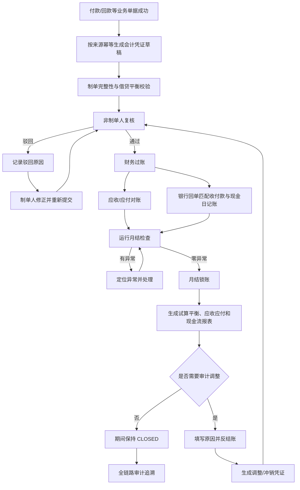
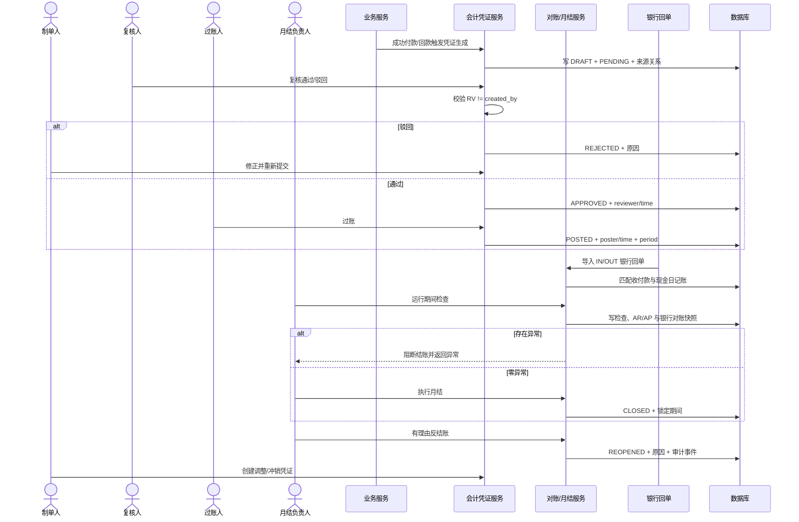
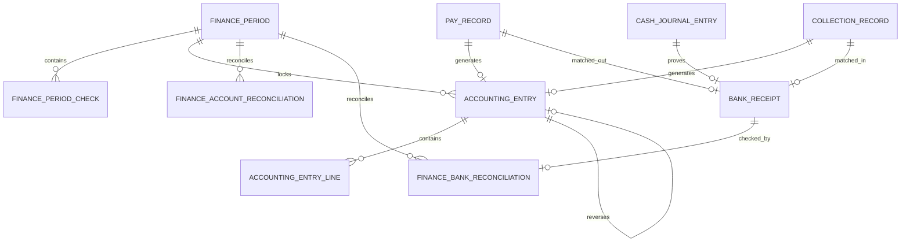

# CGC-PMS 财务核算与月结闭环业务标准

## 1. 目标与适用边界

本标准定义财务核算与月结唯一有效的 P0 主线：

> 业务单据 → 自动会计凭证 → 制单/复核职责分离 → 过账 → 应收应付对账 → 银企对账 → 月结检查 → 锁账 → 财务报表 → 有理由反结账 → 调整凭证 → 重新检查与结账 → 全链路审计。

P0 复用既有付款、回款、现金日记账、会计凭证、应收、付款申请和银行回单事实，不复制业务台账。会计凭证只是业务事实的核算表达，不能代替合同、结算、付款或回款记录。P0 不包含总账多账簿、多币种折算、合并报表、税务申报、固定资产、工资核算、法定报表模板和银行直连接口。

## 2. 当前业务完成度分析

| 节点 | 实施前 | P0 实施结果 |
| --- | --- | --- |
| 凭证生成 | 付款、回款可生成草稿 | 保留来源幂等，新增期间写入门禁 |
| 凭证复核 | 缺失，可直接过账 | `PENDING/APPROVED/REJECTED`；制单人禁止自审；驳回原因必填 |
| 过账 | `DRAFT → POSTED` 无前置 | 仅复核通过且期间可写时过账，记录复核人、过账人和时间 |
| 冲销/调整 | 通用冲销只改状态 | 生成借贷反向调整凭证，复核过账后原凭证才 `REVERSED` |
| 应收应付对账 | 缺失 | 按会计期间生成 AR/AP 业务余额与账面余额对账事实 |
| 银企对账 | 只匹配付款，未校验方向 | `OUT→PAY_RECORD`、`IN→COLLECTION_RECORD`，强制同金额并关联现金日记账 |
| 月结检查 | 缺失 | 检查未过账、借贷不平、来源凭证、银行对账、AR/AP 对账 |
| 锁账/反结账 | 缺失 | 零异常才可锁账；锁账后禁止新增、过账和冲销；反结账必须有原因 |
| 财务报表 | 页面统计，不受期间约束 | 试算平衡、应收、应付和现金流均按已过账事实重算 |
| 审计追溯 | 零散日志 | 期间、检查、对账、凭证和哈希审计事件统一 Trace |

## 3. 业务流程图

## 4. 数据关系与删除策略

| 实体 | 主键/关键外键 | 生命周期 | 删除策略 |
| --- | --- | --- | --- |
| `finance_period` | `id`，租户+年月唯一 | `OPEN → CHECKING → OPEN/CLOSED → REOPENED → CLOSED` | 禁止物理删除；反结账保留原关闭信息 |
| `finance_period_check` | `period_id`，期间+检查类型唯一 | 每次检查重建最新快照 | 仅运行检查事务内重建，不向用户开放删除 |
| `finance_account_reconciliation` | `period_id` | `MATCHED/EXCEPTION` | 同期间重跑重建；已关闭期间禁止重跑 |
| `finance_bank_reconciliation` | `period_id`、`bank_receipt_id` | `MATCHED/EXCEPTION/RESOLVED` | 禁止人工删除；人工处理保留处理人和说明 |
| `accounting_entry` | `period_id`、`original_entry_id`、业务来源 FK | `DRAFT → POSTED → REVERSED` | 过账后禁止修改/逻辑删除；用反向凭证纠错 |
| `bank_receipt` | `pay_record_id` 或 `collection_record_id`、`cash_journal_id` | `UNMATCHED → MATCHED` | 银行原始回单不删除，错误匹配通过对账处理纠正 |

## 5. 节点业务契约

| 节点 | 输入/前置 | 输出/后置 | 核心规则、校验与异常 | 权限、日志与审计 |
| --- | --- | --- | --- | --- |
| 凭证生成 | 成功付款/回款；来源、日期、分录行 | `DRAFT/PENDING` 凭证 | 同来源幂等；借贷相等；期间不可为 `CLOSED`；无分录或不平衡回滚 | `accounting:add`；记录来源与制单人 |
| 凭证复核 | 待复核草稿 | `APPROVED` 或 `REJECTED` | 制单人与复核人必须不同；驳回原因必填；关闭期间禁止复核 | `accounting:review`；记录复核人、时间、意见 |
| 重新提交 | 被驳回草稿 | 回到 `PENDING` | 清除上次复核结果但保留历史更新时间和业务来源 | `accounting:add`；记录操作人 |
| 过账 | 已复核草稿 | `POSTED` | 未复核、被驳回、关闭期间均禁止；写过账人和期间 | `accounting:post`；不可覆盖原来源 |
| 冲销 | 已过账原凭证、冲销原因 | 反向 `DRAFT/PENDING` 调整凭证 | 原凭证只允许一个冲销链；反向凭证复核过账后原凭证才 `REVERSED` | `accounting:adjustment:add`；原/冲销凭证双向追溯 |
| 银行回单匹配 | 方向、流水号、金额、时间 | 收付款、日记账关联 | `OUT` 只能匹配成功付款，`IN` 只能匹配成功回款；金额必须相等；模糊匹配必须唯一 | `finance:integration:maintain`；保存置信度和匹配时间 |
| 月结检查 | 开放/反结账期间 | 六类检查与对账快照 | 未过账、不平衡、缺来源凭证、银行差异、AR/AP 差异计入阻断数 | `finance:close:check`；写检查人、时间、明细 JSON |
| 月结锁账 | 最近检查零异常且检查后无凭证变化 | `CLOSED` | 未检查、检查过期或有异常禁止；关闭后会计期间写保护 | `finance:close:close`；记录关闭人、时间、说明和哈希审计 |
| 反结账 | `CLOSED` 期间、非空原因 | `REOPENED` | 只能关闭期间反结账；清除最近检查资格；必须重新检查结账 | `finance:close:reopen`；原因不可覆盖、审计留痕 |
| 财务报表 | 已存在会计期间 | 试算平衡、AR、AP、现金流 | 只统计 `POSTED` 凭证；报表是重算结果，不写第二套金额事实 | `finance:close:query`；查询留应用访问日志 |
| 全链追溯 | `period_id` | 期间、检查、对账、凭证、审计事件 | 租户隔离；任何金额可反查来源业务单据、银行回单和日记账 | 查询权限；审计事件带 SHA-256 摘要 |

## 6. 验收标准

### 6.1 会计凭证

- ✓ 成功付款和成功回款按来源幂等生成凭证。
- ✓ 借贷不平衡或无分录行时整笔回滚。
- ✓ 制单人不能复核自己的凭证。
- ✓ 驳回必须填写原因，被驳回凭证可重新提交。
- ✓ 未复核通过的凭证不能过账。
- ✓ 过账后不允许直接编辑或删除。
- ✓ 冲销必须生成反向凭证，不能只改原凭证状态。
- ✓ 反向凭证复核过账后原凭证才标记已冲销。

### 6.2 对账与月结

- ✓ 银行支出只匹配付款，银行收入只匹配回款，且金额一致。
- ✓ 银行匹配必须能反查现金日记账。
- ✓ 月结检查覆盖未过账、借贷不平、来源凭证、银行、应收和应付。
- ✓ 任一检查失败时禁止月结。
- ✓ 检查后凭证发生变化必须重新检查。
- ✓ 结账后禁止新增、复核、过账和冲销该期间凭证。
- ✓ 反结账必须填写原因，且调整后必须重新检查和结账。
- ✓ 报表仅按已过账凭证和现有业务台账重算。
- ✓ 从期间可反查所有检查、对账、凭证和审计事件。

## 7. 测试方案

| 类型 | 场景 | 预期 |
| --- | --- | --- |
| 正常 | 草稿→他人复核→过账→零异常检查→月结 | 期间 `CLOSED`，报表可查 |
| 正常 | 关闭期间→有理由反结账→调整→重新月结 | 审计链完整，期间重新关闭 |
| 异常 | 制单人自审 | `ENTRY_REVIEW_SEGREGATION_REQUIRED` |
| 异常 | 未复核直接过账 | `ENTRY_REVIEW_REQUIRED` |
| 异常 | 驳回无原因 | `ENTRY_REJECT_COMMENT_REQUIRED` |
| 异常 | 单边或借贷不平调整 | `ADJUSTMENT_ENTRY_UNBALANCED` |
| 异常 | 未过账凭证存在时月结 | `FINANCE_PERIOD_ISSUES_EXIST` |
| 异常 | 检查后修改凭证 | `FINANCE_PERIOD_CHECK_STALE` |
| 异常 | 关闭期间新增/过账/冲销 | `FINANCE_PERIOD_CLOSED` |
| 异常 | 无原因反结账 | `FINANCE_REOPEN_REASON_REQUIRED` |
| 银企 | OUT 匹配回款或 IN 匹配付款 | 方向不匹配，保持异常 |
| 银企 | 流水相同但金额不同 | 禁止自动匹配 |
| 边界 | 同来源重复生成凭证 | 返回已有事实，不重复写入 |
| 边界 | 同年月重复建立期间 | 返回同一期间，不重复写入 |
| 并发 | 两次月结/反结账请求 | 状态门禁与事务保证单一结果 |
| 租户 | 跨租户查询、复核、对账 | 不可见或按不存在处理 |

自动化基线包括 `AccountingEntryServiceTest`、`FinancialAccountingMonthEndClosedLoopIntegrationTest`、API 契约测试、会计凭证页面测试、月结工作台源契约测试、路由和侧栏测试。上线前还必须执行全量后端验证、前端单测/类型/lint/build、MySQL 迁移和真实浏览器验收。

## 8. 开发路线图

| 优先级 | 内容 | 状态 |
| --- | --- | --- |
| P0 | 制单复核分离、受控过账、反向冲销、AR/AP 与银行对账、月结锁账/反结账、报表、Trace | 本轮实现 |
| P1 | 对账差异指派/处理 SLA、期间关账清单签署、项目/公司多维辅助核算 | 待产品决策 |
| P2 | 银行直连、自动对账规则配置、法定报表模板、账龄与现金流预测联动 | 后续优化 |
| P3 | 多账簿、多币种、合并报表、税务平台集成、电子会计档案 | 未来版本 |

## 9. 风险与控制

- 历史已过账凭证在迁移时回填为复核通过，仅代表兼容历史，不伪造复核人；审计时应区分迁移前后数据。
- AR/AP P0 对账是业务子账一致性校验，不宣称已实现完整总账科目余额核对。
- 银行模糊匹配只允许金额、时间窗口内唯一候选；多候选保持异常，禁止猜测。
- 反结账是高风险权限，生产角色必须最小授权并结合组织审批制度。
- 报表未覆盖税务、合并抵销和法定格式，不得直接作为对外法定报表。

## 10. 唯一标准结论

任何绕过复核直接过账、绕过检查直接锁账、关闭期间直接改账、用状态修改代替反向凭证、或把银行回单人工清零而不关联收付款和现金日记账的实现，均不符合本标准。后续开发必须优先保持本闭环的数据来源唯一、金额守恒、状态可逆但不可覆盖历史、职责分离和全链可追溯。
