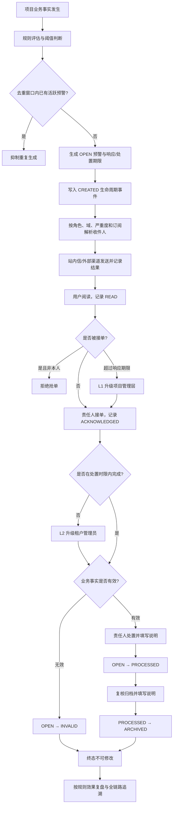
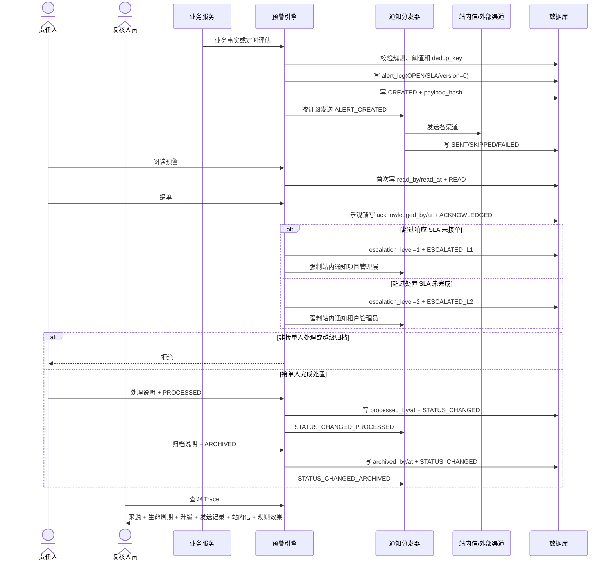
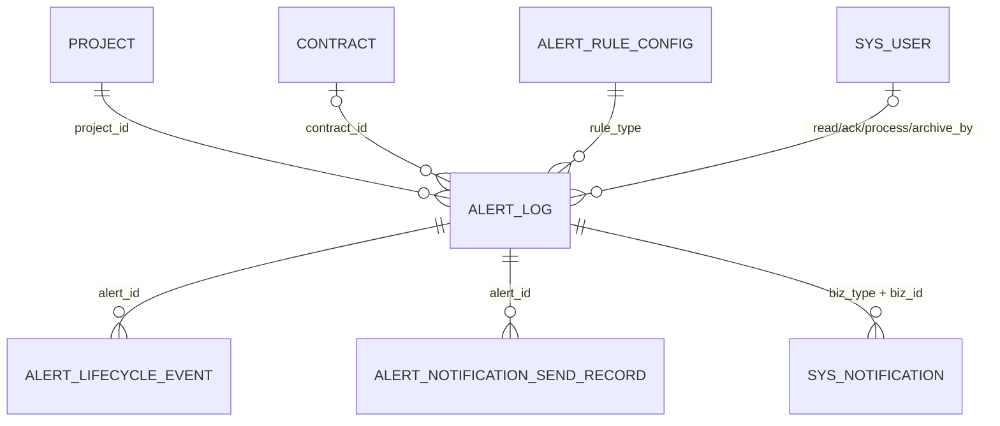

# CGC-PMS 项目预警与通知闭环业务标准

## 1. 目标与唯一业务主线

本标准定义项目预警与通知 P0 唯一有效主线：

> 业务事实 → 规则评估 → 去重生成预警 → 计算响应/处置期限 → 订阅与渠道发送 → 阅读 → 责任人接单 → 处置 → 超时升级 → 复核归档/失效 → 规则效果复盘 → 全链路追溯。

预警不是独立录入的任务清单。每条预警必须保留项目、合同、业务来源、规则、通知发送、责任人及状态事件，能够从预警反查来源，也能从生命周期事件核验操作人、时间和 SHA-256 快照摘要。

P0 复用现有 `alert_log`、规则配置、订阅、站内信和外部渠道发送器，不另建第二套消息平台；内置固定两级超时升级。P0 不包含消息队列重试中心、值班排班、可配置升级矩阵、工单协同、AI 研判和外部渠道回执对账。

## 2. 当前业务完成度

| 节点 | 实施前 | P0 结果 |
| --- | --- | --- |
| 来源与规则 | 多类规则和四类生产源已存在 | 所有生产源统一初始化 SLA 并写 CREATED 事件 |
| 去重 | 按规则窗口和 `dedup_key` 抑制 | 保留，活跃预警不重复生成 |
| 通知 | 有订阅、渠道和发送记录 | 状态事件按目标状态区分，处理与归档通知不再相互误抑制 |
| 阅读 | 仅有 `is_read` | 增加首次阅读人、阅读时间和 READ 事件 |
| 接单 | 无明确责任人 | 增加唯一接单责任人和 ACKNOWLEDGED 事件，禁止抢单 |
| SLA | 无响应时限 | 响应 SLA 为 HIGH 4 小时、MEDIUM 24 小时、LOW 72 小时；处置 SLA 为 24/72/168 小时 |
| 升级 | 缺失 | 未接单超过响应 SLA 自动 L1 升级项目管理层；未处理超过处置 SLA 自动 L2 升级租户管理员 |
| 状态机 | 可任意覆盖状态 | 固化 OPEN → PROCESSED → ARCHIVED，或 OPEN → INVALID |
| 并发 | 后写覆盖前写 | `version` 乐观锁冲突要求刷新重试 |
| 审计 | `updated_by` 兼任处理人 | 阅读、接单、处理、归档操作人分别持久化 |
| 追溯 | 页面只看当前态 | Trace 汇总来源、生命周期、发送记录和站内信 |
| 统计与复盘 | 总数、已读、状态分布 | 增加未接单、逾期、升级、发送失败，并按规则统计命中、SLA内响应、处置、归档和平均响应时间 |

## 3. 流程图

## 4. 数据关系与删除策略

| 实体 | 主键与关键外键 | 生命周期 | 删除策略 |
| --- | --- | --- | --- |
| `alert_log` | PK `id`；租户、项目、可选合同及来源类型/ID；响应/处置期限及升级级别 | OPEN/PROCESSED/ARCHIVED/INVALID | 业务只逻辑删除；终态历史不改写 |
| `alert_lifecycle_event` | PK `id`；FK `alert_id` | 只追加，不更新 | 业务禁止删除；物理清理预警时级联，避免孤儿 |
| `alert_notification_send_record` | PK `id`；关联 `alert_id` | SENT/SKIPPED/FAILED | 作为渠道证据保留，不随状态覆盖 |
| `sys_notification` | PK `id`；`biz_type=ALERT/ALERT_STATUS/ALERT_ESCALATION`、`biz_id=alert_id` | 未读/已读 | 按租户和用户隔离，不作为预警状态事实 |
| `alert_rule_config` | 租户 + `rule_type` 唯一 | 启用/停用 | 停用只影响未来评估，不删除历史预警 |

## 5. 状态、权限与并发

| 当前状态 | 操作 | 目标状态 | 硬门禁 |
| --- | --- | --- | --- |
| OPEN | 阅读 | OPEN | 首次阅读写人和时间；重复阅读幂等 |
| OPEN | 接单 | OPEN | 只能一个责任人；本人重复接单幂等；他人抢单拒绝 |
| OPEN | 响应超时升级 | OPEN/L1 | 未接单且超过响应期限；同级只升级一次 |
| OPEN | 处置超时升级 | OPEN/L2 | 未完成且超过处置期限；L2 只升级一次 |
| OPEN | 完成处理 | PROCESSED | 必须是接单责任人；必须填写说明 |
| OPEN | 标记无效 | INVALID | 必须填写失效原因 |
| PROCESSED | 归档 | ARCHIVED | 必须填写归档说明 |
| ARCHIVED/INVALID | 任意状态变更 | — | 终态不可修改 |

- 查看列表、报表和 Trace：`alert:view` 或 ADMIN/SUPER_ADMIN。
- 阅读、接单和状态变更：`alert:edit` 或 ADMIN/SUPER_ADMIN。
- 手工批量评估与超时升级扫描：`alert:evaluate` 或 ADMIN/SUPER_ADMIN。
- 所有操作继续执行租户、项目成员和业务域数据范围校验。
- 所有更新携带 `version`；更新行数为 0 返回并发冲突，不允许静默覆盖。

## 6. 节点业务契约

| 节点 | 输入/输出 | 前置/后置 | 规则、校验与异常 | 日志与审计 |
| --- | --- | --- | --- | --- |
| 规则评估 | 项目、业务事实、规则配置 → 候选预警 | 项目有效、规则启用 → 生成或抑制 | 阈值、时间窗、`dedup_key`；异常按项目隔离并记录 | 评估数量和失败项目日志 |
| 预警生成 | 来源、严重度、消息 → OPEN 预警 | 候选通过 → SLA、version、CREATED | 项目/来源/规则必填；重复键禁止活跃重复 | CREATED 事件含 64 位摘要 |
| 通知发送 | 预警、收件人、渠道 → 发送记录 | 订阅启用且域/严重度匹配 | 每个状态目标独立幂等；失败不得伪记 SENT | 请求、完成、失败原因留痕 |
| 阅读 | alertId → 已读事实 | 有查看与编辑范围 → 首次读人/时间 | 重复阅读幂等；越权拒绝 | READ 生命周期事件 |
| 接单 | alertId、可选说明 → 责任人 | OPEN 且未被他人接单 | 同人幂等、他人抢单拒绝；接单同时标记已读 | ACKNOWLEDGED 事件、操作审计 |
| 超时升级 | 当前时间、响应/处置期限 → L1/L2 | OPEN 且达到对应 SLA | L1 通知项目管理层；L2 通知租户管理员；扫描直接从开放超时预警取得租户，不因项目暂停或关闭而漏掉存量预警；重复扫描幂等 | ESCALATED_L1/L2、接收人和通知结果留痕 |
| 处理 | alertId、处理说明 → PROCESSED | OPEN、本人已接单 | 空说明、非责任人、并发更新、越级均拒绝 | processed_by/at、状态事件、通知 |
| 失效 | alertId、失效原因 → INVALID | OPEN | 仅 OPEN 可失效；终态不可逆 | archived_by/at、状态事件、通知 |
| 归档 | alertId、归档说明 → ARCHIVED | PROCESSED | OPEN 不可直接归档；终态不可逆 | archived_by/at、状态事件、通知 |
| Trace | alertId → 聚合追溯对象 | 通过租户/项目/域范围 | 不存在或越权拒绝；不暴露其他用户通知 | 只读查询，不改业务事实 |
| 规则效果复盘 | 项目、规则类型、域、时间范围 → 规则统计 | 与列表同一数据范围和筛选条件 | 命中、SLA内响应、升级、处理、归档、失效、通知失败和平均响应时间统一从事实聚合 | 查询操作受访问日志保护 |

## 7. 验收标准

### 预警生成与通知

- [ ] 必须绑定租户、项目、规则类型、严重度和来源定位；合同允许按规则为空。
- [ ] HIGH/MEDIUM/LOW 分别生成 4/24/72 小时响应期限。
- [ ] HIGH/MEDIUM/LOW 分别生成 24/72/168 小时处置期限。
- [ ] 同一 `dedup_key` 在有效窗口内不得重复生成活跃预警。
- [ ] 创建、处理、归档、失效通知必须分别留存发送结果；处理通知不得抑制归档通知。
- [ ] FAILED 必须保留失败原因，SKIPPED 必须保留抑制原因。

### 阅读、接单与处理

- [ ] 阅读首次写 `read_by/read_at`，重复阅读不追加重复事件。
- [ ] 接单写唯一 `acknowledged_by/at`，他人不得抢单。
- [ ] 未接单或非责任人不得标记已处理。
- [ ] OPEN 不得直接归档；只有 PROCESSED 可归档。
- [ ] OPEN 可凭原因标记 INVALID；ARCHIVED/INVALID 不得再次修改。
- [ ] 所有状态变更必须填写不超过 500 字的说明。
- [ ] 并发更新只能一个成功，失败方收到刷新重试提示。
- [ ] 未接单超过响应期限必须只触发一次 L1 升级并通知项目管理层。
- [ ] 未完成超过处置期限必须只触发一次 L2 升级并通知租户管理员。
- [ ] 已处理、已归档或已失效预警不得再升级。

### 追溯与审计

- [ ] Trace 必须返回预警、项目/合同/来源、生命周期事件、渠道发送记录和站内信。
- [ ] 每个生命周期事件必须记录操作人、时间、前后状态和 64 位 SHA-256 摘要。
- [ ] `handledBy` 必须来自接单/处理/归档责任字段，不得再由通用 `updated_by` 冒充。
- [ ] 列表、Trace、写操作必须执行租户、项目和业务域权限隔离。
- [ ] 规则效果复盘必须按当前项目、规则类型、域和时间范围统计，任何指标可回查原始预警与通知事实。
- [ ] 项目暂停或关闭后仍为 OPEN 的超时预警必须继续进入升级扫描，不得依赖 ACTIVE 项目列表。

## 8. 测试方案

| 类型 | 场景 | 预期 |
| --- | --- | --- |
| 正常 | 生成→通知→阅读→接单→处理→归档→Trace | 状态、责任人、通知和三类事件完整 |
| 正常 | OPEN→INVALID | 记录原因并进入不可变终态 |
| 异常 | 未接单直接处理 | `ALERT_HANDLER_REQUIRED` |
| 异常 | OPEN 直接归档 | `ALERT_STATUS_TRANSITION_INVALID` |
| 异常 | 他人抢单/处理 | 拒绝且原责任人不变 |
| 异常 | 空处理说明 | 请求校验失败或 `ALERT_STATUS_REMARK_REQUIRED` |
| 异常 | 终态再次修改 | `ALERT_TERMINAL_IMMUTABLE` |
| 并发 | 两人同时接单/更新同版本 | 仅一个成功，另一方并发冲突 |
| 幂等 | 重复阅读、本人重复接单、重复同状态 | 成功但不重复写业务事件 |
| 权限 | 跨租户、非项目成员、无域权限查询/处理 | 不可见或明确拒绝 |
| 通知 | 同一预警先处理再归档 | 两次站内通知均发送，事件类型不同 |
| 升级 | 响应逾期未接单、处置逾期未完成、重复扫描 | 分别形成 L1/L2；重复扫描无重复事件或通知 |
| 升级边界 | 已处理或终态预警已超过期限 | 不升级 |
| 复盘 | 同一规则混合及时响应、升级、处理、归档和失败通知 | 按规则聚合指标与原始事实一致 |
| 统计 | 未接单、超期、渠道失败混合数据 | KPI 与当前筛选和访问范围一致 |
| 迁移 | MySQL/H2 从 V193 升级 V194 | 字段回填、索引、外键和事件表均成功 |

自动化证据覆盖 `AlertEvaluationServiceTest`、`AlertControllerTest`、`AlertNotificationDispatcherTest`、`CashJournalAlertConcurrencyTest`、`WorkflowNotificationAlertServiceTest`、`ProjectScheduleClosedLoopIntegrationTest`、前端 alert 页面测试及 API 契约测试。

## 9. 开发路线图

- P0：本标准所述来源统一、响应/处置双 SLA、固定两级升级、阅读、接单、受控状态机、并发、通知事件去重、规则效果复盘、Trace、KPI、页面和自动化测试。
- P1：通知失败重试与死信治理、可配置升级矩阵、升级代理和值班排班。
- P2：规则模拟、抑制日历、批量责任转派、渠道回执对账和趋势分析。
- P3：跨项目预警运营中心、外部工单协同和可解释的智能研判。

后续能力不得绕过 P0 的唯一责任人、受控状态机、租户项目范围和不可变追溯事件。

## 10. 风险与边界

- 历史预警没有原始接单事实；迁移只能依据旧处理状态和 `updated_by` 回填，属于迁移推断，不应冒充原始操作证据。
- 外部邮件、企业微信和短信发送器的“已配置/已实现”状态取决于部署环境；P0 保证发送意图和结果留痕，不宣称第三方必达。
- `payload_hash` 用于发现事件快照篡改，不等于电子签名或可信时间戳。
- Trace 中站内信按租户和预警聚合，仅供具有预警查看范围的管理界面展示；不得扩展为跨租户或无权限用户的消息读取入口。
