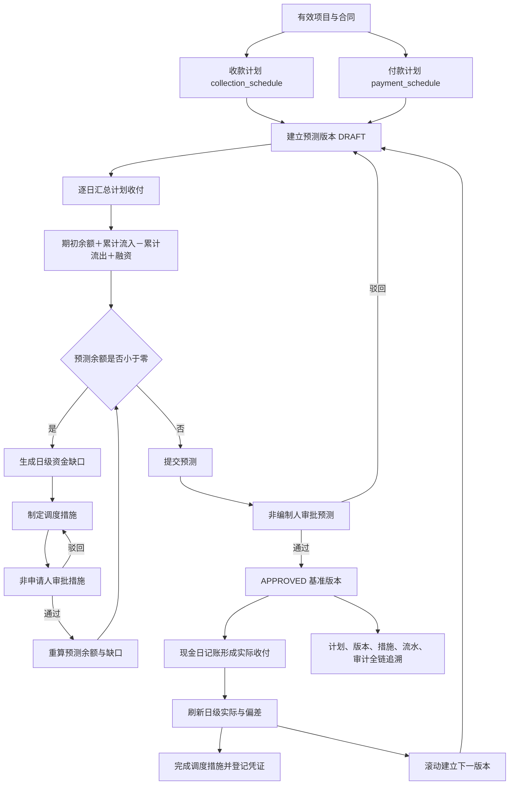
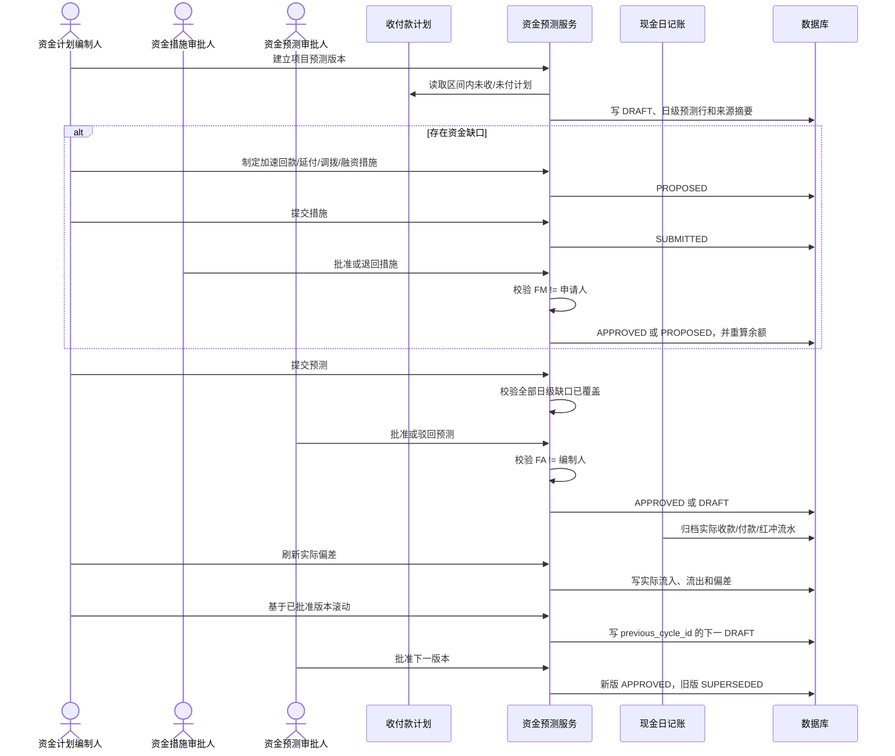
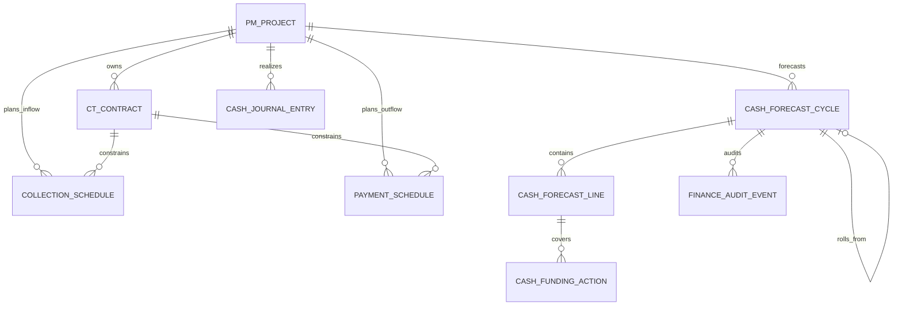
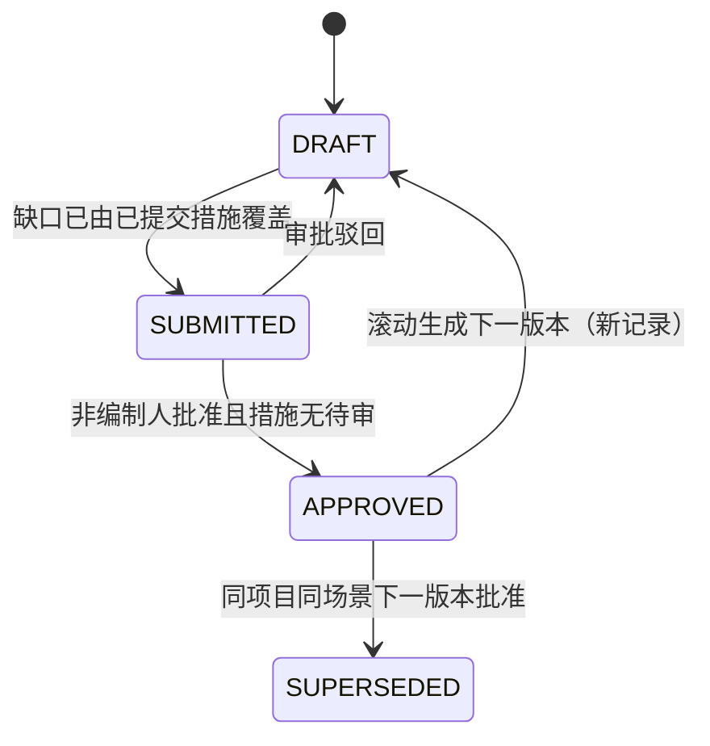
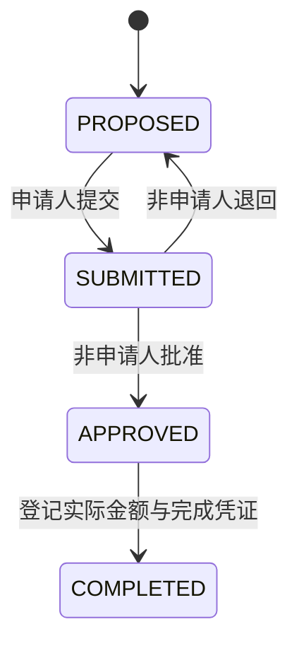

# CGC-PMS 项目资金计划与现金预测闭环业务标准

## 1. 目标与唯一业务主线

本标准定义项目资金计划与现金预测唯一有效的 P0 主线：

> 项目与合同 → 收款计划＋付款计划 → 预测版本 → 日级滚动现金预测 → 资金缺口 → 资金调度措施 → 编审职责分离 → 实际收付 → 偏差分析 → 下一版本修正 → 全链路追溯。

预测不新建第二套应收、应付、付款或回款事实。计划收入只取 `collection_schedule` 未收余额，计划支出只取 `payment_schedule` 未付余额；实际收付只取已归档或已红冲的 `cash_journal_entry`。旧 `cash_forecast` 手工行仍保留兼容，但不是本闭环的版本主档、审批依据或唯一事实。

P0 不包含集团资金中心、授信额度、融资计息、多币种、银企直联自动调拨、概率模拟、AI 预测和跨法人资金池。

## 2. 当前业务完成度分析

| 节点 | 实施前 | P0 实施结果 |
| --- | --- | --- |
| 收款计划 | 已存在项目/合同/应收计划 | 作为预测计划流入唯一来源，不复制金额 |
| 付款计划 | 已存在项目/合同/付款计划 | 作为预测计划流出唯一来源，不复制金额 |
| 预测版本 | 仅有孤立手工预测行 | 新增项目、场景、预测区间、版本号、上期版本和状态主档 |
| 日级预测 | 无连续余额链 | 按期初余额、计划收付和已批准融资逐日计算余额与缺口 |
| 缺口处置 | 无结构化事实 | 新增加速回款、延后付款、资金调拨、融资四类措施及状态机 |
| 审批 | 无审批与职责分离 | 预测编制人与审批人、措施申请人与审批人强制不同 |
| 实际收付 | 与预测无关系 | 从现金日记账刷新日级实际流入、流出和偏差 |
| 滚动修正 | 无版本链 | 已批准版本可滚动生成下一草稿；新版本批准后旧版失效 |
| 追溯 | 无统一入口 | Trace 返回计划来源、日行、措施、实际流水和哈希审计事件 |
| 页面/API/测试 | 旧统计接口，无闭环工作台 | 新增完整 API、资金预测工作台、目标集成与前端契约测试 |

## 3. 业务流程图

## 4. 数据关系、主外键与删除策略

| 实体 | 主键与关键关系 | 生命周期 | 删除策略 |
| --- | --- | --- | --- |
| `pm_project` | `id`；预测主档 `project_id` FK | `ACTIVE/SUSPENDED/CLOSED` | 预测事实存在时不得物理删除；暂停/关闭禁止新建版本 |
| `ct_contract` | `id → project_id` | 合同既有状态机 | 计划及流水事实存在时 RESTRICT |
| `collection_schedule` | `id → project_id, contract_id, receivable_id` | `PLANNED → PARTIALLY_COLLECTED/COLLECTED` | 不由预测删除；预测只读未收余额 |
| `payment_schedule` | `id → project_id, contract_id, pay_application_id` | `PLANNED → PARTIALLY_PAID/PAID` | 不由预测删除；预测只读未付余额 |
| `cash_forecast_cycle` | `id → project_id, previous_cycle_id`；租户+项目+场景+版本唯一 | `DRAFT → SUBMITTED → APPROVED → SUPERSEDED`，驳回回 `DRAFT` | 不开放删除；错误版本以驳回或后续版本替代 |
| `cash_forecast_line` | `id → cycle_id`；版本+日期唯一 | 由草稿重算生成，批准后只刷新实际列 | 随版本永久保留；有措施时禁止草稿原地重算 |
| `cash_funding_action` | `id → cycle_id, line_id, project_id` | `PROPOSED → SUBMITTED → APPROVED → COMPLETED`；驳回回 `PROPOSED` | 不物理删除；取消状态预留，P0 不提供任意删除 |
| `cash_journal_entry` | `id → project_id, contract_id` | 既有归档/红冲状态机 | 预测只读；不得为迁就预测修改或删除流水 |
| `finance_audit_event` | `business_type=CASH_FORECAST_CYCLE`、`business_id=cycle_id` | 追加写 | 禁止覆盖和物理删除，载荷保存 SHA-256 摘要 |

## 5. 状态流转与金额口径

- 计划流入 = 当日 `collection_schedule.planned_amount - collected_amount`，仅统计 `PLANNED/PARTIALLY_COLLECTED`。
- 计划流出 = 当日 `payment_schedule.planned_amount - paid_amount`，仅统计 `PLANNED/PARTIALLY_PAID`。
- 当日预测余额 = 前日余额 + 计划流入 + 已批准调拨/融资 - 计划流出。
- 当日缺口 = `max(0, -当日预测余额)`。
- 实际流入/流出 = 当日有效现金流水按方向汇总。成对红冲保留原流水和反向流水；无反向行的遗留 `REVERSED` 流水按零处理，禁止二次放大。
- 流入偏差 = 实际流入 - 计划流入；流出偏差 = 实际流出 - 计划流出。
- 滚动版本期初余额 = 上版本期初余额 + 基准区间实际流入 - 实际流出，最低为零。

## 6. 节点业务契约

| 节点 | 输入数据 | 输出数据 | 前置条件 | 后置条件 | 业务规则 | 异常处理 | 数据校验 | 权限要求 | 日志要求 | 审计要求 |
| --- | --- | --- | --- | --- | --- | --- | --- | --- | --- | --- |
| 收款计划来源 | 项目、合同、计划日、计划/已收金额 | 日级计划流入 | 计划属于当前租户和项目 | 写入预测行来源摘要，不修改计划 | 只取未收余额和有效状态 | 来源查询失败则整版生成回滚 | 金额非负、计划日落在区间 | `finance:forecast:query/maintain` 与项目数据范围 | 请求与异常应用日志 | Trace 返回原收款计划 |
| 付款计划来源 | 项目、合同、计划日、计划/已付金额 | 日级计划流出 | 同上 | 同上 | 只取未付余额和有效状态 | 同上 | 同上 | 同上 | 同上 | Trace 返回原付款计划 |
| 建立预测版本 | 项目、名称、基准日、区间、场景、期初余额、可选上期 | `DRAFT` 主档和连续日行 | 项目存在且非暂停/关闭；有项目访问权 | 版本号、来源截点和日行原子写入 | 区间最多 366 天；同场景版本递增；上期必须同项目 | 任一日期/场景/来源非法则回滚 | 名称非空、期初非负、日期顺序正确 | `finance:forecast:maintain` | 记录创建成功/失败 | `CASH_FORECAST_CREATED` + 哈希 |
| 重算草稿 | 草稿版本 | 替换后的日行 | 状态 `DRAFT` 且尚无任何措施 | 更新来源截点和版本号 | 有措施后禁止原地重算，应滚动新版本 | 状态或措施冲突时 fail-close | 重新校验计划金额与日期 | `finance:forecast:maintain` | 记录重算 | `CASH_FORECAST_REGENERATED` |
| 缺口识别 | 连续预测余额 | 每日 `gap_amount` | 日行完整且按日期有序 | 缺口可制定措施 | 缺口不得手工改写 | 算法异常整版回滚 | 金额统一两位小数 | 查询随预测权限 | 计算异常日志 | 来源摘要可重算验证 |
| 制定/审批措施 | 缺口行、类型、日期、金额、原因、可选来源 | 措施状态；调拨/融资重算余额 | 预测为 `DRAFT`，金额不超过未覆盖缺口 | 提交后待他人审批；批准融资计入日行 | 措施日期必须等于缺口日；申请人不能自批 | 超额、跨行、跨租户、状态非法均不写入 | 金额正数、原因必填、类型白名单 | `finance:forecast:action`；审批需 `action:approve` | 记录每次状态动作 | 创建、批准、驳回、完成均追加事件 |
| 提交/审批预测 | 草稿版本、审批意见 | `SUBMITTED/APPROVED/DRAFT` | 总缺口被已提交/批准/完成措施足额覆盖 | 批准后成为同场景唯一有效版 | 编制人不能自批；措施有待审时预测不能批准 | 驳回回草稿且保留意见；重复状态动作拒绝 | 意见非空、状态和职责分离 | `submit` 与 `approve` 分权 | 记录操作人和状态 | 提交/批准/驳回追加哈希事件 |
| 刷新实际偏差 | 已批准/已失效版本、现金日记账 | 实际流入/流出、两类偏差、刷新时间 | 状态为 `APPROVED/SUPERSEDED` | 预测与实际在同一日粒度可比较 | 只读正式现金流水；不反写计划 | 草稿或提交态禁止刷新 | 租户、项目、日期、方向、红冲关系 | `finance:forecast:refresh` | 记录刷新行数 | `CASH_FORECAST_ACTUAL_REFRESHED` |
| 完成措施 | 已批准措施、实际金额、凭证号 | `COMPLETED` | 措施已批准 | 保存实际执行证据 | 完成金额正数；不得覆盖历史申请额 | 重复完成或无凭证拒绝 | 凭证非空、金额两位小数 | `finance:forecast:action` | 记录完成动作 | 记录完成引用和操作人 |
| 滚动修正 | 已批准版本、新基准日、新截止日、新名称 | 关联上期的下一 `DRAFT` | 原版 `APPROVED`；新基准日晚于原基准日 | 新版重新汇总计划；旧版仍有效至新版批准 | 新版批准时才把旧版标记 `SUPERSEDED` | 非批准版本或无效日期拒绝 | 期初余额按实际净现金重算 | `finance:forecast:maintain` | 记录滚动创建 | 上下版本可双向追溯 |
| 全链追溯 | `cycle_id` | 主档、日行、措施、计划、流水、审计 | 有项目查询权限 | 不改变业务数据 | 所有查询强制租户与项目范围 | 跨租户按不存在处理 | 外键、版本链和哈希长度可校验 | `finance:forecast:query` | 访问日志 | 审计事件只追加、不覆盖 |

## 7. 验收标准

### 7.1 预测版本

- ✓ 必须绑定项目，且项目不得为暂停或关闭。
- ✓ 基准日、预测开始、预测截止必须有序，最长 366 天。
- ✓ 必须填写场景、名称和非负期初余额。
- ✓ 同项目同场景版本号必须唯一递增。
- ✓ 日级流入、流出必须来自既有收付款计划，不允许手工伪造来源。
- ✓ 草稿存在缺口时，未由已提交措施足额覆盖不得提交。
- ✓ 编制人不得审批自己的预测。
- ✓ 措施仍在待审批时预测不得批准。
- ✓ 同项目同场景只能有一个当前批准版本；新版批准后旧版才失效。
- ✓ 已批准版本不得重算计划行，只能刷新实际或滚动新版本。

### 7.2 缺口与资金措施

- ✓ 缺口必须按逐日连续余额自动计算，不允许人工录入缺口。
- ✓ 措施必须绑定预测版本和具体缺口日。
- ✓ 措施金额不得超过该日剩余未覆盖缺口。
- ✓ 仅允许加速回款、延后付款、资金调拨和融资四类措施。
- ✓ 措施申请人不得自批；驳回后回到拟定态。
- ✓ 仅批准的调拨/融资可增加预测可用资金并触发重算。
- ✓ 完成措施必须记录实际金额和完成凭证号。

### 7.3 实际、偏差与追溯

- ✓ 实际收付必须来自现金日记账，不允许在预测中重复录入。
- ✓ 红冲不得造成实际现金流双倍计算。
- ✓ 每个预测日必须展示计划、实际和偏差。
- ✓ 滚动版本必须保存 `previous_cycle_id`，并按实际净现金修正新期初。
- ✓ 从预测可反查收款计划、付款计划、资金措施、现金流水和审计事件。
- ✓ 审计摘要必须为 64 位 SHA-256，历史事件不可覆盖。
- ✓ 跨租户、无项目数据范围的读取或操作必须被拒绝。

## 8. 测试方案

| 类型 | 场景 | 预期 |
| --- | --- | --- |
| 正常 | 有收款和付款计划、余额充足 | 生成连续日行，缺口为零，可提交审批 |
| 正常 | 出现缺口→融资措施→他人审批 | 融资计入余额，缺口清零，预测可提交 |
| 正常 | 批准预测→归档实际收付→刷新 | 实际与两类偏差正确写入 |
| 正常 | 已批准版本滚动并批准新版 | 新版关联上期，旧版 `SUPERSEDED` |
| 异常 | 缺口未覆盖提交 | `CASH_FORECAST_GAP_UNCOVERED` |
| 异常 | 编制人自批预测 | `CASH_FORECAST_APPROVAL_SEGREGATION_REQUIRED` |
| 异常 | 措施申请人自批 | `CASH_FUNDING_ACTION_SEGREGATION_REQUIRED` |
| 异常 | 措施日期与缺口日不同 | `CASH_FUNDING_ACTION_DATE_MISMATCH` |
| 异常 | 措施金额超过缺口 | `CASH_FUNDING_ACTION_EXCEEDS_GAP` |
| 异常 | 预测区间超过 366 天或日期倒置 | `CASH_FORECAST_HORIZON_INVALID` |
| 异常 | 暂停/关闭项目新建预测 | `CASH_FORECAST_PROJECT_NOT_OPERATIONAL` |
| 异常 | 已批准版本原地重算 | 状态门禁拒绝且数据不变 |
| 异常 | 措施待审批时批准预测 | `CASH_FORECAST_ACTION_APPROVAL_REQUIRED` |
| 重复 | 重复提交/批准/完成 | 第二次按状态门禁拒绝，不重复记账 |
| 红冲 | 原支出已红冲且存在反向收入行 | 实际流入、流出各 100，净现金流为零，不双算 |
| 边界 | 期初零、单日区间、366 天区间 | 合法生成；367 天拒绝 |
| 边界 | 小数两位上限、0.01 措施 | 金额精度正确；零或负数拒绝 |
| 租户 | 跨租户 Trace 或状态操作 | 按不存在处理，不泄露项目事实 |
| 追溯 | 查询批准版本 Trace | 计划、日行、措施、流水、审计完整且哈希有效 |

自动化基线包括 `ProjectCashForecastClosedLoopIntegrationTest`、资金预测 API 契约测试、页面源契约测试、路由和侧栏测试。上线前还必须执行全量后端 `clean verify`、前端类型/lint/test/build、MySQL 8.4 真实迁移、运行态健康检查和真实浏览器闭环验收。

## 9. 开发路线图

| 优先级 | 内容 | 状态 |
| --- | --- | --- |
| P0 | 版本主档、计划自动汇总、日级余额/缺口、措施编审、预测审批、实际偏差、滚动版本、Trace、工作台 | 本轮实现 |
| P1 | 收付款计划变更提醒、缺口措施责任人/期限/SLA、项目与公司资金池额度联动、偏差原因分类 | 待产品决策 |
| P2 | 多场景对比、周/月汇总视图、敏感性分析、授信占用与融资成本、驾驶舱趋势 | 后续优化 |
| P3 | 多币种、集团跨法人调度、银企直联自动执行、概率模拟与 AI 预测 | 未来版本 |

禁止在 P0 未稳定前新增独立手工现金预测台账、重复应收应付或与现金日记账并行的“实际收付”录入入口。

## 10. 风险与控制

- 计划质量决定预测质量；P0 提供来源追溯，但不能替代项目团队及时维护收付款计划。
- 已批准调拨/融资只代表预测资金来源，不代表银行已经执行；必须以措施 `COMPLETED` 和实际现金流水区分计划与实绩。
- 加速回款和延后付款在 P0 仅作为治理措施，不自动改写原收付款计划，避免越权改变合同义务。
- 旧 `cash_forecast` 为兼容功能，后续若迁移必须明确映射和审计，不能自动宣称为已审批版本。
- P0 期初余额由编制人录入并受审批；如企业要求与账户余额强一致，应在 P1 增加资金账户快照对账，而不是静默覆盖。
- 跨项目/跨法人调拨涉及权限、资金归属和内部往来核算，未建立公司级模型前不得在本服务中伪实现。

## 11. 唯一标准结论

任何手工填写缺口、绕过收付款计划生成预测、由编制人自批、未覆盖缺口直接批准、把措施批准当成真实到账、在预测中重复录入实际收付、覆盖已批准版本或丢失上期版本关系的实现，均不符合本标准。后续开发必须保持来源唯一、金额连续、编审分离、版本不可覆盖、实际取自现金日记账和全链可追溯。
