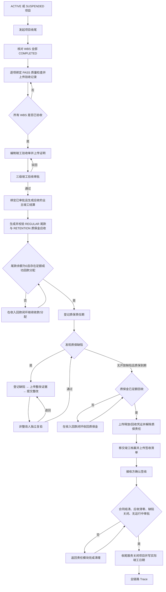
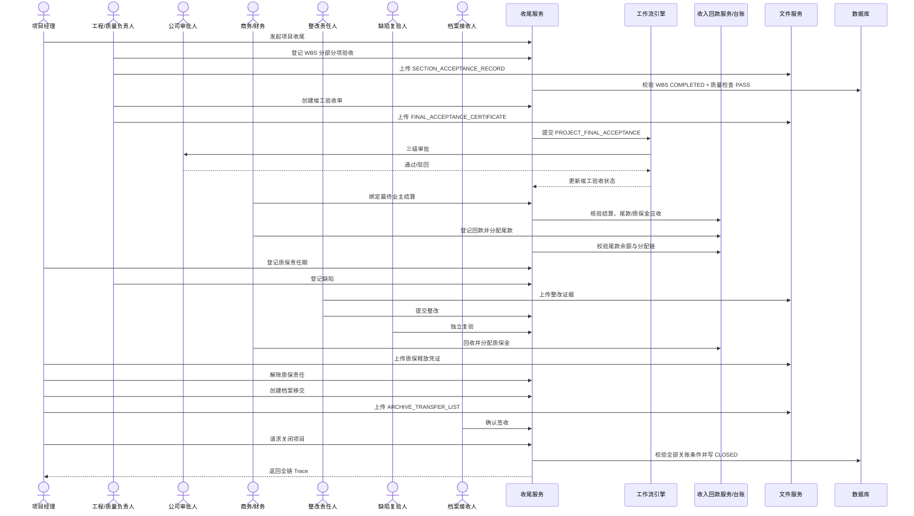
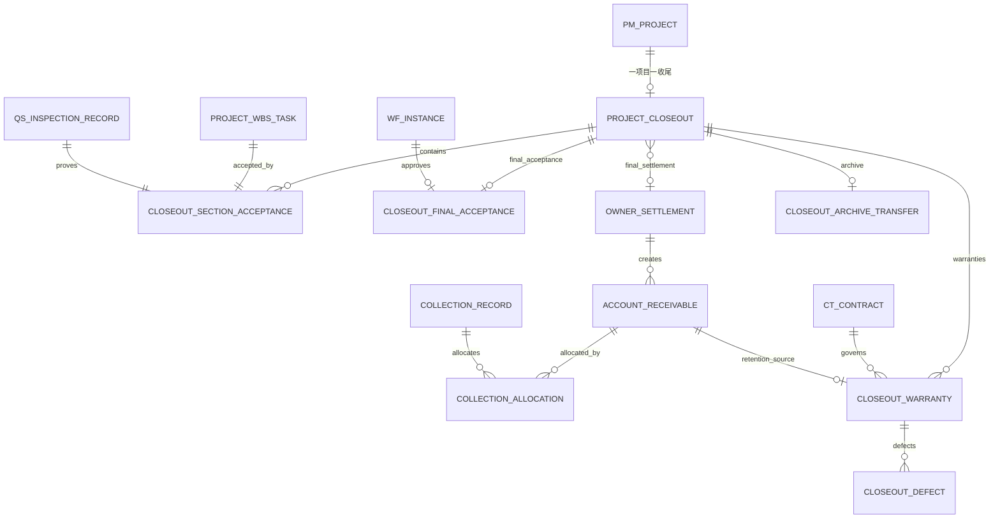

# CGC-PMS 项目竣工与收尾闭环业务标准

## 1. 目标与适用边界

本标准定义项目竣工收尾唯一有效的 P0 主线：

> 分部分项验收 → 竣工验收 → 多级审批 → 竣工结算 → 尾款回收 → 质保金责任期 → 缺陷登记/整改/独立复验 → 质保金回收与释放 → 档案移交签收 → 项目关闭 → 全链路追溯。

项目不得从通用状态按钮直接关闭。只有当施工 WBS 全部完工并完成分部分项验收、竣工验收审批通过、竣工结算形成尾款和质保金应收、全部应收有成功回款分配、缺陷全部复验关闭、档案已签收、合同全部结清且无运行中审批时，收尾服务才允许把项目置为 `CLOSED`。

P0 复用既有 `owner_settlement`、`account_receivable`、`collection_record`、`collection_allocation`、`ct_contract`、质量安全闭环、项目计划 WBS 和工作流；禁止复制一套“收尾结算/回款”金额台账。P0 不包含电子签章、城建档案馆外部接口、竣工模型/BIM、保函管理、司法索赔、自动银行直联或项目后评价。

## 2. 当前业务完成度分析

### 2.1 实施前源码事实

| 节点 | 实施前状态 | 关键缺口 |
| --- | --- | --- |
| 分部分项验收 | WBS 和质量检查各自存在 | 无收尾验收主线及一一对应关系 |
| 竣工验收 | 缺失 | 无验收单、多级审批、证据锁定 |
| 竣工结算 | 业主结算和分包终期结算已存在 | 无“最终结算”标识和收尾绑定 |
| 尾款回收 | 应收、回款、分配已存在 | 无收尾阶段门禁和足额回款追溯校验 |
| 质保金 | 业主结算能生成 `RETENTION` 应收 | 无责任期、释放条件和缺陷关联 |
| 缺陷责任 | 质量问题闭环存在 | 无质保期缺陷及整改/复验职责分离 |
| 档案移交 | 项目归档接口存在 | 无移交清单、接收人、签收证据 |
| 项目关闭 | ACTIVE/SUSPENDED 可直接转 CLOSED | 可绕过验收、回款、质保和档案 |
| 全链追溯 | 缺失 | 不能从项目关闭反查完整证据链 |

### 2.2 P0 实施结果

| 节点 | 实现载体 | 完成度 |
| --- | --- | --- |
| 收尾主档 | `project_closeout` | 已实现，一项目一条 |
| 分部分项验收 | `closeout_section_acceptance` 关联 WBS、质量检查和附件 | 已实现 |
| 竣工验收审批 | `closeout_final_acceptance`、`PROJECT_FINAL_ACCEPTANCE` 三级工作流 | 已实现 |
| 竣工结算 | 绑定既有 `owner_settlement` 并标记 `settlement_type=FINAL` | 已实现 |
| 尾款回收 | 校验 `REGULAR` 应收余额和成功 `collection_allocation` | 已实现 |
| 质保责任 | `closeout_warranty` 关联合同和 `RETENTION` 应收 | 已实现 |
| 缺陷责任 | `closeout_defect`，整改人与复验人分离 | 已实现 |
| 档案移交 | `closeout_archive_transfer` 和签收清单 | 已实现 |
| 项目关闭 | 收尾服务唯一关闭入口 | 已实现 |
| 管理工作台/Trace | `/project-closeout`、`/project-closeouts/{id}/trace` | 已实现 |

## 3. 业务流程图

## 4. 数据关系、生命周期与删除策略

### 4.1 主外键与唯一约束

| 实体 | 主键 | 核心外键 | 唯一约束 |
| --- | --- | --- | --- |
| `project_closeout` | `id` | `project_id`、`final_owner_settlement_id` | 项目、编号、最终结算唯一 |
| `closeout_section_acceptance` | `id` | `closeout_id`、`project_id`、`wbs_task_id`、`quality_inspection_id` | 同一收尾每个 WBS 仅一次 |
| `closeout_final_acceptance` | `id` | `closeout_id`、`project_id`、`approval_instance_id` | 同一收尾一张竣工验收单 |
| `closeout_warranty` | `id` | `closeout_id`、`contract_id`、`receivable_id` | 每笔质保金应收一个责任期 |
| `closeout_defect` | `id` | `closeout_id`、`warranty_id` | 缺陷编号唯一 |
| `closeout_archive_transfer` | `id` | `closeout_id`、`project_id` | 同一收尾一张档案移交单 |

所有跨域外键采用 `ON DELETE RESTRICT`；已发生审批、收款、质保、缺陷或签收的历史事实不得物理级联删除。业务完成后只允许状态锁定和项目归档。

### 4.2 状态流转

| 实体 | 状态流转 |
| --- | --- |
| 收尾主档 | `INITIATED → SECTION_ACCEPTANCE → FINAL_ACCEPTANCE_PENDING → FINAL_ACCEPTANCE_APPROVED → FINAL_SETTLEMENT_BOUND → TAIL_PAYMENT_COLLECTED → WARRANTY_ACTIVE/DEFECT_LIABILITY → WARRANTY_RELEASED → READY_TO_CLOSE → CLOSED` |
| 分部分项验收 | `DRAFT → ACCEPTED` |
| 竣工验收 | `DRAFT → PENDING → APPROVED`；驳回为 `REJECTED → PENDING` |
| 质保责任 | `ACTIVE → DEFECT_LIABILITY → RELEASED` |
| 缺陷 | `OPEN → PENDING_VERIFICATION → CLOSED`；复验退回为 `OPEN` |
| 档案移交 | `DRAFT → ACCEPTED` |
| 项目 | `ACTIVE/SUSPENDED → CLOSED`，只能由收尾服务执行；`CLOSED → ARCHIVED` 继续沿用项目归档门禁 |

## 5. 各节点业务契约（十维）

| 节点 | 输入 | 输出 | 前置条件 | 后置条件 | 业务规则 | 异常处理 | 数据校验 | 权限 | 日志 | 审计 |
| --- | --- | --- | --- | --- | --- | --- | --- | --- | --- | --- |
| 发起收尾 | 项目、编号、计划竣工日 | 收尾主档 | 项目 ACTIVE/SUSPENDED | `INITIATED` | 一项目一主线 | 重复编号/项目拒绝 | 租户、项目状态、日期 | `closeout:initiate` | 记录发起人时间 | 审计 INITIATE |
| 分项验收 | WBS、质量检查、验收信息、附件 | 验收事实 | 收尾未锁定 | `ACCEPTED` | WBS 必须 COMPLETED；质量检查 SUBMITTED+PASS | 缺附件/跨项目/重复 WBS 拒绝 | 四方项目一致、CLEAN 附件 | `closeout:section:maintain` | 记录确认人时间 | 审计创建/确认 |
| 竣工验收 | 验收单、证明附件 | 审批实例 | 全部 WBS 完工且逐项验收；无开放质量问题 | PENDING/APPROVED | 结论必须 PASS；三级审批 | 驳回可重提；审批中不可改 | 唯一验收单、CLEAN附件 | `closeout:acceptance:submit` | 完整工作流记录 | 审计提交/审批 |
| 竣工结算 | 最终业主结算ID | `FINAL` 结算关联 | 竣工验收 APPROVED | `FINAL_SETTLEMENT_BOUND` | 必须 RECEIVABLE_CREATED 且同时有尾款/质保金应收 | 金额/项目/状态不符拒绝 | retention>0、应收类型完整 | `closeout:settlement:bind` | 记录绑定人 | 审计 BIND |
| 尾款回收 | 收尾ID | 尾款校验时间 | 最终结算已绑定 | `TAIL_PAYMENT_COLLECTED` | REGULAR 余额0且成功回款分配足额 | 余额或分配链不足拒绝 | 原值、余额、分配和回款状态 | `closeout:collection:verify` | 记录校验人时间 | 审计 VERIFY |
| 质保责任 | 合同、RETENTION应收、期间、金额 | 质保责任 | 尾款校验通过 | `WARRANTY_ACTIVE` | 金额等于质保金应收原值 | 跨合同/金额/日期拒绝 | 日期、合同、项目、应收类型 | `closeout:warranty:maintain` | 登记责任人 | 审计 REGISTER |
| 缺陷整改 | 缺陷、责任人、期限、整改证据 | 待复验缺陷 | 质保 ACTIVE/DEFECT_LIABILITY | `PENDING_VERIFICATION` | 每轮必须上传 CLEAN 证据 | 非OPEN、缺附件拒绝 | 文本长度、期限、责任人 | `closeout:defect:maintain` | 记录整改人时间 | 审计 RECTIFY |
| 缺陷复验 | 通过/退回、意见 | CLOSED/OPEN | 待复验 | 缺陷关闭或退回 | 整改人与复验人必须分离 | 自审或重复复验拒绝 | 决策枚举、意见必填 | `closeout:defect:verify` | 记录复验人时间 | 审计 VERIFY |
| 质保释放 | 到期责任、回款、释放凭证 | RELEASED | 到期、无开放缺陷、RETENTION余额0 | `WARRANTY_RELEASED` | 成功回款分配必须足额 | 未到期/未回款/缺证据拒绝 | 日期、余额、分配、CLEAN附件 | `closeout:warranty:maintain` | 记录释放人时间 | 审计 RELEASE |
| 档案移交 | 接收单位/人、位置、范围、签收清单 | ACCEPTED移交单 | 全部质保释放 | `READY_TO_CLOSE` | 同一收尾一张移交单 | 重复/缺附件拒绝 | 接收信息、CLEAN附件 | `closeout:archive:maintain` | 记录签收人时间 | 审计 ACCEPT |
| 项目关闭 | 实际竣工日、原因 | 项目/收尾 CLOSED | READY_TO_CLOSE | 写实际竣工日期并锁定 | 应收0、缺陷0、合同结清、无运行审批 | 任一门禁不满足则整笔回滚 | 状态、金额、合同、审批交叉校验 | `closeout:close` | 记录关闭人时间 | 审计 CLOSE_PROJECT |

## 6. 验收标准

### 6.1 发起收尾与分部分项验收

- [ ] 只有 ACTIVE/SUSPENDED 项目可发起，一项目只能一条收尾主线。
- [ ] 每个 WBS 任务只能绑定一条分部分项验收。
- [ ] WBS 必须 `COMPLETED`，质量检查必须 `SUBMITTED + PASS`。
- [ ] 验收记录附件缺失或未通过病毒扫描时禁止确认。
- [ ] 跨项目 WBS、质量检查和收尾主档禁止关联。

### 6.2 竣工验收

- [ ] 全部 WBS 完工且逐项 `ACCEPTED`，无开放质量安全问题。
- [ ] 必须上传竣工验收证明，结论必须 `PASS`。
- [ ] 必须经过真实三级审批，支持驳回、重新提交和完整留痕。
- [ ] 审批中及审批后数据和附件不可修改。

### 6.3 竣工结算与尾款

- [ ] 只能绑定同项目 `RECEIVABLE_CREATED` 的业主结算。
- [ ] 绑定后标记为 `settlement_type=FINAL`。
- [ ] 必须同时存在 `REGULAR` 尾款和 `RETENTION` 质保金应收。
- [ ] 尾款确认要求余额为0，且成功回款分配总额不少于尾款原值。
- [ ] 单纯人工把余额改为0而无回款分配链时禁止通过。

### 6.4 质保与缺陷

- [ ] 质保责任必须绑定合同和最终结算形成的 RETENTION 应收。
- [ ] 质保金额必须等于应收原值，截止日不得早于开始日。
- [ ] 缺陷必须有责任人和期限；整改必须上传证据。
- [ ] 整改人与复验人不得为同一用户。
- [ ] 质保未到期、存在开放缺陷、应收未清或无释放凭证时禁止释放。

### 6.5 档案和项目关闭

- [ ] 全部质保责任 `RELEASED` 后才能创建档案移交。
- [ ] 签收清单、接收单位、接收人、档案位置和范围必须完整。
- [ ] 通用项目状态接口不得直接关闭项目。
- [ ] 项目关闭前最终结算应收为0、缺陷为0、合同全部 SETTLED/TERMINATED、无运行中审批。
- [ ] 关闭成功必须同步写 `pm_project.actual_end_date` 和收尾关闭人/时间。
- [ ] Trace 能反查项目、WBS验收、质量检查、竣工验收审批、结算、应收、回款分配、质保、缺陷和档案。

## 7. 测试方案

### 7.1 正常流程

1. ACTIVE 项目发起收尾。
2. 完工 WBS 绑定 PASS 质量检查，上传并确认分项验收。
3. 创建竣工验收、上传证明、通过三级审批。
4. 绑定最终业主结算，验证尾款/质保金应收。
5. 登记尾款回款并足额分配，确认尾款。
6. 登记质保期，创建缺陷，上传整改证据，另一用户复验关闭。
7. 登记质保金回款，上传释放凭证并释放。
8. 创建档案移交，上传签收清单并确认接收。
9. 关闭项目并从 Trace 反查全部节点。

### 7.2 异常和边界矩阵

| 场景 | 预期 |
| --- | --- |
| DRAFT/CLOSED 项目发起收尾 | 拒绝 |
| 同项目重复发起/重复编号 | 唯一约束和业务错误 |
| WBS 未完成、质量检查未提交或未通过 | 分项验收禁止确认 |
| 分项验收/竣工验收附件缺失 | 禁止确认/提交 |
| WBS 未全部验收、存在开放质量问题 | 禁止创建/提交竣工验收 |
| 竣工验收驳回 | 返回 REJECTED，可重新提交，历史留痕不删除 |
| 未审批结算、跨项目结算、无质保金 | 禁止绑定 |
| 尾款余额未清 | 禁止确认尾款 |
| 余额清零但无成功回款分配 | 禁止确认尾款 |
| 质保金额不等于 RETENTION 原值 | 禁止登记 |
| 整改人自复验 | 禁止复验 |
| 复验驳回 | 缺陷回到 OPEN，可重新整改 |
| 质保未到期/缺陷开放/质保金未回收/凭证缺失 | 禁止释放 |
| 档案签收前关闭 | 禁止关闭 |
| 合同未结清、存在运行中审批 | 禁止关闭并回滚 |
| 通用状态接口 target=CLOSED | 返回 `PROJECT_CLOSEOUT_ACTION_REQUIRED` |
| 重复提交、重复确认、重复释放、重复关闭 | 状态门禁拒绝，不产生重复事实 |
| 跨租户读取、写入或附件操作 | 返回不可见/无权限 |

### 7.3 自动化覆盖

- 后端：`ProjectCloseoutClosedLoopIntegrationTest` 覆盖真实三级审批、收入回款关联、职责分离、完整关闭与反向追溯。
- 后端回归：`ProjectBudgetIntegrationTest` 锁定“通用状态接口不能关闭项目”。
- 前端 API：`projectCloseout.test.ts` 锁定所有关键 URL、方法和关联参数。
- 前端页面：`project-closeout/__tests__/index.test.ts` 锁定完整链路、阶段附件和权限分离。
- 路由/菜单：路由权限和业务域菜单测试覆盖 `/project-closeout`。
- 数据库：MySQL/H2 V191 双迁移均须通过 Flyway；MySQL 需额外执行真实 8.x 迁移冒烟。

## 8. 开发路线图

### P0（本标准要求）

- 收尾主档、分项验收、竣工验收三级审批。
- 复用业主结算/应收/回款，校验尾款和质保金真实来源。
- 质保责任、缺陷整改与独立复验、质保释放。
- 档案移交签收、项目关闭唯一入口、Trace、权限、附件和审计。

### P1（建议）

- 质保到期、缺陷逾期、档案待签收和收尾超期预警。
- 项目关闭清单按责任部门分派并支持逐项签认。
- 多合同、多质保金责任期的批量检查和收尾驾驶舱。

### P2（优化）

- 城建档案目录模板、档案完整率和批量导入校验。
- 项目后评价、经验教训和指标沉淀，但不得成为关闭前置。
- 质保金计划与资金预测闭环联动。

### P3（未来）

- 电子签章、建设单位/档案馆外部门户、BIM竣工模型交付。
- 银企直联自动匹配质保金回款、保函替代和组合担保。

## 9. 风险与控制

| 风险 | 控制 |
| --- | --- |
| 为收尾另建金额台账导致对账分叉 | 只引用 owner_settlement/account_receivable/collection_allocation |
| 人工清零应收绕过真实回款 | 同时校验余额和 SUCCESS 回款分配总额 |
| 通用状态按钮绕过收尾 | target=CLOSED 固定拒绝，收尾服务为唯一写入者 |
| 事后替换验收/整改/签收材料 | 阶段专用 documentType，状态推进后文件不可变 |
| 整改人自我验收 | 服务端强制 rectified_by != verified_by |
| 跨项目/跨租户拼接证据 | 每一步校验租户、项目、合同和应收来源 |
| 删除上游导致证据断链 | 外键 RESTRICT，完成事实只锁定不物理删除 |
| 长质保周期导致项目长期不关 | P0 按严格闭环执行；若企业需要“经营关闭/法人关闭”双状态，应另行决策，不得暗改本标准 |

## 10. 唯一事实与变更规则

1. 本文是本闭环后续开发、验收和测试的唯一业务标准。
2. 金额真相来自收入回款闭环；收尾表只保存状态、责任期和跨模块关联。
3. 页面展示、驾驶舱摘要或人工备注不得替代领域表、工作流、文件和回款分配事实。
4. 任何放宽关闭门禁、允许人工覆盖回款/附件/复验结果的变更，必须先修订本文、迁移、接口、测试和审计策略。
