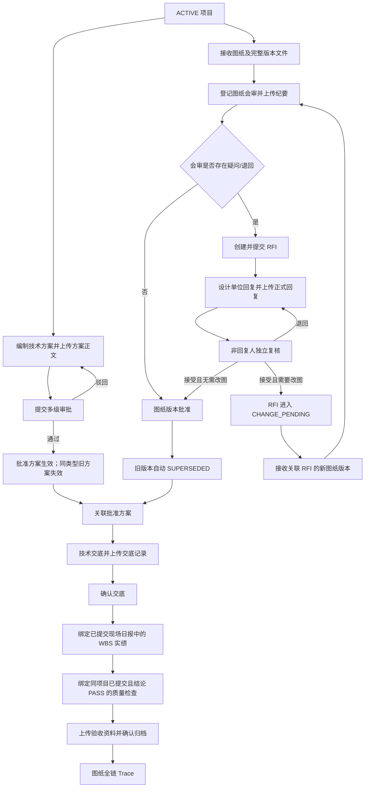
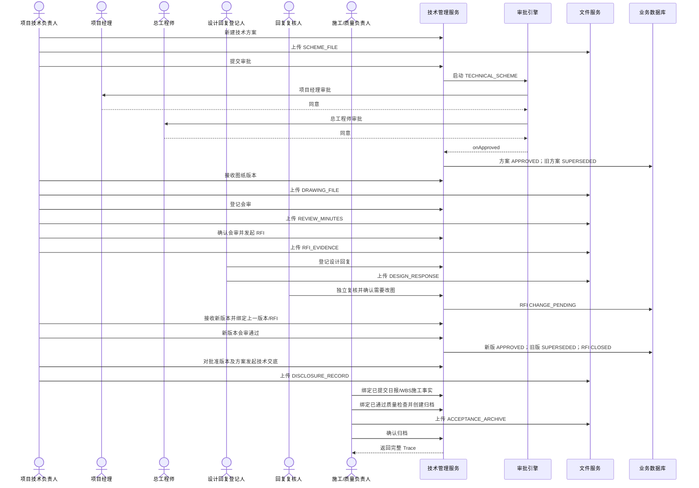
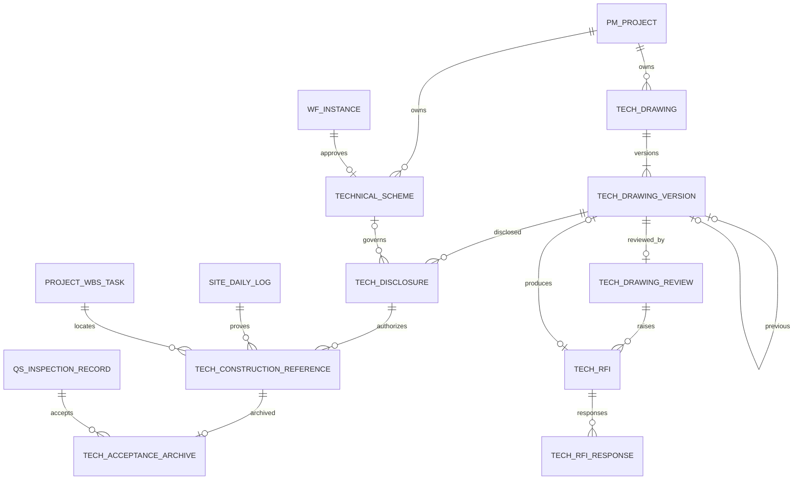

# CGC-PMS 图纸、RFI 与技术方案闭环业务标准

## 1. 目标与适用边界

本标准定义项目技术管理唯一有效的 P0 主线：

> 项目技术方案 → 多级审批 → 图纸接收 → 图纸会审 → RFI 提问 → 设计回复 → 独立复核 → 图纸改版 → 技术交底 → 现场日报/WBS 施工引用 → 质量验收 → 技术归档 → 全链路追溯。

任何用于施工和验收的图纸，都必须能反查其版本、会审结论、未决/已闭合 RFI、设计回复、批准技术方案、技术交底、现场施工事实与验收档案；任何旧版图纸在新版本批准后必须成为 `SUPERSEDED`，不得继续被交底或施工引用。

P0 不建设 BIM/IFC、图纸在线批注、设计单位外部门户、电子签章、材料设备报审（Submittal）、移动离线交底、AI 审图或外部文档管理系统集成。这些能力不得绕过本标准的版本、状态和证据门禁。

## 2. 当前业务完成度分析

### 2.1 实施前源码事实

| 节点 | 实施前状态 | 缺口 |
| --- | --- | --- |
| 技术事项 | 仅有 `tech_item` 驾驶舱摘要表 | 无真实技术业务实体、状态或接口 |
| 技术方案 | 缺失 | 无审批、版本替代和附件门禁 |
| 图纸接收/版本 | 缺失 | 无版本链、当前有效版或旧版失效规则 |
| 图纸会审 | 缺失 | 无参会、结论、纪要与问题来源 |
| RFI/设计回复 | 缺失 | 无提问、期限、回复、职责分离或改版联动 |
| 技术交底 | 缺失 | 无批准图纸/方案前置与交底凭证 |
| 施工引用 | 页面和日报/WBS 已存在 | 无图纸版本、交底与施工事实关系 |
| 质量验收 | 质量安全闭环已存在 | 无技术版本和施工引用关系 |
| 技术归档 | 缺失 | 无不可变归档事实 |
| 全链追溯 | 缺失 | 不能从图纸反查审批、RFI、施工和验收 |

### 2.2 P0 实施结果

| 节点 | 实现载体 | 完成度 |
| --- | --- | --- |
| 技术方案与审批 | `technical_scheme`、`TECHNICAL_SCHEME` 两级工作流 | 已实现 |
| 图纸及版本链 | `tech_drawing`、`tech_drawing_version` | 已实现 |
| 图纸会审 | `tech_drawing_review` | 已实现 |
| RFI 与设计回复 | `tech_rfi`、`tech_rfi_response` | 已实现 |
| 技术交底 | `tech_disclosure` | 已实现 |
| 施工事实引用 | `tech_construction_reference` 关联日报、WBS 和日报进度 | 已实现 |
| 质量验收归档 | `tech_acceptance_archive` 关联已提交且通过的检查记录 | 已实现 |
| 文件/权限/审计 | 七类阶段文件、十组权限、操作审计 | 已实现 |
| 管理工作台 | `/technical-management` | 已实现 |
| 全链追溯 | 图纸 Trace 聚合版本、会审、RFI、回复、方案审批、交底、施工和归档 | 已实现 |

`tech_item` 继续作为驾驶舱摘要，不再承载业务真相；方案/RFI 状态由领域服务自动同步，禁止页面直接维护摘要。

## 3. 项目技术闭环流程

## 4. 数据关系与删除策略

| 实体 | 主键 | 关键外键/唯一约束 | 删除策略 |
| --- | --- | --- | --- |
| `technical_scheme` | `id` | `project_id`、`approval_instance_id`；项目+方案编码唯一 | RESTRICT；无删除接口 |
| `tech_drawing` | `id` | `project_id`、`current_version_id`；项目+图纸编码唯一 | RESTRICT；无删除接口 |
| `tech_drawing_version` | `id` | `drawing_id`、`previous_version_id`、`source_rfi_id`；图纸+版本号唯一 | RESTRICT；历史不可覆盖 |
| `tech_drawing_review` | `id` | `drawing_version_id` 唯一 | RESTRICT；确认后不可改 |
| `tech_rfi` | `id` | `review_id`、`drawing_version_id`；项目+RFI编号唯一 | RESTRICT；关闭后不可重开 |
| `tech_rfi_response` | `id` | `rfi_id`；同一 RFI 仅一个待复核/已接受有效回复 | RESTRICT；保留回复/复核人 |
| `tech_disclosure` | `id` | `drawing_version_id`、可空 `scheme_id`；项目+交底编号唯一 | RESTRICT；确认后不可改 |
| `tech_construction_reference` | `id` | `disclosure_id`、`daily_log_id`、`wbs_task_id` | RESTRICT；施工事实不可删除 |
| `tech_acceptance_archive` | `id` | `construction_reference_id` 唯一、`quality_inspection_id` | RESTRICT；归档后不可改 |

所有表包含 `tenant_id`、`project_id`、创建/更新人、时间、逻辑删除标识；服务端对跨项目、跨租户和来源不一致统一拒绝。

## 5. 生命周期与状态流转

| 对象 | 状态流转 |
| --- | --- |
| 技术方案 | `DRAFT → PENDING → APPROVED`；`PENDING → REJECTED → PENDING`；同类型新版批准后旧版 `SUPERSEDED` |
| 图纸版本 | `RECEIVED → UNDER_REVIEW → APPROVED`；有问题时 `UNDER_REVIEW → RFI_PENDING → APPROVED/SUPERSEDED` |
| 会审记录 | `DRAFT → CONFIRMED` |
| RFI | `DRAFT → SUBMITTED → RESPONDED → CLOSED`；需改图时 `RESPONDED → CHANGE_PENDING → CLOSED` |
| 设计回复 | `PENDING → ACCEPTED/REJECTED`；退回后允许新回复，不改写旧回复 |
| 技术交底 | `DRAFT → CONFIRMED` |
| 施工引用 | 创建即 `RECORDED`，只引用已确认交底及已提交日报事实 |
| 验收档案 | `DRAFT → ARCHIVED` |

所有状态变更使用条件更新（CAS）；重复确认、并发提交或越级操作返回明确业务错误，不静默成功。

## 6. 节点业务定义

| 节点 | 输入 / 输出 | 前置 / 后置 | 规则与校验 | 异常处理 | 权限 / 日志 / 审计 |
| --- | --- | --- | --- | --- | --- |
| 项目 | 项目ID / 可用项目上下文 | ACTIVE且已审批 / 允许技术业务 | 租户、项目数据权限、状态必校验 | 项目暂停/关闭即拒绝新业务 | `technical:query`；查询留应用日志 |
| 技术方案 | 编号、名称、类型、责任人、生效日、正文 / 方案草稿 | 项目有效 / 可提交审批 | 编号唯一、未来生效日、`SCHEME_FILE` CLEAN | 缺附件、重复编号、状态非法均拒绝 | maintain/submit 分离；创建、提交、审批全审计 |
| 方案审批 | 方案ID / 审批实例和记录 | DRAFT/REJECTED / APPROVED或REJECTED | 两级审批、驳回可重提、审批记录不可删 | 无模板、越权、重复审批拒绝 | 工作流权限；实例、任务、记录留痕 |
| 图纸接收 | 图纸编号/名称/专业/来源/版本/文件 / 图纸及版本 | 项目有效 / 版本RECEIVED | 图纸编号、版本唯一；完整图纸附件 | 重复接收、附件阶段错误拒绝 | `technical:drawing:receive`；接收审计 |
| 图纸会审 | 版本、人员、结论、纪要 / 会审记录 | 版本RECEIVED且有图纸文件 / 版本进入审批或RFI等待 | 条件通过/退回必须要求RFI；纪要必传 | 旧版、已会审、附件缺失拒绝 | `technical:drawing:review`；创建/确认审计 |
| RFI | 会审、主题、问题、优先级、期限、依据 / RFI | 已确认且要求RFI的会审 / SUBMITTED | 必须绑定图纸版本/会审；期限不得早于今天 | 无问题依据、来源不一致、重复提交拒绝 | raise 权限；创建/提交审计 |
| 设计回复 | RFI、正式回复、是否改图、回复人、文件 / 回复 | RFI SUBMITTED / RESPONDED | 回复文件 CLEAN；登记人与接受复核人必须不同 | 自审、重复有效回复、关闭后回复拒绝 | respond/accept 分离；回复/复核审计 |
| 图纸改版 | 上一版、接受的改图回复、版本号、图纸 / 新版本 | RFI CHANGE_PENDING / 新版RECEIVED | 三者必须同链；只有已接受且要求改图回复可建版 | 无改图结论、跨图纸或重复版号拒绝 | receive 权限；旧版替代留痕 |
| 技术交底 | 批准版本、可选批准方案、人员/班组、内容、记录 / 交底 | 图纸APPROVED且全RFI关闭 / CONFIRMED | 方案如填写必须同项目且APPROVED；记录必传 | 旧版、未闭RFI、未批准方案拒绝 | disclosure 权限；创建/确认审计 |
| 施工引用 | 已确认交底、日报、WBS、日期、部位 / 引用事实 | 日报SUBMITTED且存在该WBS进度 / RECORDED | 项目、日期、WBS与日报进度必须完全一致 | 草稿日报、无进度、跨项目、日期错配拒绝 | disclosure maintain；创建审计 |
| 验收归档 | 施工引用、质量检查、结论、位置、附件 / 档案 | 检查SUBMITTED且PASS、RFI全关闭 / ARCHIVED | 归档编号/施工引用唯一；附件必传 | 检查不通过、重复归档、缺附件拒绝 | archive confirm；创建/确认审计 |
| 全链追溯 | 图纸ID / 聚合证据 | 有项目查看权 / 无数据变更 | 返回全部历史版本，不仅当前版 | 不存在/跨项目返回业务错误 | `technical:query`；敏感查询可审计扩展 |

## 7. 验收标准

### 7.1 技术方案

- [ ] 必须绑定 ACTIVE 项目、责任人、方案类型和计划生效日。
- [ ] 提交前必须上传病毒扫描为 CLEAN 的 `SCHEME_FILE`。
- [ ] 审批必须经过项目经理、总工程师两级并保留任务/意见/时间。
- [ ] 驳回后可重提；批准后不可修改；同项目同类型新版批准自动替代旧版。

### 7.2 图纸接收与会审

- [ ] 图纸编号在项目内唯一，版本号在图纸内唯一。
- [ ] 会审前必须有本版完整 `DRAWING_FILE`。
- [ ] 一个版本只允许一份有效会审；确认前必须有 `REVIEW_MINUTES`。
- [ ] 条件通过或退回必须进入 RFI，不能直接批准施工版。

### 7.3 RFI、设计回复与改版

- [ ] RFI 必须由已确认会审产生并上传 `RFI_EVIDENCE`。
- [ ] 设计回复必须上传 `DESIGN_RESPONSE`，登记回复人与接受复核人不得相同。
- [ ] 无需改图的已接受回复关闭 RFI 后才能批准原版本。
- [ ] 需要改图的回复必须进入 `CHANGE_PENDING`，新版本必须同时绑定 RFI 和上一版本。
- [ ] 新版批准后上一版本必须为 `SUPERSEDED`，来源 RFI 必须为 `CLOSED`。

### 7.4 技术交底、施工与归档

- [ ] 技术交底只允许引用当前 `APPROVED` 图纸版本且全部 RFI 已闭合。
- [ ] 交底必须上传 `DISCLOSURE_RECORD`；确认后不可改写。
- [ ] 施工引用必须匹配同项目、同日期、已提交日报中的真实 WBS 进度行。
- [ ] 验收归档必须引用已提交且结论 `PASS` 的同项目质量检查。
- [ ] 归档前必须上传 `ACCEPTANCE_ARCHIVE`；`ARCHIVED` 后不可修改或重复归档。

### 7.5 权限、文件与追溯

- [ ] 查询、方案维护/提交、图纸接收/会审、RFI发起/回复/接受、交底和归档权限相互独立。
- [ ] 所有写接口都有服务端鉴权和操作审计，不能依赖前端隐藏按钮。
- [ ] 附件只能在对应对象允许阶段上传，不能用错误文档类型或事后替换历史证据。
- [ ] 从图纸必须反查方案审批、全部版本/会审/RFI/回复、交底、日报/WBS和验收归档。

## 8. 测试方案

| 类别 | 场景 | 预期 |
| --- | --- | --- |
| 正常全链 | 方案审批→A版会审→RFI→设计回复需改图→B版会审通过→交底→施工引用→验收归档 | 全状态正确，A版失效，RFI关闭，Trace完整 |
| 无需改图 | 条件会审→RFI→接受无需改图回复 | 原版本批准、RFI关闭 |
| 审批驳回 | 方案第二级驳回后修改证据并重提 | 保留首轮记录，新审批轮次通过 |
| 附件缺失 | 无图纸文件发起会审；无纪要确认；无RFI依据提交；无归档件确认 | 分别返回阶段附件错误 |
| 附件错配 | 给图纸版本上传 `RFI_EVIDENCE` | 返回 `TECH_DOCUMENT_STAGE_INVALID` |
| 职责分离 | 回复登记人自行接受回复 | 返回 `TECH_RFI_RESPONSE_REVIEWER_CONFLICT` |
| 重复提交 | 重复确认会审/RFI/交底/归档 | 状态门禁拒绝且无重复事实 |
| 跨链/跨项目 | RFI绑定另一图纸上一版；交底/日报/检查跨项目 | 服务端拒绝 |
| 旧版使用 | B版批准后用A版创建交底 | 返回旧版不可用于施工 |
| 未闭RFI | 存在未闭RFI时发起交底或验收归档 | 服务端拒绝 |
| 日报边界 | 草稿日报、错误日期、无该WBS进度 | 不生成施工引用 |
| 验收边界 | 检查未提交、结论ISSUES/PENDING | 不允许创建档案 |
| 项目状态 | 项目暂停/关闭后创建方案、接收图纸 | 拒绝新增 |
| 租户/权限 | 跨租户ID、缺少动作权限 | 数据不可见/接口403 |
| 并发 | 两次同时确认同一对象 | 仅一次成功，另一请求并发冲突 |
| 数据库迁移 | MySQL与H2从现有版本迁移到V190 | 约束、菜单、模板均正确 |
| 前端契约 | API端点、路由权限、页面业务链和阶段附件 | Vitest、type-check、lint、build通过 |

自动化基线：`TechnicalManagementClosedLoopIntegrationTest` 覆盖真实两级审批和核心正常/异常链；前端 API、页面源码契约、路由测试覆盖工作台入口和端点连接。

## 9. 开发路线图

### P0（本次必须完成）

- 技术方案审批、图纸版本、会审、RFI回复复核、改版替代、技术交底、施工事实、质量验收归档、阶段附件、权限审计和 Trace。
- MySQL/H2 同步迁移、后端集成测试、前端门禁和浏览器冒烟。

### P1（业务增强）

- 多专业联合会审议题清单、RFI逾期预警和升级处置。
- 方案/图纸分发签收、班组交底签到和抽查。
- 图纸作废/撤回的独立审批，不改写已施工历史。

### P2（效率优化）

- 图纸在线批注与差异对比、批量分发、二维码现场查版。
- 设计单位外部协同入口及回复SLA统计。
- 与材料/设备报审、样板验收联动。

### P3（未来版本）

- BIM/IFC模型构件关联、移动离线交底、AI审图辅助、企业级DMS/电子签章集成。

## 10. 风险点与控制

| 风险 | 控制 |
| --- | --- |
| 旧版误用于施工 | 仅 `APPROVED` 当前版可交底；新版批准事务内将上一版置 `SUPERSEDED` |
| 设计回复自审 | 回复人与接受复核人强制不同；权限分离 |
| 附件后补或替换 | 文件授权器按状态和文档类型锁定 |
| 页面拼接虚假施工事实 | 服务端核验日报状态、日期、WBS和 `site_daily_progress` 精确存在 |
| 验收与施工脱节 | 档案必须绑定施工引用和同项目 PASS 检查 |
| 摘要表成为第二真相 | `tech_item` 仅由领域服务自动生成，不提供人工维护接口 |
| 历史被删除 | 外键 RESTRICT、无删除端点、确认后不可变 |
| 外部设计回复代录责任不清 | 记录系统登记人、回复人名称、原始回复附件和独立复核人 |

## 11. 后续优化原则

后续能力必须继续复用本标准的 `project_id + drawing_id + drawing_version_id + source_rfi_id` 主链，不得另建无来源的“图纸事项”或通过附件文件名推断版本。新增外部协同、BIM 或移动能力时，外部系统只可作为交互入口，最终状态、权限、审批、审计与追溯仍以 CGC-PMS 领域事实为准。
