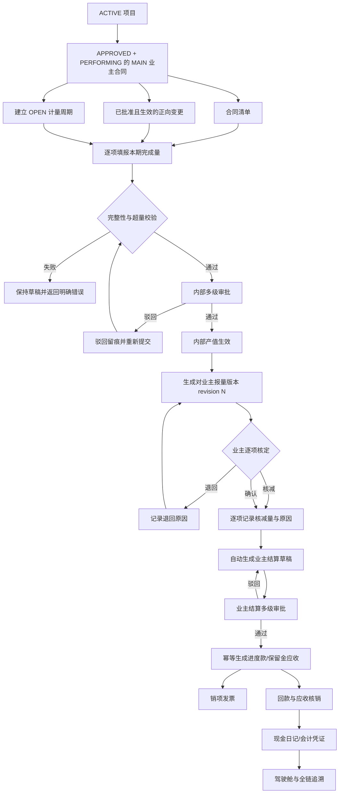
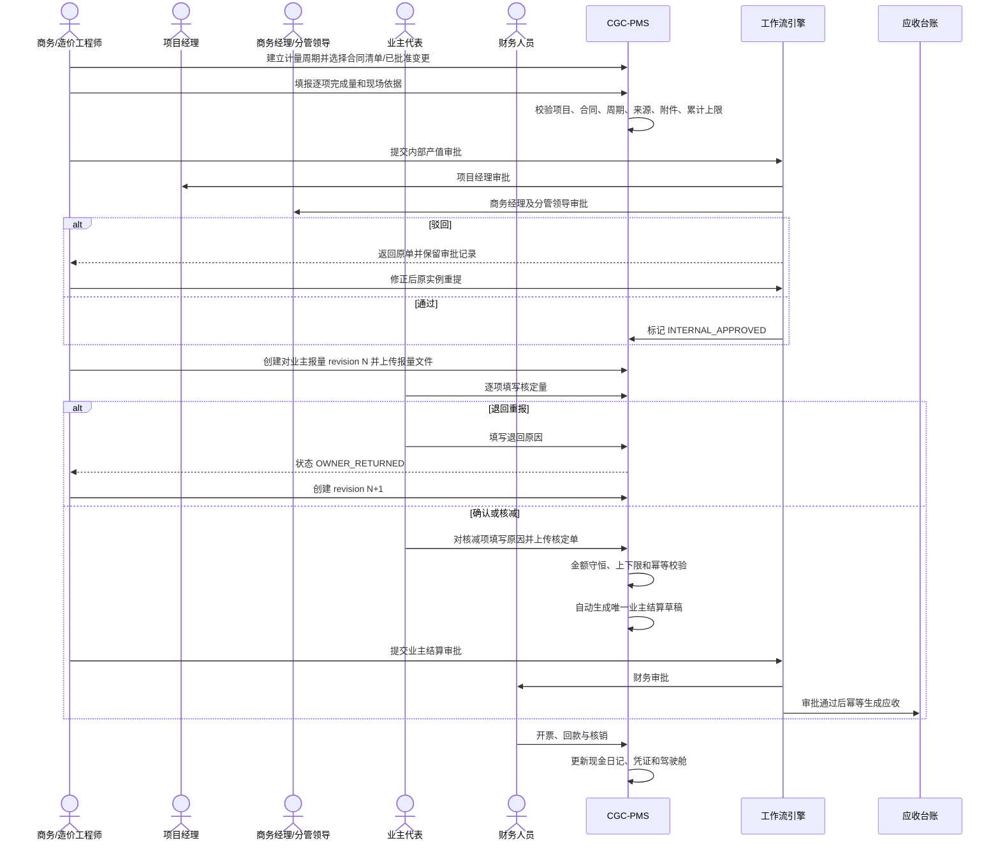
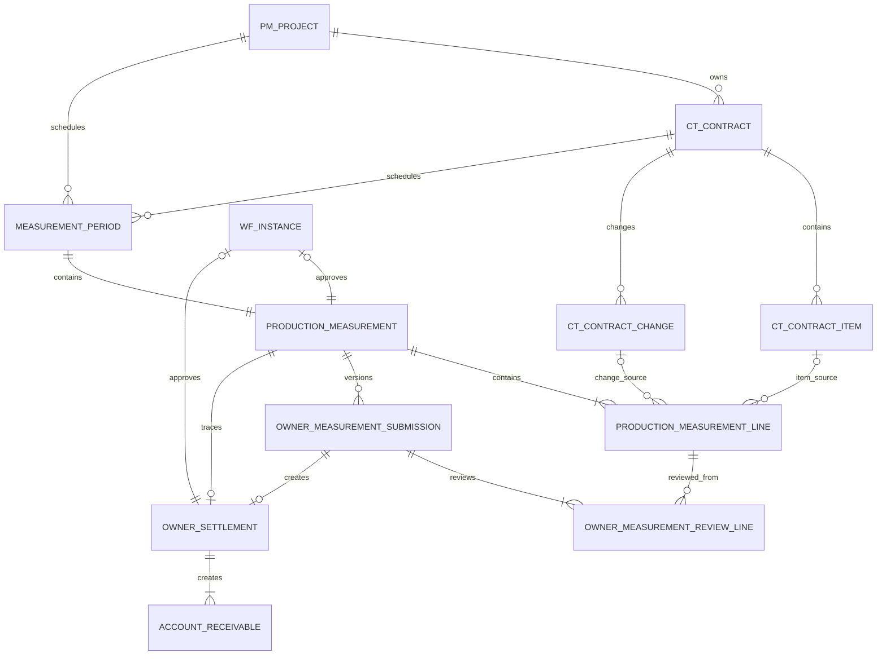

# CGC-PMS 产值计量与业主结算闭环业务标准

状态：Development Verified Baseline
基线日期：2026-07-16
适用范围：施工总承包项目产值计量、对业主报量、业主核定、业主结算及应收衔接
事实基线：master 当前源码、V175、后端闭环集成测试及前端生产构建

> 本文是 CGC-PMS“产值计量与业主结算”主线的唯一业务标准。合同清单、内部完成量、对业主报量、业主核定、业主结算和应收是六类独立事实，禁止以一个“本月产值”金额字段互相替代。

## 1. 目标、边界与业务口径

### 1.1 唯一业务主线

项目 → 履约中业主合同 → 合同清单/已批准正向变更 → 计量周期 → 逐项现场完成量 → 内部产值审批 → 对业主报量版本 → 业主逐项核定/核减 → 自动生成业主结算草稿 → 结算审批 → 应收 → 发票/回款/现金日记 → 驾驶舱与全链追溯。

### 1.2 六类权威事实

| 事实 | 权威含义 | 明确不等于 |
|---|---|---|
| 合同清单/变更 | 合同约定或已批准可计量上限、单位和单价 | 本期完成量 |
| 内部产值计量 | 企业内部确认已完成且具备依据的工程量 | 业主认可金额 |
| 业主报量 | 某次正式提交业主的版本事实 | 业主核定结果 |
| 业主核定 | 业主逐项确认量及核减原因 | 已形成应收 |
| 业主结算 | 内部审批生效的结算单 | 开票或回款 |
| 应收 | 结算审批通过后形成的债权 | 收入、发票或现金到账 |

### 1.3 核心公式

- 清单项可计量余额 = 合同清单数量 - 累计内部审批通过数量。
- 正向变更可计量余额 = 1 - 累计内部审批通过比例；变更金额作为单价快照。
- 本期内部产值 = Σ（本期计量量 × 合同单价快照）。
- 累计内部产值 = 历史内部审批通过产值 + 本期产值。
- 业主核定金额 = Σ（业主核定量 × 本次计量单价快照）。
- 业主核减金额 = 本次报量金额 - 业主核定金额。
- 业主结算含税金额 = 业主核定金额。
- 结算净应收 = 业主结算含税金额 - 保留金；保留金按独立应收类型生成。

金额统一 `DECIMAL(18,2)`、数量统一 `DECIMAL(18,4)`、单价统一 `DECIMAL(18,4)`。所有计算使用 `HALF_UP`，不得由前端浮点数作为最终结果。

### 1.4 非目标

- P0 不做 AI 图纸算量、BIM 自动提量、无人机识别或业主门户直连。
- 不改造合同清单主数据为另一套重复 BOQ。
- 负变更不作为“负产值计量项”；其合同金额约束继续由合同现额及变更事实控制。
- 不允许从计量直接生成回款、现金日记或收入确认。

## 2. 当前业务完成度分析

### 2.1 实施前源码事实

| 节点 | 实施前状态 | 主要证据与缺口 | 完成度 |
|---|---|---|---|
| 项目/业主合同 | 已实现实体、页面、状态和数据范围 | 可作为闭环前置 | C4 |
| 合同清单 | 有 `ct_contract_item` 实体、接口和合同页面 | 无累计计量关系 | C2 |
| 合同变更 | 有多级审批及生效标识 | 无产值计量引用 | C3 |
| 计量周期 | 无实体、关系、接口、页面和测试 | 完全缺失 | C0 |
| 内部产值计量 | 仅有分包计量；业主侧无实体 | 与分包成本计量不可混用 | C0 |
| 对业主报量版本 | 无版本、附件和生命周期 | 完全缺失 | C0 |
| 业主逐项核定/核减 | 只有手工业主结算总额 | 无核定量、核减原因和明细 | C0 |
| 业主结算 | 有独立单据、审批及应收生成 | 可手工录金额，来源无法证明 | C2 |
| 反向追溯 | 回款可追到应收和结算 | 无法继续追到计量清单和业主核定 | C2 |
| 驾驶舱 | 有收入、结算、应收、回款 | 无报量差异及核减指标 | C2 |

### 2.2 实施后基线

| 节点 | 当前实现 | 数据关系 | 接口/页面 | 测试 | 完成度 |
|---|---|---|---|---|---|
| 合同计量来源 | 复用合同清单及已批准正向变更 | 明细双 FK、互斥校验 | 来源查询、工作台 | 超量/失效校验 | C4 |
| 计量周期 | OPEN/CLOSED 周期 | 项目、合同 FK | 建立、查询、关闭 | 日期、重复、活动单据 | C4 |
| 内部产值计量 | 逐项数量、单价快照、附件、多级审批 | 周期/清单/变更/审批 FK | 创建、列表、详情、提交 | 完整审批链、缺依据、超量 | C4 |
| 对业主报量 | 不可覆盖的 revision 版本 | 计量单 FK | 新版本、列表、详情 | 退回后 revision+1 | C4 |
| 业主核定 | 逐项核定量、金额和核减原因 | 报量/计量明细 FK | 确认或退回 | 超报、缺原因、重复确认 | C4 |
| 业主结算 | 核定后自动生成草稿 | 计量单、报量版本唯一 FK | 复用收入回款页面和审批 | 金额守恒、唯一生成 | C4 |
| 应收/回款 | 复用收入回款闭环 | 结算→应收→回款 | 既有接口/页面 | 既有全链回归 | C4 |
| Trace | 结算可反查全部计量证据；现金日记 Trace 扩展计量链 | 全部租户/项目校验 | Trace API | 完整链断言 | C4 |
| 驾驶舱 | 既有结算/应收/回款指标可消费新事实 | 聚合生效结算 | 既有驾驶舱 | 既有回归 | C3；报量差异专题为 P1 |

完成度定义：C0 无事实；C1 仅页面或字段；C2 有局部实体/接口；C3 基本可运行但缺完整约束或验收；C4 数据、状态、接口、权限、审计和自动化闭环完成。

## 3. 产值计量与业主结算闭环流程图

### 3.1 Mermaid Flowchart



### 3.2 Mermaid Sequence Diagram



## 4. ER 关系、主外键与删除策略



| 实体 | 主键 | 关键外键/唯一约束 | 生命周期 | 删除策略 |
|---|---|---|---|---|
| Project | `id` | tenant | ACTIVE/SUSPENDED/ARCHIVED | 被业务引用后 RESTRICT；仅状态迁移 |
| Contract | `id` | `project_id` | APPROVED+PERFORMING 为可计量 | 被计量引用后 RESTRICT |
| ContractItem | `id` | `contract_id` | 合同审批后冻结 | 被计量明细引用后 RESTRICT |
| ContractChange | `id` | project/contract | APPROVED+effective=1 才可引用 | 被引用后 RESTRICT，冲减走新事实 |
| MeasurementPeriod | `id` | project/contract；合同+编码唯一 | OPEN→CLOSED | 不物理删除；活动单据存在时禁止关闭 |
| ProductionMeasurement | `id` | period/project/contract/approval；合同+周期唯一 | 见第 5 章 | 只有草稿理论可作废；P0 不提供删除 API |
| ProductionMeasurementLine | `id` | measurement；item/change 二选一 FK | 随头单冻结 | RESTRICT；审批后不可改 |
| OwnerMeasurementSubmission | `id` | measurement；measurement+revision 唯一 | SUBMITTED→RETURNED/SETTLEMENT_CREATED | 版本事实永不覆盖、永不删除 |
| OwnerMeasurementReviewLine | `id` | submission/measurement_line 唯一 | 未核定→已核定 | 永不删除；纠错新增报量版本或冲减事实 |
| OwnerSettlement | `id` | measurement/submission；submission 唯一 | DRAFT→PENDING→RECEIVABLE_CREATED | 生效后禁止修改删除 |
| AccountReceivable | `id` | settlement+type 唯一 | OPEN→PARTIAL→COLLECTED/CREDITED | 禁止删除；冲减/冲销反向处理 |

所有业务表必须带 `tenant_id`；应用查询同时校验租户和项目数据范围。多态来源没有使用无约束 `source_id`：清单项与合同变更使用两个真实外键，并通过数据库 CHECK 保证二选一。

## 5. 状态流转

### 5.1 计量周期

`OPEN → CLOSED`

- 存在 DRAFT、REJECTED、PENDING 或 OWNER_SUBMITTED 单据时禁止关闭。
- CLOSED 不允许创建或提交计量；不允许重新打开，确需纠错应建立新周期并审计说明。

### 5.2 内部产值计量

```text
DRAFT → PENDING → INTERNAL_APPROVED → OWNER_SUBMITTED → SETTLEMENT_CREATED
           │                              │
           └→ REJECTED → PENDING          └→ OWNER_RETURNED → OWNER_SUBMITTED
```

- 驳回后原审批实例重提，审批轮次与记录保留。
- INTERNAL_APPROVED 后计量数量、来源、单价快照不可修改。
- OWNER_RETURNED 只允许补正报量版本和附件，不回写内部批准完成量。

### 5.3 业主报量版本

`SUBMITTED → RETURNED` 或 `SUBMITTED → CONFIRMED → SETTLEMENT_CREATED`

- RETURNED 后新建 revision N+1；旧版本保持只读。
- CONFIRMED 必须逐项核定；有核减必须逐项填写原因。
- 重复 CONFIRMED 回调返回同一结算，不得重复生成。

### 5.4 业主结算及应收

`DRAFT → PENDING → RECEIVABLE_CREATED`；`PENDING → REJECTED → PENDING`。

结算审批通过后自动生成进度款和保留金应收；同一结算同一应收类型唯一。

## 6. 各节点业务定义（十项标准）

### 6.1 项目与业主合同

| 项目 | 标准 |
|---|---|
| ① 输入数据 | 项目、MAIN 业主合同、甲方客户、合同现额、状态 |
| ② 输出数据 | 可计量业务上下文 |
| ③ 前置条件 | 项目 ACTIVE；合同 APPROVED 且 PERFORMING |
| ④ 后置条件 | 可建立计量周期并读取清单/变更 |
| ⑤ 业务规则 | 合同必须属于项目，甲方作为后续结算客户 |
| ⑥ 异常处理 | 项目暂停、合同关闭、跨项目/跨租户立即拒绝 |
| ⑦ 数据校验 | 租户、项目、合同类型、审批状态、履约状态 |
| ⑧ 权限要求 | 项目数据范围 + `measurement:query/maintain` |
| ⑨ 日志要求 | 项目/合同状态变化、查询失败和拒绝原因 |
| ⑩ 审计要求 | 保留合同版本、现额、甲方和状态生效时间 |

### 6.2 合同清单与已批准变更

| 项目 | 标准 |
|---|---|
| ① 输入数据 | 清单编号、名称、单位、数量、单价；变更编号、金额和生效状态 |
| ② 输出数据 | 可计量来源及剩余量 |
| ③ 前置条件 | 清单属于合同；变更 APPROVED、effective=1 且金额>0 |
| ④ 后置条件 | 计量明细保存来源 FK 和名称/单位/单价快照 |
| ⑤ 业务规则 | 每明细只能选清单或变更之一；负变更不作为产值来源 |
| ⑥ 异常处理 | 来源失效、跨合同、数量为零或重复选择时拒绝 |
| ⑦ 数据校验 | 来源双 FK 二选一、累计量≤合同量/变更比例 |
| ⑧ 权限要求 | 合同查询权限和项目数据范围 |
| ⑨ 日志要求 | 来源解析、单价快照、剩余量重算结果 |
| ⑩ 审计要求 | 审批时再次读取并锁定来源，防止提交竞态 |

### 6.3 计量周期

| 项目 | 标准 |
|---|---|
| ① 输入数据 | 周期编码/名称、开始日、结束日、截止日、项目、合同 |
| ② 输出数据 | OPEN 计量周期 |
| ③ 前置条件 | 项目合同可计量 |
| ④ 后置条件 | 同合同周期编码唯一；可创建一张内部计量单 |
| ⑤ 业务规则 | 开始日≤结束日；截止日≥开始日；每合同每周期一张计量单 |
| ⑥ 异常处理 | 日期非法、重复编码或活动单据存在时关闭失败 |
| ⑦ 数据校验 | 日期、唯一键、项目合同一致性 |
| ⑧ 权限要求 | `measurement:maintain` |
| ⑨ 日志要求 | 建立、关闭及失败原因 |
| ⑩ 审计要求 | 关闭不可静默恢复，操作者和版本号留痕 |

### 6.4 内部产值计量与审批

| 项目 | 标准 |
|---|---|
| ① 输入数据 | 周期、计量日期、逐项本期量、总体附件、逐项依据数量 |
| ② 输出数据 | 本期/累计产值、逐项数量与单价快照、审批实例 |
| ③ 前置条件 | 周期 OPEN；来源有效；计量日期在周期窗口内 |
| ④ 后置条件 | 审批通过形成不可变内部产值事实 |
| ⑤ 业务规则 | 每项本期量>0；累计量不得超来源；总体和逐项依据必填 |
| ⑥ 异常处理 | 超量、缺附件、来源失效、重复提交全部事务回滚 |
| ⑦ 数据校验 | 创建和提交两次校验；提交时来源行锁并排除本单重算累计量 |
| ⑧ 权限要求 | 维护、提交、审批角色分离；管理员仅按现有规则旁路 |
| ⑨ 日志要求 | 创建、提交、驳回、重提、通过和计算口径 |
| ⑩ 审计要求 | 审批轮次、任务、意见、公式版本、附件和快照可追溯 |

### 6.5 对业主报量版本

| 项目 | 标准 |
|---|---|
| ① 输入数据 | 内部批准计量、外部单号、报量附件、备注 |
| ② 输出数据 | revision N 报量头和逐项报量快照 |
| ③ 前置条件 | 计量 INTERNAL_APPROVED 或 OWNER_RETURNED |
| ④ 后置条件 | 状态 OWNER_SUBMITTED，等待业主核定 |
| ⑤ 业务规则 | 报量金额来自内部计量，不允许手工覆盖；版本只增不改 |
| ⑥ 异常处理 | 缺附件、状态不符、并发重复版本时拒绝 |
| ⑦ 数据校验 | revision 唯一；逐项数量和金额完整复制 |
| ⑧ 权限要求 | `measurement:owner:submit` |
| ⑨ 日志要求 | 报送时间、版本、外部单号、操作者 |
| ⑩ 审计要求 | 每个历史版本及附件永久可读 |

### 6.6 业主逐项核定/核减

| 项目 | 标准 |
|---|---|
| ① 输入数据 | 结论、核定人、逐项核定量、核减原因、核定附件 |
| ② 输出数据 | 核定金额、核减金额或退回事实 |
| ③ 前置条件 | 报量版本 SUBMITTED |
| ④ 后置条件 | RETURNED 或自动生成唯一结算草稿 |
| ⑤ 业务规则 | 核定量0≤x≤报量；有差额必须写原因；必须覆盖全部明细 |
| ⑥ 异常处理 | 缺行、重复行、越量、缺原因、总额为零时拒绝且不生成结算 |
| ⑦ 数据校验 | 后端按单价快照计算金额；税额/保留金≤核定额；到期日≥结算日 |
| ⑧ 权限要求 | `measurement:owner:review`；与内部填报人职责分离 |
| ⑨ 日志要求 | 核定人、时间、结论、逐项前后差额 |
| ⑩ 审计要求 | 重复确认幂等；退回原因和旧版本不得覆盖 |

### 6.7 业主结算、应收及下游

| 项目 | 标准 |
|---|---|
| ① 输入数据 | 核定事实、结算日、到期日、税额、保留金、附件 |
| ② 输出数据 | 结算草稿、审批、进度款/保留金应收 |
| ③ 前置条件 | 业主核定总额>0，合同仍履约 |
| ④ 后置条件 | 审批通过形成唯一应收；可开票和回款 |
| ⑤ 业务规则 | 报量来源结算禁止手工改金额；累计结算不超合同现额 |
| ⑥ 异常处理 | 重复回调返回原事实；审批失败不得生成应收 |
| ⑦ 数据校验 | submission 唯一；结算金额=核定额；应收类型唯一 |
| ⑧ 权限要求 | `revenue:settlement:submit`、审批和财务权限 |
| ⑨ 日志要求 | 自动生成来源、提交、驳回、审批、应收创建 |
| ⑩ 审计要求 | 计量/报量 FK、审批记录、附件、公式版本永久保留 |

### 6.8 驾驶舱与全链追溯

| 项目 | 标准 |
|---|---|
| ① 输入数据 | 项目或结算/现金日记 ID |
| ② 输出数据 | 计量、报量、核定、结算、应收、发票、回款、凭证证据包 |
| ③ 前置条件 | 用户具备项目查询权限 |
| ④ 后置条件 | 指标可下钻，任一现金事实可反查工程量来源 |
| ⑤ 业务规则 | 只聚合已生效事实；草稿/驳回不得进入财务指标 |
| ⑥ 异常处理 | 链路缺失形成对账问题，不允许静默补数 |
| ⑦ 数据校验 | 每级租户一致；金额和数量守恒 |
| ⑧ 权限要求 | `measurement:query`、`revenue:operations:query` 和项目数据范围 |
| ⑨ 日志要求 | Trace 请求、耗时、结果摘要和拒绝原因 |
| ⑩ 审计要求 | 查询人、业务 ID、返回链路版本和公式版本 |

## 7. 验收标准

### 7.1 项目、合同和计量来源

- ✓ 只有 ACTIVE 项目及 APPROVED、PERFORMING 的 MAIN 业主合同可办理。
- ✓ 合同清单必须保存数量、单位、单价；来源必须属于当前合同。
- ✓ 只有已批准、生效、正向合同变更可作为产值来源。
- ✓ 暂停项目、关闭合同、跨租户或跨项目操作必须拒绝。

### 7.2 计量周期

- ✓ 同一合同周期编码唯一。
- ✓ 计量日期必须处于开始日至截止日。
- ✓ 同一合同同一周期只能存在一张内部产值计量单。
- ✓ 有未完成计量或业主报量时不得关闭周期。

### 7.3 内部产值计量

- ✓ 必须至少包含一条清单或变更明细，且二者只能选一类来源。
- ✓ 每条本期计量量必须大于零，累计审批量不得超过合同量。
- ✓ 必须上传总体附件，每条明细必须存在现场完成依据。
- ✓ 提交时必须再次锁定来源并重算累计量，防止并发超量。
- ✓ 未审批不得对业主报量；审批通过后数量和单价快照不可修改。
- ✓ 支持驳回、原实例重提、多级审批和完整记录留痕。

### 7.4 对业主报量与核定

- ✓ 每次报送生成不可覆盖的 revision，退回后 revision 自动加一。
- ✓ 报量金额必须自动复制内部批准产值，禁止手工改总额。
- ✓ 业主确认必须逐项覆盖全部报量明细。
- ✓ 核定量不得大于报量；存在核减必须逐项填写原因。
- ✓ 退回必须填写原因，退回不改变内部批准产值。
- ✓ 重复确认同一版本只能返回同一结算，不允许重复生成。

### 7.5 业主结算与应收

- ✓ 业主核定后自动生成结算草稿并关联计量单、报量版本。
- ✓ 结算金额等于业主核定额，reported/deducted 金额守恒。
- ✓ 未经业主结算审批不得生成应收。
- ✓ 审批回调幂等；进度款和保留金应收分别唯一。
- ✓ 结算及应收形成后不得删除或直接改历史金额。

### 7.6 Trace

- ✓ 从业主结算必须反查项目、合同、周期、计量头/明细、内部审批、报量版本、业主核定明细和应收。
- ✓ 从回款现金日记必须继续反查上述计量证据以及发票、回款和凭证。
- ✓ 任一层跨租户、缺项目关系或数据无权访问时必须拒绝。

## 8. 测试方案

### 8.1 正常主线

1. 创建 ACTIVE 项目、履约 MAIN 合同、两条合同清单和一条已批准正向变更。
2. 建立 OPEN 月度计量周期。
3. 对清单项和变更逐项填报完成量并上传依据。
4. 三级审批全部通过，验证内部产值和累计量。
5. 创建业主报量 revision 1 并上传报量文件。
6. 业主对一项全额确认、另一项部分核减并填写原因。
7. 验证自动生成唯一业主结算草稿，金额等于核定总额。
8. 完成结算审批，验证进度款/保留金应收。
9. 开票、部分回款、尾款核销，验证现金日记、凭证和驾驶舱。
10. 从结算及现金日记反向查询完整链路。

### 8.2 异常、边界与幂等矩阵

| 场景 | 预期 |
|---|---|
| 项目暂停/归档 | 禁止新建周期和计量 |
| 合同 DRAFT/CLOSED/SETTLED/TERMINATED | 禁止计量 |
| 分包合同误选 | 拒绝，只有 MAIN 业主合同可用 |
| 清单跨合同 | 拒绝且不写入明细 |
| 变更未批准、未生效、负金额 | 不出现在来源列表并拒绝直接引用 |
| 周期编码重复 | 唯一键和业务错误双重拦截 |
| 计量日期早于开始日或晚于截止日 | 拒绝 |
| 本期量为 0/负数 | 参数校验拒绝 |
| 累计量超过合同量 | 创建或提交拒绝，事务无副作用 |
| 两个请求并发占用同一剩余量 | 来源行锁后二次校验，至多一个成功 |
| 缺总体附件 | 禁止提交审批 |
| 任一明细缺现场依据 | 禁止提交审批 |
| 重复提交审批 | 只保留一个活动审批实例 |
| 审批驳回 | 原单 REJECTED、记录保留、允许原实例重提 |
| 未审批直接报业主 | 拒绝 |
| 同一报量版本重复创建 | revision 唯一，业务状态拒绝 |
| 业主核定漏行/重复行 | 拒绝 |
| 业主核定量超过报量 | 拒绝 |
| 有核减无原因 | 拒绝且不生成结算 |
| 业主退回无原因 | 拒绝 |
| 退回后重报 | 新 revision=N+1，旧版本只读 |
| 同一核定重复回调 | 返回同一结算，结算数量为 1 |
| 税额或保留金超过核定额 | 拒绝 |
| 到期日早于结算日 | 拒绝 |
| 结算审批重复回调 | 每种应收类型至多一笔 |
| Trace 查询非计量来源结算 | 明确返回“非计量生成”错误 |
| 跨租户 Trace | 拒绝且不泄露存在性 |

自动化至少包含：服务集成测试、工作流通过/驳回测试、Controller 权限测试、MySQL/H2 双迁移、前端 API 测试、路由/菜单测试、页面构建和浏览器主线验收。

## 9. 接口与权限基线

| 接口 | 权限 | 作用 |
|---|---|---|
| `POST /production-measurements/periods` | `measurement:maintain` | 建立计量周期 |
| `GET /production-measurements/periods` | `measurement:query` | 查询周期 |
| `POST /production-measurements/periods/{id}/close` | `measurement:maintain` | 关闭周期 |
| `GET /production-measurements/sources` | `measurement:query` | 查询清单/变更及剩余量 |
| `POST /production-measurements` | `measurement:maintain` | 建立逐项计量草稿 |
| `GET /production-measurements[/{id}]` | `measurement:query` | 列表/详情 |
| `POST /production-measurements/{id}/submit` | `measurement:submit` | 提交内部审批 |
| `POST /production-measurements/{id}/owner-submissions` | `measurement:owner:submit` | 创建业主报量版本 |
| `GET /production-measurements/owner-submissions/*` | `measurement:query` | 查询报量及核定明细 |
| `POST /production-measurements/owner-submissions/{id}/review` | `measurement:owner:review` | 业主确认/核减/退回 |
| `GET /production-measurements/trace/settlements/{id}` | `measurement:query` | 结算反向追溯 |

文件业务类型：`PRODUCTION_MEASUREMENT`、`OWNER_MEASUREMENT_SUBMISSION`、`OWNER_SETTLEMENT`。进入审批、核定或生效状态后附件不可删除或替换；纠错上传新版本并保留旧文件。

## 10. 开发路线图

### P0（本基线已完成）

1. 复用合同清单和已批准正向变更作为唯一计量来源。
2. 建立计量周期、内部计量头/明细、业主报量版本/核定明细及 DB FK。
3. 实现数量上限、附件、逐项依据、周期和项目合同状态校验。
4. 接入三级内部审批、驳回重提和审批审计。
5. 实现报量退回重报、逐项核定/核减及原因必填。
6. 核定后自动生成唯一业主结算草稿；结算审批生成应收。
7. 建立菜单、工作台、独立权限、文件授权和 Trace。
8. 覆盖正常、异常、边界和幂等自动化测试。

### P1（建议完成）

- 报量差异驾驶舱：内部产值、业主报量、核定、核减、待确认余额。
- 核减争议台账、责任人、预计解决日、转下期及追回事实。
- 计量周期锁账日、补录审批和月结对账问题单。
- 多份现场证据与每条明细的真实文件分配关系，而非仅依据数量。
- 业主结算扣款明细：预付款回扣、甲供材、水电费、罚款、其他扣款独立事实。

### P2（优化）

- 清单 Excel 导入预览、差异校验、错误行回执和幂等批次。
- 多级 WBS、楼栋/区段/专业维度计量与汇总。
- 计量快照、日终对账、历史事实重算和审计导出。
- 移动端现场证据采集、经纬度和拍摄时间防篡改。

### P3（未来版本）

- 业主门户/监理平台在线签认与电子签章。
- BIM/算量软件对接，但外部数据必须先进入预览和人工确认。
- 基于历史核减率预测现金流，仅作辅助，不自动改变正式计量或结算。

禁止以 P1–P3 为由延迟或绕过 P0 数据关系、审批、幂等和审计门禁。

## 11. 风险与控制

| 风险 | 控制措施 |
|---|---|
| 历史“本月产值”只有总额无明细 | 作为历史只读差异，不自动猜测清单分配或生成正式结算 |
| 合同清单数量/单价质量差 | 首次计量前执行清单完整性检查；缺单位、数量、单价必须业务确认 |
| 计量与变更并发 | 提交时锁定来源、再次读取变更状态并重算累计量 |
| 业主核减与内部产值混账 | 两套数量事实独立；退回/核减不回写内部已批准完成量 |
| 附件数量与真实文件不一致 | P0 由业务校验和文件授权控制；P1 建立明细级文件分配及日终对账 |
| 自动结算后文件上传失败 | 形成完整性问题并禁止提交结算；不得删除已生成来源事实 |
| 手工业主结算绕过计量 | P0 保留历史兼容；新项目制度要求报量来源，后续可按项目启用强制门禁 |
| 报量累计超过合同现额 | 数量上限与结算累计金额双重校验；并发使用行锁和唯一键 |
| 负变更处理不当 | 不进入正向产值来源；合同现额与正式冲减流程控制 |
| Trace 数据泄露 | 每级 tenant 条件 + 项目数据范围，未知或越权统一拒绝 |
| 权限增长导致 JWT Cookie 超限 | 权限 claim 使用紧凑字符串并兼容历史数组令牌；运行门禁监测超级管理员 `Set-Cookie` 小于 4096 字节及 `userinfo`/业务接口可达性 |

## 12. 上线与数据迁移门禁

1. 先对 MAIN 履约合同执行清单完整性扫描：缺清单、数量为零、单价异常、清单合计与合同现额差异。
2. 业务确认历史产值与手工业主结算的处置：只读保留、人工补录经审批的期初累计，或明确不纳入新链路。
3. V175 在测试库同时验证 MySQL/H2，检查孤儿合同、项目、清单、变更和重复周期。
4. 首批项目采用单项目金丝雀；核对一个完整周期的内部产值、业主核定、结算和应收。
5. 未完成历史数据签字、权限矩阵和回滚演练，不得把“手工结算来源必填”升级为全局硬门禁。

## 13. 未来开发约束

- 新增任何产值或结算功能前，必须回答其权威事实、主外键、状态机、幂等键、审计记录和 Trace 位置。
- 禁止把业主核定额回写覆盖内部产值，禁止把开票或回款当作结算完成。
- 禁止删除审批通过后的计量、报量、核定、结算或应收；纠错必须产生新版本、冲减或冲销事实。
- 驾驶舱指标必须可下钻到本标准定义的权威表，不得从页面缓存或手工汇总字段取数。
- 对外集成、AI 识别和预测功能只能生成候选或预览，正式事实仍必须经过本标准的校验和审批。
