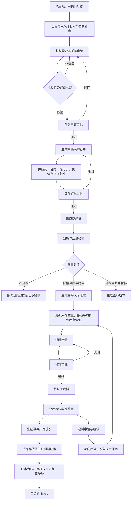
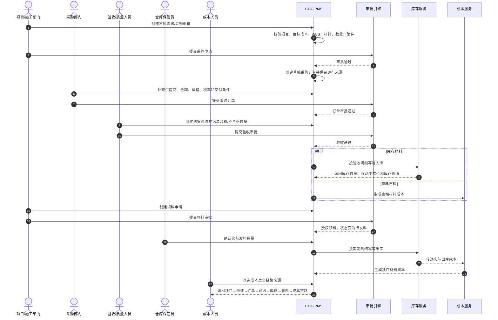
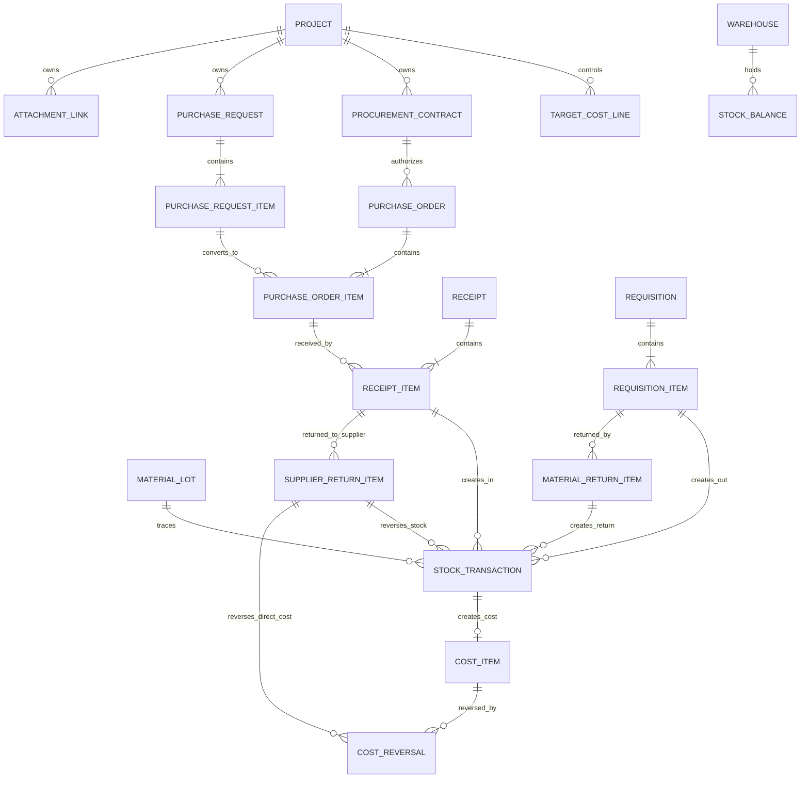

# CGC-PMS 采购—验收—库存—领料—成本闭环业务标准

状态：P0 核心代码闭环已完成 / 上线数据与 E2E 门禁待验
版本：v1.2
基线日期：2026-07-16
适用范围：建筑工程总承包项目的材料需求、采购、到货验收、库存、领退料与材料成本管理
事实基线：`codex/procurement-closed-loop-p0` 分支源码、数据库迁移与自动化测试

> 本文是本闭环后续产品设计、数据库设计、接口开发、审批配置、测试和验收的唯一业务标准。本文中的“目标要求”不代表当前源码已经实现；第 2 章和第 12 章记录当前事实。

## 1. 目标、边界与强制原则

### 1.1 业务目标

建立一条完整、可追溯、可验收、可自动测试的材料业务主线：

```text
项目/目标成本
→ 材料需求与采购申请
→ 采购寻源及采购订单
→ 到货与质量验收
→ 合格材料入库
→ 库存数量及库存价值
→ 领料审批
→ 仓库实际发料
→ 项目材料成本
→ 退货/退料/冲销
→ 成本分析与全链路追溯
```

任何一笔材料成本必须能够反向追溯到：

```text
成本记录
→ 出库流水或直耗验收流水
→ 领料实发记录或直耗验收明细
→ 验收明细
→ 采购订单明细
→ 采购申请明细
→ 采购合同/例外采购审批
→ 目标成本/WBS/成本科目
→ 项目
```

### 1.2 三类权威事实

| 事实类型     | 权威来源                               | 禁止替代                             |
| ------------ | -------------------------------------- | ------------------------------------ |
| 商业承诺事实 | 已审批采购合同、采购订单及订单明细     | 采购申请审批不得替代订单审批         |
| 实物库存事实 | 已确认入库、出库、退货、退料、调整流水 | 单据审批状态不得直接视为实物已经移动 |
| 项目成本事实 | 已确认出库成本、直耗材料成本及其冲销   | 验收金额和领料金额不得重复确认成本   |

### 1.3 成本确认原则

1. **库存材料**：验收合格后形成库存数量和库存价值；仓库实际发料后形成项目实际成本。
2. **直耗材料**：必须显式标识 `DIRECT_CONSUMPTION`；验收通过后可直接形成项目成本，但不得再进入普通库存和领料成本。
3. **不合格材料**：不得进入可用库存，不得形成项目成本；必须进入隔离、退货、换货或让步接收处置。
4. **退料**：增加库存并冲减原领料成本，必须引用原出库流水。
5. **退货**：减少库存或待处理数量，并冲减应付依据/库存价值，必须引用原验收和入库流水。
6. **库存估值**：P0 采用移动加权平均法；未经单独决策不得同时引入 FIFO、个别计价等多套算法。

### 1.4 采购申请与采购合同的边界

- 材料需求/采购申请可以先于采购合同，用于内部需求及目标成本控制。
- 采购订单必须绑定已生效采购合同；零星采购只有在绑定有效的例外采购审批后才可免合同。
- 采购申请审批只批准“需求合理性和控制额度”，不批准供应商、价格和外部商业承诺。

### 1.5 非目标

- 不扩展设备租赁、周转材料摊销、固定资产、危化品等专项子系统。
- 不在 P0 同时建设完整招采门户、电子商城或供应商协同平台。
- 不把资金付款、发票认证、会计总账重复建设到本闭环；本闭环只提供验收、库存及成本依据给下游。
- 不通过新增孤立页面绕过订单、验收、库存流水和成本事实。

## 2. 当前业务完成度分析

### 2.1 总体结论

| 评估维度       | 当前判断                                                                |
| -------------- | ----------------------------------------------------------------------- |
| 模块和页面覆盖 | 约 95%；采购预算/附件、不合格处置、实发、退供、退料和 Trace 均有操作入口 |
| 单模块业务能力 | 约 95%                                                                  |
| 全链路闭环能力 | 约 90%；核心正向链路和退供/退料反向链路已实现，历史数据与专项报表待验    |
| 生产可用性     | 不通过                                                                  |
| 主要阻塞       | 历史数据治理、真实 MySQL 迁移、角色/租户 E2E、并发压测和驾驶舱口径复验 |

以上百分比用于优先级判断，不作为代码行或接口数量统计。

### 2.2 节点完成度矩阵

| 节点                 | 页面       | 数据表       | 接口/服务                          | 审批               | 自动化测试 | 当前结论                                             |
| -------------------- | ---------- | ------------ | ---------------------------------- | ------------------ | ---------- | ---------------------------------------------------- |
| 项目、合同、目标成本 | 已有       | 已有         | 已有                               | 部分已有           | 已有       | 采购申请/订单明细强制绑定当前生效预算科目，WBS可选校验 |
| 采购申请             | 已补齐     | 已扩展       | 预算、用途、附件、计划日期硬门禁   | 已有               | 已补       | 审批占用预算，驳回/撤回释放，转单保留逐行来源         |
| 采购订单             | 已补齐     | 已扩展       | 税价、交付、附件、来源/例外校验    | 已有               | 已补       | 例外订单提交占用预算，审批确认执行预算                |
| 材料验收             | 已补齐     | 已扩展       | 附件、不合格数量及处置方式硬门禁   | 已有               | 较多       | 合格入库/直耗成本与不合格退供分流                     |
| 入库与库存           | 已有       | 已扩展       | 数量、移动平均价值、来源幂等已有   | 无调整审批         | 较多       | 核心价值账已实现；批次追溯、盘点调整尚未完成         |
| 领料申请与实发       | 已补齐     | 已扩展       | 审批与实际出库已拆分               | 已有               | 较多       | 领料列表提供仓管实际出库入口，重复出库 fail-close     |
| 退货/退料            | 已补齐     | 已新增       | 退供/退料、库存及成本/预算反向冲销 | 受权限与确认控制   | 已补       | 必须引用原验收/出库流水并限制累计退回数量             |
| 材料成本             | 已有       | 已有         | 库存实发/直耗验收分口径生成        | 成本本身无独立确认 | 较多       | 普通库存验收不再重复确认成本，退料生成负成本         |
| 全链路追溯           | 已补齐     | 关系已补     | 统一 Procurement Trace API         | 不适用             | 已补       | 验收、领料、退供、退料均可进入追溯抽屉               |
| 驾驶舱               | 有局部指标 | 有汇总       | 有聚合                             | 不适用             | 有局部测试 | 尚未按新库存价值、实发成本和冲销口径完成专项复验     |

### 2.3 已实现能力（截至 2026-07-16 本轮实施）

- 采购申请、采购订单、验收、仓库、库存流水、领料及成本台账均已有前后端入口。
- 采购申请审批后按申请明细生成草稿采购订单，并保留申请明细→订单明细逐行来源。
- 采购订单提交校验项目、合同、供应商、日期、数量、价格、金额及合同履约关系，驳回后可修改重提。
- 验收区分库存材料和直耗材料；草稿不占订单已收量，审批通过才原子确认，累计超收硬阻断。
- 库存余额采用乐观锁，库存流水具备来源明细幂等键、单价和金额；库存采用移动加权平均价值。
- 领料审批仅形成仓库待发料授权，实际出库接口执行后才扣减库存并按服务端成本价确认材料成本。
- 普通库存材料仅在实际出库确认成本；直耗材料仅在验收通过确认成本，避免双重确认。
- 已实现领料退回最小闭环：引用原出库流水、限制累计退料量、恢复库存价值并生成负成本冲销。
- 采购申请和采购订单明细已强制绑定当前项目生效预算科目，申请提交占用预算，审批驳回/撤回释放，订单审批承接并执行预算。
- 采购申请、采购订单和材料验收在进入审批前均要求存在病毒扫描状态为 `CLEAN` 的附件。
- 采购订单已增加交付条件、税率/税额/不含税金额及无申请来源时的例外采购原因。
- 验收明细已记录不合格数量、退供/换货/让步接收决定、处置状态和原因；不合格材料不得进入可用库存。
- 已实现供应商退供：引用原验收明细，已接收材料反向扣减库存或直耗成本，不合格退供关闭处置，并同步冲销预算。
- 验收和领料页面已提供全链追溯；领料页面提供审批后实际出库和出库后退料入口。
- 通用手工出入库接口和页面操作已 fail-close，业务库存只能由具备来源单据的服务事件生成。
- 核心申请/订单/验收/领料关系已增加物理外键和 `ON DELETE RESTRICT` 删除限制，并补充退供、退料、实发和追溯权限。
- 已提供采购 Trace API，可从库存流水、验收、领料、成本和退料反查上游单据、审批及成本证据。
- 已增加申请转单、订单校验、验收入库/直耗、库存估值、领料实发、重复调用和退料冲销自动化测试。

### 2.4 剩余 P0 阻塞缺口

1. 历史草稿验收占量、验收/领料双计成本、无价值库存及缺失来源明细尚未完成生产数据盘点和迁移决策。
2. 新增外键已通过 H2/迁移一致性校验，但仍需在生产数据副本执行 MySQL 真实迁移预演；脏数据存在时必须阻断，不得自动猜测关联。
3. 供应商准入目前依赖有效采购合同及合同乙方，尚未完成黑名单/冻结状态的专项回归。
4. 新增退供、退料、实发和 Trace 权限已配置，仍缺真实角色账号的 401/403、跨租户和跨项目 E2E 验收。
5. 尚未完成并发验收/出库/退供压测以及驾驶舱库存价值、实发成本和冲销口径专项复验。
6. 库存调整审批闭环属于 P1；在其完成前，通用手工出入库保持禁用。

## 3. 目标业务流程

### 3.1 Mermaid Flowchart



### 3.2 Mermaid Sequence Diagram



## 4. 数据关系、主外键与删除策略

### 4.1 Mermaid ER



### 4.2 核心关系

| 子实体              | 外键/逻辑键                          | 父实体                  | 要求                                             |
| ------------------- | ------------------------------------ | ----------------------- | ------------------------------------------------ |
| PurchaseRequest     | project_id                           | Project                 | 必填、项目可执行、用户有项目权限                 |
| PurchaseRequestItem | request_id                           | PurchaseRequest         | 必填、禁止跨租户                                 |
| PurchaseRequestItem | target_cost_line_id / wbs_id         | TargetCostLine/WBS      | P0 必填其一                                      |
| PurchaseOrder       | request_id                           | PurchaseRequest         | 自动转单时必填                                   |
| PurchaseOrderItem   | request_item_id                      | PurchaseRequestItem     | P0 新增，逐行追溯                                |
| PurchaseOrder       | contract_id                          | ProcurementContract     | 正常采购必填；例外采购使用 exception_approval_id |
| Receipt             | order_id / warehouse_id              | PurchaseOrder/Warehouse | 库存材料均必填                                   |
| ReceiptItem         | order_item_id                        | PurchaseOrderItem       | 必填，控制超收                                   |
| StockTransaction    | source_type/source_id/source_item_id | 业务单据及明细          | 三者共同组成来源                                 |
| StockTransaction    | business_event_id                    | 审批/仓库确认事件       | P0 幂等键                                        |
| Requisition         | project_id/warehouse_id              | Project/Warehouse       | 必填且项目一致                                   |
| RequisitionItem     | target_cost_line_id/wbs_id           | TargetCostLine/WBS      | 成本归集必填                                     |
| CostItem            | stock_txn_id                         | StockTransaction        | 库存材料成本的首选来源                           |
| CostItem            | source_type/source_id/source_item_id | 直耗或兼容来源          | 仅直耗及历史兼容使用                             |

### 4.3 建议新增字段

#### PurchaseOrderItem

- `request_item_id`
- `tax_rate`
- `tax_inclusive_unit_price`
- `tax_exclusive_unit_price`
- `ordered_quantity`
- `approved_received_quantity`

#### Receipt / ReceiptItem

- `material_flow_type`：`STOCK` / `DIRECT_CONSUMPTION`
- `unqualified_quantity`
- `disposition_status`
- `disposition_type`
- `stock_in_status`
- `stock_in_txn_id` 或通过来源键唯一定位

#### StockBalance / StockTransaction

- `on_hand_qty`
- `reserved_qty`
- `available_qty`
- `average_unit_cost`
- `inventory_value`
- `source_item_id`
- `business_event_id`
- `unit_cost`
- `amount`
- `lot_id`

#### Requisition / RequisitionItem

- `outbound_status`
- `approved_quantity`
- `actual_quantity`
- `target_cost_line_id`
- `wbs_id`
- `stock_out_txn_id` 或通过来源键唯一定位

### 4.4 幂等唯一键

至少建立：

```text
stock_transaction:
UNIQUE(tenant_id, txn_type, source_type, source_id, source_item_id, business_event_id, deleted_flag)

cost_item:
UNIQUE(tenant_id, source_type, source_id, source_item_id, cost_type, deleted_flag)

purchase_order_item:
INDEX(tenant_id, request_item_id, deleted_flag)
```

### 4.5 删除和冲销策略

| 状态               | 删除策略                                 |
| ------------------ | ---------------------------------------- |
| 草稿且无下游       | 允许逻辑删除，明细同时逻辑删除           |
| 审批中             | 禁止删除；允许按审批规则撤回             |
| 已批准但无实物流水 | 原则上禁止删除；允许业务取消并保留记录   |
| 已入库/出库        | 禁止删除和原值修改；只能退货、退料或调整 |
| 已生成成本         | 禁止删除和覆盖；只能生成反向成本记录     |
| 已被付款/结算引用  | 本闭环不得取消；须先解除或冲销下游业务   |

## 5. 生命周期与状态流转

### 5.1 采购申请

```text
DRAFT → APPROVING → APPROVED → PARTIALLY_ORDERED → ORDERED → CLOSED
                   ↘ REJECTED → DRAFT → APPROVING
APPROVING → DRAFT（撤回）
```

### 5.2 采购订单

```text
DRAFT → APPROVING → APPROVED → PARTIALLY_RECEIVED → RECEIVED → CLOSED
                   ↘ REJECTED → DRAFT → APPROVING
APPROVED → CANCELLED（仅未发生验收、付款和下游引用时）
```

### 5.3 验收与质量处置

```text
DRAFT → APPROVING → APPROVED → STOCKED
                   ↘ REJECTED → DRAFT
APPROVED + 不合格数量 → PENDING_DISPOSITION
PENDING_DISPOSITION → RETURNED / REPLACED / CONCESSION_ACCEPTED / SCRAPPED
```

### 5.4 领料与实际出库

```text
DRAFT → APPROVING → APPROVED → WAIT_OUTBOUND
                   ↘ REJECTED → DRAFT
WAIT_OUTBOUND → PARTIALLY_OUTBOUND → COMPLETED
WAIT_OUTBOUND → CANCELLED（无实际出库时）
```

### 5.5 成本

```text
PENDING → CONFIRMED → PARTIALLY_REVERSED → REVERSED
```

已确认成本不得回到草稿；错误只能通过冲销和更正记录处理。

## 6. 各节点业务契约（十项标准）

### 6.1 项目、目标成本与采购控制额度

| 项目     | 标准                                                  |
| -------- | ----------------------------------------------------- |
| 输入数据 | 项目、合同、WBS、目标成本科目、材料控制额度、执行期间 |
| 输出数据 | 可用于采购申请的控制额度及可用余额                    |
| 前置条件 | 项目存在且用户有项目数据权限                          |
| 后置条件 | 采购申请可引用唯一目标成本/WBS                        |
| 业务规则 | 项目暂停、终止、归档时禁止新增采购业务                |
| 异常处理 | 缺目标成本、余额不足或项目状态异常时阻断提交          |
| 数据校验 | 租户、项目、WBS、成本科目必须一致                     |
| 权限要求 | 项目经理、成本负责人维护；采购人员只读                |
| 日志要求 | 额度建立、调整、冻结、释放均记录前后值                |
| 审计要求 | 保留调整原因、审批实例、操作者和时间                  |

### 6.2 材料需求与采购申请

| 项目     | 标准                                                                 |
| -------- | -------------------------------------------------------------------- |
| 输入数据 | 项目、WBS/目标成本、材料、规格、单位、需求数量、计划日期、用途、附件 |
| 输出数据 | 采购申请、申请明细、控制额度占用、审批实例                           |
| 前置条件 | 项目可执行、材料启用、目标成本存在                                   |
| 后置条件 | 审批通过后允许创建草稿采购订单                                       |
| 业务规则 | 申请审批不产生外部商业承诺；同一需求不得重复转单超量                 |
| 异常处理 | 预算不足、附件缺失、数量非法、项目暂停时禁止提交                     |
| 数据校验 | 所有明细数量大于 0；计划日期有效；项目/WBS/材料同租户                |
| 权限要求 | 施工/项目人员创建，项目经理和成本人员审批，采购人员承接              |
| 日志要求 | 保存、提交、撤回、驳回、重提、转单均记录                             |
| 审计要求 | 记录申请数量、已转单数量、剩余数量和来源需求                         |

### 6.3 采购订单

| 项目     | 标准                                                                   |
| -------- | ---------------------------------------------------------------------- |
| 输入数据 | 采购申请、采购合同/例外审批、供应商、数量、税价、交货条件、附件        |
| 输出数据 | 已批准采购订单、合同额度占用、订单履约基准                             |
| 前置条件 | 采购申请已通过；合同生效且属于同一项目/供应商                          |
| 后置条件 | 审批通过后允许创建验收单                                               |
| 业务规则 | 转单默认草稿；订单数量不得超过申请剩余量；金额不得超合同和目标成本余额 |
| 异常处理 | 合同关闭、项目暂停、金额超限、无供应商、无明细时禁止提交               |
| 数据校验 | 金额=数量×单价；税价逻辑一致；订单总额=明细合计                        |
| 权限要求 | 采购人员编制，采购/商务/成本按额度分级审批                             |
| 日志要求 | 价格、供应商、数量、日期、合同变化必须记录前后值                       |
| 审计要求 | 保留询比价、合同、申请明细及审批链                                     |

### 6.4 到货与质量验收

| 项目     | 标准                                                             |
| -------- | ---------------------------------------------------------------- |
| 输入数据 | 已批准订单、仓库、到货量、合格量、不合格量、批次、质量状态、附件 |
| 输出数据 | 验收单、质量处置任务、待入库合格数量                             |
| 前置条件 | 订单已批准且未关闭；仓库属于项目并启用                           |
| 后置条件 | 合格库存材料进入入库；直耗材料进入成本；不合格材料进入处置       |
| 业务规则 | 到货量=合格量+不合格量；默认禁止超收；草稿不更新订单累计验收量   |
| 异常处理 | 超收、跨订单明细、无仓库、无附件、不合格无处置时禁止审批通过     |
| 数据校验 | 数量、价格、金额和订单剩余量逐行校验                             |
| 权限要求 | 验收人与采购经办人原则上职责分离；质量人员确认质量结果           |
| 日志要求 | 每次数量、质量状态和处置变化均记录                               |
| 审计要求 | 保留送货单、质检报告、照片、批号和审批记录                       |

### 6.5 入库与库存价值

| 项目     | 标准                                                  |
| -------- | ----------------------------------------------------- |
| 输入数据 | 已批准验收明细、合格量、仓库、材料、单价、业务事件 ID |
| 输出数据 | 入库流水、库存余额、移动平均价、库存价值              |
| 前置条件 | 验收已通过且为库存材料；幂等键未处理                  |
| 后置条件 | 库存数量及价值原子更新，订单累计合格验收量更新        |
| 业务规则 | 只按合格量入库；同一验收明细不得重复入库              |
| 异常处理 | 幂等冲突返回既有结果；仓库停用或材料停用时阻断        |
| 数据校验 | 入库前后数量、价值、平均价符合公式且精度一致          |
| 权限要求 | 系统回调或仓库授权人员；禁止普通用户伪造业务来源      |
| 日志要求 | 记录来源单号、来源明细、数量、单价、金额和变动后余额  |
| 审计要求 | 库存流水只追加不修改，调整必须走专用审批              |

### 6.6 领料申请与审批

| 项目     | 标准                                                       |
| -------- | ---------------------------------------------------------- |
| 输入数据 | 项目、仓库、领料人、材料、申请数量、WBS、使用部位、用途    |
| 输出数据 | 已审批领料授权、可发数量、待发料任务                       |
| 前置条件 | 项目可执行、仓库启用、材料存在可用库存                     |
| 后置条件 | 审批通过后进入 `WAIT_OUTBOUND`，不得直接扣库存             |
| 业务规则 | 所有明细数量均大于 0；申请量受库存和目标成本控制           |
| 异常处理 | 库存不足、跨项目仓库、合同关闭、项目暂停时阻断或按规则审批 |
| 数据校验 | 项目、仓库、WBS、材料、领料人同租户且关系有效              |
| 权限要求 | 施工人员申请，项目/成本审批，仓库人员只执行发料            |
| 日志要求 | 提交、驳回、重提、批准和取消均记录                         |
| 审计要求 | 申请数量、批准数量、实发数量分别保留                       |

### 6.7 仓库实际发料

| 项目     | 标准                                                 |
| -------- | ---------------------------------------------------- |
| 输入数据 | 已批准领料明细、实发数量、仓库、材料批次、交接确认   |
| 输出数据 | 出库流水、库存余额、出库成本、领料完成状态           |
| 前置条件 | 领料状态为待发料或部分发料，库存足够                 |
| 后置条件 | 库存扣减、成本生成、领料实发累计量更新               |
| 业务规则 | 实发量不得超过批准剩余量；允许分批发料；重复事件幂等 |
| 异常处理 | 库存不足、批次不足、并发冲突时整笔回滚并提示重试     |
| 数据校验 | 出库后数量不得为负；成本金额来自库存估值而非人工输入 |
| 权限要求 | 仓库保管员执行，申请人和审批人不得代替仓库确认       |
| 日志要求 | 记录实发、接收人、批次、时间、来源和库存前后值       |
| 审计要求 | 出库流水只追加；更正通过退料或调整单                 |

### 6.8 退货与退料

| 项目     | 标准                                          |
| -------- | --------------------------------------------- |
| 输入数据 | 原验收/出库流水、退回数量、原因、责任方、附件 |
| 输出数据 | 反向库存流水、成本冲销、质量/供应商记录       |
| 前置条件 | 原流水存在且可退数量充足                      |
| 后置条件 | 库存和成本同步恢复或冲减                      |
| 业务规则 | 必须引用原流水；累计退回不得超过原有效数量    |
| 异常处理 | 跨项目、跨仓库、超量退回或已全额冲销时阻断    |
| 数据校验 | 数量、金额和原始成本单价保持可解释关系        |
| 权限要求 | 申请、审核、仓库确认分权                      |
| 日志要求 | 记录原流水、反向流水、原因和审批实例          |
| 审计要求 | 禁止删除原流水；冲销链必须完整保留            |

### 6.9 成本台账、驾驶舱与 Trace

| 项目     | 标准                                                               |
| -------- | ------------------------------------------------------------------ |
| 输入数据 | 出库成本、直耗成本、退料/退货冲销、目标成本                        |
| 输出数据 | 材料实际成本、库存价值、偏差、消耗率和完整追溯链                   |
| 前置条件 | 来源业务已形成不可变流水                                           |
| 后置条件 | 成本汇总、项目利润和驾驶舱自动刷新                                 |
| 业务规则 | 库存材料只认出库成本；直耗材料只认验收成本；冲销净额参与汇总       |
| 异常处理 | 来源缺失、重复来源、金额不平时阻断确认并报警                       |
| 数据校验 | 明细合计=汇总；单位统一；金额精度和币种一致                        |
| 权限要求 | 按项目数据范围查询；成本人员可核对，不得改写来源事实               |
| 日志要求 | 生成、冲销、重算和查询导出均留痕                                   |
| 审计要求 | Trace 返回项目、合同、申请、订单、验收、库存、领料、审批和成本证据 |

## 7. 分节点验收标准

### 7.1 采购申请

- [ ] 必须绑定项目及目标成本/WBS。
- [ ] 每条明细必须有启用材料、单位、正数量和计划日期。
- [ ] 预算不足、项目暂停、附件缺失时禁止提交。
- [ ] 驳回后可修改并重新提交，原审批记录保留。
- [ ] 审批通过后只能创建草稿采购订单。
- [ ] 申请明细能够查看已转单量和剩余量。

### 7.2 采购订单

- [ ] 必须绑定采购申请明细和采购合同，例外采购必须绑定例外审批。
- [ ] 必须填写供应商、数量、含税/不含税价格、税率和交货条件。
- [ ] 数量不得超过采购申请剩余量。
- [ ] 金额不得超过合同可用余额和目标成本控制额度。
- [ ] 未审批订单不得验收。
- [ ] 驳回、撤回、取消和关闭状态完整留痕。

### 7.3 验收与入库

- [ ] 库存材料验收必须选择项目仓库。
- [ ] 只能选择已批准且未关闭的采购订单。
- [ ] 到货量必须等于合格量与不合格量之和。
- [ ] 默认不允许超过订单剩余量。
- [ ] 不合格材料不得进入可用库存。
- [ ] 草稿及驳回验收不得改变订单累计合格验收量。
- [ ] 同一验收明细重复审批回调不得重复入库。
- [ ] 入库数量、价值和移动平均价必须在同一事务内更新。

### 7.4 领料与出库

- [ ] 必须绑定项目、仓库、领料人、WBS/目标成本和使用部位。
- [ ] 每条明细数量必须大于 0，不得只校验“至少一条大于 0”。
- [ ] 审批通过后状态为待发料，不得立即扣库存。
- [ ] 仓库保管员可分批确认实发数量。
- [ ] 实发累计量不得超过批准数量。
- [ ] 库存不足、并发冲突时不得形成部分出库或部分成本。
- [ ] 重复仓库确认不得重复扣库存和生成成本。

### 7.5 成本、退料与追溯

- [ ] 普通库存材料不得同时存在验收成本和领料成本。
- [ ] 出库成本来自库存估值，禁止采用前端手工金额。
- [ ] 直耗材料必须显式标识，且不得重复领料。
- [ ] 退料必须引用原出库流水，并同步恢复库存、冲减成本。
- [ ] 已确认成本不可修改或删除，只能冲销。
- [ ] 从成本记录可反查至项目、合同、申请、订单、验收、库存和领料审批。
- [ ] 列表、详情、驾驶舱的金额单位必须明确且一致。

## 8. 测试方案

### 8.1 自动化分层

| 层级           | 范围                               | 必须覆盖                   |
| -------------- | ---------------------------------- | -------------------------- |
| 单元测试       | 金额、数量、状态、估值、幂等       | 所有核心规则和异常码       |
| 服务集成测试   | 订单、验收、库存、领料、成本事务   | 成功、回滚、重复调用、并发 |
| 数据库迁移测试 | FK、唯一键、索引、历史数据兼容     | MySQL 与 H2 同步           |
| API 测试       | 权限、租户、项目数据范围、状态保护 | 401/403/业务错误/成功      |
| E2E 测试       | 多角色真实业务主线                 | 申请到成本及反向追溯       |

### 8.2 正常流程 MAT-FLOW-001

```text
前置：项目执行中、目标成本充足、采购合同生效、仓库启用、材料启用。
1. 创建包含两条材料明细的采购申请并提交审批。
2. 多级审批通过，验证生成的是草稿采购订单。
3. 补充供应商、价格、税率和交货条件后提交订单审批。
4. 订单审批通过，分别创建两次部分到货验收。
5. 验收审批通过，验证合格数量幂等入库并更新移动平均价。
6. 创建领料申请并审批，验证库存尚未变化且状态为待发料。
7. 仓库分两次确认实发，验证库存、实发累计量和出库流水。
8. 验证只在实际出库后生成材料成本。
9. 发起部分退料，验证库存恢复、成本冲减。
10. 从成本记录反查完整来源链。
```

### 8.3 异常、边界与幂等矩阵

| 编号        | 场景                           | 预期                             |
| ----------- | ------------------------------ | -------------------------------- |
| MAT-ERR-001 | 项目暂停后提交采购申请         | 拒绝                             |
| MAT-ERR-002 | 未绑定目标成本/WBS             | 拒绝                             |
| MAT-ERR-003 | 采购申请附件缺失               | 拒绝                             |
| MAT-ERR-004 | 采购申请重复提交               | 只存在一个有效审批实例           |
| MAT-ERR-005 | 采购申请驳回后重提             | 允许重提且保留历史记录           |
| MAT-ERR-006 | 转单后订单直接为 APPROVED      | 测试失败，必须为 DRAFT           |
| MAT-ERR-007 | 订单无供应商或无价格           | 禁止提交                         |
| MAT-ERR-008 | 订单金额超过合同 0.01 元       | 拒绝                             |
| MAT-ERR-009 | 订单金额恰好等于合同余额       | 允许                             |
| MAT-ERR-010 | 合同关闭后提交订单             | 拒绝                             |
| MAT-ERR-011 | 未批准订单发起验收             | 拒绝                             |
| MAT-ERR-012 | 验收未选择仓库                 | 拒绝                             |
| MAT-ERR-013 | 验收项目与订单项目不一致       | 拒绝                             |
| MAT-ERR-014 | 到货量小于合格量               | 拒绝                             |
| MAT-ERR-015 | 超订单剩余量 0.0001            | 拒绝或进入配置化超收审批         |
| MAT-ERR-016 | 不合格数量无处置方式           | 禁止审批通过                     |
| MAT-ERR-017 | 删除草稿验收                   | 不得遗留订单已收数量             |
| MAT-ERR-018 | 验收审批回调重复两次           | 只生成一次入库流水               |
| MAT-ERR-019 | 两个验收并发占用同一订单剩余量 | 不得超收                         |
| MAT-ERR-020 | 领料明细含一条负数、一条正数   | 整单拒绝                         |
| MAT-ERR-021 | 跨项目仓库领料                 | 拒绝                             |
| MAT-ERR-022 | 领料审批通过                   | 库存不变，状态为待发料           |
| MAT-ERR-023 | 实发量超过批准剩余量           | 拒绝                             |
| MAT-ERR-024 | 实发量超过库存可用量           | 整笔回滚                         |
| MAT-ERR-025 | 两人并发出库导致竞争           | 库存不为负，失败方获得可重试错误 |
| MAT-ERR-026 | 仓库确认重复提交               | 不重复出库和生成成本             |
| MAT-ERR-027 | 普通材料验收后检查项目成本     | 不生成材料实际成本               |
| MAT-ERR-028 | 普通材料出库后检查项目成本     | 仅生成一次出库成本               |
| MAT-ERR-029 | 直耗材料验收后再领料           | 拒绝领料                         |
| MAT-ERR-030 | 超量退料                       | 拒绝                             |
| MAT-ERR-031 | 退料后检查库存和成本           | 库存恢复且成本等额冲减           |
| MAT-ERR-032 | 跨项目用户查询验收/领料/成本   | 403 或空结果，不泄露数据         |
| MAT-ERR-033 | Trace 缺任一上游来源           | 返回链路不完整错误并报警         |
| MAT-ERR-034 | 列表金额 18 万、详情 180000 元 | 单位明确且换算一致               |

### 8.4 事务与并发断言

- 入库流水、库存余额、库存价值、订单累计验收量必须同事务提交或回滚。
- 出库流水、库存余额、领料实发量和成本记录必须同事务提交或回滚。
- 审批回调、消息重投、用户重复点击均以业务事件 ID 幂等。
- 并发验收不得突破订单剩余量。
- 并发出库不得产生负库存。
- 成本生成失败不得留下已扣库存但无成本的中间状态。

### 8.5 E2E 角色脚本

| 角色            | 关键动作                           |
| --------------- | ---------------------------------- |
| 施工员          | 发起材料需求和领料申请             |
| 项目经理        | 审批需求和领料合理性               |
| 成本负责人      | 校验目标成本和额度                 |
| 采购员          | 创建采购订单、维护商业条件         |
| 采购/商务负责人 | 审批采购订单                       |
| 验收/质量人员   | 记录到货、合格量、不合格处置和附件 |
| 仓库保管员      | 确认入库及实际发料、退料           |
| 成本人员        | 核对材料成本、冲销和 Trace         |
| 审计人员        | 只读查询完整审批、实物和成本证据   |

## 9. 接口、权限、日志与审计基线

### 9.1 最小接口集合

```text
POST /purchase-requests/{id}/submit
POST /purchase-requests/{id}/resubmit
POST /purchase-requests/{id}/convert-to-draft-order

POST /purchase-orders/{id}/submit
POST /purchase-orders/{id}/cancel
GET  /purchase-orders/{id}/receivable-items

POST /receipts/{id}/submit
POST /receipts/{id}/approve-stock-in
POST /receipts/{id}/dispositions

POST /requisitions/{id}/submit
POST /requisitions/{id}/outbound-confirmations
POST /material-returns

GET  /inventory/stocks
GET  /inventory/transactions
POST /inventory/adjustments/{id}/submit

GET  /cost-ledger/{id}/trace
GET  /inventory/transactions/{id}/trace
```

接口命名可按现有项目规范调整，但业务动作不得被通用 CRUD 替代。

### 9.2 权限原则

- 所有查询和写接口必须同时校验租户、功能权限和项目数据范围。
- 采购申请人、采购订单经办人、验收人、仓库发料人不得默认由同一权限替代。
- 直接库存入库/出库接口只允许内部业务服务或仓库专用权限调用。
- 普通客户端不得任意传入伪造的 `sourceType/sourceId`。
- 审计角色只读，不得修改业务事实。

### 9.3 日志和审计

必须记录：

- 业务单号、明细 ID、项目、合同、仓库、材料、WBS；
- 操作者、角色、时间、客户端请求 ID、业务事件 ID；
- 状态前后值；
- 数量、单价、金额、库存前后值、平均价前后值；
- 审批实例、审批节点、意见、驳回、撤回和重提；
- 原流水与反向流水关系；
- 幂等命中及并发冲突结果。

## 10. 开发路线图

### 10.1 P0：必须完成

1. ✅ 修复采购申请转单：只生成草稿订单，增加申请明细到订单明细的逐行关系。
2. ✅ 建立采购订单商业完整性校验：合同/例外采购、供应商、税价、交付条件、附件和额度。
3. ✅ 重构验收提交与审批校验：订单状态、项目一致性、仓库、附件、超收和不合格处置。
4. ✅ 草稿验收不再更新订单累计验收量；审批通过时原子更新。
5. ✅ 为库存流水增加来源明细、业务事件幂等键、金额和库存价值字段。
6. ✅ 引入移动加权平均价和库存价值。
7. ✅ 将领料审批与仓库实际发料拆分；成本在实际出库后生成。
8. ✅ 统一材料成本确认口径，消除验收与领料双重成本。
9. ✅ 增加退料、退供及成本/预算冲销最小闭环。
10. ✅ 修复驳回后恢复草稿、修改和重新提交的状态路径。
11. ⏳ 已补项目数据权限、审计日志、物理外键和删除限制；真实角色/跨租户 E2E 待验。
12. ⏳ 已补核心服务与前端契约自动化测试；生产数据副本迁移、浏览器全链 E2E 和并发压测待验。

### 10.2 P1：建议完成

- 受控材料批次、炉批号、质保书和复检报告管理。
- 订单部分到货、延期、缺货、供应商退换货履约分析。
- 库存预留数量和领料批准后的软占用。
- 超收容差及超收审批策略。
- 材料消耗与施工 WBS、工程量、班组和使用部位对比。
- 库存盘点和调整审批闭环。

### 10.3 P2：优化

- 移动端扫码验收、入库、发料和退料。
- OCR 识别送货单、质保书和批次信息。
- 自动补货建议及安全库存预测。
- 供应商交付及时率、质量合格率和价格偏差分析。
- 呆滞料、超储、损耗和异常消耗预警。

### 10.4 P3：未来版本

- 供应商协同门户和电子送货预约。
- 智能询比价与材料价格指数联动。
- 物联网地磅、RFID、智能仓储设备集成。
- 多项目共享仓、调拨和区域集中采购。
- 高级库存估值策略及会计总账自动对账。

## 11. 风险与控制

| 风险                       | 影响                 | 控制措施                                       |
| -------------------------- | -------------------- | ---------------------------------------------- |
| 历史验收成本与领料成本并存 | 项目成本和利润失真   | 上线前识别双计记录，制定迁移及冲销策略         |
| 历史草稿验收已占订单已收量 | 订单剩余量失真       | 依据已批准验收重新计算累计合格验收量           |
| 历史库存无价值             | 无法直接计算出库成本 | 盘点数量并确定期初移动平均价和库存价值         |
| 来源只有单据头 ID          | 无法逐行追溯和幂等   | 数据迁移补来源明细；无法补齐的标为历史兼容     |
| 直接库存接口被外部调用     | 可伪造库存事实       | 收紧权限，改为内部业务事件驱动                 |
| 审批回调重复               | 重复入库、出库、成本 | 业务事件 ID + 数据库唯一键                     |
| 状态机变更影响历史单据     | 历史单据不可操作     | 明确历史映射，分批迁移并提供只读兼容           |
| 项目数据权限不一致         | 跨项目数据泄露       | 服务层统一 ProjectAccessChecker 和权限回归测试 |

## 12. 当前实施证据索引

| 已实施事实                            | 源码或迁移位置                                                                                                                                               |
| ------------------------------------- | ------------------------------------------------------------------------------------------------------------------------------------------------------------ |
| 采购申请只转换为草稿订单并逐行关联    | `purchase/service/PurchaseRequestConversionService.java`、`V176__link_purchase_order_item_to_request_item.sql`                                               |
| 采购申请预算、WBS、用途与附件门禁      | `purchase/service/MatPurchaseRequestService.java`、`procurement/service/ProcurementIntegrityService.java`、`V181__procurement_integrity_and_commercial_terms.sql` |
| 采购订单税价、交付、例外采购及预算门禁 | `purchase/service/MatPurchaseOrderService.java`、`purchase/handler/PurchaseOrderWorkflowHandler.java`                                                        |
| 库存/直耗验收、超收阻断、不合格处置   | `receipt/service/MatReceiptService.java`、`receipt/handler/MaterialReceiptWorkflowHandler.java`、`V181__procurement_integrity_and_commercial_terms.sql`       |
| 库存流水来源幂等和移动平均价值        | `inventory/service/MatStockService.java`、`V177__add_stock_transaction_source_line.sql`、`V179__add_inventory_valuation_and_receipt_mode.sql`                |
| 领料审批与仓库实际出库拆分            | `requisition/handler/MaterialRequisitionWorkflowHandler.java`、`requisition/service/MatRequisitionService.java`                                              |
| 实际出库成本与直耗验收成本分口径      | `cost/strategy/MaterialRequisitionCostStrategy.java`、`cost/strategy/MaterialReceiptCostStrategy.java`                                                       |
| 退料恢复库存并生成负成本冲销          | `materialreturn/service/MaterialReturnService.java`、`V180__create_material_return_tables.sql`                                                               |
| 供应商退供及库存/成本/预算反向冲销    | `supplierreturn/service/MatSupplierReturnService.java`、`V200__close_procurement_quality_return_loop.sql`；复用唯一头表 `sp_supplier_return`                   |
| 手工库存接口 fail-close               | `inventory/controller/MatStockController.java`、`inventory/transaction.vue`                                                                                  |
| 采购全链路反查接口及页面               | `procurement/service/ProcurementTraceService.java`、`ProcurementTraceDrawer.vue`、`receipt/index.vue`、`requisition/index.vue`                               |
| 权限、外键和删除限制                  | `V181__procurement_integrity_and_commercial_terms.sql`、`V183__seed_procurement_return_permissions.sql`                                                       |
| 关键主链自动化验证                    | `PurchaseRequestServiceTest`、`MatPurchaseOrderServiceTest`、`MaterialReceiptWorkflowHandlerTest`、`ProcurementIntegrityServiceTest`、前端采购/验收/领料闭环测试 |

本索引只证明本轮已实现范围，不代表第 13 章全部上线门禁已经通过。

### 12.1 2026-07-16 自动化验收结果

| 验证层级 | 命令或范围 | 结果 |
| -------- | ---------- | ---- |
| 后端全量 | 设置不少于 256 bit 的 `TEST_JWT_SECRET` 后执行 `backend/mvnw.cmd -q test` | 201 个测试类，1875 项测试，0 failure，0 error，1 skipped |
| 后端采购定向 | 采购申请/订单/验收/领料/退供、迁移完整性、Flyway MySQL smoke 等采购闭环套件 | 通过 |
| 后端控制器与全链路 | `Phase2FullChainIntegrationTest`、`MatStockControllerTest`、采购订单与验收 Controller | 通过 |
| 前端全量 | `type-check`、`lint:check`、Vitest 全量 | 106 个测试文件，647 项测试全部通过 |
| 数据库迁移 | MySQL/H2 V181～V183、迁移版本唯一性和迁移完整性 | 通过；生产数据副本预演仍为上线门禁 |

### 12.2 本轮发现项处置

1. **本轮修复并复验**：旧 `Phase2FullChainIntegrationTest`、采购订单 Controller 和验收 Controller 未准备附件、预算、税价或例外采购前置，已补齐并通过后端全量测试。
2. **本轮修复并复验**：`MatStockControllerTest` 依赖其他测试遗留库存数据，已改为独立仓库与库存夹具，11 项测试可独立通过。
3. **证据充分后关闭**：未设置合规 `TEST_JWT_SECRET` 导致的 `WeakKeyException` 属测试环境前置，不是采购业务失败；设置合规测试密钥后全量测试通过。CI 和本地门禁必须继续显式注入测试专用强密钥，不得降低生产密钥校验。
4. **超出当前代码实施范围并由本文正式承接**：第 2.4 节六项生产数据、真实 MySQL、供应商冻结、真实角色/租户 E2E、并发/驾驶舱和库存调整事项，分别按第 10、11、13 章门禁验收；在完成前生产上线结论保持“不通过”。

## 13. 上线与数据迁移门禁

满足以下全部条件后，才允许判定本闭环 P0 可上线：

1. 第 7 章所有 P0 验收项通过。
2. 第 8 章正常主线和异常矩阵全部自动化，适用测试通过。
3. MySQL 与 H2 迁移一致，唯一键、索引、外键和历史数据迁移验证通过。
4. 历史双计成本、草稿验收占量和无价值库存均完成核对与处置。
5. 采购、验收、仓库、项目、成本和审计角色完成真实 E2E 验收。
6. 从任一成本或库存流水均能返回完整 Trace。
7. 项目权限、租户隔离、重复回调和并发出库测试通过。
8. 具备数据库迁移回滚或前滚修复方案，禁止通过删除历史事实回滚。

任一 P0 门禁失败，结论必须为“不通过”，不得以“后续优化”名义带病上线。

## 14. 后续开发约束

- 新功能必须优先补齐本闭环，不得增加与本闭环无关的库存展示功能。
- 不得继续从采购申请直接创建已批准订单。
- 不得继续在普通验收和普通领料两个节点重复确认材料成本。
- 不得以审批状态代替仓库实际入库或出库事实。
- 不得新增没有来源明细和幂等键的库存流水。
- 不得允许前端手工金额覆盖库存估值生成的出库成本。
- 不得直接修改或删除已入库、已出库、已生成成本的事实数据。
- P0 完成后必须回写本文“当前业务完成度分析”和“实施证据”，不得把目标设计描述为已实施。
