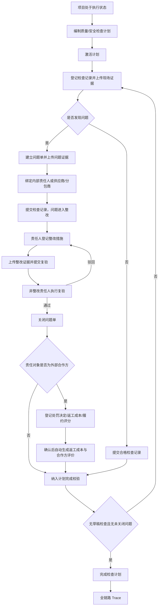
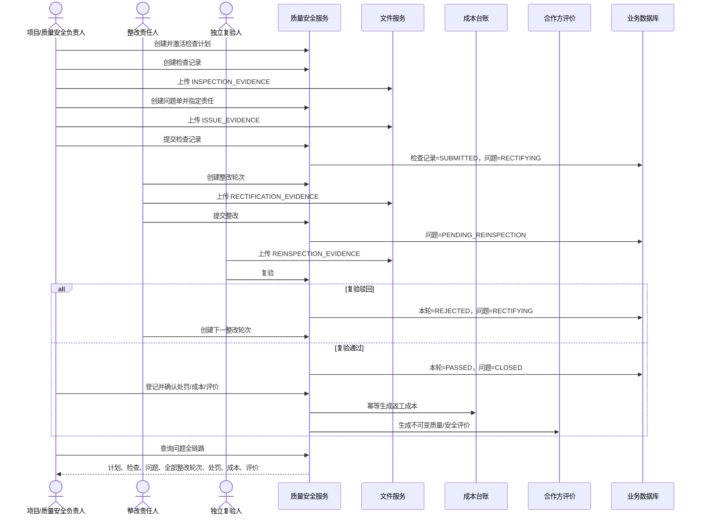
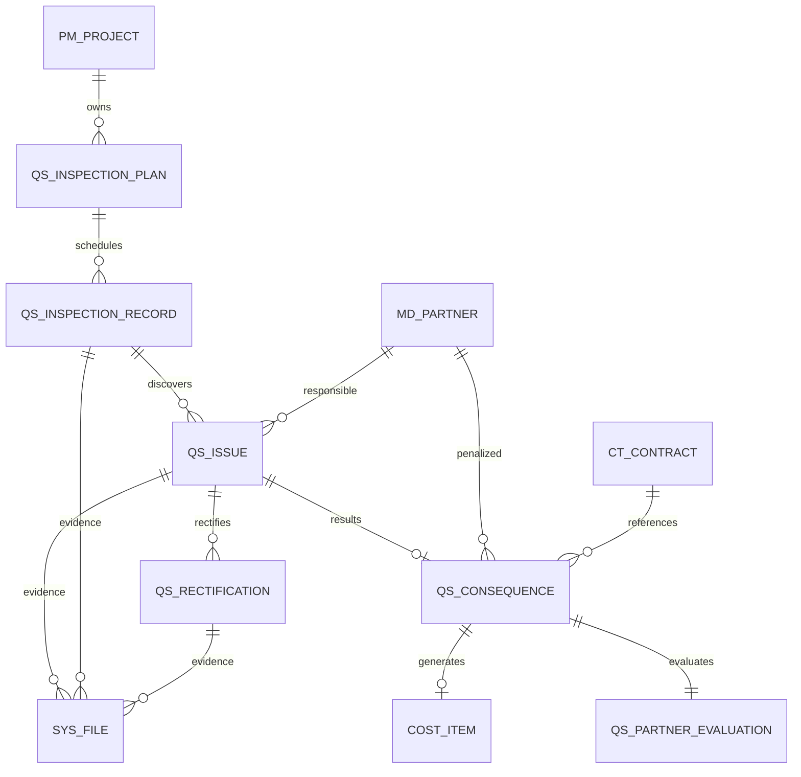

# CGC-PMS 质量安全整改闭环业务标准

## 1. 目标与适用边界

本标准建立 CGC-PMS 中唯一有效的质量安全业务主线：

> 检查计划 → 检查记录 → 问题单 → 整改责任 → 整改提交 → 独立复验 → 问题关闭 → 处罚/返工成本 → 分包商或供应商评价 → 全链路追溯。

适用于总承包项目的质量检查、安全检查、专项检查、日常巡检和由检查产生的整改闭环。任何一笔返工成本、任何一次合作方履约扣分，都必须反向追溯到已关闭的问题单、复验记录、整改证据、检查记录、检查计划和项目。

P0 不扩展移动离线巡检、AI 图像识别、IoT 设备监测、政府监管平台报送、劳务实名制、事故调查或供应商综合评级。罚款/扣款在本闭环形成不可变处罚事实；是否冲抵后续结算须由分包/采购结算业务显式引用，不允许本模块绕过结算直接改写应付金额。

## 2. 当前业务完成度分析

### 2.1 实施前源码事实

| 节点 | 实施前状态 | 主要问题 |
| --- | --- | --- |
| 检查计划 | 缺失 | 无实体、数据库关系、接口、页面和测试 |
| 检查记录 | 缺失 | 收货单仅有 `quality_status`，不能表达项目现场检查 |
| 问题单 | 缺失 | 无责任对象、严重程度、整改期限和状态链 |
| 整改责任 | 缺失 | 无责任人、合作方、期限和证据门禁 |
| 整改与复验 | 缺失 | 无轮次、驳回重整、职责分离和历史留痕 |
| 处罚与返工成本 | 缺失 | 无问题来源关系，不能自动形成成本事实 |
| 合作方评价 | 部分页面/字段 | 合作方有黑名单字段、驾驶舱有交付评分，但没有质量安全评价事实 |
| 文件 | 已有通用能力 | 未注册质量安全业务类型和阶段化证据类型 |
| 权限与审计 | 已有通用能力 | 未建立质量安全权限码和业务操作类型 |
| 全链路追溯 | 缺失 | 无可从成本/评价反查问题和检查来源的接口 |

### 2.2 P0 实施后的完成度

| 节点 | 实现载体 | 状态 |
| --- | --- | --- |
| 检查计划 | `qs_inspection_plan`、计划 API、工作台 | 已实现 |
| 检查记录 | `qs_inspection_record`、现场证据、提交门禁 | 已实现 |
| 问题单 | `qs_issue`、问题证据、责任对象和期限 | 已实现 |
| 整改与复验 | `qs_rectification` 多轮记录、驳回重整、独立复验 | 已实现 |
| 处罚/返工成本 | `qs_consequence`、`cost_item` 自动成本 | 已实现 |
| 合作方评价 | `qs_partner_evaluation` 不可变评价事实 | 已实现 |
| 文件 | `QS_INSPECTION`、`QS_ISSUE`、`QS_RECTIFICATION` 阶段授权 | 已实现 |
| 权限与审计 | 六组权限、Controller 审计注解、服务端项目范围 | 已实现 |
| Trace | 问题单反查全部节点及成本/评价 | 已实现 |

## 3. 业务流程





## 4. ER 关系与主外键



| 实体 | 主键 | 关键外键 | 唯一约束 | 删除策略 |
| --- | --- | --- | --- | --- |
| `qs_inspection_plan` | `id` | `project_id → pm_project` | 租户+项目+计划编号+删除标识 | 业务历史不物理删除；项目删除受 RESTRICT |
| `qs_inspection_record` | `id` | `plan_id`、`project_id` | 租户+项目+检查编号+删除标识 | 计划/项目 RESTRICT |
| `qs_issue` | `id` | `plan_id`、`inspection_id`、`project_id`、`responsible_partner_id` | 租户+项目+问题编号+删除标识 | 检查、合作方和项目 RESTRICT |
| `qs_rectification` | `id` | `issue_id`、`project_id` | 租户+问题+轮次+删除标识 | 问题/项目 RESTRICT |
| `qs_consequence` | `id` | `issue_id`、`project_id`、`partner_id`、`contract_id`、`cost_item_id`、`evaluation_id` | 每个问题一份后果记录；编号唯一 | 全部 RESTRICT，确认后不可删除 |
| `qs_partner_evaluation` | `id` | `consequence_id`、`issue_id`、`project_id`、`partner_id` | 每个后果一份评价 | 不更新、不删除，只追加新问题评价 |
| `cost_item` | `id` | 项目/合同/合作方/科目 | 来源类型+后果ID+来源明细+成本类型 | 系统生成，来源不可丢失 |

## 5. 生命周期与状态流转

### 5.1 检查计划

```text
DRAFT → ACTIVE → COMPLETED
  └────────────→ CANCELLED（预留，P0 不开放已执行计划取消）
```

- `DRAFT`：允许修改。
- `ACTIVE`：禁止修改计划基线，允许新增检查记录。
- `COMPLETED`：必须至少有一份已提交检查记录、无草稿检查、无未关闭问题。

### 5.2 检查记录

```text
DRAFT → SUBMITTED
```

- 草稿期允许新增问题和上传检查/问题证据。
- 提交时由系统根据问题数量计算 `PASS` 或 `ISSUES`，禁止客户端伪造结论。
- 提交后记录和证据不可修改，不允许重复提交。

### 5.3 问题单

```text
OPEN → RECTIFYING → PENDING_REINSPECTION → CLOSED
                       │
                       └──复验驳回──→ RECTIFYING
```

- 问题在检查草稿期创建为 `OPEN`。
- 检查提交后自动转为 `RECTIFYING`。
- 整改提交后转为 `PENDING_REINSPECTION`。
- 复验通过后关闭；驳回后必须创建新整改轮次，不覆盖旧轮次。

### 5.4 整改轮次

```text
DRAFT → SUBMITTED → PASSED
                 └→ REJECTED → 新一轮 DRAFT
```

- 同一问题同时最多一个 `DRAFT/SUBMITTED` 轮次。
- 整改责任人只能提交本人负责的整改。
- 整改责任人禁止复验本人提交的整改。

### 5.5 处罚成本与评价

```text
DRAFT → POSTED
```

- 仅外部责任问题且已关闭时可建立。
- `NONE/FINE/REWORK_COST/BOTH` 必须与金额组合一致。
- `POSTED` 事务内生成返工成本和合作方评价；重复确认被拒绝。

## 6. 节点业务规格

| 节点 | 输入 | 输出 | 前置条件 | 后置条件 | 核心规则与校验 | 权限、日志与审计 |
| --- | --- | --- | --- | --- | --- | --- |
| 检查计划 | 项目、编号、名称、质量/安全、频次、日期、责任人 | 计划草稿 | 项目可访问 | `DRAFT` | 日期有序；编号项目内唯一 | `plan:maintain`；CREATE/UPDATE |
| 激活计划 | 计划 ID | ACTIVE 计划 | DRAFT | 可建检查 | CAS 状态更新，禁止重复激活 | `plan:maintain`；ACTIVATE |
| 检查记录 | 计划、编号、日期、位置、检查人、摘要 | 记录草稿 | 计划 ACTIVE | 可上传证据/建问题 | 日期必须在计划期内 | `inspection:maintain`；CREATE |
| 问题单 | 检查、类别、等级、描述、责任、期限 | OPEN 问题 | 检查 DRAFT | 待随检查提交 | 外部责任必须绑定启用供应商/分包商；期限不得早于检查日 | `inspection:maintain`；CREATE |
| 提交检查 | 记录 ID、检查/问题证据 | SUBMITTED 记录、RECTIFYING 问题 | 检查 DRAFT | 结论冻结 | 检查证据必传；每个问题证据必传；病毒扫描必须 CLEAN | `inspection:maintain`；SUBMIT |
| 创建整改 | 问题、措施、责任人、计划完成日 | DRAFT 轮次 | 问题 RECTIFYING | 可上传整改证据 | 责任人必须一致；完成日不晚于期限；无并行轮次 | `rectify`；CREATE |
| 提交整改 | 整改 ID、整改证据 | SUBMITTED、问题待复验 | 整改 DRAFT | 等待独立复验 | 仅责任人/管理员；证据 CLEAN；重复提交拒绝 | `rectify`；SUBMIT |
| 复验 | 结果、意见、复验证据 | PASSED/CLOSED 或 REJECTED/RECTIFYING | 待复验 | 关闭或新一轮整改 | 责任人与复验人职责分离；意见/证据必填 | `reinspect`；REINSPECT |
| 处罚成本评价 | 合作方、合同、决定、金额、评分、说明 | DRAFT 后果 | 外部问题 CLOSED | 可确认 | 合作方与问题一致；合同属于项目且绑定合作方；金额组合匹配 | `consequence`；CREATE |
| 确认后果 | 后果 ID | 成本事实、评价事实、POSTED | 后果 DRAFT | 不可变 | 返工成本按来源幂等；评价 0—100；事务一致 | `consequence`；POST |
| 完成计划 | 计划 ID | COMPLETED | ACTIVE | 计划闭环 | 至少一份提交记录；无草稿检查；无未关闭问题 | `plan:maintain`；COMPLETE |
| Trace | 问题 ID | 全链聚合 | 项目可访问 | 无写入 | 租户、项目范围；成本与评价必须从后果反查 | `query`；只读 |

## 7. 异常处理原则

1. 跨租户对象统一返回不存在或拒绝访问，不泄露对象是否真实存在。
2. 状态不匹配、重复提交、重复激活、重复确认统一 fail-close。
3. 文件缺失、病毒扫描非 CLEAN、文件类型或阶段不匹配时禁止推进状态。
4. 并发更新依靠状态条件和唯一约束；冲突提示刷新，不覆盖他人提交。
5. 处罚成本确认中任一成本或评价写入失败，整个事务回滚，不允许半条链。
6. 复验驳回保留原轮次，禁止删除或改写；下一轮自动递增。
7. 返工成本金额为零时不生成 `cost_item`，但处罚决定和评价仍可确认。

## 8. 权限矩阵

| 权限码 | 典型角色 | 能力 |
| --- | --- | --- |
| `quality:safety:query` | 项目经理、成本经理、审计 | 查询台账和 Trace |
| `quality:safety:plan:maintain` | 项目经理、质量安全负责人 | 编制、激活、完成计划 |
| `quality:safety:inspection:maintain` | 检查人 | 检查记录、问题单、检查/问题证据 |
| `quality:safety:rectify` | 整改责任人、项目经理 | 整改轮次和整改证据 |
| `quality:safety:reinspect` | 质量安全负责人、项目经理 | 独立复验和关闭 |
| `quality:safety:consequence` | 项目经理、成本经理 | 处罚决定、返工成本和评价确认 |

前端隐藏按钮仅用于体验；后端 `@PreAuthorize`、项目数据范围、租户条件和业务状态是安全边界。

## 9. 验收标准

### 【检查计划】

- ✓ 必须绑定有权访问的项目。
- ✓ 检查类型只允许质量或安全。
- ✓ 起止日期必须有效，编号项目内唯一。
- ✓ 草稿才能修改和激活，禁止重复激活。
- ✓ 没有已提交检查记录不能完成。
- ✓ 有草稿检查或未关闭问题时不能完成。

### 【检查记录与问题单】

- ✓ 只有 ACTIVE 计划允许新增检查。
- ✓ 检查日期必须位于计划周期内。
- ✓ 提交检查必须有 CLEAN 现场证据。
- ✓ 每个问题必须有 CLEAN 问题证据。
- ✓ 外部责任问题必须绑定启用的供应商或分包商。
- ✓ 检查结论由系统计算，提交后不可修改或重复提交。

### 【整改与复验】

- ✓ 整改责任人必须与问题单一致。
- ✓ 同一问题不能存在两个并行整改轮次。
- ✓ 提交整改必须上传整改完成证据。
- ✓ 整改责任人不能复验本人提交的整改。
- ✓ 复验必须上传证据和意见。
- ✓ 驳回后保留旧轮次并允许创建下一轮。
- ✓ 只有复验通过才能关闭问题。

### 【处罚、成本与评价】

- ✓ 只有已关闭的外部责任问题可登记。
- ✓ 合作方必须与问题责任合作方一致。
- ✓ 合同必须属于同一项目并绑定该合作方。
- ✓ 处理决定必须与罚款、返工成本金额组合一致。
- ✓ 确认后返工成本自动进入成本台账，禁止人工重复录入。
- ✓ 评价与问题、合作方、项目、后果一一关联。
- ✓ 已确认记录不可修改或重复确认。

### 【全链路追溯】

- ✓ 从问题单可查计划、检查、所有整改复验轮次、处罚、成本和评价。
- ✓ 从成本记录的 `source_type/source_id` 可反查处罚后果和问题。
- ✓ 驳回轮次、操作人、时间、证据均保留。
- ✓ 跨租户、跨项目无权查看。

## 10. 测试方案

| 编号 | 场景 | 预期 |
| --- | --- | --- |
| QS-N-01 | 正常外部责任全链 | 计划完成，问题关闭，成本和评价生成，Trace 完整 |
| QS-N-02 | 无问题检查 | 结论 PASS，可在无开放问题时完成计划 |
| QS-N-03 | 复验驳回后再次整改 | 第一轮 REJECTED，第二轮编号递增，历史保留 |
| QS-A-01 | 缺检查证据提交 | 拒绝，记录仍 DRAFT |
| QS-A-02 | 任一问题缺问题证据 | 拒绝，所有状态不变 |
| QS-A-03 | 整改缺证据 | 拒绝，问题仍 RECTIFYING |
| QS-A-04 | 复验缺证据/意见 | 拒绝，问题仍待复验 |
| QS-A-05 | 整改责任人自验 | 拒绝，满足职责分离 |
| QS-A-06 | 重复提交检查/整改/后果 | 拒绝，不产生重复事实 |
| QS-A-07 | 外部问题未绑定合作方 | 拒绝创建 |
| QS-A-08 | 绑定非供应商/分包商 | 拒绝创建 |
| QS-A-09 | 合同跨项目或未绑定合作方 | 拒绝创建后果 |
| QS-A-10 | 问题未关闭登记处罚 | 拒绝 |
| QS-B-01 | 计划日期反向 | 拒绝 |
| QS-B-02 | 检查日期位于计划外 | 拒绝 |
| QS-B-03 | 整改完成日超过期限 | 拒绝 |
| QS-B-04 | 评分为 0 或 100 | 允许；小于 0 或大于 100 拒绝 |
| QS-C-01 | 两人并发提交同一状态 | 仅一人成功，另一人收到并发提示 |
| QS-C-02 | 两次并发确认返工成本 | 唯一来源约束确保仅一个成本事实 |
| QS-S-01 | 跨租户/跨项目查询 | 不返回对象详情 |
| QS-S-02 | 错误权限上传证据 | 文件授权器拒绝 |
| QS-S-03 | 在错误业务阶段上传证据 | 拒绝，不允许事后替换证据 |
| QS-I-01 | H2 全量迁移 | V188 表、索引、菜单和外键可创建 |
| QS-I-02 | MySQL 8 Flyway | V188 `success=1`，六表及外键存在 |
| QS-F-01 | 前端类型、lint、构建 | 全部通过 |
| QS-F-02 | 前端 API 与页面契约 | 节点、证据、权限和 Trace 测试通过 |

## 11. 开发路线图

### P0（本闭环必须完成）

- 六个领域事实表及 MySQL/H2 迁移。
- 状态机、项目/租户权限、职责分离、附件阶段门禁。
- 返工成本幂等生成、合作方评价事实、全链 Trace。
- 质量安全工作台、API、路由、菜单、测试和业务标准。

### P1（闭环稳定后）

- 在分包终期结算、采购结算中显式引用已确认罚款/扣款事实，形成扣款占用与结算核销。
- 检查模板、检查项清单、批量检查和整改逾期预警。
- 合作方质量/安全评分聚合及按项目、期间趋势。

### P2（优化）

- 移动端拍照、定位、水印、离线草稿和二维码定位。
- 复验抽样规则、重大问题升级、多专业联合检查。
- 质量安全驾驶舱、热力图和重复问题分析。

### P3（未来版本）

- AI 图片识别、IoT 风险联动、政府监管平台对接。
- BIM 构件级问题定位、视频巡检和预测性风险模型。

禁止用 P1—P3 扩展推迟 P0 的状态、来源、权限、证据和事务一致性门禁。

## 12. 风险与控制

| 风险 | 控制措施 |
| --- | --- |
| 事后补传或替换证据 | 按业务类型、文档类型和状态限制上传/删除 |
| 整改人自验 | 服务端比较责任人与复验人，强制职责分离 |
| 驳回覆盖历史 | 每次整改使用独立轮次，旧轮次 REJECTED 不改写 |
| 返工成本重复 | `cost_item` 来源唯一约束 + 事务 + 幂等查询 |
| 处罚事实直接篡改应付 | P0 只形成处罚事实，结算必须显式引用并核销 |
| 合作方评价失真 | 每项评价必须来源于已关闭问题和已确认后果 |
| 跨项目或跨租户串链 | 所有入口校验租户、项目数据范围、合同和合作方关系 |
| 计划形式化关闭 | 至少一份提交检查、无草稿记录、无开放问题三重门禁 |

## 13. 唯一事实口径

1. `qs_issue.status=CLOSED` 只代表复验通过，不代表处罚或返工成本已经处理。
2. `qs_consequence.status=POSTED` 才代表处罚决定和评价已确认；`cost_item_id` 非空才代表存在返工成本。
3. `fine_amount` 是处罚/扣款业务事实，不在本模块直接减少合同或结算金额。
4. `qs_partner_evaluation` 是后续供应商招采与履约评价闭环的质量安全事实来源，不允许页面临时计算替代。
5. Trace 返回的计划、检查、问题、整改、后果、成本和评价必须来自持久化事实，不使用前端拼接模拟。
