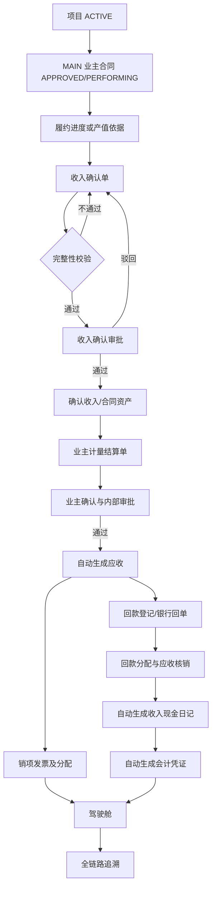
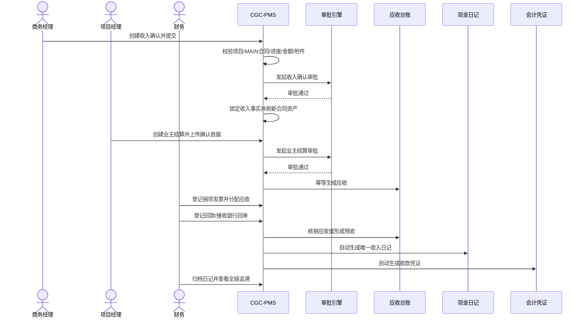
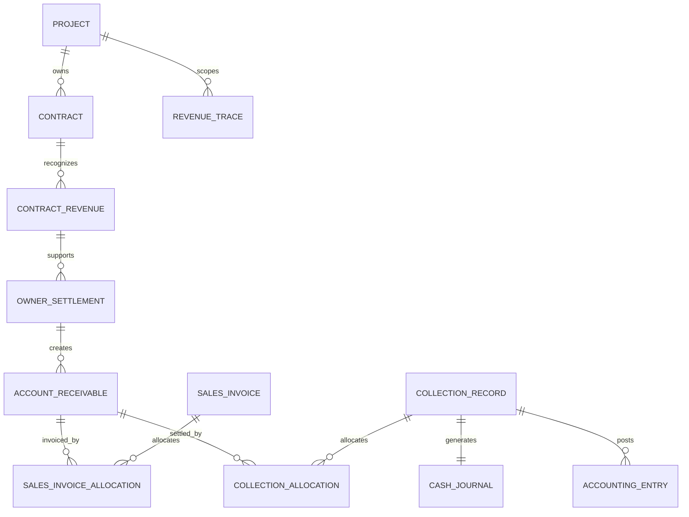

# CGC-PMS 项目收入与回款闭环业务标准

状态：Development Verified
基线日期：2026-07-16
适用范围：项目收入、业主结算、应收、销项发票、回款和收入现金流
事实基线：master 当前源码、V171–V174、后端 1857 项回归、前端 636 项回归及本地 MySQL/浏览器验收

> 本文是 CGC-PMS“项目收入与回款”主线的唯一业务标准。收入确认、业主结算、应收、销项发票和回款是五类独立事实，禁止用一个金额字段或现金到账替代其他事实。

## 1. 目标、边界与强制原则

### 1.1 业务目标

建立可正反向追溯的收入闭环：

项目 → 业主合同 → 履约进度/产值依据 → 收入确认 → 业主计量结算 → 应收账款 → 销项发票 → 回款 → 现金日记收入 → 会计凭证 → 驾驶舱。

任取一条回款或现金日记，必须能够反查收款分配、应收、业主结算、收入确认、审批、合同和项目。

### 1.2 核算原则

| 事实 | 唯一口径 |
| --- | --- |
| 收入确认 | 按已审批履约进度或合格产值依据确认，不等于结算、开票或收款 |
| 业主结算 | 业主书面确认的本期应付工程款，是形成应收的依据 |
| 应收账款 | 已生效业主结算含税金额 - 已核销回款 - 已生效贷项/冲减 |
| 销项发票 | 独立税务事实，可一票分配多笔应收，也可一笔应收对应多票 |
| 回款 | 银行或现金实际到账事实，可分配多笔应收；未分配金额进入预收/待认领 |
| 合同资产 | 累计已确认收入 - 累计已结算金额，最低为 0 |
| 合同负债 | 累计已结算金额 - 累计已确认收入，最低为 0 |
| 回款率 | 累计已核销回款 / 累计已生效应收；分母为 0 时显示 0 |
| 逾期应收 | 到期日早于业务日且未核销余额大于 0 的应收 |

金额统一 `DECIMAL(18,2)`，入账按 `HALF_UP` 保留两位；不得使用浮点数。

### 1.3 非目标

- P0 不替代专业税控、总账或银行平台，只建设可对接、可补偿的业务事实与集成契约。
- 不把内部施工日报直接作为收入确认或应收依据。
- 不复用供应商进项发票 `pay_invoice` 存储销项发票。
- 不允许直接修改已审批、已开票、已核销或已过账金额；纠错必须使用撤回、作废、贷项、退款或冲销。

## 2. 当前业务完成度分析

### 2.1 现有能力

| 节点 | 当前能力 | 实施前等级 |
| --- | --- | --- |
| 项目/业主合同 | 项目、MAIN 总包合同、甲乙方、合同金额、变更和审批已存在 | C3 |
| 收入确认 | `contract_revenue` 支持 CRUD、审批、履约进度、收入/税额和收入科目归集 | C3 |
| 合同资产/负债 | 按已审批收入与 `billedAmount` 聚合查询 | C2 |
| 业主结算 | 只有收入表中的结算金额字段，无独立单据、审批、附件和生命周期 | C1 |
| 应收账款 | 无实体、台账、到期日、账龄、核销和坏账状态 | C0 |
| 销项发票 | 无；现有发票域仅面向付款/进项发票 | C0 |
| 回款 | 无收款事实、流水号幂等、认领和应收分配 | C0 |
| 现金日记收入 | 支持人工 `IN`，没有回款成功自动生成和显式关联 | C1 |
| 会计凭证 | 有通用凭证引擎和付款策略，无收入/应收/回款策略 | C1 |
| 驾驶舱 | 有确认收入和利润字段，无应收、逾期、回款率和收入现金流明细 | C2 |
| 全链追溯 | 无统一收入追溯 API | C0 |

### 2.2 实施前阻塞缺口

1. `contract_revenue` 未强制项目、MAIN 合同、合同状态和租户一致性。
2. `billedAmount` 同时承担结算展示，无法证明由谁、何时、基于什么附件确认。
3. 没有应收主事实，无法计算账龄、到期、逾期和核销余额。
4. 没有销项发票及发票—应收金额分配关系。
5. 没有回款、银行流水幂等、预收待认领和应收核销。
6. 收入现金日记依赖人工录入，可能重复或漏记。
7. 缺数据库 FK、唯一约束、版本与审计关系。
8. 缺统一端到端测试和前端业务入口。

### 2.3 当前实施结果

| 节点 | 当前实现 | 等级 |
| --- | --- | --- |
| 收入确认 | 强制项目/合同/金额/进度/附件校验，保存公式版本和审批实例 | C4 |
| 业主结算 | 独立单据、三级审批、驳回重提、附件、合同上限与到期日 | C4 |
| 应收 | 进度款/保留金独立应收、余额、到期、账龄、冲减、状态流转 | C4 |
| 销项发票 | 独立发票、附件、验真复核、发票—应收金额分配 | C4 |
| 回款 | 银行流水幂等、应收分配、未分配余额、并发保护、冲销 | C4 |
| 现金日记/凭证 | 回款同事务自动生成唯一收入日记和借贷平衡凭证 | C4 |
| 驾驶舱/追溯 | 项目收入指标、账龄、快照、现金日记反查收入与审批全链 | C4 |
| 外部集成 | 银行回单关联、Outbox 契约、预测和客户信用基础模型；生产连接器未启用 | C3 |

完成度结论：开发与本地集成验收已形成业务闭环；生产启用仍须完成历史 `billedAmount` 数据处置和真实银行/税务/ERP 连接器验收。

## 3. 目标流程

### 3.1 Mermaid Flowchart

### 3.2 Mermaid Sequence Diagram

## 4. 数据关系

### 4.1 Mermaid ER

### 4.2 主外键与删除策略

| 实体 | 核心关系 | 删除策略 |
| --- | --- | --- |
| ContractRevenue | project_id、contract_id、approval_instance_id、formula_version | 草稿软删；已提交后禁止删除 |
| OwnerSettlement | project_id、contract_id、revenue_id、approval_instance_id | 草稿软删；审批后只能冲减 |
| AccountReceivable | settlement_id 唯一，project_id、contract_id、customer_id | 永不物理删除；用状态和冲减单纠错 |
| SalesInvoice | project_id、contract_id、customer_id | 草稿可作废；已开具只能红字/贷项 |
| SalesInvoiceAllocation | invoice_id、receivable_id | 已确认发票不可直接改分配 |
| CollectionRecord | project_id、contract_id、fund_account_id、external_txn_no | 成功后只能退款/冲销 |
| CollectionAllocation | collection_id、receivable_id | 回款冲销时生成反向事实 |
| CashJournal | collection_record_id 唯一 | 自动生成；不得人工重复录入 |

所有核心 FK 使用 `ON DELETE RESTRICT`；租户一致性仍由服务层和集成测试强制。

## 5. 生命周期与状态

- 收入确认：`DRAFT → PENDING → APPROVED`；`PENDING → REJECTED → DRAFT`。
- 业主结算：`DRAFT → PENDING → RECEIVABLE_CREATED`；`PENDING → REJECTED → PENDING` 支持原实例重提。
- 应收：`OPEN → PARTIALLY_COLLECTED → COLLECTED`；到期未清自动标记 `OVERDUE`；冲减后可 `CREDITED/CLOSED`。
- 销项发票：创建即完成金额守恒校验并进入 `FULLY_ALLOCATED`；纠错目标态为 `CREDITED/VOIDED`。
- 回款：到账成功进入 `SUCCESS`，通过 `allocated_amount/unallocated_amount` 表达认领程度；错误到账进入 `REVERSED`。
- 现金日记：`PENDING_ARCHIVE → ARCHIVED → REVERSED`。

## 6. 节点业务契约

| 节点 | 输入/前置 | 输出/后置 | 核心校验、权限与审计 |
| --- | --- | --- | --- |
| 项目/业主合同 | ACTIVE 项目；APPROVED/PERFORMING MAIN 合同 | 收入链主维度 | 项目合同同租户且一致；商务维护、财务只读；记录状态变更 |
| 收入确认 | 进度、期间、收入、税额、依据附件 | 审批后不可变收入事实 | 累计进度≤100%；累计收入不得无依据超过合同当前金额；重复期间/依据幂等 |
| 业主结算 | 收入依据、业主确认金额、税额、到期日、保留金、附件 | 审批后生成唯一应收 | 金额>0；不得超过可结算余额；业主确认附件必填；合同非关闭 |
| 应收 | 来源结算、客户、到期日 | 余额、账龄、逾期状态 | 来源唯一；核销后余额不得为负；财务权限；记录每次余额变化 |
| 销项发票 | 发票号、代码、开票日、价税、附件、应收分配 | 开票与应收覆盖进度 | 同租户号码唯一；分配和=发票金额；不得跨项目/客户 |
| 回款 | 账户、到账时间、金额、流水号、付款方、回单 | 回款事实与分配 | 流水号幂等；金额>0；账户有效；分配不超应收余额；未分配进入预收 |
| 现金日记 | 成功回款 | 唯一 PENDING_ARCHIVE 收入日记 | 自动关联项目、合同、回款；回单齐全才归档；禁止手工重复 |
| 会计凭证 | 收入确认、应收或回款事实 | 借贷平衡凭证草稿 | 同来源同类型幂等；过账后不可改；冲销生成反向凭证 |
| 驾驶舱/Trace | 全部权威事实 | 收入、应收、逾期、回款率、现金流、利润和完整链 | 指标可下钻；按租户/项目权限；保留公式版本和查询审计 |

### 6.1 十项节点定义

| 节点 | ①输入数据 | ②输出数据 | ③前置条件 | ④后置条件 | ⑤业务规则/⑦数据校验 | ⑥异常处理 | ⑧权限要求 | ⑨日志要求 | ⑩审计要求 |
| --- | --- | --- | --- | --- | --- | --- | --- | --- | --- |
| Project | 项目编码、名称、组织、周期、合同目标 | ACTIVE 项目主数据 | 租户与组织有效 | 可作为收入链项目维度 | 编码唯一、状态合法、日期有序 | 业务码拒绝；无半成品 | 项目维护/查询及数据范围 | 创建、状态变更、归档日志 | 操作者、前后值、时间、租户 |
| Contract | 项目、甲乙方、合同类型、含税金额、状态 | MAIN 业主合同 | 项目有效，甲方为客户 | 可承载收入和业主结算 | 必须 MAIN、APPROVED、PERFORMING；当前金额为上限 | 跨项目/非履约合同拒绝 | 合同维护；项目成员只读 | 审批、变更、生效日志 | 合同版本、金额口径、审批实例 |
| ContractRevenue | 项目、合同、日期、进度、收入、税额、附件 | 审批后的收入事实、合同资产口径 | ACTIVE 项目和履约 MAIN 合同 | APPROVED 后不可改并形成收入科目事实 | 进度 0–100；金额>0；累计确认不超合同；附件≥1 | 驳回可重提；并发提交 CAS；失败回滚 | `revenue:*` 与项目数据范围 | 创建、更新、提交、审批回调 | 公式版本、审批实例、操作者和时间 |
| OwnerSettlement | 收入依据、周期、结算日、含税额、税额、保留金、到期日、附件 | 生效结算和一至两笔应收 | 收入依据已审批；合同履约中 | 审批通过幂等生成进度款/保留金应收 | 保留金≤含税额；到期日≥结算日；累计结算≤合同当前金额 | 驳回保留原单和审批历史；回调失败事务回滚 | 维护、提交、审批分离 | 单据、提交、驳回、通过日志 | 多级审批记录、公式版本、附件关系 |
| AccountReceivable | 结算、客户、类型、原始金额、到期日 | 原额、已收、已冲减、未收、账龄状态 | 结算已审批 | 余额随核销/冲减原子更新 | `原额=已收+已冲减+未收`；余额不得负；来源类型唯一 | 超额/跨项目分配拒绝且无余额变化 | 财务维护，商务/项目只读 | 每次余额变化及幂等键 | 调整事实、来源单、操作人、前后余额 |
| SalesInvoice | 发票代码/号码、日期、价税、客户、附件、应收分配 | 销项发票与分配关系 | 应收有效且同项目/合同/客户 | 发票成为税务事实并可追溯应收 | 同租户号码唯一；分配合计=价税合计；附件≥1 | 重号、跨客户、金额不守恒拒绝 | 财务开票/复核；项目只读 | 创建、OCR/验真、复核日志 | 原识别结果、比对结果、复核意见 |
| CollectionRecord | 账户、到账时间、金额、流水号、付款方、回单、应收分配 | 回款、分配、未认领额、收入现金日记、凭证 | 账户启用且合同履约 | 同事务核销应收并生成日记/凭证 | 流水号幂等；到账日≥开户日；分配≤到账额和应收余额 | 任一步失败全回滚；重复回调返回原事实 | 财务收款维护；冲销独立权限 | 到账、分配、幂等命中、失败日志 | 银行流水、回单、分配、冲销原因与幂等键 |
| CashJournal | 成功回款事实 | 唯一 `IN/PENDING_ARCHIVE` 日记 | 回款落库成功 | 资金余额和现金流查询可见 | `collection_record_id` 唯一；禁止人工复制 | 失败使回款事务回滚；归档后只准红冲 | 日记查询/维护分离 | 自动生成、归档、红冲日志 | 来源类型、来源 ID、回款 ID、状态变更 |
| AccountingEntry | 回款金额、账户、项目、合同 | 借银行存款/贷应收的平衡凭证 | 回款和应收分配成功 | 凭证草稿可审核过账 | 同来源同类型唯一；借贷相等 | 生成失败使回款事务回滚；过账后反向凭证纠错 | 凭证生成/查询/过账分离 | 策略、来源、借贷总额日志 | 回款 ID、日记关系、凭证行和过账记录 |
| Dashboard | 项目及业务日期 | 收入、结算、应收、逾期、回款、回款率、快照 | 用户有项目查询权限 | 指标可下钻到权威事实 | 只从已生效事实聚合；分母为零时比率为零 | 对账差异形成问题单，不静默修数 | `revenue:operations:query` | 查询、快照重建、对账日志 | 公式版本、快照日期、重建模式和操作者 |
| Trace | 现金日记 ID | 回款、分配、应收、结算、收入、审批、发票、合同、项目、凭证 | 日记属于当前租户且为回款来源 | 返回完整只读证据包 | 所有查询同时校验租户；不存在或非回款日记拒绝 | 任一关系缺失由日终对账形成完整性问题 | 收入查询与项目数据范围 | Trace 请求、耗时、结果摘要 | 查询人、日记 ID、返回链路版本 |

异常必须返回稳定业务码，不得用 500 代替业务拒绝；关键写入使用事务、CAS/行锁和幂等键。

## 7. 验收标准

- 收入确认必须绑定 ACTIVE 项目与 APPROVED/PERFORMING MAIN 合同。
- 收入确认、结算、应收、发票、回款五类事实必须独立存储并可相互追溯。
- 业主结算未经审批不得生成应收；同一结算不得重复生成应收。
- 销项发票必须支持一票多应收、一应收多票，金额分配守恒。
- 回款未经成功确认不得核销应收或生成现金日记。
- 同一外部流水重复提交只产生一条回款、一组分配和一条现金日记。
- 回款分配不得超过回款可分配余额或应收未核销余额。
- 未分配回款必须作为预收/待认领保留，不得丢失。
- 回款成功自动生成且仅生成一条收入现金日记；不得要求财务重复录入。
- 冲销/退款必须反向恢复应收、现金余额和凭证，不得直接删除历史事实。
- 驾驶舱收入、应收、回款、现金流和利润必须能下钻到权威单据。
- 从现金日记反查到项目、合同、收入、结算、应收、发票、回款、审批的链路不可缺失。

### 7.1 分节点验收清单

**项目/业主合同**

- ✓ 项目必须为 ACTIVE，合同必须为同项目 MAIN、APPROVED、PERFORMING。
- ✓ 合同甲方必须与结算、发票、回款客户一致。
- ✓ 项目暂停、合同关闭或跨租户关系必须拒绝。

**收入确认**

- ✓ 必须填写项目、合同、履约进度、确认收入、日期和附件。
- ✓ 累计进度不得超过 100%，累计确认收入不得超过合同当前金额。
- ✓ 只有草稿可编辑/删除，审批后金额不可直接修改；审批记录可追溯。

**业主结算**

- ✓ 必须绑定项目、合同、客户，可选绑定已审批收入确认。
- ✓ 必须上传业主确认或结算附件；保留金不得超过结算金额。
- ✓ 未审批不得生成应收；审批回调重复执行不得重复生成应收。
- ✓ 驳回后必须保留原单、意见和轮次并允许重提。

**应收账款**

- ✓ 必须由生效业主结算自动生成，不允许无来源手工造账。
- ✓ 原额必须始终等于已收、已冲减和未收之和，余额不得为负。
- ✓ 支持部分核销、全部核销、保留金、冲减、逾期和账龄。

**销项发票**

- ✓ 必须绑定同项目、合同、客户的应收并上传电子发票或扫描件。
- ✓ 发票价税合计必须等于分配合计；号码同租户唯一。
- ✓ 支持一票多应收和一应收多票；验真/OCR 结论必须可复核。

**回款**

- ✓ 必须记录账户、到账时间、金额、流水号、付款方和银行回单。
- ✓ 同一银行流水串行或并发重复提交只产生一笔事实。
- ✓ 可部分或跨应收分配；未分配余额必须保留，不得丢失。
- ✓ 超额、跨项目、停用账户、开户日前到账必须拒绝且无副作用。

**现金日记/凭证**

- ✓ 回款成功必须在同一事务自动生成一条收入日记和一张平衡凭证。
- ✓ 财务不得重复手工录入；来源唯一约束必须生效。
- ✓ 回款冲销必须恢复应收并反向处理日记/凭证，历史记录不得删除。

**驾驶舱/追溯**

- ✓ 收入、结算、应收、逾期、回款、开票和回款率必须来自权威事实。
- ✓ 日终对账必须发现余额、分配、日记和凭证不一致。
- ✓ 现金日记 Trace 必须显式返回收入确认、审批实例/任务/记录、业主结算、应收、销项发票、回款、合同、项目和凭证。

## 8. 测试方案

### 8.1 正常流程 REV-FLOW-001

1. 创建 ACTIVE 项目和 APPROVED/PERFORMING MAIN 合同。
2. 创建并审批收入确认，验证确认收入和合同资产。
3. 创建并审批业主结算，验证唯一应收及到期日。
4. 开具销项发票并跨两笔应收分配，验证守恒。
5. 登记部分回款，跨两笔应收核销，验证部分状态。
6. 登记尾款，验证应收结清、回款率、现金日记、凭证和驾驶舱。
7. 从现金日记调用 Trace，验证全链对象和审批记录可达。

### 8.2 异常与边界

| 场景 | 预期 |
| --- | --- |
| 非 MAIN 合同、项目合同不一致、项目暂停/关闭 | 禁止提交收入或结算 |
| 缺附件、缺客户、缺到期日、金额为零/负数 | 完整性校验失败 |
| 累计进度>100%、累计收入/结算超合同上限 | 拒绝且无状态变化 |
| 审批驳回后重提 | 同一业务单据复用流程语义且记录完整 |
| 重复结算回调 | 仅一笔应收 |
| 重复发票号码、跨客户分配、分配不守恒 | 拒绝 |
| 重复银行流水、超额核销、跨项目核销 | 拒绝或幂等返回原事实 |
| 回款事务中日记/凭证失败 | 回款和核销全部回滚 |
| 部分回款、零尾差、保留金、预收款 | 余额和状态正确 |
| 回款冲销/退款 | 应收、日记、余额、凭证反向恢复且可追溯 |
| 跨租户、无权限、越项目数据范围 | 404/403 且无数据泄漏 |

并发测试覆盖同一应收双核销、同一流水双提交、同一结算双回调；迁移测试覆盖 MySQL/H2 版本一致、历史 `billedAmount` 差异预览和孤儿扫描。

## 9. 开发路线图

当前状态：P0–P2 已完成开发与本地验收；P3 已完成集成契约、Outbox、预测和信用基础模型，真实外部平台连接与生产凭据属于上线前置，不在源码中伪造。

### 9.1 P0：必须完成

1. 现有 `contract_revenue` 完整性校验、公式版本、审批关系和历史基线。
2. 独立业主结算、应收、销项发票/分配、回款/分配模型及 FK。
3. 业主结算审批通过自动生成唯一应收。
4. 回款成功自动核销、生成唯一收入现金日记和会计凭证。
5. 冲销前所需显式关系、幂等键、不可变规则和审计字段。
6. 收入驾驶舱指标与统一 Trace API。
7. 前端收入运营页面和 REV-FLOW-001 自动化总验收。

### 9.2 P1：建议完成

- 收入/结算冲减、回款退款/冲销、应收反向恢复。
- 预收款认领、保留金到期释放、收款计划和逾期预警。
- 应收账龄、催收记录、日终对账和审计导出。

### 9.3 P2：优化

- 收入/应收/回款快照和事实重算。
- 销项发票 OCR/验真结果复核、批量导入差异。
- 按金额、合同和客户风险路由审批；冷热审计索引。

### 9.4 P3：未来版本

- 银行回款自动匹配、电子发票/税务平台和 ERP/总账双向同步。
- 滚动回款预测、DSO、资金缺口和客户信用风险。
- 多公司内部往来、集团资金归集和合并视图。

## 10. 风险与控制

| 风险 | 控制 |
| --- | --- |
| 收入、结算、开票和回款口径混用 | 五事实分离、公式版本和指标下钻 |
| 历史 billedAmount 无来源 | 只读差异预览，禁止自动生成正式应收 |
| 超合同确认或超额核销 | 合同/应收行锁、CAS、幂等键和并发测试 |
| 税额与含税金额不一致 | 服务端统一计算与发票分配守恒 |
| 回款到账但无法认领 | 预收/待认领余额，不允许丢弃 |
| 现金日记重复 | collection_record_id 唯一约束和同事务生成 |
| 生产外部平台不可控 | Outbox、签名、重试、补偿和人工对账 |

## 11. 源码证据索引

- 数据模型：`V171__revenue_collection_closed_loop_core.sql` 至 `V174__revenue_collection_integration_p3.sql`，MySQL/H2 双版本。
- 核心服务：`RevenueOperationsService`、`RevenueAdvancedService`、`ContractRevenueService`。
- 审批与会计：`OwnerSettlementWorkflowHandler`、`CollectionRecordEntryGenerationStrategy`、`EntryGenerator`。
- 现金关系：`cash_journal_entry.collection_record_id`；凭证关系：`accounting_entry.collection_record_id`。
- API：`RevenueOperationsController`，所有读写接口均带权限控制，关键写操作带操作审计。
- 附件：通用文件服务支持 `CONTRACT_REVENUE`、`OWNER_SETTLEMENT`、`SALES_INVOICE`、`COLLECTION_RECORD`，执行租户、项目和状态校验。
- 前端：`frontend-admin/src/pages/revenue/index.vue`、`revenueOperations.ts`、`/revenue` 路由和“结算收付/收入与回款”菜单。
- 自动化：`RevenueCollectionClosedLoopIntegrationTest` 覆盖正常、异常、冲销、P1–P3、重复回调和并发幂等；前端 API、路由和菜单有契约测试。

## 12. 验收证据

| 层级 | 结果 |
| --- | --- |
| 后端全量 | 1857 tests，0 failures，0 errors，1 skipped |
| 收入闭环定向 | 正常全链、超额回滚、P1–P3、双线程重复银行回调、Trace 全部通过 |
| 前端全量 | 104 files、636 tests 全部通过 |
| 前端生产构建 | `vue-tsc --noEmit && vite build` 通过 |
| 迁移 | 本地 MySQL V171、V172、V173、V174 均 success=1；H2 集成迁移通过 |
| 运行态 | 后端 `http://localhost:8080/api/actuator/health` 返回 UP；前端 `http://localhost:5173/` 返回 200 |
| 浏览器 | dev-login 最终落点 `/revenue`；菜单、指标、四页签和结算弹窗可见；控制台 0 error/warning |

## 13. 上线裁决规则

只有 P0 全部完成、REV-FLOW-001 与全部负向/并发/迁移/权限测试通过、真实历史数据处置完成，并且外部银行/税务/ERP 生产前置得到正式验收，才允许生产启用。

当前裁决：**开发与本地集成验收通过，生产上线暂不通过**。

生产阻塞项只有两类：

1. 对历史 `contract_revenue.billed_amount` 执行差异预览、业务确认和迁移签字，禁止系统自动猜测并生成正式应收。
2. 在隔离环境完成真实银行、税务/电子发票、ERP/总账连接器的凭据、签名、重试、回调幂等、对账和回滚演练。

上述事项均属于外部数据与生产集成前置；在完成前，P3 仅可作为关闭状态的集成契约和 Outbox 基础设施存在。

## 14. 后续优化建议

- 将历史数据处置做成一次性、先预览后确认的受控迁移，不提供“自动修正全部历史”按钮。
- 真实银行回单匹配先采用规则评分加人工确认，准确率和误配率达标后再逐步自动化。
- 销项发票验真、红字信息表和税务状态以税务平台回执为权威，不由 OCR 结果直接改账。
- DSO、回款预测和客户信用只做决策辅助，不自动替代合同条款、业主确认和财务审核。
