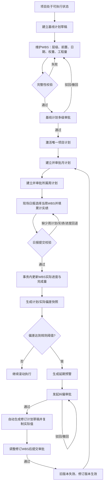
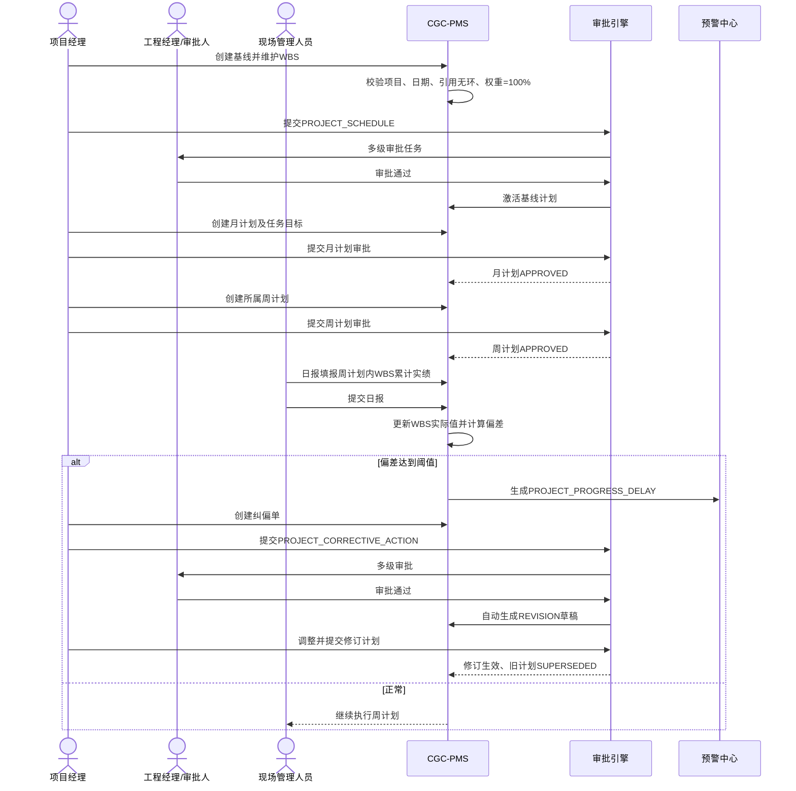
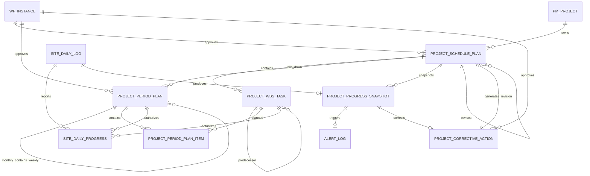

# CGC-PMS 项目计划与施工履约闭环业务标准

版本：1.0
状态：P0 已实施，待远端 CI 与生产迁移验收
事实基线：V185、`ProjectScheduleService`、项目计划工作台、现场日报实际进度、闭环集成测试

> 本文是项目基线计划 → WBS → 月/周计划 → 施工日报 → 实际进度 → 偏差分析 → 延期预警 → 纠偏审批 → 计划更新的唯一业务标准。后续功能不得绕开项目、计划版本、WBS、已审批周计划和日报来源关系。

## 1. 目标、范围与非目标

### 1.1 目标

- 一个项目同一时刻只能有一个生效计划版本。
- 每个计划版本必须有权重合计 100% 的独立项目 WBS。
- 周计划必须来源于已审批月计划，月周计划必须来源于生效项目计划。
- 现场日报实际进度只能填报当日覆盖的已审批周计划任务。
- 日报提交事务内更新 WBS 实际值、生成偏差快照并按规则生成延期预警。
- 延期快照可以发起纠偏；纠偏审批通过后自动复制生效计划为修订草稿。
- 修订计划审批通过后替换旧计划；旧版本、实际进度和审批记录永久保留。
- 计划、WBS、周期计划、日报实绩、偏差、预警、纠偏和修订版本可以正反向追溯。

### 1.2 P0 范围

- 基线与修订版本、多级父 WBS、单前置 FS 关系。
- 月计划、周计划及任务目标进度。
- 日报累计实际进度和累计完成量。
- 线性计划进度、权重汇总偏差、延期/逾期状态。
- 通用多级审批、驳回、撤回、重新提交和审批留痕。
- 延期预警、纠偏单、自动计划修订草稿。

### 1.3 非目标

- 不包含关键路径自动排程、多前置类型、资源负荷平衡、BIM 4D 和拖拽甘特图。
- 不把分包任务表 `sub_task` 继续当作项目计划主模型。
- 不自动改写未经审批的计划日期。
- 不连接外部 Primavera P6、Microsoft Project 或企业微信等外部系统。

## 2. 当前业务完成度

| 节点 | 数据库 | 服务/API | 页面 | 审批/规则 | 自动化证据 | 完成度 |
| --- | --- | --- | --- | --- | --- | --- |
| 项目基线/修订 | `project_schedule_plan` | 创建、列表、详情、提交 | 项目计划工作台 | 三级审批、唯一生效 | 集成测试 | C4 |
| 项目 WBS | `project_wbs_task` | 整批维护、层级/前置/日期/权重校验 | 可编辑任务表 | 提交前完整性门禁 | 正常与异常测试 | C4 |
| 月/周计划 | `project_period_plan(_item)` | 创建、明细、提交 | 月周计划页签 | 月周审批、周从属月 | 集成测试 | C4 |
| 施工日报 | 既有 `site_daily_log` | 既有 CRUD/提交 | 既有现场日报 | 提交后不可改 | 既有回归 | C4 |
| 日报实际进度 | `site_daily_progress` | 查询、整批填报 | 日报 WBS 实绩表 | 周计划门禁、单调递增 | 集成+前端契约 | C4 |
| 偏差分析 | `project_progress_snapshot` | 自动/手动计算 | 偏差页签 | V1 公式固化 | 集成测试 | C4 |
| 延期预警 | `alert_log` + 规则配置 | 自动生成并去重 | 复用预警中心 | 5 个百分点阈值 | 集成测试 | C4 |
| 纠偏审批 | `project_corrective_action` | 创建、提交 | 纠偏表单 | 三级审批 | 集成测试 | C4 |
| 计划更新 | 修订版本 + 父计划/纠偏外键 | 自动复制、再次审批、版本切换 | 计划版本列表 | 审批后切换 | 集成测试 | C4 |
| 全链追溯 | 上述全部外键 | `/project-schedules/{id}/trace` | 追溯页签 | 项目数据范围 | 集成/API测试 | C4 |

C4 表示本地数据、状态、接口、权限、审计和自动化闭环完成；正式生产上线仍需要 MySQL 新库迁移、历史项目启用策略及远端 required checks 通过。

## 3. 业务流程

## 4. 数据关系与删除策略

| 实体 | 主键 | 核心外键 | 删除策略 |
| --- | --- | --- | --- |
| ProjectSchedulePlan | id | project_id、parent_plan_id、corrective_action_id、approval_instance_id | 审批后禁止删除；新建错误草稿后续只能逻辑删除，不级联历史 |
| ProjectWbsTask | id | project_id、schedule_plan_id、parent_task_id、predecessor_task_id | 月周计划产生后禁止整批替换；历史版本 RESTRICT |
| ProjectPeriodPlan | id | schedule_plan_id、parent_period_plan_id、approval_instance_id | 审批后禁止删除；周计划 RESTRICT 月计划 |
| ProjectPeriodPlanItem | id | period_plan_id、wbs_task_id | 随可编辑草稿整批替换；审批后冻结 |
| SiteDailyProgress | id | daily_log_id、weekly_plan_id、wbs_task_id | 日报提交后冻结；不得脱离日报人工新增 |
| ProjectProgressSnapshot | id | schedule_plan_id、source_daily_log_id | 永久保留；同计划同日唯一并允许幂等重算 |
| ProjectCorrectiveAction | id | snapshot_id、alert_id、generated_revision_plan_id | 审批后禁止删除；一份快照最多一份有效纠偏单 |
| AlertLog | id | source_type=`PROJECT_PROGRESS_SNAPSHOT`、source_id | 复用预警关闭/归档，不物理删除来源 |

## 5. 状态机

### 5.1 项目计划

`DRAFT → PENDING → ACTIVE → SUPERSEDED`
`PENDING → REJECTED → PENDING`
撤回按 `REJECTED` 回到可修订状态。审批回调必须在同一事务切换唯一生效版本。

### 5.2 月周计划

`DRAFT → PENDING → APPROVED`
`PENDING → REJECTED → PENDING`
只有 `APPROVED` 周计划可授权日报实绩填报。

### 5.3 WBS 实际状态

- 实际进度 = 0：`NOT_STARTED`。
- 0 < 实际进度 < 100：`IN_PROGRESS`，首次提交日报写实际开始日。
- 实际进度 = 100：`COMPLETED`，写实际完成日。
- 实际进度和累计完成量只允许单调递增。

### 5.4 偏差与纠偏

- 偏差快照：`ON_TRACK / LAGGING / OVERDUE / COMPLETED`。
- 纠偏单：`DRAFT → PENDING → APPROVED` 或 `PENDING → REJECTED → PENDING`。
- 纠偏 `APPROVED` 时生成 `REVISION/DRAFT`，预警转 `PROCESSED`；修订计划仍必须独立审批。

## 6. 进度计算口径

### 6.1 单任务计划进度

- 快照日在计划开始日前：0%。
- 快照日在计划完成日及以后：100%。
- 周期内：`(已过自然日数，含首日) / (计划总自然日数，含首尾日) × 100%`。

### 6.2 项目计划/实际进度

- `项目计划进度 = Σ(任务权重 × 任务计划进度) / 100`。
- `项目实际进度 = Σ(任务权重 × 任务实际进度) / 100`。
- `偏差 = 项目实际进度 - 项目计划进度`，负数表示延期。
- 公式版本固定为 `SCHEDULE_PROGRESS_V1`；调整公式必须新增版本，禁止覆盖历史快照解释。

### 6.3 延期预警

- 默认规则 `PROJECT_PROGRESS_DELAY`，阈值 0.05，即 5 个百分点。
- 偏差为负且绝对值达到阈值时生成 HIGH 预警。
- 去重键：`S:PROJECT_PROGRESS_SNAPSHOT:{snapshotId}:R:PROJECT_PROGRESS_DELAY`。

## 7. 节点业务规格

| 节点 | 输入 | 输出 | 前置/后置 | 核心规则与校验 | 权限、日志与异常 |
| --- | --- | --- | --- | --- | --- |
| 基线计划 | 项目、编码、名称、起止日 | DRAFT 计划版本 | 项目可访问；生成版本号 | 日期合法、编码/版本唯一 | `schedule:maintain`；CREATE 审计；重复返回业务错误 |
| WBS | 编码、名称、父/前置编码、日期、权重、工程量 | 版本内任务树 | 计划 DRAFT/REJECTED；替换后可提交 | 引用同版本、无自引用/环、日期在计划内、权重提交时=100 | `schedule:maintain`；REPLACE_WBS 审计；存在周期计划禁止替换 |
| 计划审批 | 计划 ID | ACTIVE 或 REJECTED | 至少一条 WBS、权重=100 | 多级审批；项目唯一 ACTIVE | `schedule:submit`；审批记录永久保留 |
| 月计划 | 生效计划、周期、WBS目标 | DRAFT 月计划 | 生效计划存在 | 周期在计划内、至少一条任务 | `schedule:maintain/submit`；审批审计 |
| 周计划 | 已批月计划、周期、WBS目标 | DRAFT 周计划 | 月计划 APPROVED | 周期完全位于月计划内、任务属于同一版本 | 同上；缺月计划禁止创建 |
| 日报实绩 | 日报、WBS、累计进度/量、完成情况 | DRAFT 实绩 | 日报 DRAFT、当日已批周计划 | 任务必须在周计划、进度/量不回退、不超计划量 | `schedule:progress`；REPORT_PROGRESS 审计 |
| 日报提交 | 日报 ID | SUBMITTED、WBS更新、快照 | 有生效计划时必须有实绩 | 事务原子；并发回退拒绝；提交后不可改 | `site:daily:edit`；SUBMIT 审计；失败全部回滚 |
| 偏差分析 | 计划、日期 | 幂等快照 | WBS存在 | V1公式、同计划同日唯一 | `schedule:query`；CALCULATE_DEVIATION 审计 |
| 延期预警 | 偏差快照、规则配置 | OPEN 预警 | LAGGING/OVERDUE 且达到阈值 | 来源绑定、去重 | 自动写日志；规则关闭时不生成 |
| 纠偏单 | 延期快照、原因、措施、责任人、期限 | DRAFT纠偏 | 快照延期/逾期 | 同快照唯一、期限不早于当前日 | `schedule:correct`；CREATE/SUBMIT 审计 |
| 纠偏审批 | 纠偏 ID | APPROVED + REVISION/DRAFT | 纠偏 PENDING | 自动复制 WBS 与已确认实际值，不直接激活 | `schedule:correct`；审批回调失败整体回滚 |
| 修订计划 | 自动草稿及人工调整 | 新 ACTIVE、旧 SUPERSEDED | 纠偏已批；再次计划审批 | 保留父计划与纠偏来源，版本递增 | 与基线相同权限与审计 |
| 全链追溯 | 计划 ID | WBS、周期计划、日报实绩、快照、预警、纠偏、修订 | 项目数据范围可见 | 不跨租户、不丢来源 | `schedule:query`；只读 |

## 8. 验收标准

### 8.1 基线与 WBS

- [x] 必须绑定当前租户内可访问项目。
- [x] 计划和 WBS 日期必须合法且 WBS 位于计划周期内。
- [x] 父任务和前置任务必须在同一版本，禁止自引用和循环引用。
- [x] 提交审批时至少一条 WBS 且权重合计精确等于 100%。
- [x] 审批通过后项目只能有一个 ACTIVE 版本。
- [x] PENDING/ACTIVE/SUPERSEDED 版本不能修改 WBS。

### 8.2 月/周计划

- [x] 只能基于 ACTIVE 项目计划创建。
- [x] 月计划周期必须在项目计划周期内。
- [x] 周计划必须绑定 APPROVED 月计划，日期必须完全位于所属月计划内。
- [x] 计划任务必须属于同一 WBS 版本，目标进度不能低于已确认实际进度。
- [x] 至少一条明细后才允许提交审批。

### 8.3 日报与实绩

- [x] 有生效项目计划时，日报只能填报当日已批周计划任务。
- [x] 日报提交前必须至少填报一条实际进度。
- [x] 实际进度在 0—100%，不能低于既有进度。
- [x] 累计完成量不能为负，存在计划量时不能超量。
- [x] 日报提交、WBS更新、快照和预警必须事务一致。
- [x] 已提交日报不能重复提交或修改实绩。

### 8.4 偏差、预警、纠偏和修订

- [x] 快照保留计划、实际、偏差、滞后任务数、公式版本和日报来源。
- [x] 达到阈值时只生成一条来源明确的延期预警。
- [x] 只有 LAGGING/OVERDUE 快照可创建纠偏单，同快照不能重复创建。
- [x] 纠偏审批通过后自动生成修订草稿并复制实际进度。
- [x] 修订草稿必须再次完成计划审批才能替换旧计划。
- [x] 旧计划、审批、快照、预警、纠偏及日报来源不得丢失。

## 9. 测试方案

| 类型 | 场景 | 期望 |
| --- | --- | --- |
| 正常全链 | 基线→WBS→月→周→日报→偏差→预警→纠偏→修订 | 新计划生效、旧计划失效、Trace完整 |
| 权重边界 | 99.9999、100、100.0001 | 只有100允许提交 |
| 日期边界 | 同日任务、跨月、WBS越界、周计划越过月末 | 合法边界通过，越界拒绝 |
| 引用边界 | 自父级、父级环、前置环、跨版本引用 | 全部拒绝 |
| 状态边界 | 重复提交、审批中修改、生效后替换WBS | 全部拒绝且数据不变 |
| 月周门禁 | 无月计划、月计划未批、周日期越界 | 全部拒绝 |
| 日报门禁 | 缺周计划、任务不在周计划、缺实绩 | 禁止提交 |
| 实绩边界 | 0、100、负数、101、回退、超计划量 | 0/100按规则，其余拒绝 |
| 并发 | 两份日报同时推进同一WBS，后提交值落后 | 后提交被并发回退门禁拒绝 |
| 预警幂等 | 同日重复计算快照 | 更新同一快照且不重复预警 |
| 纠偏异常 | 正常快照发纠偏、同快照重复、期限已过 | 全部拒绝 |
| 驳回重提 | 三类审批分别驳回、修改、重提 | 复用审批实例轮次并保留历史 |
| 租户/权限 | 跨租户ID、无项目数据范围、只读角色写入 | 隐藏或403，无数据变化 |
| 事务故障 | WBS更新后快照写入故障、修订复制中故障 | 整笔回滚，无半成品 |

自动化入口：

- 后端：`ProjectScheduleClosedLoopIntegrationTest`、`SiteDailyLogServiceTest`、迁移版本与 MySQL Smoke。
- 前端：`projectSchedule.test.ts`、`router.test.ts`、`workflowDisplay.test.ts`、`daily-log.test.ts`。
- 门禁：后端 `verify`、前端 lint/type-check/build/unit、SQL safety、MySQL Flyway、E2E。

## 10. 开发路线图

### P0（本次实施）

- 独立计划/WBS/周期计划/实绩/快照/纠偏数据关系。
- 三类审批状态机、日报事务联动、延期预警、修订版本切换。
- 项目计划工作台、日报实绩操作面、权限、审计、追溯和自动化。

### P1（业务增强）

- 多前置关系与 FS/SS/FF/SF、提前/滞后量。
- 基于工作日历的计划进度和关键路径计算。
- 纠偏措施执行回填、复验和纠偏单 COMPLETED 闭环。
- 项目驾驶舱增加计划执行率、关键线路和里程碑趋势。

### P2（效率优化）

- 甘特图可视化、导入导出、模板复制、批量编辑。
- 资源、班组、机械与材料需求负荷分析。
- 移动端离线日报及现场证据水印。

### P3（未来版本）

- P6/MS Project 双向集成、BIM 4D、预测性工期风险与智能纠偏建议。

## 11. 风险与上线条件

- V185 必须在 MySQL 新库及存量升级路径分别验证；禁止修改既有迁移。
- 旧项目没有 ACTIVE 计划时保留原现场日报兼容路径；项目正式启用基线后立即执行严格周计划和实绩门禁。
- 线性自然日公式是 P0 明示口径，不等同关键路径或产值曲线；报表必须显示公式版本。
- 修订版本复制的是已确认实际值，禁止通过修订回退历史实绩。
- 正式上线前必须通过全部 required checks，确认角色菜单 1085—1089 和模板 50033—50035 不与目标环境自定义数据冲突。

只有数据库双引擎迁移、正常/异常/并发/权限回归、前端构建和全链追溯全部通过，才能裁决本闭环可上线。
