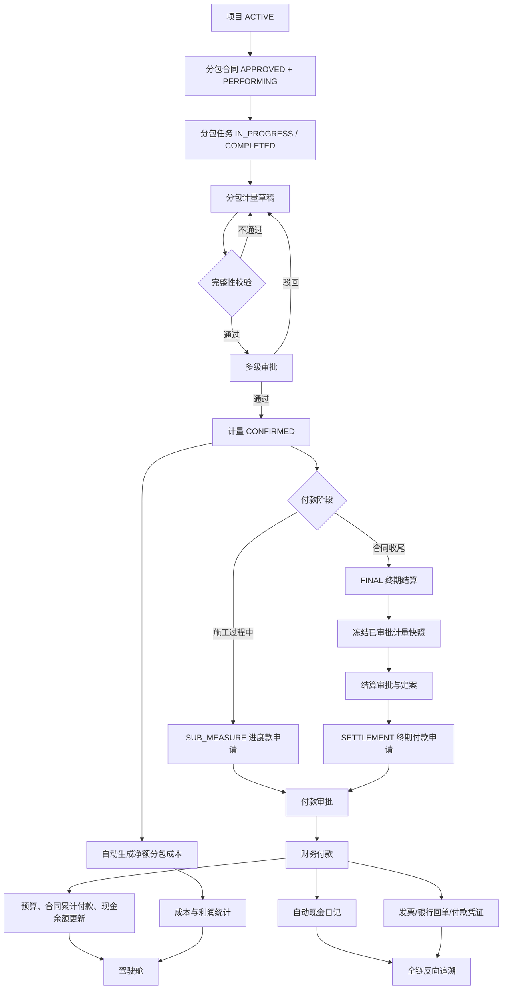
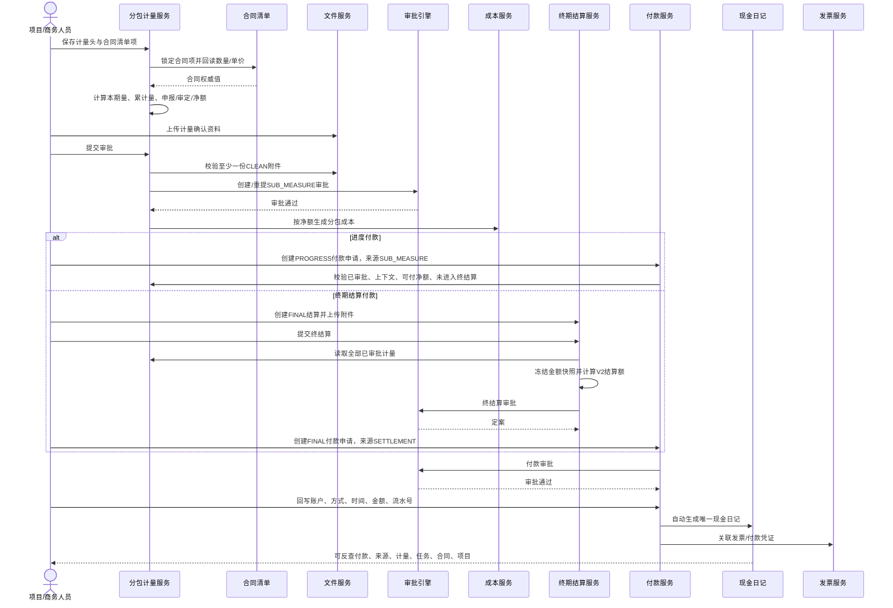
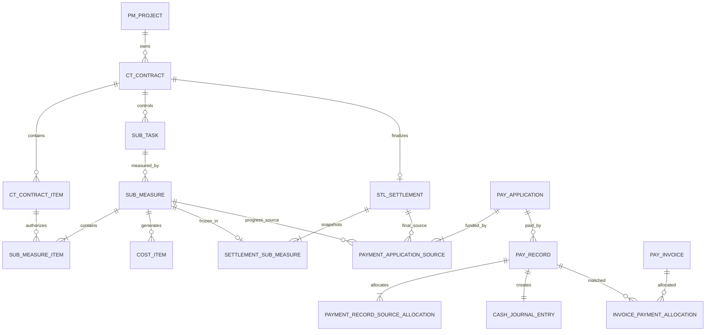

# CGC-PMS 分包履约与分包结算付款闭环业务标准

状态：P0 Implemented Candidate
基线日期：2026-07-16
适用范围：分包任务、分包计量、分包成本、终期结算、付款、现金、发票与经营统计
唯一标准：后续需求、接口、页面、迁移和测试若与本文冲突，必须先评审并修订本文

## 1. 目标与边界

### 1.1 唯一业务主线

项目 → 履约中分包合同 → 分包任务 → 分包计量明细 → 计量审批 → 分包成本 → 进度款申请/终期结算 → 付款审批 → 财务付款 → 现金日记 → 发票/凭证 → 驾驶舱。

任一现金支出必须可反查：付款记录、付款申请、付款来源、计量或终期结算、审批记录、分包任务、分包合同、分包商和项目。

### 1.2 两条合法付款路径

1. 进度付款：已审批分包计量 → `SUB_MEASURE` 付款来源 → `PROGRESS` 付款申请。
2. 终期付款：已审批计量汇总 → `FINAL` 终期结算 → `SETTLEMENT` 付款来源 → `FINAL` 付款申请。

终期结算提交后，其计量快照进入冻结状态，禁止再从同一计量发起新的进度付款。历史进度付款通过合同累计付款进入终期应付额计算，禁止重复付款。

### 1.3 非目标

- 不新增劳务实名制、考勤、工资代发、招采寻源或外部银行直联。
- 不把分包进度结算伪装成多个终期结算；一个合同只能有一个终期结算。
- 不人工补录现金日记，不以页面 ID 拼接替代数据库关系。
- 不物理删除已审批、已生成成本、已结算或已付款事实；纠错必须驳回、撤回、冲销或退款。

## 2. 当前业务完成度分析

| 节点 | 实施前 | P0结果 | 结论 |
| --- | --- | --- | --- |
| 分包任务 | 有实体、接口、页面和状态 | 计量提交强制关联可计量任务 | 闭环接入 |
| 分包计量 | 有CRUD和审批，但上下文、附件、明细弱校验 | 项目、合同、分包商、任务、期次、日期、明细、附件、金额强校验 | P0完成 |
| 合同清单计量 | 页面可录，服务端信任客户端单价/累计量 | 服务端回读合同数量、单价并计算累计量和金额 | P0完成 |
| 计量成本 | 审批后自动生成，但按申报明细总额入账 | 按净计量额比例分摊，末行吸收舍入差 | P0完成 |
| 终期结算 | 有唯一合同结算和审批，无计量物理快照 | 提交冻结全部已审批计量金额快照 | P0完成 |
| 结算金额 | 旧V1把合同额与已审批计量重复相加 | 新单采用V2：计量+签证-终期扣款，合同额仅作上限 | P0完成；历史不覆盖 |
| 进度付款来源 | 旧依据表支持，统一付款来源不支持 | `payment_application_source.sub_measure_id` 显式外键 | P0完成 |
| 重复付款控制 | 终期结算有额度，计量无统一额度 | 审批中/已审批申请并发占用计量净额 | P0完成 |
| 全链追溯 | 追到费用和结算，不能追到计量/任务 | 付款追溯返回终结算快照、计量和任务 | P0完成 |
| 前端录入 | 计量附件、扣款、终结算附件入口不足 | 计量保存后上传附件；结算详情上传；付款可选计量来源 | P0完成 |
| 自动测试 | 有模块测试，无跨域计量付款链 | 增加金额守恒、提交门禁、进度付款、重复付款、反向追溯测试 | P0完成 |

## 3. 业务流程图

## 4. 时序图

## 5. 数据关系与删除策略

| 关系 | 主外键/唯一约束 | 删除策略 |
| --- | --- | --- |
| 计量→任务/合同/项目/分包商 | 业务提交门禁；租户与上下文必须一致 | 草稿可软删；审批后禁止删 |
| 计量明细→合同清单项 | `contract_item_id`；同计量内不可重复 | 草稿替换；审批后不可变 |
| 结算→计量快照 | `settlement_sub_measure` 双外键；同一计量只能进入一个终结算 | RESTRICT；终结算草稿删除先删快照 |
| 付款来源→计量 | `sub_measure_id` 外键与CHECK约束 | RESTRICT；仅付款草稿可替换来源 |
| 付款来源→终结算 | `settlement_id` 外键与CHECK约束 | RESTRICT |
| 付款→现金日记 | 每个有效付款记录唯一现金日记 | 不删；采用冲销事实 |
| 付款→发票 | 分配表支持一付多票/一票多付 | 不级联删除财务事实 |

## 6. 生命周期与状态机

### 6.1 分包任务

`NOT_STARTED → IN_PROGRESS → COMPLETED`；`IN_PROGRESS ↔ SUSPENDED`。仅 `IN_PROGRESS`、`COMPLETED` 可形成计量。

### 6.2 分包计量

`DRAFT → APPROVING → APPROVED/CONFIRMED`；驳回为 `REJECTED`，修订后可重新提交；撤回回到 `DRAFT`。审批中和审批后，头、明细和附件不可修改。

### 6.3 终期结算

`DRAFT → APPROVING → APPROVED/FINALIZED`；驳回为 `REJECTED`，允许修订和重提。`FINALIZED` 永久只读并回写合同结算金额。

### 6.4 付款

`DRAFT → APPROVING → APPROVED → PARTIALLY_PAID/PAID`；驳回释放来源额度和预算占用。付款成功生成付款来源分摊、现金日记和会计凭证；冲销反向恢复来源额度、预算和现金事实。

## 7. 节点业务规格

| 节点 | 输入/输出 | 前置/后置 | 核心规则与校验 | 异常处理 | 权限、日志、审计 |
| --- | --- | --- | --- | --- | --- |
| 项目 | 输入项目；输出ACTIVE项目 | 已审批预算；允许履约 | 非ACTIVE禁止计量、结算和付款 | `PROJECT_NOT_ACTIVE`，不写数据 | 项目数据范围；记录状态变更原因 |
| 分包合同 | 合同、清单、乙方；输出履约基线 | APPROVED+PERFORMING | 类型仅SUB/SUBCONTRACT；乙方即付款对象 | 关闭/终止/跨项目拒绝 | 合同权限；审批和变更留痕 |
| 分包任务 | 计划、区域、日期；输出履约任务 | 同项目合同分包商 | 仅可计量状态可绑定；上下文一致 | 暂停或未开工拒绝 | `subcontract:task:*`；状态审计 |
| 分包计量草稿 | 期次、日期、任务、清单项、数量、扣款、附件 | 合同履约中 | 单价/合同量服务器回读；累计量≤合同量；明细≤200 | 任一明细失败整单不替换 | `subcontract:measure:add/edit`；操作审计 |
| 计量提交 | 完整草稿；输出审批实例 | CLEAN附件、正净额 | 项目/合同/分包商/任务/期次/日期/明细/金额全部完整 | 重复提交、附件缺失、金额不守恒fail-close | `subcontract:measure:submit`；审批记录 |
| 计量审批 | 审批意见；输出CONFIRMED计量 | 多级审批任务 | 驳回可重提；批准回调必须与成本生成同事务 | 成本生成失败则审批回滚 | 审批人、节点、时间、意见全留痕 |
| 成本生成 | 已审批计量；输出CostItem | 明细总额、净额有效 | 每项按净额比例分摊；末行吸收分；合计=netAmount；幂等唯一 | 金额不守恒阻断审批 | 来源固定SUB_MEASURE+sourceItemId |
| 终期结算 | 合同、终期扣款、附件；输出快照与结算额 | 无待审计量/变更；至少一笔已审批计量 | V2=已审批计量+已确认签证-终期扣款；≤合同当前额+签证；历史V1不覆盖 | 超合同、超付、附件缺失、待审批事项拒绝 | `settlement:*`；定案和公式版本审计 |
| 进度付款申请 | SUB_MEASURE、金额、预算、附件 | 计量APPROVED/CONFIRMED | payType=PROGRESS、category=SUBCONTRACT；合计≤净额-其他有效占用 | 计量进入终结算或重复占用拒绝 | `payment:application:*`；来源显式FK |
| 终期付款申请 | SETTLEMENT、金额、预算、附件 | 结算APPROVED/FINALIZED | payType=FINAL；合计≤final-paid-其他有效占用 | 未定案、对象不一致、余额不足拒绝 | 同上 |
| 财务付款 | 账户、方式、精确时间、金额、流水号 | 付款申请APPROVED | 外部流水幂等；不得超审批/来源余额 | 重复付款、余额不足或并发冲突整事务回滚 | 财务权限；付款与冲销审计 |
| 现金/发票/驾驶舱 | 付款事实、发票分配；输出现金与统计 | 成功付款 | 日记自动唯一生成；发票按付款分配；统计只读事实表 | 失败不允许人工补同一日记 | 查询权限；文件安全扫描和归档审计 |

## 8. 验收标准

### 8.1 分包计量

- [ ] 必须绑定ACTIVE项目、已审批履约中分包合同、合同乙方和可计量任务。
- [ ] 必须填写期次、日期，至少一条合同清单明细和一份CLEAN附件。
- [ ] 清单名称、单位、合同量和单价以服务端合同项为准。
- [ ] 同一计量不得重复清单项；本期量大于0；累计量不得超过合同量。
- [ ] 申报额等于明细合计；审定额不超过申报额；净额=审定额-扣款且大于0。
- [ ] 驳回后可修改和重提；审批中、已审批及已生成成本数据不可修改或删除。

### 8.2 分包成本

- [ ] 仅审批通过回调生成成本，来源为SUB_MEASURE。
- [ ] 成本明细合计必须精确等于计量净额。
- [ ] 重复审批回调不得重复生成成本。
- [ ] 成本生成失败必须回滚计量审批结果。

### 8.3 终期结算

- [ ] 一个分包合同仅一个终期结算，类型固定FINAL。
- [ ] 必须至少有一笔已审批计量且不存在待审计量/成本向签证。
- [ ] 必须上传CLEAN结算附件。
- [ ] 提交时逐笔冻结申报、审定、扣款、净额快照。
- [ ] 新单公式固定为 `APPROVED_MEASURE_VARIATION_DEDUCTION_V2`。
- [ ] 结算额不得超过合同履约上限；累计付款超应付时必须先冲销/退款核对。
- [ ] 定案后不可修改、删除或补换附件。

### 8.4 付款与追溯

- [ ] 进度款只允许SUB_MEASURE+PROGRESS+SUBCONTRACT组合。
- [ ] 终期款只允许SETTLEMENT+FINAL组合。
- [ ] 付款申请金额必须等于来源金额合计，来源项目、合同、付款对象必须一致。
- [ ] 审批中和已审批申请共同占用来源额度；余额不足和重复付款必须拒绝。
- [ ] 同一计量进入终期结算审批后不得新增进度付款。
- [ ] 付款成功自动生成来源分摊、现金日记和会计事实；冲销必须完整恢复。
- [ ] 从现金日记或付款记录必须反查到计量、任务、终期结算快照、合同、项目及审批记录。

## 9. 自动化测试方案

| 编号 | 场景 | 预期 |
| --- | --- | --- |
| SM-N01 | 完整计量提交 | 进入APPROVING并生成审批待办 |
| SM-E01 | 缺项目/合同/分包商/任务 | 提交拒绝，状态仍可编辑 |
| SM-E02 | 缺附件或扫描非CLEAN | 提交拒绝 |
| SM-E03 | 空明细、重复清单项、0数量 | 保存/提交拒绝 |
| SM-B01 | 本期量使累计量等于合同量 | 允许 |
| SM-B02 | 累计量超过合同量0.0001 | 拒绝且原明细不被替换 |
| SM-E04 | 项目暂停、合同关闭、任务暂停 | 提交拒绝 |
| SM-R01 | 审批驳回后修订重提 | 复用审批实例新轮次，记录完整 |
| COST-N01 | 100申报、95审定、5扣款 | 成本合计90 |
| COST-B01 | 多行比例产生分币差 | 末行吸收，合计精确守恒 |
| STL-N01 | 已审批计量+附件提交终结算 | 生成逐笔快照并进入审批 |
| STL-E01 | 有待审计量/变更 | 拒绝提交 |
| STL-E02 | 无已审批计量、超合同或累计超付 | 拒绝提交 |
| STL-R01 | 驳回、修改、重新提交 | 快照重建，旧轮次保留 |
| PAY-N01 | 已审批计量发起进度款并付款 | 来源实付、预算、现金同步更新 |
| PAY-E01 | 未审批计量、对象不一致、错误付款类型 | 拒绝 |
| PAY-E02 | 两申请累计超过计量净额 | 后提交者拒绝 |
| PAY-E03 | 终结算提交后再发计量进度款 | 拒绝 |
| PAY-E04 | 重复外部流水/重复付款 | 幂等或拒绝，不产生第二现金日记 |
| PAY-R01 | 付款冲销 | 来源已付、预算、合同累计付款、现金和凭证反向恢复 |
| TRACE-N01 | 从现金日记查询 | 返回付款、审批、来源、计量/结算、任务、合同、项目 |
| ISO-E01 | 跨租户或无项目数据权限 | 404/403语义，不泄露对象 |

## 10. 开发路线图

### P0（本闭环上线必需）

- 计量提交完整性门禁、合同清单权威计算、累计量上限。
- 净计量成本金额守恒。
- 终期结算计量快照和V2金额口径。
- SUB_MEASURE统一付款来源、额度占用、重复付款与终结算锁定。
- 付款到现金、发票、预算和全链追溯。
- MySQL/H2镜像迁移、前后端类型和自动测试。

### P1（建议完成）

- 审批节点内结构化录入审定数量、审定单价和扣款原因，而非仅在草稿阶段维护。
- 终期超付的退款/应收分包商业务单据，使超付核对不依赖先手工冲销。
- 付款来源改为业务单据选择器，展示可付余额，不要求用户输入ID。
- 分包合同清单变更后对未提交计量进行失效提示。

### P2（优化）

- 计量附件OCR、清单导入与差异比对。
- 分包履约偏差、计量滞后、超量趋势和保修金到期预警。
- 终结算快照差异可视化。

### P3（未来版本）

- 劳务实名制、工资代发、银行直联、电子签章与外部分包商协同门户。

## 11. 风险与上线要求

1. V184变更付款来源CHECK约束；上线前必须在生产副本执行迁移演练并核查非法旧来源行。
2. V2只用于新建/重算草稿；历史已定案V1结算不得直接覆盖，必须先导出差异预览并由财务、商务共同确认。
3. 新门禁要求计量和结算附件为CLEAN；文件扫描服务不可用时提交会fail-close。
4. 旧计量缺任务、明细或附件时保持可查询，不自动伪造；需修订后才能进入新审批轮次。
5. 上线必须通过：MySQL/H2双数据库迁移、后端全量测试、前端type-check/lint/unit、目标浏览器验收和当前提交CI。

## 12. 实现映射

- 数据迁移：`V184__subcontract_performance_settlement_payment_closed_loop.sql`。
- 计量门禁：`SubMeasureIntegrityService`、`SubMeasureService`。
- 成本守恒：`SubMeasureCostStrategy`。
- 终结算快照：`SettlementSubMeasure`、`StlSettlementWriteService`。
- 统一付款来源：`PaymentApplicationSourceService`、`PaymentApplicationSourceMapper`。
- 反向追溯：`PaymentTraceService`、`PaymentTraceVO`。
- 前端入口：分包计量、终期结算详情、付款申请与付款追溯页面。
