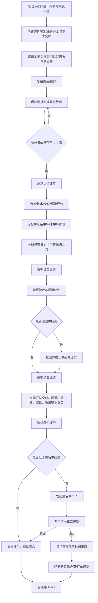
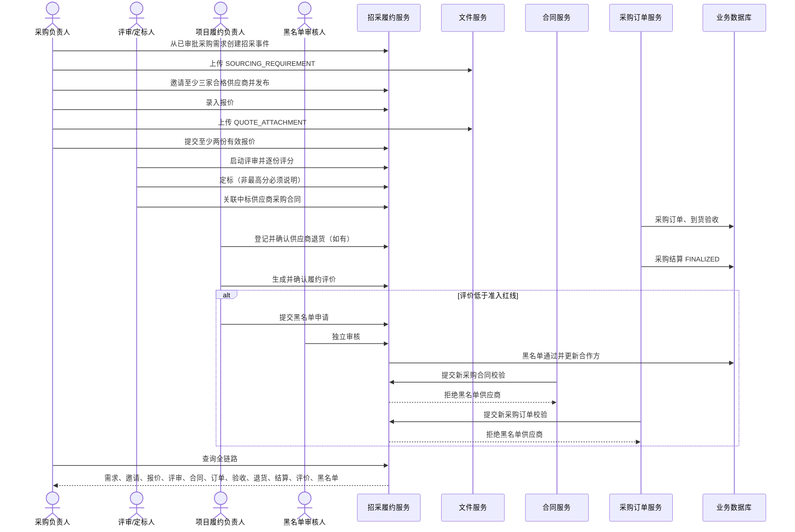
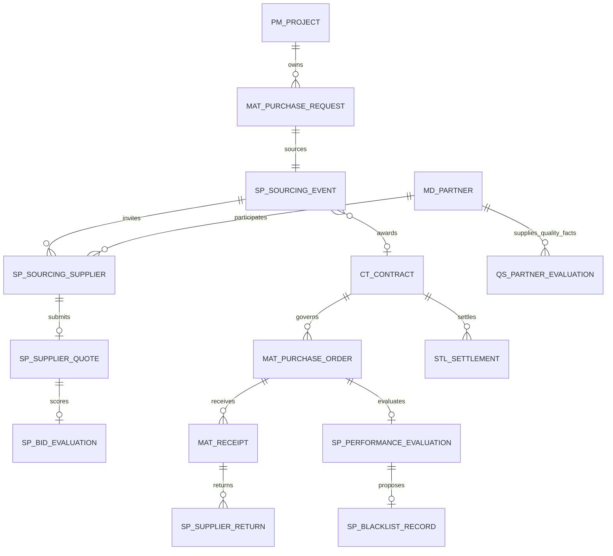

# CGC-PMS 供应商招采与履约评价闭环业务标准

## 1. 目标与适用边界

本标准建立 CGC-PMS 中唯一有效的供应商招采与履约评价主线：

> 已审批采购需求 → 询价/招标 → 合格供应商邀请 → 报价与附件 → 比价评审 → 定标 → 采购合同 → 采购订单 → 到货验收 → 供应商退货 → 采购结算 → 履约评价 → 黑名单审批 → 后续准入阻断 → 全链路追溯。

适用于总承包项目的材料、设备等供应商选择及采购履约治理。任何定标、供应商退货、履约评分和黑名单决定，都必须反向追溯到项目、采购需求、招采事件、报价、评审、合同、订单、验收及结算事实。

P0 不建设供应商门户、电子投标文件加密、评标专家随机抽取、电子签章、外部征信、价格指数库、框架协议、黑名单解除/申诉或跨法人共享。供应商报价由具备权限的采购人员代录并上传原始报价附件；系统保留录入和审计责任。

## 2. 当前业务完成度分析

### 2.1 实施前源码事实

| 节点 | 实施前状态 | 主要缺口 |
| --- | --- | --- |
| 采购需求 | 已实现 | 已有审批状态，但不能进入受控询价/招标 |
| 询价/招标 | 缺失 | 无事件、邀请、截止时间、发布门禁 |
| 报价/比价 | 缺失 | 无报价附件、报价状态、量化评分和定标依据 |
| 采购合同/订单 | 已实现 | 无定标来源；黑名单未阻断提交 |
| 到货验收 | 已实现 | 可形成质量事实，但未汇总到供应商评价 |
| 供应商退货 | 缺失 | `mat_material_return` 是领料退库，不能代表向供应商退货 |
| 采购结算 | 已实现 | 未作为终期履约评价前置条件 |
| 履约评价 | 页面数据片段 | 无不可变评价、事实快照和计算规则 |
| 黑名单 | 仅合作方字段 | 无申请、独立审核、依据和准入联动 |
| 全链路追溯 | 缺失 | 不能从黑名单或评价反查招采与采购事实 |

### 2.2 P0 实施后的完成度

| 节点 | 实现载体 | 状态 |
| --- | --- | --- |
| 招采事件与邀请 | `sp_sourcing_event`、`sp_sourcing_supplier`、事件 API/工作台 | 已实现 |
| 报价与证据 | `sp_supplier_quote`、`QUOTE_ATTACHMENT` | 已实现 |
| 比价评审与定标 | `sp_bid_evaluation`、定标 CAS 状态 | 已实现 |
| 合同来源 | 招采事件 `contract_id` 与采购合同一致性校验 | 已实现 |
| 供应商退货 | `sp_supplier_return`，验收/订单/合同/供应商全关联 | 已实现 |
| 履约评价 | `sp_performance_evaluation` 事实快照和自动评分 | 已实现 |
| 黑名单审批 | `sp_blacklist_record`、独立审核、合作方状态联动 | 已实现 |
| 后续准入 | 采购合同、采购订单提交服务端阻断 | 已实现 |
| 文件、权限与审计 | 阶段文件授权、七组权限、审计注解 | 已实现 |
| Trace | 招采事件聚合全部采购、履约、质量安全和黑名单事实 | 已实现 |

## 3. 业务流程





## 4. ER 关系、主外键与删除策略



| 实体 | 主键 | 关键外键 | 唯一约束 | 删除策略 |
| --- | --- | --- | --- | --- |
| `sp_sourcing_event` | `id` | 项目、采购需求、中标报价/供应商、合同 | 需求一对一招采；编号租户内唯一 | 全部 RESTRICT；历史不物理删除 |
| `sp_sourcing_supplier` | `id` | 招采事件、合作方 | 事件+供应商唯一 | RESTRICT |
| `sp_supplier_quote` | `id` | 事件、邀请、供应商 | 事件+供应商一份报价；报价编号唯一 | RESTRICT；提交后不可改写 |
| `sp_bid_evaluation` | `id` | 事件、报价、供应商 | 每份报价一份评审 | RESTRICT；只追加不覆盖 |
| `sp_supplier_return` | `id` | 项目、供应商、合同、订单、验收单 | 退货编号唯一 | RESTRICT；确认后不可变 |
| `sp_performance_evaluation` | `id` | 项目、供应商、合同、订单 | 每个订单一份终期评价 | RESTRICT；确认后不可变 |
| `sp_blacklist_record` | `id` | 履约评价、供应商、项目 | 每份评价最多一份申请 | RESTRICT；审核历史保留 |

所有表包含 `tenant_id`、创建/更新审计列和逻辑删除标识；业务查询必须同时满足租户和项目数据范围。已发布、已提交、已定标、已确认和已审核事实禁止物理删除。

## 5. 生命周期与状态流转

### 5.1 招采事件

```text
DRAFT → PUBLISHED → EVALUATING → AWARDED → CONTRACTED
```

- `DRAFT`：维护邀请名单和需求文件。
- `PUBLISHED`：邀请名单锁定，允许报价或放弃。
- `EVALUATING`：报价锁定，允许评审。
- `AWARDED`：中标结果锁定，等待采购合同。
- `CONTRACTED`：合同来源闭合。
- `CANCELLED` 为保留状态，P0 不开放已发布事件取消或重新招标。

### 5.2 邀请、报价与评审

```text
邀请：PENDING → INVITED → QUOTED
                   └────→ DECLINED
报价：DRAFT → SUBMITTED → WINNER
                       └→ LOST
评审：创建即为不可变评分事实
```

### 5.3 供应商退货、履约评价与黑名单

```text
供应商退货：DRAFT → CONFIRMED
履约评价：DRAFT → CONFIRMED
黑名单：DRAFT → SUBMITTED → APPROVED
                         └→ REJECTED
```

确认和审核均使用条件更新与唯一约束，重复请求不产生第二条事实，也不覆盖历史。

## 6. 节点业务规格

| 节点 | 输入/输出 | 前置/后置 | 业务规则与异常 | 校验 | 权限 | 日志与审计 |
| --- | --- | --- | --- | --- | --- | --- |
| 创建招采 | 项目、需求、编号、方式、截止时间、币种 → 草稿事件 | 项目 ACTIVE、需求 APPROVED → 可邀请 | 同一需求仅一场 P0 招采；编号冲突拒绝 | 租户、项目、状态、截止时间 | `sourcing:maintain` | CREATE，记录操作者和时间 |
| 邀请供应商 | 合作方 ID 集合 → 邀请记录 | 事件 DRAFT → 待发布 | 至少三家；仅 SUPPLIER、ENABLE、非黑名单；重复邀请拒绝 | 合作方租户/类型/状态 | `sourcing:maintain` | INVITE，全量留痕 |
| 发布 | 事件 ID、需求附件 → PUBLISHED | DRAFT、三家合格供应商、CLEAN 文件 | 不满足门禁禁止推进；并发失败提示刷新 | `SOURCING_REQUIREMENT` | `sourcing:maintain` | PUBLISH |
| 报价/放弃 | 报价金额、税率、交期、有效期、条款、附件 → SUBMITTED；或放弃记录 | PUBLISHED 且被邀请 | 每家一份；金额>0；有效期不早于截止日；放弃保留原因 | `QUOTE_ATTACHMENT` CLEAN | `sourcing:quote` | CREATE/SUBMIT/DECLINE |
| 启动评审 | 事件 ID → EVALUATING | 至少两份提交报价 | 进入评审后禁止新增/修改报价 | 有效报价数量、事件状态 | `sourcing:evaluate` | START_EVALUATION |
| 比价评审 | 四维评分、意见 → 综合分 | EVALUATING、报价 SUBMITTED | 各项 0—100；一报价一评审；综合分按固定权重计算 | 数值范围、唯一约束 | `sourcing:evaluate` | EVALUATE，评审人/时间 |
| 定标 | 报价、依据 → AWARDED | 所有有效报价已评分 | 中标报价属于本事件；非最高分中标必须给出充分依据；其他报价 LOST | 状态 CAS、关联一致性 | `sourcing:award` | AWARD，不覆盖评审 |
| 关联合同 | 采购合同 → CONTRACTED | AWARDED | 合同项目一致、乙方=中标供应商、类型 PURCHASE、审批通过且 PERFORMING | 租户/项目/合作方/状态 | `sourcing:award` | LINK_CONTRACT |
| 采购订单 | 合同、供应商、日期、明细 → 审批中 | 采购合同 PERFORMING | 合同类型 PURCHASE；供应商 ENABLE 且非黑名单；项目和乙方一致 | 商业明细、金额、日期 | 原采购订单权限 | 既有审批审计 |
| 到货验收 | 订单、到货数量、质量状态 → APPROVED 验收事实 | 已审批订单 | 评价只采信 APPROVED 验收；必须完成全部订单数量 | 订单明细与验收明细累计 | 原验收权限 | 既有审批审计 |
| 供应商退货 | 验收、编号、日期、数量、金额、原因 → 退货事实 | 已审批验收且绑定订单/合同/供应商 | 日期不得早于验收；确认后不可修改；不得混用领料退库 | 数量>0、金额≥0、编号唯一 | `performance:evaluate` | CREATE/CONFIRM |
| 采购结算 | 合同结算 → FINALIZED | 合同履约完成 | 无终结结算不得生成终期履约评价 | 状态、合同一致性 | 原结算权限 | 既有审批审计 |
| 履约评价 | 订单、服务分、意见 → 事实快照和总分 | 全部验收、终结结算、定标合同来源 | 交付30%、质量35%、服务15%、商务20%；退货/扣减降低商务分；质量安全事实参与质量分 | 订单唯一、事实存在、0—100 | `performance:evaluate` | CREATE/CONFIRM |
| 黑名单 | 已确认评价、原因、审核决定/意见 → 供应商黑名单状态 | 评价触发红线 | 申请人与审核人职责分离；仅低分评价可申请；重复审核拒绝 | 状态、操作者、合作方 | 申请复用评价权限；审核 `blacklist:review` | CREATE/SUBMIT/REVIEW |
| Trace | 招采事件 ID → 全链聚合 | 项目可访问 | 只读，不补造事实；缺失节点原样暴露 | 租户、项目范围 | `sourcing:query` | 查询日志 |

## 7. 评分、异常和一致性原则

1. 评审综合分使用商务、技术、交付、质量四维固定权重，由服务端计算，客户端不得提交总分。
2. 履约综合分：交付 30%、质量 35%、服务 15%、商务 20%；分值统一保留两位小数。
3. 交付分由订单交期与最后验收日期计算；质量分由验收质量及同期质量安全评价计算；商务分由已确认供应商退货和结算扣减计算。
4. 综合分或质量分低于 60 时产生黑名单建议，但不会自动拉黑，必须独立审核。
5. 所有跨租户对象按不存在处理；项目无权访问时拒绝，不泄露对象详情。
6. 文件缺失、病毒扫描非 CLEAN、文件业务类型或阶段错误时禁止提交。
7. 状态不匹配、重复提交、重复定标、重复确认和并发更新一律 fail-close。
8. 黑名单审核、合作方标识更新必须在同一事务内完成；失败全部回滚。
9. 黑名单生效后，既有历史仍可查询；新采购合同和采购订单提交立即被服务端拒绝。
10. `mat_material_return` 仅表示领料退库，不得用于供应商履约扣分；供应商退货唯一事实为 `sp_supplier_return`。

## 8. 权限矩阵

| 权限码 | 典型角色 | 能力 |
| --- | --- | --- |
| `supplier:sourcing:query` | 项目经理、采购、成本、审计 | 查询台账和 Trace |
| `supplier:sourcing:maintain` | 采购负责人 | 创建事件、邀请、发布 |
| `supplier:sourcing:quote` | 采购经办 | 代录报价、附件、放弃 |
| `supplier:sourcing:evaluate` | 评审人 | 启动评审、四维评分 |
| `supplier:sourcing:award` | 定标授权人 | 定标、关联合同 |
| `supplier:performance:evaluate` | 项目/采购履约负责人 | 供应商退货、履约评价、黑名单申请 |
| `supplier:blacklist:review` | 独立审核人 | 黑名单通过或驳回 |

前端按钮控制不是安全边界；后端权限、租户、项目范围、状态、职责分离和数据库约束共同构成真实门禁。

## 9. 验收标准

### 【采购需求与招采创建】

- ✓ 必须绑定 ACTIVE 项目和已审批采购需求。
- ✓ 同一采购需求 P0 只允许一个招采事件。
- ✓ 截止时间必须晚于当前时间。
- ✓ 招采方式仅允许询价或招标。

### 【邀请与发布】

- ✓ 发布前至少三家启用、非黑名单供应商。
- ✓ 禁止邀请非供应商、停用供应商或黑名单供应商。
- ✓ 必须上传病毒扫描 CLEAN 的需求/招标文件。
- ✓ 发布后禁止修改邀请名单和需求文件。

### 【报价与评审】

- ✓ 只有受邀供应商可以报价；每家最多一份报价。
- ✓ 报价金额大于零，有效期不早于截止日，报价附件必传。
- ✓ 至少两份有效报价才可启动评审。
- ✓ 每份报价必须完成四维评分和意见。
- ✓ 非最高综合分中标必须保留充分定标依据。

### 【合同与采购订单】

- ✓ 合同必须与项目、中标供应商一致。
- ✓ 合同必须为审批通过、执行中的 PURCHASE 合同。
- ✓ 采购订单必须关联采购合同、供应商和完整明细。
- ✓ 黑名单或停用供应商禁止提交采购合同和采购订单。

### 【验收与供应商退货】

- ✓ 履约评价只采信已审批验收单。
- ✓ 供应商退货必须绑定已审批验收单、订单、合同和供应商。
- ✓ 退货数量必须大于零，日期不得早于验收日期。
- ✓ 退货确认后禁止修改或重复确认。
- ✓ 领料退库不得冒充供应商退货。

### 【履约评价】

- ✓ 订单全部数量已验收且合同已终结结算后才能生成。
- ✓ 系统自动取交付、验收质量、已确认退货、结算扣减和质量安全事实。
- ✓ 同一订单只能生成一份终期评价。
- ✓ 服务分和意见必须填写；总分、等级、黑名单建议由服务端计算。
- ✓ 已确认评价不可修改、删除或重复确认。

### 【黑名单与追溯】

- ✓ 仅已确认且触发红线的评价可发起黑名单申请。
- ✓ 申请人不得审核本人申请。
- ✓ 审核意见必填；审核通过和合作方黑名单状态事务一致。
- ✓ 审核通过后新合同、订单提交立即阻断。
- ✓ Trace 必须完整返回需求、邀请、报价、评审、合同、订单、验收、退货、结算、评价、黑名单和质量安全事实。

## 10. 测试方案

| 类型 | 场景 | 预期 |
| --- | --- | --- |
| 正常 | 3 家邀请、2 家报价、1 家放弃、完成评审定标和合同关联 | 状态顺序正确，全部事实可追溯 |
| 正常 | 到货不合格、供应商退货、结算终结、低分评价、独立审核拉黑 | 退货计入评分，黑名单生效，准入被阻断 |
| 异常 | 少于 3 家发布 | `SP_SUPPLIERS_INSUFFICIENT` |
| 异常 | 缺需求或报价附件 | 禁止发布/提交 |
| 异常 | 少于 2 份报价启动评审 | 禁止进入评审 |
| 异常 | 黑名单、停用或非供应商参与 | 邀请/合同/订单提交拒绝 |
| 异常 | 合同项目或乙方与中标结果不一致 | 禁止关联合同 |
| 异常 | 供应商退货日期早于验收 | `SP_RETURN_DATE_INVALID` |
| 异常 | 未完成验收或无终结结算生成评价 | 禁止生成 |
| 异常 | 申请人审核本人黑名单 | 职责分离拒绝 |
| 边界 | 评分 0、60、100；金额 0.01；交期 0 天 | 按边界接受并准确分级 |
| 幂等 | 重复报价、评审、定标、退货确认、评价确认、黑名单审核 | 无重复事实，不覆盖历史 |
| 并发 | 两人同时定标/确认/审核 | 仅一次成功，另一请求提示刷新 |
| 隔离 | 跨租户/无项目权限读取或写入 | 拒绝且不泄露数据 |
| 状态 | 项目暂停/关闭后新建招采 | 禁止创建 |
| 回归 | 原合同审批、采购订单审批 | 非采购流程不受影响；采购流程使用真实采购夹具 |
| 前端 | API 契约、路由权限、页面关键链路、类型、lint | 全部通过 |

自动化最低集：`SupplierSourcingClosedLoopIntegrationTest`、`MatPurchaseOrderServiceTest`、`CtContractServiceTest`、`ContractApprovalIntegrationTest`、前端招采 API/页面/路由测试。数据库必须同时验证 H2 和 MySQL Flyway 迁移。

## 11. 开发路线图

### P0（本闭环必须完成）

- 招采事件、邀请、报价、比价评审、定标、合同来源。
- 供应商退货独立事实、履约评价、黑名单独立审核和准入阻断。
- 阶段附件、权限、审计、租户/项目隔离、Trace 和自动化测试。

### P1（建议完成）

- 正式重新招标/废标/撤标流程及审批，允许保留多轮招采历史。
- 供应商门户自助报价、澄清答疑和报价回执。
- 黑名单解除、申诉、有效期和集团/法人适用范围。
- 订单级退货明细、换货、补货和退货冲减结算联动。

### P2（优化）

- 供应商分类分级、品类准入和动态合格名录。
- 历史价格、交付稳定性、质量趋势和风险预警。
- 可配置评审/履约权重、不同品类评分模板。

### P3（未来版本）

- 电子招投标、密封报价、专家库和电子签章。
- 外部征信、工商/司法风险、ESG 和集团级供应商协同。
- AI 价格异常识别和供应风险预测，但不得替代人工定标与审计责任。

## 12. 风险与上线检查

1. **存量合作方分类风险**：老数据可能仍为 `PARTY_B/OTHER`；上线前必须盘点采购合同乙方并完成供应商类型治理，不得在代码中放宽类型门禁。
2. **迁移风险**：V189 新增外键、约束和权限；必须执行 MySQL Flyway smoke，确认字符集、CHECK 和菜单主键无冲突。
3. **职责分离风险**：管理员虽可操作全部动作，正式生产仍应通过角色分配确保采购、评审、定标、黑名单审核相互制衡。
4. **附件真实性风险**：P0 校验文件存在且扫描安全，不校验电子签章或报价文件内容真实性，审计责任仍属于上传人。
5. **评价时点风险**：当前是一订单一份终期评价；分期评价、年度复评和集团汇总不在 P0。
6. **准入切换风险**：黑名单通过立即阻断新提交，但不自动撤销已审批合同/订单；存量处置必须走合同与采购变更流程。
7. **回滚原则**：仅回滚应用版本，不删除已产生业务事实；若需停用新入口，应保留 Trace 查询和准入校验。

## 13. 唯一事实口径

- 招采来源：`sp_sourcing_event`。
- 原始报价：`sp_supplier_quote` + `SUPPLIER_QUOTE/QUOTE_ATTACHMENT`。
- 定标依据：`sp_bid_evaluation` + 招采事件中标字段。
- 向供应商退货：仅 `sp_supplier_return`；`mat_material_return` 是领料退库。
- 终期履约评价：`sp_performance_evaluation`。
- 黑名单决策：`sp_blacklist_record`；`md_partner.blacklist_flag` 是当前生效快照，不替代审批历史。
- 全链路入口：`GET /supplier-sourcing/events/{id}/trace`。

任何页面统计、驾驶舱或后续智能分析必须从上述事实聚合，不得维护第二套手工数字。
