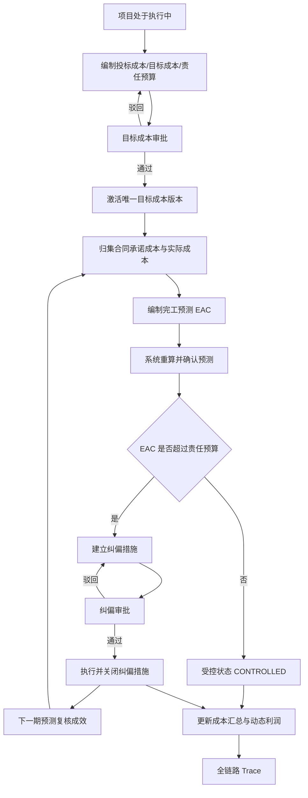
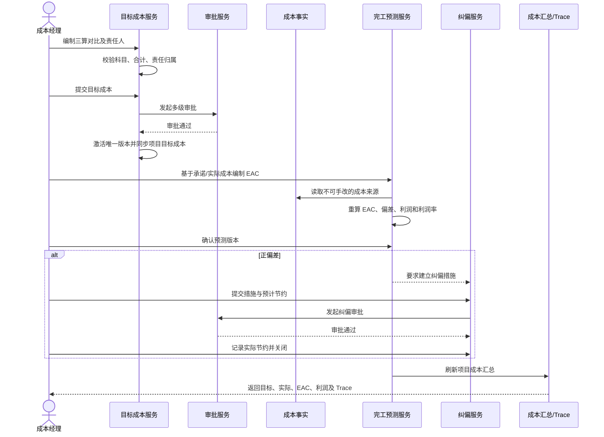
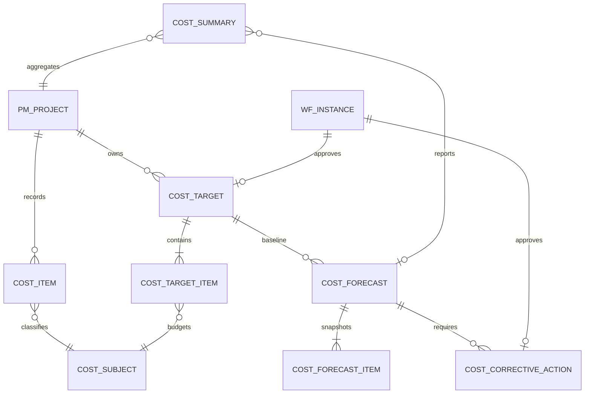

# CGC-PMS 目标成本与动态利润闭环业务标准

## 1. 目标与边界

本标准建立“投标成本 → 目标成本 → 责任预算 → 承诺成本/实际成本 → 完工预测（EAC）→ 偏差纠偏 → 动态利润”的唯一业务主线。任何项目利润必须能够反查到生效目标成本版本、成本事实、预测版本及纠偏审批。

P0 只解决成本控制与利润预测闭环，不扩展财务关账、资金预测、采购招标、BIM 量算或驾驶舱整体改版。

## 2. 业务流程

## 3. 数据关系

### 3.1 主外键及唯一性

| 实体 | 主关系 | 关键约束 |
|---|---|---|
| Project | 闭环根实体 | 仅 ACTIVE 项目可编制、提交和确认 |
| CostTarget | project_id、approval_instance_id | 项目同一时刻仅一个 ACTIVE；版本唯一 |
| CostTargetItem | cost_target_id、cost_subject_id、responsible_user_id | 同版本科目唯一；三算金额非负 |
| CostForecast | project_id、cost_target_id | 版本唯一；仅一个最新 CONFIRMED/ACTION_REQUIRED/CONTROLLED |
| CostForecastItem | cost_forecast_id、cost_subject_id | 科目唯一；冻结承诺、实际和剩余预测快照 |
| CostCorrectiveAction | cost_forecast_id、responsible_user_id、approval_instance_id | 措施编号唯一；预计节约总额不得超过正偏差 |
| CostSummary | project_id、cost_subject_id、cost_forecast_id | 项目+科目唯一；只由服务重算 |

金额字段使用 `DECIMAL(18,2)`，金额运算在服务端执行；租户、项目、逻辑删除条件必须同时生效。

### 3.2 生命周期与删除策略

- 目标成本：`DRAFT/REJECTED → PENDING → APPROVED → ACTIVE → INACTIVE`。审批中及生效后禁止修改和删除；新版本激活时旧版本失效，但不得物理删除。
- 完工预测：`DRAFT → CONFIRMED → ACTION_REQUIRED/CONTROLLED → SUPERSEDED`。确认后形成不可改快照，只能新建下一版本。
- 纠偏措施：`DRAFT/REJECTED → PENDING → APPROVED → CLOSED`。审批和关闭均留痕；不得回退或物理删除。
- 成本事实、成本汇总、审批记录和 Trace 不允许业务物理删除；历史错误通过冲销或新版本纠正。

## 4. 核心口径与状态规则

- `EAC = 已发生成本 + 预计剩余成本`。
- `成本偏差 = EAC - 责任预算`；大于 0 表示预计超支。
- `动态利润 = 已审批主合同收入 - EAC`。
- `动态利润率 = 动态利润 / 已审批主合同收入`；收入为 0 时利润率为 0。
- 承诺成本来源于已锁定合同等受控成本事实；实际成本来源于已确认且未冲销的成本事实，前端不得传入覆盖。
- 预测必须完整覆盖生效目标版本及已有成本事实涉及的全部科目；存在未分类成本时禁止确认。
- 上一期存在正偏差且未建立、审批并关闭纠偏措施时，禁止确认下一期预测。

## 5. 节点业务契约

### 5.1 项目准入

| 项目 | 要求 |
|---|---|
| 输入/输出 | 项目 ID；输出项目可控状态 |
| 前置/后置 | 项目存在、租户可见且 ACTIVE；允许进入成本编制 |
| 规则/校验 | 暂停、关闭、归档项目禁止新增、提交、确认 |
| 异常 | 不存在按不可见处理；状态不符明确拒绝且不写数据 |
| 权限/日志/审计 | 项目数据范围；记录访问主体、租户、项目和拒绝原因 |

### 5.2 三算编制

| 项目 | 要求 |
|---|---|
| 输入/输出 | 科目、投标成本、目标成本、责任预算、责任人/单位；输出草稿版本 |
| 前置/后置 | 项目可用、科目启用；形成可提交的责任矩阵 |
| 规则/校验 | 科目不重复；金额非负；明细合计等于表头；责任人有效 |
| 异常 | 重复版本、无效人员、合计不符时事务回滚 |
| 权限/日志/审计 | `cost:target:add/edit`；记录版本、金额及责任归属变更 |

### 5.3 目标成本审批与激活

| 项目 | 要求 |
|---|---|
| 输入/输出 | 目标成本版本、审批意见；输出审批实例和唯一 ACTIVE 版本 |
| 前置/后置 | 草稿或驳回状态且三算完整；通过后同步项目目标成本并刷新汇总 |
| 规则/校验 | 多级审批；驳回可修订重提；重复回调幂等；不得人工直接激活 |
| 异常 | 审批失败不激活；并发激活由数据库唯一约束和事务阻断 |
| 权限/日志/审计 | `cost:target:submit/approve`；审批节点、意见、时间完整留痕 |

### 5.4 承诺成本归集

| 项目 | 要求 |
|---|---|
| 输入/输出 | 已审批成本合同等来源事实；输出按科目承诺成本 |
| 前置/后置 | 来源审批通过且项目、合同、科目关联有效；自动进入预测输入 |
| 规则/校验 | 主合同收入不得计入承诺成本；同一来源只计一次 |
| 异常 | 来源缺科目或跨项目时禁止预测确认 |
| 权限/日志/审计 | 只读来源权限；保留 source_type/source_id/contract_id |

### 5.5 实际成本归集

| 项目 | 要求 |
|---|---|
| 输入/输出 | 已确认、未冲销成本事实；输出按科目实际成本 |
| 前置/后置 | 来源业务已定案；进入 EAC 与成本汇总 |
| 规则/校验 | 实际成本不可由预测页面编辑；冲销按净额反映 |
| 异常 | 未分类成本、无效来源或重复事实阻断确认 |
| 权限/日志/审计 | 成本查询权限；Trace 必须返回原业务单据 |

### 5.6 完工预测编制

| 项目 | 要求 |
|---|---|
| 输入/输出 | 预测日期、科目预计剩余成本和说明；输出草稿 EAC |
| 前置/后置 | 存在 ACTIVE 目标版本；冻结三算、承诺和实际快照 |
| 规则/校验 | 科目全集一致；预计剩余非负；服务端重算 EAC/偏差/利润 |
| 异常 | 漏科目、重复科目、未分类成本、目标失效均回滚 |
| 权限/日志/审计 | `cost:control:add/edit`；记录编制人和来源快照时间 |

### 5.7 预测确认

| 项目 | 要求 |
|---|---|
| 输入/输出 | 草稿预测 ID；输出确认版本及 ACTION_REQUIRED/CONTROLLED |
| 前置/后置 | 项目、目标版本仍有效；旧确认版本转 SUPERSEDED，汇总自动刷新 |
| 规则/校验 | 确认前重新读取成本来源；重复确认拒绝；确认后不可修改 |
| 异常 | 并发变化、上一期纠偏未闭合或来源不完整时不产生半成品 |
| 权限/日志/审计 | `cost:control:confirm`；记录确认人、时间、版本和重算结果 |

### 5.8 纠偏措施

| 项目 | 要求 |
|---|---|
| 输入/输出 | 措施、责任人、截止日期、预计/实际节约；输出审批及关闭状态 |
| 前置/后置 | 预测为 ACTION_REQUIRED；全部措施关闭后预测转 CONTROLLED |
| 规则/校验 | 预计节约合计不超正偏差；关闭前必须审批通过；关闭后不可修改 |
| 异常 | 无偏差、超额节约、逾期、重复提交/关闭均拒绝或幂等处理 |
| 权限/日志/审计 | `cost:corrective:add/edit/submit/close`；审批与执行结果分别留痕 |

### 5.9 动态利润更新

| 项目 | 要求 |
|---|---|
| 输入/输出 | 已审批主合同收入、最新确认 EAC；输出利润、利润率和成本偏差 |
| 前置/后置 | 预测已确认；项目成本汇总绑定预测版本 |
| 规则/校验 | 只认 MAIN 合同审批收入；所有指标必须能按同一时点对账 |
| 异常 | 无收入时利润率为 0；不得以空值或前端估算替代服务口径 |
| 权限/日志/审计 | `cost:control:query`；记录查询范围和数据版本 |

### 5.10 全链路 Trace

| 项目 | 要求 |
|---|---|
| 输入/输出 | 预测 ID；输出项目、目标版本、科目快照、成本来源、纠偏及审批 |
| 前置/后置 | 租户和项目可见；只读返回冻结事实 |
| 规则/校验 | 任一预测科目可反查目标责任和成本来源；不得跨租户泄露 |
| 异常 | 目标不存在、无权限统一按不可见处理 |
| 权限/日志/审计 | 查询权限；下载或敏感读取按审计规范记录 |

## 6. 验收标准

### 6.1 目标成本

- [ ] 必须绑定 ACTIVE 项目，必须有投标、目标、责任三套金额。
- [ ] 明细合计必须与表头一致，科目和责任人有效且不可重复。
- [ ] 只有审批通过版本可以激活，项目同时只有一个 ACTIVE 版本。
- [ ] 生效版本不可修改或删除；驳回后可修改并重新提交。

### 6.2 完工预测

- [ ] 必须绑定生效目标版本并完整覆盖全部目标/成本科目。
- [ ] 承诺和实际成本必须由系统读取，用户只能填写预计剩余成本。
- [ ] EAC、偏差、利润和利润率必须由服务端重算。
- [ ] 确认后不可修改，重复确认不得生成新版本或重复刷新成本。
- [ ] 新确认版本必须使旧版本失效但保留历史快照。

### 6.3 纠偏与利润

- [ ] 正偏差预测必须进入 ACTION_REQUIRED。
- [ ] 预计节约总额不得超过偏差；纠偏必须审批通过才能关闭。
- [ ] 未闭合纠偏时不得确认下一期预测。
- [ ] 动态利润只使用已审批主合同收入和最新确认 EAC。
- [ ] 成本汇总必须绑定预测版本并可返回完整 Trace。

## 7. 测试方案

| 类别 | 场景 | 预期 |
|---|---|---|
| 正常 | 三算编制→审批→激活 | 唯一 ACTIVE 且项目目标同步 |
| 正常 | 归集承诺/实际→确认预测 | EAC、偏差、利润精确一致 |
| 正常 | 正偏差→纠偏审批→关闭 | 预测由 ACTION_REQUIRED 转 CONTROLLED |
| 异常 | 项目暂停/关闭 | 新建、提交、确认均拒绝且无写入 |
| 异常 | 责任预算合计不符 | 目标成本不能提交 |
| 异常 | 漏填科目或存在未分类成本 | 预测不能确认 |
| 异常 | 预计节约超过偏差 | 纠偏不能保存 |
| 异常 | 未审批纠偏直接关闭 | 拒绝且状态不变 |
| 重复 | 重复目标审批回调 | 不重复激活或刷新 |
| 重复 | 重复预测确认/纠偏提交/关闭 | 不重复生成事实 |
| 边界 | 0 收入、0 偏差、负利润、分币金额 | 口径确定且无除零错误 |
| 并发 | 两人同时激活/确认 | 数据库和事务只允许一个有效版本 |
| 权限 | 跨租户、跨项目查询或写入 | 403/不可见，不泄露数据 |
| Trace | 从预测反查全部来源 | 项目、目标、成本、纠偏和审批均不丢失 |

自动化基线：

- 后端：`TargetCostDynamicProfitClosedLoopIntegrationTest`、`CostSummaryServiceTest`、目标成本审批与控制器测试。
- 前端：`CostControlClosedLoop.test.ts` 及目标成本、成本汇总页面回归。
- 数据库：MySQL 8 与 H2 从空库完整执行至 V187。
- 发布前：后端 `verify`、前端 type-check/lint/test/build、`git diff --check` 全部通过。

## 8. 开发路线图

### P0（本闭环必须完成）

1. 三算金额与责任矩阵、审批激活和版本约束。
2. 承诺/实际成本系统归集与科目完整性门禁。
3. EAC 预测版本、偏差与动态利润服务端口径。
4. 正偏差纠偏审批、关闭和下一期预测门禁。
5. 成本汇总联动、权限、审计、Trace 与自动化测试。

### P1（闭环增强）

- 预测月度滚动计划、纠偏逾期提醒、责任中心分析。
- 历史目标/预测版本可视化对比与差异说明。

### P2（优化）

- 按 WBS、合同、供应商等维度的可解释钻取。
- 基于历史消耗趋势的预测建议，但确认权仍属于成本人员。

### P3（未来版本）

- 与企业数据仓库、外部造价工具和组合项目经营分析集成。
- 概率预测、情景模拟及风险准备金模型。

## 9. 风险与回滚

| 风险 | 影响 | 控制 |
|---|---|---|
| 历史目标版本重复或金额为空 | 唯一约束/口径异常 | 上线前只读盘点、回填并人工确认 |
| 历史成本缺科目或重复来源 | EAC 失真 | 确认 fail-close，先补分类或冲销 |
| 主合同误计承诺成本 | 成本与利润双重失真 | 按合同类型排除收入合同并回归测试 |
| 并发激活或确认 | 多有效版本 | 唯一索引、乐观锁、事务重算 |
| 跨租户/项目读取 | 数据泄露 | 所有查询带租户与项目权限约束 |
| 审批回调重复 | 重复激活/关闭 | 业务状态幂等和唯一约束 |

回滚时只下线新菜单与写入口，保留 V187 表、字段及历史快照；不得删除已确认预测、纠偏审批或成本来源。若需口径纠正，发布新预测版本，不直接修改历史事实。

## 10. 上线判定

只有迁移、后端、前端、权限、幂等、并发和 Trace 验收全部通过，且历史数据盘点无阻塞项时，才允许判定 P0 可上线。任何利润数字无法反查到目标成本版本、成本来源和预测版本，均判定不通过。
