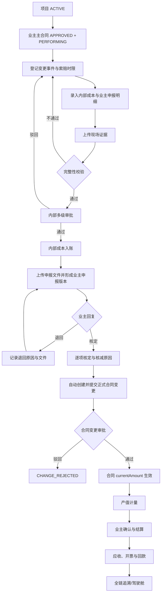
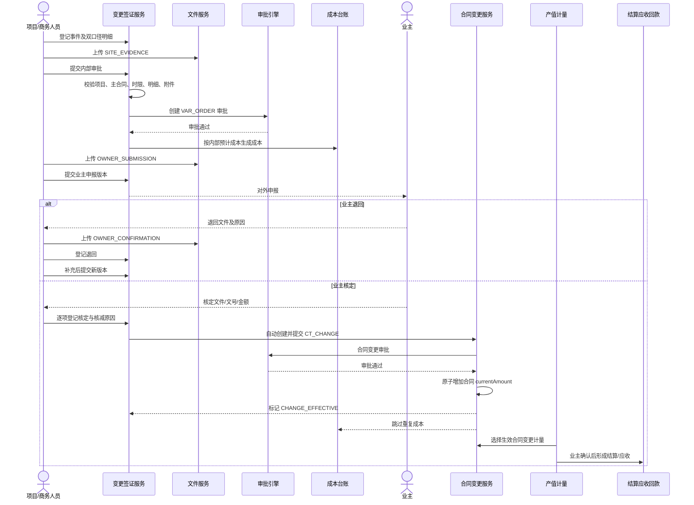
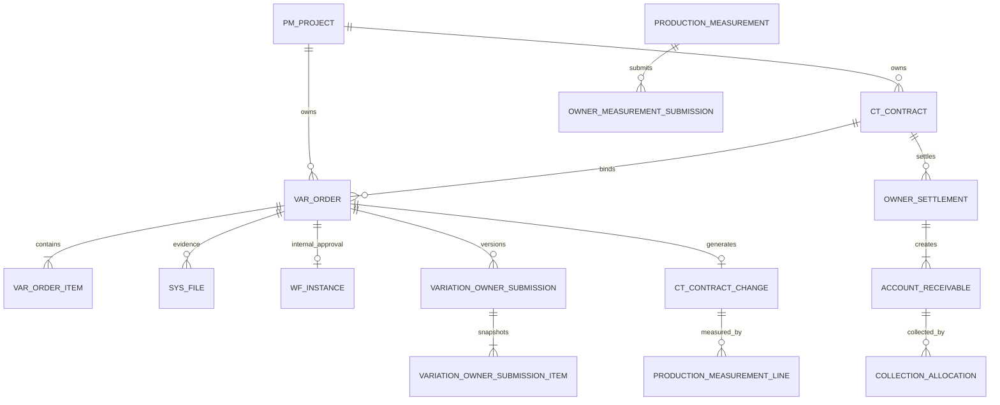

# 变更、签证与索赔闭环业务标准

> 版本：V1.0（P0）<br>
> 适用范围：EPC 项目履约期间，由事件识别、内部测算与审批、对业主申报、业主核定形成正式合同变更，并进入产值计量、业主结算和回款的全过程。<br>
> 唯一主线：`项目 → 主合同 → 变更事件 → 内部审批 → 业主申报版本 → 业主核定 → 正式合同变更 → 产值计量 → 业主结算 → 应收/回款`。

## 1. 目标与边界

本闭环解决三个核心问题：现场事实不能事后补造；内部成本与对业主索赔金额不能混为一谈；业主核定不能只靠人工勾选，而必须生成正式合同变更并可继续计量、结算、回款。

P0 不新增合同谈判、法律诉讼、AI 索赔编制和外部门户。原有项目、合同、工作流、文件、成本、产值计量、业主结算、应收与回款模块继续复用。

## 2. 当前业务完成度分析

| 节点 | 实施前 | P0 完成状态 | 主要证据 |
|---|---|---|---|
| 变更事件登记 | 有页面和 `var_order`，事件事实不足 | 已完成 | 事件日期、截止日、事件说明、原因、责任方 |
| 内部成本/索赔测算 | 单一金额口径 | 已完成 | 明细同时保存内部成本与业主申报口径 |
| 现场证据 | 可上传但无阶段约束 | 已完成 | `SITE_EVIDENCE`，缺失禁止提交，审批后不可替换 |
| 内部审批 | 已有工作流 | 已增强 | 审批实例回写、驳回重提、审批留痕、审批通过生成成本 |
| 业主申报 | 缺失 | 已完成 | 申报版本、对外文号、金额快照、附件和重报版本 |
| 业主退回/核定 | 客户端确认开关，可伪造 | 已完成 | 回复文号、附件、逐项核定、核减原因、重复处理保护 |
| 正式合同变更 | 与签证孤立 | 已完成 | 核定后自动创建并提交 `ct_contract_change` |
| 合同金额生效 | 已有合同变更审批 | 已贯通 | 审批通过原子增加 `current_amount` |
| 成本联动 | 收入向签证不处理 | 已完成 | 内部审批按预计成本入账；自动合同变更禁止重复成本 |
| 计量/结算/回款 | 模块已存在但无签证来源链 | 已贯通 | 正式合同变更可作为产值计量来源；追溯聚合下游事实 |
| 前端操作 | 仅草稿维护/提交 | 已完成 | 双口径录入、证据上传、业主申报、回复、追溯入口 |
| 自动测试 | 无完整跨模块用例 | 已完成 | `VariationClaimClosedLoopIntegrationTest` |

## 3. 业务流程





## 4. 数据关系与删除策略



关键主外键：`var_order.project_id/contract_id`、`var_order_item.var_order_id`、`variation_owner_submission.var_order_id`、`variation_owner_submission_item.submission_id/var_order_item_id`、`ct_contract_change.source_var_order_id`、`var_order.generated_contract_change_id`。来源签证到正式合同变更为租户内一对一。

删除策略：草稿签证允许逻辑删除；进入审批后禁止删除。申报版本、核定记录、正式合同变更、成本、计量、结算和回款均禁止级联删除，只能按各模块冲销/红冲规则处理。外键统一 `ON DELETE RESTRICT`。

## 5. 状态流转

内部审批：`DRAFT → APPROVING → APPROVED`；驳回为 `REJECTED`，补正后可再次提交；撤回回到 `DRAFT`。

业主生命周期：

```text
NOT_READY
  → INTERNAL_APPROVED
  → OWNER_SUBMITTED
  → OWNER_RETURNED → OWNER_SUBMITTED（新版本）
  → CHANGE_PENDING
  → CHANGE_EFFECTIVE
  ↘ CHANGE_REJECTED
```

申报版本：`SUBMITTED → RETURNED`，或 `SUBMITTED → CONFIRMED → CHANGE_PENDING → CHANGE_EFFECTIVE/CHANGE_REJECTED`。任何终态不得再次登记回复。

## 6. 节点业务契约

| 节点 | 输入 | 输出 | 前置/后置 | 核心规则与校验 | 权限、日志、审计、异常 |
|---|---|---|---|---|---|
| 项目/主合同 | 项目、合同 | 有效履约边界 | 项目在建；主合同已批且履约中 | 项目合同必须同租户、同项目；收入索赔只能绑定 MAIN | 项目数据权限；越权、停工、合同关闭明确拒绝并记审计 |
| 事件登记 | 日期、截止日、说明、原因、责任方、事项键 | DRAFT 签证 | 无重复事项 | 截止日不得早于事件日；事项键防止与手工合同变更重复 | `variation:order:add/edit`；记录创建/修改人和时间 |
| 双口径测算 | 数量、成本单价、申报单价、科目 | 成本额、申报额 | 草稿/驳回态 | 服务端重算金额；数量>0、价格≥0、申报金额>0 | 不采信客户端合计；异常事务回滚 |
| 现场证据 | 文件 | SITE_EVIDENCE | 草稿/驳回态 | 缺失禁止审批；进入审批后不可替换 | 文件权限、病毒扫描、上传/删除审计 |
| 内部审批 | 完整签证 | 审批实例、内部成本 | 项目合同有效且时限未过 | 重复提交拒绝；多级审批留痕；通过后锁定业务数据 | `variation:order:submit`、审批权限；驳回/撤回留痕 |
| 业主申报 | 对外文号、时间、附件 | 不可变版本及明细快照 | 内部已批；收入向 | 每次重报版本号+1；新版本必须有新附件 | `variation:owner:submit`；版本创建审计 |
| 业主回复 | 回复文号、文件、结论 | RETURNED/核定明细 | 仅最新 SUBMITTED | 退回必须原因；核定逐项覆盖；核减必须原因；总额>0且≤申报额 | `variation:owner:review`；重复处理拒绝，整单事务 |
| 正式合同变更 | 核定金额 | CT_CHANGE APPROVING | 核定成功 | 同一签证只生成一张；before/after 金额留痕；自动提交审批 | 系统自动创建；人工不得脱离来源修改 |
| 合同变更生效 | 审批结论 | currentAmount、CHANGE_EFFECTIVE | CT_CHANGE 审批通过 | 原子增加当前合同额；来源签证成本不重复生成 | 审批日志和合同金额变更审计；失败整体回滚 |
| 计量/结算/回款 | 生效合同变更 | 计量、结算、应收、回款 | 合同变更生效 | 复用产值计量与收入回款闭环；不得绕过计量来源校验 | 各模块既有权限与审计；追溯只读 |
| 全链追溯 | 签证 ID | 聚合事实链 | 项目可见 | 返回附件、审批、申报版本、合同变更、计量、结算、应收、回款 | `variation:trace`；只读访问也保留访问日志 |

## 7. 验收标准

- [ ] 必须绑定在建项目和同项目合同；收入索赔必须绑定已审批、履约中的业主主合同。
- [ ] 必须填写事件日期、说明、原因分类；截止日早于事件日或已经超期时禁止提交。
- [ ] 每条明细必须同时形成内部成本和业主申报金额，合计由服务端计算。
- [ ] 缺少现场证据禁止内部审批；审批后现场证据不可替换。
- [ ] 驳回后允许补正重提；重复提交、并发提交不得产生两个有效审批实例。
- [ ] 内部审批通过后，预计成本一次且仅一次进入成本台账。
- [ ] 业主申报必须有对外文号、申报附件和不可变明细快照；退回重报必须产生新版本。
- [ ] 业主核定必须有回复文号和附件，逐项核定；核减必须填写原因。
- [ ] 客户端不得直接写 `ownerConfirmFlag`、核定金额、审批状态或来源合同变更 ID。
- [ ] 核定后自动生成并提交正式合同变更，同一签证不得重复生成。
- [ ] 正式合同变更审批通过后才增加 `ct_contract.current_amount`；驳回不得增加。
- [ ] 来源签证的正式合同变更不得再次生成成本。
- [ ] 生效合同变更可被产值计量选择，并继续进入业主结算、应收和回款闭环。
- [ ] 从签证可反查审批、所有申报版本、附件、正式合同变更及下游财务事实。

## 8. 测试方案

正常流：创建收入索赔、双口径明细、上传证据、内部多级审批、首报、业主核定、合同变更审批、生效、计量来源可见、追溯完整。

异常流：项目暂停、合同关闭、跨项目合同、事件字段缺失、证据缺失、截止日过期、审批驳回、业主退回重报、申报附件缺失、核定附件缺失、核减无原因、核定超额、重复回复、重复生成合同变更、合同变更驳回。

边界与并发：0金额、超大金额、四位数量/单价和分币舍入、200条明细、同一提交重复点击、同一回复并发、同一合同多张变更并发增加金额、租户越权。

自动化核心用例：`VariationClaimClosedLoopIntegrationTest` 覆盖缺证据、方向兼容、内部成本、业主退回重报、部分核定、正式变更、合同金额、成本防重、追溯和重复回复。

## 9. 开发路线图

P0（本版）：事件事实、双口径、阶段附件、内部审批、业主版本/回复、自动正式合同变更、成本防重、合同额生效、追溯、前端、迁移和集成测试。

P1：将核定变更在产值计量、结算、回款页面展示来源签证号；增加索赔时限预警和待办；导出完整索赔卷宗。

P2：金额/工期组合变更的独立审批阈值；多币种、税额和保留金口径；按原因/责任方统计索赔成功率。

P3：业主门户在线确认、电子签章、合同条款智能提取和索赔材料辅助编制。P3 不得绕过本标准的证据、审批和版本事实。

## 10. 风险与未来优化

- 历史 `owner_confirm_flag=1` 数据只能标为 `CONFIRMED_LEGACY`，不能反推不存在的业主文件和版本。
- `REVENUE` 历史方向在服务端归一为 `INCOME`；报表必须按正式合同 `currentAmount` 计算，禁止再叠加签证金额造成双计。
- 业主申报与核定目前由内部人员登记，真实性依赖附件和审计；电子签章/业主门户属于后续增强。
- 下游追溯通过 `contract_change_id → production_measurement_line → owner_settlement → account_receivable → collection_allocation` 精确关联；P1 应在页面上进一步展示各节点的来源签证号。
- 数据迁移上线前必须在 MySQL 对 V1–V186 全量演进，并备份 `var_order`、`var_order_item`、`ct_contract_change`。
