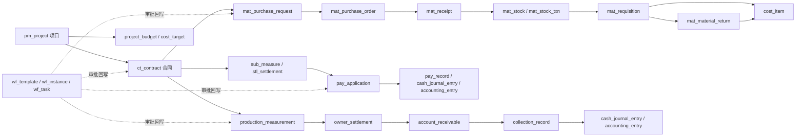

# CGC-PMS 数据库结构深度审计报告

> 修复实施更新：2026-07-17
> 当前实现基线：`codex/database-model-remediation`，MySQL/H2 migration `V210`
> 当前本地结构：146 张业务表、2444 个基础表物理字段、24 个视图字段（字典合计 2468）、261 个外键列、2 个只读治理视图；Flyway 失败记录 0
> 实施结论：本地实现与升级验收通过；生产发布仍须执行本报告规定的 preflight、备份、审批和变更窗口，不因本地通过而自动获准。

## 2026-07-17 修复实施结论

原审计以下正文保留为 **V180 发现基线**，便于追溯“为什么改”；当前 V210 的完整物理结构以自动生成的
[结构字典](generated/schema-dictionary.md)和 [ER 关系](generated/schema-relationships.md)为权威派生产物。两份文件均来自当前
`cgc_pms.INFORMATION_SCHEMA`，可通过 `scripts/database/generate-schema-docs.ps1` 重复生成，禁止手工维护副本。

### 当前数量与“2018 个字段是否全被引用”的最终回答

|口径|结果|结论|
|---|---:|---|
|用户此前口径|2018|来源版本和统计边界无法从仓库事实还原，不能作为当前验收分母|
|V180 审计实测|2053|并非全部有有效业务引用；详见原审计 3.2 节|
|V210 当前基础表物理字段|2444|V209 的 2458 个基础表字段减去 14 个已确认无值、无索引、无运行时依赖的 `deleted_token`；不能把“未被 Java 显式点名”等同于无效|
|V210 当前视图字段|24|来自 2 个只读治理视图；自动字典合计 2468 个字段|
|V210 当前业务表|146|全部进入自动结构字典；另有 1 张 Flyway 内部表和 2 个只读治理视图|

因此，答案仍是：**不是，不能认定 2018 个字段全都有业务引用。** 原 V180 逐字段对账已确认 8 个字段无运行时或现行约束证据、4 个字段只有表级返回证据。V210 已退役 14 个明确无效的 `deleted_token`，同时保留 15 个承担活动行唯一性的 `active_unique_token`；`overhead_allocation_record` 的退役仍需生产等价环境确认外部依赖。当前新增字段均有 migration、约束、实体/服务或测试证据，但“结构有效”不等于“必须由业务代码逐字段显式读取”。本报告不伪造 2468 个字典字段全部被业务消费的结论。

### 29 项发现的实施状态

|范围|数量|实施结果|
|---|---:|---|
|DBA-P0-001—008|8|全部修复并经迁移、约束、服务或并发测试复验|
|DBA-P1-001—016|16|15 项完成修复/治理或以证据关闭；`DBA-P1-001` 保留结构但已零数据、零仓库运行时引用，物理退役由 `ISSUE-049-001` 唯一承接|
|DBA-P2-001—005|5|完成共享视图、tenant-aware 关系、类型注册表、容量触发线、自动数据字典/ER 交付|

关键落地版本：V195 活动唯一键、V196 成本事实幂等、V197 tenant-aware RBAC、V198—V200 退料/采购/质量闭环、V201 银行回单到回款、V202—V204 审批权威与用户岗位/项目审批、V205—V208 冗余状态/材料分类/JSON/注册表/预警权威、V209 默认材料分类回填、V210 退役 14 个旧 `deleted_token`。MySQL 与 H2 均提供同版本镜像。

修复后的正式证据、逐项状态和剩余发布边界见
[`docs/quality/database-model-remediation-acceptance.md`](../quality/database-model-remediation-acceptance.md)。

---

## V180 原始审计基线（保留用于问题追溯）

> 审计日期：2026-07-16
> 审计性质：只读静态审计 + 本地开发库只读核验
> 代码快照：`codex/ci-test-isolation-gate`，HEAD `48b3761515f17bd021ce3bf616c7743acd2e8490`
> 数据库快照：本地 Docker `cgc-pms-mysql-dev`，MySQL `8.0.46`，schema `cgc_pms`，Flyway 已成功应用至 `V180`
> 审计边界：未连接生产数据库，未执行迁移、DDL、DML、测试或应用启动；未修改代码和数据库。本报告按审计开始时可见的未提交工作区内容一并分析。

## 审计结论摘要

结论：**数据库模型审计完成，但当前数据库模型不具备“无条件通过”的重构/生产基线结论。** 本地 V180 schema 与当前 MySQL 迁移链对齐，所有 127 张业务表均有主键，金额字段未发现 `FLOAT/DOUBLE`，本地样本的 17 条重点非外键关系扫描未发现孤儿，说明基础结构不是失控状态；但 13 张核心主数据/业务表的 nullable `deleted_token` 唯一键不能约束活动行唯一，且本地 `cost_subject` 已出现 3 组活动重复业务键；此外，审批路由存在双重权威源且部分可配置字段不生效、RBAC 关联缺少租户和物理约束、V180 退料事实缺少外键与并发上限保护、`cost_item` 存在冲突的双唯一键，以及多个字段/表只有结构存在而无有效运行时消费。

用户此前提到的“2018 个字段”与当前 V180 的 `information_schema` 实测口径不一致，其来源版本和统计边界**需要人工确认**。当前本地库为 **2053 个业务字段**（另有 `flyway_schema_history` 10 个内部字段），并非全部都有有效业务引用：逐字段对账得到 1448 个 ORM 映射字段、569 个显式 SQL/JDBC 字段、24 个仅由数据库约束或生成机制引用的字段、4 个仅随 `SELECT *` 返回但未见显式消费的字段、8 个没有运行时或现行约束引用证据的字段。其中 `overhead_allocation_record` 15 个字段整体均无运行时代码或测试表引用；`mat_stock.deleted_token` 是 V131 后未退役的遗留列。

本报告中的“使用情况”是静态证据分级，不把以下情形误判为有效业务使用：仅在 migration 中出现、仅由 `SELECT *` 被动返回、仅有 DTO/管理页面可编辑、仅从模板复制到实例但执行引擎不读取。生产数据是否存在历史孤儿、错链或外部消费者，仍需在生产等价脱敏副本上人工确认。

## 一、数据库整体概览

### 1.1 数量与迁移基线

|指标|当前结果|判断|
|---|---:|---|
|MySQL 基础表|128|含 127 张业务表和 1 张 `flyway_schema_history`|
|业务字段|2053|V180 当前口径；不是旧口径 2018|
|Flyway 成功记录|178|最大版本 V180，失败记录 0|
|MySQL SQL migration|178|最大版本 V180，无重复版本号|
|H2 SQL migration|173|最大版本 V180|
|H2 Java migration|6|V51、V58、V75、V83、V88、V131|
|ORM 映射表|85|存在 `@TableName` 实体|
|纯 SQL/JDBC 运行表|41|无实体，但存在运行时表引用|
|无运行时表引用|1|`overhead_allocation_record`|
|本地空表 / 非空表|102 / 25|本地仅 1425 行，不能以空表单独判定废弃|
|表注释缺失|43 / 127|33.9%，影响数据字典维护|
|字段注释缺失|932 / 2053|45.4%，报告中以“需要人工确认”标记推断说明|

迁移对称性说明：H2 SQL 相比 MySQL SQL 缺少 V51、V58、V75、V88、V89、V131，其中 V51、V58、V75、V88、V131 由 H2 Java migration 补位；V83 是没有同版本 SQL 的 H2 专用 Java 修复；H2 SQL 另有 V91，它对应 MySQL V90 的审计日志建表，而 H2 V90 用于测试种子。V89 的 MySQL 数据修复没有同版本 H2 SQL。`docs/standards/07-数据库与迁移规范.md` 中“89/82+5”的数量已经过期，应以本节实测口径为准。

### 1.2 按业务模块分类

|模块|表数|主要表|
|---|---:|---|
|采购、验收、库存与领退料|13|`mat_purchase_request`、`mat_purchase_order`、`mat_receipt`、`mat_stock`、`mat_requisition`、`mat_material_return`|
|成本、预算与间接费|13|`cost_item`、`cost_summary`、`cost_target`、`project_budget`、`budget_ledger`、`overhead_allocation_run`|
|分包、计量与结算|5|`sub_task`、`sub_measure`、`stl_settlement`|
|付款、资金、会计与财务运营|27|`pay_application`、`pay_record`、`pay_invoice`、`cash_journal_entry`、`accounting_entry`、`finance_*`|
|合同、变更与投标|8|`ct_contract`、`ct_contract_item`、`ct_contract_change`、`var_order`、`bid_cost`|
|审批工作流|8|`wf_template`、`wf_instance`、`wf_node_instance`、`wf_task`、`wf_record`|
|收入、产值、结算与回款|26|`production_measurement`、`owner_settlement`、`account_receivable`、`collection_record`、`sales_invoice`、`revenue_*`|
|系统、权限与平台|12|`sys_user`、`sys_role`、`sys_menu`、两个关联表、字典、文件、通知、审计|
|项目、组织与主数据|9|`pm_project`、`pm_project_member`、`md_partner`、`md_material`、`org_*`、`site_daily_log`|
|预警、驾驶舱与跨域治理|6|`alert_log`、`alert_rule_config`、`approval_routing_rule`、`business_matter_registry`、`dashboard_finance_snapshot`|

### 1.3 核心业务链路

核心判断：付款闭环的 V156—V167 与收入/回款闭环的 V171—V175 已引入较完整的事实表、外键、幂等键和对账表；采购链 V176—V180 已补逐行来源、库存价值、实发审计和退料冲销，但仍存在物理外键、并发退料、供应商退货、质量处置及预算/WBS 关联缺口。审批引擎是所有链路的共同控制面，其“配置可写但执行不读”问题优先级高于一般字段清理。

### 1.4 使用证据口径

|分类|字段数|含义|
|---|---:|---|
|ORM 映射|1448|字段映射到实体，可能由 MyBatis-Plus 隐式读写|
|显式 SQL/JDBC|569|在引用该表的运行时 Java/XML SQL 中显式出现|
|仅数据库机制|24|只见主键、外键、索引、自动生成或通用审计用途；其中 13 个 `deleted_token` 的唯一性机制当前失效|
|表级返回、字段未消费|4|表通过 `SELECT *` 使用，但字段没有显式写入/读取逻辑|
|无运行时/现行约束证据|8|7 个位于 `overhead_allocation_record`，另 1 个为 `mat_stock.deleted_token` 遗留列|

## 二、完整表清单

以下 127 张业务表按表名排序。字段“说明”优先取 MySQL 数据字典注释；迁移未提供注释时只按字段名推断并明确标记“需要人工确认”。“本地样本行数”只用于辅助识别，不代表生产数据量。“运行时/测试文件数”按直接表名或实体类型静态命中统计，不等同于完整覆盖率。

### 2.0 `flyway_schema_history`（平台内部表）

- **表名：** `flyway_schema_history`
- **中文业务名称：** Flyway 迁移历史
- **所属模块：** 数据库版本治理
- **用途说明：** 由 Flyway 自动维护已执行迁移、校验和、耗时与成功状态；不计入 127 张业务表和 2053 个业务字段口径。
- **创建来源：** Flyway 框架自动创建，不来自项目业务 migration
- **是否核心表：** 否（平台必需内部表）
- **证据摘要：** 本地 178 条成功迁移记录，最大版本 V180，失败记录 0。

|字段名|类型|是否必填|默认值|说明|使用情况|
|---|---|---|---|---|---|
|`installed_rank`|`int`|是|—|迁移安装顺序主键|Flyway 内部读写|
|`version`|`varchar(50)`|否|—|迁移版本|Flyway 内部读写|
|`description`|`varchar(200)`|是|—|迁移描述|Flyway 内部读写|
|`type`|`varchar(20)`|是|—|迁移类型|Flyway 内部读写|
|`script`|`varchar(1000)`|是|—|迁移脚本名|Flyway 内部读写|
|`checksum`|`int`|否|—|迁移校验和|Flyway 校验使用|
|`installed_by`|`varchar(100)`|是|—|执行数据库用户|Flyway 内部写入|
|`installed_on`|`timestamp`|是|`CURRENT_TIMESTAMP`|执行时间|数据库默认值与 Flyway 使用|
|`execution_time`|`int`|是|—|执行耗时（毫秒）|Flyway 内部写入|
|`success`|`tinyint(1)`|是|—|迁移是否成功|Flyway 校验使用|

### 2.1 `account_receivable`

- **表名：** `account_receivable`
- **中文业务名称：** 应收账款
- **所属模块：** 收入、产值、结算与回款
- **用途说明：** 承载「应收账款」核心事实或状态，是「收入、产值、结算与回款」主链路的一部分。
- **创建来源：** `backend/src/main/resources/db/migration/V171__revenue_collection_closed_loop_core.sql`
- **是否核心表：** 是
- **证据摘要：** 本地样本 0 行；无独立实体；运行时文件 4 个；测试文件 2 个；外键 4 个、非主键索引 7 个（其中唯一 2 个）、CHECK 1 个。

|字段名|类型|是否必填|默认值|说明|使用情况|
|---|---|---|---|---|---|
|`id`|`bigint`|是|—|主键|显式 SQL/JDBC（无独立实体）|
|`tenant_id`|`bigint`|是|`0`|租户标识|显式 SQL/JDBC（无独立实体）|
|`project_id`|`bigint`|是|—|项目标识|显式 SQL/JDBC（无独立实体）|
|`contract_id`|`bigint`|是|—|合同标识|显式 SQL/JDBC（无独立实体）|
|`settlement_id`|`bigint`|是|—|关联标识（迁移未注释，需要人工确认对象）|显式 SQL/JDBC（无独立实体）|
|`customer_id`|`bigint`|是|—|关联标识（迁移未注释，需要人工确认对象）|显式 SQL/JDBC（无独立实体）|
|`receivable_type`|`varchar(32)`|是|—|编码/类型（迁移未注释，需要人工确认字典）|显式 SQL/JDBC（无独立实体）|
|`receivable_code`|`varchar(64)`|是|—|编码/类型（迁移未注释，需要人工确认字典）|显式 SQL/JDBC（无独立实体）|
|`original_amount`|`decimal(18,2)`|是|—|金额/计价字段（迁移未注释，需要人工确认口径）|显式 SQL/JDBC（无独立实体）|
|`collected_amount`|`decimal(18,2)`|是|`0.00`|金额/计价字段（迁移未注释，需要人工确认口径）|显式 SQL/JDBC（无独立实体）|
|`credited_amount`|`decimal(18,2)`|是|`0.00`|金额/计价字段（迁移未注释，需要人工确认口径）|显式 SQL/JDBC（无独立实体）|
|`outstanding_amount`|`decimal(18,2)`|是|—|金额/计价字段（迁移未注释，需要人工确认口径）|显式 SQL/JDBC（无独立实体）|
|`due_date`|`date`|是|—|业务日期（迁移未注释，需要人工确认）|显式 SQL/JDBC（无独立实体）|
|`status`|`varchar(32)`|是|`OPEN`|业务状态（需要人工确认枚举）|显式 SQL/JDBC（无独立实体）|
|`version`|`int`|是|`0`|乐观锁/业务版本号|显式 SQL/JDBC（无独立实体）|
|`created_by`|`bigint`|否|—|创建人标识|显式 SQL/JDBC（无独立实体）|
|`created_at`|`datetime`|是|`CURRENT_TIMESTAMP`|创建时间|显式 SQL/JDBC（无独立实体）|
|`updated_by`|`bigint`|否|—|更新人标识|显式 SQL/JDBC（无独立实体）|
|`updated_at`|`datetime`|是|`CURRENT_TIMESTAMP`|更新时间|显式 SQL/JDBC（无独立实体）|
|`deleted_flag`|`tinyint`|是|`0`|逻辑删除标志|显式 SQL/JDBC（无独立实体）|
|`remark`|`varchar(500)`|否|—|备注|显式 SQL/JDBC（无独立实体）|

### 2.2 `accounting_entry`

- **表名：** `accounting_entry`
- **中文业务名称：** 会计凭证主表
- **所属模块：** 付款、资金、会计与财务运营
- **用途说明：** 承载「会计凭证主表」核心事实或状态，是「付款、资金、会计与财务运营」主链路的一部分。
- **创建来源：** `backend/src/main/resources/db/migration/V81__init_accounting_entry.sql`
- **是否核心表：** 是
- **证据摘要：** 本地样本 0 行；ORM `backend/src/main/java/com/cgcpms/accounting/entity/AccountingEntry.java`；运行时文件 15 个；测试文件 3 个；外键 6 个、非主键索引 11 个（其中唯一 3 个）、CHECK 2 个。

|字段名|类型|是否必填|默认值|说明|使用情况|
|---|---|---|---|---|---|
|`id`|`bigint`|是|—|凭证ID|ORM映射：`AccountingEntry.java`|
|`tenant_id`|`bigint`|是|`0`|租户标识|ORM映射：`AccountingEntry.java`|
|`entry_code`|`varchar(64)`|是|—|凭证号|ORM映射：`AccountingEntry.java`|
|`entry_date`|`date`|是|—|凭证日期|ORM映射：`AccountingEntry.java`|
|`entry_type`|`varchar(50)`|是|—|BID_COST/MATERIAL/LABOR/OVERHEAD/REVENUE/SETTLEMENT|ORM映射：`AccountingEntry.java`|
|`source_type`|`varchar(50)`|是|—|来源类型（与cost_item.source_type对应）|ORM映射：`AccountingEntry.java`|
|`source_id`|`bigint`|是|—|来源单据ID|ORM映射：`AccountingEntry.java`|
|`entry_status`|`varchar(50)`|是|`DRAFT`|DRAFT/POSTED/REVERSED|ORM映射：`AccountingEntry.java`|
|`total_debit`|`decimal(18,2)`|是|`0.00`|迁移未提供字段注释（需要人工确认）|ORM映射：`AccountingEntry.java`|
|`total_credit`|`decimal(18,2)`|是|`0.00`|迁移未提供字段注释（需要人工确认）|ORM映射：`AccountingEntry.java`|
|`created_by`|`bigint`|否|—|创建人标识|ORM映射：`AccountingEntry.java`|
|`created_at`|`datetime`|是|`CURRENT_TIMESTAMP`|创建时间|ORM映射：`AccountingEntry.java`|
|`updated_by`|`bigint`|否|—|更新人标识|ORM映射：`AccountingEntry.java`|
|`updated_at`|`datetime`|是|`CURRENT_TIMESTAMP`|更新时间|ORM映射：`AccountingEntry.java`|
|`deleted_flag`|`tinyint`|是|`0`|逻辑删除标志|ORM映射：`AccountingEntry.java`|
|`remark`|`varchar(500)`|否|—|备注|ORM映射：`AccountingEntry.java`|
|`project_id`|`bigint`|否|—|项目标识|ORM映射：`AccountingEntry.java`|
|`contract_id`|`bigint`|否|—|合同标识|ORM映射：`AccountingEntry.java`|
|`pay_application_id`|`bigint`|否|—|关联标识（迁移未注释，需要人工确认对象）|ORM映射：`AccountingEntry.java`|
|`pay_record_id`|`bigint`|否|—|关联标识（迁移未注释，需要人工确认对象）|ORM映射：`AccountingEntry.java`|
|`posted_at`|`datetime`|否|—|时间点（迁移未注释，需要人工确认）|ORM映射：`AccountingEntry.java`|
|`reversed_at`|`datetime`|否|—|时间点（迁移未注释，需要人工确认）|ORM映射：`AccountingEntry.java`|
|`reversed_entry_id`|`bigint`|否|—|关联标识（迁移未注释，需要人工确认对象）|ORM映射：`AccountingEntry.java`|
|`version`|`int`|是|`0`|乐观锁/业务版本号|ORM映射：`AccountingEntry.java`|
|`external_sync_status`|`varchar(32)`|否|—|状态字段（迁移未注释，需要人工确认枚举）|显式 SQL/JDBC（实体未映射该字段）|
|`external_sync_at`|`datetime`|否|—|时间点（迁移未注释，需要人工确认）|显式 SQL/JDBC（实体未映射该字段）|
|`collection_record_id`|`bigint`|否|—|关联标识（迁移未注释，需要人工确认对象）|ORM映射：`AccountingEntry.java`|

### 2.3 `accounting_entry_line`

- **表名：** `accounting_entry_line`
- **中文业务名称：** 会计凭证明细表
- **所属模块：** 付款、资金、会计与财务运营
- **用途说明：** 承载「会计凭证明细表」核心事实或状态，是「付款、资金、会计与财务运营」主链路的一部分。
- **创建来源：** `backend/src/main/resources/db/migration/V81__init_accounting_entry.sql`
- **是否核心表：** 是
- **证据摘要：** 本地样本 0 行；ORM `backend/src/main/java/com/cgcpms/accounting/entity/AccountingEntryLine.java`；运行时文件 10 个；测试文件 4 个；外键 1 个、非主键索引 3 个（其中唯一 1 个）、CHECK 2 个。

|字段名|类型|是否必填|默认值|说明|使用情况|
|---|---|---|---|---|---|
|`id`|`bigint`|是|—|分录行ID|ORM映射：`AccountingEntryLine.java`|
|`tenant_id`|`bigint`|是|`0`|租户标识|ORM映射：`AccountingEntryLine.java`|
|`entry_id`|`bigint`|是|—|凭证ID|ORM映射：`AccountingEntryLine.java`|
|`line_no`|`int`|是|`1`|行号|ORM映射：`AccountingEntryLine.java`|
|`direction`|`varchar(10)`|是|—|DEBIT借方 / CREDIT贷方|ORM映射：`AccountingEntryLine.java`|
|`cost_subject_id`|`bigint`|否|—|关联标识（迁移未注释，需要人工确认对象）|ORM映射：`AccountingEntryLine.java`|
|`amount`|`decimal(18,2)`|是|`0.00`|金额|ORM映射：`AccountingEntryLine.java`|
|`summary`|`varchar(500)`|否|—|摘要|ORM映射：`AccountingEntryLine.java`|
|`created_by`|`bigint`|否|—|创建人标识|ORM映射：`AccountingEntryLine.java`|
|`created_at`|`datetime`|是|`CURRENT_TIMESTAMP`|创建时间|ORM映射：`AccountingEntryLine.java`|
|`updated_by`|`bigint`|否|—|更新人标识|ORM映射：`AccountingEntryLine.java`|
|`updated_at`|`datetime`|是|`CURRENT_TIMESTAMP`|更新时间|ORM映射：`AccountingEntryLine.java`|
|`deleted_flag`|`tinyint`|是|`0`|逻辑删除标志|ORM映射：`AccountingEntryLine.java`|
|`remark`|`varchar(500)`|否|—|备注|ORM映射：`AccountingEntryLine.java`|
|`account_code`|`varchar(64)`|否|—|编码/类型（迁移未注释，需要人工确认字典）|ORM映射：`AccountingEntryLine.java`|
|`account_name`|`varchar(128)`|否|—|名称（迁移未注释，需要人工确认）|ORM映射：`AccountingEntryLine.java`|

### 2.4 `alert_log`

- **表名：** `alert_log`
- **中文业务名称：** 预警记录表
- **所属模块：** 预警、驾驶舱与跨域治理
- **用途说明：** 承载「预警记录表」，当前由 ORM 实体参与运行时读写。
- **创建来源：** `backend/src/main/resources/db/migration/V24__enhance_settlement_alert_summary.sql`
- **是否核心表：** 否
- **证据摘要：** 本地样本 0 行；ORM `backend/src/main/java/com/cgcpms/alert/entity/AlertLog.java`；运行时文件 22 个；测试文件 15 个；外键 0 个、非主键索引 10 个（其中唯一 0 个）、CHECK 0 个。

|字段名|类型|是否必填|默认值|说明|使用情况|
|---|---|---|---|---|---|
|`id`|`bigint`|是|—|预警ID，雪花ID|ORM映射：`AlertLog.java`|
|`tenant_id`|`bigint`|是|`0`|租户ID|ORM映射：`AlertLog.java`|
|`project_id`|`bigint`|是|—|项目ID|ORM映射：`AlertLog.java`|
|`contract_id`|`bigint`|否|—|合同ID|ORM映射：`AlertLog.java`|
|`alert_domain`|`varchar(50)`|否|—|预警业务分类|ORM映射：`AlertLog.java`|
|`alert_category`|`varchar(50)`|否|—|细分类标签|ORM映射：`AlertLog.java`|
|`source_type`|`varchar(50)`|否|—|来源业务类型|ORM映射：`AlertLog.java`|
|`source_id`|`bigint`|否|—|来源业务ID|ORM映射：`AlertLog.java`|
|`dedup_key`|`varchar(200)`|否|—|去重键|ORM映射：`AlertLog.java`|
|`rule_type`|`varchar(100)`|是|—|预警规则类型|ORM映射：`AlertLog.java`|
|`severity`|`varchar(20)`|是|`MEDIUM`|严重程度：HIGH高，MEDIUM中，LOW低|ORM映射：`AlertLog.java`|
|`message`|`text`|否|—|预警消息内容|ORM映射：`AlertLog.java`|
|`triggered_at`|`datetime`|是|`CURRENT_TIMESTAMP`|触发时间|ORM映射：`AlertLog.java`|
|`is_read`|`tinyint`|是|`0`|是否已读：0未读，1已读|ORM映射：`AlertLog.java`|
|`process_status`|`varchar(20)`|是|`OPEN`|处理状态：OPEN/PROCESSED/ARCHIVED/INVALID|ORM映射：`AlertLog.java`|
|`processed_at`|`datetime`|否|—|处理时间|ORM映射：`AlertLog.java`|
|`archived_at`|`datetime`|否|—|归档时间|ORM映射：`AlertLog.java`|
|`status_remark`|`varchar(500)`|否|—|状态备注|ORM映射：`AlertLog.java`|
|`created_by`|`bigint`|否|—|创建人|ORM映射：`AlertLog.java`|
|`created_at`|`datetime`|是|`CURRENT_TIMESTAMP`|创建时间|ORM映射：`AlertLog.java`|
|`updated_by`|`bigint`|否|—|更新人|ORM映射：`AlertLog.java`|
|`updated_at`|`datetime`|是|`CURRENT_TIMESTAMP`|更新时间|ORM映射：`AlertLog.java`|
|`deleted_flag`|`tinyint`|是|`0`|逻辑删除：0否，1是|ORM映射：`AlertLog.java`|
|`remark`|`varchar(500)`|否|—|备注|ORM映射：`AlertLog.java`|

### 2.5 `alert_notification_send_record`

- **表名：** `alert_notification_send_record`
- **中文业务名称：** 预警通知渠道发送记录
- **所属模块：** 预警、驾驶舱与跨域治理
- **用途说明：** 承载「预警通知渠道发送记录」，当前由 ORM 实体参与运行时读写。
- **创建来源：** `backend/src/main/resources/db/migration/V122__create_alert_notification_send_record.sql`
- **是否核心表：** 否
- **证据摘要：** 本地样本 0 行；ORM `backend/src/main/java/com/cgcpms/alert/entity/AlertNotificationSendRecord.java`；运行时文件 3 个；测试文件 2 个；外键 0 个、非主键索引 2 个（其中唯一 0 个）、CHECK 0 个。

|字段名|类型|是否必填|默认值|说明|使用情况|
|---|---|---|---|---|---|
|`id`|`bigint`|是|—|发送记录ID，雪花ID|ORM映射：`AlertNotificationSendRecord.java`|
|`tenant_id`|`bigint`|是|`0`|租户ID|ORM映射：`AlertNotificationSendRecord.java`|
|`alert_id`|`bigint`|是|—|预警ID|ORM映射：`AlertNotificationSendRecord.java`|
|`event_type`|`varchar(50)`|是|—|事件类型：ALERT_CREATED / STATUS_CHANGED|ORM映射：`AlertNotificationSendRecord.java`|
|`channel`|`varchar(50)`|是|—|渠道：IN_APP / EMAIL / WECHAT|ORM映射：`AlertNotificationSendRecord.java`|
|`target_user_id`|`bigint`|否|—|目标用户ID|ORM映射：`AlertNotificationSendRecord.java`|
|`biz_notification_id`|`bigint`|否|—|站内信ID|ORM映射：`AlertNotificationSendRecord.java`|
|`send_status`|`varchar(50)`|是|—|发送状态：SENT / SKIPPED / FAILED|ORM映射：`AlertNotificationSendRecord.java`|
|`fail_reason`|`varchar(500)`|否|—|失败或跳过原因|ORM映射：`AlertNotificationSendRecord.java`|
|`requested_at`|`datetime`|是|—|请求发送时间|ORM映射：`AlertNotificationSendRecord.java`|
|`completed_at`|`datetime`|否|—|完成时间|ORM映射：`AlertNotificationSendRecord.java`|

### 2.6 `alert_rule_config`

- **表名：** `alert_rule_config`
- **中文业务名称：** 预警规则配置表
- **所属模块：** 预警、驾驶舱与跨域治理
- **用途说明：** 承载「预警规则配置表」，当前由 ORM 实体参与运行时读写。
- **创建来源：** `backend/src/main/resources/db/migration/V121__alert_rule_governance.sql`
- **是否核心表：** 否
- **证据摘要：** 本地样本 9 行；ORM `backend/src/main/java/com/cgcpms/alert/entity/AlertRuleConfig.java`；运行时文件 4 个；测试文件 1 个；外键 0 个、非主键索引 2 个（其中唯一 1 个）、CHECK 0 个。

|字段名|类型|是否必填|默认值|说明|使用情况|
|---|---|---|---|---|---|
|`id`|`bigint`|是|—|主键ID|ORM映射：`AlertRuleConfig.java`|
|`tenant_id`|`bigint`|是|`0`|租户ID|ORM映射：`AlertRuleConfig.java`|
|`rule_type`|`varchar(100)`|是|—|规则类型|ORM映射：`AlertRuleConfig.java`|
|`alert_domain`|`varchar(50)`|是|—|业务域|ORM映射：`AlertRuleConfig.java`|
|`alert_category`|`varchar(50)`|是|—|细分类标签|ORM映射：`AlertRuleConfig.java`|
|`enabled`|`tinyint`|是|`1`|是否启用：1启用，0停用|ORM映射：`AlertRuleConfig.java`|
|`dedup_hours`|`int`|是|`24`|去重窗口小时数|ORM映射：`AlertRuleConfig.java`|
|`window_days`|`int`|否|—|规则窗口天数|ORM映射：`AlertRuleConfig.java`|
|`threshold_ratio`|`decimal(10,4)`|否|—|阈值比例|ORM映射：`AlertRuleConfig.java`|
|`severity_override`|`varchar(20)`|否|—|严重度覆盖|ORM映射：`AlertRuleConfig.java`|
|`created_by`|`bigint`|否|—|创建人|ORM映射：`AlertRuleConfig.java`|
|`created_at`|`datetime`|是|`CURRENT_TIMESTAMP`|创建时间|ORM映射：`AlertRuleConfig.java`|
|`updated_by`|`bigint`|否|—|更新人|ORM映射：`AlertRuleConfig.java`|
|`updated_at`|`datetime`|是|`CURRENT_TIMESTAMP`|更新时间|ORM映射：`AlertRuleConfig.java`|
|`deleted_flag`|`tinyint`|是|`0`|逻辑删除：0否，1是|ORM映射：`AlertRuleConfig.java`|
|`remark`|`varchar(500)`|否|—|备注|ORM映射：`AlertRuleConfig.java`|

### 2.7 `approval_routing_rule`

- **表名：** `approval_routing_rule`
- **中文业务名称：** 审批路由规则
- **所属模块：** 预警、驾驶舱与跨域治理
- **用途说明：** 审批路由候选规则；存在维护/匹配接口，但当前工作流提交链未调用，尚未形成权威路由源。
- **创建来源：** `backend/src/main/resources/db/migration/V169__finance_analytics_p2.sql`
- **是否核心表：** 否
- **证据摘要：** 本地样本 0 行；无独立实体；运行时文件 1 个；测试文件 0 个；外键 1 个、非主键索引 2 个（其中唯一 0 个）、CHECK 0 个。

|字段名|类型|是否必填|默认值|说明|使用情况|
|---|---|---|---|---|---|
|`id`|`bigint`|是|—|主键|显式 SQL/JDBC（无独立实体）|
|`tenant_id`|`bigint`|是|`0`|租户标识|显式 SQL/JDBC（无独立实体）|
|`rule_name`|`varchar(200)`|是|—|名称（迁移未注释，需要人工确认）|显式 SQL/JDBC（无独立实体）|
|`business_type`|`varchar(64)`|是|—|编码/类型（迁移未注释，需要人工确认字典）|显式 SQL/JDBC（无独立实体）|
|`min_amount`|`decimal(18,2)`|否|—|金额/计价字段（迁移未注释，需要人工确认口径）|显式 SQL/JDBC（无独立实体）|
|`max_amount`|`decimal(18,2)`|否|—|金额/计价字段（迁移未注释，需要人工确认口径）|显式 SQL/JDBC（无独立实体）|
|`contract_type`|`varchar(64)`|否|—|编码/类型（迁移未注释，需要人工确认字典）|显式 SQL/JDBC（无独立实体）|
|`expense_category`|`varchar(64)`|否|—|迁移未提供字段注释（需要人工确认）|显式 SQL/JDBC（无独立实体）|
|`workflow_template_id`|`bigint`|是|—|关联标识（迁移未注释，需要人工确认对象）|显式 SQL/JDBC（无独立实体）|
|`priority`|`int`|是|`100`|迁移未提供字段注释（需要人工确认）|显式 SQL/JDBC（无独立实体）|
|`enabled_flag`|`tinyint`|是|`1`|标志位（迁移未注释，需要人工确认枚举）|显式 SQL/JDBC（无独立实体）|
|`version`|`int`|是|`0`|乐观锁/业务版本号|显式 SQL/JDBC（无独立实体）|
|`created_by`|`bigint`|否|—|创建人标识|显式 SQL/JDBC（无独立实体）|
|`created_at`|`datetime`|是|`CURRENT_TIMESTAMP`|创建时间|显式 SQL/JDBC（无独立实体）|
|`updated_by`|`bigint`|否|—|更新人标识|显式 SQL/JDBC（无独立实体）|
|`updated_at`|`datetime`|是|`CURRENT_TIMESTAMP`|更新时间|显式 SQL/JDBC（无独立实体）|

### 2.8 `bank_receipt`

- **表名：** `bank_receipt`
- **中文业务名称：** 银行回单
- **所属模块：** 付款、资金、会计与财务运营
- **用途说明：** 承载「银行回单」，当前通过 SQL/JDBC 参与运行时读写。
- **创建来源：** `backend/src/main/resources/db/migration/V170__finance_integration_p3.sql`
- **是否核心表：** 否
- **证据摘要：** 本地样本 0 行；无独立实体；运行时文件 3 个；测试文件 1 个；外键 4 个、非主键索引 7 个（其中唯一 2 个）、CHECK 0 个。

|字段名|类型|是否必填|默认值|说明|使用情况|
|---|---|---|---|---|---|
|`id`|`bigint`|是|—|主键|显式 SQL/JDBC（无独立实体）|
|`tenant_id`|`bigint`|是|`0`|租户标识|显式 SQL/JDBC（无独立实体）|
|`endpoint_id`|`bigint`|是|—|关联标识（迁移未注释，需要人工确认对象）|显式 SQL/JDBC（无独立实体）|
|`bank_txn_no`|`varchar(128)`|是|—|业务编号（迁移未注释，需要人工确认）|显式 SQL/JDBC（无独立实体）|
|`account_no_masked`|`varchar(64)`|否|—|迁移未提供字段注释（需要人工确认）|显式 SQL/JDBC（无独立实体）|
|`transaction_time`|`datetime`|是|—|时间点（迁移未注释，需要人工确认）|显式 SQL/JDBC（无独立实体）|
|`direction`|`varchar(8)`|是|—|迁移未提供字段注释（需要人工确认）|显式 SQL/JDBC（无独立实体）|
|`amount`|`decimal(18,2)`|是|—|金额（需要人工确认业务口径）|显式 SQL/JDBC（无独立实体）|
|`counterparty_name`|`varchar(200)`|否|—|名称（迁移未注释，需要人工确认）|显式 SQL/JDBC（无独立实体）|
|`purpose_text`|`varchar(500)`|否|—|迁移未提供字段注释（需要人工确认）|显式 SQL/JDBC（无独立实体）|
|`match_status`|`varchar(32)`|是|`UNMATCHED`|状态字段（迁移未注释，需要人工确认枚举）|显式 SQL/JDBC（无独立实体）|
|`pay_record_id`|`bigint`|否|—|关联标识（迁移未注释，需要人工确认对象）|显式 SQL/JDBC（无独立实体）|
|`cash_journal_id`|`bigint`|否|—|关联标识（迁移未注释，需要人工确认对象）|显式 SQL/JDBC（无独立实体）|
|`confidence`|`decimal(5,4)`|否|—|迁移未提供字段注释（需要人工确认）|显式 SQL/JDBC（无独立实体）|
|`raw_payload_json`|`longtext`|是|—|JSON/配置快照（迁移未注释，需要人工确认结构）|显式 SQL/JDBC（无独立实体）|
|`created_at`|`datetime`|是|`CURRENT_TIMESTAMP`|创建时间|显式 SQL/JDBC（无独立实体）|
|`matched_at`|`datetime`|否|—|时间点（迁移未注释，需要人工确认）|显式 SQL/JDBC（无独立实体）|
|`collection_record_id`|`bigint`|否|—|关联标识（迁移未注释，需要人工确认对象）|仅数据库 FK/唯一约束；运行时未回写，链路未闭合|

### 2.9 `bid_cost`

- **表名：** `bid_cost`
- **中文业务名称：** 招投标前期费用头表 - 金额由cost_item聚合
- **所属模块：** 合同、变更与投标
- **用途说明：** 承载「招投标前期费用头表 - 金额由cost_item聚合」，当前由 ORM 实体参与运行时读写。
- **创建来源：** `backend/src/main/resources/db/migration/V80__init_bid_cost_and_overhead.sql`
- **是否核心表：** 否
- **证据摘要：** 本地样本 1 行；ORM `backend/src/main/java/com/cgcpms/bid/entity/BidCost.java`；运行时文件 11 个；测试文件 2 个；外键 0 个、非主键索引 2 个（其中唯一 0 个）、CHECK 0 个。

|字段名|类型|是否必填|默认值|说明|使用情况|
|---|---|---|---|---|---|
|`id`|`bigint`|是|—|投标项目ID|ORM映射：`BidCost.java`|
|`tenant_id`|`bigint`|是|`0`|租户标识|ORM映射：`BidCost.java`|
|`project_id`|`bigint`|否|—|中标后关联的项目ID，未中标时为NULL|ORM映射：`BidCost.java`|
|`bid_project_name`|`varchar(200)`|是|—|投标项目名称|ORM映射：`BidCost.java`|
|`bid_status`|`varchar(50)`|是|`BIDDING`|BIDDING投标中/WON已中标/LOST未中标|ORM映射：`BidCost.java`|
|`created_by`|`bigint`|否|—|创建人标识|ORM映射：`BidCost.java`|
|`created_at`|`datetime`|是|`CURRENT_TIMESTAMP`|创建时间|ORM映射：`BidCost.java`|
|`updated_by`|`bigint`|否|—|更新人标识|ORM映射：`BidCost.java`|
|`updated_at`|`datetime`|是|`CURRENT_TIMESTAMP`|更新时间|ORM映射：`BidCost.java`|
|`deleted_flag`|`tinyint`|是|`0`|逻辑删除标志|ORM映射：`BidCost.java`|
|`remark`|`varchar(500)`|否|—|备注|ORM映射：`BidCost.java`|

### 2.10 `bid_deposit`

- **表名：** `bid_deposit`
- **中文业务名称：** 投标保证金表
- **所属模块：** 合同、变更与投标
- **用途说明：** 承载「投标保证金表」，当前由 ORM 实体参与运行时读写。
- **创建来源：** `backend/src/main/resources/db/migration/V80__init_bid_cost_and_overhead.sql`
- **是否核心表：** 否
- **证据摘要：** 本地样本 0 行；ORM `backend/src/main/java/com/cgcpms/bid/entity/BidDeposit.java`；运行时文件 2 个；测试文件 0 个；外键 0 个、非主键索引 2 个（其中唯一 0 个）、CHECK 1 个。

|字段名|类型|是否必填|默认值|说明|使用情况|
|---|---|---|---|---|---|
|`id`|`bigint`|是|—|保证金ID|ORM映射：`BidDeposit.java`|
|`tenant_id`|`bigint`|是|`0`|租户标识|ORM映射：`BidDeposit.java`|
|`bid_cost_id`|`bigint`|是|—|关联投标项目|ORM映射：`BidDeposit.java`|
|`deposit_type`|`varchar(50)`|是|—|BID投标保证金/PERFORMANCE履约保证金|ORM映射：`BidDeposit.java`|
|`deposit_amount`|`decimal(18,2)`|是|`0.00`|金额/计价字段（迁移未注释，需要人工确认口径）|ORM映射：`BidDeposit.java`|
|`returned_amount`|`decimal(18,2)`|是|`0.00`|已退回金额|ORM映射：`BidDeposit.java`|
|`deposit_status`|`varchar(50)`|是|`PAID`|PAID已缴/RETURNED已退回/FORFEITED已没收|ORM映射：`BidDeposit.java`|
|`paid_date`|`date`|否|—|业务日期（迁移未注释，需要人工确认）|ORM映射：`BidDeposit.java`|
|`returned_date`|`date`|否|—|业务日期（迁移未注释，需要人工确认）|ORM映射：`BidDeposit.java`|
|`created_by`|`bigint`|否|—|创建人标识|ORM映射：`BidDeposit.java`|
|`created_at`|`datetime`|是|`CURRENT_TIMESTAMP`|创建时间|ORM映射：`BidDeposit.java`|
|`updated_by`|`bigint`|否|—|更新人标识|ORM映射：`BidDeposit.java`|
|`updated_at`|`datetime`|是|`CURRENT_TIMESTAMP`|更新时间|ORM映射：`BidDeposit.java`|
|`deleted_flag`|`tinyint`|是|`0`|逻辑删除标志|ORM映射：`BidDeposit.java`|
|`remark`|`varchar(500)`|否|—|备注|ORM映射：`BidDeposit.java`|

### 2.11 `budget_ledger`

- **表名：** `budget_ledger`
- **中文业务名称：** 不可变预算占用与消耗台账
- **所属模块：** 成本、预算与间接费
- **用途说明：** 承载「不可变预算占用与消耗台账」核心事实或状态，是「成本、预算与间接费」主链路的一部分。
- **创建来源：** `backend/src/main/resources/db/migration/V157__create_project_budget_core.sql`
- **是否核心表：** 是
- **证据摘要：** 本地样本 0 行；ORM `backend/src/main/java/com/cgcpms/budget/entity/BudgetLedger.java`；运行时文件 8 个；测试文件 3 个；外键 3 个、非主键索引 6 个（其中唯一 1 个）、CHECK 0 个。

|字段名|类型|是否必填|默认值|说明|使用情况|
|---|---|---|---|---|---|
|`id`|`bigint`|是|—|主键|ORM映射：`BudgetLedger.java`|
|`tenant_id`|`bigint`|是|`0`|租户标识|ORM映射：`BudgetLedger.java`|
|`budget_id`|`bigint`|是|—|关联标识（迁移未注释，需要人工确认对象）|ORM映射：`BudgetLedger.java`|
|`budget_line_id`|`bigint`|是|—|关联标识（迁移未注释，需要人工确认对象）|ORM映射：`BudgetLedger.java`|
|`project_id`|`bigint`|是|—|项目标识|ORM映射：`BudgetLedger.java`|
|`business_type`|`varchar(64)`|是|—|编码/类型（迁移未注释，需要人工确认字典）|ORM映射：`BudgetLedger.java`|
|`business_id`|`bigint`|是|—|关联标识（迁移未注释，需要人工确认对象）|ORM映射：`BudgetLedger.java`|
|`entry_type`|`varchar(32)`|是|—|RESERVE/RELEASE/CONSUME/REVERSE/ADJUST|ORM映射：`BudgetLedger.java`|
|`amount`|`decimal(18,2)`|是|—|金额（需要人工确认业务口径）|ORM映射：`BudgetLedger.java`|
|`reserved_balance`|`decimal(18,2)`|是|—|金额/计价字段（迁移未注释，需要人工确认口径）|ORM映射：`BudgetLedger.java`|
|`consumed_balance`|`decimal(18,2)`|是|—|金额/计价字段（迁移未注释，需要人工确认口径）|ORM映射：`BudgetLedger.java`|
|`idempotency_key`|`varchar(128)`|是|—|幂等键|ORM映射：`BudgetLedger.java`|
|`created_by`|`bigint`|否|—|创建人标识|ORM映射：`BudgetLedger.java`|
|`created_at`|`datetime`|是|`CURRENT_TIMESTAMP`|创建时间|ORM映射：`BudgetLedger.java`|
|`remark`|`varchar(500)`|否|—|备注|ORM映射：`BudgetLedger.java`|

### 2.12 `budget_operation`

- **表名：** `budget_operation`
- **中文业务名称：** 预算操作记录
- **所属模块：** 成本、预算与间接费
- **用途说明：** 承载「预算操作记录」，当前通过 SQL/JDBC 参与运行时读写。
- **创建来源：** `backend/src/main/resources/db/migration/V168__finance_operations_p1.sql`
- **是否核心表：** 否
- **证据摘要：** 本地样本 0 行；无独立实体；运行时文件 1 个；测试文件 0 个；外键 4 个、非主键索引 6 个（其中唯一 1 个）、CHECK 0 个。

|字段名|类型|是否必填|默认值|说明|使用情况|
|---|---|---|---|---|---|
|`id`|`bigint`|是|—|主键|显式 SQL/JDBC（无独立实体）|
|`tenant_id`|`bigint`|是|`0`|租户标识|显式 SQL/JDBC（无独立实体）|
|`operation_type`|`varchar(32)`|是|—|编码/类型（迁移未注释，需要人工确认字典）|显式 SQL/JDBC（无独立实体）|
|`project_id`|`bigint`|是|—|项目标识|显式 SQL/JDBC（无独立实体）|
|`from_budget_line_id`|`bigint`|否|—|关联标识（迁移未注释，需要人工确认对象）|显式 SQL/JDBC（无独立实体）|
|`to_budget_line_id`|`bigint`|否|—|关联标识（迁移未注释，需要人工确认对象）|显式 SQL/JDBC（无独立实体）|
|`contract_allocation_id`|`bigint`|否|—|关联标识（迁移未注释，需要人工确认对象）|显式 SQL/JDBC（无独立实体）|
|`amount`|`decimal(18,2)`|是|—|金额（需要人工确认业务口径）|显式 SQL/JDBC（无独立实体）|
|`status`|`varchar(32)`|是|—|业务状态（需要人工确认枚举）|显式 SQL/JDBC（无独立实体）|
|`reason`|`varchar(500)`|是|—|迁移未提供字段注释（需要人工确认）|显式 SQL/JDBC（无独立实体）|
|`idempotency_key`|`varchar(128)`|是|—|幂等键|显式 SQL/JDBC（无独立实体）|
|`operator_id`|`bigint`|否|—|关联标识（迁移未注释，需要人工确认对象）|显式 SQL/JDBC（无独立实体）|
|`created_at`|`datetime`|是|`CURRENT_TIMESTAMP`|创建时间|显式 SQL/JDBC（无独立实体）|

### 2.13 `business_matter_registry`

- **表名：** `business_matter_registry`
- **中文业务名称：** 合同变更与现场签证跨域事项唯一登记
- **所属模块：** 预警、驾驶舱与跨域治理
- **用途说明：** 承载「合同变更与现场签证跨域事项唯一登记」，当前由 ORM 实体参与运行时读写。
- **创建来源：** `backend/src/main/resources/db/migration/V167__prevent_cross_domain_business_matter_duplicates.sql`
- **是否核心表：** 否
- **证据摘要：** 本地样本 0 行；ORM `backend/src/main/java/com/cgcpms/contract/entity/BusinessMatterRegistry.java`；运行时文件 3 个；测试文件 1 个；外键 2 个、非主键索引 5 个（其中唯一 2 个）、CHECK 0 个。

|字段名|类型|是否必填|默认值|说明|使用情况|
|---|---|---|---|---|---|
|`id`|`bigint`|是|—|主键|ORM映射：`BusinessMatterRegistry.java`|
|`tenant_id`|`bigint`|是|—|租户标识|ORM映射：`BusinessMatterRegistry.java`|
|`project_id`|`bigint`|是|—|项目标识|ORM映射：`BusinessMatterRegistry.java`|
|`contract_id`|`bigint`|否|—|合同标识|ORM映射：`BusinessMatterRegistry.java`|
|`matter_key`|`varchar(100)`|是|—|迁移未提供字段注释（需要人工确认）|ORM映射：`BusinessMatterRegistry.java`|
|`source_type`|`varchar(30)`|是|—|编码/类型（迁移未注释，需要人工确认字典）|ORM映射：`BusinessMatterRegistry.java`|
|`source_id`|`bigint`|是|—|关联标识（迁移未注释，需要人工确认对象）|ORM映射：`BusinessMatterRegistry.java`|
|`status`|`varchar(20)`|是|`ACTIVE`|业务状态（需要人工确认枚举）|ORM映射：`BusinessMatterRegistry.java`|
|`active_token`|`tinyint`|否|`1`|迁移未提供字段注释（需要人工确认）|ORM映射：`BusinessMatterRegistry.java`|
|`resolved_at`|`datetime`|否|—|时间点（迁移未注释，需要人工确认）|ORM映射：`BusinessMatterRegistry.java`|
|`resolved_by`|`bigint`|否|—|迁移未提供字段注释（需要人工确认）|ORM映射：`BusinessMatterRegistry.java`|
|`resolution_note`|`varchar(500)`|否|—|迁移未提供字段注释（需要人工确认）|ORM映射：`BusinessMatterRegistry.java`|
|`version`|`int`|是|`0`|乐观锁/业务版本号|ORM映射：`BusinessMatterRegistry.java`|
|`deleted_flag`|`tinyint`|是|`0`|逻辑删除标志|ORM映射：`BusinessMatterRegistry.java`|
|`remark`|`varchar(500)`|否|—|备注|ORM映射：`BusinessMatterRegistry.java`|
|`created_by`|`bigint`|否|—|创建人标识|ORM映射：`BusinessMatterRegistry.java`|
|`created_at`|`datetime`|是|`CURRENT_TIMESTAMP`|创建时间|ORM映射：`BusinessMatterRegistry.java`|
|`updated_by`|`bigint`|否|—|更新人标识|ORM映射：`BusinessMatterRegistry.java`|
|`updated_at`|`datetime`|是|`CURRENT_TIMESTAMP`|更新时间|ORM映射：`BusinessMatterRegistry.java`|

### 2.14 `cash_forecast`

- **表名：** `cash_forecast`
- **中文业务名称：** 现金流预测
- **所属模块：** 付款、资金、会计与财务运营
- **用途说明：** 承载「现金流预测」，当前通过 SQL/JDBC 参与运行时读写。
- **创建来源：** `backend/src/main/resources/db/migration/V170__finance_integration_p3.sql`
- **是否核心表：** 否
- **证据摘要：** 本地样本 0 行；无独立实体；运行时文件 1 个；测试文件 0 个；外键 1 个、非主键索引 2 个（其中唯一 0 个）、CHECK 0 个。

|字段名|类型|是否必填|默认值|说明|使用情况|
|---|---|---|---|---|---|
|`id`|`bigint`|是|—|主键|显式 SQL/JDBC（无独立实体）|
|`tenant_id`|`bigint`|是|`0`|租户标识|显式 SQL/JDBC（无独立实体）|
|`project_id`|`bigint`|否|—|项目标识|显式 SQL/JDBC（无独立实体）|
|`forecast_date`|`date`|是|—|业务日期（迁移未注释，需要人工确认）|显式 SQL/JDBC（无独立实体）|
|`scenario`|`varchar(32)`|是|—|迁移未提供字段注释（需要人工确认）|显式 SQL/JDBC（无独立实体）|
|`inflow_amount`|`decimal(18,2)`|是|—|金额/计价字段（迁移未注释，需要人工确认口径）|显式 SQL/JDBC（无独立实体）|
|`outflow_amount`|`decimal(18,2)`|是|—|金额/计价字段（迁移未注释，需要人工确认口径）|显式 SQL/JDBC（无独立实体）|
|`financing_amount`|`decimal(18,2)`|是|`0.00`|金额/计价字段（迁移未注释，需要人工确认口径）|显式 SQL/JDBC（无独立实体）|
|`source_type`|`varchar(32)`|是|—|编码/类型（迁移未注释，需要人工确认字典）|显式 SQL/JDBC（无独立实体）|
|`source_id`|`bigint`|否|—|关联标识（迁移未注释，需要人工确认对象）|显式 SQL/JDBC（无独立实体）|
|`confidence`|`decimal(5,4)`|是|`1.0000`|迁移未提供字段注释（需要人工确认）|显式 SQL/JDBC（无独立实体）|
|`status`|`varchar(32)`|是|`ACTIVE`|业务状态（需要人工确认枚举）|显式 SQL/JDBC（无独立实体）|
|`version`|`int`|是|`0`|乐观锁/业务版本号|显式 SQL/JDBC（无独立实体）|
|`created_by`|`bigint`|否|—|创建人标识|显式 SQL/JDBC（无独立实体）|
|`created_at`|`datetime`|是|`CURRENT_TIMESTAMP`|创建时间|显式 SQL/JDBC（无独立实体）|

### 2.15 `cash_journal_change_log`

- **表名：** `cash_journal_change_log`
- **中文业务名称：** 资金日记账不可变变更日志
- **所属模块：** 付款、资金、会计与财务运营
- **用途说明：** 承载「资金日记账不可变变更日志」，当前由 ORM 实体参与运行时读写。
- **创建来源：** `backend/src/main/resources/db/migration/V136__add_cash_journal_and_closure_alert.sql`
- **是否核心表：** 否
- **证据摘要：** 本地样本 0 行；ORM `backend/src/main/java/com/cgcpms/cashbook/entity/CashJournalChangeLog.java`；运行时文件 4 个；测试文件 8 个；外键 0 个、非主键索引 1 个（其中唯一 0 个）、CHECK 0 个。

|字段名|类型|是否必填|默认值|说明|使用情况|
|---|---|---|---|---|---|
|`id`|`bigint`|是|—|变更日志ID|ORM映射：`CashJournalChangeLog.java`|
|`tenant_id`|`bigint`|是|—|租户ID|ORM映射：`CashJournalChangeLog.java`|
|`journal_entry_id`|`bigint`|是|—|日记账流水ID|ORM映射：`CashJournalChangeLog.java`|
|`action`|`varchar(32)`|是|—|REOPEN/UPDATE_AFTER_REOPEN/REARCHIVE/REVERSE|ORM映射：`CashJournalChangeLog.java`|
|`reason`|`varchar(500)`|否|—|变更原因|ORM映射：`CashJournalChangeLog.java`|
|`before_snapshot`|`json`|否|—|变更前快照|ORM映射：`CashJournalChangeLog.java`|
|`after_snapshot`|`json`|否|—|变更后快照|ORM映射：`CashJournalChangeLog.java`|
|`operator_id`|`bigint`|是|—|操作人|ORM映射：`CashJournalChangeLog.java`|
|`created_at`|`datetime`|是|`CURRENT_TIMESTAMP`|创建时间|ORM映射：`CashJournalChangeLog.java`|

### 2.16 `cash_journal_entry`

- **表名：** `cash_journal_entry`
- **中文业务名称：** 资金日记账流水
- **所属模块：** 付款、资金、会计与财务运营
- **用途说明：** 承载「资金日记账流水」核心事实或状态，是「付款、资金、会计与财务运营」主链路的一部分。
- **创建来源：** `backend/src/main/resources/db/migration/V136__add_cash_journal_and_closure_alert.sql`
- **是否核心表：** 是
- **证据摘要：** 本地样本 0 行；ORM `backend/src/main/java/com/cgcpms/cashbook/entity/CashJournalEntry.java`；运行时文件 17 个；测试文件 16 个；外键 9 个、非主键索引 17 个（其中唯一 4 个）、CHECK 4 个。

|字段名|类型|是否必填|默认值|说明|使用情况|
|---|---|---|---|---|---|
|`id`|`bigint`|是|—|日记账流水ID|ORM映射：`CashJournalEntry.java`|
|`tenant_id`|`bigint`|是|—|租户ID|ORM映射：`CashJournalEntry.java`|
|`entry_no`|`varchar(64)`|是|—|流水号|ORM映射：`CashJournalEntry.java`|
|`account_id`|`bigint`|否|—|资金账户ID|ORM映射：`CashJournalEntry.java`|
|`direction`|`varchar(8)`|是|—|IN/OUT|ORM映射：`CashJournalEntry.java`|
|`amount`|`decimal(18,2)`|是|—|金额|ORM映射：`CashJournalEntry.java`|
|`business_date`|`date`|是|—|业务日期|ORM映射：`CashJournalEntry.java`|
|`counterparty_name`|`varchar(200)`|否|—|往来单位|ORM映射：`CashJournalEntry.java`|
|`summary`|`varchar(500)`|是|—|摘要|ORM映射：`CashJournalEntry.java`|
|`project_id`|`bigint`|否|—|项目标识|ORM映射：`CashJournalEntry.java`|
|`contract_id`|`bigint`|否|—|合同标识|ORM映射：`CashJournalEntry.java`|
|`source_type`|`varchar(32)`|是|—|MANUAL/PAY_RECORD/REVERSAL|ORM映射：`CashJournalEntry.java`|
|`source_id`|`bigint`|否|—|关联标识（迁移未注释，需要人工确认对象）|ORM映射：`CashJournalEntry.java`|
|`status`|`varchar(32)`|是|—|DRAFT/PENDING_ARCHIVE/ARCHIVED/REVERSED|ORM映射：`CashJournalEntry.java`|
|`closure_due_at`|`datetime`|是|—|时间点（迁移未注释，需要人工确认）|ORM映射：`CashJournalEntry.java`|
|`archived_by`|`bigint`|否|—|迁移未提供字段注释（需要人工确认）|ORM映射：`CashJournalEntry.java`|
|`archived_at`|`datetime`|否|—|时间点（迁移未注释，需要人工确认）|ORM映射：`CashJournalEntry.java`|
|`reverse_of_entry_id`|`bigint`|否|—|关联标识（迁移未注释，需要人工确认对象）|ORM映射：`CashJournalEntry.java`|
|`reversal_entry_id`|`bigint`|否|—|关联标识（迁移未注释，需要人工确认对象）|ORM映射：`CashJournalEntry.java`|
|`version`|`int`|是|`0`|乐观锁/业务版本号|ORM映射：`CashJournalEntry.java`|
|`created_by`|`bigint`|否|—|创建人标识|ORM映射：`CashJournalEntry.java`|
|`created_at`|`datetime`|是|`CURRENT_TIMESTAMP`|创建时间|ORM映射：`CashJournalEntry.java`|
|`updated_by`|`bigint`|否|—|更新人标识|ORM映射：`CashJournalEntry.java`|
|`updated_at`|`datetime`|是|`CURRENT_TIMESTAMP`|更新时间|ORM映射：`CashJournalEntry.java`|
|`deleted_flag`|`tinyint`|是|`0`|逻辑删除标志|ORM映射：`CashJournalEntry.java`|
|`remark`|`varchar(500)`|否|—|备注|ORM映射：`CashJournalEntry.java`|
|`pay_application_id`|`bigint`|否|—|关联标识（迁移未注释，需要人工确认对象）|ORM映射：`CashJournalEntry.java`|
|`approval_instance_id`|`bigint`|否|—|关联标识（迁移未注释，需要人工确认对象）|ORM映射：`CashJournalEntry.java`|
|`pay_record_id`|`bigint`|否|—|关联标识（迁移未注释，需要人工确认对象）|ORM映射：`CashJournalEntry.java`|
|`collection_record_id`|`bigint`|否|—|关联标识（迁移未注释，需要人工确认对象）|显式 SQL/JDBC（实体未映射该字段）|

### 2.17 `collection_allocation`

- **表名：** `collection_allocation`
- **中文业务名称：** 回款核销分配
- **所属模块：** 收入、产值、结算与回款
- **用途说明：** 承载「回款核销分配」核心事实或状态，是「收入、产值、结算与回款」主链路的一部分。
- **创建来源：** `backend/src/main/resources/db/migration/V171__revenue_collection_closed_loop_core.sql`
- **是否核心表：** 是
- **证据摘要：** 本地样本 0 行；无独立实体；运行时文件 2 个；测试文件 1 个；外键 2 个、非主键索引 3 个（其中唯一 1 个）、CHECK 1 个。

|字段名|类型|是否必填|默认值|说明|使用情况|
|---|---|---|---|---|---|
|`id`|`bigint`|是|—|主键|显式 SQL/JDBC（无独立实体）|
|`tenant_id`|`bigint`|是|`0`|租户标识|显式 SQL/JDBC（无独立实体）|
|`collection_id`|`bigint`|是|—|关联标识（迁移未注释，需要人工确认对象）|显式 SQL/JDBC（无独立实体）|
|`receivable_id`|`bigint`|是|—|关联标识（迁移未注释，需要人工确认对象）|显式 SQL/JDBC（无独立实体）|
|`allocated_amount`|`decimal(18,2)`|是|—|金额/计价字段（迁移未注释，需要人工确认口径）|显式 SQL/JDBC（无独立实体）|
|`allocation_type`|`varchar(32)`|是|`COLLECTION`|编码/类型（迁移未注释，需要人工确认字典）|显式 SQL/JDBC（无独立实体）|
|`created_by`|`bigint`|否|—|创建人标识|显式 SQL/JDBC（无独立实体）|
|`created_at`|`datetime`|是|`CURRENT_TIMESTAMP`|创建时间|显式 SQL/JDBC（无独立实体）|

### 2.18 `collection_forecast`

- **表名：** `collection_forecast`
- **中文业务名称：** 回款预测
- **所属模块：** 收入、产值、结算与回款
- **用途说明：** 承载「回款预测」，当前通过 SQL/JDBC 参与运行时读写。
- **创建来源：** `backend/src/main/resources/db/migration/V174__revenue_collection_integration_p3.sql`
- **是否核心表：** 否
- **证据摘要：** 本地样本 0 行；无独立实体；运行时文件 2 个；测试文件 1 个；外键 2 个、非主键索引 3 个（其中唯一 0 个）、CHECK 0 个。

|字段名|类型|是否必填|默认值|说明|使用情况|
|---|---|---|---|---|---|
|`id`|`bigint`|是|—|主键|显式 SQL/JDBC（无独立实体）|
|`tenant_id`|`bigint`|是|`0`|租户标识|显式 SQL/JDBC（无独立实体）|
|`project_id`|`bigint`|是|—|项目标识|显式 SQL/JDBC（无独立实体）|
|`contract_id`|`bigint`|否|—|合同标识|显式 SQL/JDBC（无独立实体）|
|`forecast_date`|`date`|是|—|业务日期（迁移未注释，需要人工确认）|显式 SQL/JDBC（无独立实体）|
|`scenario`|`varchar(32)`|是|—|迁移未提供字段注释（需要人工确认）|显式 SQL/JDBC（无独立实体）|
|`expected_amount`|`decimal(18,2)`|是|—|金额/计价字段（迁移未注释，需要人工确认口径）|显式 SQL/JDBC（无独立实体）|
|`confidence`|`decimal(5,4)`|是|`1.0000`|迁移未提供字段注释（需要人工确认）|显式 SQL/JDBC（无独立实体）|
|`source_type`|`varchar(32)`|是|—|编码/类型（迁移未注释，需要人工确认字典）|显式 SQL/JDBC（无独立实体）|
|`source_id`|`bigint`|否|—|关联标识（迁移未注释，需要人工确认对象）|显式 SQL/JDBC（无独立实体）|
|`status`|`varchar(32)`|是|`ACTIVE`|业务状态（需要人工确认枚举）|显式 SQL/JDBC（无独立实体）|
|`version`|`int`|是|`0`|乐观锁/业务版本号|显式 SQL/JDBC（无独立实体）|
|`created_by`|`bigint`|否|—|创建人标识|显式 SQL/JDBC（无独立实体）|
|`created_at`|`datetime`|是|`CURRENT_TIMESTAMP`|创建时间|显式 SQL/JDBC（无独立实体）|

### 2.19 `collection_record`

- **表名：** `collection_record`
- **中文业务名称：** 回款记录
- **所属模块：** 收入、产值、结算与回款
- **用途说明：** 承载「回款记录」核心事实或状态，是「收入、产值、结算与回款」主链路的一部分。
- **创建来源：** `backend/src/main/resources/db/migration/V171__revenue_collection_closed_loop_core.sql`
- **是否核心表：** 是
- **证据摘要：** 本地样本 0 行；无独立实体；运行时文件 6 个；测试文件 1 个；外键 5 个、非主键索引 8 个（其中唯一 2 个）、CHECK 1 个。

|字段名|类型|是否必填|默认值|说明|使用情况|
|---|---|---|---|---|---|
|`id`|`bigint`|是|—|主键|显式 SQL/JDBC（无独立实体）|
|`tenant_id`|`bigint`|是|`0`|租户标识|显式 SQL/JDBC（无独立实体）|
|`project_id`|`bigint`|是|—|项目标识|显式 SQL/JDBC（无独立实体）|
|`contract_id`|`bigint`|是|—|合同标识|显式 SQL/JDBC（无独立实体）|
|`customer_id`|`bigint`|是|—|关联标识（迁移未注释，需要人工确认对象）|显式 SQL/JDBC（无独立实体）|
|`fund_account_id`|`bigint`|是|—|关联标识（迁移未注释，需要人工确认对象）|显式 SQL/JDBC（无独立实体）|
|`collection_code`|`varchar(64)`|是|—|编码/类型（迁移未注释，需要人工确认字典）|显式 SQL/JDBC（无独立实体）|
|`external_txn_no`|`varchar(128)`|是|—|业务编号（迁移未注释，需要人工确认）|显式 SQL/JDBC（无独立实体）|
|`collected_at`|`datetime`|是|—|时间点（迁移未注释，需要人工确认）|显式 SQL/JDBC（无独立实体）|
|`amount`|`decimal(18,2)`|是|—|金额（需要人工确认业务口径）|显式 SQL/JDBC（无独立实体）|
|`allocated_amount`|`decimal(18,2)`|是|`0.00`|金额/计价字段（迁移未注释，需要人工确认口径）|显式 SQL/JDBC（无独立实体）|
|`unallocated_amount`|`decimal(18,2)`|是|—|金额/计价字段（迁移未注释，需要人工确认口径）|显式 SQL/JDBC（无独立实体）|
|`payer_name`|`varchar(200)`|是|—|名称（迁移未注释，需要人工确认）|显式 SQL/JDBC（无独立实体）|
|`status`|`varchar(32)`|是|`SUCCESS`|业务状态（需要人工确认枚举）|显式 SQL/JDBC（无独立实体）|
|`reversal_of_id`|`bigint`|否|—|关联标识（迁移未注释，需要人工确认对象）|仅数据库自关联 FK；冲销服务改写 collection_reversal，未写本字段|
|`reversed_at`|`datetime`|否|—|时间点（迁移未注释，需要人工确认）|显式 SQL/JDBC（无独立实体）|
|`failure_reason`|`varchar(500)`|否|—|迁移未提供字段注释（需要人工确认）|表级 SELECT * 被动返回；未见显式写入/状态推进（需要人工确认）|
|`attachment_count`|`int`|是|`0`|迁移未提供字段注释（需要人工确认）|显式 SQL/JDBC（无独立实体）|
|`version`|`int`|是|`0`|乐观锁/业务版本号|显式 SQL/JDBC（无独立实体）|
|`created_by`|`bigint`|否|—|创建人标识|显式 SQL/JDBC（无独立实体）|
|`created_at`|`datetime`|是|`CURRENT_TIMESTAMP`|创建时间|显式 SQL/JDBC（无独立实体）|
|`updated_by`|`bigint`|否|—|更新人标识|显式 SQL/JDBC（无独立实体）|
|`updated_at`|`datetime`|是|`CURRENT_TIMESTAMP`|更新时间|显式 SQL/JDBC（无独立实体）|
|`deleted_flag`|`tinyint`|是|`0`|逻辑删除标志|显式 SQL/JDBC（无独立实体）|
|`remark`|`varchar(500)`|否|—|备注|显式 SQL/JDBC（无独立实体）|

### 2.20 `collection_reversal`

- **表名：** `collection_reversal`
- **中文业务名称：** 回款冲销
- **所属模块：** 收入、产值、结算与回款
- **用途说明：** 承载「回款冲销」，当前通过 SQL/JDBC 参与运行时读写。
- **创建来源：** `backend/src/main/resources/db/migration/V172__revenue_collection_operations_p1.sql`
- **是否核心表：** 否
- **证据摘要：** 本地样本 0 行；无独立实体；运行时文件 1 个；测试文件 1 个；外键 1 个、非主键索引 3 个（其中唯一 2 个）、CHECK 0 个。

|字段名|类型|是否必填|默认值|说明|使用情况|
|---|---|---|---|---|---|
|`id`|`bigint`|是|—|主键|显式 SQL/JDBC（无独立实体）|
|`tenant_id`|`bigint`|是|`0`|租户标识|显式 SQL/JDBC（无独立实体）|
|`collection_id`|`bigint`|是|—|关联标识（迁移未注释，需要人工确认对象）|显式 SQL/JDBC（无独立实体）|
|`idempotency_key`|`varchar(128)`|是|—|幂等键|显式 SQL/JDBC（无独立实体）|
|`reason`|`varchar(500)`|是|—|迁移未提供字段注释（需要人工确认）|显式 SQL/JDBC（无独立实体）|
|`status`|`varchar(32)`|是|—|业务状态（需要人工确认枚举）|显式 SQL/JDBC（无独立实体）|
|`created_by`|`bigint`|否|—|创建人标识|显式 SQL/JDBC（无独立实体）|
|`created_at`|`datetime`|是|`CURRENT_TIMESTAMP`|创建时间|显式 SQL/JDBC（无独立实体）|

### 2.21 `collection_schedule`

- **表名：** `collection_schedule`
- **中文业务名称：** 回款计划
- **所属模块：** 收入、产值、结算与回款
- **用途说明：** 承载「回款计划」，当前通过 SQL/JDBC 参与运行时读写。
- **创建来源：** `backend/src/main/resources/db/migration/V172__revenue_collection_operations_p1.sql`
- **是否核心表：** 否
- **证据摘要：** 本地样本 0 行；无独立实体；运行时文件 2 个；测试文件 1 个；外键 3 个、非主键索引 4 个（其中唯一 0 个）、CHECK 0 个。

|字段名|类型|是否必填|默认值|说明|使用情况|
|---|---|---|---|---|---|
|`id`|`bigint`|是|—|主键|显式 SQL/JDBC（无独立实体）|
|`tenant_id`|`bigint`|是|`0`|租户标识|显式 SQL/JDBC（无独立实体）|
|`project_id`|`bigint`|是|—|项目标识|显式 SQL/JDBC（无独立实体）|
|`contract_id`|`bigint`|是|—|合同标识|显式 SQL/JDBC（无独立实体）|
|`receivable_id`|`bigint`|否|—|关联标识（迁移未注释，需要人工确认对象）|显式 SQL/JDBC（无独立实体）|
|`planned_date`|`date`|是|—|业务日期（迁移未注释，需要人工确认）|显式 SQL/JDBC（无独立实体）|
|`planned_amount`|`decimal(18,2)`|是|—|金额/计价字段（迁移未注释，需要人工确认口径）|显式 SQL/JDBC（无独立实体）|
|`collected_amount`|`decimal(18,2)`|是|`0.00`|金额/计价字段（迁移未注释，需要人工确认口径）|显式 SQL/JDBC（无独立实体）|
|`reminder_days`|`int`|是|`7`|迁移未提供字段注释（需要人工确认）|显式 SQL/JDBC（无独立实体）|
|`status`|`varchar(32)`|是|`PLANNED`|业务状态（需要人工确认枚举）|显式 SQL/JDBC（无独立实体）|
|`note`|`varchar(500)`|是|—|迁移未提供字段注释（需要人工确认）|显式 SQL/JDBC（无独立实体）|
|`version`|`int`|是|`0`|乐观锁/业务版本号|显式 SQL/JDBC（无独立实体）|
|`created_by`|`bigint`|否|—|创建人标识|显式 SQL/JDBC（无独立实体）|
|`created_at`|`datetime`|是|`CURRENT_TIMESTAMP`|创建时间|显式 SQL/JDBC（无独立实体）|
|`updated_by`|`bigint`|否|—|更新人标识|显式 SQL/JDBC（无独立实体）|
|`updated_at`|`datetime`|是|`CURRENT_TIMESTAMP`|更新时间|显式 SQL/JDBC（无独立实体）|

### 2.22 `contract_budget_allocation`

- **表名：** `contract_budget_allocation`
- **中文业务名称：** 合同预算科目分配
- **所属模块：** 成本、预算与间接费
- **用途说明：** 承载「合同预算科目分配」核心事实或状态，是「成本、预算与间接费」主链路的一部分。
- **创建来源：** `backend/src/main/resources/db/migration/V157__create_project_budget_core.sql`
- **是否核心表：** 是
- **证据摘要：** 本地样本 0 行；ORM `backend/src/main/java/com/cgcpms/budget/entity/ContractBudgetAllocation.java`；运行时文件 4 个；测试文件 3 个；外键 3 个、非主键索引 5 个（其中唯一 1 个）、CHECK 0 个。

|字段名|类型|是否必填|默认值|说明|使用情况|
|---|---|---|---|---|---|
|`id`|`bigint`|是|—|主键|ORM映射：`ContractBudgetAllocation.java`|
|`tenant_id`|`bigint`|是|`0`|租户标识|ORM映射：`ContractBudgetAllocation.java`|
|`project_id`|`bigint`|是|—|项目标识|ORM映射：`ContractBudgetAllocation.java`|
|`contract_id`|`bigint`|是|—|合同标识|ORM映射：`ContractBudgetAllocation.java`|
|`budget_line_id`|`bigint`|是|—|关联标识（迁移未注释，需要人工确认对象）|ORM映射：`ContractBudgetAllocation.java`|
|`allocated_amount`|`decimal(18,2)`|是|—|金额/计价字段（迁移未注释，需要人工确认口径）|ORM映射：`ContractBudgetAllocation.java`|
|`reserved_amount`|`decimal(18,2)`|是|`0.00`|金额/计价字段（迁移未注释，需要人工确认口径）|ORM映射：`ContractBudgetAllocation.java`|
|`consumed_amount`|`decimal(18,2)`|是|`0.00`|金额/计价字段（迁移未注释，需要人工确认口径）|ORM映射：`ContractBudgetAllocation.java`|
|`version`|`int`|是|`0`|乐观锁/业务版本号|ORM映射：`ContractBudgetAllocation.java`|
|`created_by`|`bigint`|否|—|创建人标识|ORM映射：`ContractBudgetAllocation.java`|
|`created_at`|`datetime`|是|`CURRENT_TIMESTAMP`|创建时间|ORM映射：`ContractBudgetAllocation.java`|
|`updated_by`|`bigint`|否|—|更新人标识|ORM映射：`ContractBudgetAllocation.java`|
|`updated_at`|`datetime`|是|`CURRENT_TIMESTAMP`|更新时间|ORM映射：`ContractBudgetAllocation.java`|
|`deleted_flag`|`tinyint`|是|`0`|逻辑删除标志|ORM映射：`ContractBudgetAllocation.java`|
|`remark`|`varchar(500)`|否|—|备注|ORM映射：`ContractBudgetAllocation.java`|

### 2.23 `contract_revenue`

- **表名：** `contract_revenue`
- **中文业务名称：** 业主收入确认表
- **所属模块：** 收入、产值、结算与回款
- **用途说明：** 承载「业主收入确认表」，当前由 ORM 实体参与运行时读写。
- **创建来源：** `backend/src/main/resources/db/migration/V79__init_contract_revenue.sql`
- **是否核心表：** 否
- **证据摘要：** 本地样本 0 行；ORM `backend/src/main/java/com/cgcpms/revenue/entity/ContractRevenue.java`；运行时文件 12 个；测试文件 4 个；外键 3 个、非主键索引 5 个（其中唯一 1 个）、CHECK 3 个。

|字段名|类型|是否必填|默认值|说明|使用情况|
|---|---|---|---|---|---|
|`id`|`bigint`|是|—|收入确认ID，雪花ID|ORM映射：`ContractRevenue.java`|
|`tenant_id`|`bigint`|是|`0`|租户标识|ORM映射：`ContractRevenue.java`|
|`project_id`|`bigint`|是|—|项目ID|ORM映射：`ContractRevenue.java`|
|`contract_id`|`bigint`|是|—|主合同ID（对甲方的总包合同）|ORM映射：`ContractRevenue.java`|
|`revenue_code`|`varchar(64)`|是|—|收入确认单号|ORM映射：`ContractRevenue.java`|
|`revenue_date`|`date`|是|—|收入确认日期|ORM映射：`ContractRevenue.java`|
|`progress_percent`|`decimal(5,2)`|是|`0.00`|累计履约进度(%)|ORM映射：`ContractRevenue.java`|
|`progress_desc`|`varchar(500)`|否|—|进度描述|ORM映射：`ContractRevenue.java`|
|`revenue_amount`|`decimal(18,2)`|是|`0.00`|本期确认收入（不含税）|ORM映射：`ContractRevenue.java`|
|`revenue_tax`|`decimal(18,2)`|是|`0.00`|销项税额|ORM映射：`ContractRevenue.java`|
|`revenue_amount_with_tax`|`decimal(18,2)`|是|`0.00`|含税收入|ORM映射：`ContractRevenue.java`|
|`billed_amount`|`decimal(18,2)`|是|`0.00`|本期向业主结算金额|ORM映射：`ContractRevenue.java`|
|`billed_tax`|`decimal(18,2)`|是|`0.00`|结算税额|ORM映射：`ContractRevenue.java`|
|`approval_status`|`varchar(50)`|是|`DRAFT`|DRAFT/PENDING/APPROVED/REJECTED|ORM映射：`ContractRevenue.java`|
|`cost_item_id`|`bigint`|否|—|审批通过后生成的 cost_item 记录ID|ORM映射：`ContractRevenue.java`|
|`created_by`|`bigint`|否|—|创建人标识|ORM映射：`ContractRevenue.java`|
|`created_at`|`datetime`|是|`CURRENT_TIMESTAMP`|创建时间|ORM映射：`ContractRevenue.java`|
|`updated_by`|`bigint`|否|—|更新人标识|ORM映射：`ContractRevenue.java`|
|`updated_at`|`datetime`|是|`CURRENT_TIMESTAMP`|更新时间|ORM映射：`ContractRevenue.java`|
|`deleted_flag`|`tinyint`|是|`0`|逻辑删除标志|ORM映射：`ContractRevenue.java`|
|`remark`|`varchar(500)`|否|—|备注|ORM映射：`ContractRevenue.java`|
|`approval_instance_id`|`bigint`|否|—|关联标识（迁移未注释，需要人工确认对象）|ORM映射：`ContractRevenue.java`|
|`formula_version`|`varchar(64)`|是|`REVENUE_PROGRESS_V1`|迁移未提供字段注释（需要人工确认）|ORM映射：`ContractRevenue.java`|
|`attachment_count`|`int`|是|`0`|迁移未提供字段注释（需要人工确认）|ORM映射：`ContractRevenue.java`|
|`version`|`int`|是|`0`|乐观锁/业务版本号|ORM映射：`ContractRevenue.java`|

### 2.24 `cost_item`

- **表名：** `cost_item`
- **中文业务名称：** 成本明细表
- **所属模块：** 成本、预算与间接费
- **用途说明：** 承载「成本明细表」核心事实或状态，是「成本、预算与间接费」主链路的一部分。
- **创建来源：** `backend/src/main/resources/db/migration/V4__init_cost_payment_tables.sql`
- **是否核心表：** 是
- **证据摘要：** 本地样本 1 行；ORM `backend/src/main/java/com/cgcpms/cost/entity/CostItem.java`；运行时文件 31 个；测试文件 23 个；外键 0 个、非主键索引 10 个（其中唯一 2 个）、CHECK 0 个。

|字段名|类型|是否必填|默认值|说明|使用情况|
|---|---|---|---|---|---|
|`id`|`bigint`|是|—|成本ID，雪花ID|ORM映射：`CostItem.java`|
|`tenant_id`|`bigint`|是|`0`|租户ID|ORM映射：`CostItem.java`|
|`org_id`|`bigint`|否|—|所属组织ID|ORM映射：`CostItem.java`|
|`project_id`|`bigint`|是|—|项目ID|ORM映射：`CostItem.java`|
|`contract_id`|`bigint`|否|—|合同ID|ORM映射：`CostItem.java`|
|`partner_id`|`bigint`|否|—|合作方ID|ORM映射：`CostItem.java`|
|`cost_subject_id`|`bigint`|否|—|成本科目ID|ORM映射：`CostItem.java`|
|`cost_type`|`varchar(50)`|是|—|材料/分包/机械/人工/签证/管理费等|ORM映射：`CostItem.java`|
|`amount`|`decimal(18,2)`|是|`0.00`|成本金额|ORM映射：`CostItem.java`|
|`tax_amount`|`decimal(18,2)`|是|`0.00`|税额|ORM映射：`CostItem.java`|
|`amount_without_tax`|`decimal(18,2)`|是|`0.00`|不含税金额|ORM映射：`CostItem.java`|
|`source_type`|`varchar(50)`|是|—|来源类型，如 MAT_RECEIPT/SUB_MEASURE/VAR_ORDER|ORM映射：`CostItem.java`|
|`source_id`|`bigint`|是|—|来源单据主表ID|ORM映射：`CostItem.java`|
|`source_item_id`|`bigint`|是|`0`|来源单据明细ID，不按明细拆分时为0|ORM映射：`CostItem.java`|
|`cost_date`|`date`|是|—|成本发生日期|ORM映射：`CostItem.java`|
|`cost_status`|`varchar(50)`|是|`CONFIRMED`|暂估/已确认/已结算/已冲销|ORM映射：`CostItem.java`|
|`generated_flag`|`tinyint`|是|`1`|是否系统生成：0否，1是|ORM映射：`CostItem.java`|
|`created_by`|`bigint`|否|—|创建人|ORM映射：`CostItem.java`|
|`created_at`|`datetime`|是|`CURRENT_TIMESTAMP`|创建时间|ORM映射：`CostItem.java`|
|`updated_by`|`bigint`|否|—|更新人|ORM映射：`CostItem.java`|
|`updated_at`|`datetime`|是|`CURRENT_TIMESTAMP`|更新时间|ORM映射：`CostItem.java`|
|`deleted_flag`|`tinyint`|是|`0`|逻辑删除：0否，1是|ORM映射：`CostItem.java`|
|`remark`|`varchar(500)`|否|—|备注|ORM映射：`CostItem.java`|

### 2.25 `cost_subject`

- **表名：** `cost_subject`
- **中文业务名称：** 成本科目表
- **所属模块：** 成本、预算与间接费
- **用途说明：** 承载「成本科目表」核心事实或状态，是「成本、预算与间接费」主链路的一部分。
- **创建来源：** `backend/src/main/resources/db/migration/V4__init_cost_payment_tables.sql`
- **是否核心表：** 是
- **证据摘要：** 本地样本 114 行；ORM `backend/src/main/java/com/cgcpms/cost/entity/CostSubject.java`；运行时文件 26 个；测试文件 19 个；外键 0 个、非主键索引 3 个（其中唯一 1 个）、CHECK 0 个。
- **审计异常：** `(tenant_id, subject_code)` 已有 3 组活动重复：`(0,6001)`、`(0,6001.01)`、`(0,COST_ROOT)`；对应 `deleted_token` 均为 NULL。

|字段名|类型|是否必填|默认值|说明|使用情况|
|---|---|---|---|---|---|
|`id`|`bigint`|是|—|成本科目ID，雪花ID|ORM映射：`CostSubject.java`|
|`tenant_id`|`bigint`|是|`0`|租户ID|ORM映射：`CostSubject.java`|
|`parent_id`|`bigint`|是|`0`|父科目ID，0表示根节点|ORM映射：`CostSubject.java`|
|`subject_code`|`varchar(64)`|是|—|科目编码|ORM映射：`CostSubject.java`|
|`subject_name`|`varchar(200)`|是|—|科目名称|ORM映射：`CostSubject.java`|
|`subject_type`|`varchar(50)`|否|—|科目类型：材料/分包/机械/人工/管理费等|ORM映射：`CostSubject.java`|
|`level`|`int`|是|`1`|科目层级|ORM映射：`CostSubject.java`|
|`sort_order`|`int`|是|`0`|排序|ORM映射：`CostSubject.java`|
|`status`|`varchar(50)`|是|`ENABLE`|状态：ENABLE启用，DISABLE禁用|ORM映射：`CostSubject.java`|
|`created_by`|`bigint`|否|—|创建人|ORM映射：`CostSubject.java`|
|`updated_by`|`bigint`|否|—|更新人|ORM映射：`CostSubject.java`|
|`remark`|`varchar(500)`|否|—|备注|ORM映射：`CostSubject.java`|
|`created_at`|`datetime`|是|`CURRENT_TIMESTAMP`|创建时间|ORM映射：`CostSubject.java`|
|`updated_at`|`datetime`|是|`CURRENT_TIMESTAMP`|更新时间|ORM映射：`CostSubject.java`|
|`deleted_flag`|`tinyint`|是|`0`|逻辑删除：0否，1是|ORM映射：`CostSubject.java`|
|`account_category`|`varchar(20)`|是|`COST`|科目大类：COST成本，REVENUE收入，SETTLEMENT结算，RECEIVABLE应收|ORM映射：`CostSubject.java`|
|`deleted_token`|`bigint`|否|—|软删唯一键占位列；迁移意图为删除后写入记录 ID|仅数据库唯一索引引用；运行时软删未赋值，活动唯一性失效|

### 2.26 `cost_summary`

- **表名：** `cost_summary`
- **中文业务名称：** 动态成本汇总表
- **所属模块：** 成本、预算与间接费
- **用途说明：** 承载「动态成本汇总表」核心事实或状态，是「成本、预算与间接费」主链路的一部分。
- **创建来源：** `backend/src/main/resources/db/migration/V12__init_phase2_tables.sql`
- **是否核心表：** 是
- **证据摘要：** 本地样本 4 行；ORM `backend/src/main/java/com/cgcpms/cost/entity/CostSummary.java`；运行时文件 20 个；测试文件 18 个；外键 0 个、非主键索引 5 个（其中唯一 1 个）、CHECK 0 个。

|字段名|类型|是否必填|默认值|说明|使用情况|
|---|---|---|---|---|---|
|`id`|`bigint`|是|—|成本汇总ID，雪花ID|ORM映射：`CostSummary.java`|
|`tenant_id`|`bigint`|是|`0`|租户ID|ORM映射：`CostSummary.java`|
|`project_id`|`bigint`|是|—|项目ID|ORM映射：`CostSummary.java`|
|`summary_date`|`date`|是|—|汇总日期|ORM映射：`CostSummary.java`|
|`cost_subject_id`|`bigint`|否|—|成本科目ID|ORM映射：`CostSummary.java`|
|`cost_target_id`|`bigint`|否|—|关联的目标成本版本ID，关联cost_target.id|ORM映射：`CostSummary.java`|
|`target_cost`|`decimal(18,2)`|是|`0.00`|目标成本|ORM映射：`CostSummary.java`|
|`contract_locked_cost`|`decimal(18,2)`|是|`0.00`|合同锁定成本|ORM映射：`CostSummary.java`|
|`actual_cost`|`decimal(18,2)`|是|`0.00`|实际成本|ORM映射：`CostSummary.java`|
|`paid_amount`|`decimal(18,2)`|是|`0.00`|已付金额|ORM映射：`CostSummary.java`|
|`estimated_remaining_cost`|`decimal(18,2)`|是|`0.00`|预计剩余成本|ORM映射：`CostSummary.java`|
|`dynamic_cost`|`decimal(18,2)`|是|`0.00`|动态成本|ORM映射：`CostSummary.java`|
|`contract_income`|`decimal(18,2)`|是|`0.00`|合同收入|ORM映射：`CostSummary.java`|
|`confirmed_revenue`|`decimal(18,2)`|是|`0.00`|累计已确认收入（按履约进度，来源contract_revenue）|ORM映射：`CostSummary.java`|
|`expected_profit`|`decimal(18,2)`|是|`0.00`|预期利润|ORM映射：`CostSummary.java`|
|`cost_deviation`|`decimal(18,2)`|是|`0.00`|成本偏差|ORM映射：`CostSummary.java`|
|`created_by`|`bigint`|否|—|创建人|ORM映射：`CostSummary.java`|
|`created_at`|`datetime`|是|`CURRENT_TIMESTAMP`|创建时间|ORM映射：`CostSummary.java`|
|`updated_by`|`bigint`|否|—|更新人|ORM映射：`CostSummary.java`|
|`updated_at`|`datetime`|是|`CURRENT_TIMESTAMP`|更新时间|ORM映射：`CostSummary.java`|
|`deleted_flag`|`tinyint`|是|`0`|逻辑删除：0否，1是|ORM映射：`CostSummary.java`|
|`remark`|`varchar(500)`|否|—|备注|ORM映射：`CostSummary.java`|

### 2.27 `cost_target`

- **表名：** `cost_target`
- **中文业务名称：** 目标成本表
- **所属模块：** 成本、预算与间接费
- **用途说明：** 承载「目标成本表」核心事实或状态，是「成本、预算与间接费」主链路的一部分。
- **创建来源：** `backend/src/main/resources/db/migration/V22__init_cost_target_tables.sql`
- **是否核心表：** 是
- **证据摘要：** 本地样本 0 行；ORM `backend/src/main/java/com/cgcpms/cost/entity/CostTarget.java`；运行时文件 13 个；测试文件 4 个；外键 0 个、非主键索引 2 个（其中唯一 0 个）、CHECK 0 个。

|字段名|类型|是否必填|默认值|说明|使用情况|
|---|---|---|---|---|---|
|`id`|`bigint`|是|—|目标成本ID，雪花ID|ORM映射：`CostTarget.java`|
|`tenant_id`|`bigint`|是|`0`|租户ID|ORM映射：`CostTarget.java`|
|`project_id`|`bigint`|是|—|项目ID|ORM映射：`CostTarget.java`|
|`version_no`|`varchar(50)`|是|—|版本号|ORM映射：`CostTarget.java`|
|`version_name`|`varchar(200)`|否|—|版本名称|ORM映射：`CostTarget.java`|
|`total_target_amount`|`decimal(18,2)`|是|`0.00`|目标成本总额|ORM映射：`CostTarget.java`|
|`is_active`|`tinyint`|是|`0`|是否生效版本：0否，1是。同一项目仅允许一个生效版本|ORM映射：`CostTarget.java`|
|`approval_status`|`varchar(50)`|是|`DRAFT`|审批状态：DRAFT草稿，APPROVING审批中，APPROVED已通过，REJECTED已驳回|ORM映射：`CostTarget.java`|
|`effective_date`|`date`|否|—|生效日期|ORM映射：`CostTarget.java`|
|`status`|`varchar(50)`|是|`DRAFT`|业务状态：DRAFT草稿，APPROVING审批中，ACTIVE已生效，CANCELLED已作废|ORM映射：`CostTarget.java`|
|`created_by`|`bigint`|否|—|创建人|ORM映射：`CostTarget.java`|
|`created_at`|`datetime`|是|`CURRENT_TIMESTAMP`|创建时间|ORM映射：`CostTarget.java`|
|`updated_by`|`bigint`|否|—|更新人|ORM映射：`CostTarget.java`|
|`updated_at`|`datetime`|是|`CURRENT_TIMESTAMP`|更新时间|ORM映射：`CostTarget.java`|
|`deleted_flag`|`tinyint`|是|`0`|逻辑删除：0否，1是|ORM映射：`CostTarget.java`|
|`remark`|`text`|否|—|备注|ORM映射：`CostTarget.java`|

### 2.28 `cost_target_item`

- **表名：** `cost_target_item`
- **中文业务名称：** 目标成本明细表
- **所属模块：** 成本、预算与间接费
- **用途说明：** 承载「目标成本明细表」核心事实或状态，是「成本、预算与间接费」主链路的一部分。
- **创建来源：** `backend/src/main/resources/db/migration/V22__init_cost_target_tables.sql`
- **是否核心表：** 是
- **证据摘要：** 本地样本 0 行；ORM `backend/src/main/java/com/cgcpms/cost/entity/CostTargetItem.java`；运行时文件 6 个；测试文件 2 个；外键 0 个、非主键索引 3 个（其中唯一 0 个）、CHECK 0 个。

|字段名|类型|是否必填|默认值|说明|使用情况|
|---|---|---|---|---|---|
|`id`|`bigint`|是|—|目标成本明细ID，雪花ID|ORM映射：`CostTargetItem.java`|
|`tenant_id`|`bigint`|是|`0`|租户ID|ORM映射：`CostTargetItem.java`|
|`target_id`|`bigint`|是|—|目标成本ID，关联cost_target.id|ORM映射：`CostTargetItem.java`|
|`project_id`|`bigint`|是|—|项目ID|ORM映射：`CostTargetItem.java`|
|`cost_subject_id`|`bigint`|是|—|成本科目ID，关联cost_subject.id|ORM映射：`CostTargetItem.java`|
|`target_amount`|`decimal(18,2)`|是|`0.00`|目标金额|ORM映射：`CostTargetItem.java`|
|`created_by`|`bigint`|否|—|创建人|ORM映射：`CostTargetItem.java`|
|`created_at`|`datetime`|是|`CURRENT_TIMESTAMP`|创建时间|ORM映射：`CostTargetItem.java`|
|`updated_by`|`bigint`|否|—|更新人|ORM映射：`CostTargetItem.java`|
|`updated_at`|`datetime`|是|`CURRENT_TIMESTAMP`|更新时间|ORM映射：`CostTargetItem.java`|
|`deleted_flag`|`tinyint`|是|`0`|逻辑删除：0否，1是|ORM映射：`CostTargetItem.java`|
|`remark`|`varchar(500)`|否|—|备注|ORM映射：`CostTargetItem.java`|

### 2.29 `ct_contract`

- **表名：** `ct_contract`
- **中文业务名称：** 合同主表
- **所属模块：** 合同、变更与投标
- **用途说明：** 承载「合同主表」核心事实或状态，是「合同、变更与投标」主链路的一部分。
- **创建来源：** `backend/src/main/resources/db/migration/V2__init_project_partner_contract.sql`
- **是否核心表：** 是
- **证据摘要：** 本地样本 0 行；ORM `backend/src/main/java/com/cgcpms/contract/entity/CtContract.java`；运行时文件 61 个；测试文件 47 个；外键 1 个、非主键索引 6 个（其中唯一 1 个）、CHECK 0 个。

|字段名|类型|是否必填|默认值|说明|使用情况|
|---|---|---|---|---|---|
|`id`|`bigint`|是|—|合同ID，雪花ID|ORM映射：`CtContract.java`|
|`tenant_id`|`bigint`|是|`0`|租户ID|ORM映射：`CtContract.java`|
|`org_id`|`bigint`|否|—|所属组织ID|ORM映射：`CtContract.java`|
|`project_id`|`bigint`|是|—|项目ID|ORM映射：`CtContract.java`|
|`contract_code`|`varchar(64)`|是|—|合同编号|ORM映射：`CtContract.java`|
|`contract_name`|`varchar(200)`|是|—|合同名称|ORM映射：`CtContract.java`|
|`contract_type`|`varchar(50)`|是|—|总包/分包/采购/租赁/服务等|ORM映射：`CtContract.java`|
|`party_a_id`|`bigint`|否|—|甲方合作方ID|ORM映射：`CtContract.java`|
|`party_b_id`|`bigint`|否|—|乙方合作方ID|ORM映射：`CtContract.java`|
|`contract_amount`|`decimal(18,2)`|是|`0.00`|原合同金额|ORM映射：`CtContract.java`|
|`current_amount`|`decimal(18,2)`|是|`0.00`|当前合同金额=原合同金额+已生效变更|ORM映射：`CtContract.java`|
|`paid_amount`|`decimal(18,2)`|是|`0.00`|累计已付金额|ORM映射：`CtContract.java`|
|`tax_rate`|`decimal(6,2)`|是|`0.00`|税率|ORM映射：`CtContract.java`|
|`tax_amount`|`decimal(18,2)`|是|`0.00`|税额|ORM映射：`CtContract.java`|
|`amount_without_tax`|`decimal(18,2)`|是|`0.00`|不含税金额|ORM映射：`CtContract.java`|
|`signed_date`|`date`|否|—|签订日期|ORM映射：`CtContract.java`|
|`start_date`|`date`|否|—|合同开始日期|ORM映射：`CtContract.java`|
|`end_date`|`date`|否|—|合同结束日期|ORM映射：`CtContract.java`|
|`payment_method`|`varchar(100)`|否|—|付款方式|ORM映射：`CtContract.java`|
|`settlement_method`|`varchar(100)`|否|—|结算方式|ORM映射：`CtContract.java`|
|`contract_status`|`varchar(50)`|是|`DRAFT`|合同业务状态|ORM映射：`CtContract.java`|
|`approval_status`|`varchar(50)`|是|`DRAFT`|审批状态|ORM映射：`CtContract.java`|
|`created_by`|`bigint`|否|—|创建人|ORM映射：`CtContract.java`|
|`created_at`|`datetime`|是|`CURRENT_TIMESTAMP`|创建时间|ORM映射：`CtContract.java`|
|`updated_by`|`bigint`|否|—|更新人|ORM映射：`CtContract.java`|
|`updated_at`|`datetime`|是|`CURRENT_TIMESTAMP`|更新时间|ORM映射：`CtContract.java`|
|`deleted_flag`|`tinyint`|是|`0`|逻辑删除：0否，1是|ORM映射：`CtContract.java`|
|`remark`|`varchar(500)`|否|—|备注|ORM映射：`CtContract.java`|
|`cost_generated_flag`|`tinyint`|是|`0`|成本生成标识：0未生成，1已生成|ORM映射：`CtContract.java`|
|`settlement_amount`|`decimal(18,2)`|否|—|结算金额（结算审批通过后回写）|ORM映射：`CtContract.java`|
|`deleted_token`|`bigint`|否|—|软删唯一键占位列；迁移意图为删除后写入记录 ID|仅数据库唯一索引引用；运行时软删未赋值，活动唯一性失效|
|`version`|`int`|是|`0`|乐观锁版本号|ORM映射：`CtContract.java`|

### 2.30 `ct_contract_change`

- **表名：** `ct_contract_change`
- **中文业务名称：** 合同变更表
- **所属模块：** 合同、变更与投标
- **用途说明：** 承载「合同变更表」，当前由 ORM 实体参与运行时读写。
- **创建来源：** `backend/src/main/resources/db/migration/V23__init_contract_change_table.sql`
- **是否核心表：** 否
- **证据摘要：** 本地样本 0 行；ORM `backend/src/main/java/com/cgcpms/contract/entity/CtContractChange.java`；运行时文件 13 个；测试文件 6 个；外键 0 个、非主键索引 4 个（其中唯一 1 个）、CHECK 0 个。

|字段名|类型|是否必填|默认值|说明|使用情况|
|---|---|---|---|---|---|
|`id`|`bigint`|是|—|合同变更ID，雪花ID|ORM映射：`CtContractChange.java`|
|`tenant_id`|`bigint`|是|`0`|租户ID|ORM映射：`CtContractChange.java`|
|`project_id`|`bigint`|是|—|项目ID|ORM映射：`CtContractChange.java`|
|`contract_id`|`bigint`|是|—|合同ID|ORM映射：`CtContractChange.java`|
|`change_code`|`varchar(64)`|是|—|变更编号，自动生成|ORM映射：`CtContractChange.java`|
|`change_name`|`varchar(200)`|是|—|变更名称|ORM映射：`CtContractChange.java`|
|`change_type`|`varchar(50)`|是|—|变更类型：AMOUNT金额变更，DURATION工期变更，CLAUSE条款变更|ORM映射：`CtContractChange.java`|
|`before_amount`|`decimal(18,2)`|是|`0.00`|变更前合同金额|ORM映射：`CtContractChange.java`|
|`change_amount`|`decimal(18,2)`|是|`0.00`|变更金额（正数为增，负数为减）|ORM映射：`CtContractChange.java`|
|`after_amount`|`decimal(18,2)`|是|`0.00`|变更后合同金额|ORM映射：`CtContractChange.java`|
|`reason`|`text`|否|—|变更原因|ORM映射：`CtContractChange.java`|
|`approval_status`|`varchar(50)`|是|`DRAFT`|审批状态：DRAFT草稿，APPROVING审批中，APPROVED已通过，REJECTED已驳回|ORM映射：`CtContractChange.java`|
|`effective_flag`|`tinyint`|是|`0`|生效标识：0未生效，1已生效|ORM映射：`CtContractChange.java`|
|`cost_generated_flag`|`tinyint`|是|`0`|成本生成标识：0未生成，1已生成|ORM映射：`CtContractChange.java`|
|`created_by`|`bigint`|否|—|创建人|ORM映射：`CtContractChange.java`|
|`created_at`|`datetime`|是|`CURRENT_TIMESTAMP`|创建时间|ORM映射：`CtContractChange.java`|
|`updated_by`|`bigint`|否|—|更新人|ORM映射：`CtContractChange.java`|
|`updated_at`|`datetime`|是|`CURRENT_TIMESTAMP`|更新时间|ORM映射：`CtContractChange.java`|
|`deleted_flag`|`tinyint`|是|`0`|逻辑删除：0否，1是|ORM映射：`CtContractChange.java`|
|`remark`|`varchar(500)`|否|—|备注|ORM映射：`CtContractChange.java`|
|`deleted_token`|`bigint`|否|—|软删唯一键占位列；迁移意图为删除后写入记录 ID|仅数据库唯一索引引用；运行时软删未赋值，活动唯一性失效|
|`business_matter_key`|`varchar(100)`|否|—|跨域业务事项唯一键|ORM映射：`CtContractChange.java`|

### 2.31 `ct_contract_item`

- **表名：** `ct_contract_item`
- **中文业务名称：** 合同明细表
- **所属模块：** 合同、变更与投标
- **用途说明：** 承载「合同明细表」核心事实或状态，是「合同、变更与投标」主链路的一部分。
- **创建来源：** `backend/src/main/resources/db/migration/V2__init_project_partner_contract.sql`
- **是否核心表：** 是
- **证据摘要：** 本地样本 0 行；ORM `backend/src/main/java/com/cgcpms/contract/entity/CtContractItem.java`；运行时文件 9 个；测试文件 6 个；外键 0 个、非主键索引 2 个（其中唯一 0 个）、CHECK 0 个。

|字段名|类型|是否必填|默认值|说明|使用情况|
|---|---|---|---|---|---|
|`id`|`bigint`|是|—|合同明细ID，雪花ID|ORM映射：`CtContractItem.java`|
|`tenant_id`|`bigint`|是|`0`|租户ID|ORM映射：`CtContractItem.java`|
|`contract_id`|`bigint`|是|—|合同ID|ORM映射：`CtContractItem.java`|
|`item_code`|`varchar(64)`|否|—|明细编号|ORM映射：`CtContractItem.java`|
|`item_name`|`varchar(200)`|是|—|明细名称/清单项名称|ORM映射：`CtContractItem.java`|
|`item_spec`|`varchar(300)`|否|—|规格型号|ORM映射：`CtContractItem.java`|
|`unit`|`varchar(50)`|否|—|计量单位|ORM映射：`CtContractItem.java`|
|`quantity`|`decimal(18,4)`|是|`0.0000`|数量|ORM映射：`CtContractItem.java`|
|`unit_price`|`decimal(18,4)`|是|`0.0000`|单价|ORM映射：`CtContractItem.java`|
|`amount`|`decimal(18,2)`|是|`0.00`|金额（含税）|ORM映射：`CtContractItem.java`|
|`tax_rate`|`decimal(6,2)`|是|`0.00`|税率|ORM映射：`CtContractItem.java`|
|`tax_amount`|`decimal(18,2)`|是|`0.00`|税额|ORM映射：`CtContractItem.java`|
|`amount_without_tax`|`decimal(18,2)`|是|`0.00`|不含税金额|ORM映射：`CtContractItem.java`|
|`sort_order`|`int`|是|`0`|排序|ORM映射：`CtContractItem.java`|
|`created_by`|`bigint`|否|—|创建人|ORM映射：`CtContractItem.java`|
|`updated_by`|`bigint`|否|—|更新人|ORM映射：`CtContractItem.java`|
|`remark`|`varchar(500)`|否|—|备注|ORM映射：`CtContractItem.java`|
|`created_at`|`datetime`|是|`CURRENT_TIMESTAMP`|创建时间|ORM映射：`CtContractItem.java`|
|`updated_at`|`datetime`|是|`CURRENT_TIMESTAMP`|更新时间|ORM映射：`CtContractItem.java`|
|`deleted_flag`|`tinyint`|是|`0`|逻辑删除：0否，1是|ORM映射：`CtContractItem.java`|

### 2.32 `ct_contract_payment_term`

- **表名：** `ct_contract_payment_term`
- **中文业务名称：** 合同付款条款表
- **所属模块：** 合同、变更与投标
- **用途说明：** 承载「合同付款条款表」，当前由 ORM 实体参与运行时读写。
- **创建来源：** `backend/src/main/resources/db/migration/V2__init_project_partner_contract.sql`
- **是否核心表：** 否
- **证据摘要：** 本地样本 0 行；ORM `backend/src/main/java/com/cgcpms/contract/entity/CtContractPaymentTerm.java`；运行时文件 8 个；测试文件 3 个；外键 0 个、非主键索引 2 个（其中唯一 0 个）、CHECK 0 个。

|字段名|类型|是否必填|默认值|说明|使用情况|
|---|---|---|---|---|---|
|`id`|`bigint`|是|—|付款条款ID，雪花ID|ORM映射：`CtContractPaymentTerm.java`|
|`tenant_id`|`bigint`|是|`0`|租户ID|ORM映射：`CtContractPaymentTerm.java`|
|`contract_id`|`bigint`|是|—|合同ID|ORM映射：`CtContractPaymentTerm.java`|
|`term_name`|`varchar(200)`|是|—|条款名称/付款节点名称|ORM映射：`CtContractPaymentTerm.java`|
|`payment_ratio`|`decimal(6,2)`|是|`0.00`|付款比例(%)|ORM映射：`CtContractPaymentTerm.java`|
|`payment_amount`|`decimal(18,2)`|是|`0.00`|付款金额|ORM映射：`CtContractPaymentTerm.java`|
|`payment_condition`|`varchar(500)`|否|—|付款条件|ORM映射：`CtContractPaymentTerm.java`|
|`planned_date`|`date`|否|—|计划付款日期|ORM映射：`CtContractPaymentTerm.java`|
|`actual_date`|`date`|否|—|实际付款日期|ORM映射：`CtContractPaymentTerm.java`|
|`term_status`|`varchar(50)`|是|`PENDING`|条款状态：PENDING待付，PARTIAL部分付款，PAID已付清|ORM映射：`CtContractPaymentTerm.java`|
|`sort_order`|`int`|是|`0`|排序|ORM映射：`CtContractPaymentTerm.java`|
|`created_by`|`bigint`|否|—|创建人|ORM映射：`CtContractPaymentTerm.java`|
|`updated_by`|`bigint`|否|—|更新人|ORM映射：`CtContractPaymentTerm.java`|
|`remark`|`varchar(500)`|否|—|备注|ORM映射：`CtContractPaymentTerm.java`|
|`created_at`|`datetime`|是|`CURRENT_TIMESTAMP`|创建时间|ORM映射：`CtContractPaymentTerm.java`|
|`updated_at`|`datetime`|是|`CURRENT_TIMESTAMP`|更新时间|ORM映射：`CtContractPaymentTerm.java`|
|`deleted_flag`|`tinyint`|是|`0`|逻辑删除：0否，1是|ORM映射：`CtContractPaymentTerm.java`|

### 2.33 `customer_credit_profile`

- **表名：** `customer_credit_profile`
- **中文业务名称：** 客户信用画像
- **所属模块：** 收入、产值、结算与回款
- **用途说明：** 承载「客户信用画像」，当前通过 SQL/JDBC 参与运行时读写。
- **创建来源：** `backend/src/main/resources/db/migration/V174__revenue_collection_integration_p3.sql`
- **是否核心表：** 否
- **证据摘要：** 本地样本 0 行；无独立实体；运行时文件 1 个；测试文件 1 个；外键 1 个、非主键索引 2 个（其中唯一 1 个）、CHECK 0 个。

|字段名|类型|是否必填|默认值|说明|使用情况|
|---|---|---|---|---|---|
|`id`|`bigint`|是|—|主键|显式 SQL/JDBC（无独立实体）|
|`tenant_id`|`bigint`|是|`0`|租户标识|显式 SQL/JDBC（无独立实体）|
|`customer_id`|`bigint`|是|—|关联标识（迁移未注释，需要人工确认对象）|显式 SQL/JDBC（无独立实体）|
|`credit_limit`|`decimal(18,2)`|是|`0.00`|迁移未提供字段注释（需要人工确认）|显式 SQL/JDBC（无独立实体）|
|`risk_level`|`varchar(16)`|是|`NORMAL`|迁移未提供字段注释（需要人工确认）|显式 SQL/JDBC（无独立实体）|
|`dso_days`|`int`|是|`0`|迁移未提供字段注释（需要人工确认）|显式 SQL/JDBC（无独立实体）|
|`overdue_amount`|`decimal(18,2)`|是|`0.00`|金额/计价字段（迁移未注释，需要人工确认口径）|显式 SQL/JDBC（无独立实体）|
|`score`|`decimal(8,2)`|是|`100.00`|迁移未提供字段注释（需要人工确认）|显式 SQL/JDBC（无独立实体）|
|`formula_version`|`varchar(64)`|是|`CUSTOMER_CREDIT_V1`|迁移未提供字段注释（需要人工确认）|显式 SQL/JDBC（无独立实体）|
|`refreshed_at`|`datetime`|是|—|时间点（迁移未注释，需要人工确认）|显式 SQL/JDBC（无独立实体）|

### 2.34 `dashboard_finance_snapshot`

- **表名：** `dashboard_finance_snapshot`
- **中文业务名称：** 财务驾驶舱快照
- **所属模块：** 预警、驾驶舱与跨域治理
- **用途说明：** 承载「财务驾驶舱快照」，当前通过 SQL/JDBC 参与运行时读写。
- **创建来源：** `backend/src/main/resources/db/migration/V169__finance_analytics_p2.sql`
- **是否核心表：** 否
- **证据摘要：** 本地样本 0 行；无独立实体；运行时文件 1 个；测试文件 0 个；外键 1 个、非主键索引 3 个（其中唯一 1 个）、CHECK 0 个。

|字段名|类型|是否必填|默认值|说明|使用情况|
|---|---|---|---|---|---|
|`id`|`bigint`|是|—|主键|显式 SQL/JDBC（无独立实体）|
|`tenant_id`|`bigint`|是|`0`|租户标识|显式 SQL/JDBC（无独立实体）|
|`project_id`|`bigint`|是|—|项目标识|显式 SQL/JDBC（无独立实体）|
|`snapshot_date`|`date`|是|—|业务日期（迁移未注释，需要人工确认）|显式 SQL/JDBC（无独立实体）|
|`formula_version`|`varchar(64)`|是|—|迁移未提供字段注释（需要人工确认）|显式 SQL/JDBC（无独立实体）|
|`contract_amount`|`decimal(18,2)`|是|—|金额/计价字段（迁移未注释，需要人工确认口径）|显式 SQL/JDBC（无独立实体）|
|`approved_unpaid_amount`|`decimal(18,2)`|是|—|金额/计价字段（迁移未注释，需要人工确认口径）|显式 SQL/JDBC（无独立实体）|
|`paid_amount`|`decimal(18,2)`|是|—|金额/计价字段（迁移未注释，需要人工确认口径）|显式 SQL/JDBC（无独立实体）|
|`budget_amount`|`decimal(18,2)`|是|—|金额/计价字段（迁移未注释，需要人工确认口径）|显式 SQL/JDBC（无独立实体）|
|`budget_reserved`|`decimal(18,2)`|是|—|迁移未提供字段注释（需要人工确认）|显式 SQL/JDBC（无独立实体）|
|`budget_consumed`|`decimal(18,2)`|是|—|迁移未提供字段注释（需要人工确认）|显式 SQL/JDBC（无独立实体）|
|`cash_inflow`|`decimal(18,2)`|是|—|迁移未提供字段注释（需要人工确认）|显式 SQL/JDBC（无独立实体）|
|`cash_outflow`|`decimal(18,2)`|是|—|迁移未提供字段注释（需要人工确认）|显式 SQL/JDBC（无独立实体）|
|`actual_cost`|`decimal(18,2)`|是|—|金额/计价字段（迁移未注释，需要人工确认口径）|显式 SQL/JDBC（无独立实体）|
|`profit_amount`|`decimal(18,2)`|是|—|金额/计价字段（迁移未注释，需要人工确认口径）|显式 SQL/JDBC（无独立实体）|
|`refreshed_at`|`datetime`|是|—|时间点（迁移未注释，需要人工确认）|显式 SQL/JDBC（无独立实体）|
|`refresh_mode`|`varchar(32)`|是|—|迁移未提供字段注释（需要人工确认）|显式 SQL/JDBC（无独立实体）|

### 2.35 `expense_application`

- **表名：** `expense_application`
- **中文业务名称：** 费用申请
- **所属模块：** 付款、资金、会计与财务运营
- **用途说明：** 承载「费用申请」核心事实或状态，是「付款、资金、会计与财务运营」主链路的一部分。
- **创建来源：** `backend/src/main/resources/db/migration/V159__create_expense_and_payment_source.sql`
- **是否核心表：** 是
- **证据摘要：** 本地样本 0 行；ORM `backend/src/main/java/com/cgcpms/expense/entity/ExpenseApplication.java`；运行时文件 10 个；测试文件 2 个；外键 5 个、非主键索引 8 个（其中唯一 1 个）、CHECK 0 个。

|字段名|类型|是否必填|默认值|说明|使用情况|
|---|---|---|---|---|---|
|`id`|`bigint`|是|—|主键|ORM映射：`ExpenseApplication.java`|
|`tenant_id`|`bigint`|是|`0`|租户标识|ORM映射：`ExpenseApplication.java`|
|`project_id`|`bigint`|是|—|项目标识|ORM映射：`ExpenseApplication.java`|
|`contract_id`|`bigint`|是|—|合同标识|ORM映射：`ExpenseApplication.java`|
|`cost_subject_id`|`bigint`|是|—|关联标识（迁移未注释，需要人工确认对象）|ORM映射：`ExpenseApplication.java`|
|`budget_line_id`|`bigint`|是|—|关联标识（迁移未注释，需要人工确认对象）|ORM映射：`ExpenseApplication.java`|
|`payee_partner_id`|`bigint`|是|—|关联标识（迁移未注释，需要人工确认对象）|ORM映射：`ExpenseApplication.java`|
|`expense_code`|`varchar(64)`|是|—|编码/类型（迁移未注释，需要人工确认字典）|ORM映射：`ExpenseApplication.java`|
|`expense_category`|`varchar(64)`|是|—|迁移未提供字段注释（需要人工确认）|ORM映射：`ExpenseApplication.java`|
|`expense_date`|`date`|是|—|业务日期（迁移未注释，需要人工确认）|ORM映射：`ExpenseApplication.java`|
|`amount`|`decimal(18,2)`|是|—|金额（需要人工确认业务口径）|ORM映射：`ExpenseApplication.java`|
|`converted_amount`|`decimal(18,2)`|是|`0.00`|金额/计价字段（迁移未注释，需要人工确认口径）|ORM映射：`ExpenseApplication.java`|
|`paid_amount`|`decimal(18,2)`|是|`0.00`|金额/计价字段（迁移未注释，需要人工确认口径）|ORM映射：`ExpenseApplication.java`|
|`description`|`varchar(500)`|是|—|迁移未提供字段注释（需要人工确认）|ORM映射：`ExpenseApplication.java`|
|`status`|`varchar(32)`|是|`DRAFT`|业务状态（需要人工确认枚举）|ORM映射；与 approval_status 同步写入，语义重复|
|`approval_status`|`varchar(32)`|是|`DRAFT`|审批状态（需要人工确认枚举）|ORM映射：`ExpenseApplication.java`|
|`version`|`int`|是|`0`|乐观锁/业务版本号|ORM映射：`ExpenseApplication.java`|
|`created_by`|`bigint`|否|—|创建人标识|ORM映射：`ExpenseApplication.java`|
|`created_at`|`datetime`|是|`CURRENT_TIMESTAMP`|创建时间|ORM映射：`ExpenseApplication.java`|
|`updated_by`|`bigint`|否|—|更新人标识|ORM映射：`ExpenseApplication.java`|
|`updated_at`|`datetime`|是|`CURRENT_TIMESTAMP`|更新时间|ORM映射：`ExpenseApplication.java`|
|`deleted_flag`|`tinyint`|是|`0`|逻辑删除标志|ORM映射：`ExpenseApplication.java`|
|`remark`|`varchar(500)`|否|—|备注|ORM映射：`ExpenseApplication.java`|

### 2.36 `finance_alert`

- **表名：** `finance_alert`
- **中文业务名称：** 财务预警
- **所属模块：** 付款、资金、会计与财务运营
- **用途说明：** 承载「财务预警」，当前通过 SQL/JDBC 参与运行时读写。
- **创建来源：** `backend/src/main/resources/db/migration/V168__finance_operations_p1.sql`
- **是否核心表：** 否
- **证据摘要：** 本地样本 0 行；无独立实体；运行时文件 1 个；测试文件 0 个；外键 0 个、非主键索引 2 个（其中唯一 1 个）、CHECK 0 个。

|字段名|类型|是否必填|默认值|说明|使用情况|
|---|---|---|---|---|---|
|`id`|`bigint`|是|—|主键|显式 SQL/JDBC（无独立实体）|
|`tenant_id`|`bigint`|是|`0`|租户标识|显式 SQL/JDBC（无独立实体）|
|`alert_type`|`varchar(64)`|是|—|编码/类型（迁移未注释，需要人工确认字典）|显式 SQL/JDBC（无独立实体）|
|`business_type`|`varchar(64)`|是|—|编码/类型（迁移未注释，需要人工确认字典）|显式 SQL/JDBC（无独立实体）|
|`business_id`|`bigint`|是|—|关联标识（迁移未注释，需要人工确认对象）|显式 SQL/JDBC（无独立实体）|
|`severity`|`varchar(16)`|是|—|迁移未提供字段注释（需要人工确认）|显式 SQL/JDBC（无独立实体）|
|`due_at`|`datetime`|否|—|时间点（迁移未注释，需要人工确认）|显式 SQL/JDBC（无独立实体）|
|`status`|`varchar(32)`|是|`OPEN`|业务状态（需要人工确认枚举）|显式 SQL/JDBC（无独立实体）|
|`message`|`varchar(1000)`|是|—|迁移未提供字段注释（需要人工确认）|显式 SQL/JDBC（无独立实体）|
|`alert_key`|`varchar(200)`|是|—|迁移未提供字段注释（需要人工确认）|显式 SQL/JDBC（无独立实体）|
|`handled_by`|`bigint`|否|—|迁移未提供字段注释（需要人工确认）|显式 SQL/JDBC（无独立实体）|
|`handled_at`|`datetime`|否|—|时间点（迁移未注释，需要人工确认）|显式 SQL/JDBC（无独立实体）|
|`handle_note`|`varchar(500)`|否|—|迁移未提供字段注释（需要人工确认）|显式 SQL/JDBC（无独立实体）|
|`created_at`|`datetime`|是|`CURRENT_TIMESTAMP`|创建时间|显式 SQL/JDBC（无独立实体）|

### 2.37 `finance_audit_event`

- **表名：** `finance_audit_event`
- **中文业务名称：** 财务审计事件
- **所属模块：** 付款、资金、会计与财务运营
- **用途说明：** 承载「财务审计事件」，当前通过 SQL/JDBC 参与运行时读写。
- **创建来源：** `backend/src/main/resources/db/migration/V169__finance_analytics_p2.sql`
- **是否核心表：** 否
- **证据摘要：** 本地样本 0 行；无独立实体；运行时文件 1 个；测试文件 0 个；外键 0 个、非主键索引 2 个（其中唯一 0 个）、CHECK 0 个。

|字段名|类型|是否必填|默认值|说明|使用情况|
|---|---|---|---|---|---|
|`id`|`bigint`|是|—|主键|显式 SQL/JDBC（无独立实体）|
|`tenant_id`|`bigint`|是|`0`|租户标识|显式 SQL/JDBC（无独立实体）|
|`event_type`|`varchar(64)`|是|—|编码/类型（迁移未注释，需要人工确认字典）|显式 SQL/JDBC（无独立实体）|
|`business_type`|`varchar(64)`|是|—|编码/类型（迁移未注释，需要人工确认字典）|显式 SQL/JDBC（无独立实体）|
|`business_id`|`bigint`|是|—|关联标识（迁移未注释，需要人工确认对象）|显式 SQL/JDBC（无独立实体）|
|`project_id`|`bigint`|否|—|项目标识|显式 SQL/JDBC（无独立实体）|
|`operator_id`|`bigint`|否|—|关联标识（迁移未注释，需要人工确认对象）|显式 SQL/JDBC（无独立实体）|
|`event_at`|`datetime`|是|—|时间点（迁移未注释，需要人工确认）|显式 SQL/JDBC（无独立实体）|
|`archive_bucket`|`varchar(32)`|是|`HOT`|迁移未提供字段注释（需要人工确认）|显式 SQL/JDBC（无独立实体）|
|`payload_json`|`longtext`|是|—|JSON/配置快照（迁移未注释，需要人工确认结构）|显式 SQL/JDBC（无独立实体）|
|`payload_hash`|`varchar(64)`|是|—|迁移未提供字段注释（需要人工确认）|显式 SQL/JDBC（无独立实体）|

### 2.38 `finance_import_batch`

- **表名：** `finance_import_batch`
- **中文业务名称：** 财务导入批次
- **所属模块：** 付款、资金、会计与财务运营
- **用途说明：** 承载「财务导入批次」，当前通过 SQL/JDBC 参与运行时读写。
- **创建来源：** `backend/src/main/resources/db/migration/V169__finance_analytics_p2.sql`
- **是否核心表：** 否
- **证据摘要：** 本地样本 0 行；无独立实体；运行时文件 1 个；测试文件 0 个；外键 1 个、非主键索引 2 个（其中唯一 1 个）、CHECK 0 个。

|字段名|类型|是否必填|默认值|说明|使用情况|
|---|---|---|---|---|---|
|`id`|`bigint`|是|—|主键|显式 SQL/JDBC（无独立实体）|
|`tenant_id`|`bigint`|是|`0`|租户标识|显式 SQL/JDBC（无独立实体）|
|`import_type`|`varchar(32)`|是|—|编码/类型（迁移未注释，需要人工确认字典）|显式 SQL/JDBC（无独立实体）|
|`project_id`|`bigint`|是|—|项目标识|显式 SQL/JDBC（无独立实体）|
|`file_name`|`varchar(255)`|是|—|名称（迁移未注释，需要人工确认）|显式 SQL/JDBC（无独立实体）|
|`file_hash`|`varchar(64)`|是|—|迁移未提供字段注释（需要人工确认）|显式 SQL/JDBC（无独立实体）|
|`status`|`varchar(32)`|是|—|业务状态（需要人工确认枚举）|显式 SQL/JDBC（无独立实体）|
|`total_rows`|`int`|是|`0`|迁移未提供字段注释（需要人工确认）|显式 SQL/JDBC（无独立实体）|
|`valid_rows`|`int`|是|`0`|迁移未提供字段注释（需要人工确认）|显式 SQL/JDBC（无独立实体）|
|`invalid_rows`|`int`|是|`0`|迁移未提供字段注释（需要人工确认）|显式 SQL/JDBC（无独立实体）|
|`diff_summary_json`|`longtext`|否|—|JSON/配置快照（迁移未注释，需要人工确认结构）|显式 SQL/JDBC（无独立实体）|
|`created_by`|`bigint`|否|—|创建人标识|显式 SQL/JDBC（无独立实体）|
|`created_at`|`datetime`|是|`CURRENT_TIMESTAMP`|创建时间|显式 SQL/JDBC（无独立实体）|
|`applied_at`|`datetime`|否|—|时间点（迁移未注释，需要人工确认）|显式 SQL/JDBC（无独立实体）|

### 2.39 `finance_import_row`

- **表名：** `finance_import_row`
- **中文业务名称：** 财务导入行
- **所属模块：** 付款、资金、会计与财务运营
- **用途说明：** 承载「财务导入行」，当前通过 SQL/JDBC 参与运行时读写。
- **创建来源：** `backend/src/main/resources/db/migration/V169__finance_analytics_p2.sql`
- **是否核心表：** 否
- **证据摘要：** 本地样本 0 行；无独立实体；运行时文件 1 个；测试文件 0 个；外键 1 个、非主键索引 2 个（其中唯一 1 个）、CHECK 0 个。

|字段名|类型|是否必填|默认值|说明|使用情况|
|---|---|---|---|---|---|
|`id`|`bigint`|是|—|主键|显式 SQL/JDBC（无独立实体）|
|`tenant_id`|`bigint`|是|`0`|租户标识|显式 SQL/JDBC（无独立实体）|
|`batch_id`|`bigint`|是|—|关联标识（迁移未注释，需要人工确认对象）|显式 SQL/JDBC（无独立实体）|
|`row_no`|`int`|是|—|业务编号（迁移未注释，需要人工确认）|显式 SQL/JDBC（无独立实体）|
|`business_key`|`varchar(128)`|否|—|迁移未提供字段注释（需要人工确认）|显式 SQL/JDBC（无独立实体）|
|`input_json`|`longtext`|是|—|JSON/配置快照（迁移未注释，需要人工确认结构）|显式 SQL/JDBC（无独立实体）|
|`diff_json`|`longtext`|否|—|JSON/配置快照（迁移未注释，需要人工确认结构）|显式 SQL/JDBC（无独立实体）|
|`validation_status`|`varchar(32)`|是|—|状态字段（迁移未注释，需要人工确认枚举）|显式 SQL/JDBC（无独立实体）|
|`validation_message`|`varchar(1000)`|否|—|迁移未提供字段注释（需要人工确认）|显式 SQL/JDBC（无独立实体）|

### 2.40 `finance_integration_endpoint`

- **表名：** `finance_integration_endpoint`
- **中文业务名称：** 财务集成端点
- **所属模块：** 付款、资金、会计与财务运营
- **用途说明：** 承载「财务集成端点」，当前通过 SQL/JDBC 参与运行时读写。
- **创建来源：** `backend/src/main/resources/db/migration/V170__finance_integration_p3.sql`
- **是否核心表：** 否
- **证据摘要：** 本地样本 0 行；无独立实体；运行时文件 2 个；测试文件 1 个；外键 0 个、非主键索引 1 个（其中唯一 1 个）、CHECK 0 个。

|字段名|类型|是否必填|默认值|说明|使用情况|
|---|---|---|---|---|---|
|`id`|`bigint`|是|—|主键|显式 SQL/JDBC（无独立实体）|
|`tenant_id`|`bigint`|是|`0`|租户标识|显式 SQL/JDBC（无独立实体）|
|`endpoint_type`|`varchar(32)`|是|—|编码/类型（迁移未注释，需要人工确认字典）|显式 SQL/JDBC（无独立实体）|
|`endpoint_code`|`varchar(64)`|是|—|编码/类型（迁移未注释，需要人工确认字典）|显式 SQL/JDBC（无独立实体）|
|`endpoint_name`|`varchar(200)`|是|—|名称（迁移未注释，需要人工确认）|显式 SQL/JDBC（无独立实体）|
|`base_url`|`varchar(500)`|否|—|迁移未提供字段注释（需要人工确认）|显式 SQL/JDBC（无独立实体）|
|`credential_ref`|`varchar(200)`|否|—|迁移未提供字段注释（需要人工确认）|显式 SQL/JDBC（无独立实体）|
|`callback_secret_hash`|`varchar(64)`|否|—|迁移未提供字段注释（需要人工确认）|显式 SQL/JDBC（无独立实体）|
|`enabled_flag`|`tinyint`|是|`1`|标志位（迁移未注释，需要人工确认枚举）|显式 SQL/JDBC（无独立实体）|
|`config_json`|`longtext`|否|—|JSON/配置快照（迁移未注释，需要人工确认结构）|显式 SQL/JDBC（无独立实体）|
|`version`|`int`|是|`0`|乐观锁/业务版本号|显式 SQL/JDBC（无独立实体）|
|`created_at`|`datetime`|是|`CURRENT_TIMESTAMP`|创建时间|显式 SQL/JDBC（无独立实体）|
|`updated_at`|`datetime`|是|`CURRENT_TIMESTAMP`|更新时间|显式 SQL/JDBC（无独立实体）|

### 2.41 `finance_integration_message`

- **表名：** `finance_integration_message`
- **中文业务名称：** 财务集成消息
- **所属模块：** 付款、资金、会计与财务运营
- **用途说明：** 承载「财务集成消息」，当前通过 SQL/JDBC 参与运行时读写。
- **创建来源：** `backend/src/main/resources/db/migration/V170__finance_integration_p3.sql`
- **是否核心表：** 否
- **证据摘要：** 本地样本 0 行；无独立实体；运行时文件 2 个；测试文件 1 个；外键 1 个、非主键索引 3 个（其中唯一 1 个）、CHECK 0 个。

|字段名|类型|是否必填|默认值|说明|使用情况|
|---|---|---|---|---|---|
|`id`|`bigint`|是|—|主键|显式 SQL/JDBC（无独立实体）|
|`tenant_id`|`bigint`|是|`0`|租户标识|显式 SQL/JDBC（无独立实体）|
|`endpoint_id`|`bigint`|是|—|关联标识（迁移未注释，需要人工确认对象）|显式 SQL/JDBC（无独立实体）|
|`direction`|`varchar(16)`|是|—|迁移未提供字段注释（需要人工确认）|显式 SQL/JDBC（无独立实体）|
|`message_type`|`varchar(64)`|是|—|编码/类型（迁移未注释，需要人工确认字典）|显式 SQL/JDBC（无独立实体）|
|`business_type`|`varchar(64)`|是|—|编码/类型（迁移未注释，需要人工确认字典）|显式 SQL/JDBC（无独立实体）|
|`business_id`|`bigint`|否|—|关联标识（迁移未注释，需要人工确认对象）|显式 SQL/JDBC（无独立实体）|
|`idempotency_key`|`varchar(128)`|是|—|幂等键|显式 SQL/JDBC（无独立实体）|
|`status`|`varchar(32)`|是|—|业务状态（需要人工确认枚举）|显式 SQL/JDBC（无独立实体）|
|`payload_json`|`longtext`|是|—|JSON/配置快照（迁移未注释，需要人工确认结构）|显式 SQL/JDBC（无独立实体）|
|`response_json`|`longtext`|否|—|JSON/配置快照（迁移未注释，需要人工确认结构）|显式 SQL/JDBC（无独立实体）|
|`retry_count`|`int`|是|`0`|迁移未提供字段注释（需要人工确认）|显式 SQL/JDBC（无独立实体）|
|`next_retry_at`|`datetime`|否|—|时间点（迁移未注释，需要人工确认）|显式 SQL/JDBC（无独立实体）|
|`processed_at`|`datetime`|否|—|时间点（迁移未注释，需要人工确认）|显式 SQL/JDBC（无独立实体）|
|`error_message`|`varchar(1000)`|否|—|迁移未提供字段注释（需要人工确认）|显式 SQL/JDBC（无独立实体）|
|`created_at`|`datetime`|是|`CURRENT_TIMESTAMP`|创建时间|显式 SQL/JDBC（无独立实体）|

### 2.42 `finance_reconciliation_issue`

- **表名：** `finance_reconciliation_issue`
- **中文业务名称：** 财务对账问题
- **所属模块：** 付款、资金、会计与财务运营
- **用途说明：** 承载「财务对账问题」，当前通过 SQL/JDBC 参与运行时读写。
- **创建来源：** `backend/src/main/resources/db/migration/V168__finance_operations_p1.sql`
- **是否核心表：** 否
- **证据摘要：** 本地样本 0 行；无独立实体；运行时文件 1 个；测试文件 0 个；外键 1 个、非主键索引 2 个（其中唯一 0 个）、CHECK 0 个。

|字段名|类型|是否必填|默认值|说明|使用情况|
|---|---|---|---|---|---|
|`id`|`bigint`|是|—|主键|显式 SQL/JDBC（无独立实体）|
|`tenant_id`|`bigint`|是|`0`|租户标识|显式 SQL/JDBC（无独立实体）|
|`run_id`|`bigint`|是|—|关联标识（迁移未注释，需要人工确认对象）|显式 SQL/JDBC（无独立实体）|
|`dimension_type`|`varchar(64)`|是|—|编码/类型（迁移未注释，需要人工确认字典）|显式 SQL/JDBC（无独立实体）|
|`business_id`|`bigint`|否|—|关联标识（迁移未注释，需要人工确认对象）|显式 SQL/JDBC（无独立实体）|
|`issue_code`|`varchar(64)`|是|—|编码/类型（迁移未注释，需要人工确认字典）|显式 SQL/JDBC（无独立实体）|
|`expected_amount`|`decimal(18,2)`|否|—|金额/计价字段（迁移未注释，需要人工确认口径）|显式 SQL/JDBC（无独立实体）|
|`actual_amount`|`decimal(18,2)`|否|—|金额/计价字段（迁移未注释，需要人工确认口径）|显式 SQL/JDBC（无独立实体）|
|`status`|`varchar(32)`|是|`OPEN`|业务状态（需要人工确认枚举）|显式 SQL/JDBC（无独立实体）|
|`detail`|`varchar(1000)`|是|—|迁移未提供字段注释（需要人工确认）|显式 SQL/JDBC（无独立实体）|
|`created_at`|`datetime`|是|`CURRENT_TIMESTAMP`|创建时间|显式 SQL/JDBC（无独立实体）|

### 2.43 `finance_reconciliation_run`

- **表名：** `finance_reconciliation_run`
- **中文业务名称：** 财务对账批次
- **所属模块：** 付款、资金、会计与财务运营
- **用途说明：** 承载「财务对账批次」，当前通过 SQL/JDBC 参与运行时读写。
- **创建来源：** `backend/src/main/resources/db/migration/V168__finance_operations_p1.sql`
- **是否核心表：** 否
- **证据摘要：** 本地样本 0 行；无独立实体；运行时文件 1 个；测试文件 0 个；外键 0 个、非主键索引 2 个（其中唯一 1 个）、CHECK 0 个。

|字段名|类型|是否必填|默认值|说明|使用情况|
|---|---|---|---|---|---|
|`id`|`bigint`|是|—|主键|显式 SQL/JDBC（无独立实体）|
|`tenant_id`|`bigint`|是|`0`|租户标识|显式 SQL/JDBC（无独立实体）|
|`business_date`|`date`|是|—|业务日期（迁移未注释，需要人工确认）|显式 SQL/JDBC（无独立实体）|
|`run_type`|`varchar(32)`|是|`DAILY`|编码/类型（迁移未注释，需要人工确认字典）|显式 SQL/JDBC（无独立实体）|
|`status`|`varchar(32)`|是|—|业务状态（需要人工确认枚举）|显式 SQL/JDBC（无独立实体）|
|`issue_count`|`int`|是|`0`|迁移未提供字段注释（需要人工确认）|显式 SQL/JDBC（无独立实体）|
|`summary_json`|`longtext`|否|—|JSON/配置快照（迁移未注释，需要人工确认结构）|显式 SQL/JDBC（无独立实体）|
|`started_at`|`datetime`|是|—|时间点（迁移未注释，需要人工确认）|显式 SQL/JDBC（无独立实体）|
|`finished_at`|`datetime`|否|—|时间点（迁移未注释，需要人工确认）|显式 SQL/JDBC（无独立实体）|
|`created_by`|`bigint`|否|—|创建人标识|显式 SQL/JDBC（无独立实体）|

### 2.44 `fund_account`

- **表名：** `fund_account`
- **中文业务名称：** 企业资金账户
- **所属模块：** 付款、资金、会计与财务运营
- **用途说明：** 承载「企业资金账户」，当前由 ORM 实体参与运行时读写。
- **创建来源：** `backend/src/main/resources/db/migration/V136__add_cash_journal_and_closure_alert.sql`
- **是否核心表：** 否
- **证据摘要：** 本地样本 1 行；ORM `backend/src/main/java/com/cgcpms/cashbook/entity/FundAccount.java`；运行时文件 10 个；测试文件 8 个；外键 0 个、非主键索引 2 个（其中唯一 1 个）、CHECK 2 个。

|字段名|类型|是否必填|默认值|说明|使用情况|
|---|---|---|---|---|---|
|`id`|`bigint`|是|—|资金账户ID|ORM映射：`FundAccount.java`|
|`tenant_id`|`bigint`|是|—|租户ID|ORM映射：`FundAccount.java`|
|`account_code`|`varchar(64)`|是|—|租户内账户编码|ORM映射：`FundAccount.java`|
|`account_name`|`varchar(128)`|是|—|账户名称|ORM映射：`FundAccount.java`|
|`account_type`|`varchar(16)`|是|—|CASH/BANK|ORM映射：`FundAccount.java`|
|`bank_name`|`varchar(128)`|否|—|开户行|ORM映射：`FundAccount.java`|
|`bank_account_no`|`varchar(128)`|否|—|银行账号|ORM映射：`FundAccount.java`|
|`opening_date`|`date`|是|—|期初日期|ORM映射：`FundAccount.java`|
|`opening_balance`|`decimal(18,2)`|是|`0.00`|期初余额|ORM映射：`FundAccount.java`|
|`enabled_flag`|`tinyint`|是|`1`|1启用，0停用|ORM映射：`FundAccount.java`|
|`version`|`int`|是|`0`|乐观锁版本|ORM映射：`FundAccount.java`|
|`created_by`|`bigint`|否|—|创建人标识|ORM映射：`FundAccount.java`|
|`created_at`|`datetime`|是|`CURRENT_TIMESTAMP`|创建时间|ORM映射：`FundAccount.java`|
|`updated_by`|`bigint`|否|—|更新人标识|ORM映射：`FundAccount.java`|
|`updated_at`|`datetime`|是|`CURRENT_TIMESTAMP`|更新时间|ORM映射：`FundAccount.java`|
|`deleted_flag`|`tinyint`|是|`0`|逻辑删除标志|ORM映射：`FundAccount.java`|
|`remark`|`varchar(500)`|否|—|备注|ORM映射：`FundAccount.java`|

### 2.45 `fund_pool`

- **表名：** `fund_pool`
- **中文业务名称：** 资金池
- **所属模块：** 付款、资金、会计与财务运营
- **用途说明：** 承载「资金池」，当前通过 SQL/JDBC 参与运行时读写。
- **创建来源：** `backend/src/main/resources/db/migration/V170__finance_integration_p3.sql`
- **是否核心表：** 否
- **证据摘要：** 本地样本 0 行；无独立实体；运行时文件 1 个；测试文件 0 个；外键 0 个、非主键索引 1 个（其中唯一 1 个）、CHECK 0 个。

|字段名|类型|是否必填|默认值|说明|使用情况|
|---|---|---|---|---|---|
|`id`|`bigint`|是|—|主键|显式 SQL/JDBC（无独立实体）|
|`tenant_id`|`bigint`|是|`0`|租户标识|显式 SQL/JDBC（无独立实体）|
|`pool_code`|`varchar(64)`|是|—|编码/类型（迁移未注释，需要人工确认字典）|显式 SQL/JDBC（无独立实体）|
|`pool_name`|`varchar(200)`|是|—|名称（迁移未注释，需要人工确认）|显式 SQL/JDBC（无独立实体）|
|`currency_code`|`varchar(8)`|是|`CNY`|编码/类型（迁移未注释，需要人工确认字典）|显式 SQL/JDBC（无独立实体）|
|`status`|`varchar(32)`|是|`ACTIVE`|业务状态（需要人工确认枚举）|显式 SQL/JDBC（无独立实体）|
|`control_mode`|`varchar(32)`|是|`QUOTA`|迁移未提供字段注释（需要人工确认）|显式 SQL/JDBC（无独立实体）|
|`version`|`int`|是|`0`|乐观锁/业务版本号|显式 SQL/JDBC（无独立实体）|
|`created_at`|`datetime`|是|`CURRENT_TIMESTAMP`|创建时间|显式 SQL/JDBC（无独立实体）|

### 2.46 `fund_pool_member`

- **表名：** `fund_pool_member`
- **中文业务名称：** 资金池成员
- **所属模块：** 付款、资金、会计与财务运营
- **用途说明：** 承载「资金池成员」，当前通过 SQL/JDBC 参与运行时读写。
- **创建来源：** `backend/src/main/resources/db/migration/V170__finance_integration_p3.sql`
- **是否核心表：** 否
- **证据摘要：** 本地样本 0 行；无独立实体；运行时文件 1 个；测试文件 0 个；外键 2 个、非主键索引 3 个（其中唯一 1 个）、CHECK 0 个。

|字段名|类型|是否必填|默认值|说明|使用情况|
|---|---|---|---|---|---|
|`id`|`bigint`|是|—|主键|显式 SQL/JDBC（无独立实体）|
|`tenant_id`|`bigint`|是|`0`|租户标识|显式 SQL/JDBC（无独立实体）|
|`pool_id`|`bigint`|是|—|关联标识（迁移未注释，需要人工确认对象）|显式 SQL/JDBC（无独立实体）|
|`company_id`|`bigint`|是|—|关联标识（迁移未注释，需要人工确认对象）|显式 SQL/JDBC（无独立实体）|
|`fund_account_id`|`bigint`|是|—|关联标识（迁移未注释，需要人工确认对象）|显式 SQL/JDBC（无独立实体）|
|`quota_amount`|`decimal(18,2)`|是|—|金额/计价字段（迁移未注释，需要人工确认口径）|显式 SQL/JDBC（无独立实体）|
|`occupied_amount`|`decimal(18,2)`|是|`0.00`|金额/计价字段（迁移未注释，需要人工确认口径）|显式 SQL/JDBC（无独立实体）|
|`status`|`varchar(32)`|是|`ACTIVE`|业务状态（需要人工确认枚举）|显式 SQL/JDBC（无独立实体）|
|`version`|`int`|是|`0`|乐观锁/业务版本号|显式 SQL/JDBC（无独立实体）|
|`created_at`|`datetime`|是|`CURRENT_TIMESTAMP`|创建时间|显式 SQL/JDBC（无独立实体）|

### 2.47 `fund_pool_transaction`

- **表名：** `fund_pool_transaction`
- **中文业务名称：** 资金池交易
- **所属模块：** 付款、资金、会计与财务运营
- **用途说明：** 承载「资金池交易」，当前通过 SQL/JDBC 参与运行时读写。
- **创建来源：** `backend/src/main/resources/db/migration/V170__finance_integration_p3.sql`
- **是否核心表：** 否
- **证据摘要：** 本地样本 0 行；无独立实体；运行时文件 1 个；测试文件 0 个；外键 3 个、非主键索引 5 个（其中唯一 1 个）、CHECK 0 个。

|字段名|类型|是否必填|默认值|说明|使用情况|
|---|---|---|---|---|---|
|`id`|`bigint`|是|—|主键|显式 SQL/JDBC（无独立实体）|
|`tenant_id`|`bigint`|是|`0`|租户标识|显式 SQL/JDBC（无独立实体）|
|`pool_id`|`bigint`|是|—|关联标识（迁移未注释，需要人工确认对象）|显式 SQL/JDBC（无独立实体）|
|`from_member_id`|`bigint`|否|—|关联标识（迁移未注释，需要人工确认对象）|显式 SQL/JDBC（无独立实体）|
|`to_member_id`|`bigint`|否|—|关联标识（迁移未注释，需要人工确认对象）|显式 SQL/JDBC（无独立实体）|
|`transaction_type`|`varchar(32)`|是|—|编码/类型（迁移未注释，需要人工确认字典）|显式 SQL/JDBC（无独立实体）|
|`amount`|`decimal(18,2)`|是|—|金额（需要人工确认业务口径）|显式 SQL/JDBC（无独立实体）|
|`status`|`varchar(32)`|是|—|业务状态（需要人工确认枚举）|显式 SQL/JDBC（无独立实体）|
|`idempotency_key`|`varchar(128)`|是|—|幂等键|显式 SQL/JDBC（无独立实体）|
|`external_txn_no`|`varchar(128)`|否|—|业务编号（迁移未注释，需要人工确认）|显式 SQL/JDBC（无独立实体）|
|`occurred_at`|`datetime`|是|—|时间点（迁移未注释，需要人工确认）|显式 SQL/JDBC（无独立实体）|
|`created_by`|`bigint`|否|—|创建人标识|显式 SQL/JDBC（无独立实体）|
|`created_at`|`datetime`|是|`CURRENT_TIMESTAMP`|创建时间|显式 SQL/JDBC（无独立实体）|

### 2.48 `invoice_ocr_review`

- **表名：** `invoice_ocr_review`
- **中文业务名称：** 进项发票 OCR 复核
- **所属模块：** 收入、产值、结算与回款
- **用途说明：** 承载「进项发票 OCR 复核」，当前通过 SQL/JDBC 参与运行时读写。
- **创建来源：** `backend/src/main/resources/db/migration/V169__finance_analytics_p2.sql`
- **是否核心表：** 否
- **证据摘要：** 本地样本 0 行；无独立实体；运行时文件 1 个；测试文件 0 个；外键 1 个、非主键索引 2 个（其中唯一 0 个）、CHECK 0 个。

|字段名|类型|是否必填|默认值|说明|使用情况|
|---|---|---|---|---|---|
|`id`|`bigint`|是|—|主键|显式 SQL/JDBC（无独立实体）|
|`tenant_id`|`bigint`|是|`0`|租户标识|显式 SQL/JDBC（无独立实体）|
|`invoice_id`|`bigint`|是|—|关联标识（迁移未注释，需要人工确认对象）|显式 SQL/JDBC（无独立实体）|
|`raw_result_json`|`longtext`|是|—|JSON/配置快照（迁移未注释，需要人工确认结构）|显式 SQL/JDBC（无独立实体）|
|`confidence`|`decimal(5,4)`|是|—|迁移未提供字段注释（需要人工确认）|显式 SQL/JDBC（无独立实体）|
|`comparison_json`|`longtext`|否|—|JSON/配置快照（迁移未注释，需要人工确认结构）|显式 SQL/JDBC（无独立实体）|
|`review_status`|`varchar(32)`|是|`PENDING`|状态字段（迁移未注释，需要人工确认枚举）|显式 SQL/JDBC（无独立实体）|
|`reviewer_id`|`bigint`|否|—|关联标识（迁移未注释，需要人工确认对象）|显式 SQL/JDBC（无独立实体）|
|`reviewed_at`|`datetime`|否|—|时间点（迁移未注释，需要人工确认）|显式 SQL/JDBC（无独立实体）|
|`review_note`|`varchar(500)`|否|—|迁移未提供字段注释（需要人工确认）|显式 SQL/JDBC（无独立实体）|
|`created_at`|`datetime`|是|`CURRENT_TIMESTAMP`|创建时间|显式 SQL/JDBC（无独立实体）|

### 2.49 `invoice_payment_allocation`

- **表名：** `invoice_payment_allocation`
- **中文业务名称：** 发票付款金额分配
- **所属模块：** 付款、资金、会计与财务运营
- **用途说明：** 承载「发票付款金额分配」核心事实或状态，是「付款、资金、会计与财务运营」主链路的一部分。
- **创建来源：** `backend/src/main/resources/db/migration/V163__invoice_allocation_and_document_type.sql`
- **是否核心表：** 是
- **证据摘要：** 本地样本 0 行；ORM `backend/src/main/java/com/cgcpms/invoice/entity/InvoicePaymentAllocation.java`；运行时文件 8 个；测试文件 6 个；外键 3 个、非主键索引 5 个（其中唯一 1 个）、CHECK 0 个。

|字段名|类型|是否必填|默认值|说明|使用情况|
|---|---|---|---|---|---|
|`id`|`bigint`|是|—|主键|ORM映射：`InvoicePaymentAllocation.java`|
|`tenant_id`|`bigint`|是|`0`|租户标识|ORM映射：`InvoicePaymentAllocation.java`|
|`invoice_id`|`bigint`|是|—|关联标识（迁移未注释，需要人工确认对象）|ORM映射：`InvoicePaymentAllocation.java`|
|`pay_record_id`|`bigint`|是|—|关联标识（迁移未注释，需要人工确认对象）|ORM映射：`InvoicePaymentAllocation.java`|
|`pay_application_id`|`bigint`|是|—|关联标识（迁移未注释，需要人工确认对象）|ORM映射：`InvoicePaymentAllocation.java`|
|`allocated_amount`|`decimal(18,2)`|是|—|金额/计价字段（迁移未注释，需要人工确认口径）|ORM映射：`InvoicePaymentAllocation.java`|
|`created_by`|`bigint`|否|—|创建人标识|ORM映射：`InvoicePaymentAllocation.java`|
|`created_at`|`datetime`|是|`CURRENT_TIMESTAMP`|创建时间|ORM映射：`InvoicePaymentAllocation.java`|

### 2.50 `mat_material_return`

- **表名：** `mat_material_return`
- **中文业务名称：** 材料退料确认单
- **所属模块：** 采购、验收、库存与领退料
- **用途说明：** V180 领料退库事实；已进入库存/成本链，但物理关联和并发上限保护不足。
- **创建来源：** `backend/src/main/resources/db/migration/V180__create_material_return_tables.sql`
- **是否核心表：** 是
- **证据摘要：** 本地样本 0 行；ORM `backend/src/main/java/com/cgcpms/materialreturn/entity/MaterialReturn.java`；运行时文件 9 个；测试文件 1 个；外键 0 个、非主键索引 3 个（其中唯一 2 个）、CHECK 0 个。

|字段名|类型|是否必填|默认值|说明|使用情况|
|---|---|---|---|---|---|
|`id`|`bigint`|是|—|主键|ORM映射：`MaterialReturn.java`|
|`tenant_id`|`bigint`|是|`0`|租户标识|ORM映射：`MaterialReturn.java`|
|`project_id`|`bigint`|是|—|项目标识|ORM映射：`MaterialReturn.java`|
|`contract_id`|`bigint`|是|—|合同标识|ORM映射：`MaterialReturn.java`|
|`warehouse_id`|`bigint`|是|—|关联标识（迁移未注释，需要人工确认对象）|ORM映射：`MaterialReturn.java`|
|`requisition_id`|`bigint`|是|—|关联标识（迁移未注释，需要人工确认对象）|ORM映射：`MaterialReturn.java`|
|`return_code`|`varchar(50)`|是|—|编码/类型（迁移未注释，需要人工确认字典）|ORM映射：`MaterialReturn.java`|
|`return_date`|`date`|是|—|业务日期（迁移未注释，需要人工确认）|ORM映射：`MaterialReturn.java`|
|`status`|`varchar(30)`|是|—|业务状态（需要人工确认枚举）|ORM映射：`MaterialReturn.java`|
|`reason`|`varchar(500)`|是|—|迁移未提供字段注释（需要人工确认）|ORM映射：`MaterialReturn.java`|
|`idempotency_key`|`varchar(100)`|是|—|幂等键|ORM映射：`MaterialReturn.java`|
|`total_amount`|`decimal(18,2)`|是|`0.00`|合计金额（需要人工确认业务口径）|ORM映射：`MaterialReturn.java`|
|`confirmed_by`|`bigint`|是|—|迁移未提供字段注释（需要人工确认）|ORM映射：`MaterialReturn.java`|
|`confirmed_at`|`datetime`|是|—|时间点（迁移未注释，需要人工确认）|ORM映射：`MaterialReturn.java`|
|`created_by`|`bigint`|否|—|创建人标识|ORM映射：`MaterialReturn.java`|
|`created_at`|`datetime`|是|`CURRENT_TIMESTAMP`|创建时间|ORM映射：`MaterialReturn.java`|
|`updated_by`|`bigint`|否|—|更新人标识|ORM映射：`MaterialReturn.java`|
|`updated_at`|`datetime`|是|`CURRENT_TIMESTAMP`|更新时间|ORM映射：`MaterialReturn.java`|
|`deleted_flag`|`tinyint`|是|`0`|逻辑删除标志|ORM映射：`MaterialReturn.java`|
|`remark`|`text`|否|—|备注|ORM映射：`MaterialReturn.java`|

### 2.51 `mat_material_return_item`

- **表名：** `mat_material_return_item`
- **中文业务名称：** 材料退料明细
- **所属模块：** 采购、验收、库存与领退料
- **用途说明：** V180 领料退库事实；已进入库存/成本链，但物理关联和并发上限保护不足。
- **创建来源：** `backend/src/main/resources/db/migration/V180__create_material_return_tables.sql`
- **是否核心表：** 是
- **证据摘要：** 本地样本 0 行；ORM `backend/src/main/java/com/cgcpms/materialreturn/entity/MaterialReturnItem.java`；运行时文件 6 个；测试文件 0 个；外键 0 个、非主键索引 3 个（其中唯一 0 个）、CHECK 0 个。

|字段名|类型|是否必填|默认值|说明|使用情况|
|---|---|---|---|---|---|
|`id`|`bigint`|是|—|主键|ORM映射：`MaterialReturnItem.java`|
|`tenant_id`|`bigint`|是|`0`|租户标识|ORM映射：`MaterialReturnItem.java`|
|`return_id`|`bigint`|是|—|关联标识（迁移未注释，需要人工确认对象）|ORM映射：`MaterialReturnItem.java`|
|`requisition_item_id`|`bigint`|是|—|关联标识（迁移未注释，需要人工确认对象）|ORM映射：`MaterialReturnItem.java`|
|`original_stock_txn_id`|`bigint`|是|—|关联标识（迁移未注释，需要人工确认对象）|ORM映射：`MaterialReturnItem.java`|
|`original_cost_item_id`|`bigint`|是|—|关联标识（迁移未注释，需要人工确认对象）|ORM映射：`MaterialReturnItem.java`|
|`material_id`|`bigint`|是|—|关联标识（迁移未注释，需要人工确认对象）|ORM映射：`MaterialReturnItem.java`|
|`quantity`|`decimal(18,4)`|是|—|数量（需要人工确认计量单位）|ORM映射：`MaterialReturnItem.java`|
|`unit_cost`|`decimal(18,6)`|是|—|金额/计价字段（迁移未注释，需要人工确认口径）|ORM映射：`MaterialReturnItem.java`|
|`amount`|`decimal(18,2)`|是|—|金额（需要人工确认业务口径）|ORM映射：`MaterialReturnItem.java`|
|`created_by`|`bigint`|否|—|创建人标识|ORM映射：`MaterialReturnItem.java`|
|`created_at`|`datetime`|是|`CURRENT_TIMESTAMP`|创建时间|ORM映射：`MaterialReturnItem.java`|
|`updated_by`|`bigint`|否|—|更新人标识|ORM映射：`MaterialReturnItem.java`|
|`updated_at`|`datetime`|是|`CURRENT_TIMESTAMP`|更新时间|ORM映射：`MaterialReturnItem.java`|
|`deleted_flag`|`tinyint`|是|`0`|逻辑删除标志|ORM映射：`MaterialReturnItem.java`|
|`remark`|`text`|否|—|备注|ORM映射：`MaterialReturnItem.java`|

### 2.52 `mat_purchase_order`

- **表名：** `mat_purchase_order`
- **中文业务名称：** 采购订单表
- **所属模块：** 采购、验收、库存与领退料
- **用途说明：** 承载「采购订单表」核心事实或状态，是「采购、验收、库存与领退料」主链路的一部分。
- **创建来源：** `backend/src/main/resources/db/migration/V12__init_phase2_tables.sql`
- **是否核心表：** 是
- **证据摘要：** 本地样本 0 行；ORM `backend/src/main/java/com/cgcpms/purchase/entity/MatPurchaseOrder.java`；运行时文件 21 个；测试文件 16 个；外键 0 个、非主键索引 4 个（其中唯一 1 个）、CHECK 0 个。

|字段名|类型|是否必填|默认值|说明|使用情况|
|---|---|---|---|---|---|
|`id`|`bigint`|是|—|采购订单ID，雪花ID|ORM映射：`MatPurchaseOrder.java`|
|`tenant_id`|`bigint`|是|`0`|租户ID|ORM映射：`MatPurchaseOrder.java`|
|`project_id`|`bigint`|是|—|项目ID|ORM映射：`MatPurchaseOrder.java`|
|`request_id`|`bigint`|否|—|采购申请ID|ORM映射：`MatPurchaseOrder.java`|
|`contract_id`|`bigint`|否|—|合同ID|ORM映射：`MatPurchaseOrder.java`|
|`partner_id`|`bigint`|否|—|供应商ID|ORM映射：`MatPurchaseOrder.java`|
|`order_code`|`varchar(64)`|是|—|订单编号|ORM映射：`MatPurchaseOrder.java`|
|`order_type`|`varchar(50)`|否|—|订单类型|ORM映射：`MatPurchaseOrder.java`|
|`order_date`|`date`|否|—|订单日期|ORM映射：`MatPurchaseOrder.java`|
|`delivery_date`|`date`|否|—|预计交付日期|ORM映射：`MatPurchaseOrder.java`|
|`total_amount`|`decimal(18,2)`|否|—|订单总金额|ORM映射：`MatPurchaseOrder.java`|
|`approval_status`|`varchar(50)`|是|`DRAFT`|审批状态|ORM映射：`MatPurchaseOrder.java`|
|`order_status`|`varchar(50)`|是|`DRAFT`|订单状态|ORM映射：`MatPurchaseOrder.java`|
|`created_by`|`bigint`|否|—|创建人|ORM映射：`MatPurchaseOrder.java`|
|`created_at`|`datetime`|是|`CURRENT_TIMESTAMP`|创建时间|ORM映射：`MatPurchaseOrder.java`|
|`updated_by`|`bigint`|否|—|更新人|ORM映射：`MatPurchaseOrder.java`|
|`updated_at`|`datetime`|是|`CURRENT_TIMESTAMP`|更新时间|ORM映射：`MatPurchaseOrder.java`|
|`deleted_flag`|`tinyint`|是|`0`|逻辑删除：0否，1是|ORM映射：`MatPurchaseOrder.java`|
|`remark`|`varchar(500)`|否|—|备注|ORM映射：`MatPurchaseOrder.java`|
|`deleted_token`|`bigint`|否|—|软删唯一键占位列；迁移意图为删除后写入记录 ID|仅数据库唯一索引引用；运行时软删未赋值，活动唯一性失效|

### 2.53 `mat_purchase_order_item`

- **表名：** `mat_purchase_order_item`
- **中文业务名称：** 采购订单明细表
- **所属模块：** 采购、验收、库存与领退料
- **用途说明：** 承载「采购订单明细表」核心事实或状态，是「采购、验收、库存与领退料」主链路的一部分。
- **创建来源：** `backend/src/main/resources/db/migration/V12__init_phase2_tables.sql`
- **是否核心表：** 是
- **证据摘要：** 本地样本 0 行；ORM `backend/src/main/java/com/cgcpms/purchase/entity/MatPurchaseOrderItem.java`；运行时文件 16 个；测试文件 14 个；外键 0 个、非主键索引 3 个（其中唯一 0 个）、CHECK 0 个。

|字段名|类型|是否必填|默认值|说明|使用情况|
|---|---|---|---|---|---|
|`id`|`bigint`|是|—|订单明细ID，雪花ID|ORM映射：`MatPurchaseOrderItem.java`|
|`tenant_id`|`bigint`|是|`0`|租户ID|ORM映射：`MatPurchaseOrderItem.java`|
|`order_id`|`bigint`|是|—|采购订单ID|ORM映射：`MatPurchaseOrderItem.java`|
|`request_item_id`|`bigint`|否|—|来源采购申请明细ID；手工订单允许为空|ORM映射：`MatPurchaseOrderItem.java`|
|`project_id`|`bigint`|否|—|项目ID|ORM映射：`MatPurchaseOrderItem.java`|
|`material_id`|`bigint`|否|—|材料ID|ORM映射：`MatPurchaseOrderItem.java`|
|`material_name`|`varchar(200)`|否|—|材料名称|ORM映射：`MatPurchaseOrderItem.java`|
|`specification`|`varchar(200)`|否|—|规格型号|ORM映射：`MatPurchaseOrderItem.java`|
|`unit`|`varchar(20)`|否|—|计量单位|ORM映射：`MatPurchaseOrderItem.java`|
|`quantity`|`decimal(18,4)`|否|—|采购数量|ORM映射：`MatPurchaseOrderItem.java`|
|`unit_price`|`decimal(18,4)`|否|—|单价|ORM映射：`MatPurchaseOrderItem.java`|
|`amount`|`decimal(18,2)`|否|—|金额|ORM映射：`MatPurchaseOrderItem.java`|
|`received_quantity`|`decimal(18,4)`|是|`0.0000`|已收货数量|ORM映射：`MatPurchaseOrderItem.java`|
|`version`|`int`|是|`0`|乐观锁版本号|ORM映射：`MatPurchaseOrderItem.java`|
|`created_by`|`bigint`|否|—|创建人|ORM映射：`MatPurchaseOrderItem.java`|
|`created_at`|`datetime`|是|`CURRENT_TIMESTAMP`|创建时间|ORM映射：`MatPurchaseOrderItem.java`|
|`updated_by`|`bigint`|否|—|更新人|ORM映射：`MatPurchaseOrderItem.java`|
|`updated_at`|`datetime`|是|`CURRENT_TIMESTAMP`|更新时间|ORM映射：`MatPurchaseOrderItem.java`|
|`deleted_flag`|`tinyint`|是|`0`|逻辑删除：0否，1是|ORM映射：`MatPurchaseOrderItem.java`|
|`remark`|`varchar(500)`|否|—|备注|ORM映射：`MatPurchaseOrderItem.java`|

### 2.54 `mat_purchase_request`

- **表名：** `mat_purchase_request`
- **中文业务名称：** 采购申请表
- **所属模块：** 采购、验收、库存与领退料
- **用途说明：** 承载「采购申请表」核心事实或状态，是「采购、验收、库存与领退料」主链路的一部分。
- **创建来源：** `backend/src/main/resources/db/migration/V35__init_inventory_tables.sql`
- **是否核心表：** 是
- **证据摘要：** 本地样本 0 行；ORM `backend/src/main/java/com/cgcpms/purchase/entity/MatPurchaseRequest.java`；运行时文件 13 个；测试文件 12 个；外键 0 个、非主键索引 3 个（其中唯一 1 个）、CHECK 0 个。

|字段名|类型|是否必填|默认值|说明|使用情况|
|---|---|---|---|---|---|
|`id`|`bigint`|是|—|采购申请ID，雪花ID|ORM映射：`MatPurchaseRequest.java`|
|`tenant_id`|`bigint`|是|`0`|租户ID|ORM映射：`MatPurchaseRequest.java`|
|`project_id`|`bigint`|是|—|项目ID|ORM映射：`MatPurchaseRequest.java`|
|`contract_id`|`bigint`|否|—|关联采购合同|ORM映射：`MatPurchaseRequest.java`|
|`request_code`|`varchar(50)`|是|—|申请编号，PR-yyyyMMdd-XXX|ORM映射：`MatPurchaseRequest.java`|
|`approval_status`|`varchar(50)`|是|`DRAFT`|审批状态：DRAFT草稿，APPROVING审批中，APPROVED已通过，REJECTED已驳回，WITHDRAWN已撤回|ORM映射：`MatPurchaseRequest.java`|
|`status`|`varchar(50)`|是|`DRAFT`|业务状态：DRAFT草稿，APPROVED已通过，CONVERTED已转采购订单|ORM映射：`MatPurchaseRequest.java`|
|`created_by`|`bigint`|否|—|创建人|ORM映射：`MatPurchaseRequest.java`|
|`created_at`|`datetime`|是|`CURRENT_TIMESTAMP`|创建时间|ORM映射：`MatPurchaseRequest.java`|
|`updated_by`|`bigint`|否|—|更新人|ORM映射：`MatPurchaseRequest.java`|
|`updated_at`|`datetime`|是|`CURRENT_TIMESTAMP`|更新时间|ORM映射：`MatPurchaseRequest.java`|
|`deleted_flag`|`tinyint`|是|`0`|逻辑删除：0否，1是|ORM映射：`MatPurchaseRequest.java`|
|`remark`|`text`|否|—|备注|ORM映射：`MatPurchaseRequest.java`|

### 2.55 `mat_purchase_request_item`

- **表名：** `mat_purchase_request_item`
- **中文业务名称：** 采购申请明细表
- **所属模块：** 采购、验收、库存与领退料
- **用途说明：** 承载「采购申请明细表」核心事实或状态，是「采购、验收、库存与领退料」主链路的一部分。
- **创建来源：** `backend/src/main/resources/db/migration/V35__init_inventory_tables.sql`
- **是否核心表：** 是
- **证据摘要：** 本地样本 0 行；ORM `backend/src/main/java/com/cgcpms/purchase/entity/MatPurchaseRequestItem.java`；运行时文件 13 个；测试文件 9 个；外键 0 个、非主键索引 2 个（其中唯一 0 个）、CHECK 0 个。

|字段名|类型|是否必填|默认值|说明|使用情况|
|---|---|---|---|---|---|
|`id`|`bigint`|是|—|明细ID，雪花ID|ORM映射：`MatPurchaseRequestItem.java`|
|`tenant_id`|`bigint`|是|`0`|租户ID|ORM映射：`MatPurchaseRequestItem.java`|
|`request_id`|`bigint`|是|—|采购申请ID|ORM映射：`MatPurchaseRequestItem.java`|
|`material_id`|`bigint`|是|—|物料ID|ORM映射：`MatPurchaseRequestItem.java`|
|`quantity`|`decimal(18,4)`|是|—|申请数量|ORM映射：`MatPurchaseRequestItem.java`|
|`unit`|`varchar(20)`|否|—|单位|ORM映射：`MatPurchaseRequestItem.java`|
|`planned_date`|`date`|否|—|期望到货日期|ORM映射：`MatPurchaseRequestItem.java`|
|`created_by`|`bigint`|否|—|创建人|ORM映射：`MatPurchaseRequestItem.java`|
|`created_at`|`datetime`|是|`CURRENT_TIMESTAMP`|创建时间|ORM映射：`MatPurchaseRequestItem.java`|
|`updated_by`|`bigint`|否|—|更新人|ORM映射：`MatPurchaseRequestItem.java`|
|`updated_at`|`datetime`|是|`CURRENT_TIMESTAMP`|更新时间|ORM映射：`MatPurchaseRequestItem.java`|
|`deleted_flag`|`tinyint`|是|`0`|逻辑删除：0否，1是|ORM映射：`MatPurchaseRequestItem.java`|
|`remark`|`text`|否|—|备注|ORM映射：`MatPurchaseRequestItem.java`|

### 2.56 `mat_receipt`

- **表名：** `mat_receipt`
- **中文业务名称：** 材料验收表
- **所属模块：** 采购、验收、库存与领退料
- **用途说明：** 承载「材料验收表」核心事实或状态，是「采购、验收、库存与领退料」主链路的一部分。
- **创建来源：** `backend/src/main/resources/db/migration/V12__init_phase2_tables.sql`
- **是否核心表：** 是
- **证据摘要：** 本地样本 0 行；ORM `backend/src/main/java/com/cgcpms/receipt/entity/MatReceipt.java`；运行时文件 28 个；测试文件 16 个；外键 0 个、非主键索引 4 个（其中唯一 1 个）、CHECK 0 个。

|字段名|类型|是否必填|默认值|说明|使用情况|
|---|---|---|---|---|---|
|`id`|`bigint`|是|—|验收ID，雪花ID|ORM映射：`MatReceipt.java`|
|`tenant_id`|`bigint`|是|`0`|租户ID|ORM映射：`MatReceipt.java`|
|`project_id`|`bigint`|是|—|项目ID|ORM映射：`MatReceipt.java`|
|`order_id`|`bigint`|否|—|采购订单ID|ORM映射：`MatReceipt.java`|
|`contract_id`|`bigint`|否|—|合同ID|ORM映射：`MatReceipt.java`|
|`partner_id`|`bigint`|否|—|供应商ID|ORM映射：`MatReceipt.java`|
|`receipt_code`|`varchar(64)`|是|—|验收单号|ORM映射：`MatReceipt.java`|
|`receipt_date`|`date`|否|—|验收日期|ORM映射：`MatReceipt.java`|
|`warehouse_id`|`bigint`|否|—|仓库ID|ORM映射：`MatReceipt.java`|
|`receiver_id`|`bigint`|否|—|验收人ID|ORM映射：`MatReceipt.java`|
|`receipt_mode`|`varchar(30)`|是|`INVENTORY`|INVENTORY入库；DIRECT_CONSUMPTION直耗|ORM映射：`MatReceipt.java`|
|`quality_status`|`varchar(50)`|否|—|质量状态|ORM映射：`MatReceipt.java`|
|`total_amount`|`decimal(18,2)`|否|—|验收总金额|ORM映射：`MatReceipt.java`|
|`approval_status`|`varchar(50)`|是|`DRAFT`|审批状态|ORM映射：`MatReceipt.java`|
|`cost_generated_flag`|`tinyint`|是|`0`|成本生成标识：0未生成，1已生成|ORM映射：`MatReceipt.java`|
|`created_by`|`bigint`|否|—|创建人|ORM映射：`MatReceipt.java`|
|`created_at`|`datetime`|是|`CURRENT_TIMESTAMP`|创建时间|ORM映射：`MatReceipt.java`|
|`updated_by`|`bigint`|否|—|更新人|ORM映射：`MatReceipt.java`|
|`updated_at`|`datetime`|是|`CURRENT_TIMESTAMP`|更新时间|ORM映射：`MatReceipt.java`|
|`deleted_flag`|`tinyint`|是|`0`|逻辑删除：0否，1是|ORM映射：`MatReceipt.java`|
|`remark`|`varchar(500)`|否|—|备注|ORM映射：`MatReceipt.java`|
|`deleted_token`|`bigint`|否|—|软删唯一键占位列；迁移意图为删除后写入记录 ID|仅数据库唯一索引引用；运行时软删未赋值，活动唯一性失效|

### 2.57 `mat_receipt_item`

- **表名：** `mat_receipt_item`
- **中文业务名称：** 材料验收明细表
- **所属模块：** 采购、验收、库存与领退料
- **用途说明：** 承载「材料验收明细表」核心事实或状态，是「采购、验收、库存与领退料」主链路的一部分。
- **创建来源：** `backend/src/main/resources/db/migration/V12__init_phase2_tables.sql`
- **是否核心表：** 是
- **证据摘要：** 本地样本 0 行；ORM `backend/src/main/java/com/cgcpms/receipt/entity/MatReceiptItem.java`；运行时文件 17 个；测试文件 11 个；外键 0 个、非主键索引 2 个（其中唯一 0 个）、CHECK 0 个。

|字段名|类型|是否必填|默认值|说明|使用情况|
|---|---|---|---|---|---|
|`id`|`bigint`|是|—|验收明细ID，雪花ID|ORM映射：`MatReceiptItem.java`|
|`tenant_id`|`bigint`|是|`0`|租户ID|ORM映射：`MatReceiptItem.java`|
|`receipt_id`|`bigint`|是|—|验收单ID|ORM映射：`MatReceiptItem.java`|
|`order_item_id`|`bigint`|否|—|订单明细ID|ORM映射：`MatReceiptItem.java`|
|`material_id`|`bigint`|否|—|材料ID|ORM映射：`MatReceiptItem.java`|
|`actual_quantity`|`decimal(18,4)`|否|—|实际到货数量|ORM映射：`MatReceiptItem.java`|
|`qualified_quantity`|`decimal(18,4)`|否|—|合格数量|ORM映射：`MatReceiptItem.java`|
|`unit_price`|`decimal(18,4)`|否|—|单价|ORM映射：`MatReceiptItem.java`|
|`amount`|`decimal(18,2)`|否|—|金额|ORM映射：`MatReceiptItem.java`|
|`use_location`|`varchar(200)`|否|—|使用部位|ORM映射：`MatReceiptItem.java`|
|`batch_no`|`varchar(100)`|否|—|批号|ORM映射：`MatReceiptItem.java`|
|`created_by`|`bigint`|否|—|创建人|ORM映射：`MatReceiptItem.java`|
|`created_at`|`datetime`|是|`CURRENT_TIMESTAMP`|创建时间|ORM映射：`MatReceiptItem.java`|
|`updated_by`|`bigint`|否|—|更新人|ORM映射：`MatReceiptItem.java`|
|`updated_at`|`datetime`|是|`CURRENT_TIMESTAMP`|更新时间|ORM映射：`MatReceiptItem.java`|
|`deleted_flag`|`tinyint`|是|`0`|逻辑删除：0否，1是|ORM映射：`MatReceiptItem.java`|
|`remark`|`varchar(500)`|否|—|备注|ORM映射：`MatReceiptItem.java`|

### 2.58 `mat_requisition`

- **表名：** `mat_requisition`
- **中文业务名称：** 领料申请主表
- **所属模块：** 采购、验收、库存与领退料
- **用途说明：** 承载「领料申请主表」核心事实或状态，是「采购、验收、库存与领退料」主链路的一部分。
- **创建来源：** `backend/src/main/resources/db/migration/V94__create_mat_requisition.sql`
- **是否核心表：** 是
- **证据摘要：** 本地样本 1 行；ORM `backend/src/main/java/com/cgcpms/requisition/entity/MatRequisition.java`；运行时文件 18 个；测试文件 10 个；外键 0 个、非主键索引 6 个（其中唯一 1 个）、CHECK 0 个。

|字段名|类型|是否必填|默认值|说明|使用情况|
|---|---|---|---|---|---|
|`id`|`bigint`|是|`AUTO_INCREMENT`|领料申请ID|ORM映射：`MatRequisition.java`|
|`tenant_id`|`bigint`|是|`0`|租户ID|ORM映射：`MatRequisition.java`|
|`project_id`|`bigint`|是|—|项目ID|ORM映射：`MatRequisition.java`|
|`contract_id`|`bigint`|否|—|关联合同ID|ORM映射：`MatRequisition.java`|
|`partner_id`|`bigint`|否|—|合作方/供应商ID|ORM映射：`MatRequisition.java`|
|`requisition_code`|`varchar(50)`|是|—|申请编号 REQ-yyyyMMdd-XXX|ORM映射：`MatRequisition.java`|
|`requisition_date`|`date`|是|—|申请日期|ORM映射：`MatRequisition.java`|
|`warehouse_id`|`bigint`|是|—|仓库ID|ORM映射：`MatRequisition.java`|
|`requisitioner_id`|`bigint`|否|—|领料人ID|ORM映射：`MatRequisition.java`|
|`approval_status`|`varchar(50)`|是|`DRAFT`|审批状态：DRAFT/APPROVING/APPROVED/REJECTED|ORM映射：`MatRequisition.java`|
|`total_amount`|`decimal(18,4)`|否|`0.0000`|总金额（明细金额合计）|ORM映射：`MatRequisition.java`|
|`stock_out_flag`|`tinyint`|是|`0`|出库标记：0未出库，1已出库|ORM映射：`MatRequisition.java`|
|`stock_out_by`|`bigint`|否|—|实际出库操作人|ORM映射：`MatRequisition.java`|
|`stock_out_at`|`datetime`|否|—|实际出库时间|ORM映射：`MatRequisition.java`|
|`created_at`|`datetime`|是|`CURRENT_TIMESTAMP`|创建时间|ORM映射：`MatRequisition.java`|
|`updated_at`|`datetime`|是|`CURRENT_TIMESTAMP`|更新时间|ORM映射：`MatRequisition.java`|
|`created_by`|`bigint`|是|`0`|创建人|ORM映射：`MatRequisition.java`|
|`updated_by`|`bigint`|是|`0`|更新人|ORM映射：`MatRequisition.java`|
|`deleted_flag`|`tinyint`|是|`0`|逻辑删除：0否，1是|ORM映射：`MatRequisition.java`|
|`remark`|`varchar(500)`|否|—|备注|ORM映射：`MatRequisition.java`|

### 2.59 `mat_requisition_item`

- **表名：** `mat_requisition_item`
- **中文业务名称：** 领料申请明细表
- **所属模块：** 采购、验收、库存与领退料
- **用途说明：** 承载「领料申请明细表」核心事实或状态，是「采购、验收、库存与领退料」主链路的一部分。
- **创建来源：** `backend/src/main/resources/db/migration/V94__create_mat_requisition.sql`
- **是否核心表：** 是
- **证据摘要：** 本地样本 1 行；ORM `backend/src/main/java/com/cgcpms/requisition/entity/MatRequisitionItem.java`；运行时文件 10 个；测试文件 3 个；外键 0 个、非主键索引 3 个（其中唯一 0 个）、CHECK 0 个。

|字段名|类型|是否必填|默认值|说明|使用情况|
|---|---|---|---|---|---|
|`id`|`bigint`|是|`AUTO_INCREMENT`|领料申请明细ID|ORM映射：`MatRequisitionItem.java`|
|`tenant_id`|`bigint`|是|`0`|租户ID|ORM映射：`MatRequisitionItem.java`|
|`requisition_id`|`bigint`|是|—|领料申请ID|ORM映射：`MatRequisitionItem.java`|
|`material_id`|`bigint`|是|—|物料ID|ORM映射：`MatRequisitionItem.java`|
|`quantity`|`decimal(18,4)`|是|`0.0000`|申请数量|ORM映射：`MatRequisitionItem.java`|
|`unit_price`|`decimal(18,4)`|否|`0.0000`|参考单价|ORM映射：`MatRequisitionItem.java`|
|`amount`|`decimal(18,4)`|否|`0.0000`|金额（quantity × unit_price）|ORM映射：`MatRequisitionItem.java`|
|`use_location`|`varchar(200)`|否|—|使用部位/用途|ORM映射：`MatRequisitionItem.java`|
|`batch_no`|`varchar(100)`|否|—|批次号|ORM映射：`MatRequisitionItem.java`|
|`created_at`|`datetime`|是|`CURRENT_TIMESTAMP`|创建时间|ORM映射：`MatRequisitionItem.java`|
|`updated_at`|`datetime`|是|`CURRENT_TIMESTAMP`|更新时间|ORM映射：`MatRequisitionItem.java`|
|`created_by`|`bigint`|是|`0`|创建人|ORM映射：`MatRequisitionItem.java`|
|`updated_by`|`bigint`|是|`0`|更新人|ORM映射：`MatRequisitionItem.java`|
|`deleted_flag`|`tinyint`|是|`0`|逻辑删除：0否，1是|ORM映射：`MatRequisitionItem.java`|
|`remark`|`varchar(500)`|否|—|备注|ORM映射：`MatRequisitionItem.java`|

### 2.60 `mat_stock`

- **表名：** `mat_stock`
- **中文业务名称：** 库存余额表
- **所属模块：** 采购、验收、库存与领退料
- **用途说明：** 承载「库存余额表」核心事实或状态，是「采购、验收、库存与领退料」主链路的一部分。
- **创建来源：** `backend/src/main/resources/db/migration/V35__init_inventory_tables.sql`
- **是否核心表：** 是
- **证据摘要：** 本地样本 0 行；ORM `backend/src/main/java/com/cgcpms/inventory/entity/MatStock.java`；运行时文件 12 个；测试文件 16 个；外键 0 个、非主键索引 4 个（其中唯一 1 个）、CHECK 0 个。

|字段名|类型|是否必填|默认值|说明|使用情况|
|---|---|---|---|---|---|
|`id`|`bigint`|是|—|库存ID，雪花ID|ORM映射：`MatStock.java`|
|`tenant_id`|`bigint`|是|`0`|租户ID|ORM映射：`MatStock.java`|
|`warehouse_id`|`bigint`|是|—|仓库ID|ORM映射：`MatStock.java`|
|`material_id`|`bigint`|是|—|物料ID，关联md_material.id|ORM映射：`MatStock.java`|
|`available_qty`|`decimal(18,4)`|是|`0.0000`|可用数量|ORM映射：`MatStock.java`|
|`inventory_value`|`decimal(18,2)`|是|`0.00`|库存价值|ORM映射：`MatStock.java`|
|`average_unit_cost`|`decimal(18,6)`|是|`0.000000`|移动加权平均单价|ORM映射：`MatStock.java`|
|`safety_stock_qty`|`decimal(18,4)`|是|`10.0000`|安全库存阈值|ORM映射：`MatStock.java`|
|`replenishment_target_qty`|`decimal(18,4)`|否|—|人工补货目标量；NULL 回退安全库存阈值|ORM映射：`MatStock.java`|
|`replenishment_lead_days`|`int`|否|—|人工补货提前期（自然日）；NULL 不预填计划日期|ORM映射：`MatStock.java`|
|`version`|`int`|是|`0`|乐观锁版本号|ORM映射：`MatStock.java`|
|`created_by`|`bigint`|否|—|创建人|ORM映射：`MatStock.java`|
|`created_at`|`datetime`|是|`CURRENT_TIMESTAMP`|创建时间|ORM映射：`MatStock.java`|
|`updated_by`|`bigint`|否|—|更新人|ORM映射：`MatStock.java`|
|`updated_at`|`datetime`|是|`CURRENT_TIMESTAMP`|更新时间|ORM映射：`MatStock.java`|
|`deleted_flag`|`tinyint`|是|`0`|逻辑删除：0否，1是|ORM映射：`MatStock.java`|
|`remark`|`text`|否|—|备注|ORM映射：`MatStock.java`|
|`deleted_token`|`bigint`|否|—|V88 旧软删唯一键列，V131 已由 `active_unique_token` 替代|无运行时或当前索引引用；遗留字段候选|
|`active_unique_token`|`bigint`|否|—|库存活动行唯一键辅助列：活动行=0，删除行=id|仅数据库生成列/唯一索引；活动库存唯一性有效|

### 2.61 `mat_stock_txn`

- **表名：** `mat_stock_txn`
- **中文业务名称：** 库存流水表
- **所属模块：** 采购、验收、库存与领退料
- **用途说明：** 承载「库存流水表」核心事实或状态，是「采购、验收、库存与领退料」主链路的一部分。
- **创建来源：** `backend/src/main/resources/db/migration/V35__init_inventory_tables.sql`
- **是否核心表：** 是
- **证据摘要：** 本地样本 0 行；ORM `backend/src/main/java/com/cgcpms/inventory/entity/MatStockTxn.java`；运行时文件 7 个；测试文件 6 个；外键 0 个、非主键索引 4 个（其中唯一 1 个）、CHECK 0 个。

|字段名|类型|是否必填|默认值|说明|使用情况|
|---|---|---|---|---|---|
|`id`|`bigint`|是|—|流水ID，雪花ID|ORM映射：`MatStockTxn.java`|
|`tenant_id`|`bigint`|是|`0`|租户ID|ORM映射：`MatStockTxn.java`|
|`warehouse_id`|`bigint`|是|—|仓库ID|ORM映射：`MatStockTxn.java`|
|`material_id`|`bigint`|是|—|物料ID|ORM映射：`MatStockTxn.java`|
|`txn_type`|`varchar(20)`|是|—|交易类型：IN入库，OUT出库，ADJUST调整|ORM映射：`MatStockTxn.java`|
|`quantity`|`decimal(18,4)`|是|—|交易数量（入库为正，出库为负或正数由服务层控制）|ORM映射：`MatStockTxn.java`|
|`available_after`|`decimal(18,4)`|是|`0.0000`|交易后可用量|ORM映射：`MatStockTxn.java`|
|`unit_cost`|`decimal(18,6)`|是|`0.000000`|本次移动单位成本|ORM映射：`MatStockTxn.java`|
|`amount`|`decimal(18,2)`|是|`0.00`|本次移动库存价值|ORM映射：`MatStockTxn.java`|
|`source_type`|`varchar(50)`|否|—|来源业务类型|ORM映射：`MatStockTxn.java`|
|`source_id`|`bigint`|否|—|来源业务ID|ORM映射：`MatStockTxn.java`|
|`source_line_id`|`bigint`|否|—|来源业务明细ID|ORM映射：`MatStockTxn.java`|
|`created_by`|`bigint`|否|—|创建人|ORM映射：`MatStockTxn.java`|
|`created_at`|`datetime`|是|`CURRENT_TIMESTAMP`|创建时间|ORM映射：`MatStockTxn.java`|
|`updated_by`|`bigint`|否|—|更新人|ORM映射：`MatStockTxn.java`|
|`updated_at`|`datetime`|是|`CURRENT_TIMESTAMP`|更新时间|ORM映射：`MatStockTxn.java`|
|`deleted_flag`|`tinyint`|是|`0`|逻辑删除：0否，1是|ORM映射：`MatStockTxn.java`|
|`remark`|`text`|否|—|备注|ORM映射：`MatStockTxn.java`|

### 2.62 `mat_warehouse`

- **表名：** `mat_warehouse`
- **中文业务名称：** 仓库表
- **所属模块：** 采购、验收、库存与领退料
- **用途说明：** 承载「仓库表」，当前由 ORM 实体参与运行时读写。
- **创建来源：** `backend/src/main/resources/db/migration/V35__init_inventory_tables.sql`
- **是否核心表：** 否
- **证据摘要：** 本地样本 3 行；ORM `backend/src/main/java/com/cgcpms/inventory/entity/MatWarehouse.java`；运行时文件 13 个；测试文件 13 个；外键 0 个、非主键索引 2 个（其中唯一 0 个）、CHECK 0 个。

|字段名|类型|是否必填|默认值|说明|使用情况|
|---|---|---|---|---|---|
|`id`|`bigint`|是|—|仓库ID，雪花ID|ORM映射：`MatWarehouse.java`|
|`tenant_id`|`bigint`|是|`0`|租户ID|ORM映射：`MatWarehouse.java`|
|`project_id`|`bigint`|是|—|所属项目ID|ORM映射：`MatWarehouse.java`|
|`warehouse_code`|`varchar(50)`|是|—|仓库编码|ORM映射：`MatWarehouse.java`|
|`warehouse_name`|`varchar(200)`|是|—|仓库名称|ORM映射：`MatWarehouse.java`|
|`status`|`varchar(50)`|是|`ENABLE`|状态：ENABLE启用，DISABLE禁用|ORM映射：`MatWarehouse.java`|
|`created_by`|`bigint`|否|—|创建人|ORM映射：`MatWarehouse.java`|
|`created_at`|`datetime`|是|`CURRENT_TIMESTAMP`|创建时间|ORM映射：`MatWarehouse.java`|
|`updated_by`|`bigint`|否|—|更新人|ORM映射：`MatWarehouse.java`|
|`updated_at`|`datetime`|是|`CURRENT_TIMESTAMP`|更新时间|ORM映射：`MatWarehouse.java`|
|`deleted_flag`|`tinyint`|是|`0`|逻辑删除：0否，1是|ORM映射：`MatWarehouse.java`|
|`remark`|`text`|否|—|备注|ORM映射：`MatWarehouse.java`|

### 2.63 `md_material`

- **表名：** `md_material`
- **中文业务名称：** 材料字典表
- **所属模块：** 项目、组织与主数据
- **用途说明：** 承载「材料字典表」核心事实或状态，是「项目、组织与主数据」主链路的一部分。
- **创建来源：** `backend/src/main/resources/db/migration/V12__init_phase2_tables.sql`
- **是否核心表：** 是
- **证据摘要：** 本地样本 17 行；ORM `backend/src/main/java/com/cgcpms/material/entity/MdMaterial.java`；运行时文件 20 个；测试文件 13 个；外键 0 个、非主键索引 2 个（其中唯一 1 个）、CHECK 0 个。

|字段名|类型|是否必填|默认值|说明|使用情况|
|---|---|---|---|---|---|
|`id`|`bigint`|是|—|材料ID，雪花ID|ORM映射：`MdMaterial.java`|
|`tenant_id`|`bigint`|是|`0`|租户ID|ORM映射：`MdMaterial.java`|
|`material_code`|`varchar(64)`|是|—|材料编码|ORM映射：`MdMaterial.java`|
|`material_name`|`varchar(200)`|是|—|材料名称|ORM映射：`MdMaterial.java`|
|`category_id`|`bigint`|否|—|材料类别ID|ORM映射；无分类表/FK，当前表单未提供分类控件|
|`specification`|`varchar(200)`|否|—|规格型号|ORM映射：`MdMaterial.java`|
|`unit`|`varchar(20)`|否|—|计量单位|ORM映射：`MdMaterial.java`|
|`brand`|`varchar(100)`|否|—|品牌|ORM映射：`MdMaterial.java`|
|`default_tax_rate`|`decimal(6,2)`|否|—|默认税率|ORM映射：`MdMaterial.java`|
|`status`|`varchar(50)`|是|`ENABLE`|状态：ENABLE启用，DISABLE禁用|ORM映射：`MdMaterial.java`|
|`created_by`|`bigint`|否|—|创建人|ORM映射：`MdMaterial.java`|
|`created_at`|`datetime`|是|`CURRENT_TIMESTAMP`|创建时间|ORM映射：`MdMaterial.java`|
|`updated_by`|`bigint`|否|—|更新人|ORM映射：`MdMaterial.java`|
|`updated_at`|`datetime`|是|`CURRENT_TIMESTAMP`|更新时间|ORM映射：`MdMaterial.java`|
|`deleted_flag`|`tinyint`|是|`0`|逻辑删除：0否，1是|ORM映射：`MdMaterial.java`|
|`remark`|`varchar(500)`|否|—|备注|ORM映射：`MdMaterial.java`|
|`deleted_token`|`bigint`|否|—|软删唯一键占位列；迁移意图为删除后写入记录 ID|仅数据库唯一索引引用；运行时软删未赋值，活动唯一性失效|

### 2.64 `md_partner`

- **表名：** `md_partner`
- **中文业务名称：** 合作方表
- **所属模块：** 项目、组织与主数据
- **用途说明：** 承载「合作方表」核心事实或状态，是「项目、组织与主数据」主链路的一部分。
- **创建来源：** `backend/src/main/resources/db/migration/V2__init_project_partner_contract.sql`
- **是否核心表：** 是
- **证据摘要：** 本地样本 0 行；ORM `backend/src/main/java/com/cgcpms/partner/entity/MdPartner.java`；运行时文件 26 个；测试文件 29 个；外键 0 个、非主键索引 5 个（其中唯一 1 个）、CHECK 0 个。

|字段名|类型|是否必填|默认值|说明|使用情况|
|---|---|---|---|---|---|
|`id`|`bigint`|是|—|合作方ID，雪花ID|ORM映射：`MdPartner.java`|
|`tenant_id`|`bigint`|是|`0`|租户ID|ORM映射：`MdPartner.java`|
|`partner_code`|`varchar(64)`|是|—|合作方编号|ORM映射：`MdPartner.java`|
|`partner_name`|`varchar(200)`|是|—|合作方名称|ORM映射：`MdPartner.java`|
|`partner_type`|`varchar(50)`|是|—|供应商/分包商/租赁商/服务商等|ORM映射：`MdPartner.java`|
|`credit_code`|`varchar(100)`|否|—|统一社会信用代码|ORM映射：`MdPartner.java`|
|`legal_person`|`varchar(100)`|否|—|法人|ORM映射：`MdPartner.java`|
|`contact_name`|`varchar(100)`|否|—|联系人|ORM映射：`MdPartner.java`|
|`contact_phone`|`varchar(50)`|否|—|联系电话|ORM映射：`MdPartner.java`|
|`bank_name`|`varchar(200)`|否|—|开户行|ORM映射：`MdPartner.java`|
|`bank_account`|`varchar(100)`|否|—|银行账号|ORM映射：`MdPartner.java`|
|`qualification_level`|`varchar(100)`|否|—|资质等级|ORM映射：`MdPartner.java`|
|`blacklist_flag`|`tinyint`|是|`0`|是否黑名单：0否，1是|ORM映射：`MdPartner.java`|
|`risk_level`|`varchar(50)`|否|—|风险等级|ORM映射：`MdPartner.java`|
|`status`|`varchar(50)`|是|`ENABLE`|状态|ORM映射：`MdPartner.java`|
|`created_by`|`bigint`|否|—|创建人|ORM映射：`MdPartner.java`|
|`created_at`|`datetime`|是|`CURRENT_TIMESTAMP`|创建时间|ORM映射：`MdPartner.java`|
|`updated_by`|`bigint`|否|—|更新人|ORM映射：`MdPartner.java`|
|`updated_at`|`datetime`|是|`CURRENT_TIMESTAMP`|更新时间|ORM映射：`MdPartner.java`|
|`deleted_flag`|`tinyint`|是|`0`|逻辑删除：0否，1是|ORM映射：`MdPartner.java`|
|`remark`|`varchar(500)`|否|—|备注|ORM映射：`MdPartner.java`|
|`deleted_token`|`bigint`|否|—|软删唯一键占位列；迁移意图为删除后写入记录 ID|仅数据库唯一索引引用；运行时软删未赋值，活动唯一性失效|
|`default_lead_days`|`int`|否|—|迁移未提供字段注释（需要人工确认）|ORM映射：`MdPartner.java`|

### 2.65 `measurement_period`

- **表名：** `measurement_period`
- **中文业务名称：** 产值计量周期
- **所属模块：** 收入、产值、结算与回款
- **用途说明：** 承载「产值计量周期」，当前通过 SQL/JDBC 参与运行时读写。
- **创建来源：** `backend/src/main/resources/db/migration/V175__production_measurement_owner_settlement_core.sql`
- **是否核心表：** 否
- **证据摘要：** 本地样本 0 行；无独立实体；运行时文件 2 个；测试文件 1 个；外键 2 个、非主键索引 4 个（其中唯一 1 个）、CHECK 2 个。

|字段名|类型|是否必填|默认值|说明|使用情况|
|---|---|---|---|---|---|
|`id`|`bigint`|是|—|主键|显式 SQL/JDBC（无独立实体）|
|`tenant_id`|`bigint`|是|`0`|租户标识|显式 SQL/JDBC（无独立实体）|
|`project_id`|`bigint`|是|—|项目标识|显式 SQL/JDBC（无独立实体）|
|`contract_id`|`bigint`|是|—|合同标识|显式 SQL/JDBC（无独立实体）|
|`period_code`|`varchar(32)`|是|—|编码/类型（迁移未注释，需要人工确认字典）|显式 SQL/JDBC（无独立实体）|
|`period_name`|`varchar(100)`|是|—|名称（迁移未注释，需要人工确认）|显式 SQL/JDBC（无独立实体）|
|`start_date`|`date`|是|—|业务日期（迁移未注释，需要人工确认）|显式 SQL/JDBC（无独立实体）|
|`end_date`|`date`|是|—|业务日期（迁移未注释，需要人工确认）|显式 SQL/JDBC（无独立实体）|
|`cutoff_date`|`date`|是|—|业务日期（迁移未注释，需要人工确认）|显式 SQL/JDBC（无独立实体）|
|`status`|`varchar(20)`|是|`OPEN`|业务状态（需要人工确认枚举）|显式 SQL/JDBC（无独立实体）|
|`version`|`int`|是|`0`|乐观锁/业务版本号|显式 SQL/JDBC（无独立实体）|
|`created_by`|`bigint`|否|—|创建人标识|显式 SQL/JDBC（无独立实体）|
|`created_at`|`datetime`|是|`CURRENT_TIMESTAMP`|创建时间|显式 SQL/JDBC（无独立实体）|
|`updated_by`|`bigint`|否|—|更新人标识|显式 SQL/JDBC（无独立实体）|
|`updated_at`|`datetime`|是|`CURRENT_TIMESTAMP`|更新时间|显式 SQL/JDBC（无独立实体）|
|`deleted_flag`|`tinyint`|是|`0`|逻辑删除标志|显式 SQL/JDBC（无独立实体）|
|`remark`|`varchar(500)`|否|—|备注|显式 SQL/JDBC（无独立实体）|

### 2.66 `org_company`

- **表名：** `org_company`
- **中文业务名称：** 公司表
- **所属模块：** 项目、组织与主数据
- **用途说明：** 承载「公司表」，当前由 ORM 实体参与运行时读写。
- **创建来源：** `backend/src/main/resources/db/migration/V33__init_org_tables.sql`
- **是否核心表：** 否
- **证据摘要：** 本地样本 0 行；ORM `backend/src/main/java/com/cgcpms/org/entity/OrgCompany.java`；运行时文件 8 个；测试文件 3 个；外键 0 个、非主键索引 2 个（其中唯一 1 个）、CHECK 0 个。

|字段名|类型|是否必填|默认值|说明|使用情况|
|---|---|---|---|---|---|
|`id`|`bigint`|是|—|公司ID，雪花ID|ORM映射：`OrgCompany.java`|
|`tenant_id`|`bigint`|是|`0`|租户ID|ORM映射：`OrgCompany.java`|
|`company_code`|`varchar(50)`|是|—|公司编码|ORM映射：`OrgCompany.java`|
|`company_name`|`varchar(200)`|是|—|公司名称|ORM映射：`OrgCompany.java`|
|`status`|`varchar(50)`|是|`ENABLE`|状态：ENABLE启用，DISABLE禁用|ORM映射：`OrgCompany.java`|
|`created_by`|`bigint`|否|—|创建人|ORM映射：`OrgCompany.java`|
|`created_at`|`datetime`|是|`CURRENT_TIMESTAMP`|创建时间|ORM映射：`OrgCompany.java`|
|`updated_by`|`bigint`|否|—|更新人|ORM映射：`OrgCompany.java`|
|`updated_at`|`datetime`|是|`CURRENT_TIMESTAMP`|更新时间|ORM映射：`OrgCompany.java`|
|`deleted_flag`|`tinyint`|是|`0`|逻辑删除：0否，1是|ORM映射：`OrgCompany.java`|
|`remark`|`text`|否|—|备注|ORM映射：`OrgCompany.java`|
|`deleted_token`|`bigint`|否|—|软删唯一键占位列；迁移意图为删除后写入记录 ID|仅数据库唯一索引引用；运行时软删未赋值，活动唯一性失效|

### 2.67 `org_department`

- **表名：** `org_department`
- **中文业务名称：** 部门表（自引用树形结构）
- **所属模块：** 项目、组织与主数据
- **用途说明：** 承载「部门表（自引用树形结构）」，当前由 ORM 实体参与运行时读写。
- **创建来源：** `backend/src/main/resources/db/migration/V33__init_org_tables.sql`
- **是否核心表：** 否
- **证据摘要：** 本地样本 0 行；ORM `backend/src/main/java/com/cgcpms/org/entity/OrgDepartment.java`；运行时文件 6 个；测试文件 2 个；外键 0 个、非主键索引 3 个（其中唯一 0 个）、CHECK 0 个。

|字段名|类型|是否必填|默认值|说明|使用情况|
|---|---|---|---|---|---|
|`id`|`bigint`|是|—|部门ID，雪花ID|ORM映射：`OrgDepartment.java`|
|`tenant_id`|`bigint`|是|`0`|租户ID|ORM映射：`OrgDepartment.java`|
|`company_id`|`bigint`|是|—|所属公司ID|ORM映射：`OrgDepartment.java`|
|`parent_id`|`bigint`|否|—|上级部门ID，NULL为根部门|ORM映射：`OrgDepartment.java`|
|`dept_code`|`varchar(50)`|是|—|部门编码|ORM映射：`OrgDepartment.java`|
|`dept_name`|`varchar(200)`|是|—|部门名称|ORM映射：`OrgDepartment.java`|
|`order_num`|`int`|是|`0`|排序号|ORM映射：`OrgDepartment.java`|
|`status`|`varchar(50)`|是|`ENABLE`|状态：ENABLE启用，DISABLE禁用|ORM映射：`OrgDepartment.java`|
|`created_by`|`bigint`|否|—|创建人|ORM映射：`OrgDepartment.java`|
|`created_at`|`datetime`|是|`CURRENT_TIMESTAMP`|创建时间|ORM映射：`OrgDepartment.java`|
|`updated_by`|`bigint`|否|—|更新人|ORM映射：`OrgDepartment.java`|
|`updated_at`|`datetime`|是|`CURRENT_TIMESTAMP`|更新时间|ORM映射：`OrgDepartment.java`|
|`deleted_flag`|`tinyint`|是|`0`|逻辑删除：0否，1是|ORM映射：`OrgDepartment.java`|
|`remark`|`text`|否|—|备注|ORM映射：`OrgDepartment.java`|

### 2.68 `org_position`

- **表名：** `org_position`
- **中文业务名称：** 岗位表
- **所属模块：** 项目、组织与主数据
- **用途说明：** 承载「岗位表」，当前由 ORM 实体参与运行时读写。
- **创建来源：** `backend/src/main/resources/db/migration/V33__init_org_tables.sql`
- **是否核心表：** 否
- **证据摘要：** 本地样本 0 行；ORM `backend/src/main/java/com/cgcpms/org/entity/OrgPosition.java`；运行时文件 7 个；测试文件 1 个；外键 0 个、非主键索引 4 个（其中唯一 1 个）、CHECK 0 个。

|字段名|类型|是否必填|默认值|说明|使用情况|
|---|---|---|---|---|---|
|`id`|`bigint`|是|—|岗位ID，雪花ID|ORM映射：`OrgPosition.java`|
|`tenant_id`|`bigint`|是|`0`|租户ID|ORM映射：`OrgPosition.java`|
|`company_id`|`bigint`|否|—|所属公司ID|ORM映射：`OrgPosition.java`|
|`department_id`|`bigint`|否|—|所属部门ID|ORM映射：`OrgPosition.java`|
|`position_code`|`varchar(50)`|是|—|岗位编码|ORM映射：`OrgPosition.java`|
|`position_name`|`varchar(200)`|是|—|岗位名称|ORM映射：`OrgPosition.java`|
|`status`|`varchar(50)`|是|`ENABLE`|状态：ENABLE启用，DISABLE禁用|ORM映射：`OrgPosition.java`|
|`created_by`|`bigint`|否|—|创建人|ORM映射：`OrgPosition.java`|
|`created_at`|`datetime`|是|`CURRENT_TIMESTAMP`|创建时间|ORM映射：`OrgPosition.java`|
|`updated_by`|`bigint`|否|—|更新人|ORM映射：`OrgPosition.java`|
|`updated_at`|`datetime`|是|`CURRENT_TIMESTAMP`|更新时间|ORM映射：`OrgPosition.java`|
|`deleted_flag`|`tinyint`|是|`0`|逻辑删除：0否，1是|ORM映射：`OrgPosition.java`|
|`remark`|`text`|否|—|备注|ORM映射：`OrgPosition.java`|
|`deleted_token`|`bigint`|否|—|软删唯一键占位列；迁移意图为删除后写入记录 ID|仅数据库唯一索引引用；运行时软删未赋值，活动唯一性失效|

### 2.69 `overhead_allocation_record`

- **表名：** `overhead_allocation_record`
- **中文业务名称：** 间接费用分摊记录表
- **所属模块：** 成本、预算与间接费
- **用途说明：** 间接费分摊明细；仅见迁移结构，未见运行时或测试引用，属于历史遗留候选（需要人工确认）。
- **创建来源：** `backend/src/main/resources/db/migration/V80__init_bid_cost_and_overhead.sql`
- **是否核心表：** 否
- **证据摘要：** 本地样本 0 行；无独立实体；运行时文件 0 个；测试文件 0 个；外键 0 个、非主键索引 3 个（其中唯一 0 个）、CHECK 0 个。

|字段名|类型|是否必填|默认值|说明|使用情况|
|---|---|---|---|---|---|
|`id`|`bigint`|是|—|分摊记录ID|仅数据库主键/约束/审计结构；整表无运行时引用|
|`tenant_id`|`bigint`|是|`0`|租户标识|无运行时/测试引用证据（需要人工确认）|
|`rule_id`|`bigint`|是|—|分摊规则ID|仅数据库主键/约束/审计结构；整表无运行时引用|
|`source_project_id`|`bigint`|是|—|费用发生项目ID|无运行时/测试引用证据（需要人工确认）|
|`target_project_id`|`bigint`|是|—|分摊目标项目ID|仅数据库主键/约束/审计结构；整表无运行时引用|
|`cost_subject_id`|`bigint`|是|—|科目ID|无运行时/测试引用证据（需要人工确认）|
|`allocation_date`|`date`|是|—|分摊日期|仅数据库主键/约束/审计结构；整表无运行时引用|
|`source_amount`|`decimal(18,2)`|是|`0.00`|原始费用金额|无运行时/测试引用证据（需要人工确认）|
|`allocated_amount`|`decimal(18,2)`|是|`0.00`|分摊金额|无运行时/测试引用证据（需要人工确认）|
|`allocation_ratio`|`decimal(5,4)`|是|`0.0000`|分摊比例|无运行时/测试引用证据（需要人工确认）|
|`status`|`varchar(50)`|是|`DRAFT`|DRAFT/CONFIRMED/POSTED|无运行时/测试引用证据（需要人工确认）|
|`created_by`|`bigint`|否|—|创建人标识|仅数据库主键/约束/审计结构；整表无运行时引用|
|`created_at`|`datetime`|是|`CURRENT_TIMESTAMP`|创建时间|仅数据库主键/约束/审计结构；整表无运行时引用|
|`deleted_flag`|`tinyint`|是|`0`|逻辑删除标志|仅数据库主键/约束/审计结构；整表无运行时引用|
|`remark`|`varchar(500)`|否|—|备注|仅数据库主键/约束/审计结构；整表无运行时引用|

### 2.70 `overhead_allocation_rule`

- **表名：** `overhead_allocation_rule`
- **中文业务名称：** 间接费用分摊规则表
- **所属模块：** 成本、预算与间接费
- **用途说明：** 承载「间接费用分摊规则表」，当前由 ORM 实体参与运行时读写。
- **创建来源：** `backend/src/main/resources/db/migration/V80__init_bid_cost_and_overhead.sql`
- **是否核心表：** 否
- **证据摘要：** 本地样本 0 行；ORM `backend/src/main/java/com/cgcpms/overhead/entity/OverheadAllocationRule.java`；运行时文件 4 个；测试文件 3 个；外键 0 个、非主键索引 2 个（其中唯一 1 个）、CHECK 0 个。

|字段名|类型|是否必填|默认值|说明|使用情况|
|---|---|---|---|---|---|
|`id`|`bigint`|是|—|分摊规则ID|ORM映射：`OverheadAllocationRule.java`|
|`tenant_id`|`bigint`|是|`0`|租户标识|ORM映射：`OverheadAllocationRule.java`|
|`cost_subject_id`|`bigint`|是|—|间接费用科目ID（5401.04.xx）|ORM映射：`OverheadAllocationRule.java`|
|`allocation_basis`|`varchar(50)`|是|—|DIRECT_LABOR直接人工比例/CONTRACT_AMOUNT合同额比例/USAGE实际使用|ORM映射：`OverheadAllocationRule.java`|
|`allocation_cycle`|`varchar(20)`|是|`MONTHLY`|MONTHLY按月/PER_OCCURRENCE按次|ORM映射：`OverheadAllocationRule.java`|
|`status`|`varchar(50)`|是|`ENABLE`|业务状态（需要人工确认枚举）|ORM映射：`OverheadAllocationRule.java`|
|`created_by`|`bigint`|否|—|创建人标识|ORM映射：`OverheadAllocationRule.java`|
|`created_at`|`datetime`|是|`CURRENT_TIMESTAMP`|创建时间|ORM映射：`OverheadAllocationRule.java`|
|`updated_by`|`bigint`|否|—|更新人标识|ORM映射：`OverheadAllocationRule.java`|
|`updated_at`|`datetime`|是|`CURRENT_TIMESTAMP`|更新时间|ORM映射：`OverheadAllocationRule.java`|
|`deleted_flag`|`tinyint`|是|`0`|逻辑删除标志|ORM映射：`OverheadAllocationRule.java`|
|`remark`|`text`|否|—|分摊说明/备注|ORM映射：`OverheadAllocationRule.java`|

### 2.71 `overhead_allocation_run`

- **表名：** `overhead_allocation_run`
- **中文业务名称：** 间接费月度分摊执行事实
- **所属模块：** 成本、预算与间接费
- **用途说明：** 承载「间接费月度分摊执行事实」，当前由 ORM 实体参与运行时读写。
- **创建来源：** `backend/src/main/resources/db/migration/V149__create_overhead_allocation_run.sql`
- **是否核心表：** 否
- **证据摘要：** 本地样本 0 行；ORM `backend/src/main/java/com/cgcpms/overhead/entity/OverheadAllocationRun.java`；运行时文件 3 个；测试文件 2 个；外键 0 个、非主键索引 3 个（其中唯一 1 个）、CHECK 0 个。

|字段名|类型|是否必填|默认值|说明|使用情况|
|---|---|---|---|---|---|
|`id`|`bigint`|是|—|执行ID（雪花ID）|ORM映射：`OverheadAllocationRun.java`|
|`tenant_id`|`bigint`|是|—|租户标识|ORM映射：`OverheadAllocationRun.java`|
|`rule_id`|`bigint`|是|—|分摊规则ID|ORM映射：`OverheadAllocationRun.java`|
|`period`|`date`|是|—|目标自然月月末|ORM映射：`OverheadAllocationRun.java`|
|`trigger_type`|`varchar(20)`|是|—|MANUAL/SCHEDULED|ORM映射：`OverheadAllocationRun.java`|
|`executed_by`|`bigint`|否|—|手工执行用户；定时任务为空|ORM映射：`OverheadAllocationRun.java`|
|`run_status`|`varchar(30)`|是|—|PENDING/SUCCESS/SKIPPED_ZERO/SKIPPED_NO_WEIGHT|ORM映射：`OverheadAllocationRun.java`|
|`allocated_amount`|`decimal(18,2)`|是|`0.00`|金额/计价字段（迁移未注释，需要人工确认口径）|ORM映射：`OverheadAllocationRun.java`|
|`cost_item_count`|`int`|是|`0`|金额/计价字段（迁移未注释，需要人工确认口径）|ORM映射：`OverheadAllocationRun.java`|
|`created_by`|`bigint`|否|—|创建人标识|ORM映射：`OverheadAllocationRun.java`|
|`created_at`|`datetime`|是|`CURRENT_TIMESTAMP`|创建时间|ORM映射：`OverheadAllocationRun.java`|
|`updated_by`|`bigint`|否|—|更新人标识|ORM映射：`OverheadAllocationRun.java`|
|`updated_at`|`datetime`|是|`CURRENT_TIMESTAMP`|更新时间|ORM映射：`OverheadAllocationRun.java`|
|`deleted_flag`|`tinyint`|是|`0`|逻辑删除标志|ORM映射：`OverheadAllocationRun.java`|
|`remark`|`varchar(500)`|否|—|备注|ORM映射：`OverheadAllocationRun.java`|

### 2.72 `owner_measurement_review_line`

- **表名：** `owner_measurement_review_line`
- **中文业务名称：** 业主核定明细
- **所属模块：** 收入、产值、结算与回款
- **用途说明：** 承载「业主核定明细」核心事实或状态，是「收入、产值、结算与回款」主链路的一部分。
- **创建来源：** `backend/src/main/resources/db/migration/V175__production_measurement_owner_settlement_core.sql`
- **是否核心表：** 是
- **证据摘要：** 本地样本 0 行；无独立实体；运行时文件 2 个；测试文件 1 个；外键 2 个、非主键索引 3 个（其中唯一 1 个）、CHECK 1 个。

|字段名|类型|是否必填|默认值|说明|使用情况|
|---|---|---|---|---|---|
|`id`|`bigint`|是|—|主键|显式 SQL/JDBC（无独立实体）|
|`tenant_id`|`bigint`|是|`0`|租户标识|显式 SQL/JDBC（无独立实体）|
|`submission_id`|`bigint`|是|—|关联标识（迁移未注释，需要人工确认对象）|显式 SQL/JDBC（无独立实体）|
|`measurement_line_id`|`bigint`|是|—|关联标识（迁移未注释，需要人工确认对象）|显式 SQL/JDBC（无独立实体）|
|`submitted_quantity`|`decimal(18,4)`|是|—|迁移未提供字段注释（需要人工确认）|显式 SQL/JDBC（无独立实体）|
|`submitted_amount`|`decimal(18,2)`|是|—|金额/计价字段（迁移未注释，需要人工确认口径）|显式 SQL/JDBC（无独立实体）|
|`confirmed_quantity`|`decimal(18,4)`|否|—|迁移未提供字段注释（需要人工确认）|显式 SQL/JDBC（无独立实体）|
|`confirmed_amount`|`decimal(18,2)`|否|—|金额/计价字段（迁移未注释，需要人工确认口径）|显式 SQL/JDBC（无独立实体）|
|`deducted_amount`|`decimal(18,2)`|否|—|金额/计价字段（迁移未注释，需要人工确认口径）|显式 SQL/JDBC（无独立实体）|
|`deduction_reason`|`varchar(500)`|否|—|迁移未提供字段注释（需要人工确认）|显式 SQL/JDBC（无独立实体）|
|`created_by`|`bigint`|否|—|创建人标识|显式 SQL/JDBC（无独立实体）|
|`created_at`|`datetime`|是|`CURRENT_TIMESTAMP`|创建时间|显式 SQL/JDBC（无独立实体）|
|`updated_by`|`bigint`|否|—|更新人标识|显式 SQL/JDBC（无独立实体）|
|`updated_at`|`datetime`|是|`CURRENT_TIMESTAMP`|更新时间|显式 SQL/JDBC（无独立实体）|

### 2.73 `owner_measurement_submission`

- **表名：** `owner_measurement_submission`
- **中文业务名称：** 业主报量版本
- **所属模块：** 收入、产值、结算与回款
- **用途说明：** 承载「业主报量版本」核心事实或状态，是「收入、产值、结算与回款」主链路的一部分。
- **创建来源：** `backend/src/main/resources/db/migration/V175__production_measurement_owner_settlement_core.sql`
- **是否核心表：** 是
- **证据摘要：** 本地样本 0 行；无独立实体；运行时文件 4 个；测试文件 1 个；外键 3 个、非主键索引 6 个（其中唯一 2 个）、CHECK 1 个。

|字段名|类型|是否必填|默认值|说明|使用情况|
|---|---|---|---|---|---|
|`id`|`bigint`|是|—|主键|显式 SQL/JDBC（无独立实体）|
|`tenant_id`|`bigint`|是|`0`|租户标识|显式 SQL/JDBC（无独立实体）|
|`project_id`|`bigint`|是|—|项目标识|显式 SQL/JDBC（无独立实体）|
|`contract_id`|`bigint`|是|—|合同标识|显式 SQL/JDBC（无独立实体）|
|`measurement_id`|`bigint`|是|—|关联标识（迁移未注释，需要人工确认对象）|显式 SQL/JDBC（无独立实体）|
|`submission_code`|`varchar(64)`|是|—|编码/类型（迁移未注释，需要人工确认字典）|显式 SQL/JDBC（无独立实体）|
|`revision_no`|`int`|是|—|业务编号（迁移未注释，需要人工确认）|显式 SQL/JDBC（无独立实体）|
|`submitted_at`|`datetime`|是|—|时间点（迁移未注释，需要人工确认）|显式 SQL/JDBC（无独立实体）|
|`external_document_no`|`varchar(128)`|否|—|业务编号（迁移未注释，需要人工确认）|显式 SQL/JDBC（无独立实体）|
|`submitted_amount`|`decimal(18,2)`|是|—|金额/计价字段（迁移未注释，需要人工确认口径）|显式 SQL/JDBC（无独立实体）|
|`confirmed_amount`|`decimal(18,2)`|是|`0.00`|金额/计价字段（迁移未注释，需要人工确认口径）|显式 SQL/JDBC（无独立实体）|
|`deducted_amount`|`decimal(18,2)`|是|`0.00`|金额/计价字段（迁移未注释，需要人工确认口径）|显式 SQL/JDBC（无独立实体）|
|`status`|`varchar(32)`|是|`SUBMITTED`|业务状态（需要人工确认枚举）|显式 SQL/JDBC（无独立实体）|
|`reviewer_name`|`varchar(100)`|否|—|名称（迁移未注释，需要人工确认）|显式 SQL/JDBC（无独立实体）|
|`review_comment`|`varchar(500)`|否|—|迁移未提供字段注释（需要人工确认）|显式 SQL/JDBC（无独立实体）|
|`reviewed_at`|`datetime`|否|—|时间点（迁移未注释，需要人工确认）|显式 SQL/JDBC（无独立实体）|
|`attachment_count`|`int`|是|`0`|迁移未提供字段注释（需要人工确认）|显式 SQL/JDBC（无独立实体）|
|`version`|`int`|是|`0`|乐观锁/业务版本号|显式 SQL/JDBC（无独立实体）|
|`created_by`|`bigint`|否|—|创建人标识|显式 SQL/JDBC（无独立实体）|
|`created_at`|`datetime`|是|`CURRENT_TIMESTAMP`|创建时间|显式 SQL/JDBC（无独立实体）|
|`updated_by`|`bigint`|否|—|更新人标识|显式 SQL/JDBC（无独立实体）|
|`updated_at`|`datetime`|是|`CURRENT_TIMESTAMP`|更新时间|显式 SQL/JDBC（无独立实体）|
|`deleted_flag`|`tinyint`|是|`0`|逻辑删除标志|显式 SQL/JDBC（无独立实体）|
|`remark`|`varchar(500)`|否|—|备注|显式 SQL/JDBC（无独立实体）|

### 2.74 `owner_settlement`

- **表名：** `owner_settlement`
- **中文业务名称：** 业主结算
- **所属模块：** 收入、产值、结算与回款
- **用途说明：** 承载「业主结算」核心事实或状态，是「收入、产值、结算与回款」主链路的一部分。
- **创建来源：** `backend/src/main/resources/db/migration/V171__revenue_collection_closed_loop_core.sql`
- **是否核心表：** 是
- **证据摘要：** 本地样本 0 行；无独立实体；运行时文件 9 个；测试文件 2 个；外键 7 个、非主键索引 10 个（其中唯一 2 个）、CHECK 1 个。

|字段名|类型|是否必填|默认值|说明|使用情况|
|---|---|---|---|---|---|
|`id`|`bigint`|是|—|主键|显式 SQL/JDBC（无独立实体）|
|`tenant_id`|`bigint`|是|`0`|租户标识|显式 SQL/JDBC（无独立实体）|
|`project_id`|`bigint`|是|—|项目标识|显式 SQL/JDBC（无独立实体）|
|`contract_id`|`bigint`|是|—|合同标识|显式 SQL/JDBC（无独立实体）|
|`revenue_id`|`bigint`|否|—|关联标识（迁移未注释，需要人工确认对象）|显式 SQL/JDBC（无独立实体）|
|`settlement_code`|`varchar(64)`|是|—|编码/类型（迁移未注释，需要人工确认字典）|显式 SQL/JDBC（无独立实体）|
|`settlement_period`|`varchar(32)`|是|—|迁移未提供字段注释（需要人工确认）|显式 SQL/JDBC（无独立实体）|
|`settlement_date`|`date`|是|—|业务日期（迁移未注释，需要人工确认）|显式 SQL/JDBC（无独立实体）|
|`gross_amount`|`decimal(18,2)`|是|—|金额/计价字段（迁移未注释，需要人工确认口径）|显式 SQL/JDBC（无独立实体）|
|`tax_amount`|`decimal(18,2)`|是|`0.00`|金额/计价字段（迁移未注释，需要人工确认口径）|显式 SQL/JDBC（无独立实体）|
|`retention_amount`|`decimal(18,2)`|是|`0.00`|金额/计价字段（迁移未注释，需要人工确认口径）|显式 SQL/JDBC（无独立实体）|
|`net_receivable_amount`|`decimal(18,2)`|是|—|金额/计价字段（迁移未注释，需要人工确认口径）|显式 SQL/JDBC（无独立实体）|
|`due_date`|`date`|是|—|业务日期（迁移未注释，需要人工确认）|显式 SQL/JDBC（无独立实体）|
|`customer_id`|`bigint`|是|—|关联标识（迁移未注释，需要人工确认对象）|显式 SQL/JDBC（无独立实体）|
|`status`|`varchar(32)`|是|`DRAFT`|业务状态（需要人工确认枚举）|显式 SQL/JDBC（无独立实体）|
|`approval_instance_id`|`bigint`|否|—|关联标识（迁移未注释，需要人工确认对象）|显式 SQL/JDBC（无独立实体）|
|`attachment_count`|`int`|是|`0`|迁移未提供字段注释（需要人工确认）|显式 SQL/JDBC（无独立实体）|
|`formula_version`|`varchar(64)`|是|`OWNER_SETTLEMENT_V1`|迁移未提供字段注释（需要人工确认）|显式 SQL/JDBC（无独立实体）|
|`version`|`int`|是|`0`|乐观锁/业务版本号|显式 SQL/JDBC（无独立实体）|
|`created_by`|`bigint`|否|—|创建人标识|显式 SQL/JDBC（无独立实体）|
|`created_at`|`datetime`|是|`CURRENT_TIMESTAMP`|创建时间|显式 SQL/JDBC（无独立实体）|
|`updated_by`|`bigint`|否|—|更新人标识|显式 SQL/JDBC（无独立实体）|
|`updated_at`|`datetime`|是|`CURRENT_TIMESTAMP`|更新时间|显式 SQL/JDBC（无独立实体）|
|`deleted_flag`|`tinyint`|是|`0`|逻辑删除标志|显式 SQL/JDBC（无独立实体）|
|`remark`|`varchar(500)`|否|—|备注|显式 SQL/JDBC（无独立实体）|
|`production_measurement_id`|`bigint`|否|—|关联标识（迁移未注释，需要人工确认对象）|显式 SQL/JDBC（无独立实体）|
|`owner_submission_id`|`bigint`|否|—|关联标识（迁移未注释，需要人工确认对象）|显式 SQL/JDBC（无独立实体）|
|`reported_amount`|`decimal(18,2)`|是|`0.00`|金额/计价字段（迁移未注释，需要人工确认口径）|显式 SQL/JDBC（无独立实体）|
|`deducted_amount`|`decimal(18,2)`|是|`0.00`|金额/计价字段（迁移未注释，需要人工确认口径）|显式 SQL/JDBC（无独立实体）|

### 2.75 `pay_application`

- **表名：** `pay_application`
- **中文业务名称：** 付款申请表
- **所属模块：** 付款、资金、会计与财务运营
- **用途说明：** 承载「付款申请表」核心事实或状态，是「付款、资金、会计与财务运营」主链路的一部分。
- **创建来源：** `backend/src/main/resources/db/migration/V4__init_cost_payment_tables.sql`
- **是否核心表：** 是
- **证据摘要：** 本地样本 0 行；ORM `backend/src/main/java/com/cgcpms/payment/entity/PayApplication.java`；运行时文件 27 个；测试文件 25 个；外键 6 个、非主键索引 11 个（其中唯一 1 个）、CHECK 0 个。

|字段名|类型|是否必填|默认值|说明|使用情况|
|---|---|---|---|---|---|
|`id`|`bigint`|是|—|付款申请ID，雪花ID|ORM映射：`PayApplication.java`|
|`tenant_id`|`bigint`|是|`0`|租户ID|ORM映射：`PayApplication.java`|
|`project_id`|`bigint`|是|—|项目ID|ORM映射：`PayApplication.java`|
|`contract_id`|`bigint`|否|—|合同ID|ORM映射：`PayApplication.java`|
|`partner_id`|`bigint`|否|—|合作方ID|ORM映射：`PayApplication.java`|
|`apply_code`|`varchar(64)`|是|—|申请单编号|ORM映射：`PayApplication.java`|
|`apply_amount`|`decimal(18,2)`|是|`0.00`|申请金额|ORM映射：`PayApplication.java`|
|`approved_amount`|`decimal(18,2)`|是|`0.00`|批准金额|ORM映射：`PayApplication.java`|
|`actual_pay_amount`|`decimal(18,2)`|是|`0.00`|实际付款金额|ORM映射：`PayApplication.java`|
|`pay_type`|`varchar(50)`|是|—|付款类型：预付款/进度款/结算款/质保金等|ORM映射：`PayApplication.java`|
|`pay_status`|`varchar(50)`|是|`PENDING`|付款状态：PENDING待付，PARTIAL部分付款，PAID已付清|ORM映射：`PayApplication.java`|
|`approval_status`|`varchar(50)`|是|`DRAFT`|审批状态|ORM映射：`PayApplication.java`|
|`apply_reason`|`varchar(1000)`|否|—|申请事由|ORM映射：`PayApplication.java`|
|`created_by`|`bigint`|否|—|创建人|ORM映射：`PayApplication.java`|
|`created_at`|`datetime`|是|`CURRENT_TIMESTAMP`|创建时间|ORM映射：`PayApplication.java`|
|`updated_by`|`bigint`|否|—|更新人|ORM映射：`PayApplication.java`|
|`updated_at`|`datetime`|是|`CURRENT_TIMESTAMP`|更新时间|ORM映射：`PayApplication.java`|
|`deleted_flag`|`tinyint`|是|`0`|逻辑删除：0否，1是|ORM映射：`PayApplication.java`|
|`remark`|`varchar(500)`|否|—|备注|ORM映射：`PayApplication.java`|
|`deleted_token`|`bigint`|否|—|软删唯一键占位列；迁移意图为删除后写入记录 ID|仅数据库唯一索引引用；运行时软删未赋值，活动唯一性失效|
|`cost_subject_id`|`bigint`|否|—|关联标识（迁移未注释，需要人工确认对象）|ORM映射：`PayApplication.java`|
|`budget_line_id`|`bigint`|否|—|关联标识（迁移未注释，需要人工确认对象）|ORM映射：`PayApplication.java`|
|`expense_category`|`varchar(64)`|否|—|迁移未提供字段注释（需要人工确认）|ORM映射：`PayApplication.java`|
|`approval_instance_id`|`bigint`|否|—|关联标识（迁移未注释，需要人工确认对象）|ORM映射：`PayApplication.java`|
|`version`|`int`|是|`0`|乐观锁/业务版本号|ORM映射：`PayApplication.java`|
|`integrity_version`|`varchar(32)`|是|`LEGACY_UNVERIFIED`|迁移未提供字段注释（需要人工确认）|ORM映射：`PayApplication.java`|

### 2.76 `pay_application_basis`

- **表名：** `pay_application_basis`
- **中文业务名称：** 付款依据关联表
- **所属模块：** 付款、资金、会计与财务运营
- **用途说明：** 承载「付款依据关联表」核心事实或状态，是「付款、资金、会计与财务运营」主链路的一部分。
- **创建来源：** `backend/src/main/resources/db/migration/V12__init_phase2_tables.sql`
- **是否核心表：** 是
- **证据摘要：** 本地样本 0 行；ORM `backend/src/main/java/com/cgcpms/payment/entity/PayApplicationBasis.java`；运行时文件 5 个；测试文件 3 个；外键 0 个、非主键索引 2 个（其中唯一 0 个）、CHECK 0 个。

|字段名|类型|是否必填|默认值|说明|使用情况|
|---|---|---|---|---|---|
|`id`|`bigint`|是|—|关联ID，雪花ID|ORM映射：`PayApplicationBasis.java`|
|`tenant_id`|`bigint`|是|`0`|租户ID|ORM映射：`PayApplicationBasis.java`|
|`pay_application_id`|`bigint`|是|—|付款申请ID|ORM映射：`PayApplicationBasis.java`|
|`basis_type`|`varchar(50)`|是|—|依据类型：MAT_RECEIPT材料验收，SUB_MEASURE分包计量，VAR_ORDER变更签证|ORM映射：`PayApplicationBasis.java`|
|`basis_id`|`bigint`|是|—|依据单据ID|ORM映射：`PayApplicationBasis.java`|
|`basis_amount`|`decimal(18,2)`|是|—|依据金额|ORM映射：`PayApplicationBasis.java`|
|`created_by`|`bigint`|否|—|创建人|ORM映射：`PayApplicationBasis.java`|
|`created_at`|`datetime`|是|`CURRENT_TIMESTAMP`|创建时间|ORM映射：`PayApplicationBasis.java`|
|`updated_by`|`bigint`|否|—|更新人|ORM映射：`PayApplicationBasis.java`|
|`updated_at`|`datetime`|是|`CURRENT_TIMESTAMP`|更新时间|ORM映射：`PayApplicationBasis.java`|
|`deleted_flag`|`tinyint`|是|`0`|逻辑删除：0否，1是|ORM映射：`PayApplicationBasis.java`|
|`remark`|`varchar(500)`|否|—|备注|ORM映射：`PayApplicationBasis.java`|

### 2.77 `pay_invoice`

- **表名：** `pay_invoice`
- **中文业务名称：** 发票表
- **所属模块：** 付款、资金、会计与财务运营
- **用途说明：** 承载「发票表」核心事实或状态，是「付款、资金、会计与财务运营」主链路的一部分。
- **创建来源：** `backend/src/main/resources/db/migration/V36__init_invoice_table.sql`
- **是否核心表：** 是
- **证据摘要：** 本地样本 0 行；ORM `backend/src/main/java/com/cgcpms/invoice/entity/PayInvoice.java`；运行时文件 12 个；测试文件 7 个；外键 5 个、非主键索引 8 个（其中唯一 1 个）、CHECK 0 个。

|字段名|类型|是否必填|默认值|说明|使用情况|
|---|---|---|---|---|---|
|`id`|`bigint`|是|—|发票ID，雪花ID|ORM映射：`PayInvoice.java`|
|`tenant_id`|`bigint`|是|`0`|租户ID|ORM映射：`PayInvoice.java`|
|`pay_application_id`|`bigint`|否|—|付款申请ID，关联pay_application.id|ORM映射：`PayInvoice.java`|
|`pay_record_id`|`bigint`|否|—|付款记录ID，关联pay_record.id|ORM映射：`PayInvoice.java`|
|`invoice_no`|`varchar(100)`|是|—|发票号码|ORM映射：`PayInvoice.java`|
|`invoice_type`|`varchar(50)`|是|`VAT_SPECIAL`|发票类型：VAT_SPECIAL增值税专票，VAT_NORMAL增值税普票，OTHER其他|ORM映射：`PayInvoice.java`|
|`invoice_amount`|`decimal(18,2)`|是|—|发票金额|ORM映射：`PayInvoice.java`|
|`tax_rate`|`decimal(5,2)`|否|—|税率（百分比，如13.00）|ORM映射：`PayInvoice.java`|
|`tax_amount`|`decimal(18,2)`|否|—|税额|ORM映射：`PayInvoice.java`|
|`invoice_date`|`date`|否|—|开票日期|ORM映射：`PayInvoice.java`|
|`verify_status`|`varchar(50)`|是|`PENDING`|核验状态：PENDING待核验，VERIFIED已认证，ABNORMAL异常|ORM映射：`PayInvoice.java`|
|`created_by`|`bigint`|否|—|创建人|ORM映射：`PayInvoice.java`|
|`created_at`|`datetime`|是|`CURRENT_TIMESTAMP`|创建时间|ORM映射：`PayInvoice.java`|
|`updated_by`|`bigint`|否|—|更新人|ORM映射：`PayInvoice.java`|
|`updated_at`|`datetime`|是|`CURRENT_TIMESTAMP`|更新时间|ORM映射：`PayInvoice.java`|
|`deleted_flag`|`tinyint`|是|`0`|逻辑删除：0否，1是|ORM映射：`PayInvoice.java`|
|`remark`|`text`|否|—|备注|ORM映射：`PayInvoice.java`|
|`seller_name`|`varchar(200)`|否|—|卖方名称|ORM映射：`PayInvoice.java`|
|`buyer_name`|`varchar(200)`|否|—|买方名称|ORM映射：`PayInvoice.java`|
|`buyer_tax_no`|`varchar(50)`|否|—|买方税号|ORM映射：`PayInvoice.java`|
|`seller_tax_no`|`varchar(50)`|否|—|卖方税号|ORM映射：`PayInvoice.java`|
|`project_id`|`bigint`|否|—|项目标识|ORM映射：`PayInvoice.java`|
|`contract_id`|`bigint`|否|—|合同标识|ORM映射：`PayInvoice.java`|
|`partner_id`|`bigint`|否|—|关联标识（迁移未注释，需要人工确认对象）|ORM映射：`PayInvoice.java`|
|`document_type`|`varchar(32)`|是|`ELECTRONIC_INVOICE`|编码/类型（迁移未注释，需要人工确认字典）|ORM映射：`PayInvoice.java`|
|`integrity_version`|`varchar(32)`|是|`LEGACY_UNVERIFIED`|迁移未提供字段注释（需要人工确认）|ORM映射：`PayInvoice.java`|
|`version`|`int`|是|`0`|乐观锁/业务版本号|ORM映射：`PayInvoice.java`|
|`exception_status`|`varchar(32)`|是|`NORMAL`|状态字段（迁移未注释，需要人工确认枚举）|ORM映射：`PayInvoice.java`|
|`exception_reason`|`varchar(500)`|否|—|迁移未提供字段注释（需要人工确认）|ORM映射：`PayInvoice.java`|

### 2.78 `pay_record`

- **表名：** `pay_record`
- **中文业务名称：** 付款记录表
- **所属模块：** 付款、资金、会计与财务运营
- **用途说明：** 承载「付款记录表」核心事实或状态，是「付款、资金、会计与财务运营」主链路的一部分。
- **创建来源：** `backend/src/main/resources/db/migration/V4__init_cost_payment_tables.sql`
- **是否核心表：** 是
- **证据摘要：** 本地样本 0 行；ORM `backend/src/main/java/com/cgcpms/payment/entity/PayRecord.java`；运行时文件 33 个；测试文件 32 个；外键 6 个、非主键索引 10 个（其中唯一 1 个）、CHECK 0 个。

|字段名|类型|是否必填|默认值|说明|使用情况|
|---|---|---|---|---|---|
|`id`|`bigint`|是|—|付款记录ID，雪花ID|ORM映射：`PayRecord.java`|
|`tenant_id`|`bigint`|是|`0`|租户ID|ORM映射：`PayRecord.java`|
|`project_id`|`bigint`|否|—|项目ID|ORM映射：`PayRecord.java`|
|`pay_application_id`|`bigint`|是|—|付款申请ID|ORM映射：`PayRecord.java`|
|`contract_id`|`bigint`|否|—|合同ID|ORM映射：`PayRecord.java`|
|`partner_id`|`bigint`|否|—|合作方ID|ORM映射：`PayRecord.java`|
|`pay_amount`|`decimal(18,2)`|是|`0.00`|付款金额|ORM映射：`PayRecord.java`|
|`pay_date`|`date`|是|—|付款日期|ORM映射：`PayRecord.java`|
|`pay_method`|`varchar(50)`|否|—|付款方式：银行转账/承兑汇票/现金等|ORM映射：`PayRecord.java`|
|`voucher_no`|`varchar(100)`|否|—|付款凭证号|ORM映射：`PayRecord.java`|
|`pay_status`|`varchar(50)`|是|`SUCCESS`|付款状态：SUCCESS成功，FAILED失败，PROCESSING处理中|ORM映射：`PayRecord.java`|
|`created_by`|`bigint`|否|—|创建人|ORM映射：`PayRecord.java`|
|`created_at`|`datetime`|是|`CURRENT_TIMESTAMP`|创建时间|ORM映射：`PayRecord.java`|
|`updated_by`|`bigint`|否|—|更新人|ORM映射：`PayRecord.java`|
|`updated_at`|`datetime`|是|`CURRENT_TIMESTAMP`|更新时间|ORM映射：`PayRecord.java`|
|`deleted_flag`|`tinyint`|是|`0`|逻辑删除：0否，1是|ORM映射：`PayRecord.java`|
|`remark`|`varchar(500)`|否|—|备注|ORM映射：`PayRecord.java`|
|`external_txn_no`|`varchar(128)`|否|—|外部交易流水号|ORM映射：`PayRecord.java`|
|`fund_account_id`|`bigint`|否|—|关联标识（迁移未注释，需要人工确认对象）|ORM映射：`PayRecord.java`|
|`paid_at`|`datetime`|否|—|时间点（迁移未注释，需要人工确认）|ORM映射：`PayRecord.java`|
|`failure_reason`|`varchar(500)`|否|—|迁移未提供字段注释（需要人工确认）|ORM映射：`PayRecord.java`|
|`reversed_record_id`|`bigint`|否|—|关联标识（迁移未注释，需要人工确认对象）|ORM映射：`PayRecord.java`|
|`reversed_at`|`datetime`|否|—|时间点（迁移未注释，需要人工确认）|ORM映射：`PayRecord.java`|
|`version`|`int`|是|`0`|乐观锁/业务版本号|ORM映射：`PayRecord.java`|
|`reversal_type`|`varchar(32)`|否|—|REVERSAL/REFUND|ORM映射：`PayRecord.java`|

### 2.79 `payment_application_source`

- **表名：** `payment_application_source`
- **中文业务名称：** 付款申请统一来源
- **所属模块：** 付款、资金、会计与财务运营
- **用途说明：** 承载「付款申请统一来源」核心事实或状态，是「付款、资金、会计与财务运营」主链路的一部分。
- **创建来源：** `backend/src/main/resources/db/migration/V159__create_expense_and_payment_source.sql`
- **是否核心表：** 是
- **证据摘要：** 本地样本 0 行；ORM `backend/src/main/java/com/cgcpms/payment/entity/PaymentApplicationSource.java`；运行时文件 6 个；测试文件 2 个；外键 3 个、非主键索引 5 个（其中唯一 1 个）、CHECK 1 个。

|字段名|类型|是否必填|默认值|说明|使用情况|
|---|---|---|---|---|---|
|`id`|`bigint`|是|—|主键|ORM映射：`PaymentApplicationSource.java`|
|`tenant_id`|`bigint`|是|`0`|租户标识|ORM映射：`PaymentApplicationSource.java`|
|`pay_application_id`|`bigint`|是|—|关联标识（迁移未注释，需要人工确认对象）|ORM映射：`PaymentApplicationSource.java`|
|`source_type`|`varchar(32)`|是|—|EXPENSE/SETTLEMENT/DIRECT|ORM映射：`PaymentApplicationSource.java`|
|`source_ref_id`|`bigint`|是|—|来源ID；DIRECT时等于付款申请ID|ORM映射：`PaymentApplicationSource.java`|
|`expense_id`|`bigint`|否|—|关联标识（迁移未注释，需要人工确认对象）|ORM映射：`PaymentApplicationSource.java`|
|`settlement_id`|`bigint`|否|—|关联标识（迁移未注释，需要人工确认对象）|ORM映射：`PaymentApplicationSource.java`|
|`source_amount`|`decimal(18,2)`|是|—|金额/计价字段（迁移未注释，需要人工确认口径）|ORM映射：`PaymentApplicationSource.java`|
|`version`|`int`|是|`0`|乐观锁/业务版本号|ORM映射：`PaymentApplicationSource.java`|
|`created_by`|`bigint`|否|—|创建人标识|ORM映射：`PaymentApplicationSource.java`|
|`created_at`|`datetime`|是|`CURRENT_TIMESTAMP`|创建时间|ORM映射：`PaymentApplicationSource.java`|
|`updated_by`|`bigint`|否|—|更新人标识|ORM映射：`PaymentApplicationSource.java`|
|`updated_at`|`datetime`|是|`CURRENT_TIMESTAMP`|更新时间|ORM映射：`PaymentApplicationSource.java`|
|`deleted_flag`|`tinyint`|是|`0`|逻辑删除标志|ORM映射：`PaymentApplicationSource.java`|
|`remark`|`varchar(500)`|否|—|备注|ORM映射：`PaymentApplicationSource.java`|
|`paid_amount`|`decimal(18,2)`|是|`0.00`|金额/计价字段（迁移未注释，需要人工确认口径）|ORM映射：`PaymentApplicationSource.java`|

### 2.80 `payment_record_source_allocation`

- **表名：** `payment_record_source_allocation`
- **中文业务名称：** 付款记录来源金额分配
- **所属模块：** 付款、资金、会计与财务运营
- **用途说明：** 承载「付款记录来源金额分配」核心事实或状态，是「付款、资金、会计与财务运营」主链路的一部分。
- **创建来源：** `backend/src/main/resources/db/migration/V162__enhance_payment_fact_and_cash_trace.sql`
- **是否核心表：** 是
- **证据摘要：** 本地样本 0 行；ORM `backend/src/main/java/com/cgcpms/payment/entity/PaymentRecordSourceAllocation.java`；运行时文件 5 个；测试文件 1 个；外键 2 个、非主键索引 4 个（其中唯一 1 个）、CHECK 0 个。

|字段名|类型|是否必填|默认值|说明|使用情况|
|---|---|---|---|---|---|
|`id`|`bigint`|是|—|主键|ORM映射：`PaymentRecordSourceAllocation.java`|
|`tenant_id`|`bigint`|是|`0`|租户标识|ORM映射：`PaymentRecordSourceAllocation.java`|
|`pay_record_id`|`bigint`|是|—|关联标识（迁移未注释，需要人工确认对象）|ORM映射：`PaymentRecordSourceAllocation.java`|
|`payment_source_id`|`bigint`|是|—|关联标识（迁移未注释，需要人工确认对象）|ORM映射：`PaymentRecordSourceAllocation.java`|
|`source_type`|`varchar(32)`|是|—|编码/类型（迁移未注释，需要人工确认字典）|ORM映射：`PaymentRecordSourceAllocation.java`|
|`source_ref_id`|`bigint`|是|—|关联标识（迁移未注释，需要人工确认对象）|ORM映射：`PaymentRecordSourceAllocation.java`|
|`allocated_amount`|`decimal(18,2)`|是|—|金额/计价字段（迁移未注释，需要人工确认口径）|ORM映射：`PaymentRecordSourceAllocation.java`|
|`created_by`|`bigint`|否|—|创建人标识|ORM映射：`PaymentRecordSourceAllocation.java`|
|`created_at`|`datetime`|是|`CURRENT_TIMESTAMP`|创建时间|ORM映射：`PaymentRecordSourceAllocation.java`|

### 2.81 `payment_schedule`

- **表名：** `payment_schedule`
- **中文业务名称：** 付款计划
- **所属模块：** 付款、资金、会计与财务运营
- **用途说明：** 承载「付款计划」，当前通过 SQL/JDBC 参与运行时读写。
- **创建来源：** `backend/src/main/resources/db/migration/V168__finance_operations_p1.sql`
- **是否核心表：** 否
- **证据摘要：** 本地样本 0 行；无独立实体；运行时文件 1 个；测试文件 0 个；外键 3 个、非主键索引 4 个（其中唯一 0 个）、CHECK 0 个。

|字段名|类型|是否必填|默认值|说明|使用情况|
|---|---|---|---|---|---|
|`id`|`bigint`|是|—|主键|显式 SQL/JDBC（无独立实体）|
|`tenant_id`|`bigint`|是|`0`|租户标识|显式 SQL/JDBC（无独立实体）|
|`project_id`|`bigint`|是|—|项目标识|显式 SQL/JDBC（无独立实体）|
|`contract_id`|`bigint`|是|—|合同标识|显式 SQL/JDBC（无独立实体）|
|`pay_application_id`|`bigint`|否|—|关联标识（迁移未注释，需要人工确认对象）|显式 SQL/JDBC（无独立实体）|
|`schedule_name`|`varchar(200)`|是|—|名称（迁移未注释，需要人工确认）|显式 SQL/JDBC（无独立实体）|
|`planned_date`|`date`|是|—|业务日期（迁移未注释，需要人工确认）|显式 SQL/JDBC（无独立实体）|
|`planned_amount`|`decimal(18,2)`|是|—|金额/计价字段（迁移未注释，需要人工确认口径）|显式 SQL/JDBC（无独立实体）|
|`paid_amount`|`decimal(18,2)`|是|`0.00`|金额/计价字段（迁移未注释，需要人工确认口径）|显式 SQL/JDBC（无独立实体）|
|`reminder_days`|`int`|是|`7`|迁移未提供字段注释（需要人工确认）|显式 SQL/JDBC（无独立实体）|
|`status`|`varchar(32)`|是|`PLANNED`|业务状态（需要人工确认枚举）|显式 SQL/JDBC（无独立实体）|
|`version`|`int`|是|`0`|乐观锁/业务版本号|显式 SQL/JDBC（无独立实体）|
|`created_by`|`bigint`|否|—|创建人标识|显式 SQL/JDBC（无独立实体）|
|`created_at`|`datetime`|是|`CURRENT_TIMESTAMP`|创建时间|显式 SQL/JDBC（无独立实体）|
|`updated_by`|`bigint`|否|—|更新人标识|显式 SQL/JDBC（无独立实体）|
|`updated_at`|`datetime`|是|`CURRENT_TIMESTAMP`|更新时间|显式 SQL/JDBC（无独立实体）|

### 2.82 `pm_project`

- **表名：** `pm_project`
- **中文业务名称：** 项目表
- **所属模块：** 项目、组织与主数据
- **用途说明：** 承载「项目表」核心事实或状态，是「项目、组织与主数据」主链路的一部分。
- **创建来源：** `backend/src/main/resources/db/migration/V2__init_project_partner_contract.sql`
- **是否核心表：** 是
- **证据摘要：** 本地样本 1 行；ORM `backend/src/main/java/com/cgcpms/project/entity/PmProject.java`；运行时文件 51 个；测试文件 53 个；外键 0 个、非主键索引 5 个（其中唯一 1 个）、CHECK 0 个。

|字段名|类型|是否必填|默认值|说明|使用情况|
|---|---|---|---|---|---|
|`id`|`bigint`|是|—|项目ID，雪花ID|ORM映射：`PmProject.java`|
|`tenant_id`|`bigint`|是|`0`|租户ID|ORM映射：`PmProject.java`|
|`org_id`|`bigint`|否|—|所属组织/项目部ID|ORM映射：`PmProject.java`|
|`project_code`|`varchar(64)`|是|—|项目编号|ORM映射：`PmProject.java`|
|`project_name`|`varchar(200)`|是|—|项目名称|ORM映射：`PmProject.java`|
|`project_type`|`varchar(50)`|否|—|项目类型|ORM映射：`PmProject.java`|
|`project_address`|`varchar(300)`|否|—|项目地址|ORM映射：`PmProject.java`|
|`owner_unit`|`varchar(200)`|否|—|建设单位|ORM映射：`PmProject.java`|
|`supervisor_unit`|`varchar(200)`|否|—|监理单位|ORM映射：`PmProject.java`|
|`design_unit`|`varchar(200)`|否|—|设计单位|ORM映射：`PmProject.java`|
|`contract_amount`|`decimal(18,2)`|是|`0.00`|总包合同金额|ORM映射：`PmProject.java`|
|`target_cost`|`decimal(18,2)`|是|`0.00`|目标成本|ORM映射：`PmProject.java`|
|`planned_start_date`|`date`|否|—|计划开工日期|ORM映射：`PmProject.java`|
|`planned_end_date`|`date`|否|—|计划竣工日期|ORM映射：`PmProject.java`|
|`actual_start_date`|`date`|否|—|实际开工日期|ORM映射：`PmProject.java`|
|`actual_end_date`|`date`|否|—|实际竣工日期|ORM映射：`PmProject.java`|
|`project_manager_id`|`bigint`|否|—|项目经理用户ID|ORM映射：`PmProject.java`|
|`status`|`varchar(50)`|是|`DRAFT`|项目状态|ORM映射：`PmProject.java`|
|`approval_status`|`varchar(50)`|否|—|审批状态|ORM映射；暂无 PROJECT 工作流/处理器消费|
|`created_by`|`bigint`|否|—|创建人|ORM映射：`PmProject.java`|
|`created_at`|`datetime`|是|`CURRENT_TIMESTAMP`|创建时间|ORM映射：`PmProject.java`|
|`updated_by`|`bigint`|否|—|更新人|ORM映射：`PmProject.java`|
|`updated_at`|`datetime`|是|`CURRENT_TIMESTAMP`|更新时间|ORM映射：`PmProject.java`|
|`deleted_flag`|`tinyint`|是|`0`|逻辑删除：0否，1是|ORM映射：`PmProject.java`|
|`remark`|`varchar(500)`|否|—|备注|ORM映射：`PmProject.java`|
|`deleted_token`|`bigint`|否|—|软删唯一键占位列；迁移意图为删除后写入记录 ID|仅数据库唯一索引引用；运行时软删未赋值，活动唯一性失效|

### 2.83 `pm_project_member`

- **表名：** `pm_project_member`
- **中文业务名称：** 项目成员表
- **所属模块：** 项目、组织与主数据
- **用途说明：** 承载「项目成员表」，当前由 ORM 实体参与运行时读写。
- **创建来源：** `backend/src/main/resources/db/migration/V34__add_project_member_and_user_org.sql`
- **是否核心表：** 否
- **证据摘要：** 本地样本 0 行；ORM `backend/src/main/java/com/cgcpms/project/entity/PmProjectMember.java`；运行时文件 8 个；测试文件 10 个；外键 0 个、非主键索引 4 个（其中唯一 1 个）、CHECK 0 个。

|字段名|类型|是否必填|默认值|说明|使用情况|
|---|---|---|---|---|---|
|`id`|`bigint`|是|—|成员ID，雪花ID|ORM映射：`PmProjectMember.java`|
|`tenant_id`|`bigint`|是|`0`|租户ID|ORM映射：`PmProjectMember.java`|
|`project_id`|`bigint`|是|—|项目ID|ORM映射：`PmProjectMember.java`|
|`user_id`|`bigint`|是|—|用户ID|ORM映射：`PmProjectMember.java`|
|`role_code`|`varchar(50)`|是|—|项目角色：PM项目经理，CM商务经理，CSTM成本经理，MAT材料员，SUBC分包管理员，FIN财务，OTH其他|ORM映射：`PmProjectMember.java`|
|`position_name`|`varchar(200)`|否|—|岗位名称（可覆盖用户默认岗位）|ORM映射：`PmProjectMember.java`|
|`start_date`|`date`|否|—|加入日期|ORM映射：`PmProjectMember.java`|
|`end_date`|`date`|否|—|退出日期|ORM映射：`PmProjectMember.java`|
|`status`|`varchar(50)`|是|`ACTIVE`|状态：ACTIVE在职，INACTIVE已退出|ORM映射：`PmProjectMember.java`|
|`created_by`|`bigint`|否|—|创建人|ORM映射：`PmProjectMember.java`|
|`created_at`|`datetime`|是|`CURRENT_TIMESTAMP`|创建时间|ORM映射：`PmProjectMember.java`|
|`updated_by`|`bigint`|否|—|更新人|ORM映射：`PmProjectMember.java`|
|`updated_at`|`datetime`|是|`CURRENT_TIMESTAMP`|更新时间|ORM映射：`PmProjectMember.java`|
|`deleted_flag`|`tinyint`|是|`0`|逻辑删除：0否，1是|ORM映射：`PmProjectMember.java`|
|`remark`|`text`|否|—|备注|ORM映射：`PmProjectMember.java`|

### 2.84 `production_measurement`

- **表名：** `production_measurement`
- **中文业务名称：** 内部产值计量
- **所属模块：** 收入、产值、结算与回款
- **用途说明：** 承载「内部产值计量」核心事实或状态，是「收入、产值、结算与回款」主链路的一部分。
- **创建来源：** `backend/src/main/resources/db/migration/V175__production_measurement_owner_settlement_core.sql`
- **是否核心表：** 是
- **证据摘要：** 本地样本 0 行；ORM `backend/src/main/java/com/cgcpms/measurement/entity/ProductionMeasurement.java`；运行时文件 10 个；测试文件 1 个；外键 4 个、非主键索引 7 个（其中唯一 2 个）、CHECK 1 个。

|字段名|类型|是否必填|默认值|说明|使用情况|
|---|---|---|---|---|---|
|`id`|`bigint`|是|—|主键|ORM映射：`ProductionMeasurement.java`|
|`tenant_id`|`bigint`|是|`0`|租户标识|ORM映射：`ProductionMeasurement.java`|
|`project_id`|`bigint`|是|—|项目标识|ORM映射：`ProductionMeasurement.java`|
|`contract_id`|`bigint`|是|—|合同标识|ORM映射：`ProductionMeasurement.java`|
|`period_id`|`bigint`|是|—|关联标识（迁移未注释，需要人工确认对象）|ORM映射：`ProductionMeasurement.java`|
|`measure_code`|`varchar(64)`|是|—|编码/类型（迁移未注释，需要人工确认字典）|ORM映射：`ProductionMeasurement.java`|
|`measure_date`|`date`|是|—|业务日期（迁移未注释，需要人工确认）|ORM映射：`ProductionMeasurement.java`|
|`current_reported_amount`|`decimal(18,2)`|是|`0.00`|金额/计价字段（迁移未注释，需要人工确认口径）|ORM映射：`ProductionMeasurement.java`|
|`cumulative_reported_amount`|`decimal(18,2)`|是|`0.00`|金额/计价字段（迁移未注释，需要人工确认口径）|ORM映射：`ProductionMeasurement.java`|
|`status`|`varchar(32)`|是|`DRAFT`|业务状态（需要人工确认枚举）|ORM映射：`ProductionMeasurement.java`|
|`approval_status`|`varchar(32)`|是|`DRAFT`|审批状态（需要人工确认枚举）|ORM映射：`ProductionMeasurement.java`|
|`approval_instance_id`|`bigint`|否|—|关联标识（迁移未注释，需要人工确认对象）|ORM映射：`ProductionMeasurement.java`|
|`attachment_count`|`int`|是|`0`|迁移未提供字段注释（需要人工确认）|ORM映射：`ProductionMeasurement.java`|
|`formula_version`|`varchar(64)`|是|`PRODUCTION_MEASUREMENT_V1`|迁移未提供字段注释（需要人工确认）|ORM映射：`ProductionMeasurement.java`|
|`version`|`int`|是|`0`|乐观锁/业务版本号|ORM映射：`ProductionMeasurement.java`|
|`created_by`|`bigint`|否|—|创建人标识|ORM映射：`ProductionMeasurement.java`|
|`created_at`|`datetime`|是|`CURRENT_TIMESTAMP`|创建时间|ORM映射：`ProductionMeasurement.java`|
|`updated_by`|`bigint`|否|—|更新人标识|ORM映射：`ProductionMeasurement.java`|
|`updated_at`|`datetime`|是|`CURRENT_TIMESTAMP`|更新时间|ORM映射：`ProductionMeasurement.java`|
|`deleted_flag`|`tinyint`|是|`0`|逻辑删除标志|ORM映射：`ProductionMeasurement.java`|
|`remark`|`varchar(500)`|否|—|备注|ORM映射：`ProductionMeasurement.java`|

### 2.85 `production_measurement_line`

- **表名：** `production_measurement_line`
- **中文业务名称：** 内部产值计量明细
- **所属模块：** 收入、产值、结算与回款
- **用途说明：** 承载「内部产值计量明细」核心事实或状态，是「收入、产值、结算与回款」主链路的一部分。
- **创建来源：** `backend/src/main/resources/db/migration/V175__production_measurement_owner_settlement_core.sql`
- **是否核心表：** 是
- **证据摘要：** 本地样本 0 行；无独立实体；运行时文件 3 个；测试文件 1 个；外键 3 个、非主键索引 7 个（其中唯一 2 个）、CHECK 3 个。

|字段名|类型|是否必填|默认值|说明|使用情况|
|---|---|---|---|---|---|
|`id`|`bigint`|是|—|主键|显式 SQL/JDBC（无独立实体）|
|`tenant_id`|`bigint`|是|`0`|租户标识|显式 SQL/JDBC（无独立实体）|
|`measurement_id`|`bigint`|是|—|关联标识（迁移未注释，需要人工确认对象）|显式 SQL/JDBC（无独立实体）|
|`source_type`|`varchar(32)`|是|—|编码/类型（迁移未注释，需要人工确认字典）|显式 SQL/JDBC（无独立实体）|
|`contract_item_id`|`bigint`|否|—|关联标识（迁移未注释，需要人工确认对象）|显式 SQL/JDBC（无独立实体）|
|`contract_change_id`|`bigint`|否|—|关联标识（迁移未注释，需要人工确认对象）|显式 SQL/JDBC（无独立实体）|
|`item_code`|`varchar(64)`|否|—|编码/类型（迁移未注释，需要人工确认字典）|显式 SQL/JDBC（无独立实体）|
|`item_name`|`varchar(200)`|是|—|名称（迁移未注释，需要人工确认）|显式 SQL/JDBC（无独立实体）|
|`item_spec`|`varchar(300)`|否|—|迁移未提供字段注释（需要人工确认）|显式 SQL/JDBC（无独立实体）|
|`unit`|`varchar(50)`|否|—|迁移未提供字段注释（需要人工确认）|显式 SQL/JDBC（无独立实体）|
|`contract_quantity`|`decimal(18,4)`|是|—|迁移未提供字段注释（需要人工确认）|显式 SQL/JDBC（无独立实体）|
|`prior_approved_quantity`|`decimal(18,4)`|是|`0.0000`|迁移未提供字段注释（需要人工确认）|显式 SQL/JDBC（无独立实体）|
|`current_reported_quantity`|`decimal(18,4)`|是|—|迁移未提供字段注释（需要人工确认）|显式 SQL/JDBC（无独立实体）|
|`cumulative_reported_quantity`|`decimal(18,4)`|是|—|迁移未提供字段注释（需要人工确认）|显式 SQL/JDBC（无独立实体）|
|`unit_price`|`decimal(18,4)`|是|—|单价（需要人工确认含税口径）|显式 SQL/JDBC（无独立实体）|
|`current_reported_amount`|`decimal(18,2)`|是|—|金额/计价字段（迁移未注释，需要人工确认口径）|显式 SQL/JDBC（无独立实体）|
|`cumulative_reported_amount`|`decimal(18,2)`|是|—|金额/计价字段（迁移未注释，需要人工确认口径）|显式 SQL/JDBC（无独立实体）|
|`evidence_count`|`int`|是|`0`|迁移未提供字段注释（需要人工确认）|显式 SQL/JDBC（无独立实体）|
|`sort_order`|`int`|是|`0`|迁移未提供字段注释（需要人工确认）|显式 SQL/JDBC（无独立实体）|
|`created_by`|`bigint`|否|—|创建人标识|显式 SQL/JDBC（无独立实体）|
|`created_at`|`datetime`|是|`CURRENT_TIMESTAMP`|创建时间|显式 SQL/JDBC（无独立实体）|

### 2.86 `project_budget`

- **表名：** `project_budget`
- **中文业务名称：** 项目预算版本
- **所属模块：** 成本、预算与间接费
- **用途说明：** 承载「项目预算版本」核心事实或状态，是「成本、预算与间接费」主链路的一部分。
- **创建来源：** `backend/src/main/resources/db/migration/V157__create_project_budget_core.sql`
- **是否核心表：** 是
- **证据摘要：** 本地样本 0 行；ORM `backend/src/main/java/com/cgcpms/budget/entity/ProjectBudget.java`；运行时文件 15 个；测试文件 4 个；外键 1 个、非主键索引 4 个（其中唯一 2 个）、CHECK 0 个。

|字段名|类型|是否必填|默认值|说明|使用情况|
|---|---|---|---|---|---|
|`id`|`bigint`|是|—|主键|ORM映射：`ProjectBudget.java`|
|`tenant_id`|`bigint`|是|`0`|租户标识|ORM映射：`ProjectBudget.java`|
|`project_id`|`bigint`|是|—|项目标识|ORM映射：`ProjectBudget.java`|
|`version_no`|`varchar(32)`|是|—|业务编号（迁移未注释，需要人工确认）|ORM映射：`ProjectBudget.java`|
|`budget_name`|`varchar(200)`|是|—|名称（迁移未注释，需要人工确认）|ORM映射：`ProjectBudget.java`|
|`total_amount`|`decimal(18,2)`|是|—|合计金额（需要人工确认业务口径）|ORM映射：`ProjectBudget.java`|
|`approval_status`|`varchar(32)`|是|`DRAFT`|审批状态（需要人工确认枚举）|ORM映射：`ProjectBudget.java`|
|`status`|`varchar(32)`|是|`DRAFT`|业务状态（需要人工确认枚举）|ORM映射：`ProjectBudget.java`|
|`active_flag`|`tinyint`|是|`0`|标志位（迁移未注释，需要人工确认枚举）|ORM映射：`ProjectBudget.java`|
|`active_token`|`bigint`|否|—|激活时等于project_id，用于数据库保证单项目唯一生效版本|ORM映射：`ProjectBudget.java`|
|`effective_at`|`datetime`|否|—|时间点（迁移未注释，需要人工确认）|ORM映射：`ProjectBudget.java`|
|`version`|`int`|是|`0`|乐观锁/业务版本号|ORM映射：`ProjectBudget.java`|
|`created_by`|`bigint`|否|—|创建人标识|ORM映射：`ProjectBudget.java`|
|`created_at`|`datetime`|是|`CURRENT_TIMESTAMP`|创建时间|ORM映射：`ProjectBudget.java`|
|`updated_by`|`bigint`|否|—|更新人标识|ORM映射：`ProjectBudget.java`|
|`updated_at`|`datetime`|是|`CURRENT_TIMESTAMP`|更新时间|ORM映射：`ProjectBudget.java`|
|`deleted_flag`|`tinyint`|是|`0`|逻辑删除标志|ORM映射：`ProjectBudget.java`|
|`remark`|`varchar(500)`|否|—|备注|ORM映射：`ProjectBudget.java`|

### 2.87 `project_budget_line`

- **表名：** `project_budget_line`
- **中文业务名称：** 项目预算科目
- **所属模块：** 成本、预算与间接费
- **用途说明：** 承载「项目预算科目」核心事实或状态，是「成本、预算与间接费」主链路的一部分。
- **创建来源：** `backend/src/main/resources/db/migration/V157__create_project_budget_core.sql`
- **是否核心表：** 是
- **证据摘要：** 本地样本 0 行；ORM `backend/src/main/java/com/cgcpms/budget/entity/ProjectBudgetLine.java`；运行时文件 11 个；测试文件 4 个；外键 3 个、非主键索引 5 个（其中唯一 1 个）、CHECK 0 个。

|字段名|类型|是否必填|默认值|说明|使用情况|
|---|---|---|---|---|---|
|`id`|`bigint`|是|—|主键|ORM映射：`ProjectBudgetLine.java`|
|`tenant_id`|`bigint`|是|`0`|租户标识|ORM映射：`ProjectBudgetLine.java`|
|`budget_id`|`bigint`|是|—|关联标识（迁移未注释，需要人工确认对象）|ORM映射：`ProjectBudgetLine.java`|
|`project_id`|`bigint`|是|—|项目标识|ORM映射：`ProjectBudgetLine.java`|
|`cost_subject_id`|`bigint`|是|—|关联标识（迁移未注释，需要人工确认对象）|ORM映射：`ProjectBudgetLine.java`|
|`budget_amount`|`decimal(18,2)`|是|—|金额/计价字段（迁移未注释，需要人工确认口径）|ORM映射：`ProjectBudgetLine.java`|
|`reserved_amount`|`decimal(18,2)`|是|`0.00`|金额/计价字段（迁移未注释，需要人工确认口径）|ORM映射：`ProjectBudgetLine.java`|
|`consumed_amount`|`decimal(18,2)`|是|`0.00`|金额/计价字段（迁移未注释，需要人工确认口径）|ORM映射：`ProjectBudgetLine.java`|
|`version`|`int`|是|`0`|乐观锁/业务版本号|ORM映射：`ProjectBudgetLine.java`|
|`created_by`|`bigint`|否|—|创建人标识|ORM映射：`ProjectBudgetLine.java`|
|`created_at`|`datetime`|是|`CURRENT_TIMESTAMP`|创建时间|ORM映射：`ProjectBudgetLine.java`|
|`updated_by`|`bigint`|否|—|更新人标识|ORM映射：`ProjectBudgetLine.java`|
|`updated_at`|`datetime`|是|`CURRENT_TIMESTAMP`|更新时间|ORM映射：`ProjectBudgetLine.java`|
|`deleted_flag`|`tinyint`|是|`0`|逻辑删除标志|ORM映射：`ProjectBudgetLine.java`|
|`remark`|`varchar(500)`|否|—|备注|ORM映射：`ProjectBudgetLine.java`|

### 2.88 `receivable_adjustment`

- **表名：** `receivable_adjustment`
- **中文业务名称：** 应收调整
- **所属模块：** 收入、产值、结算与回款
- **用途说明：** 承载「应收调整」，当前通过 SQL/JDBC 参与运行时读写。
- **创建来源：** `backend/src/main/resources/db/migration/V172__revenue_collection_operations_p1.sql`
- **是否核心表：** 否
- **证据摘要：** 本地样本 0 行；无独立实体；运行时文件 1 个；测试文件 1 个；外键 1 个、非主键索引 2 个（其中唯一 1 个）、CHECK 1 个。

|字段名|类型|是否必填|默认值|说明|使用情况|
|---|---|---|---|---|---|
|`id`|`bigint`|是|—|主键|显式 SQL/JDBC（无独立实体）|
|`tenant_id`|`bigint`|是|`0`|租户标识|显式 SQL/JDBC（无独立实体）|
|`receivable_id`|`bigint`|是|—|关联标识（迁移未注释，需要人工确认对象）|显式 SQL/JDBC（无独立实体）|
|`adjustment_type`|`varchar(32)`|是|—|编码/类型（迁移未注释，需要人工确认字典）|显式 SQL/JDBC（无独立实体）|
|`amount`|`decimal(18,2)`|是|—|金额（需要人工确认业务口径）|显式 SQL/JDBC（无独立实体）|
|`reason`|`varchar(500)`|是|—|迁移未提供字段注释（需要人工确认）|显式 SQL/JDBC（无独立实体）|
|`idempotency_key`|`varchar(128)`|是|—|幂等键|显式 SQL/JDBC（无独立实体）|
|`status`|`varchar(32)`|是|—|业务状态（需要人工确认枚举）|显式 SQL/JDBC（无独立实体）|
|`created_by`|`bigint`|否|—|创建人标识|显式 SQL/JDBC（无独立实体）|
|`created_at`|`datetime`|是|`CURRENT_TIMESTAMP`|创建时间|显式 SQL/JDBC（无独立实体）|

### 2.89 `revenue_audit_event`

- **表名：** `revenue_audit_event`
- **中文业务名称：** 收入审计事件
- **所属模块：** 收入、产值、结算与回款
- **用途说明：** 承载「收入审计事件」，当前通过 SQL/JDBC 参与运行时读写。
- **创建来源：** `backend/src/main/resources/db/migration/V173__revenue_collection_analytics_p2.sql`
- **是否核心表：** 否
- **证据摘要：** 本地样本 0 行；无独立实体；运行时文件 1 个；测试文件 1 个；外键 0 个、非主键索引 2 个（其中唯一 0 个）、CHECK 0 个。

|字段名|类型|是否必填|默认值|说明|使用情况|
|---|---|---|---|---|---|
|`id`|`bigint`|是|—|主键|显式 SQL/JDBC（无独立实体）|
|`tenant_id`|`bigint`|是|`0`|租户标识|显式 SQL/JDBC（无独立实体）|
|`event_type`|`varchar(64)`|是|—|编码/类型（迁移未注释，需要人工确认字典）|显式 SQL/JDBC（无独立实体）|
|`business_type`|`varchar(64)`|是|—|编码/类型（迁移未注释，需要人工确认字典）|显式 SQL/JDBC（无独立实体）|
|`business_id`|`bigint`|是|—|关联标识（迁移未注释，需要人工确认对象）|显式 SQL/JDBC（无独立实体）|
|`project_id`|`bigint`|否|—|项目标识|显式 SQL/JDBC（无独立实体）|
|`operator_id`|`bigint`|否|—|关联标识（迁移未注释，需要人工确认对象）|显式 SQL/JDBC（无独立实体）|
|`event_at`|`datetime`|是|—|时间点（迁移未注释，需要人工确认）|显式 SQL/JDBC（无独立实体）|
|`archive_bucket`|`varchar(32)`|是|`HOT`|迁移未提供字段注释（需要人工确认）|显式 SQL/JDBC（无独立实体）|
|`payload_json`|`longtext`|是|—|JSON/配置快照（迁移未注释，需要人工确认结构）|显式 SQL/JDBC（无独立实体）|
|`payload_hash`|`varchar(64)`|是|—|迁移未提供字段注释（需要人工确认）|显式 SQL/JDBC（无独立实体）|

### 2.90 `revenue_dashboard_snapshot`

- **表名：** `revenue_dashboard_snapshot`
- **中文业务名称：** 收入驾驶舱快照
- **所属模块：** 收入、产值、结算与回款
- **用途说明：** 承载「收入驾驶舱快照」，当前通过 SQL/JDBC 参与运行时读写。
- **创建来源：** `backend/src/main/resources/db/migration/V173__revenue_collection_analytics_p2.sql`
- **是否核心表：** 否
- **证据摘要：** 本地样本 0 行；无独立实体；运行时文件 1 个；测试文件 1 个；外键 1 个、非主键索引 2 个（其中唯一 1 个）、CHECK 0 个。

|字段名|类型|是否必填|默认值|说明|使用情况|
|---|---|---|---|---|---|
|`id`|`bigint`|是|—|主键|显式 SQL/JDBC（无独立实体）|
|`tenant_id`|`bigint`|是|`0`|租户标识|显式 SQL/JDBC（无独立实体）|
|`project_id`|`bigint`|是|—|项目标识|显式 SQL/JDBC（无独立实体）|
|`snapshot_date`|`date`|是|—|业务日期（迁移未注释，需要人工确认）|显式 SQL/JDBC（无独立实体）|
|`formula_version`|`varchar(64)`|是|—|迁移未提供字段注释（需要人工确认）|显式 SQL/JDBC（无独立实体）|
|`confirmed_revenue`|`decimal(18,2)`|是|—|迁移未提供字段注释（需要人工确认）|显式 SQL/JDBC（无独立实体）|
|`settled_amount`|`decimal(18,2)`|是|—|金额/计价字段（迁移未注释，需要人工确认口径）|显式 SQL/JDBC（无独立实体）|
|`receivable_amount`|`decimal(18,2)`|是|—|金额/计价字段（迁移未注释，需要人工确认口径）|显式 SQL/JDBC（无独立实体）|
|`outstanding_amount`|`decimal(18,2)`|是|—|金额/计价字段（迁移未注释，需要人工确认口径）|显式 SQL/JDBC（无独立实体）|
|`overdue_amount`|`decimal(18,2)`|是|—|金额/计价字段（迁移未注释，需要人工确认口径）|显式 SQL/JDBC（无独立实体）|
|`collected_amount`|`decimal(18,2)`|是|—|金额/计价字段（迁移未注释，需要人工确认口径）|显式 SQL/JDBC（无独立实体）|
|`invoiced_amount`|`decimal(18,2)`|是|—|金额/计价字段（迁移未注释，需要人工确认口径）|显式 SQL/JDBC（无独立实体）|
|`collection_rate`|`decimal(12,6)`|是|—|迁移未提供字段注释（需要人工确认）|显式 SQL/JDBC（无独立实体）|
|`refreshed_at`|`datetime`|是|—|时间点（迁移未注释，需要人工确认）|显式 SQL/JDBC（无独立实体）|
|`refresh_mode`|`varchar(32)`|是|—|迁移未提供字段注释（需要人工确认）|显式 SQL/JDBC（无独立实体）|

### 2.91 `revenue_external_sync`

- **表名：** `revenue_external_sync`
- **中文业务名称：** 收入外部同步
- **所属模块：** 收入、产值、结算与回款
- **用途说明：** 承载「收入外部同步」，当前通过 SQL/JDBC 参与运行时读写。
- **创建来源：** `backend/src/main/resources/db/migration/V174__revenue_collection_integration_p3.sql`
- **是否核心表：** 否
- **证据摘要：** 本地样本 0 行；无独立实体；运行时文件 1 个；测试文件 1 个；外键 2 个、非主键索引 3 个（其中唯一 1 个）、CHECK 0 个。

|字段名|类型|是否必填|默认值|说明|使用情况|
|---|---|---|---|---|---|
|`id`|`bigint`|是|—|主键|显式 SQL/JDBC（无独立实体）|
|`tenant_id`|`bigint`|是|`0`|租户标识|显式 SQL/JDBC（无独立实体）|
|`endpoint_id`|`bigint`|是|—|关联标识（迁移未注释，需要人工确认对象）|显式 SQL/JDBC（无独立实体）|
|`business_type`|`varchar(64)`|是|—|编码/类型（迁移未注释，需要人工确认字典）|显式 SQL/JDBC（无独立实体）|
|`business_id`|`bigint`|是|—|关联标识（迁移未注释，需要人工确认对象）|显式 SQL/JDBC（无独立实体）|
|`message_id`|`bigint`|否|—|关联标识（迁移未注释，需要人工确认对象）|显式 SQL/JDBC（无独立实体）|
|`sync_status`|`varchar(32)`|是|—|状态字段（迁移未注释，需要人工确认枚举）|显式 SQL/JDBC（无独立实体）|
|`idempotency_key`|`varchar(128)`|是|—|幂等键|显式 SQL/JDBC（无独立实体）|
|`last_error`|`varchar(1000)`|否|—|迁移未提供字段注释（需要人工确认）|表级 SELECT * 被动返回；未见显式写入/状态推进（需要人工确认）|
|`synced_at`|`datetime`|否|—|时间点（迁移未注释，需要人工确认）|表级 SELECT * 被动返回；未见显式写入/状态推进（需要人工确认）|
|`created_at`|`datetime`|是|`CURRENT_TIMESTAMP`|创建时间|显式 SQL/JDBC（无独立实体）|

### 2.92 `revenue_import_batch`

- **表名：** `revenue_import_batch`
- **中文业务名称：** 收入导入批次
- **所属模块：** 收入、产值、结算与回款
- **用途说明：** 承载「收入导入批次」，当前通过 SQL/JDBC 参与运行时读写。
- **创建来源：** `backend/src/main/resources/db/migration/V173__revenue_collection_analytics_p2.sql`
- **是否核心表：** 否
- **证据摘要：** 本地样本 0 行；无独立实体；运行时文件 1 个；测试文件 1 个；外键 1 个、非主键索引 2 个（其中唯一 1 个）、CHECK 0 个。

|字段名|类型|是否必填|默认值|说明|使用情况|
|---|---|---|---|---|---|
|`id`|`bigint`|是|—|主键|显式 SQL/JDBC（无独立实体）|
|`tenant_id`|`bigint`|是|`0`|租户标识|显式 SQL/JDBC（无独立实体）|
|`import_type`|`varchar(32)`|是|—|编码/类型（迁移未注释，需要人工确认字典）|显式 SQL/JDBC（无独立实体）|
|`project_id`|`bigint`|是|—|项目标识|显式 SQL/JDBC（无独立实体）|
|`file_name`|`varchar(255)`|是|—|名称（迁移未注释，需要人工确认）|显式 SQL/JDBC（无独立实体）|
|`file_hash`|`varchar(64)`|是|—|迁移未提供字段注释（需要人工确认）|显式 SQL/JDBC（无独立实体）|
|`status`|`varchar(32)`|是|—|业务状态（需要人工确认枚举）|显式 SQL/JDBC（无独立实体）|
|`total_rows`|`int`|是|—|迁移未提供字段注释（需要人工确认）|显式 SQL/JDBC（无独立实体）|
|`valid_rows`|`int`|是|—|迁移未提供字段注释（需要人工确认）|显式 SQL/JDBC（无独立实体）|
|`invalid_rows`|`int`|是|—|迁移未提供字段注释（需要人工确认）|显式 SQL/JDBC（无独立实体）|
|`diff_summary_json`|`longtext`|否|—|JSON/配置快照（迁移未注释，需要人工确认结构）|显式 SQL/JDBC（无独立实体）|
|`created_by`|`bigint`|否|—|创建人标识|显式 SQL/JDBC（无独立实体）|
|`created_at`|`datetime`|是|`CURRENT_TIMESTAMP`|创建时间|显式 SQL/JDBC（无独立实体）|
|`applied_at`|`datetime`|否|—|时间点（迁移未注释，需要人工确认）|表级 SELECT * 被动返回；未见显式写入/状态推进（需要人工确认）|

### 2.93 `revenue_import_row`

- **表名：** `revenue_import_row`
- **中文业务名称：** 收入导入行
- **所属模块：** 收入、产值、结算与回款
- **用途说明：** 承载「收入导入行」，当前通过 SQL/JDBC 参与运行时读写。
- **创建来源：** `backend/src/main/resources/db/migration/V173__revenue_collection_analytics_p2.sql`
- **是否核心表：** 否
- **证据摘要：** 本地样本 0 行；无独立实体；运行时文件 1 个；测试文件 1 个；外键 1 个、非主键索引 1 个（其中唯一 1 个）、CHECK 0 个。

|字段名|类型|是否必填|默认值|说明|使用情况|
|---|---|---|---|---|---|
|`id`|`bigint`|是|—|主键|显式 SQL/JDBC（无独立实体）|
|`tenant_id`|`bigint`|是|`0`|租户标识|显式 SQL/JDBC（无独立实体）|
|`batch_id`|`bigint`|是|—|关联标识（迁移未注释，需要人工确认对象）|显式 SQL/JDBC（无独立实体）|
|`row_no`|`int`|是|—|业务编号（迁移未注释，需要人工确认）|显式 SQL/JDBC（无独立实体）|
|`input_json`|`longtext`|是|—|JSON/配置快照（迁移未注释，需要人工确认结构）|显式 SQL/JDBC（无独立实体）|
|`diff_json`|`longtext`|否|—|JSON/配置快照（迁移未注释，需要人工确认结构）|显式 SQL/JDBC（无独立实体）|
|`validation_status`|`varchar(32)`|是|—|状态字段（迁移未注释，需要人工确认枚举）|显式 SQL/JDBC（无独立实体）|
|`validation_message`|`varchar(1000)`|否|—|迁移未提供字段注释（需要人工确认）|显式 SQL/JDBC（无独立实体）|

### 2.94 `revenue_reconciliation_issue`

- **表名：** `revenue_reconciliation_issue`
- **中文业务名称：** 收入对账问题
- **所属模块：** 收入、产值、结算与回款
- **用途说明：** 承载「收入对账问题」，当前通过 SQL/JDBC 参与运行时读写。
- **创建来源：** `backend/src/main/resources/db/migration/V172__revenue_collection_operations_p1.sql`
- **是否核心表：** 否
- **证据摘要：** 本地样本 0 行；无独立实体；运行时文件 1 个；测试文件 1 个；外键 1 个、非主键索引 2 个（其中唯一 0 个）、CHECK 0 个。

|字段名|类型|是否必填|默认值|说明|使用情况|
|---|---|---|---|---|---|
|`id`|`bigint`|是|—|主键|显式 SQL/JDBC（无独立实体）|
|`tenant_id`|`bigint`|是|`0`|租户标识|显式 SQL/JDBC（无独立实体）|
|`run_id`|`bigint`|是|—|关联标识（迁移未注释，需要人工确认对象）|显式 SQL/JDBC（无独立实体）|
|`dimension_type`|`varchar(64)`|是|—|编码/类型（迁移未注释，需要人工确认字典）|显式 SQL/JDBC（无独立实体）|
|`business_id`|`bigint`|否|—|关联标识（迁移未注释，需要人工确认对象）|显式 SQL/JDBC（无独立实体）|
|`issue_code`|`varchar(64)`|是|—|编码/类型（迁移未注释，需要人工确认字典）|显式 SQL/JDBC（无独立实体）|
|`expected_amount`|`decimal(18,2)`|否|—|金额/计价字段（迁移未注释，需要人工确认口径）|显式 SQL/JDBC（无独立实体）|
|`actual_amount`|`decimal(18,2)`|否|—|金额/计价字段（迁移未注释，需要人工确认口径）|显式 SQL/JDBC（无独立实体）|
|`status`|`varchar(32)`|是|`OPEN`|业务状态（需要人工确认枚举）|显式 SQL/JDBC（无独立实体）|
|`detail`|`varchar(1000)`|是|—|迁移未提供字段注释（需要人工确认）|显式 SQL/JDBC（无独立实体）|
|`created_at`|`datetime`|是|`CURRENT_TIMESTAMP`|创建时间|显式 SQL/JDBC（无独立实体）|

### 2.95 `revenue_reconciliation_run`

- **表名：** `revenue_reconciliation_run`
- **中文业务名称：** 收入对账批次
- **所属模块：** 收入、产值、结算与回款
- **用途说明：** 承载「收入对账批次」，当前通过 SQL/JDBC 参与运行时读写。
- **创建来源：** `backend/src/main/resources/db/migration/V172__revenue_collection_operations_p1.sql`
- **是否核心表：** 否
- **证据摘要：** 本地样本 0 行；无独立实体；运行时文件 1 个；测试文件 1 个；外键 0 个、非主键索引 1 个（其中唯一 1 个）、CHECK 0 个。

|字段名|类型|是否必填|默认值|说明|使用情况|
|---|---|---|---|---|---|
|`id`|`bigint`|是|—|主键|显式 SQL/JDBC（无独立实体）|
|`tenant_id`|`bigint`|是|`0`|租户标识|显式 SQL/JDBC（无独立实体）|
|`business_date`|`date`|是|—|业务日期（迁移未注释，需要人工确认）|显式 SQL/JDBC（无独立实体）|
|`status`|`varchar(32)`|是|—|业务状态（需要人工确认枚举）|显式 SQL/JDBC（无独立实体）|
|`issue_count`|`int`|是|`0`|迁移未提供字段注释（需要人工确认）|显式 SQL/JDBC（无独立实体）|
|`started_at`|`datetime`|是|—|时间点（迁移未注释，需要人工确认）|显式 SQL/JDBC（无独立实体）|
|`finished_at`|`datetime`|否|—|时间点（迁移未注释，需要人工确认）|显式 SQL/JDBC（无独立实体）|
|`created_by`|`bigint`|否|—|创建人标识|显式 SQL/JDBC（无独立实体）|

### 2.96 `sales_invoice`

- **表名：** `sales_invoice`
- **中文业务名称：** 销项发票
- **所属模块：** 收入、产值、结算与回款
- **用途说明：** 承载「销项发票」核心事实或状态，是「收入、产值、结算与回款」主链路的一部分。
- **创建来源：** `backend/src/main/resources/db/migration/V171__revenue_collection_closed_loop_core.sql`
- **是否核心表：** 是
- **证据摘要：** 本地样本 0 行；无独立实体；运行时文件 5 个；测试文件 1 个；外键 3 个、非主键索引 5 个（其中唯一 1 个）、CHECK 1 个。

|字段名|类型|是否必填|默认值|说明|使用情况|
|---|---|---|---|---|---|
|`id`|`bigint`|是|—|主键|显式 SQL/JDBC（无独立实体）|
|`tenant_id`|`bigint`|是|`0`|租户标识|显式 SQL/JDBC（无独立实体）|
|`project_id`|`bigint`|是|—|项目标识|显式 SQL/JDBC（无独立实体）|
|`contract_id`|`bigint`|是|—|合同标识|显式 SQL/JDBC（无独立实体）|
|`customer_id`|`bigint`|是|—|关联标识（迁移未注释，需要人工确认对象）|显式 SQL/JDBC（无独立实体）|
|`invoice_code`|`varchar(64)`|否|—|编码/类型（迁移未注释，需要人工确认字典）|显式 SQL/JDBC（无独立实体）|
|`invoice_no`|`varchar(128)`|是|—|业务编号（迁移未注释，需要人工确认）|显式 SQL/JDBC（无独立实体）|
|`invoice_type`|`varchar(32)`|是|—|编码/类型（迁移未注释，需要人工确认字典）|显式 SQL/JDBC（无独立实体）|
|`invoice_date`|`date`|是|—|业务日期（迁移未注释，需要人工确认）|显式 SQL/JDBC（无独立实体）|
|`amount_without_tax`|`decimal(18,2)`|是|—|金额/计价字段（迁移未注释，需要人工确认口径）|显式 SQL/JDBC（无独立实体）|
|`tax_amount`|`decimal(18,2)`|是|—|金额/计价字段（迁移未注释，需要人工确认口径）|显式 SQL/JDBC（无独立实体）|
|`total_amount`|`decimal(18,2)`|是|—|合计金额（需要人工确认业务口径）|显式 SQL/JDBC（无独立实体）|
|`allocated_amount`|`decimal(18,2)`|是|`0.00`|金额/计价字段（迁移未注释，需要人工确认口径）|显式 SQL/JDBC（无独立实体）|
|`status`|`varchar(32)`|是|`ISSUED`|业务状态（需要人工确认枚举）|显式 SQL/JDBC（无独立实体）|
|`verification_status`|`varchar(32)`|是|`UNVERIFIED`|状态字段（迁移未注释，需要人工确认枚举）|显式 SQL/JDBC（无独立实体）|
|`attachment_count`|`int`|是|`0`|迁移未提供字段注释（需要人工确认）|显式 SQL/JDBC（无独立实体）|
|`version`|`int`|是|`0`|乐观锁/业务版本号|显式 SQL/JDBC（无独立实体）|
|`created_by`|`bigint`|否|—|创建人标识|显式 SQL/JDBC（无独立实体）|
|`created_at`|`datetime`|是|`CURRENT_TIMESTAMP`|创建时间|显式 SQL/JDBC（无独立实体）|
|`updated_by`|`bigint`|否|—|更新人标识|显式 SQL/JDBC（无独立实体）|
|`updated_at`|`datetime`|是|`CURRENT_TIMESTAMP`|更新时间|显式 SQL/JDBC（无独立实体）|
|`deleted_flag`|`tinyint`|是|`0`|逻辑删除标志|显式 SQL/JDBC（无独立实体）|
|`remark`|`varchar(500)`|否|—|备注|显式 SQL/JDBC（无独立实体）|

### 2.97 `sales_invoice_allocation`

- **表名：** `sales_invoice_allocation`
- **中文业务名称：** 销项发票应收分配
- **所属模块：** 收入、产值、结算与回款
- **用途说明：** 承载「销项发票应收分配」，当前通过 SQL/JDBC 参与运行时读写。
- **创建来源：** `backend/src/main/resources/db/migration/V171__revenue_collection_closed_loop_core.sql`
- **是否核心表：** 否
- **证据摘要：** 本地样本 0 行；无独立实体；运行时文件 2 个；测试文件 1 个；外键 2 个、非主键索引 3 个（其中唯一 1 个）、CHECK 1 个。

|字段名|类型|是否必填|默认值|说明|使用情况|
|---|---|---|---|---|---|
|`id`|`bigint`|是|—|主键|显式 SQL/JDBC（无独立实体）|
|`tenant_id`|`bigint`|是|`0`|租户标识|显式 SQL/JDBC（无独立实体）|
|`invoice_id`|`bigint`|是|—|关联标识（迁移未注释，需要人工确认对象）|显式 SQL/JDBC（无独立实体）|
|`receivable_id`|`bigint`|是|—|关联标识（迁移未注释，需要人工确认对象）|显式 SQL/JDBC（无独立实体）|
|`allocated_amount`|`decimal(18,2)`|是|—|金额/计价字段（迁移未注释，需要人工确认口径）|显式 SQL/JDBC（无独立实体）|
|`created_by`|`bigint`|否|—|创建人标识|显式 SQL/JDBC（无独立实体）|
|`created_at`|`datetime`|是|`CURRENT_TIMESTAMP`|创建时间|显式 SQL/JDBC（无独立实体）|

### 2.98 `sales_invoice_review`

- **表名：** `sales_invoice_review`
- **中文业务名称：** 销项发票 OCR 复核
- **所属模块：** 收入、产值、结算与回款
- **用途说明：** 承载「销项发票 OCR 复核」，当前通过 SQL/JDBC 参与运行时读写。
- **创建来源：** `backend/src/main/resources/db/migration/V173__revenue_collection_analytics_p2.sql`
- **是否核心表：** 否
- **证据摘要：** 本地样本 0 行；无独立实体；运行时文件 2 个；测试文件 1 个；外键 1 个、非主键索引 2 个（其中唯一 0 个）、CHECK 0 个。

|字段名|类型|是否必填|默认值|说明|使用情况|
|---|---|---|---|---|---|
|`id`|`bigint`|是|—|主键|显式 SQL/JDBC（无独立实体）|
|`tenant_id`|`bigint`|是|`0`|租户标识|显式 SQL/JDBC（无独立实体）|
|`invoice_id`|`bigint`|是|—|关联标识（迁移未注释，需要人工确认对象）|显式 SQL/JDBC（无独立实体）|
|`raw_result_json`|`longtext`|是|—|JSON/配置快照（迁移未注释，需要人工确认结构）|显式 SQL/JDBC（无独立实体）|
|`confidence`|`decimal(5,4)`|是|—|迁移未提供字段注释（需要人工确认）|显式 SQL/JDBC（无独立实体）|
|`comparison_json`|`longtext`|否|—|JSON/配置快照（迁移未注释，需要人工确认结构）|显式 SQL/JDBC（无独立实体）|
|`review_status`|`varchar(32)`|是|`PENDING`|状态字段（迁移未注释，需要人工确认枚举）|显式 SQL/JDBC（无独立实体）|
|`reviewer_id`|`bigint`|否|—|关联标识（迁移未注释，需要人工确认对象）|显式 SQL/JDBC（无独立实体）|
|`reviewed_at`|`datetime`|否|—|时间点（迁移未注释，需要人工确认）|显式 SQL/JDBC（无独立实体）|
|`review_note`|`varchar(500)`|否|—|迁移未提供字段注释（需要人工确认）|显式 SQL/JDBC（无独立实体）|
|`created_at`|`datetime`|是|`CURRENT_TIMESTAMP`|创建时间|显式 SQL/JDBC（无独立实体）|

### 2.99 `site_daily_log`

- **表名：** `site_daily_log`
- **中文业务名称：** 项目现场日报
- **所属模块：** 项目、组织与主数据
- **用途说明：** 承载「项目现场日报」，当前由 ORM 实体参与运行时读写。
- **创建来源：** `backend/src/main/resources/db/migration/V141__create_site_daily_log.sql`
- **是否核心表：** 否
- **证据摘要：** 本地样本 1 行；ORM `backend/src/main/java/com/cgcpms/site/entity/SiteDailyLog.java`；运行时文件 6 个；测试文件 3 个；外键 0 个、非主键索引 2 个（其中唯一 1 个）、CHECK 1 个。

|字段名|类型|是否必填|默认值|说明|使用情况|
|---|---|---|---|---|---|
|`id`|`bigint`|是|—|主键|ORM映射：`SiteDailyLog.java`|
|`tenant_id`|`bigint`|是|—|租户标识|ORM映射：`SiteDailyLog.java`|
|`project_id`|`bigint`|是|—|项目标识|ORM映射：`SiteDailyLog.java`|
|`report_date`|`date`|是|—|业务日期（迁移未注释，需要人工确认）|ORM映射：`SiteDailyLog.java`|
|`construction_content`|`text`|是|—|迁移未提供字段注释（需要人工确认）|ORM映射：`SiteDailyLog.java`|
|`issues_delays`|`text`|否|—|迁移未提供字段注释（需要人工确认）|ORM映射：`SiteDailyLog.java`|
|`next_day_plan`|`text`|否|—|迁移未提供字段注释（需要人工确认）|ORM映射：`SiteDailyLog.java`|
|`weather_summary`|`varchar(200)`|否|—|人工天气摘要|ORM映射：`SiteDailyLog.java`|
|`on_site_headcount`|`int`|否|—|在场人数；NULL 未填写，0 明确无人|ORM映射：`SiteDailyLog.java`|
|`status`|`varchar(16)`|是|`DRAFT`|业务状态（需要人工确认枚举）|ORM映射：`SiteDailyLog.java`|
|`submitted_by`|`bigint`|否|—|迁移未提供字段注释（需要人工确认）|ORM映射：`SiteDailyLog.java`|
|`submitted_at`|`datetime`|否|—|时间点（迁移未注释，需要人工确认）|ORM映射：`SiteDailyLog.java`|
|`created_by`|`bigint`|否|—|创建人标识|ORM映射：`SiteDailyLog.java`|
|`created_at`|`datetime`|是|`CURRENT_TIMESTAMP`|创建时间|ORM映射：`SiteDailyLog.java`|
|`updated_by`|`bigint`|否|—|更新人标识|ORM映射：`SiteDailyLog.java`|
|`updated_at`|`datetime`|是|`CURRENT_TIMESTAMP`|更新时间|ORM映射：`SiteDailyLog.java`|
|`deleted_flag`|`tinyint`|是|`0`|逻辑删除标志|ORM映射：`SiteDailyLog.java`|
|`remark`|`varchar(500)`|否|—|备注|ORM映射：`SiteDailyLog.java`|

### 2.100 `stl_settlement`

- **表名：** `stl_settlement`
- **中文业务名称：** 结算主表
- **所属模块：** 分包、计量与结算
- **用途说明：** 承载「结算主表」核心事实或状态，是「分包、计量与结算」主链路的一部分。
- **创建来源：** `backend/src/main/resources/db/migration/V12__init_phase2_tables.sql`
- **是否核心表：** 是
- **证据摘要：** 本地样本 0 行；ORM `backend/src/main/java/com/cgcpms/settlement/entity/StlSettlement.java`；运行时文件 25 个；测试文件 15 个；外键 3 个、非主键索引 5 个（其中唯一 2 个）、CHECK 0 个。

|字段名|类型|是否必填|默认值|说明|使用情况|
|---|---|---|---|---|---|
|`id`|`bigint`|是|—|结算ID，雪花ID|ORM映射：`StlSettlement.java`|
|`tenant_id`|`bigint`|是|`0`|租户ID|ORM映射：`StlSettlement.java`|
|`project_id`|`bigint`|是|—|项目ID|ORM映射：`StlSettlement.java`|
|`contract_id`|`bigint`|否|—|合同ID|ORM映射：`StlSettlement.java`|
|`partner_id`|`bigint`|否|—|合作方ID|ORM映射：`StlSettlement.java`|
|`settlement_code`|`varchar(64)`|是|—|结算单号|ORM映射：`StlSettlement.java`|
|`settlement_type`|`varchar(50)`|否|—|结算类型|ORM映射：`StlSettlement.java`|
|`contract_amount`|`decimal(18,2)`|否|—|合同金额|ORM映射：`StlSettlement.java`|
|`change_amount`|`decimal(18,2)`|是|`0.00`|变更金额|ORM映射：`StlSettlement.java`|
|`measured_amount`|`decimal(18,2)`|是|`0.00`|计量金额|ORM映射：`StlSettlement.java`|
|`deduction_amount`|`decimal(18,2)`|是|`0.00`|扣款金额|ORM映射：`StlSettlement.java`|
|`paid_amount`|`decimal(18,2)`|是|`0.00`|已付金额|ORM映射：`StlSettlement.java`|
|`final_amount`|`decimal(18,2)`|否|—|结算金额|ORM映射：`StlSettlement.java`|
|`approval_status`|`varchar(50)`|是|`DRAFT`|审批状态|ORM映射：`StlSettlement.java`|
|`status`|`varchar(50)`|是|`DRAFT`|结算状态|ORM映射；仅初始化/返回，实际流转使用 approval_status 与 settlement_status|
|`created_by`|`bigint`|否|—|创建人|ORM映射：`StlSettlement.java`|
|`created_at`|`datetime`|是|`CURRENT_TIMESTAMP`|创建时间|ORM映射：`StlSettlement.java`|
|`updated_by`|`bigint`|否|—|更新人|ORM映射：`StlSettlement.java`|
|`updated_at`|`datetime`|是|`CURRENT_TIMESTAMP`|更新时间|ORM映射：`StlSettlement.java`|
|`deleted_flag`|`tinyint`|是|`0`|逻辑删除：0否，1是|ORM映射：`StlSettlement.java`|
|`remark`|`varchar(500)`|否|—|备注|ORM映射：`StlSettlement.java`|
|`unpaid_amount`|`decimal(18,2)`|是|`0.00`|未付金额|ORM映射：`StlSettlement.java`|
|`warranty_amount`|`decimal(18,2)`|是|`0.00`|质保金金额|ORM映射：`StlSettlement.java`|
|`settlement_status`|`varchar(50)`|是|`DRAFT`|结算状态：DRAFT草稿，FINALIZED已定案，CANCELLED已作废|ORM映射：`StlSettlement.java`|
|`finalized_at`|`datetime`|否|—|定案时间|ORM映射：`StlSettlement.java`|
|`amount_formula_version`|`varchar(64)`|是|`LEGACY_UNVERIFIED`|结算金额口径版本；历史数据核对后方可回填当前版本|ORM映射：`StlSettlement.java`|

### 2.101 `stl_settlement_item`

- **表名：** `stl_settlement_item`
- **中文业务名称：** 结算明细表
- **所属模块：** 分包、计量与结算
- **用途说明：** 承载「结算明细表」核心事实或状态，是「分包、计量与结算」主链路的一部分。
- **创建来源：** `backend/src/main/resources/db/migration/V12__init_phase2_tables.sql`
- **是否核心表：** 是
- **证据摘要：** 本地样本 0 行；ORM `backend/src/main/java/com/cgcpms/settlement/entity/StlSettlementItem.java`；运行时文件 7 个；测试文件 1 个；外键 0 个、非主键索引 1 个（其中唯一 0 个）、CHECK 0 个。

|字段名|类型|是否必填|默认值|说明|使用情况|
|---|---|---|---|---|---|
|`id`|`bigint`|是|—|结算明细ID，雪花ID|ORM映射：`StlSettlementItem.java`|
|`tenant_id`|`bigint`|是|`0`|租户ID|ORM映射：`StlSettlementItem.java`|
|`settlement_id`|`bigint`|是|—|结算单ID|ORM映射：`StlSettlementItem.java`|
|`item_name`|`varchar(200)`|否|—|清单项名称|ORM映射：`StlSettlementItem.java`|
|`unit`|`varchar(20)`|否|—|计量单位|ORM映射：`StlSettlementItem.java`|
|`quantity`|`decimal(18,4)`|否|—|数量|ORM映射：`StlSettlementItem.java`|
|`unit_price`|`decimal(18,4)`|否|—|单价|ORM映射：`StlSettlementItem.java`|
|`amount`|`decimal(18,2)`|否|—|金额|ORM映射：`StlSettlementItem.java`|
|`cost_subject_id`|`bigint`|否|—|成本科目ID|ORM映射：`StlSettlementItem.java`|
|`created_by`|`bigint`|否|—|创建人|ORM映射：`StlSettlementItem.java`|
|`created_at`|`datetime`|是|`CURRENT_TIMESTAMP`|创建时间|ORM映射：`StlSettlementItem.java`|
|`updated_by`|`bigint`|否|—|更新人|ORM映射：`StlSettlementItem.java`|
|`updated_at`|`datetime`|是|`CURRENT_TIMESTAMP`|更新时间|ORM映射：`StlSettlementItem.java`|
|`deleted_flag`|`tinyint`|是|`0`|逻辑删除：0否，1是|ORM映射：`StlSettlementItem.java`|
|`remark`|`varchar(500)`|否|—|备注|ORM映射：`StlSettlementItem.java`|
|`source_type`|`varchar(50)`|否|—|来源类型：MAT_RECEIPT材料验收，SUB_MEASURE分包计量，VAR_ORDER变更签证，CT_CONTRACT合同|ORM映射：`StlSettlementItem.java`|
|`source_id`|`bigint`|否|—|来源单据ID|ORM映射：`StlSettlementItem.java`|

### 2.102 `sub_measure`

- **表名：** `sub_measure`
- **中文业务名称：** 分包计量表
- **所属模块：** 分包、计量与结算
- **用途说明：** 承载「分包计量表」核心事实或状态，是「分包、计量与结算」主链路的一部分。
- **创建来源：** `backend/src/main/resources/db/migration/V12__init_phase2_tables.sql`
- **是否核心表：** 是
- **证据摘要：** 本地样本 0 行；ORM `backend/src/main/java/com/cgcpms/subcontract/entity/SubMeasure.java`；运行时文件 24 个；测试文件 14 个；外键 0 个、非主键索引 4 个（其中唯一 1 个）、CHECK 0 个。

|字段名|类型|是否必填|默认值|说明|使用情况|
|---|---|---|---|---|---|
|`id`|`bigint`|是|—|计量ID，雪花ID|ORM映射：`SubMeasure.java`|
|`tenant_id`|`bigint`|是|`0`|租户ID|ORM映射：`SubMeasure.java`|
|`project_id`|`bigint`|是|—|项目ID|ORM映射：`SubMeasure.java`|
|`contract_id`|`bigint`|否|—|分包合同ID|ORM映射：`SubMeasure.java`|
|`partner_id`|`bigint`|否|—|分包商ID|ORM映射：`SubMeasure.java`|
|`sub_task_id`|`bigint`|否|—|关联分包任务ID|ORM映射：`SubMeasure.java`|
|`measure_code`|`varchar(64)`|是|—|计量单号|ORM映射：`SubMeasure.java`|
|`measure_period`|`varchar(50)`|否|—|计量周期|ORM映射：`SubMeasure.java`|
|`measure_date`|`date`|否|—|计量日期|ORM映射：`SubMeasure.java`|
|`reported_amount`|`decimal(18,2)`|否|—|上报金额|ORM映射：`SubMeasure.java`|
|`approved_amount`|`decimal(18,2)`|否|—|审定金额|ORM映射：`SubMeasure.java`|
|`deduction_amount`|`decimal(18,2)`|是|`0.00`|扣款金额|ORM映射：`SubMeasure.java`|
|`net_amount`|`decimal(18,2)`|否|—|净计量金额|ORM映射：`SubMeasure.java`|
|`approval_status`|`varchar(50)`|是|`DRAFT`|审批状态|ORM映射：`SubMeasure.java`|
|`cost_generated_flag`|`tinyint`|是|`0`|成本生成标识：0未生成，1已生成|ORM映射：`SubMeasure.java`|
|`status`|`varchar(50)`|是|`DRAFT`|计量状态|ORM映射：`SubMeasure.java`|
|`created_by`|`bigint`|否|—|创建人|ORM映射：`SubMeasure.java`|
|`created_at`|`datetime`|是|`CURRENT_TIMESTAMP`|创建时间|ORM映射：`SubMeasure.java`|
|`updated_by`|`bigint`|否|—|更新人|ORM映射：`SubMeasure.java`|
|`updated_at`|`datetime`|是|`CURRENT_TIMESTAMP`|更新时间|ORM映射：`SubMeasure.java`|
|`deleted_flag`|`tinyint`|是|`0`|逻辑删除：0否，1是|ORM映射：`SubMeasure.java`|
|`remark`|`varchar(500)`|否|—|备注|ORM映射：`SubMeasure.java`|

### 2.103 `sub_measure_item`

- **表名：** `sub_measure_item`
- **中文业务名称：** 分包计量明细表
- **所属模块：** 分包、计量与结算
- **用途说明：** 承载「分包计量明细表」核心事实或状态，是「分包、计量与结算」主链路的一部分。
- **创建来源：** `backend/src/main/resources/db/migration/V12__init_phase2_tables.sql`
- **是否核心表：** 是
- **证据摘要：** 本地样本 0 行；ORM `backend/src/main/java/com/cgcpms/subcontract/entity/SubMeasureItem.java`；运行时文件 6 个；测试文件 3 个；外键 0 个、非主键索引 1 个（其中唯一 0 个）、CHECK 0 个。

|字段名|类型|是否必填|默认值|说明|使用情况|
|---|---|---|---|---|---|
|`id`|`bigint`|是|—|计量明细ID，雪花ID|ORM映射：`SubMeasureItem.java`|
|`tenant_id`|`bigint`|是|`0`|租户ID|ORM映射：`SubMeasureItem.java`|
|`measure_id`|`bigint`|是|—|计量单ID|ORM映射：`SubMeasureItem.java`|
|`contract_item_id`|`bigint`|否|—|合同清单项ID|ORM映射：`SubMeasureItem.java`|
|`item_name`|`varchar(200)`|否|—|清单项名称|ORM映射：`SubMeasureItem.java`|
|`unit`|`varchar(20)`|否|—|计量单位|ORM映射：`SubMeasureItem.java`|
|`contract_quantity`|`decimal(18,4)`|否|—|合同数量|ORM映射：`SubMeasureItem.java`|
|`current_quantity`|`decimal(18,4)`|否|—|本期数量|ORM映射：`SubMeasureItem.java`|
|`cumulative_quantity`|`decimal(18,4)`|否|—|累计数量|ORM映射：`SubMeasureItem.java`|
|`unit_price`|`decimal(18,4)`|否|—|单价|ORM映射：`SubMeasureItem.java`|
|`amount`|`decimal(18,2)`|否|—|金额|ORM映射：`SubMeasureItem.java`|
|`created_by`|`bigint`|否|—|创建人|ORM映射：`SubMeasureItem.java`|
|`created_at`|`datetime`|是|`CURRENT_TIMESTAMP`|创建时间|ORM映射：`SubMeasureItem.java`|
|`updated_by`|`bigint`|否|—|更新人|ORM映射：`SubMeasureItem.java`|
|`updated_at`|`datetime`|是|`CURRENT_TIMESTAMP`|更新时间|ORM映射：`SubMeasureItem.java`|
|`deleted_flag`|`tinyint`|是|`0`|逻辑删除：0否，1是|ORM映射：`SubMeasureItem.java`|
|`remark`|`varchar(500)`|否|—|备注|ORM映射：`SubMeasureItem.java`|

### 2.104 `sub_task`

- **表名：** `sub_task`
- **中文业务名称：** 分包任务表
- **所属模块：** 分包、计量与结算
- **用途说明：** 承载「分包任务表」核心事实或状态，是「分包、计量与结算」主链路的一部分。
- **创建来源：** `backend/src/main/resources/db/migration/V12__init_phase2_tables.sql`
- **是否核心表：** 是
- **证据摘要：** 本地样本 2 行；ORM `backend/src/main/java/com/cgcpms/subcontract/entity/SubTask.java`；运行时文件 7 个；测试文件 4 个；外键 1 个、非主键索引 4 个（其中唯一 1 个）、CHECK 0 个。

|字段名|类型|是否必填|默认值|说明|使用情况|
|---|---|---|---|---|---|
|`id`|`bigint`|是|—|分包任务ID，雪花ID|ORM映射：`SubTask.java`|
|`tenant_id`|`bigint`|是|`0`|租户ID|ORM映射：`SubTask.java`|
|`project_id`|`bigint`|是|—|项目ID|ORM映射：`SubTask.java`|
|`contract_id`|`bigint`|否|—|分包合同ID|ORM映射：`SubTask.java`|
|`partner_id`|`bigint`|否|—|分包商ID|ORM映射：`SubTask.java`|
|`predecessor_task_id`|`bigint`|否|—|单一前置分包任务ID|ORM映射：`SubTask.java`|
|`task_code`|`varchar(64)`|是|—|任务编号|ORM映射：`SubTask.java`|
|`task_name`|`varchar(200)`|是|—|任务名称|ORM映射：`SubTask.java`|
|`work_area`|`varchar(200)`|否|—|施工区域|ORM映射：`SubTask.java`|
|`planned_start_date`|`date`|否|—|计划开始日期|ORM映射：`SubTask.java`|
|`planned_end_date`|`date`|否|—|计划结束日期|ORM映射：`SubTask.java`|
|`actual_start_date`|`date`|否|—|实际开始日期|ORM映射：`SubTask.java`|
|`actual_end_date`|`date`|否|—|实际结束日期|ORM映射：`SubTask.java`|
|`progress_percent`|`decimal(6,2)`|是|`0.00`|进度百分比|ORM映射：`SubTask.java`|
|`status`|`varchar(50)`|是|`NOT_STARTED`|状态：NOT_STARTED未开始，IN_PROGRESS进行中，COMPLETED已完成|ORM映射：`SubTask.java`|
|`created_by`|`bigint`|否|—|创建人|ORM映射：`SubTask.java`|
|`created_at`|`datetime`|是|`CURRENT_TIMESTAMP`|创建时间|ORM映射：`SubTask.java`|
|`updated_by`|`bigint`|否|—|更新人|ORM映射：`SubTask.java`|
|`updated_at`|`datetime`|是|`CURRENT_TIMESTAMP`|更新时间|ORM映射：`SubTask.java`|
|`deleted_flag`|`tinyint`|是|`0`|逻辑删除：0否，1是|ORM映射：`SubTask.java`|
|`remark`|`varchar(500)`|否|—|备注|ORM映射：`SubTask.java`|

### 2.105 `sys_dict_data`

- **表名：** `sys_dict_data`
- **中文业务名称：** 字典数据表
- **所属模块：** 系统、权限与平台
- **用途说明：** 承载「字典数据表」，当前由 ORM 实体参与运行时读写。
- **创建来源：** `backend/src/main/resources/db/migration/V5__init_dict_data.sql`
- **是否核心表：** 否
- **证据摘要：** 本地样本 92 行；ORM `backend/src/main/java/com/cgcpms/system/dict/entity/SysDictData.java`；运行时文件 5 个；测试文件 2 个；外键 0 个、非主键索引 3 个（其中唯一 1 个）、CHECK 0 个。

|字段名|类型|是否必填|默认值|说明|使用情况|
|---|---|---|---|---|---|
|`id`|`bigint`|是|—|字典数据ID，雪花ID|ORM映射：`SysDictData.java`|
|`tenant_id`|`bigint`|是|`0`|租户ID|ORM映射：`SysDictData.java`|
|`dict_type_id`|`bigint`|是|—|字典类型ID|ORM映射：`SysDictData.java`|
|`dict_label`|`varchar(200)`|是|—|字典标签（显示文本）|ORM映射：`SysDictData.java`|
|`dict_value`|`varchar(200)`|是|—|字典键值|ORM映射：`SysDictData.java`|
|`css_class`|`varchar(100)`|否|—|样式类名|ORM映射；可维护但当前前端字典渲染未消费|
|`list_class`|`varchar(100)`|否|—|回显样式|ORM映射：`SysDictData.java`|
|`order_num`|`int`|是|`0`|显示顺序|ORM映射：`SysDictData.java`|
|`status`|`varchar(50)`|是|`ENABLE`|状态：ENABLE启用，DISABLE禁用|ORM映射：`SysDictData.java`|
|`created_at`|`datetime`|是|`CURRENT_TIMESTAMP`|创建时间|ORM映射：`SysDictData.java`|
|`updated_at`|`datetime`|是|`CURRENT_TIMESTAMP`|更新时间|ORM映射：`SysDictData.java`|

### 2.106 `sys_dict_type`

- **表名：** `sys_dict_type`
- **中文业务名称：** 字典类型表
- **所属模块：** 系统、权限与平台
- **用途说明：** 承载「字典类型表」，当前由 ORM 实体参与运行时读写。
- **创建来源：** `backend/src/main/resources/db/migration/V5__init_dict_data.sql`
- **是否核心表：** 否
- **证据摘要：** 本地样本 22 行；ORM `backend/src/main/java/com/cgcpms/system/dict/entity/SysDictType.java`；运行时文件 6 个；测试文件 3 个；外键 0 个、非主键索引 2 个（其中唯一 1 个）、CHECK 0 个。

|字段名|类型|是否必填|默认值|说明|使用情况|
|---|---|---|---|---|---|
|`id`|`bigint`|是|—|字典类型ID，雪花ID|ORM映射：`SysDictType.java`|
|`tenant_id`|`bigint`|是|`0`|租户ID|ORM映射：`SysDictType.java`|
|`dict_code`|`varchar(100)`|是|—|字典编码|ORM映射：`SysDictType.java`|
|`dict_name`|`varchar(200)`|是|—|字典名称|ORM映射：`SysDictType.java`|
|`status`|`varchar(50)`|是|`ENABLE`|状态：ENABLE启用，DISABLE禁用|ORM映射：`SysDictType.java`|
|`created_at`|`datetime`|是|`CURRENT_TIMESTAMP`|创建时间|ORM映射：`SysDictType.java`|
|`updated_at`|`datetime`|是|`CURRENT_TIMESTAMP`|更新时间|ORM映射：`SysDictType.java`|

### 2.107 `sys_file`

- **表名：** `sys_file`
- **中文业务名称：** 系统文件表
- **所属模块：** 系统、权限与平台
- **用途说明：** 承载「系统文件表」，当前由 ORM 实体参与运行时读写。
- **创建来源：** `backend/src/main/resources/db/migration/V7__init_file_tables.sql`
- **是否核心表：** 否
- **证据摘要：** 本地样本 2 行；ORM `backend/src/main/java/com/cgcpms/file/entity/SysFile.java`；运行时文件 10 个；测试文件 14 个；外键 0 个、非主键索引 4 个（其中唯一 0 个）、CHECK 0 个。

|字段名|类型|是否必填|默认值|说明|使用情况|
|---|---|---|---|---|---|
|`id`|`bigint`|是|—|文件ID，雪花ID|ORM映射：`SysFile.java`|
|`tenant_id`|`bigint`|是|`0`|租户ID|ORM映射：`SysFile.java`|
|`business_type`|`varchar(50)`|是|—|业务类型（如CONTRACT、PROJECT等）|ORM映射：`SysFile.java`|
|`business_id`|`bigint`|是|—|业务ID|ORM映射：`SysFile.java`|
|`file_name`|`varchar(255)`|是|—|存储文件名（UUID.扩展名）|ORM映射：`SysFile.java`|
|`original_name`|`varchar(500)`|是|—|原始文件名|ORM映射：`SysFile.java`|
|`file_size`|`bigint`|是|`0`|文件大小（字节）|ORM映射：`SysFile.java`|
|`content_type`|`varchar(200)`|否|—|文件MIME类型|ORM映射：`SysFile.java`|
|`storage_path`|`varchar(500)`|是|—|MinIO对象路径（businessType/businessId/fileName）|ORM映射：`SysFile.java`|
|`bucket_name`|`varchar(100)`|是|`cgc-pms`|MinIO桶名称|ORM映射：`SysFile.java`|
|`virus_scan_status`|`varchar(20)`|是|`NOT_SCANNED`|病毒扫描状态|ORM映射：`SysFile.java`|
|`virus_scan_detail`|`varchar(255)`|否|—|病毒特征或失败摘要|ORM映射：`SysFile.java`|
|`virus_scanned_at`|`datetime(3)`|否|—|病毒扫描完成时间|ORM映射：`SysFile.java`|
|`created_by`|`bigint`|否|—|创建人|ORM映射：`SysFile.java`|
|`created_at`|`datetime`|是|`CURRENT_TIMESTAMP`|创建时间|ORM映射：`SysFile.java`|
|`updated_by`|`bigint`|否|—|更新人|ORM映射：`SysFile.java`|
|`updated_at`|`datetime`|是|`CURRENT_TIMESTAMP`|更新时间|ORM映射：`SysFile.java`|
|`deleted_flag`|`tinyint`|是|`0`|逻辑删除：0否，1是|ORM映射：`SysFile.java`|
|`remark`|`varchar(500)`|否|—|备注|ORM映射：`SysFile.java`|
|`document_type`|`varchar(32)`|是|`OTHER`|编码/类型（迁移未注释，需要人工确认字典）|ORM映射：`SysFile.java`|

### 2.108 `sys_menu`

- **表名：** `sys_menu`
- **中文业务名称：** 系统菜单权限表
- **所属模块：** 系统、权限与平台
- **用途说明：** 承载「系统菜单权限表」核心事实或状态，是「系统、权限与平台」主链路的一部分。
- **创建来源：** `backend/src/main/resources/db/migration/V1__init_system_tables.sql`
- **是否核心表：** 是
- **证据摘要：** 本地样本 168 行；ORM `backend/src/main/java/com/cgcpms/system/entity/SysMenu.java`；运行时文件 8 个；测试文件 13 个；外键 0 个、非主键索引 3 个（其中唯一 0 个）、CHECK 0 个。

|字段名|类型|是否必填|默认值|说明|使用情况|
|---|---|---|---|---|---|
|`id`|`bigint`|是|—|菜单ID，雪花ID|ORM映射：`SysMenu.java`|
|`tenant_id`|`bigint`|是|`0`|租户ID|ORM映射：`SysMenu.java`|
|`parent_id`|`bigint`|是|`0`|父菜单ID，0表示根节点|ORM映射：`SysMenu.java`|
|`menu_name`|`varchar(100)`|是|—|菜单名称|ORM映射：`SysMenu.java`|
|`menu_type`|`varchar(20)`|是|—|菜单类型：DIR目录，MENU菜单，BUTTON按钮|ORM映射：`SysMenu.java`|
|`path`|`varchar(300)`|否|—|路由地址|ORM映射：`SysMenu.java`|
|`component`|`varchar(300)`|否|—|组件路径|ORM映射：`SysMenu.java`|
|`perms`|`varchar(200)`|否|—|权限标识|ORM映射：`SysMenu.java`|
|`icon`|`varchar(100)`|否|—|菜单图标|ORM映射：`SysMenu.java`|
|`order_num`|`int`|是|`0`|显示顺序|ORM映射：`SysMenu.java`|
|`status`|`varchar(50)`|是|`ENABLE`|状态：ENABLE启用，DISABLE禁用|ORM映射：`SysMenu.java`|
|`visible`|`tinyint`|是|`1`|是否可见：0隐藏，1显示|ORM映射：`SysMenu.java`|
|`created_by`|`bigint`|否|—|创建人|ORM映射：`SysMenu.java`|
|`updated_by`|`bigint`|否|—|更新人|ORM映射：`SysMenu.java`|
|`remark`|`varchar(500)`|否|—|备注|ORM映射：`SysMenu.java`|
|`created_at`|`datetime`|是|`CURRENT_TIMESTAMP`|创建时间|ORM映射：`SysMenu.java`|
|`updated_at`|`datetime`|是|`CURRENT_TIMESTAMP`|更新时间|ORM映射：`SysMenu.java`|
|`deleted_flag`|`tinyint`|是|`0`|逻辑删除：0否，1是|ORM映射：`SysMenu.java`|

### 2.109 `sys_notification`

- **表名：** `sys_notification`
- **中文业务名称：** 站内消息通知表
- **所属模块：** 系统、权限与平台
- **用途说明：** 承载「站内消息通知表」，当前由 ORM 实体参与运行时读写。
- **创建来源：** `backend/src/main/resources/db/migration/V37__init_notification_table.sql`
- **是否核心表：** 否
- **证据摘要：** 本地样本 0 行；ORM `backend/src/main/java/com/cgcpms/notification/entity/SysNotification.java`；运行时文件 7 个；测试文件 8 个；外键 0 个、非主键索引 2 个（其中唯一 0 个）、CHECK 0 个。

|字段名|类型|是否必填|默认值|说明|使用情况|
|---|---|---|---|---|---|
|`id`|`bigint`|是|—|通知ID，雪花ID|ORM映射：`SysNotification.java`|
|`tenant_id`|`bigint`|是|`0`|租户ID（显式冗余，非 UserContext）|ORM映射：`SysNotification.java`|
|`user_id`|`bigint`|是|—|接收人用户ID|ORM映射：`SysNotification.java`|
|`title`|`varchar(500)`|是|—|通知标题|ORM映射：`SysNotification.java`|
|`content`|`text`|否|—|通知内容|ORM映射：`SysNotification.java`|
|`biz_type`|`varchar(100)`|否|—|业务类型：WORKFLOW_APPROVAL审批，WORKFLOW_REJECT驳回，WORKFLOW_CC抄送，ALERT预警，SYSTEM系统|ORM映射：`SysNotification.java`|
|`biz_id`|`bigint`|否|—|业务ID（审批实例/预警等）|ORM映射：`SysNotification.java`|
|`notify_type`|`varchar(50)`|是|`INFO`|通知类型：INFO信息，WARNING警告，ERROR错误|ORM映射：`SysNotification.java`|
|`is_read`|`tinyint`|是|`0`|已读标记：0未读，1已读|ORM映射：`SysNotification.java`|
|`read_time`|`datetime`|否|—|阅读时间|ORM映射：`SysNotification.java`|
|`created_at`|`datetime`|是|`CURRENT_TIMESTAMP`|创建时间|ORM映射：`SysNotification.java`|

### 2.110 `sys_operation_audit_log`

- **表名：** `sys_operation_audit_log`
- **中文业务名称：** 操作审计日志
- **所属模块：** 系统、权限与平台
- **用途说明：** 承载「操作审计日志」，当前由 ORM 实体参与运行时读写。
- **创建来源：** `backend/src/main/resources/db/migration/V90__create_operation_audit_log.sql`
- **是否核心表：** 否
- **证据摘要：** 本地样本 585 行；ORM `backend/src/main/java/com/cgcpms/audit/entity/OperationAuditLog.java`；运行时文件 5 个；测试文件 5 个；外键 0 个、非主键索引 3 个（其中唯一 0 个）、CHECK 0 个。

|字段名|类型|是否必填|默认值|说明|使用情况|
|---|---|---|---|---|---|
|`id`|`bigint`|是|`AUTO_INCREMENT`|主键|ORM映射：`OperationAuditLog.java`|
|`tenant_id`|`bigint`|是|—|租户标识|ORM映射：`OperationAuditLog.java`|
|`user_id`|`bigint`|否|—|关联标识（迁移未注释，需要人工确认对象）|ORM映射：`OperationAuditLog.java`|
|`operation_type`|`varchar(50)`|是|—|LOGIN/LOGOUT/CREATE/UPDATE/DELETE/SUBMIT/APPROVE/UPLOAD/DOWNLOAD|ORM映射：`OperationAuditLog.java`|
|`business_type`|`varchar(50)`|否|—|SETTLEMENT/CONTRACT/RECEIPT/INVOICE etc|ORM映射：`OperationAuditLog.java`|
|`business_id`|`varchar(100)`|否|—|关联标识（迁移未注释，需要人工确认对象）|ORM映射：`OperationAuditLog.java`|
|`http_method`|`varchar(10)`|否|—|迁移未提供字段注释（需要人工确认）|ORM映射：`OperationAuditLog.java`|
|`request_path`|`varchar(500)`|否|—|迁移未提供字段注释（需要人工确认）|ORM映射：`OperationAuditLog.java`|
|`success_flag`|`tinyint(1)`|是|—|标志位（迁移未注释，需要人工确认枚举）|ORM映射：`OperationAuditLog.java`|
|`error_code`|`varchar(50)`|否|—|编码/类型（迁移未注释，需要人工确认字典）|ORM映射：`OperationAuditLog.java`|
|`source_ip`|`varchar(50)`|否|—|迁移未提供字段注释（需要人工确认）|ORM映射：`OperationAuditLog.java`|
|`duration_ms`|`int`|否|—|迁移未提供字段注释（需要人工确认）|ORM映射：`OperationAuditLog.java`|
|`created_at`|`datetime`|是|`CURRENT_TIMESTAMP`|创建时间|ORM映射：`OperationAuditLog.java`|

### 2.111 `sys_role`

- **表名：** `sys_role`
- **中文业务名称：** 系统角色表
- **所属模块：** 系统、权限与平台
- **用途说明：** 承载「系统角色表」核心事实或状态，是「系统、权限与平台」主链路的一部分。
- **创建来源：** `backend/src/main/resources/db/migration/V1__init_system_tables.sql`
- **是否核心表：** 是
- **证据摘要：** 本地样本 15 行；ORM `backend/src/main/java/com/cgcpms/system/entity/SysRole.java`；运行时文件 14 个；测试文件 17 个；外键 0 个、非主键索引 3 个（其中唯一 1 个）、CHECK 0 个。

|字段名|类型|是否必填|默认值|说明|使用情况|
|---|---|---|---|---|---|
|`id`|`bigint`|是|—|角色ID，雪花ID|ORM映射：`SysRole.java`|
|`tenant_id`|`bigint`|是|`0`|租户ID|ORM映射：`SysRole.java`|
|`role_code`|`varchar(64)`|是|—|角色编码|ORM映射：`SysRole.java`|
|`role_name`|`varchar(100)`|是|—|角色名称|ORM映射：`SysRole.java`|
|`role_type`|`varchar(50)`|是|`CUSTOM`|角色类型：SYSTEM系统内置，CUSTOM自定义|ORM映射：`SysRole.java`|
|`status`|`varchar(50)`|是|`ENABLE`|状态：ENABLE启用，DISABLE禁用|ORM映射：`SysRole.java`|
|`data_scope`|`varchar(50)`|是|`SELF`|数据范围：ALL全部，DEPT本部门，DEPT_AND_CHILD本部门及以下，SELF仅本人，CUSTOM自定义|ORM映射：`SysRole.java`|
|`created_by`|`bigint`|否|—|创建人|ORM映射：`SysRole.java`|
|`created_at`|`datetime`|是|`CURRENT_TIMESTAMP`|创建时间|ORM映射：`SysRole.java`|
|`updated_by`|`bigint`|否|—|更新人|ORM映射：`SysRole.java`|
|`updated_at`|`datetime`|是|`CURRENT_TIMESTAMP`|更新时间|ORM映射：`SysRole.java`|
|`deleted_flag`|`tinyint`|是|`0`|逻辑删除：0否，1是|ORM映射：`SysRole.java`|
|`remark`|`varchar(500)`|否|—|备注|ORM映射：`SysRole.java`|
|`role_level`|`int`|是|`2`|迁移未提供字段注释（需要人工确认）|ORM映射：`SysRole.java`|
|`deleted_token`|`bigint`|否|—|软删唯一键占位列；迁移意图为删除后写入记录 ID|仅数据库唯一索引引用；运行时软删未赋值，活动唯一性失效|

### 2.112 `sys_role_menu`

- **表名：** `sys_role_menu`
- **中文业务名称：** 角色菜单关联表
- **所属模块：** 系统、权限与平台
- **用途说明：** 承载「角色菜单关联表」核心事实或状态，是「系统、权限与平台」主链路的一部分。
- **创建来源：** `backend/src/main/resources/db/migration/V1__init_system_tables.sql`
- **是否核心表：** 是
- **证据摘要：** 本地样本 299 行；ORM `backend/src/main/java/com/cgcpms/system/entity/SysRoleMenu.java`；运行时文件 8 个；测试文件 10 个；外键 0 个、非主键索引 2 个（其中唯一 1 个）、CHECK 0 个。

|字段名|类型|是否必填|默认值|说明|使用情况|
|---|---|---|---|---|---|
|`id`|`bigint`|是|—|主键ID，雪花ID|ORM映射：`SysRoleMenu.java`|
|`role_id`|`bigint`|是|—|角色ID|ORM映射：`SysRoleMenu.java`|
|`menu_id`|`bigint`|是|—|菜单ID|ORM映射：`SysRoleMenu.java`|

### 2.113 `sys_role_menu_audit_snapshot`

- **表名：** `sys_role_menu_audit_snapshot`
- **中文业务名称：** 角色菜单绑定变更审计快照
- **所属模块：** 系统、权限与平台
- **用途说明：** 承载「角色菜单绑定变更审计快照」，当前由 ORM 实体参与运行时读写。
- **创建来源：** `backend/src/main/resources/db/migration/V112__create_role_menu_audit_snapshot.sql`
- **是否核心表：** 否
- **证据摘要：** 本地样本 0 行；ORM `backend/src/main/java/com/cgcpms/system/entity/SysRoleMenuAuditSnapshot.java`；运行时文件 3 个；测试文件 2 个；外键 0 个、非主键索引 2 个（其中唯一 0 个）、CHECK 0 个。

|字段名|类型|是否必填|默认值|说明|使用情况|
|---|---|---|---|---|---|
|`id`|`bigint`|是|—|快照ID，雪花ID|ORM映射：`SysRoleMenuAuditSnapshot.java`|
|`tenant_id`|`bigint`|是|—|租户ID|ORM映射：`SysRoleMenuAuditSnapshot.java`|
|`operator_id`|`bigint`|否|—|操作者用户ID|ORM映射：`SysRoleMenuAuditSnapshot.java`|
|`role_id`|`bigint`|是|—|目标角色ID|ORM映射：`SysRoleMenuAuditSnapshot.java`|
|`before_menu_ids`|`text`|否|—|变更前菜单ID快照|ORM映射：`SysRoleMenuAuditSnapshot.java`|
|`after_menu_ids`|`text`|否|—|变更后菜单ID快照|ORM映射：`SysRoleMenuAuditSnapshot.java`|
|`success_flag`|`tinyint(1)`|是|—|是否成功：1成功，0失败|ORM映射：`SysRoleMenuAuditSnapshot.java`|
|`error_summary`|`varchar(500)`|否|—|失败错误摘要|ORM映射：`SysRoleMenuAuditSnapshot.java`|
|`created_at`|`datetime`|是|`CURRENT_TIMESTAMP`|创建时间|ORM映射：`SysRoleMenuAuditSnapshot.java`|

### 2.114 `sys_user`

- **表名：** `sys_user`
- **中文业务名称：** 系统用户表
- **所属模块：** 系统、权限与平台
- **用途说明：** 承载「系统用户表」核心事实或状态，是「系统、权限与平台」主链路的一部分。
- **创建来源：** `backend/src/main/resources/db/migration/V1__init_system_tables.sql`
- **是否核心表：** 是
- **证据摘要：** 本地样本 9 行；ORM `backend/src/main/java/com/cgcpms/system/entity/SysUser.java`；运行时文件 24 个；测试文件 46 个；外键 0 个、非主键索引 5 个（其中唯一 1 个）、CHECK 0 个。

|字段名|类型|是否必填|默认值|说明|使用情况|
|---|---|---|---|---|---|
|`id`|`bigint`|是|—|用户ID，雪花ID|ORM映射：`SysUser.java`|
|`tenant_id`|`bigint`|是|`0`|租户ID|ORM映射：`SysUser.java`|
|`username`|`varchar(64)`|是|—|登录账号|ORM映射：`SysUser.java`|
|`password`|`varchar(200)`|是|—|登录密码（加密存储）|ORM映射：`SysUser.java`|
|`real_name`|`varchar(100)`|否|—|真实姓名|ORM映射：`SysUser.java`|
|`phone`|`varchar(50)`|否|—|手机号|ORM映射：`SysUser.java`|
|`email`|`varchar(128)`|否|—|邮箱|ORM映射：`SysUser.java`|
|`org_id`|`bigint`|否|—|所属组织ID，关联org_company.id|ORM映射；POSITION 解析使用，但组织对象语义多态且本地样本均为空|
|`avatar`|`varchar(500)`|否|—|头像URL|ORM映射：`SysUser.java`|
|`status`|`varchar(50)`|是|`ENABLE`|状态：ENABLE启用，DISABLE禁用|ORM映射：`SysUser.java`|
|`is_admin`|`tinyint`|是|`0`|是否超级管理员：0否，1是|ORM映射：`SysUser.java`|
|`created_by`|`bigint`|否|—|创建人|ORM映射：`SysUser.java`|
|`created_at`|`datetime`|是|`CURRENT_TIMESTAMP`|创建时间|ORM映射：`SysUser.java`|
|`updated_by`|`bigint`|否|—|更新人|ORM映射：`SysUser.java`|
|`updated_at`|`datetime`|是|`CURRENT_TIMESTAMP`|更新时间|ORM映射：`SysUser.java`|
|`deleted_flag`|`tinyint`|是|`0`|逻辑删除：0否，1是|ORM映射：`SysUser.java`|
|`remark`|`varchar(500)`|否|—|备注|ORM映射：`SysUser.java`|
|`deleted_token`|`bigint`|否|—|软删唯一键占位列；迁移意图为删除后写入记录 ID|仅数据库唯一索引引用；运行时软删未赋值，活动唯一性失效|

### 2.115 `sys_user_preference`

- **表名：** `sys_user_preference`
- **中文业务名称：** 用户偏好
- **所属模块：** 系统、权限与平台
- **用途说明：** 承载「用户偏好」，当前由 ORM 实体参与运行时读写。
- **创建来源：** `backend/src/main/resources/db/migration/V47__add_user_preference.sql`
- **是否核心表：** 否
- **证据摘要：** 本地样本 0 行；ORM `backend/src/main/java/com/cgcpms/system/entity/SysUserPreference.java`；运行时文件 4 个；测试文件 1 个；外键 0 个、非主键索引 1 个（其中唯一 1 个）、CHECK 0 个。

|字段名|类型|是否必填|默认值|说明|使用情况|
|---|---|---|---|---|---|
|`id`|`bigint`|是|`AUTO_INCREMENT`|主键ID|ORM映射：`SysUserPreference.java`|
|`tenant_id`|`bigint`|是|—|租户ID|ORM映射：`SysUserPreference.java`|
|`user_id`|`bigint`|是|—|用户ID|ORM映射：`SysUserPreference.java`|
|`preferences`|`text`|否|—|偏好设置，JSON 格式|ORM映射：`SysUserPreference.java`|
|`created_by`|`bigint`|否|—|创建人|ORM映射：`SysUserPreference.java`|
|`created_at`|`datetime`|是|`CURRENT_TIMESTAMP`|创建时间|ORM映射：`SysUserPreference.java`|
|`updated_by`|`bigint`|否|—|更新人|ORM映射：`SysUserPreference.java`|
|`updated_at`|`datetime`|是|`CURRENT_TIMESTAMP`|更新时间|ORM映射：`SysUserPreference.java`|
|`deleted_flag`|`smallint`|是|`0`|逻辑删除标记|ORM映射：`SysUserPreference.java`|
|`remark`|`varchar(500)`|否|—|备注|ORM映射：`SysUserPreference.java`|

### 2.116 `sys_user_role`

- **表名：** `sys_user_role`
- **中文业务名称：** 用户角色关联表
- **所属模块：** 系统、权限与平台
- **用途说明：** 承载「用户角色关联表」核心事实或状态，是「系统、权限与平台」主链路的一部分。
- **创建来源：** `backend/src/main/resources/db/migration/V1__init_system_tables.sql`
- **是否核心表：** 是
- **证据摘要：** 本地样本 11 行；ORM `backend/src/main/java/com/cgcpms/system/entity/SysUserRole.java`；运行时文件 9 个；测试文件 11 个；外键 0 个、非主键索引 2 个（其中唯一 1 个）、CHECK 0 个。

|字段名|类型|是否必填|默认值|说明|使用情况|
|---|---|---|---|---|---|
|`id`|`bigint`|是|—|主键ID，雪花ID|ORM映射：`SysUserRole.java`|
|`user_id`|`bigint`|是|—|用户ID|ORM映射：`SysUserRole.java`|
|`role_id`|`bigint`|是|—|角色ID|ORM映射：`SysUserRole.java`|

### 2.117 `tech_item`

- **表名：** `tech_item`
- **中文业务名称：** 总工程师技术事项表
- **所属模块：** 项目、组织与主数据
- **用途说明：** 承载「总工程师技术事项表」，当前由 ORM 实体参与运行时读写。
- **创建来源：** `backend/src/main/resources/db/migration/V99__init_chief_engineer_tech_domain.sql`
- **是否核心表：** 否
- **证据摘要：** 本地样本 2 行；ORM `backend/src/main/java/com/cgcpms/tech/entity/TechItem.java`；运行时文件 9 个；测试文件 8 个；外键 0 个、非主键索引 4 个（其中唯一 1 个）、CHECK 0 个。

|字段名|类型|是否必填|默认值|说明|使用情况|
|---|---|---|---|---|---|
|`id`|`bigint`|是|`AUTO_INCREMENT`|技术事项ID|ORM映射：`TechItem.java`|
|`tenant_id`|`bigint`|是|`0`|租户ID|ORM映射：`TechItem.java`|
|`project_id`|`bigint`|是|—|项目ID|ORM映射：`TechItem.java`|
|`item_type`|`varchar(50)`|是|—|事项类型：TECH_PLAN/DESIGN_COORDINATION/TECH_REVIEW/TECH_ISSUE|ORM映射：`TechItem.java`|
|`item_code`|`varchar(50)`|是|—|事项编码|ORM映射：`TechItem.java`|
|`item_title`|`varchar(200)`|是|—|事项标题|ORM映射：`TechItem.java`|
|`item_level`|`varchar(20)`|是|`NORMAL`|事项等级：NORMAL/HIGH/URGENT|ORM映射：`TechItem.java`|
|`item_status`|`varchar(30)`|是|`OPEN`|事项状态：OPEN/PENDING/CLOSED/OVERDUE|ORM映射：`TechItem.java`|
|`discovered_at`|`datetime`|否|—|发现时间|ORM映射：`TechItem.java`|
|`due_date`|`datetime`|否|—|截止时间|ORM映射：`TechItem.java`|
|`closed_at`|`datetime`|否|—|关闭时间|ORM映射：`TechItem.java`|
|`responsible_user_id`|`bigint`|否|—|责任人|ORM映射：`TechItem.java`|
|`created_by`|`bigint`|是|`0`|创建人|ORM映射：`TechItem.java`|
|`created_at`|`datetime`|是|`CURRENT_TIMESTAMP`|创建时间|ORM映射：`TechItem.java`|
|`updated_by`|`bigint`|是|`0`|更新人|ORM映射：`TechItem.java`|
|`updated_at`|`datetime`|是|`CURRENT_TIMESTAMP`|更新时间|ORM映射：`TechItem.java`|
|`deleted_flag`|`tinyint`|是|`0`|逻辑删除|ORM映射：`TechItem.java`|
|`remark`|`varchar(500)`|否|—|备注|ORM映射：`TechItem.java`|

### 2.118 `var_order`

- **表名：** `var_order`
- **中文业务名称：** 变更签证表
- **所属模块：** 合同、变更与投标
- **用途说明：** 承载「变更签证表」，当前由 ORM 实体参与运行时读写。
- **创建来源：** `backend/src/main/resources/db/migration/V12__init_phase2_tables.sql`
- **是否核心表：** 否
- **证据摘要：** 本地样本 0 行；ORM `backend/src/main/java/com/cgcpms/variation/entity/VarOrder.java`；运行时文件 25 个；测试文件 16 个；外键 0 个、非主键索引 4 个（其中唯一 1 个）、CHECK 0 个。

|字段名|类型|是否必填|默认值|说明|使用情况|
|---|---|---|---|---|---|
|`id`|`bigint`|是|—|变更签证ID，雪花ID|ORM映射：`VarOrder.java`|
|`tenant_id`|`bigint`|是|`0`|租户ID|ORM映射：`VarOrder.java`|
|`project_id`|`bigint`|是|—|项目ID|ORM映射：`VarOrder.java`|
|`contract_id`|`bigint`|否|—|合同ID|ORM映射：`VarOrder.java`|
|`partner_id`|`bigint`|否|—|合作方ID|ORM映射：`VarOrder.java`|
|`var_code`|`varchar(64)`|是|—|变更编号|ORM映射：`VarOrder.java`|
|`var_name`|`varchar(200)`|是|—|变更名称|ORM映射：`VarOrder.java`|
|`var_type`|`varchar(50)`|否|—|变更类型|ORM映射：`VarOrder.java`|
|`direction`|`varchar(20)`|否|—|变更方向：ADD增加，REDUCE减少|ORM映射：`VarOrder.java`|
|`reported_amount`|`decimal(18,2)`|否|—|上报金额|ORM映射：`VarOrder.java`|
|`approved_amount`|`decimal(18,2)`|否|—|审定金额|ORM映射：`VarOrder.java`|
|`confirmed_amount`|`decimal(18,2)`|否|—|确认金额|ORM映射：`VarOrder.java`|
|`owner_confirm_flag`|`tinyint`|是|`0`|业主确认标识：0未确认，1已确认|ORM映射：`VarOrder.java`|
|`impact_days`|`int`|是|`0`|影响工期天数|ORM映射：`VarOrder.java`|
|`approval_status`|`varchar(50)`|是|`DRAFT`|审批状态|ORM映射：`VarOrder.java`|
|`cost_generated_flag`|`tinyint`|是|`0`|成本生成标识：0未生成，1已生成|ORM映射：`VarOrder.java`|
|`created_by`|`bigint`|否|—|创建人|ORM映射：`VarOrder.java`|
|`created_at`|`datetime`|是|`CURRENT_TIMESTAMP`|创建时间|ORM映射：`VarOrder.java`|
|`updated_by`|`bigint`|否|—|更新人|ORM映射：`VarOrder.java`|
|`updated_at`|`datetime`|是|`CURRENT_TIMESTAMP`|更新时间|ORM映射：`VarOrder.java`|
|`deleted_flag`|`tinyint`|是|`0`|逻辑删除：0否，1是|ORM映射：`VarOrder.java`|
|`remark`|`varchar(500)`|否|—|备注|ORM映射：`VarOrder.java`|
|`business_matter_key`|`varchar(100)`|否|—|跨域业务事项唯一键|ORM映射：`VarOrder.java`|

### 2.119 `var_order_item`

- **表名：** `var_order_item`
- **中文业务名称：** 变更签证明细表
- **所属模块：** 合同、变更与投标
- **用途说明：** 承载「变更签证明细表」，当前由 ORM 实体参与运行时读写。
- **创建来源：** `backend/src/main/resources/db/migration/V12__init_phase2_tables.sql`
- **是否核心表：** 否
- **证据摘要：** 本地样本 0 行；ORM `backend/src/main/java/com/cgcpms/variation/entity/VarOrderItem.java`；运行时文件 5 个；测试文件 4 个；外键 0 个、非主键索引 1 个（其中唯一 0 个）、CHECK 0 个。

|字段名|类型|是否必填|默认值|说明|使用情况|
|---|---|---|---|---|---|
|`id`|`bigint`|是|—|变更明细ID，雪花ID|ORM映射：`VarOrderItem.java`|
|`tenant_id`|`bigint`|是|`0`|租户ID|ORM映射：`VarOrderItem.java`|
|`var_order_id`|`bigint`|是|—|变更签证ID|ORM映射：`VarOrderItem.java`|
|`item_name`|`varchar(200)`|否|—|清单项名称|ORM映射：`VarOrderItem.java`|
|`unit`|`varchar(20)`|否|—|计量单位|ORM映射：`VarOrderItem.java`|
|`quantity`|`decimal(18,4)`|否|—|数量|ORM映射：`VarOrderItem.java`|
|`unit_price`|`decimal(18,4)`|否|—|单价|ORM映射：`VarOrderItem.java`|
|`amount`|`decimal(18,2)`|否|—|金额|ORM映射：`VarOrderItem.java`|
|`cost_subject_id`|`bigint`|否|—|成本科目ID|ORM映射：`VarOrderItem.java`|
|`created_by`|`bigint`|否|—|创建人|ORM映射：`VarOrderItem.java`|
|`created_at`|`datetime`|是|`CURRENT_TIMESTAMP`|创建时间|ORM映射：`VarOrderItem.java`|
|`updated_by`|`bigint`|否|—|更新人|ORM映射：`VarOrderItem.java`|
|`updated_at`|`datetime`|是|`CURRENT_TIMESTAMP`|更新时间|ORM映射：`VarOrderItem.java`|
|`deleted_flag`|`tinyint`|是|`0`|逻辑删除：0否，1是|ORM映射：`VarOrderItem.java`|
|`remark`|`varchar(500)`|否|—|备注|ORM映射：`VarOrderItem.java`|

### 2.120 `wf_cc`

- **表名：** `wf_cc`
- **中文业务名称：** 审批抄送表
- **所属模块：** 审批工作流
- **用途说明：** 承载「审批抄送表」，当前由 ORM 实体参与运行时读写。
- **创建来源：** `backend/src/main/resources/db/migration/V38__init_workflow_cc_table.sql`
- **是否核心表：** 否
- **证据摘要：** 本地样本 0 行；ORM `backend/src/main/java/com/cgcpms/workflow/entity/WfCc.java`；运行时文件 5 个；测试文件 11 个；外键 0 个、非主键索引 2 个（其中唯一 0 个）、CHECK 0 个。

|字段名|类型|是否必填|默认值|说明|使用情况|
|---|---|---|---|---|---|
|`id`|`bigint`|是|—|抄送ID，雪花ID|ORM映射：`WfCc.java`|
|`tenant_id`|`bigint`|是|`0`|租户ID|ORM映射：`WfCc.java`|
|`instance_id`|`bigint`|是|—|审批实例ID，关联wf_instance.id|ORM映射：`WfCc.java`|
|`cc_user_id`|`bigint`|是|—|抄送人用户ID|ORM映射：`WfCc.java`|
|`cc_user_name`|`varchar(100)`|是|—|抄送人姓名（冗余，避免联表）|ORM映射：`WfCc.java`|
|`business_type`|`varchar(100)`|否|—|业务类型|ORM映射：`WfCc.java`|
|`business_id`|`bigint`|否|—|业务ID|ORM映射：`WfCc.java`|
|`title`|`varchar(500)`|否|—|审批标题（冗余）|ORM映射：`WfCc.java`|
|`is_read`|`tinyint`|是|`0`|已读标记：0未读，1已读|ORM映射：`WfCc.java`|
|`created_at`|`datetime`|是|`CURRENT_TIMESTAMP`|抄送时间|ORM映射：`WfCc.java`|

### 2.121 `wf_idempotency`

- **表名：** `wf_idempotency`
- **中文业务名称：** 审批幂等表
- **所属模块：** 审批工作流
- **用途说明：** 承载「审批幂等表」，当前由 ORM 实体参与运行时读写。
- **创建来源：** `backend/src/main/resources/db/migration/V3__init_workflow_tables.sql`
- **是否核心表：** 否
- **证据摘要：** 本地样本 0 行；ORM `backend/src/main/java/com/cgcpms/workflow/entity/WfIdempotency.java`；运行时文件 3 个；测试文件 3 个；外键 0 个、非主键索引 2 个（其中唯一 1 个）、CHECK 0 个。

|字段名|类型|是否必填|默认值|说明|使用情况|
|---|---|---|---|---|---|
|`id`|`bigint`|是|—|幂等记录ID，雪花ID|ORM映射：`WfIdempotency.java`|
|`tenant_id`|`bigint`|是|`0`|租户ID|ORM映射：`WfIdempotency.java`|
|`user_id`|`bigint`|是|—|用户ID|ORM映射：`WfIdempotency.java`|
|`idempotency_key`|`varchar(128)`|是|—|幂等键|ORM映射：`WfIdempotency.java`|
|`business_type`|`varchar(50)`|否|—|业务类型|ORM映射：`WfIdempotency.java`|
|`business_id`|`bigint`|否|—|业务ID|ORM映射：`WfIdempotency.java`|
|`request_hash`|`varchar(128)`|否|—|请求摘要|ORM映射：`WfIdempotency.java`|
|`response_json`|`json`|否|—|首次响应结果|ORM映射：`WfIdempotency.java`|
|`created_at`|`datetime`|是|`CURRENT_TIMESTAMP`|创建时间|ORM映射：`WfIdempotency.java`|
|`expired_at`|`datetime`|否|—|过期时间|ORM映射：`WfIdempotency.java`|

### 2.122 `wf_instance`

- **表名：** `wf_instance`
- **中文业务名称：** 审批实例表
- **所属模块：** 审批工作流
- **用途说明：** 承载「审批实例表」核心事实或状态，是「审批工作流」主链路的一部分。
- **创建来源：** `backend/src/main/resources/db/migration/V3__init_workflow_tables.sql`
- **是否核心表：** 是
- **证据摘要：** 本地样本 0 行；ORM `backend/src/main/java/com/cgcpms/workflow/entity/WfInstance.java`；运行时文件 48 个；测试文件 44 个；外键 0 个、非主键索引 6 个（其中唯一 1 个）、CHECK 0 个。

|字段名|类型|是否必填|默认值|说明|使用情况|
|---|---|---|---|---|---|
|`id`|`bigint`|是|—|审批实例ID，雪花ID|ORM映射：`WfInstance.java`|
|`tenant_id`|`bigint`|是|`0`|租户ID|ORM映射：`WfInstance.java`|
|`template_id`|`bigint`|是|—|审批模板ID|ORM映射：`WfInstance.java`|
|`business_type`|`varchar(50)`|是|—|业务类型|ORM映射：`WfInstance.java`|
|`business_id`|`bigint`|是|—|业务单据ID|ORM映射：`WfInstance.java`|
|`project_id`|`bigint`|否|—|项目ID|ORM映射：`WfInstance.java`|
|`contract_id`|`bigint`|否|—|合同ID|ORM映射：`WfInstance.java`|
|`title`|`varchar(300)`|是|—|审批标题|ORM映射：`WfInstance.java`|
|`amount`|`decimal(18,2)`|否|—|审批金额|ORM映射：`WfInstance.java`|
|`instance_status`|`varchar(50)`|是|`RUNNING`|实例状态|ORM映射：`WfInstance.java`|
|`current_round`|`int`|是|`1`|当前审批轮次|ORM映射：`WfInstance.java`|
|`resubmit_count`|`int`|是|`0`|重新提交次数|ORM映射：`WfInstance.java`|
|`business_revision`|`int`|是|`1`|业务版本|ORM映射：`WfInstance.java`|
|`initiator_id`|`bigint`|是|—|发起人ID|ORM映射：`WfInstance.java`|
|`business_summary`|`text`|否|—|业务摘要|ORM映射：`WfInstance.java`|
|`variables`|`json`|否|—|流程变量|ORM映射：`WfInstance.java`|
|`started_at`|`datetime`|是|`CURRENT_TIMESTAMP`|发起时间|ORM映射：`WfInstance.java`|
|`ended_at`|`datetime`|否|—|结束时间|ORM映射：`WfInstance.java`|
|`created_by`|`bigint`|否|—|创建人|ORM映射：`WfInstance.java`|
|`created_at`|`datetime`|是|`CURRENT_TIMESTAMP`|创建时间|ORM映射：`WfInstance.java`|
|`updated_by`|`bigint`|否|—|更新人|ORM映射：`WfInstance.java`|
|`updated_at`|`datetime`|是|`CURRENT_TIMESTAMP`|更新时间|ORM映射：`WfInstance.java`|
|`deleted_flag`|`tinyint`|是|`0`|逻辑删除：0否，1是|ORM映射：`WfInstance.java`|
|`remark`|`varchar(500)`|否|—|备注|ORM映射：`WfInstance.java`|

### 2.123 `wf_node_instance`

- **表名：** `wf_node_instance`
- **中文业务名称：** 审批节点实例表
- **所属模块：** 审批工作流
- **用途说明：** 承载「审批节点实例表」核心事实或状态，是「审批工作流」主链路的一部分。
- **创建来源：** `backend/src/main/resources/db/migration/V3__init_workflow_tables.sql`
- **是否核心表：** 是
- **证据摘要：** 本地样本 0 行；ORM `backend/src/main/java/com/cgcpms/workflow/entity/WfNodeInstance.java`；运行时文件 9 个；测试文件 9 个；外键 0 个、非主键索引 2 个（其中唯一 0 个）、CHECK 0 个。

|字段名|类型|是否必填|默认值|说明|使用情况|
|---|---|---|---|---|---|
|`id`|`bigint`|是|—|节点实例ID，雪花ID|ORM映射：`WfNodeInstance.java`|
|`tenant_id`|`bigint`|是|`0`|租户ID|ORM映射：`WfNodeInstance.java`|
|`instance_id`|`bigint`|是|—|审批实例ID|ORM映射：`WfNodeInstance.java`|
|`template_node_id`|`bigint`|否|—|模板节点ID|ORM映射：`WfNodeInstance.java`|
|`node_code`|`varchar(64)`|是|—|节点编码|ORM映射：`WfNodeInstance.java`|
|`node_name`|`varchar(200)`|是|—|节点名称|ORM映射：`WfNodeInstance.java`|
|`node_order`|`int`|是|—|节点顺序|ORM映射：`WfNodeInstance.java`|
|`approve_mode`|`varchar(50)`|是|—|审批模式|ORM映射：`WfNodeInstance.java`|
|`node_status`|`varchar(50)`|是|`WAITING`|节点状态|ORM映射：`WfNodeInstance.java`|
|`round_no`|`int`|是|`1`|审批轮次|ORM映射：`WfNodeInstance.java`|
|`pass_rule_json`|`json`|否|—|节点通过规则|ORM映射；从模板复制，节点决策未消费|
|`reject_rule_json`|`json`|否|—|节点驳回规则|ORM映射；从模板复制，节点决策未消费|
|`started_at`|`datetime`|否|—|开始时间|ORM映射：`WfNodeInstance.java`|
|`ended_at`|`datetime`|否|—|结束时间|ORM映射：`WfNodeInstance.java`|
|`created_by`|`bigint`|否|—|创建人|ORM映射：`WfNodeInstance.java`|
|`created_at`|`datetime`|是|`CURRENT_TIMESTAMP`|创建时间|ORM映射：`WfNodeInstance.java`|
|`updated_by`|`bigint`|否|—|更新人|ORM映射：`WfNodeInstance.java`|
|`updated_at`|`datetime`|是|`CURRENT_TIMESTAMP`|更新时间|ORM映射：`WfNodeInstance.java`|
|`deleted_flag`|`tinyint`|是|`0`|逻辑删除：0否，1是|ORM映射：`WfNodeInstance.java`|
|`remark`|`varchar(500)`|否|—|备注|ORM映射：`WfNodeInstance.java`|

### 2.124 `wf_record`

- **表名：** `wf_record`
- **中文业务名称：** 审批记录表
- **所属模块：** 审批工作流
- **用途说明：** 承载「审批记录表」核心事实或状态，是「审批工作流」主链路的一部分。
- **创建来源：** `backend/src/main/resources/db/migration/V3__init_workflow_tables.sql`
- **是否核心表：** 是
- **证据摘要：** 本地样本 0 行；ORM `backend/src/main/java/com/cgcpms/workflow/entity/WfRecord.java`；运行时文件 13 个；测试文件 10 个；外键 0 个、非主键索引 4 个（其中唯一 0 个）、CHECK 0 个。

|字段名|类型|是否必填|默认值|说明|使用情况|
|---|---|---|---|---|---|
|`id`|`bigint`|是|—|审批记录ID，雪花ID|ORM映射：`WfRecord.java`|
|`tenant_id`|`bigint`|是|`0`|租户ID|ORM映射：`WfRecord.java`|
|`instance_id`|`bigint`|是|—|审批实例ID|ORM映射：`WfRecord.java`|
|`node_instance_id`|`bigint`|否|—|节点实例ID，提交/撤回等可为空|ORM映射：`WfRecord.java`|
|`task_id`|`bigint`|否|—|审批任务ID|ORM映射：`WfRecord.java`|
|`round_no`|`int`|是|`1`|审批轮次|ORM映射：`WfRecord.java`|
|`business_type`|`varchar(50)`|是|—|业务类型|ORM映射：`WfRecord.java`|
|`business_id`|`bigint`|是|—|业务单据ID|ORM映射：`WfRecord.java`|
|`node_code`|`varchar(64)`|否|—|节点编码|ORM映射：`WfRecord.java`|
|`node_name`|`varchar(200)`|否|—|节点名称|ORM映射：`WfRecord.java`|
|`action_type`|`varchar(50)`|是|—|动作类型|ORM映射：`WfRecord.java`|
|`action_name`|`varchar(100)`|是|—|动作名称|ORM映射：`WfRecord.java`|
|`operator_id`|`bigint`|是|—|操作人ID|ORM映射：`WfRecord.java`|
|`operator_name`|`varchar(100)`|否|—|操作人姓名|ORM映射：`WfRecord.java`|
|`comment`|`varchar(1000)`|否|—|审批意见|ORM映射：`WfRecord.java`|
|`record_status`|`varchar(50)`|是|`EFFECTIVE`|记录状态|ORM映射：`WfRecord.java`|
|`created_by`|`bigint`|否|—|创建人|ORM映射：`WfRecord.java`|
|`created_at`|`datetime`|是|`CURRENT_TIMESTAMP`|创建时间|ORM映射：`WfRecord.java`|
|`updated_by`|`bigint`|否|—|更新人|ORM映射：`WfRecord.java`|
|`updated_at`|`datetime`|是|`CURRENT_TIMESTAMP`|更新时间|ORM映射：`WfRecord.java`|
|`deleted_flag`|`tinyint`|是|`0`|逻辑删除：0否，1是|ORM映射：`WfRecord.java`|
|`remark`|`varchar(500)`|否|—|备注|ORM映射：`WfRecord.java`|

### 2.125 `wf_task`

- **表名：** `wf_task`
- **中文业务名称：** 审批任务表
- **所属模块：** 审批工作流
- **用途说明：** 承载「审批任务表」核心事实或状态，是「审批工作流」主链路的一部分。
- **创建来源：** `backend/src/main/resources/db/migration/V3__init_workflow_tables.sql`
- **是否核心表：** 是
- **证据摘要：** 本地样本 0 行；ORM `backend/src/main/java/com/cgcpms/workflow/entity/WfTask.java`；运行时文件 17 个；测试文件 23 个；外键 0 个、非主键索引 4 个（其中唯一 0 个）、CHECK 0 个。

|字段名|类型|是否必填|默认值|说明|使用情况|
|---|---|---|---|---|---|
|`id`|`bigint`|是|—|审批任务ID，雪花ID|ORM映射：`WfTask.java`|
|`tenant_id`|`bigint`|是|`0`|租户ID|ORM映射：`WfTask.java`|
|`instance_id`|`bigint`|是|—|审批实例ID|ORM映射：`WfTask.java`|
|`node_instance_id`|`bigint`|是|—|节点实例ID|ORM映射：`WfTask.java`|
|`business_type`|`varchar(50)`|是|—|业务类型|ORM映射：`WfTask.java`|
|`business_id`|`bigint`|是|—|业务单据ID|ORM映射：`WfTask.java`|
|`approver_id`|`bigint`|是|—|审批人ID|ORM映射：`WfTask.java`|
|`approver_name`|`varchar(100)`|否|—|审批人姓名|ORM映射：`WfTask.java`|
|`task_status`|`varchar(50)`|是|`PENDING`|任务状态|ORM映射：`WfTask.java`|
|`round_no`|`int`|是|`1`|审批轮次|ORM映射：`WfTask.java`|
|`task_version`|`int`|是|`1`|乐观锁版本|ORM映射：`WfTask.java`|
|`received_at`|`datetime`|是|`CURRENT_TIMESTAMP`|接收时间|ORM映射：`WfTask.java`|
|`handled_at`|`datetime`|否|—|处理时间|ORM映射：`WfTask.java`|
|`action_type`|`varchar(50)`|否|—|处理动作|ORM映射：`WfTask.java`|
|`comment`|`varchar(1000)`|否|—|审批意见|ORM映射：`WfTask.java`|
|`created_by`|`bigint`|否|—|创建人|ORM映射：`WfTask.java`|
|`created_at`|`datetime`|是|`CURRENT_TIMESTAMP`|创建时间|ORM映射：`WfTask.java`|
|`updated_by`|`bigint`|否|—|更新人|ORM映射：`WfTask.java`|
|`updated_at`|`datetime`|是|`CURRENT_TIMESTAMP`|更新时间|ORM映射：`WfTask.java`|
|`deleted_flag`|`tinyint`|是|`0`|逻辑删除：0否，1是|ORM映射：`WfTask.java`|
|`remark`|`varchar(500)`|否|—|备注|ORM映射：`WfTask.java`|

### 2.126 `wf_template`

- **表名：** `wf_template`
- **中文业务名称：** 审批模板表
- **所属模块：** 审批工作流
- **用途说明：** 承载「审批模板表」核心事实或状态，是「审批工作流」主链路的一部分。
- **创建来源：** `backend/src/main/resources/db/migration/V3__init_workflow_tables.sql`
- **是否核心表：** 是
- **证据摘要：** 本地样本 16 行；ORM `backend/src/main/java/com/cgcpms/workflow/entity/WfTemplate.java`；运行时文件 10 个；测试文件 5 个；外键 0 个、非主键索引 2 个（其中唯一 1 个）、CHECK 0 个。

|字段名|类型|是否必填|默认值|说明|使用情况|
|---|---|---|---|---|---|
|`id`|`bigint`|是|—|审批模板ID，雪花ID|ORM映射：`WfTemplate.java`|
|`tenant_id`|`bigint`|是|`0`|租户ID|ORM映射：`WfTemplate.java`|
|`template_code`|`varchar(64)`|是|—|模板编码|ORM映射：`WfTemplate.java`|
|`template_name`|`varchar(200)`|是|—|模板名称|ORM映射：`WfTemplate.java`|
|`business_type`|`varchar(50)`|是|—|业务类型|ORM映射：`WfTemplate.java`|
|`enabled`|`tinyint`|是|`1`|是否启用：0否，1是|ORM映射：`WfTemplate.java`|
|`amount_min`|`decimal(18,2)`|否|—|适用金额下限|ORM映射：`WfTemplate.java`|
|`amount_max`|`decimal(18,2)`|否|—|适用金额上限|ORM映射：`WfTemplate.java`|
|`condition_rule`|`json`|否|—|流程匹配条件|ORM映射；仅配置/复制，工作流执行引擎未消费|
|`form_schema`|`json`|否|—|动态表单Schema|ORM映射；仅管理端配置，工作流执行引擎未消费|
|`created_by`|`bigint`|否|—|创建人|ORM映射：`WfTemplate.java`|
|`created_at`|`datetime`|是|`CURRENT_TIMESTAMP`|创建时间|ORM映射：`WfTemplate.java`|
|`updated_by`|`bigint`|否|—|更新人|ORM映射：`WfTemplate.java`|
|`updated_at`|`datetime`|是|`CURRENT_TIMESTAMP`|更新时间|ORM映射：`WfTemplate.java`|
|`deleted_flag`|`tinyint`|是|`0`|逻辑删除：0否，1是|ORM映射：`WfTemplate.java`|
|`remark`|`varchar(500)`|否|—|备注|ORM映射：`WfTemplate.java`|

### 2.127 `wf_template_node`

- **表名：** `wf_template_node`
- **中文业务名称：** 审批模板节点表
- **所属模块：** 审批工作流
- **用途说明：** 承载「审批模板节点表」核心事实或状态，是「审批工作流」主链路的一部分。
- **创建来源：** `backend/src/main/resources/db/migration/V3__init_workflow_tables.sql`
- **是否核心表：** 是
- **证据摘要：** 本地样本 48 行；ORM `backend/src/main/java/com/cgcpms/workflow/entity/WfTemplateNode.java`；运行时文件 10 个；测试文件 6 个；外键 0 个、非主键索引 2 个（其中唯一 1 个）、CHECK 0 个。

|字段名|类型|是否必填|默认值|说明|使用情况|
|---|---|---|---|---|---|
|`id`|`bigint`|是|—|模板节点ID，雪花ID|ORM映射：`WfTemplateNode.java`|
|`tenant_id`|`bigint`|是|`0`|租户ID|ORM映射：`WfTemplateNode.java`|
|`template_id`|`bigint`|是|—|模板ID|ORM映射：`WfTemplateNode.java`|
|`node_code`|`varchar(64)`|是|—|节点编码|ORM映射：`WfTemplateNode.java`|
|`node_name`|`varchar(200)`|是|—|节点名称|ORM映射：`WfTemplateNode.java`|
|`node_order`|`int`|是|—|节点顺序|ORM映射：`WfTemplateNode.java`|
|`node_type`|`varchar(50)`|是|`APPROVAL`|节点类型|ORM映射：`WfTemplateNode.java`|
|`approve_mode`|`varchar(50)`|是|`SEQUENTIAL`|审批模式|ORM映射：`WfTemplateNode.java`|
|`approver_config`|`json`|是|—|审批人配置|ORM映射：`WfTemplateNode.java`|
|`pass_rule_json`|`json`|否|—|节点通过规则|ORM映射；仅配置/复制，节点决策未消费|
|`reject_rule_json`|`json`|否|—|节点驳回规则|ORM映射；仅配置/复制，节点决策未消费|
|`condition_rule`|`json`|否|—|节点执行条件|ORM映射；仅配置/复制，路由未消费|
|`node_config`|`json`|否|—|节点扩展配置|ORM映射；仅配置/复制，执行引擎未消费|
|`allow_transfer`|`tinyint`|是|`1`|是否允许转办：0否，1是|ORM映射：`WfTemplateNode.java`|
|`allow_add_sign`|`tinyint`|是|`1`|是否允许加签：0否，1是|ORM映射：`WfTemplateNode.java`|
|`timeout_hours`|`int`|否|—|超时时间（小时）|ORM映射：`WfTemplateNode.java`|
|`created_by`|`bigint`|否|—|创建人|ORM映射：`WfTemplateNode.java`|
|`created_at`|`datetime`|是|`CURRENT_TIMESTAMP`|创建时间|ORM映射：`WfTemplateNode.java`|
|`updated_by`|`bigint`|否|—|更新人|ORM映射：`WfTemplateNode.java`|
|`updated_at`|`datetime`|是|`CURRENT_TIMESTAMP`|更新时间|ORM映射：`WfTemplateNode.java`|
|`deleted_flag`|`tinyint`|是|`0`|逻辑删除：0否，1是|ORM映射：`WfTemplateNode.java`|
|`remark`|`varchar(500)`|否|—|备注|ORM映射：`WfTemplateNode.java`|

## 三、字段重复分析

### 3.1 高频重复字段与一致性

|字段|出现表数|当前类型|结论|
|---|---:|---|---|
|`id`|127|全部 `BIGINT`|统一良好；但 5 张表使用 `AUTO_INCREMENT`，其中 4 张实体仍配置 `ASSIGN_ID`|
|`tenant_id`|125|全部 `BIGINT NOT NULL DEFAULT 0` 为主|命名和类型统一；`sys_user_role`、`sys_role_menu` 缺失该字段|
|`created_at`|115|全部 `DATETIME`|统一良好；没有 `create_time`/`created_time` 漂移|
|`updated_at`|84|全部 `DATETIME`|并非所有事实/事件表都需要更新字段，缺失不一律是问题|
|`project_id`|53|全部 `BIGINT`|类型统一；大量旧表只有逻辑关联，无物理 FK|
|`contract_id`|34|全部 `BIGINT`|类型统一；采购/成本/结算旧表的 FK 覆盖不足|
|`status`|52|`VARCHAR(16/20/30/32/50)`|命名相同但语义不同；长度和约束不统一|
|`approval_status`|16|`VARCHAR(32/50)`|语义大体统一，长度不统一；个别表与 `status` 重复|
|`amount`|20|19 个 `DECIMAL(18,2)`，1 个 `DECIMAL(18,4)`|`mat_requisition_item.amount` 是异常点，代码实际四舍五入到 2 位|
|`total_amount`|6|5 个 `DECIMAL(18,2)`，1 个 `DECIMAL(18,4)`|`mat_requisition.total_amount` 与全局金额口径不一致|
|`unit_price`|8|全部 `DECIMAL(18,4)`|统一合理；库存移动平均单价独立使用 `DECIMAL(18,6)`|
|`remark`|79|`VARCHAR(500)` / `TEXT`|语义一致、容量不一致；13 张表为 `TEXT`|
|`deleted_flag`|78|77 个 `TINYINT`，`sys_user_preference` 为 `SMALLINT`|应统一；更重要的是唯一键软删策略不统一|
|`business_id`|15|14 个 `BIGINT`，`sys_operation_audit_log` 为 `VARCHAR(100)`|审计日志支持非数值标识可视为合理例外，需在规范中声明|
|`business_type`|15|`VARCHAR(50/64/100)`|跨模块多态键长度不统一，容易造成截断/契约漂移|
|`source_type`|12|`VARCHAR(30/32/50)`|同名多态来源键长度不统一，应建立全局来源类型注册表|
|`idempotency_key`|9|8 个 `VARCHAR(128)`，`mat_material_return` 为 `VARCHAR(100)`|P1 统一到 128，避免调用方规则分叉|

### 3.2 “是否全部被引用”的直接回答

不是。严格按运行时语义看，至少存在以下三层问题：

1. `overhead_allocation_record` 整表 15 个字段无任何运行时或测试表引用；其中 `tenant_id`、`source_project_id`、`cost_subject_id`、`source_amount`、`allocated_amount`、`allocation_ratio`、`status` 连现行数据库约束引用也没有。
2. `mat_stock.deleted_token` 在 V131 改用生成列 `active_unique_token` 后，已不被运行时或当前索引引用，是明确的遗留字段候选。
3. `collection_record.failure_reason`、`revenue_external_sync.last_error`、`revenue_external_sync.synced_at`、`revenue_import_batch.applied_at` 只会随 `SELECT *` 被动返回，当前服务没有对应写入/状态推进逻辑。
4. 一批字段有 ORM/DTO/管理页面引用，但没有有效执行语义，不能视为“已使用”：`wf_template.condition_rule`、`wf_template.form_schema`、`wf_template_node.pass_rule_json`、`reject_rule_json`、`condition_rule`、`node_config`、`wf_node_instance.pass_rule_json`、`reject_rule_json`；`expense_application.status`；`stl_settlement.status`；`pm_project.approval_status`；`sys_dict_data.css_class`；`md_material.category_id`。

另有 13 个 `deleted_token` 字段虽然被唯一索引引用，却不能算“有效使用”：活动行都写 `NULL`，MySQL 唯一索引允许多个 `NULL`；当前删除路径只由 MyBatis-Plus 把 `deleted_flag` 改为 1，没有任何主运行时代码把 `deleted_token` 写成记录 ID。因此 `sys_user`、`sys_role`、`pm_project`、`ct_contract`、`ct_contract_change`、`md_partner`、`md_material`、`org_company`、`org_position`、`cost_subject`、`pay_application`、`mat_purchase_order`、`mat_receipt` 的业务唯一性当前实际未由数据库保证。

### 3.3 关键重复保存问题

|表/字段|重复或漂移方式|证据|建议|
|---|---|---|---|
|`expense_application.status` 与 `approval_status`|创建、提交、通过、驳回、撤回均同步写相同值|`ExpenseApplicationService.java:91-92,161-165`；`ExpenseWorkflowHandler.java:38-61`|只保留 `approval_status`，或重新定义独立生命周期并添加状态机；迁移前先扫描差异|
|`stl_settlement.status`、`approval_status`、`settlement_status`|三套状态中 `status` 只初始化为 DRAFT 和回传；实际流转写后两者|`StlSettlementWriteService.java:75-83,209-211`；`SettlementWorkflowHandler.java:118-120,171`|删除候选为 `status`，但须先确认外部 API 消费；保留审批/定案两维即可|
|`pm_project.approval_status`|项目没有注册审批业务类型或处理器，字段仅保留/回传；本地唯一项目为 APPROVED|`PmProjectService.java:156,205-206,395-396`；`WorkflowBusinessTypes.java` 无 PROJECT|决定“实现项目审批”或“退役字段”，不能继续保持半实现|
|`collection_record.reversal_of_id` 与 `collection_reversal`|字段定义自引用 FK，但冲销服务只写独立冲销表并把原记录状态改为 REVERSED|`V171__revenue_collection_closed_loop_core.sql:92-104`；`RevenueAdvancedService.java:50-91`|以 `collection_reversal.collection_id` 为权威关系，`reversal_of_id` 列为退役候选|
|`bank_receipt.collection_record_id`|V174 建 FK/唯一键，但银行回单转回款逻辑未回写该字段|`V174__revenue_collection_integration_p3.sql:1-3`；运行时仅其他表使用 `collection_record_id`|在同一事务回写并提供双向 Trace，或移除“已闭环”的假象；生产接入前必须解决|

## 四、表重复和冗余分析

### 4.1 确认的问题

|问题表|问题|影响|建议|
|---|---|---|---|
|`overhead_allocation_record`|V80 旧分摊记录表；0 行、无实体、无 Mapper/Service/测试引用。当前服务使用 V149 的 `overhead_allocation_run` 并向 `cost_item` 写分摊结果|长期误导、字段清单膨胀、未来开发可能误接旧模型|标记 DEPRECATED；在生产等价副本确认 0 行、无外部报表/ETL 后，以新 migration 退役，禁止直接删历史 migration|
|`mat_stock.deleted_token`|V88 软删占位列；V131 已改用生成列 `active_unique_token` 约束活动库存，但旧列仍保留且无运行时/索引引用|数据字典噪声，维护者可能误以为仍是权威唯一性机制|确认生产索引均已切到 `active_unique_token` 后，以新 migration 退役旧列；不修改 V88/V131|
|`approval_routing_rule` 与 `wf_template`|两套模板选择权威源都包含 `business_type` 和金额范围；前者还支持合同/费用类型，但 `WorkflowCoreService` 只查 `wf_template`|管理员创建的路由规则不会影响实际审批，可能选错审批人/模板|P0 选定单一权威：要么审批提交统一调用路由规则，要么停止暴露该配置并迁移回模板规则|
|`finance_alert` 与 `alert_log`|两套预警事实都维护类型、业务对象、等级、状态、消息和处理信息，分别由财务服务与统一预警服务维护|告警中心分裂、处理状态不一致、驾驶舱口径重复|P1 统一到 `alert_log`/统一事件入口，或明确财务告警是独立 bounded context 并做同步契约|
|`collection_record.reversal_of_id`|与独立 `collection_reversal` 表重复表达冲销关系|字段永久空、查询方不清楚权威关系|见 DBA-P1-004，保留独立冲销事实、退役冗余自引用列|
|`expense_application.status`、`stl_settlement.status`|与专用审批/定案状态重复或没有独立流转|状态可能未来分叉，API 语义含混|先冻结写入口、扫描生产差异、兼容期只读，最后再迁移|

### 4.2 结构相同但暂不判定为重复表

当前存在三组列定义完全相同的表：

- `finance_audit_event` / `revenue_audit_event`
- `finance_reconciliation_issue` / `revenue_reconciliation_issue`
- `invoice_ocr_review` / `sales_invoice_review`

这些表分别服务财务支出域、收入回款域以及进项/销项发票，父表和服务边界不同。**当前不建议直接合并**，否则会把两个 bounded context 的发布、权限和保留策略绑在一起。P2 可抽取公共事件/对账/复核组件或统一只读视图，但物理合并必须有查询、权限、归档和迁移收益证据。

### 4.3 历史、测试和临时表

- 当前 MySQL schema **没有测试表或临时表**。
- `H2MigrationHelperTest` 内创建的 `cost_table`、`material_table` 是连接内单测夹具，不属于生产模型，设计合理。
- `backend/src/main/resources/db/h2/schema.sql.bak` 与 `schema-phase23.sql.bak` 是非活动历史脚本；其中仍包含已废弃名称 `cost_ledger`、`sys_dict`、`sys_dict_item`。由于 `spring.sql.init.mode=never`，不会加载到当前 schema，但会干扰静态扫描和维护者判断。建议确认无外部脚本依赖后归档或移出运行资源目录。
- 未发现运行时代码创建 `TEMPORARY TABLE` 或 `tmp_*`/`temp_*` 表。

## 五、业务模型合理性审查

### 5.1 链路闭环评价

|业务链|当前模型评价|主要缺口|
|---|---|---|
|项目—合同—成本|`pm_project`、`ct_contract`、`cost_item`、`cost_summary` 主线清楚；成本来源具备幂等键|旧表多数项目/合同/科目关系无 FK；`cost_item` 双唯一键语义冲突|
|预算—费用—付款—资金—会计|V157—V167 已形成预算版本、占用台账、统一付款来源、付款分配、现金日记和会计凭证|生产历史数据迁移与外部平台仍需门禁；部分运营表使用无类型 `Map/SELECT *`|
|采购—验收—库存—领料—成本—退料|V176—V180 已补申请明细来源、库存价值、实发人与时间、退料冲销 Trace；库存/直耗口径已分离|采购申请没有目标成本/WBS键；供应商退货与不合格处置未建模；V180 退料表无 FK；并发累计退料可穿透上限|
|分包—计量—结算—付款|主表/明细和审批链存在，结算有金额口径版本|旧主从表无 FK；`stl_settlement` 三状态维度中一维无实际流转|
|产值—业主报量—业主结算—应收—回款|V175 和 V171 建立周期、逐行计量、业主核定、结算、应收、核销、现金/会计 Trace，外键和 CHECK 相对完整|银行回单没有回写 `collection_record_id`；`collection_record.reversal_of_id` 与冲销表重复；外部接入仍需生产前置|
|审批—业务回写|实例、节点、任务、记录和幂等结构完整，任务 CAS/版本字段可支撑并发|模板条件、节点规则/配置不参与执行；`approval_routing_rule` 与模板选择并行，构成审批正确性风险|
|用户—角色—菜单|逻辑关系简单，本地样本没有孤儿或跨租户错配|两个关联表无 `tenant_id`、无 FK，数据库不能阻止跨租户授权|

### 5.2 孤立数据与关键关联

本地样本对 17 条重点逻辑关系进行了只读 LEFT JOIN 扫描，`sys_user_role`、`sys_role_menu`、合同明细/付款条款、成本项目/科目、采购/验收/领料主从、分包/结算主从和工作流主从均为 0 个孤儿；5 条重点租户一致性扫描也为 0。该结论只说明当前 1425 行开发样本干净，不代表生产历史数据安全。

另对 13 个 nullable `deleted_token` 唯一键执行活动键重复扫描：12 张表为 0，`cost_subject` 已有 3 组重复，分别是 `(tenant_id=0, subject_code=6001)`、`(0,6001.01)`、`(0,COST_ROOT)`；各组均有 2 条活动记录，且 13 张表的 `deleted_token` 非空记录数均为 0。这是约束失效已产生实际数据后果的本地证据，而不只是理论风险。

需要补强的精确关联：

1. `mat_material_return.project_id`、`contract_id`、`warehouse_id`、`requisition_id` 与 `mat_material_return_item.return_id`、`requisition_item_id`、`original_stock_txn_id`、`original_cost_item_id`、`material_id` 均无物理 FK。
2. `sys_user_role.user_id/role_id`、`sys_role_menu.role_id/menu_id` 无 FK，且关联表无 `tenant_id`。
3. 旧链路中的 `ct_contract_item.contract_id`、`ct_contract_payment_term.contract_id`、`mat_*_item` 主表 ID、`sub_measure_item.measure_id`、`stl_settlement_item.settlement_id`、`wf_*` 多个父 ID 仅由服务保证。
4. `md_material.category_id` 没有类别主表或 FK；前端表单没有分类控件，本地 17 条材料均为空。该字段是“未完成模型”而非可直接删除字段，需要产品确认是否建设材料分类。
5. `sys_user.org_id` 被 POSITION 审批解析器同时与 `org_position.department_id` 或 `company_id` 比较，语义是多态组织单元；本地 9 个用户均为空。应拆为明确 `company_id/department_id/position_id` 或建立组织成员关系表，避免同一 ID 空间碰撞。

### 5.3 重复保存与快照边界

- `dashboard_finance_snapshot`、`revenue_dashboard_snapshot`、`cost_summary` 是派生读模型，可以保留，但必须保存 `formula_version`/刷新时间并可从权威事实重建；不得成为写入源。
- `production_measurement_line` 保存合同数量、单价和累计量，是审批时点快照，属于可审计事实，不应简单去重回合同表。
- `owner_measurement_review_line` 同时保存报送量和核定量，表达内外两套事实，设计合理。
- `mat_stock.inventory_value`、`average_unit_cost` 是余额快照，`mat_stock_txn.unit_cost/amount` 是不可变流水，两者不是重复；需要持续对账守恒。
- `finance_import_row.input_json/diff_json` 和 `revenue_import_row.input_json/diff_json` 适合保留原始导入证据，但必须有 JSON 合法性与保留期限。

## 六、字段设计审查

### 6.1 命名与类型

- 优点：所有业务主键为 `BIGINT`；`tenant_id`、`project_id`、`contract_id` 类型统一；审计时间统一使用 `created_at/updated_at`；没有 `create_time/update_time` 双轨命名。
- P1 不一致：98 个状态字段分布在 5 种长度；`approval_status` 有 32/50 两种长度；`business_type/source_type` 各有 3 种长度；`remark` 有 `VARCHAR(500)/TEXT` 两种；`deleted_flag` 在 `sys_user_preference` 独用 `SMALLINT`。
- 5 张表使用自增主键：`mat_requisition`、`mat_requisition_item`、`sys_operation_audit_log`、`sys_user_preference`、`tech_item`。除审计日志实体明确 `IdType.AUTO` 外，其余 4 张实体使用 `IdType.ASSIGN_ID`，虽可运行但违反单一 ID 策略。
- 13 张表用 nullable `deleted_token` 参加唯一索引，但运行时逻辑删除不写该列；活动行均为 NULL，MySQL 唯一索引不会阻止重复活动业务键。`mat_stock.active_unique_token` 是 STORED GENERATED 列且已正确进入唯一索引，是可复用的修复模式。

### 6.2 金额与数量

- 未发现 `FLOAT/DOUBLE` 金额字段，主体金额均为 `DECIMAL`，符合正确性要求。
- 金额主口径为 `DECIMAL(18,2)`；数量/单价常用 `DECIMAL(18,4)`；库存移动平均单价使用 `DECIMAL(18,6)`，设计合理。
- `mat_requisition.total_amount` 和 `mat_requisition_item.amount` 为 `DECIMAL(18,4)`，但 `MatRequisitionService.java:310-322` 已按 2 位小数计算；数据库精度与代码口径不一致，可能在导入/直写时产生分级汇总差异。建议新迁移统一到 18,2，并在变更前执行非零第三/第四小数位扫描。
- 所有比率字段需要明确“百分数 0—100”还是“小数 0—1”。当前 `contract_revenue.progress_percent` 有 CHECK，而部分 `rate/confidence` 仅靠服务；应在数据字典写清。

### 6.3 日期与状态/枚举

- 财务到期日使用 `DATE`，技术事项 `tech_item.due_date` 使用 `DATETIME`，是业务语义差异，不必机械统一。
- 仅 20 张表拥有 31 个 CHECK；多数状态字段仍可写任意字符串。应优先给资金、库存、审批、结算事实增加状态 CHECK，并让代码常量、字典数据和数据库约束由同一枚举清单生成或校验。
- `mat_material_return.status` 当前服务直接写 `CONFIRMED`，没有 CHECK、审批状态或撤销/冲销状态；确认事实不应通过软删除纠错。
- `wf_template.enabled`、若干 `*_flag` 使用 TINYINT，但 0/1 语义并未全部 CHECK。对权限和金额生成开关应优先约束。

### 6.4 JSON 与应拆表数据

|类别|当前情况|判断|
|---|---|---|
|原生 JSON|8 个字段：工作流变量/规则、幂等响应、资金变更快照|适合动态结构；必须有版本与解析失败策略|
|LONGTEXT JSON|17 个字段，集中于财务/收入导入、审计、集成和 OCR|MySQL 不校验 JSON；至少增加 `JSON_VALID` CHECK，或迁移为 JSON 类型并维持 H2 镜像|
|工作流规则 JSON|8 个字段有配置/复制但无执行消费|不是“是否拆表”问题，先决定是否支持；支持则定义 schema/version 和执行语义，不支持则停止暴露|
|`approver_config`|由 `ApproverResolver` 实际解析 USER/ROLE/POSITION/PROJECT_ROLE|保留 JSON 合理，但应加配置 schema 校验和版本|
|导入行 JSON|已按 batch/row 拆表并保存原始/差异|结构合理；需要归档/清理周期|

### 6.5 数据字典质量

43 张表无表注释、932 个字段无字段注释，主要集中于 V157 以后财务、收入和计量新表。后续新增 migration 应把中文业务名、权威来源、单位、枚举、是否快照、是否可变写入 COMMENT；本报告对缺失项的中文说明均只作推断，不能反向当作正式业务定义。

## 七、索引和约束审查

### 7.1 总体指标

|指标|结果|判断|
|---|---:|---|
|业务表主键|127 / 127|通过；全部 BIGINT|
|业务索引|600|含 127 个主键、104 个非主键唯一约束及普通索引|
|外键|142，覆盖 54 张表|73 张业务表无 FK；其中既有合理的多态/事件表，也有应约束的主从表|
|CHECK|31，覆盖 20 张表|高风险状态/金额约束覆盖不足|
|唯一约束|104，覆盖 86 张表|软删策略和幂等语义不统一|

### 7.2 确认的索引/唯一性问题

1. `cost_item` 同时存在：
   - `uk_cost_source_item(source_type,source_id,source_item_id,cost_type)`；
   - `uk_cost_source(tenant_id,source_type,source_id,source_item_id,deleted_flag)`；
   - `idx_cost_item_tenant_source(tenant_id,source_type,source_id,source_item_id,deleted_flag)`。
   前两个唯一键表达不同的幂等规则，旧键没有租户和软删维度，新键又省略 `cost_type`；第三个普通索引与新唯一键列完全相同，确定冗余。来源为 V4、V87、V116。必须先确定唯一权威幂等键，再用新 migration 删除冲突/冗余索引。
2. 13 个业务唯一索引使用 nullable `deleted_token`：`sys_user`、`sys_role`、`pm_project`、`ct_contract`、`ct_contract_change`、`md_partner`、`md_material`、`org_company`、`org_position`、`cost_subject`、`pay_application`、`mat_purchase_order`、`mat_receipt`。迁移意图是活动行 token=NULL、删除时 token=id，但 MySQL 允许唯一索引中出现多个 NULL，且所有主运行时删除路径只更新 `deleted_flag`。因此活动业务键可重复，删除后 token 也不会落值；本地 `cost_subject` 已有 3 组活动重复键，13 张表的 token 非空数均为 0。`mat_stock` 已在 V131 用 STORED GENERATED `active_unique_token` 修复，证明应将同类表迁移为非空生成列/函数索引模式，而不是依赖应用补写 nullable token。
3. 41 个唯一索引仍使用 `deleted_flag`，覆盖 30 张表。该模式最多允许同一业务键保留一条已删除记录，第二次“创建—删除”可能唯一冲突；对会计、回款、现金等不可变事实，简单换成 `deleted_token` 又会错误允许复用幂等键。应按“可复用业务编码”和“永久幂等事实”分组治理，不能机械批量替换。
4. 14 个软删表唯一索引既不含 `deleted_flag` 也不含 token；其中 `alert_rule_config`、`pm_project_member`、`site_daily_log`、`sys_user_preference`、`tech_item`、`wf_template_node` 需要逐表确认删除后是否允许重建。`mat_material_return.idempotency_key` 应永久不可复用，当前不含软删位反而合理，但表的软删语义需禁止。
5. `mat_stock_txn.uk_stock_txn_source_line` 的 `source_line_id` 可空；MySQL 唯一索引允许多条 NULL，无法保证头级来源幂等。所有要求幂等的交易应强制非空明细键或使用非空生成键。

### 7.3 外键与租户约束

- 142 个现有 FK 全部是单列 ID 外键，没有一个同时约束 `tenant_id`。即使雪花 ID 全局唯一，数据库仍允许“子表 tenant=A、父表 tenant=B”的错链；当前只能依赖 Service 校验。
- `sys_user_role`、`sys_role_menu` 连 `tenant_id` 都没有，也没有父表 FK，是权限数据最高风险点。
- V175 产值/业主计量大量使用 FK 和 CHECK，而 V180 退料表完全没有 FK，显示迁移设计标准不一致。
- 旧主从表补 FK 前必须先在生产等价脱敏副本执行孤儿、重复键、跨租户和删除策略扫描；禁止直接在生产上试加约束。

### 7.4 查询性能风险

- 确认可移除的冗余索引只有 `cost_item.idx_cost_item_tenant_source`，因为其列序与唯一索引完全相同。
- `mat_material_return_item` 已为 `(tenant_id,original_stock_txn_id)` 建索引，能支撑累计退料查询；但 `original_cost_item_id`、`material_id` 无索引，若增加“按原成本/材料反查退料”接口需先用 EXPLAIN 验证并补组合索引。
- 41 张无实体表大量使用 `SELECT *` 和 `Map<String,Object>`。这既放大 I/O，也让新增字段静默进入 API；应改为显式列投影，优先治理财务、收入、审批路由和对账查询。
- 本地仅 1425 行，无法凭当前耗时判断大数据量索引是否充分。生产优化必须基于脱敏数据分布、慢查询和 EXPLAIN ANALYZE，不应按字段名盲加单列索引。

## 八、最终优化建议

### 8.1 P0（必须修改，会影响数据正确性或权限正确性）

|编号|问题|最小建议|验收标准|
|---|---|---|---|
|DBA-P0-001|审批存在双重模板权威和无效配置：`approval_routing_rule` 未接入提交路径；8 个工作流 JSON 字段不参与执行|选定一个路由入口；在实现前停止/标记不支持的配置项，避免管理员误以为生效|同一输入只能解析出一个模板；合同/费用条件有自动化用例；所有可编辑规则均有执行断言，或 UI/API 明确拒绝|
|DBA-P0-002|`sys_user_role`、`sys_role_menu` 无租户字段和父表 FK|增加租户维度或 tenant-aware 关联约束；写入前校验用户、角色、菜单同租户|跨租户绑定在数据库或事务入口被拒绝；历史孤儿/错租户为 0；权限回归通过|
|DBA-P0-003|V180 退料头/明细 9 个关键 ID 无 FK|为项目、合同、仓库、领料、原出库、原成本、材料建立经数据盘点后的 FK；至少先保护主从和原始事实|构造孤儿/跨租户/错误来源写入均失败；MySQL/H2 migration 对称；回滚演练通过|
|DBA-P0-004|累计退料并发检查是“查询合计后插入”，没有锁住 `original_stock_txn_id` 对应事实|对原出库流水加行锁或建立带版本的退料分配余额；并发事务内原子校验|两个并发退料请求合计超过原出库量时只能一个成功；库存价值和成本冲销守恒|
|DBA-P0-005|`cost_item` 双唯一键的幂等语义冲突，且有一个完全重复普通索引|定义统一键（租户、来源类型、来源头/行、成本类型、事实状态）；迁移前对重复/冲突数据预览|同源合法成本不会误冲突；重复生成被拒；软删/冲销策略明确；冗余索引消失|
|DBA-P0-006|采购闭环缺目标成本/WBS关联、供应商退货和不合格处置事实；退料直接确认无审批/冲销状态|按现有业务标准补最小权威键和事实表，不用备注/状态字符串替代|每笔材料成本可追溯到申请预算/WBS；不合格不入可用库存；供应商退货和项目退料均可逆向追溯|
|DBA-P0-007|`bank_receipt.collection_record_id` 不回写，银行回单到回款链不闭环|银行回单转回款与关联回写放在同一事务，并提供双向 Trace 与幂等测试|每个成功转换的回单唯一关联一个回款；重复回调不重复入账；冲销链可追溯|
|DBA-P0-008|13 张核心表的 nullable `deleted_token` 唯一键无法约束活动行，且运行时删除不写 token；本地 `cost_subject` 已有 3 组活动重复|先在生产等价副本只读扫描并制定重复数据归并规则；按 V131 `active_unique_token` 模式建立非空生成列/等价函数唯一键，再移除失效唯一键；不要依赖应用补写 nullable token|历史重复已按业务规则清零；每张表插入重复活动业务键均失败；连续“创建—删除—重建”可重复执行；删除后唯一性与 MySQL/H2 行为一致|

### 8.2 P1（建议优化，影响维护性、可观测性或未来正确性）

|编号|问题|建议与验收|
|---|---|---|
|DBA-P1-001|`overhead_allocation_record` 历史遗留|生产等价副本确认 0 行、无外部依赖后，以新 migration 退役；当前报告阶段不删除|
|DBA-P1-002|`expense_application.status` 重复|生产差异扫描为 0、API 消费确认后，兼容期派生读取，最终移除列|
|DBA-P1-003|`stl_settlement.status` 无独立推进|确认外部消费者后，只保留审批状态与定案状态，或补齐真正独立状态机|
|DBA-P1-004|`collection_record.reversal_of_id` 与 `collection_reversal` 重复|以冲销表为权威；确认全库为空及外部消费者后退役自引用列|
|DBA-P1-005|`pm_project.approval_status` 半实现|产品决定项目是否审批；若否则移除，若是则注册业务类型、模板、handler 和测试|
|DBA-P1-006|`md_material.category_id` 无类别模型|需要人工确认：建设材料分类表/UI/FK，或移除查询参数和字段；禁止继续空占|
|DBA-P1-007|`sys_user.org_id` 多态匹配公司/部门|拆分明确组织关系或用户岗位关系；POSITION 审批按关系表解析|
|DBA-P1-008|`sys_dict_data.css_class` 当前前端不消费|确认无外部客户端后退役；前端当前只使用 `list_class`（`frontend-admin/src/utils/dict.ts:90`）|
|DBA-P1-009|表/字段注释缺失 43/932|为 V157+ 表补充新 migration COMMENT；CI 增加新表/字段注释检查|
|DBA-P1-010|状态/多态键/备注/删除标志/ID 策略不统一|建立字段词典并渐进迁移；新表先强制 `status VARCHAR(32)`、明确例外|
|DBA-P1-011|17 个 LONGTEXT JSON 无数据库合法性|增加 `JSON_VALID` CHECK 或原生 JSON，定义 schema/version/大小上限|
|DBA-P1-012|41 个 `deleted_flag` 唯一键与 14 个无软删位唯一键|按“可复用编码/永久幂等事实”分类，不做一刀切 token 化|
|DBA-P1-013|41 张高风险表依赖原始 JDBC Map/`SELECT *`|核心事实改显式列投影和类型化 RowMapper/Entity；新增字段不应自动泄漏到 API|
|DBA-P1-014|MySQL/H2 迁移数量及文档口径过期，local/dev 关闭 validate|更新规范；保留数据库差异说明；CI 同时从空库跑 MySQL/H2 到 V180 并校验关键约束|
|DBA-P1-015|`finance_alert` 与 `alert_log` 双预警中心|统一事实入口或明确同步/权限/状态契约，驾驶舱口径只能来自一个权威源|
|DBA-P1-016|历史 `.bak` schema 位于运行资源目录|确认无依赖后归档到非运行资源位置，防止静态扫描误报旧表|

### 8.3 P2（未来架构演进）

|编号|建议|边界|
|---|---|---|
|DBA-P2-001|抽取财务/收入共用的审计事件、对账问题、导入批次和 OCR 复核组件|优先共用代码/只读视图；没有明确运维收益不物理合表|
|DBA-P2-002|逐步把核心 FK 升级为 tenant-aware 组合关系|先 RBAC、资金、库存；不一次性改 142 个 FK|
|DBA-P2-003|建立全局 `business_type/source_type` 注册表和契约测试|多态 ID 仍不能替代核心链显式 FK|
|DBA-P2-004|为快照/审计/导入事件定义分区、冷热归档和保留策略|本地数据量不足，不提前分区；以生产容量证据触发|
|DBA-P2-005|生成可版本化的数据字典和 ER 关系视图|以 migration + 当前 INFORMATION_SCHEMA 为源，禁止手工副本漂移|

### 8.4 建议执行顺序

1. 先冻结并澄清 soft-delete 活动唯一键、审批路由单一权威、RBAC 租户边界和 `cost_item` 幂等键；这些决策会影响后续 migration 设计。
2. 在生产等价脱敏副本执行只读孤儿、错租户、重复键、金额小数位、状态非法值和软删历史扫描。
3. 以小版本 migration 分别治理 V180 退料完整性、RBAC、成本幂等；MySQL/H2 同步，禁止修改既有 V1—V180。
4. 补并发、负向、迁移和回滚测试后，再处理冗余字段与历史表；字段退役先停止写入、观察、兼容读取，最后删除。
5. 最后统一注释、类型、JSON、原始 JDBC 和公共组件，避免把风格治理与数据正确性修复混在一个发布中。

### 8.5 发现项承接与维护规则

本节以上内容是 2026-07-16 只读审计时的原始建议。2026-07-17 已按第49条主线实施：8 个 P0、15 个 P1 和 5 个 P2 已修复、治理或有证据关闭；`DBA-P1-001` 的代码内退役条件已满足，但生产外部消费者无法由本地仓库证明，唯一承接到 `docs/backlog/blocked-issues.md` 的 `ISSUE-049-001`，不在本报告重复制造第二条 backlog。

- 本轮修复并复验：DBA-P0-001—008、DBA-P1-002—007、DBA-P1-009—016、DBA-P2-001—005，共 27 项。
- 有证据关闭：DBA-P1-008；当前前端在字典类型、API、维护表单和列表配置中实际消费 `sys_dict_data.css_class`，原“前端不消费”判断已被当前代码证伪，字段保留。
- 超出当前本地范围并正式承接：DBA-P1-001，共 1 项；只阻断 `overhead_allocation_record` 的生产物理删除，不阻断本地实现验收。
- 新增后续项：1；关闭原审计项：28；原 29 项净剩余：1；无口头悬空项。

每次新增 migration、核心表或状态字段后，应重新生成当前结构字典/ER，并更新发现项状态。生产裁决必须另取生产等价数据证据，不能用本地样本替代。
