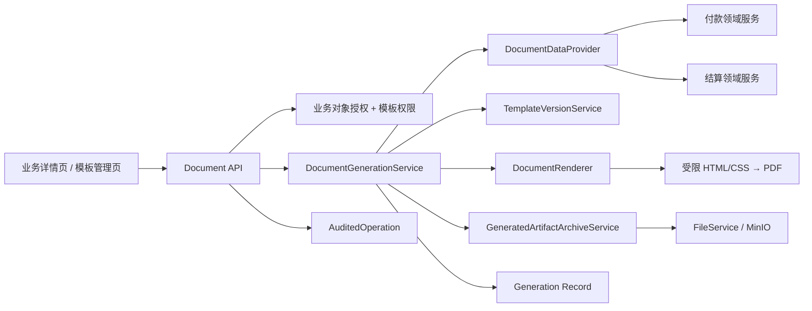
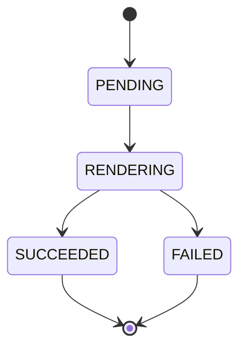

# 第48条主线：业务单据模板与可审计 PDF 生成任务计划书

**Goal:** 在不复制第二套审批、文件、权限或报表平台的前提下，为 cgc-pms 建立“规范化业务输出模型 → 版本化模板 → 预览/生成 PDF → 不可变文件归档 → 权限与审计”的最小闭环，首批交付付款申请单和结算单，并以金额、租户、项目、审批状态及历史文档不可变为核心验收方向。P0 不把输出摘要表述为完整业务数据快照。
**Architecture:** 采用“业务输出模型（Provider）+ 版本化模板 + 受限渲染适配器 + 追加式生成记录 + 生成文件归档适配器”的分层架构；后端在独立 `document` 责任域中编排数据、模板和渲染，通过受控内部接口复用 `UserContext`、业务对象授权、`FileService`/MinIO 与 `@AuditedOperation`，前端仅提供模板选择、预览、生成和下载入口。MVP 使用受限 HTML/CSS 模板生成 PDF，不建设通用拖拽低代码平台，不直接绑定数据库列，不执行模板脚本，不自动发送外部邮件，不把图片签章视为可信电子签名。

> 计划状态：M4已通过 / M5候选门（未启动）
> 计划类型：产品能力、跨模块业务输出、权限与数据一致性
> 适用范围：付款申请、结算、合同/发票后续扩展、报表目录、文件归档、审计与下载
> 授权边界：M0～M4 已在本分支完成本地实施与验收；本计划书的进度回写不构成提交、推送、合并或生产发布授权。

## 一、背景、来源与问题定义

### 1.1 外部产品事实

2026-07-16 对 DocuGenius 官方飞书知识库《了解排版打印插件》及其关联说明做了只读核验。其稳定能力不是单一“打印按钮”，而是：

1. 将审批或业务数据映射为普通字段、系统字段和循环明细。
2. 用模板控制字段顺序、版式、条件显隐、金额/日期格式化、纸张与页眉页脚。
3. 由管理员创建、发布、启用、停用和复用模板，普通用户选择已发布模板生成文档。
4. 同时提供在线模板与 Office 模板，生成 PDF 后可归档或进入后续交付流程。
5. 支持附件、签名、图章和邮件自动化，但这些能力带来额外权限、合规和交付风险。

官方来源：<https://docugenius.feishu.cn/wiki/wikcn6EKNA9Joktg78my7sIZeab?from=from_copylink>。

外部产品宣称的“效率提升 80%/90%”缺少可复核口径，本计划不引用其作为收益基线。竞品具备某能力也不等于 cgc-pms 必须照搬；本计划只吸收与当前业务闭环匹配的最小结构。

### 1.2 当前项目事实

1. cgc-pms 已有 `report` 目录，但当前主要聚合既有页面/API，不是文档模板或 PDF 生成引擎。
2. 现金日记账已有同步 CSV 导出、专用权限和下载审计，证明可复用“查询口径 + 文件响应 + 审计”边界；该能力不代表异步导出、对象存储报表或文档平台已形成。
3. `workflow` 已有审批模板、节点、条件和启停能力，但它负责“谁审批、如何流转”，不能复用为“单据如何排版”的输出模板。
4. `file` 已有 MinIO 存储、文件类型校验、业务对象绑定、授权下载和审计基础，可作为生成文件的唯一归档入口。
5. `invoice` 使用 PDFBox 做发票 PDF 文本识别，属于输入识别，不具备 HTML/业务数据到 PDF 的输出渲染能力。
6. 付款、结算P0业务闭环已有现行标准，但当前项目地图仍将付款、结算、发票、工作流和文件标为 `Partial`；实施本计划前必须先冻结首批输出契约，不得把文档域直接绑定未审定字段。
7. `project-map.md` 将结算、付款资金、发票识别均标记为 Partial，并明确金额、财务回写、附件、权限和跨业务状态一致性需要复验。

### 1.3 要解决的问题

当前业务人员可以查看页面、下载个别 CSV、上传或识别 PDF，但缺少统一能力将已审批业务事实生成可打印、可下载、可追溯的正式单据。若各模块自行拼接 HTML、调用浏览器打印或单独生成文件，会造成：

- 金额、日期、明细和审批轨迹口径重复实现。
- 历史模板被修改后无法解释旧文件来源。
- 预览与最终 PDF 不一致。
- 文件下载绕开业务权限或租户/项目范围。
- 付款、结算、合同各建一套模板和渲染逻辑。
- 批量生成或邮件失败与业务事务耦合。

本主线要补的是“业务单据输出层”，不是重做报表中心，也不是重做审批引擎。

## 二、目标、成功标准与非目标

### 2.1 核心目标

1. 建立独立、可扩展的业务输出模型，不让模板直接依赖表结构或前端 VO。
2. 建立不可变的模板版本和发布机制，历史生成文件可追溯到明确模板版本。
3. 首批打通付款申请单和结算单的预览、生成、归档、下载与审计。
4. 统一普通字段、循环明细、条件显隐、金额/日期格式化四项最小模板语义。
5. 复用现有租户、项目、业务对象、文件与审计边界，不新增平行授权体系。
6. 为后续合同、对账、发票分配、批量生成和 Office 模板留下适配边界，但不提前实现。

### 2.2 可量化成功标准

| 维度 | 成功标准 |
| --- | --- |
| 数据正确性 | PDF 抬头、主数据、明细、金额、币种、日期、审批状态与服务端业务详情一致；金额合计沿用业务服务口径，不在模板中重算 |
| 历史稳定性 | 已成功生成的文件不因模板编辑、业务后续变更或默认模板切换而改变 |
| 权限 | 无业务对象查看权限者不能预览、生成或下载；模板维护与单据生成权限分离 |
| 租户隔离 | 模板、版本、生成记录、文件和业务数据均按认证租户隔离，客户端 tenantId 不可信 |
| 模板治理 | 只有通过校验并发布的版本可供业务用户生成；草稿、停用版本不可被新生成请求使用 |
| 可观测性 | 每次生成有 generationId、模板版本、业务对象、操作者、结果、耗时和失败分类；日志不输出完整业务数据 |
| 渲染一致性 | 预览和正式生成使用同一数据 Provider、同一模板版本和同一渲染器 |
| 性能基线 | M0 用代表性付款/结算样本冻结单份生成基线；正式验收不得出现无界内存增长、外部资源阻塞或请求线程无限等待 |

### 2.3 非目标

- 不在 MVP 建设通用拖拽设计器、低代码页面搭建器或任意表达式语言。
- 不在 MVP 支持 DOCX、XLSX、PPTX 三类 Office 模板。
- 不允许模板执行 JavaScript、SpEL、SQL、网络请求或任意反射调用。
- 不自动提交审批、不修改付款/结算/发票状态、不回写业务金额。
- 不自动发送邮件、短信、飞书或其他外部消息。
- 不实现批量导出、异步任务平台、对象存储生命周期平台或完整经营分析。
- 不合并、伪造或重新定义电子签名；图片签名和图章进入独立合规评审后再决策。
- 不把现有审批模板表扩成打印模板表，两者职责必须分离。
- 不连接生产数据库，不迁移或回填生产历史文件。

## 三、范围与首批业务闭环

### 3.1 P0：付款申请单

输出模型建议命名为 `PaymentApplicationDocumentModel`，至少包含：

- 单据标识：申请 ID、申请编号、业务类型、状态、创建/提交/审批时间。
- 主体信息：租户显示名称、项目、合同、合作方、申请人、所属组织。
- 金额信息：申请金额、批准金额、币种、财务大写、累计付款及适用余额。
- 来源明细：费用/结算/合同等来源类型、来源编号、来源金额、本次申请金额。
- 发票分配：发票号码、发票类型、含税金额、已分配/本次分配金额。
- 收款信息：收款单位、银行、账号的脱敏展示口径。
- 附件清单：只展示有权查看的文件名、文档类型和必要摘要，不把预签名 URL 写入模板。
- 审批轨迹：节点、审批人显示名、动作、意见、时间；不暴露内部配置 JSON。

P0 验收必须覆盖普通付款、无发票付款、多来源付款、长明细分页、驳回/草稿禁止生成、审批后生成和跨项目越权。

### 3.2 P0：结算单

输出模型建议命名为 `SettlementDocumentModel`，至少包含：

- 结算主信息：结算编号、项目、合同、结算对象、期间、状态。
- 金额基线：合同金额、变更、累计确认、本期结算、扣款、税额、应付/实付。
- 结算明细：项目、单位、数量、单价、金额、来源及备注。
- 付款关联：付款申请、付款记录、累计支付和未付余额。
- 附件与审批轨迹：与付款申请同一输出规范。

结算金额必须来自现有金额策略和服务快照，不允许模板层自行推导公式；基线版本变化时必须产生新的 sourceDigest。

### 3.3 后续候选

以下能力不进入 P0，仅在 P0 稳定且项目情报重新排序后逐项形成 Candidate：

1. 合同/补充协议和合同付款证书。
2. 客户或供应商对账单。
3. 发票及付款分配清单。
4. 费用报销单和附件合并。
5. 批量生成、异步导出、自动邮件和交付状态。
6. Office 模板、可视化设计器、签名和图章。

## 四、总体架构



### 4.1 分层职责

| 组件 | 职责 | 禁止事项 |
| --- | --- | --- |
| `DocumentDataProvider` | 按 businessType/businessId 读取并组装稳定输出模型 | 不返回实体、不接受客户端 tenantId、不在模板中查库 |
| `TemplateVersionService` | 草稿、校验、发布、停用、默认版本与字段契约检查 | 不处理业务金额、不修改历史版本 |
| `DocumentRenderer` | 将已校验模板和不可变模型渲染为 PDF 字节流 | 不访问数据库、不发网络请求、不执行脚本 |
| `DocumentGenerationService` | 权限校验、幂等、状态机、渲染、文件归档和生成记录 | 不改变业务单据状态、不发送外部消息 |
| `GeneratedArtifactArchiveService` | 接收服务端生成的 PDF、校验类型与摘要、映射现有文件业务类型、归档并返回 fileId | 不复用客户端上传权限语义、不返回匿名地址、不允许删除成功文档 |
| `FileService` | 提供对象存储、受控下载、业务对象二次授权和文件生命周期基础能力 | 不把服务端生成物伪装成用户上传、不绕过业务对象授权 |
| 前端业务入口 | 选择模板、预览、生成、查看历史和下载 | 不在浏览器拼接正式 PDF、不计算正式金额 |

### 4.2 输出模型契约

每个 Provider 必须声明：

```text
businessType
schemaVersion
supportedStatus
fieldCatalog
build(businessId, authenticatedContext)
authorize(action, businessId, authenticatedContext)
```

模板只绑定字段目录中的稳定逻辑名，例如 `payment.amount.approved`、`settlement.items[].amount`，不绑定 `pay_application.approved_amount` 等数据库列名。字段目录包含类型、是否可空、是否为集合、格式化白名单和脱敏要求。

### 4.3 渲染技术决策

M0 建立 `DocumentRenderer` 适配器并做有界技术尖峰，首选受限 HTML/CSS 到 PDF 的纯后端实现。进入 M1 前必须冻结：

1. 中文字体嵌入和许可证/分发边界。
2. 表格跨页、页眉页脚、分页符、图片和长文本行为。
3. 禁止外部 URL、脚本、远程字体和文件路径逃逸的配置。
4. 依赖许可证、维护状态、Java 21 兼容性和漏洞扫描结果。
5. 代表性付款/结算样本的耗时、峰值内存和最大页数守卫。

若首选实现未通过上述门禁，M0 结论为“不通过/需要确认”，不得为了赶进度退回浏览器 `window.print()` 作为正式生成方案。

### 4.4 生成文件归档契约

M1 必须为服务端生成物定义独立内部契约，不直接调用面向用户上传的 `FileService.upload(MultipartFile, ...)`：

```text
archiveGeneratedArtifact(
  generationId,
  documentBusinessType,
  businessId,
  pdfBytes,
  outputSha256,
  rendererId,
  rendererVersion
) -> fileId
```

- `PAYMENT_APPLICATION` 显式映射到现有文件业务类型 `PAYMENT`，`SETTLEMENT` 映射到 `SETTLEMENT`；Provider 类型、文件类型和权限类型不得靠字符串碰巧相等。
- 归档入口必须校验 PDF 魔数、MIME、字节上限和 `outputSha256`，但不执行用户上传专用的上传权限、重复上传提示或客户端文件名逻辑。
- 对相同 PDF 字节，允许底层内容寻址复用对象；每次正式生成仍保留独立 generation 记录和生成编号。不得因现有 `FILE_DUPLICATE` 语义丢失生成审计。
- 成功生成文件使用不可删除的 `GENERATED_DOCUMENT` 文档类型；普通文件删除入口必须 fail-close，保留期清理只能走另行授权、可审计的归档策略。
- MinIO 写入与数据库提交之间采用可恢复状态加对账/补偿；补偿只能清理未被任何成功 generation 引用的孤儿对象。

## 五、数据模型与状态机

实施时 migration 编号必须基于当时分支的下一空闲版本分配，并同步提供 MySQL/H2 脚本；当前MySQL已有V211而H2镜像尚未对称，计划书不预占具体版本号，M1前必须先解除该基线阻塞。

### 5.1 `biz_document_template`

| 字段 | 说明 |
| --- | --- |
| `id`、`tenant_id` | 主键与租户边界 |
| `template_code` | 租户内稳定编码 |
| `template_name` | 展示名称 |
| `business_type` | `PAYMENT_APPLICATION`、`SETTLEMENT` 等 |
| `engine_type` | MVP 固定 `HTML_PDF` |
| `enabled` | 模板容器是否允许维护/发布 |
| `deleted_token` | 非空活动唯一标记；活动行为 `0`，逻辑删除后写入本行 ID |
| 通用审计字段 | 创建人、更新人、时间、逻辑删除标志等 |

活动记录唯一约束至少覆盖 `tenant_id + template_code + deleted_token`；不得使用允许多个 `NULL` 的软删除列模拟活动行唯一性。删除默认使用逻辑删除；已有生成记录引用时禁止物理删除。

### 5.2 `biz_document_template_version`

| 字段 | 说明 |
| --- | --- |
| `id`、`tenant_id` | 主键与租户边界；不得依赖父表联查后才做租户隔离 |
| `template_id`、`version_no` | 模板与单调递增版本 |
| `status` | `DRAFT`、`PUBLISHED`、`DISABLED` |
| `schema_version` | Provider 输出模型版本 |
| `template_content` | 受限模板正文；是否拆对象存储由 M0 尺寸基线决定 |
| `content_hash` | 模板内容摘要 |
| `field_manifest` | 发布时冻结的字段引用清单 |
| `published_by/at` | 发布审计 |

已发布版本不可原地编辑；修改必须复制为新草稿。停用只影响新生成，不影响历史下载。

唯一约束覆盖 `tenant_id + template_id + version_no`。`template_id` 必须引用同租户模板；Service 写入前和数据库约束共同阻止跨租户组合。

### 5.3 `biz_document_default_binding`

| 字段 | 说明 |
| --- | --- |
| `tenant_id`、`business_type` | 联合主键；每租户、每业务类型仅一条当前默认绑定 |
| `template_id/template_version_id` | 当前默认模板及其已发布版本 |
| `lock_version` | 并发切换 CAS/乐观锁版本 |
| `updated_by/at` | 默认切换审计 |

默认切换必须在单事务内校验模板、版本、业务类型和租户一致，并以联合主键加 `lock_version` 保证并发时只有一个结果生效。模板容器不再自行保存 `default_version_id`。

### 5.4 `biz_document_generation`

| 字段 | 说明 |
| --- | --- |
| `id`、`tenant_id` | 主键与租户边界；所有按 ID/业务对象查询均由租户拦截器保护 |
| `generation_no` | 对外稳定生成编号 |
| `business_type/business_id` | 来源业务对象 |
| `template_id/template_version_id` | 使用的不可变模板版本 |
| `schema_version` | 使用的输出模型版本 |
| `source_digest` | 规范化输出模型摘要，不包含密钥 |
| `output_sha256` | 最终 PDF 字节摘要，用于完整性核验 |
| `renderer_id/renderer_version` | 渲染实现与版本；字体包版本写入受控生成元数据 |
| `status` | `PENDING`、`RENDERING`、`SUCCEEDED`、`FAILED` |
| `file_id` | 成功后绑定现有 `sys_file` |
| `idempotency_key` | 防止重复点击造成并发重复生成 |
| `retry_of_generation_id` | 重试时指向原失败记录，可空；禁止覆盖原记录 |
| `failure_code` | 稳定失败分类，不保存原始敏感堆栈 |
| `requested_by/at`、`completed_at` | 请求与完成审计 |

唯一约束至少覆盖 `tenant_id + generation_no` 和 `tenant_id + idempotency_key`。模板、版本、业务对象、文件和重试来源均必须通过租户一致性检查；MySQL/H2 保持相同约束意图。

P0 不保存完整业务源快照，也不承诺“按旧业务数据重新生成完全相同文件”；正式历史证据是已归档 PDF、`outputSha256`、不可变模板版本、`sourceDigest`、渲染器/字体包版本和生成元数据。`sourceDigest` 只证明规范化输出模型摘要，不宣称能够还原当时每个来源字段。若未来需要保存完整源快照，必须另做隐私、容量、加密和保留期评审。

### 5.5 状态机



- `SUCCEEDED`、`FAILED` 均为不可回退、不可覆盖终态；任何重试都新建 generation，并通过 `retry_of_generation_id` 关联原失败记录。
- 同一幂等键始终返回同一 generation 及其当前/最终结果；重试必须使用新幂等键。
- 对象归档成功但生成记录落库失败必须有补偿清理或可恢复记录，不能留下无归属对象。
- 业务事务与文件生成事务分离；生成失败不能回滚或改变业务单据。

## 六、模板能力与安全边界

### 6.1 MVP 支持

1. 文本和安全 HTML 结构。
2. 白名单字段插值。
3. 集合循环，仅允许遍历字段目录声明的集合。
4. 条件显隐，仅允许空值、布尔、枚举等值判断和受控数值比较。
5. 金额、数字、百分比、日期、日期时间和财务大写格式化。
6. 固定图片/Logo 与经授权的业务图片引用。
7. A4 纸张、页边距、分页、页眉页脚、页码和表格跨页。

### 6.2 明确禁止

- 任意脚本、表达式求值、反射、类访问、SQL 和文件系统访问。
- `http://`、`https://` 或协议相对外部资源；渲染过程不得访问互联网或内网 URL。
- 客户端直接提交完整业务数据作为正式生成源。
- 未经授权的附件 URL、预签名 URL、访问令牌和内部对象存储路径进入模板。
- 模板层自行计算应付、已付、税额、余额等正式业务金额。
- 未限定次数或深度的嵌套循环、递归引用和超大 base64 资源。

### 6.3 发布前校验

发布必须一次性通过：

1. 模板语法校验。
2. 字段清单与 schemaVersion 校验。
3. 禁止表达式和资源校验。
4. 代表性数据预览。
5. 空值、长文本、零明细、多明细和跨页样本。
6. PDF 可打开、页数守卫和内容摘要检查。

字段缺失、类型不匹配或模板导入后变量失效必须阻止发布，不允许运行时静默输出空白正式文件。

## 七、权限、租户、审计与合规

### 7.1 建议权限

| 权限 | 用途 |
| --- | --- |
| `document:template:query` | 查看模板与版本元数据 |
| `document:template:maintain` | 创建草稿、编辑和校验 |
| `document:template:publish` | 发布、设默认、停用 |
| `document:generate` | 对有权业务对象生成文档 |
| `document:history:query` | 查看生成历史 |
| `document:download` | 下载有权业务对象的生成文件 |
| `document:audit:download` | 来源业务对象已归档或普通路径不可见时，由获授权审计角色下载历史证据 |

权限码只是第一层；生成和下载还必须调用对应业务域的对象授权逻辑。ADMIN/SUPER_ADMIN 是否拥有默认权限沿用项目现行角色策略，不在代码中散落硬编码。

普通生成、历史查询和下载统一按业务对象**当前可见性**授权，不按生成时权限快照冻结。业务对象已删除、归档或普通授权链无法解析时，普通下载 fail-close；确有法务/审计保留需求时，只允许 `document:audit:download` 受控入口访问，要求明确角色、原因、审计事件和最小字段返回，不复用普通业务下载接口。

### 7.2 审计事件

至少记录：模板创建、校验、发布、停用、默认切换、预览、正式生成、重试、下载、审计下载和失败。`@AuditedOperation` 记录同步 API 操作；generation 状态迁移、归档补偿和对账恢复另发领域审计事件，不能只依赖 Controller 方法返回。审计中记录 ID、类型、结果和操作者，不记录完整模板变量值、银行账号、身份证号、附件内容或 PDF 字节。

### 7.3 敏感数据

- 银行账号、身份证号、手机号等字段由 Provider 明确全量/脱敏策略，模板不能自行取消脱敏。
- 预览与正式下载必须使用相同权限，不得因预览是临时文件而降低保护。
- 预览默认同步返回、不写入 `sys_file`，必须带“非正式文件”水印并受相同渲染资源上限约束；若 M0 证明必须落临时文件，则先定义 TTL、加密、清理和下载审计，不得复用正式 generation。
- 日志、指标标签和错误响应不得包含姓名、账号、金额明细或模板正文。
- 生成文件保留期、自动清理和法律归档要求在 M0 确认；未确认前不得自动删除成功文件。

## 八、API 与前端交互

### 8.1 建议 API

| 方法与路径 | 作用 |
| --- | --- |
| `GET /document-templates` | 按业务类型和状态查询可见模板 |
| `GET /document-templates/{id}` | 查询模板与版本元数据 |
| `POST /document-templates` | 创建模板容器和首个草稿 |
| `POST /document-templates/{id}/versions` | 从当前版本创建新草稿 |
| `PUT /document-template-versions/{id}` | 编辑草稿 |
| `POST /document-template-versions/{id}/validate` | 校验并生成受控预览 |
| `POST /document-template-versions/{id}/publish` | 发布不可变版本 |
| `POST /document-template-versions/{id}/disable` | 停用新生成入口 |
| `POST /documents/generations` | 正式生成，要求幂等键 |
| `GET /documents/generations/{id}` | 查询结果与失败分类 |
| `GET /documents/generations` | 按业务对象查询历史 |

普通下载复用现有文件服务受控入口，并按生成记录解析来源业务对象后执行当前权限二次校验；审计下载使用单独权限和审计事件。不得新建绕过 `FileService` 的匿名 PDF 下载端点。

### 8.2 前端最小交互

付款和结算详情页增加“生成单据”入口：

1. 读取当前业务对象可用的已发布模板。
2. 默认选择租户当前默认模板，用户可切换。
3. 支持只读预览；预览标记“非正式文件”。
4. 用户确认后正式生成，防重复点击并展示明确状态。
5. 成功后展示生成编号、模板版本、生成时间和下载入口。
6. 可查看该业务对象历史生成记录；历史记录不能覆盖、删除或重新绑定。

模板管理页在 M4 交付；M1～M3 可先使用受控系统模板和管理 API，避免拖拽设计器阻塞首个业务闭环。

## 九、分阶段实施

### M0：决策门、契约冻结与技术尖峰

**目标：** 在写业务代码前证明方向、数据和渲染可行。

**任务：**

1. 将本计划关联当前 `project-map.md` 和 `evolution-decision.md`，形成合格产品 Candidate；不得从本计划直接跳过 Candidate/Ready 进入 AutoPilot。
2. 等当前付款/结算/发票闭环 diff 收口后，重新核对分支、迁移和稳定 VO/Service。
3. 冻结首批两种输出模型、字段目录、允许状态、脱敏规则和金额事实源。
4. 完成渲染器尖峰：中文字体、表格分页、图片、页眉页脚、长明细、内存、超时和安全资源加载。
5. 冻结生成文件内部归档契约、`PAYMENT_APPLICATION -> PAYMENT` 文件业务类型映射、成功文件不可删除规则、孤儿对账方案和预览生命周期。
6. 冻结三张核心表加默认绑定表的 `tenant_id`、外键/唯一约束、活动行唯一机制、幂等与追加式重试语义。
7. 明确文件保留期、审计下载角色、模板维护角色、首批金丝雀租户/角色和打印样式样本。
8. 形成风险审查，特别覆盖许可证、模板注入、SSRF/本地文件读取、租户与业务授权。

**退出标准：** Candidate 通过决策门；Provider 契约和技术选型有可复验证据；任何核心前置未通过则保持 Candidate，不进入 M1。

**2026-07-17 实施进度：**

- 已完成：`DOCUMENT-GENERATION-001` Candidate、`PI-2026-07-17-11`、项目地图和Current Focus回写。
- 已完成：Provider稳定逻辑字段、安全边界、归档/幂等原则和唯一阻塞承接，见[业务单据生成 Provider 与渲染契约](../business/document-generation-provider-contract.md)。
- 已完成：OpenHTMLtoPDF 1.1.40测试级尖峰和PDFBox 3.0.8安全基线；中文长表分页、页眉页脚、内嵌图片、PDF读取、HTTP/本地文件拒绝2项通过，既有发票识别29项通过。
- 已完成：默认样式、状态、脱敏、保留期、角色、金丝雀、OpenHTMLtoPDF/PDFBox/Noto开发选择和初始资源守卫已批准；V211 H2镜像、H2专项27项和真实MySQL V1→V211 smoke通过。
- M0结论：通过，Candidate决策完成；M1使用下一空闲V212进入文档域基础设施实施。生产发布仍需许可证材料、代表性业务样本和金丝雀证据。

### M1：文档域基础设施与系统模板

**目标：** 建立不依赖具体业务模块的模板、版本、生成、渲染和文件归档骨架。

**任务：**

- 新建 `document` 后端责任域、实体/Mapper/Service/Controller 和 MySQL/H2 migration。
- 实现模板版本状态机、字段清单校验、发布不可变和停用行为。
- 实现 `DocumentRenderer` 接口、受限 HTML/PDF 适配器和资源加载器。
- 实现生成记录、追加式重试、幂等、失败分类、`outputSha256`、生成文件内部归档、不可删除保护、孤儿对账/补偿和领域审计。
- 增加权限 seed 与权限回归。
- 提供一个不含真实业务数据的测试 Provider 和系统模板，验证端到端骨架。

**验收：** 模板草稿不能正式生成；发布后可生成并归档；停用后禁止新生成但历史仍可下载；跨租户、字段注入和外部资源访问测试通过。

**M1实施结果（2026-07-17）：通过。**

- V212 MySQL/H2建立模板、不可变版本、默认绑定和追加式生成记录，权限2120～2126同步落库；真实MySQL从V1迁移至V212通过，H2完整上下文与迁移静态契约通过。
- OpenHTMLtoPDF 1.1.40、PDFBox 3.0.8及随包 `ph-fonts-noto-sans-sc:6.1.0` 进入生产依赖；中文可提取、外部资源拒绝、模板字段转义、资源上限和有界渲染通过。
- 模板草稿/发布/停用/默认绑定CAS、生成PENDING→RENDERING→SUCCEEDED/FAILED、幂等、追加重试、SHA-256、内部归档、成功文件不可删除和对账查询已实现。
- 普通下载继续按当前业务权限fail-close；审计下载独立要求SUPER_ADMIN、`document:audit:download`和4～200字原因，允许业务归档后在租户内取证，并产生独立审计操作。
- 全局、付款、结算生成开关默认关闭；历史和既有成功文件下载不随生成开关关闭。M1汇总批次106项通过，文件专项39项与阶段关键回归均通过。
- M1未实现真实付款/结算完整字段、系统生产模板、前端入口或浏览器验收；这些仍由既有M2～M4唯一承接，不构成新增悬空项。生产发布继续受代表性样本、LGPL/OFL材料复核和dev/test/demo金丝雀门禁约束。

### M2：付款申请单闭环

**目标：** 用真实付款服务完成首个可用业务单据。

**任务：**

- 实现 `PaymentApplicationDocumentProvider`，复用现有付款详情、来源完整性、发票分配、文件与审批数据。
- 建立首个系统付款申请模板，覆盖抬头、金额、来源明细、发票、收款信息、附件清单和审批轨迹。
- 在付款详情页加入模板选择、预览、生成、历史与下载入口。
- 绑定付款业务对象授权；草稿、驳回、数据完整性失败时按冻结规则拒绝生成。

**验收：** 至少覆盖零/单/多来源、零/多发票、长明细、多角色、跨项目和重复点击；PDF 金额与服务端结果逐字段一致。

**M2实施结果（2026-07-17）：通过。**

- `PaymentDocumentDataProvider` 复用付款全链追溯与权威付款、来源、依据、发票、附件和审批数据；金额只格式化、不在模板重算，银行账号与手机号按冻结口径脱敏。单层有界 `#each` 仅允许Map行、自动HTML转义、禁止嵌套和表达式，并保留200项集合上限与完整路径字段校验。
- 自动化已覆盖零/单/多来源、零/多发票、80/25长明细、拒绝状态、重复请求、金额逐字段和权限负向；M2专项后端 `33 + 8 + 4 + 3 + 1 + 1 = 50` 项、付款页专项前端13项均通过。
- 付款页已完成预览、幂等生成、历史和下载入口。真实dev角色验收确认：有权财务用户可预览并生成归档；无项目可见范围角色列表返回空且不再请求无权参考数据；跨项目保护由既有 `ProjectAccessChecker` 统一执行。
- 系统付款模板以追加版本方式修复页码中文字体：旧发布版本及其历史文件保持不可变，系统默认安全迁移至新版本，已有自定义默认模板不被覆盖。新生成PDF的数据库SHA-256与文件一致，金额、中文申请事由和“第1页/共1页”页脚均已进行文本与视觉复核。
- 本轮发现项均已本轮修复并复验：付款列表未按项目数据范围收敛、无权限参考接口请求、页脚中文字体缺失。旧版本地样本的乱码属于历史测试输入，未修改其不可变归档；新样本已验证正确中文输出。
- 收口：新增后续项0，关闭后续项0，后续项净变化0；M2退出门满足，可进入M3。

### M3：结算单闭环与跨域复用证明

**目标：** 用第二个业务域证明架构不是付款专用实现。

**任务：**

- 实现 `SettlementDocumentProvider`，复用结算金额策略、版本化基线、明细、付款关联和审批轨迹。
- 建立结算系统模板和前端生成入口。
- 抽取付款/结算真正共享的审批轨迹、附件清单、组织抬头和格式化组件；禁止为“复用率”提前泛化业务金额模型。
- 复验模板版本、历史下载和 Provider schema 升级策略。

**验收：** 合同金额、变更、累计结算、本期金额、扣款和应付口径与当前结算服务一致；基线变更产生新 sourceDigest，旧文件保持不变。

**完成结果（2026-07-18）：**

- `SettlementDocumentDataProvider` 已从现有结算查询服务构造 `settlement.v1` 输出模型；正式生成只接受已审批且已定案结算，预览仅允许审批中/已审批结算，金额全部复用结算权威字段，不在模板层重算。
- 系统结算模板、结算详情页预览/幂等生成/历史/下载入口及历史记录已闭环；生成附件不会再次进入结算附件清单，避免生成自身改变后续 sourceDigest。
- 签名下载区分 Docker 内部对象 I/O 地址与浏览器可达公开地址，并显式传入 MinIO region，避免内部服务名或 region 探测导致浏览器下载失效；生产编排要求显式配置公开地址。
- 自动化覆盖结算 Provider、受控模板、Controller 权限、生成文件排除、文件签名地址和 sourceDigest 变化；本地开发库隔离金丝雀以真实 FINANCE 角色完成预览、生成、历史、下载审计及 PDF 字节、页数、SHA-256、结算编号和关键金额核对。
- 收口：生成附件自包含风险、Docker 内部签名地址和公开地址 region 探测均已本轮修复并复验；新增后续项0，关闭后续项0，后续项净变化0；M3退出门通过。

### M4：模板治理页面与多模板

**目标：** 让授权管理员在受控范围内维护 HTML 模板，而不是依赖数据库手工修改。

**任务：**

- 增加模板列表、版本、草稿编辑、字段目录、校验预览、发布、停用和默认切换页面。
- 编辑器只提供受限源码/结构编辑和字段插入辅助，不建设自由拖拽设计器。
- 增加模板复制/导出/导入时的 schema 与字段清单校验。
- 增加同一业务类型多模板选择和默认模板冲突控制。

**验收：** 维护、发布和业务使用权限严格分离；无效字段无法发布；导入后字段不匹配显式失败；并发默认切换只有一个生效版本。

**完成结果（2026-07-18）：**

- 后端字段目录直接绑定付款与结算 Provider 的稳定输出契约；服务端在创建、编辑、导入、复制和发布前统一校验 schema、字段清单、字段引用、单层循环及循环上下文，未知字段或越出集合上下文的字段不能进入可发布版本。
- 模板治理 API 已覆盖列表、详情、字段目录、草稿校验、复制、导入、导出、发布、停用和默认绑定；版本状态保持不可变发布语义，同业务类型可维护多个模板，由唯一默认绑定决定正式生成版本。
- 管理页仅提供受限 HTML/CSS 源码编辑、字段插入和单层循环辅助，不提供自由拖拽、脚本或外部资源入口。模板查询、编辑、发布与业务生成权限分离；保存版本预览同时要求模板编辑、生成及业务对象访问权限，并且不写生成记录或文件归档。
- 默认绑定使用租户与业务类型联合主键加 CAS 锁版本。陈旧锁版本切换被明确拒绝，当前有效默认版本保持不变；集成回归覆盖该冲突路径。
- 后端模板、生成、权限和两类系统模板定向回归通过；前端模板管理页与路由 48 项通过，类型检查通过；浏览器以管理员身份完成字段插入、无效字段校验拒绝、付款/结算模板切换及已保存结算模板 PDF 预览复验。
- 收口：本地运行态曾使用旧后端包且前端代理仍指向旧容器地址，按重新打包并重建开发容器后复验通过，归类为本轮运行态刷新并已修复；新增后续项0，关闭后续项0，后续项净变化0；M4退出门通过。M5仍须先有单份同步生成无法满足真实需求的证据，不能因本阶段完成而自动启动。

### M5：批量、异步与交付候选门

M5 不是本主线默认实施范围。只有单份生成数据证明同步请求不满足真实需求时，才重新评估：

- 异步生成任务和队列。
- 批量选择、限流、失败重试和部分成功结果。
- 文件过期与清理。
- 邮件/飞书交付、收件人授权和重复发送防护。
- Office 模板、附件合并、签名和图章。

每项必须单独给出用户价值、证据、权限、回滚与验收，不得因“竞品已有”整体打包进入 M5。

## 十、测试与验收矩阵

### 10.1 后端测试

| 层级 | 必测内容 |
| --- | --- |
| 单元测试 | 字段目录、格式化、循环、条件、模板语法、状态机、sourceDigest、outputSha256、幂等、追加式重试、失败分类 |
| Provider 测试 | 付款/结算字段、空值、长明细、金额口径、脱敏、支持状态、业务授权 |
| Renderer 测试 | 中文、分页、表格跨页、页眉页脚、图片、字体、禁止外部资源、超限失败 |
| Service 集成 | 模板发布不可变、默认绑定 CAS、生成记录、相同 PDF 字节归档、成功文件禁止删除、孤儿对账/补偿、历史稳定 |
| Controller | 参数、权限、租户、项目范围、错误码、响应头、当前业务权限下载、审计下载与下载审计 |
| 数据库 | MySQL/H2 migration 对齐、每表 tenant_id、租户一致性、活动行唯一、默认绑定唯一、并发幂等、外键/引用边界 |

### 10.2 前端测试

- API 契约与错误映射。
- 业务状态与权限控制下按钮可见性。
- 模板为空、加载失败、预览失败、生成中、成功、失败和重试状态。
- 重复点击只产生一个有效请求。
- 历史记录展示模板版本、生成时间和结果，不提供覆盖或删除。
- 模板管理权限、字段校验错误和发布确认。
- `vue-tsc`、Vitest、格式与适用构建门禁。

### 10.3 安全与一致性验收

1. 伪造 tenantId、businessId、templateId、versionId、fileId 均不能跨范围访问。
2. 模板中的脚本、外链、文件路径、递归、超大资源和未声明字段被拒绝。
3. 下载权限与业务对象当前可见性一致；仅持有 fileId 不足以下载。
4. 付款/结算金额逐字段与当前服务结果一致，模板不进行正式金额重算。
5. 模板更新、默认切换和业务变更不改变既有成功 PDF。
6. 失败日志和审计不包含银行账号、身份证、完整附件 URL 或 PDF 内容。
7. 来源业务对象删除/归档后普通下载 fail-close；审计下载只有明确授权角色可用且产生独立审计事件。
8. `templateVersionId`、`retryOfGenerationId`、默认绑定和 `fileId` 的跨租户组合均被数据库或 Service 双重拒绝。

### 10.4 浏览器验收

使用当前项目规定的本地 dev-login 和真实角色，至少覆盖：

- 财务/商务角色生成有权付款申请单和结算单。
- 无权限角色不显示入口，直接调用 API 返回拒绝。
- 模板管理员发布新版本后业务用户可选择，停用后新入口消失。
- 预览、生成、历史、下载全链路可用，PDF 可打开且关键字段可人工核对。
- 浏览器验收只使用 dev/test/demo 数据，不连接生产。

## 十一、性能、容量与可观测性

### 11.1 初始守卫

具体阈值在 M0 基准后冻结，至少限制：模板大小、单次明细数、图片数量/总字节、最大页数、渲染超时、并发数和 PDF 字节数。超限应返回稳定业务错误，不允许 OOM、线程无限占用或静默截断。

### 11.2 指标与日志

建议指标：

- `document_generation_total{businessType,status}`
- `document_generation_duration_seconds{businessType}`
- `document_render_failure_total{failureCode}`
- `document_output_bytes{businessType}`

指标不得使用 tenantId、businessId、templateId 等高基数或敏感标签。结构化日志只记录 generationId、业务类型、模板版本 ID、状态、耗时和稳定失败码。

### 11.3 告警

只有在具备真实基线后才设置失败率、耗时和存储异常告警。M0 前不写拍脑袋阈值；MinIO 不可用、渲染超时和模板批量失败必须区分 `environment_prerequisite` 与真实模板/数据错误。

## 十二、迁移、发布与回滚

### 12.1 迁移策略

- 新表采用向前兼容 additive migration，不修改付款、结算、审批或文件核心表语义。
- MySQL 与 H2 同版本、同约束意图；测试数据库不得省略关键唯一约束。
- 首批系统模板通过明确 seed 或应用初始化策略创建，必须幂等；禁止覆盖租户已发布版本。
- 不回填历史付款/结算 PDF；历史生成从功能启用后开始。

### 12.2 灰度与开关

建议配置：

```text
document.generation.enabled=false
document.generation.business-types=PAYMENT_APPLICATION,SETTLEMENT
document.template.admin-enabled=false
```

先在 dev/test/demo 开启，验证系统模板和真实角色。进入后续环境必须先做单租户、单业务类型金丝雀，不得直接全量开放：

1. **范围：** 只选择一个明确授权租户，先开放 `PAYMENT_APPLICATION`，仅指定业务角色可见；模板管理开关保持关闭，使用已验收系统模板。
2. **进入条件：** M0 冻结金额样本、角色、性能/资源阈值和回滚负责人；租户、下载、文件不可变与金额一致性测试全部通过。
3. **观察证据：** 生成成功/失败、P95 耗时、资源超限、孤儿对账、金额逐字段一致、跨租户拒绝、下载审计和历史文件摘要；具体阈值由 M0 基线冻结，不在计划中猜测。
4. **停止条件：** 任一跨租户/项目访问、金额不一致、历史文件可删除/覆盖、下载绕权、不可恢复孤儿或资源守卫失效，立即关闭生成开关并判定金丝雀不通过。
5. **扩围条件：** 完成约定观察窗口且上述高风险事件为零，普通失败率与耗时满足 M0 阈值，形成验收记录并取得下一范围授权后，才可增加租户或开放 `SETTLEMENT`。

开关关闭时前端入口隐藏、生成 API fail-close；历史文件仍按当前业务权限或独立审计下载权限访问，不随生成开关失效。

### 12.3 回滚

1. 关闭生成与模板管理开关，停止新生成。
2. 回退前端入口和后端适配器，不删除成功文件和生成记录。
3. 不执行破坏性 down migration；新表保留以支撑历史审计。
4. 渲染依赖出现漏洞或兼容问题时，可禁用渲染但保留历史下载。
5. 模板内容错误时发布新版本并停用旧版本，不覆盖历史版本和历史 PDF。

## 十三、实施文件边界

预计新增或修改范围如下，最终以 M0 契约和当前分支核验为准：

```text
backend/src/main/java/com/cgcpms/document/**
backend/src/main/java/com/cgcpms/file/service/**
backend/src/main/java/com/cgcpms/file/auth/**
backend/src/main/resources/db/migration*/Vxxx__create_document_generation_core.sql
backend/src/test/java/com/cgcpms/document/**
backend/src/test/java/com/cgcpms/file/**
frontend-admin/src/api/modules/document.ts
frontend-admin/src/types/document.ts
frontend-admin/src/pages/document-template/**
frontend-admin/src/pages/payment/**
frontend-admin/src/pages/settlement/**
frontend-admin/src/router/**
frontend-admin/src/**/__tests__/**
docs/business/document-generation-contract.md
docs/product-intelligence/project-map.md
docs/product-intelligence/evolution-decision.md
docs/backlog/唯一适用治理载体
```

禁止顺带重构完整报表中心、审批引擎、文件平台、付款/结算金额模型或全站权限体系。

## 十四、Git、实施路由与阶段收口

1. 本计划已在 `codex/document-generation` 功能分支启动；实施者必须持续保护用户已有 `README.md` 和计划书改动，不得把无关工作树变化混入本主线。
2. 不得直接在 `master` 实施或推送；建议功能分支使用 `codex/document-generation` 或按届时主线命名。
3. M0～M4 每阶段进入写入前重新核对分支和 `git status --short`；数据库、权限、金额和租户边界变化时提高验证与复核强度。
4. 提交、推送、PR、合并和生产发布分别需要独立授权。
5. 每阶段必须回看当前路由是否仍合理：实现阶段可由主线程直接执行；切换到安全/数据一致性验收和上线裁决时必须补充独立证据，但不机械要求子智能体。

阶段收口必须给出：正式交付物、验证命令与结果、权限/数据审查、迁移与回滚、Git 状态、阻塞、剩余风险、新增后续项、关闭后续项和净变化。

## 十五、风险清单

| 风险 | 等级 | 控制措施 | 阻塞条件 |
| --- | --- | --- | --- |
| 付款/结算字段仍在变化 | 高 | M0 冻结 Provider 契约，等待当前闭环收口 | 无稳定金额事实源或状态语义 |
| 模板注入、SSRF、文件读取 | 高 | 受限语法、禁外链、资源白名单、安全测试 | 渲染器无法 fail-close |
| 跨租户/项目越权 | 高 | 认证租户、业务对象 Authorizer、fileId 二次授权 | 任一直接对象引用可越权 |
| 金额与正式业务口径不一致 | 高 | Provider 复用领域服务，模板禁止重算 | PDF 与服务端金额不一致 |
| 历史模板/文件被覆盖 | 高 | 不可变版本、追加生成、禁原地更新 | 历史文件无法追溯版本 |
| 中文字体或分页不稳定 | 中高 | M0 技术尖峰和黄金样本 | 关键版式无法确定性生成 |
| PDF 生成耗尽内存/线程 | 高 | 尺寸、页数、超时、并发守卫和基准 | 无法限制资源或稳定复现 OOM |
| 文件成功、数据库失败形成孤儿 | 中高 | 补偿清理、可恢复状态、故障注入测试 | 无可靠补偿/对账方式 |
| 过早建设拖拽/Office/邮件 | 中 | 非目标和 M5 决策门 | P0 未稳定即扩大范围 |
| 第三方依赖许可证或漏洞 | 高 | M0 许可证、维护状态、SBOM/漏洞核验 | 不满足项目分发或安全要求 |

## 十六、实施前必须确认

以下不是会话悬空问题，而是 M0 的退出条件和 M1 的正式进入条件；M0负责形成对应决策与证据，未满足时结论为“需要确认”，不得进入M1：

1. 付款申请和结算允许生成的状态：仅审批通过，还是包含审批中预览。
2. 首批正式样式、公司抬头、Logo、纸张、页眉页脚及必填字段样本。
3. 银行账号、身份证号、手机号等字段的全量/脱敏规则。
4. 生成文件保留期、业务对象删除/归档后的普通下载关闭规则，以及 `document:audit:download` 的法务/审计角色与审批依据；普通下载按当前业务权限执行，不再作为待选项。
5. 模板维护、发布、生成和下载分别授予哪些现有角色。
6. M0 渲染器技术选型、依赖许可证和中文字体分发方式。
7. 当前付款/结算/发票闭环何时形成稳定基线，migration 下一可用编号是什么。

## 十七、最终验收与上线裁决

### 17.1 主线通过条件

只有同时满足以下条件才允许判定本主线“通过”：

1. 付款申请单和结算单两个真实业务闭环均完成。
2. 模板版本、生成记录、文件归档、权限和审计形成端到端证据。
3. MySQL/H2 migration、后端、前端、类型、构建与浏览器验收通过。
4. 租户、项目、业务对象、金额、模板注入和文件下载安全审查通过。
5. 性能和资源守卫使用代表性样本验证，不存在无界失败。
6. 回滚开关可关闭新生成，历史下载与审计保持可用。
7. 单租户、单业务类型金丝雀通过，停止/扩围条件有正式证据。
8. 项目地图、迭代决策、Current Focus/唯一问题载体和正式质量报告完成回写。
9. 本轮所有发现项均已修复复验、正式承接或有依据关闭，无口头悬空项。

### 17.2 不通过条件

任一情况出现即不得上线：跨租户/项目访问、金额不一致、历史文件被覆盖、模板可执行脚本或访问外部资源、文件下载绕过业务权限、迁移不对称、渲染可稳定触发 OOM/无限等待、核心失败无回滚开关。

### 17.3 上线结论格式

```text
结论=通过 / 不通过 / 部分完成 / 需要确认
阻塞性=阻塞 / 非阻塞
正式交付物=
验证与审查证据=
权限/租户/金额裁决=
迁移与回滚=
剩余风险=
新增后续项=
关闭后续项=
后续项净变化=
是否可上线=
```

## 十八、计划书完成定义

本计划书自身的完成只表示目标、架构、边界、阶段、风险、测试、迁移和裁决口径已形成正式载体。后续只有在产品 Candidate 通过、用户明确授权实施、分支与工作区安全、M0 前置完成后，才能进入代码实现。
