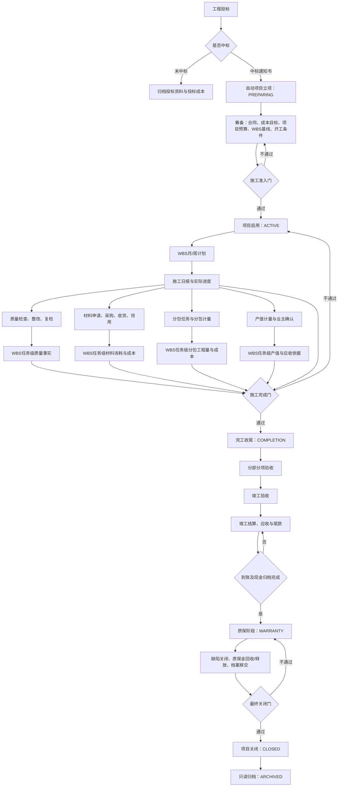

# 第68条主线：施工阶段主线闭环整改

**Goal:** 把项目启用、WBS进度、施工日报、质量、材料、分包、产值计量、成本、收付款、竣工结算、质保和项目关闭收敛为一条可验证的施工主线，修复已确认的阶段绕过、验收错配、关闭漏检和金额口径错误。 **Architecture:** 复用现有 `pm_project`、进度计划/WBS、质量检查、采购库存、分包计量、产值计量、成本台账、应收收款、现金日记账和 `project_closeout`；以“项目状态 + WBS任务 + 原业务单据”作为唯一关联骨架，不新建平行施工台账、平行库存账、平行成本账或通用流程引擎。只补缺失的WBS归属、集中状态门和关闭清单；数量、金额、状态、来源均以服务端写入及回读事实为准。

> 日期：2026-08-03
> 审计基线：`codex/mainline-66-rule-governance@4ee03ea3d8b063eba3f437fe71aeed193c81601b`
> 计划状态：`IMPLEMENTED / LOCAL_ACCEPTANCE_PASSED / MERGED / HISTORICAL`
> Git交付：PR #387 完成实施，PR #388 完成评审整改并合并为 `master@4e0a6380ccae48ba36495c9166751751fb659bc0`
> 实施基线：`master@1eadfedf4aaa7a3974db59cc66bd24fd43136a76`
> 实施授权：业务代码、数据库迁移、本地运行态、验证、文档收口及完整 Git 交付
> 未授权：生产数据库、生产部署、保护绕过和强推

## 1. 目标流程

### 1.1 项目状态职责

| 项目状态 | 允许业务 | 禁止业务 | 转换条件 |
| --- | --- | --- | --- |
| `PREPARING` | 编制并批准成本目标、预算、合同、WBS基线和开工条件 | 正式日报、实际消耗、施工计量 | 施工准入门全部通过后转 `ACTIVE` |
| `ACTIVE` | 计划、日报、质量、采购领用、分包、计量、变更、成本和支付 | 无WBS的施工事实、越期关闭 | 施工完成门通过后转 `COMPLETION` |
| `COMPLETION` | 分部分项验收、竣工验收、结算、尾款、退料退库和遗留整改 | 新建普通施工任务、无依据新增消耗 | 尾款现金归档且质保责任建立后转 `WARRANTY` |
| `WARRANTY` | 缺陷整改、质保金、回款、档案移交 | 新建施工日报、采购、分包任务和产值计量 | 质保期届满、缺陷和资金清零后转 `CLOSED` |
| `CLOSED` | 只读查询、受控归档 | 所有普通业务写入 | 完成归档后转 `ARCHIVED` |
| `ARCHIVED` | 只读审计 | 全部业务写入 | 不可逆向转换；恢复须独立授权方案 |

`project_closeout.status`继续表达收尾内部步骤；`pm_project.status`表达项目所处大阶段。两者通过服务端转换表绑定，禁止各自独立推进。

## 2. 已确认问题与整改归属

| 编号 | 级别 | 已确认问题 | 整改阶段 | 验收结果 |
| --- | --- | --- | --- | --- |
| `SC-01` | P0 | 项目启用不要求已批准WBS基线，WBS基线又只能在`ACTIVE`建立 | M1 | `PREPARING`可编制批准基线；无生效基线不能启用 |
| `SC-02` | P0 | 日报可在非`ACTIVE`或无生效进度计划时提交，WBS更新被静默跳过 | M1 | 非施工状态、无计划、无周计划均拒绝提交且无部分写入 |
| `SC-03` | P0 | 质量记录未绑定WBS，同项目PASS记录可错配分部分项验收 | M2/M3 | 验收记录必须直接绑定对应WBS；跨任务记录拒绝 |
| `SC-04` | P0 | 项目关闭未检查分包、采购、领用、库存等未结事项 | M3 | 施工完成门和最终关闭门覆盖全部执行域并返回逐项阻塞原因 |
| `SC-05` | P0 | 项目总付款额被重复写入每个成本科目 | M4 | 分科目付款按付款申请既有科目/预算归属汇总，总计守恒 |
| `SC-06` | P0 | 尾款核销成功即可推进关闭，未要求关联现金日记账归档 | M4 | 尾款必须存在足额、有效、已归档现金事实 |
| `SC-07` | P1 | 材料采购可关联WBS，但实际领用缺WBS，消耗成本无法归属任务 | M2 | 项目领料行必须绑定WBS；生成成本继承并校验归属 |
| `SC-08` | P1 | 分包任务、产值计量和成本与WBS关系不完整 | M2 | 分包任务、计量明细和生成成本可从WBS追溯且金额/数量守恒 |
| `SC-09` | P1 | 项目在竣工、结算和多年质保期间仍显示`ACTIVE` | M1/M3 | `ACTIVE→COMPLETION→WARRANTY→CLOSED`转换唯一、可见、可审计 |

本计划不承接 `A-03` 的人员、设备、天气、定位、离线能力，也不承接 `A-04` 的多前置、自动排程和资源平衡；两项继续保持原状态，避免借核心整改扩建平台。

## 3. 范围与非目标

### 范围

- 项目施工阶段状态、转换门和各业务写入状态矩阵。
- 进度基线、周计划、日报与WBS实际进度的原子提交。
- 质量检查、材料领用、分包任务、产值计量和实际成本的WBS归属。
- 施工完成、竣工验收、项目关闭的统一未结事项清单。
- 分成本科目付款汇总、收款与现金日记账归档口径。
- 新版前端的施工主线入口、阶段看板、阻塞清单和跨模块追溯。
- MySQL/H2迁移、后端/前端自动化、真实API和浏览器验收。

### 非目标

- 重写现有计划、采购、库存、合同、成本、资金或工作流模块。
- 新建通用BPM、数据仓库、第二套库存/成本/资金台账或独立施工平台。
- 自动猜测历史记录的WBS归属，或静默修改已审批金额和工程量。
- 将安全检查强制伪装为单一WBS质量验收；不用于竣工验收的安全记录可保持项目级。
- 人员班组、机械设备、天气、定位、离线、BIM、自动排程和资源平衡。
- 生产数据库、生产部署、Git交付、Tag或Release。

## 4. 核心不变量

- `ACTIVE`是施工执行唯一入口；`COMPLETION/WARRANTY/CLOSED/ARCHIVED`不得产生普通施工执行单据。
- 同一次日报提交必须在一个事务内完成日报状态、WBS实际量、进度百分比、任务状态和快照更新；任一步失败全部回滚。
- 质量、材料、分包、计量和成本引用的WBS必须与项目、租户、生效进度计划一致。
- `sub_measure`通过必填的`sub_task_id`继承WBS，不重复保存第二个可人工修改的WBS事实。
- 项目领料的实际消耗必须绑定WBS；普通仓库补货可以不绑定，但不得计入某个WBS实际消耗。
- 产值计量允许同一合同清单项按多个WBS拆分；按合同清单和WBS分别守恒，累计不得超过合同/变更批准量。
- `cost_item.wbs_task_id`只由来源业务派生并固化，禁止客户端直接指定；来源无WBS时进入“未归属”而非猜测分摊。
- 成本科目付款以成功付款记录关联的付款申请科目/预算归属汇总；所有科目加“历史未归属”必须等于项目付款总额。
- 应收核销和收款`SUCCESS`不等于现金归档；项目关闭使用有效`ARCHIVED`现金日记账作为到账终态。
- 历史空关联允许读取，不得满足新的施工完成或关闭门；修复必须显式、留审计记录。

## 5. 最小数据与契约变化

实施前由G1冻结精确字段；默认最小方案如下：

| 对象 | 最小变化 | 规则 |
| --- | --- | --- |
| `pm_project.status` | 增加`COMPLETION`、`WARRANTY`语义 | 只由生命周期/收尾服务转换 |
| 质量检查记录 | 增加可空`wbs_task_id`和租户复合外键 | 用于质量验收的记录必填；安全巡检可为空 |
| `sub_task` | 增加必填规则下的`wbs_task_id` | 新建施工分包任务必填；同项目/租户校验 |
| `sub_measure` | 新记录强制`sub_task_id` | WBS从分包任务派生，不重复字段 |
| `mat_requisition_item` | 增加`wbs_task_id` | 项目领料必填；继承到库存流水和成本来源 |
| `production_measurement_line` | 增加`wbs_task_id` | 同一合同项允许按WBS拆分；跨行累计守恒 |
| `cost_item` | 增加只读`wbs_task_id` | 由领料、分包、签证等来源派生；不可手填 |
| 关闭检查响应 | 增加结构化`gateCode/domain/bizId/reason` | 前后端共用，不用拼接文案判断 |

不增加通用多态`business_wbs_link`表。若G0数据画像证明一个质量记录必须对应多个WBS，再只为质量域增加专用明细关系；无真实证据时保持单WBS最小模型。

## 6. G0～G5实施计划

### G0：基线与事实冻结

1. 实施获授权后重新记录分支、HEAD、工作区、Flyway最高版本、MySQL/H2 profile、运行URL和功能开关。
2. 输出项目状态×业务写操作矩阵，以及`SC-01～SC-09`的代码、表、接口、权限、页面和测试映射。
3. 只读统计活动项目中质量、分包、领料、计量、成本的历史空WBS数量；不得自动回填。
4. 确认当前业务数据是否需要历史纠偏入口；没有真实历史数据则不建设通用修复工具。
5. 冻结实施文件范围和数据库恢复点；用户脏改动、生产和Git操作继续排除。
6. 失败分类统一复用仓库七类契约；任何测试、工具、环境或业务失败先记录分类、证据、责任动作和最小复验命令，再决定是否重跑。
7. 金丝雀范围固定为一个本地演示项目、一个WBS及每个受影响业务域各一条最小记录；状态、数量、金额、租户和回滚全部通过后，才允许扩大到完整回归样本。

退出条件：范围、状态机、历史数据处理和验收样例无歧义。

### G1：状态与接口契约

1. 允许在`PREPARING`创建、编辑、提交和批准WBS基线；基线批准不自动启用项目。
2. 项目启用统一校验：中标项目立项事实、成本目标、项目预算、生效WBS基线及既有开工条件。
3. 建立一个具体的项目执行状态守卫，供日报、质量、采购领用、分包和计量复用；不建立接口/工厂层。
4. 冻结`PREPARING→ACTIVE→COMPLETION→WARRANTY→CLOSED→ARCHIVED`转换表，以及每个阶段允许的补录、冲销和纠错动作。
5. 冻结WBS关联字段、错误码、租户/项目校验、结构化关闭阻塞响应和前端契约。

退出条件：状态、字段、Provider/事件、权限、页面、测试和错误码逐项映射完整。

### G2：迁移与历史兼容

1. 新增下一版本MySQL migration和等义H2 migration；禁止修改已应用migration。
2. 添加必要字段、索引和租户复合外键；历史字段先允许空，新写入由服务层按阶段强制。
3. 对活动历史数据生成只读缺口报告；只有唯一可证明的关系才允许受控回填，否则保留“历史未绑定”。
4. 验证干净库、历史库升级、回滚前备份、孤儿扫描、跨租户负样本和字段回读。

退出条件：MySQL/H2等义，迁移无猜测、无孤儿、无跨租户引用。

### G3：服务端闭环

#### M1 生命周期和日报

- 调整进度计划准入，使`PREPARING`可完成基线编制批准。
- 项目启用原子检查成本目标、预算和生效WBS基线。
- 日报创建、编辑、提交均要求`ACTIVE`；提交时无生效计划/周计划立即失败，不再静默返回。
- 引入`COMPLETION`和`WARRANTY`转换；收尾步骤驱动项目状态，写后回读一致。

#### M2 WBS贯穿

- 质量验收记录绑定WBS；关闭验收同时校验质量记录与WBS、项目、状态和结论。
- 分包任务绑定WBS；分包计量必须绑定分包任务并继承其WBS。
- 项目领料行绑定WBS；库存出库和成本生成携带相同WBS。
- 产值计量行绑定WBS；同合同项跨WBS拆分时按来源总量和各WBS量双重校验。
- 成本生成策略从来源单据复制并复核WBS；成本台账支持按WBS查询，不新增第二套台账。

#### M3 施工完成与关闭

- `ACTIVE→COMPLETION`统一检查：WBS全部完成、对应质量验收通过、质量问题关闭、分包任务完成、分包计量无待办、采购/收货/领用无执行中事项、项目库存已处置、运行中工作流为0。
- 分部分项验收只能使用直接绑定该WBS的合格质量事实。
- `COMPLETION→WARRANTY`要求竣工验收、最终结算、普通应收尾款和现金归档完成、质保责任已登记。
- `WARRANTY→CLOSED`要求质保期届满、缺陷关闭、质保金处理完成、合同结清、所有应收清零、现金事实有效、档案签收。
- 三个门均返回结构化阻塞清单；重复执行幂等，并发转换只有一次成功。

#### M4 成本与资金

- 分成本科目付款按`pay_application.cost_subject_id`或既有预算归属解析，并按成功付款记录汇总；禁止把项目总付款复制给每个科目。
- 无法唯一归属的历史付款进入只读“历史未归属”桶；不得平均分摊或按目标比例猜测。
- 收款成功仍可核销应收，但尾款关闭门必须查到同收款链的足额、有效、已归档现金日记账。
- 日记账冲销、反归档或金额变化后重新计算关闭条件；已关闭项目出现非法逆向事实时告警并fail-close。
- 成本汇总重建改用数据库唯一键/事务保证多实例一致；JVM锁只能作为性能优化，不作为正确性依据。

退出条件：数量、金额、状态、来源、租户和幂等均由服务端写入后回读验证；无平行账本。

### G4：前端与真实链路

1. 项目详情增加“施工主线”视图：当前阶段、下一阶段条件、阻塞项和业务跳转。
2. WBS详情展示计划、日报、质量、材料、分包、产值和成本汇总；全部来自服务端关系，不按同项目同日期伪关联。
3. 日报页无计划时显示明确阻断，不提供可成功提交的入口。
4. 收尾页展示施工完成门、尾款现金归档门和最终关闭门；点击阻塞项跳转原业务单据。
5. 成本页分科目付款合计与项目总额守恒；历史未归属单列并提示原因。
6. 真实角色覆盖项目经理、质量、材料、商务、财务和管理层；验证桌面、窄视口、权限负样本和控制台。

退出条件：真实MySQL/API/DOM一致，旧的日期聚合不再充当业务关系证据。

### G5：正式收口

1. 运行定向测试、模块回归、后端`verify`、前端单测/类型检查/构建、受影响E2E和真实浏览器主链。
2. 输出`docs/quality/2026-08-03-issue-068-施工阶段主线闭环整改.md`，逐项裁决`SC-01～SC-09`。
3. 回写本计划、计划索引、`current-issues.json`、Current Focus和项目地图；不存在第二问题载体。
4. 统计新增后续项、关闭后续项和净变化；任一金额差异、跨租户关系、状态绕过或无载体遗留项均判“不通过”。
5. 本地实现、同SHA CI、Git交付和目标环境发布证据分别记录，不互相替代。

## 7. 验收矩阵

| 场景 | 必须通过 |
| --- | --- |
| 施工准入 | 无成本目标、预算或生效WBS任一条件时不能启用；条件齐全时只转换一次 |
| 日报原子性 | 非`ACTIVE`、无计划、无周计划、跨项目WBS、超计划量均拒绝且无部分更新 |
| 质量验收 | 同项目不同WBS的PASS记录不能互用；未关闭质量问题阻断完成门 |
| 材料 | 申请→订单→收货→领用→库存→成本的项目、WBS、数量和金额一致 |
| 分包 | WBS→分包任务→分包计量→成本→付款可追溯，任务或计量未结阻断完成门 |
| 产值 | WBS→合同项/变更→计量→业主确认→结算→应收可追溯，数量金额双守恒 |
| 成本 | 每科目付款正确；科目合计+历史未归属=项目总付款，无重复金额 |
| 收款 | 收款成功但日记账待归档时不能通过尾款门；归档后才可进入质保 |
| 关闭 | 未结采购、领料、库存、分包、合同、应收、缺陷、流程任一存在均阻断 |
| 状态 | 全部非法跳转和关闭后的普通写入均拒绝；合法转换有审计、幂等、可回读 |
| 隔离 | 跨租户/跨项目WBS、合同、质量、库存、资金引用全部fail-close |

## 8. 预计文件范围

- `backend/src/main/java/com/cgcpms/project/`：项目状态与生命周期门。
- `backend/src/main/java/com/cgcpms/schedule/`、`site/`：基线准入和日报原子提交。
- `backend/src/main/java/com/cgcpms/quality/`：WBS质量绑定。
- `backend/src/main/java/com/cgcpms/requisition/`、必要的`material/`或库存服务：WBS领用和成本来源。
- `backend/src/main/java/com/cgcpms/subcontract/`：WBS分包任务及计量继承。
- `backend/src/main/java/com/cgcpms/measurement/`：WBS产值计量行。
- `backend/src/main/java/com/cgcpms/cost/`、`payment/`、`revenue/`：成本归属、付款汇总和现金归档门。
- `backend/src/main/java/com/cgcpms/closeout/`：施工完成与最终关闭清单。
- 下一版本MySQL/H2 migration及上述模块既有测试。
- `packages/frontend-contracts/`和`frontend-admin-v2/`中项目、进度、日报、质量、材料、分包、计量、成本、资金、收尾页面及测试。

发现超过以上范围的真实调用链时，先回到G1更新影响矩阵；禁止静默扩展到新平台。

## 9. 风险与恢复矩阵

| 风险 | 停止条件 | 恢复方式 |
| --- | --- | --- |
| 历史记录无WBS | 无法唯一证明归属 | 不回填；标记历史未绑定并阻断其充当验收事实 |
| 状态切换影响既有单据 | 活动项目存在不兼容状态或写操作 | 停在G0，先形成项目级转换预览和受控过渡规则 |
| 计量按WBS拆分破坏累计量 | 合同项跨WBS合计超过批准量 | 整个计量事务回滚，保留原计量事实 |
| 成本科目归属不唯一 | 付款申请科目与预算归属冲突 | 进入历史未归属并告警，不猜测分摊 |
| 收款与日记账不一致 | 应收已核销但现金日记账缺失/无效 | 保留应收核销事实，阻止阶段推进，补齐或冲销原链 |
| 关闭门误阻断 | 阻塞查询无法定位业务单据 | 保持原项目状态；修正同一集中查询后重试 |
| migration失败 | MySQL/H2不等义或出现孤儿 | 修复尚未应用的新migration并重建测试库；不修改历史migration |

状态和金额变更必须事务回滚；已进入生产数据迁移前，另行取得备份、恢复演练和目标环境授权。本计划不授权该操作。

## 10. 实施前置与零悬空

- 当前只完成计划，不进入G0实施，不创建分支，不修改业务代码或数据库。
- 用户明确授权“实施第68条主线”后，才允许从当时有效基线重新核验并推进G0。
- 新增正式事项1项：`ISSUE-068-001`；关闭0；后续项净变化`+1`。
- `SC-01～SC-09`是`ISSUE-068-001`的验收子项，不再分别写入其他Backlog，避免重复载体。
- 第68条完成时必须一次性关闭全部P0；任何P0不得以“非阻塞”延期通过。

## 11. 计划门禁失败记录

- 失败任务：`test-codex-task-policy-suite.ps1`调用HighRisk计划契约检查。
- 失败分类：`ready_issue_config`。
- 关键证据：首次检查指出计划缺少“计划状态、失败分类、金丝雀”三个显式契约词；业务代码、数据库和运行环境未参与。
- 当前处理：补齐计划元数据、统一失败分类规则和单项目金丝雀边界。
- 最小复验：重新运行HighRisk计划契约检查及`git diff --check`；未通过则保持计划不合格，不进入实施。

## 12. 2026-08-04 实施收口

- `SC-01～SC-09`全部本轮修复并复验：项目启用/WBS基线、日报状态、WBS质量与材料/分包/产值/成本传播、分科目付款守恒、尾款现金门、施工完成/质保/关闭状态均由服务端集中约束。
- 后端全量`verify`共2427项，失败0、错误0、跳过3，JaCoCo分支覆盖率0.601994、门槛满足；前端66项定向及422项全量单测、类型、契约、构建和路由台账通过。
- V270/V271补齐MySQL/H2结构与约束；历史无法唯一归属事实保留“未归属”桶，不猜测回填。
- 项目页和收尾页读取服务端阶段门与阻塞项；阻塞项跳转既有业务页面，不建立第二套施工台账。
- `ISSUE-068-001`关闭。计划周期新增1、关闭1、净变化0；本轮收口新增0、关闭1、净变化-1；无无载体遗留项。
- 正式裁决：本地实现通过；同SHA CI、Git合并和目标环境发布分别取证，生产发布门保持不变。

## 13. 2026-08-04 导航反馈收口

- 项目履约工作区顺序调整为“工程投标”首项，其后复用既有项目管理、技术管理和项目收尾入口；不改变`SC-01～SC-09`服务端状态门。
- 导航单测、前端422项全量单测、类型检查、构建、工程投标E2E及内置浏览器复验通过。
- 本轮新增后续项0、关闭0、净变化0；第68条原裁决保持不变。

## 14. 2026-08-04 成本科目界面反馈收口

- 删除成本科目页“项目目标成本默认比例”独立维护卡；既有服务端默认比例事实和目标成本十类完整性契约不删除。
- `5401.03.xx`恢复“编辑”入口；只允许编辑名称和排序。编码、父级、类型、账户类别、状态继续由前后端共同锁定，新增、停用、删除仍受固定十类及引用保护，避免破坏目标成本服务端集合不变量。
- 后端`CostSubjectServiceTest`35项、前端成本科目单测及424项全量单测通过；内置浏览器确认5401.03下10项、编辑入口可见、结构字段禁用、比例卡不存在。
- 本轮新增后续项0、关闭0、净变化0；第68条施工状态、金额和关闭门裁决保持通过。

## 15. 2026-08-04 第三批跨模块界面反馈收口

- 合作方编号改为服务端强制生成：JSON写入忽略客户端编号，创建服务统一覆盖手工值；客户管理新建表单禁用编号输入。
- 付款申请编辑表单采用两列布局，小屏回落单列；项目目标成本明细删除责任单位、责任人、操作三列，内部默认归属和保存契约不变。
- 成本预算取消重复二级标题，筛选与新建位于唯一H1卡片右侧；基础资料导航统一为“客户管理、物资数据、成本科目”。
- 固定十类目标成本仅开放名称、排序编辑，编码、父级、类型、状态继续锁定；新增、停用、删除仍由服务端拒绝。用户状态改为确认后PATCH并回读的开关，停用态灰色，沿用自停用和最后管理员保护。
- 后端`MdPartnerServiceTest`22项通过；前端10个定向测试文件76项、最终类型检查和生产构建通过；内置浏览器逐页DOM复验通过。
- 本轮新增后续项0、关闭0、净变化0；原施工状态、金额和关闭门裁决保持通过，Git和目标环境动作未执行。
