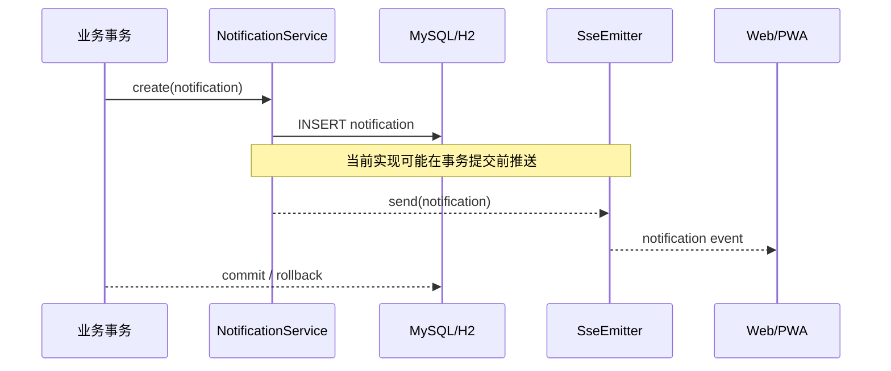
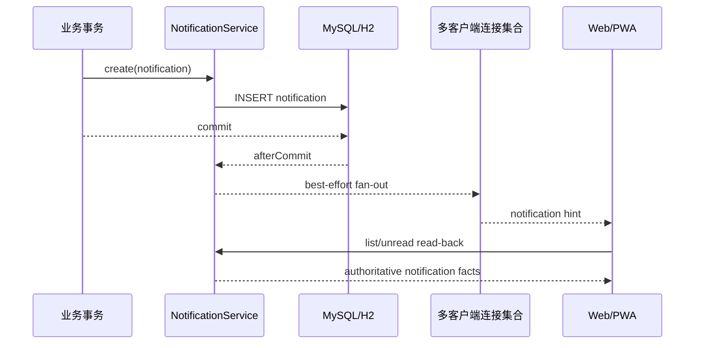
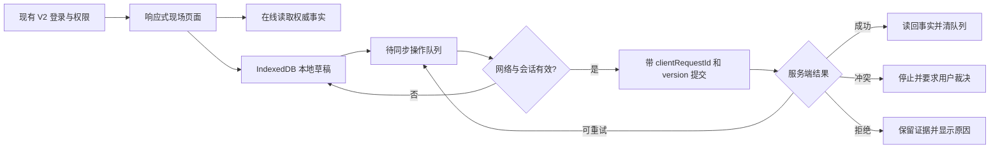
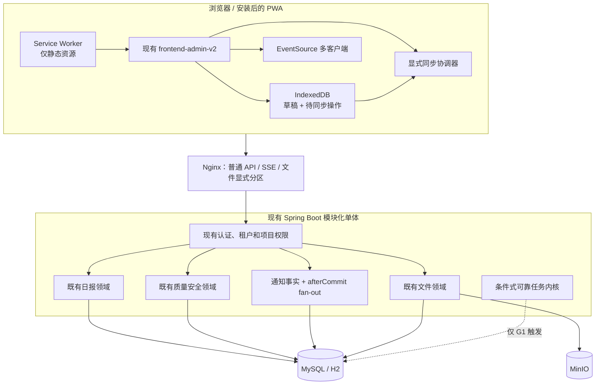

# 第77条主线：v1.6 可靠性加固与现场履约 PWA 本地试点

**Goal:** 在不扩张一级业务边界、不复制通用 ERP、不开启非本地发布的前提下，完成通知事务一致性与多终端连接整改，裁决进程内异步任务的可靠性边界，在现有 `frontend-admin-v2` 和既有日报、质量安全业务事实上建设可关闭、可恢复、可验收的现场履约 PWA 最小闭环，并通过本地演示项目完成端到端验收。 **Architecture:** 继续采用 Vue 3 + Spring Boot 模块化单体；移动能力复用现有 V2 前端，不启用独立 `mobile/uni-app` 产品线；Service Worker 只缓存版本化静态资源，业务 API 保持 network-only；离线草稿和待同步操作存入有界 IndexedDB 队列；服务端继续以既有日报、质量安全、文件和通知表为唯一事实源；通知实时推送改为事务提交后发布并支持同一用户多客户端连接；只有在 G1 证明至少两个关键非事务副作用确需持久恢复时，才建设最小可靠任务内核，不引入微服务、消息中间件、原生 App、BIM、外部门户或真实生产发布。

> 编制日期：2026-08-06
> 状态：`IMPLEMENTED / VERIFIED / GIT_DELIVERY_MERGED / POST_MERGE_VERIFIED`
> 计划状态：G0～G5 已通过；PR #399 已合并，post-merge 已验证
> 唯一问题源：`ISSUE-077-001`
> 实施基线：`master@535526eb1021db522fa18e57f07999cfbbeab757`；实施分支 `codex/mainline-77-pwa-reliability`
> 当前工作区：实施前仅本任务未跟踪计划书；Codemap 已刷新并补齐通知、日报、质量安全调用/影响/测试
> 环境边界：仓库当前只承认本地开发环境；本计划不设置生产、预生产、外部云环境或真实项目上线门禁
> 授权边界：用户已授权完整本地实施、验证、阻塞研判、正式收口及全部通过后的受保护 Git 交付；不含生产或非本地环境
> 建议周期：12 周；以 `T0 = 计划获批 + ISSUE-077-001 登记 + G0 通过` 为起点
> 建议投入：约 110 人日，另设 20% 风险缓冲；该数字是计划估算，不是交付承诺

---

## 0. 编制依据与治理约束

### 0.1 仓库内依据

本计划应与以下仓库事实保持一致：

1. [`AGENTS.md`](../../AGENTS.md)：中文输出、授权边界、本地环境边界、G0～G5、数据库迁移、Git 交付和零悬空规则。
2. [`docs/plans/README.md`](README.md)：计划书必须明确目标、范围、非目标、验收、风险、回滚，并进入唯一事实源。
3. [`第76条主线计划书`](第76条主线-项目文件与通讯性能稳定性整改任务计划书.md)：当前计划书章节、门禁和裁决格式基线。
4. [`current-issues.json`](../backlog/current-issues.json)：A-03“现场日报深化”和 A-10“移动端与外部系统”仍为冻结候选，不能直接进入实现。
5. [`ready-issues.md`](../backlog/ready-issues.md)：当前 v1.6 `Ready` 队列为空。
6. [`evolution-decision.md`](../product-intelligence/evolution-decision.md)：候选需求必须完成价值、边界、依赖、验收和回滚裁决后才能实现。
7. [`project-map.md`](../product-intelligence/project-map.md)：日报、质量安全、文件、通知、权限、前端路由和部署拓扑的当前事实。
8. [`current-focus.md`](../product-intelligence/current-focus.md)：第76条主线已经完成，下一条主线必须重新锁定基线。
9. `NotificationService`、`CommunicationService`、`FileObjectTaskService`、`AsyncConfig`、V2 前端路由、Nginx 和 `mobile/README.md`：本计划的直接代码证据。

### 0.2 外部对标的使用边界

GitHub 同类型项目和市面成熟竞品只能用于验证通用模式，不得直接转换为 CGC-PMS 需求。

本计划只吸收以下原则：

- 现场高频操作必须移动优先、步骤少、弱网可恢复；
- 文档、照片、业务单据和状态变更必须回到同一事实链；
- 实时推送只是提示通道，数据库事实必须能够独立恢复；
- 离线提交必须幂等、可见、可暂停、可重试、可冲突裁决；
- 外部系统、BIM、原生 App 和复杂计划引擎应通过独立候选和适配器处理。

本计划不复制应用市场、通用 ERP、原生多端矩阵、P6 级计划引擎、BIM 建模、外部门户或商业 SaaS 能力。

---

# 1. 审计结论验证、立项裁决与去重

## 1.1 当前结论

| 编号 | 当前事实 | 性质 | 本计划处理 |
|---|---|---|---|
| B-01 | `NotificationService.create()` 在事务内插入通知后立即推送 SSE，外层事务回滚时存在“已推送但数据库无事实”的窗口 | 一致性缺口 | 纳入 `NOTIFY-TX-01` |
| B-02 | SSE 连接以 `tenantId:userId` 保存单一 `SseEmitter`，同一用户新连接会关闭旧连接 | 多标签页/多设备缺口 | 纳入 `NOTIFY-SSE-01` |
| B-03 | 通用 `/api/` 代理继承超长超时和 `proxy_buffering off`，SSE 策略扩散到普通 API | 代理配置缺口 | 纳入 `PROXY-SPLIT-01` |
| B-04 | `AsyncConfig` 以进程内线程池承载异步执行；进程退出后是否需要恢复，必须按业务副作用逐项裁决 | 证据不足，不自动判为缺陷 | 纳入 `ASYNC-DECISION-01`，条件实施 |
| B-05 | `FileObjectTaskService` 已存在数据库任务、幂等、重试和卡死恢复模式 | 已有能力 | 只作为参考，不重写文件任务 |
| B-06 | `CommunicationService` 已采用事务提交后发布事件 | 已有正确模式 | 作为通知整改参考，不重写通讯模块 |
| B-07 | `mobile/` 目前是规划占位，尚未形成可运行移动产品 | 产品缺口 | 不启用第二套代码线；复用 V2 建设 PWA |
| B-08 | `/site/daily-log` 和 `/quality-safety` 已有桌面端入口及既有后端事实 | 已有能力 | 只做移动适配、离线草稿和闭环补强，不新建平行业务表 |
| B-09 | A-03、A-10 仍为 `FROZEN`，当前 `Ready` 数为 0 | 治理阻塞 | G1 前不得开始业务实现 |
| B-10 | Prometheus 机器身份、真实通知渠道、外部系统、BIM 和生产拓扑仍受本地边界限制 | 非本计划范围 | 保持冻结或另立主线 |

## 1.2 去重结论

以下内容不得以第77条主线名义重复建设：

- 文件对象补偿任务、病毒扫描、文件元数据和对象存储清理；
- 通讯领域已有的 `afterCommit` 事件发布；
- 日报、质量安全的既有桌面端领域对象、状态机和权限事实；
- 既有租户隔离、项目访问检查、附件权限和审计日志；
- 第76条主线已完成的项目文件与通讯性能稳定性整改；
- 已存在的前端 V2 路由、页面容器、设计令牌和质量门禁。

## 1.3 立项前强制裁决

第77条主线只能在以下条件同时成立后转为 `READY`：

1. `ISSUE-077-001` 已写入唯一问题源；
2. A-03 拆出“日报现场最小闭环”子候选，A-10 拆出“V2 PWA 本地能力”子候选；
3. 两个子候选分别完成用户、频次、权威数据源、字段、状态、权限、离线边界、隐私、验收和回滚说明；
4. 明确本期不新增班组实名、人员轨迹、自动天气、设备物联网、BIM 和外部组织；
5. 业务负责人、主线负责人、前端负责人、后端负责人和测试负责人对 G1 契约签字或在问题源中留下可复查批准记录；
6. 用户另行明确授权进入代码实施。

---

# 2. 当前调用链、影响面与测试缺口

## 2.1 通知链



目标链路：



必须补齐的测试：

- 外层事务回滚时不得产生 SSE 业务事件；
- 同一租户、同一用户两个标签页同时接收；
- 一个标签页关闭不得移除另一个有效连接；
- 不同租户同 ID 用户不得串流；
- 推送失败不得回滚已提交的通知事实；
- 客户端重连必须通过列表或未读接口补读，不能依赖内存事件重放；
- 异常回调不得因竞态删除后来建立的新连接。

## 2.2 异步任务链

当前需要先完成全量调用点盘点：

```text
@Async / ThreadPoolTaskExecutor / @Scheduled
        │
        ├─ 纯提示型副作用：允许失败后通过事实查询恢复
        ├─ 可重复计算型任务：允许重新执行
        ├─ 外部不可逆副作用：必须幂等并持久恢复
        └─ 事务关键状态变更：不得仅依赖进程内异步
```

缺口不是“存在 `@Async`”，而是尚未形成逐任务可靠性分类和统一裁决证据。G1 必须形成清单，至少包含：

- 调用入口；
- 事务边界；
- 输入事实；
- 副作用类型；
- 是否可重复；
- 幂等键；
- 失败可见性；
- 是否需要持久任务；
- 最大重试；
- 人工恢复方式；
- 关闭/降级开关。

## 2.3 PWA 与现场端链

目标链路：



现有缺口：

- 没有正式 PWA 清单、Service Worker 和安装入口；
- 没有离线草稿、待同步队列、冲突和重放协议；
- 没有按用户/租户隔离的本地数据命名空间和清理策略；
- 没有移动尺寸下的日报和质量安全闭环验收；
- 没有断网、重连、重复提交和账号切换测试；
- `mobile/` 尚无实际功能，不能作为当前实现基础。

## 2.4 日报与质量安全影响面

### 日报

只复用既有日报事实，首期移动闭环限定为：

- 查看本人可访问项目的日报；
- 创建或继续本地草稿；
- 编辑既有批准字段；
- 暂存照片；
- 在线同步；
- 提交；
- 查看服务端回读结果和附件状态；
- 显示与既有计划、材料、质量安全对象的只读关联。

### 质量安全

只复用既有质量安全事实，首期移动闭环限定为：

- 查看本人可访问项目的检查和问题；
- 创建问题草稿或整改回复草稿；
- 选择既有责任对象、严重程度和期限；
- 暂存现场照片；
- 在线提交；
- 按既有职责分离完成整改、复验和关闭；
- 查看状态、逾期和证据链。

复验、关闭、责任变更等高风险状态动作首期必须在线执行，不允许离线排队后静默完成。

---

# 3. 目标、用户价值、范围与非目标

## 3.1 目标用户

| 用户 | 高频任务 | 本计划提供的最小价值 |
|---|---|---|
| 项目施工/技术人员 | 记录当日施工情况、补照片、关联现场问题 | 手机完成草稿、同步和提交，减少回办公室重复录入 |
| 质量/安全人员 | 现场发现问题、留证、派发、复验 | 移动创建问题和证据，状态仍由既有服务端规则控制 |
| 责任单位整改人员 | 查看问题、提交整改说明与照片 | 移动形成可审计整改回复 |
| 项目经理/管理人员 | 查看日报、问题、逾期和通知 | 多终端可靠接收提示，并通过权威列表补读 |
| 系统管理员/测试人员 | 诊断同步、权限、通知和本地缓存 | 可见队列状态、失败原因、版本和开关 |

## 3.2 可验收目标

| 维度 | G5 验收目标 |
|---|---|
| 通知事务一致性 | 事务回滚场景产生 0 条业务 SSE 事件；事务提交后的数据库通知可通过列表读回 |
| 多客户端 | 同一用户至少 2 个标签页可同时接收；关闭其中一个不影响另一个 |
| 租户隔离 | 跨租户通知、日报、质量安全和离线队列串读为 0 |
| 普通 API 代理 | 普通 API 不再继承 SSE 的超长连接和关闭缓冲策略；流式、上传和普通 API 配置边界明确 |
| PWA 安装 | 生产构建可在支持浏览器中安装；离线时能打开已缓存壳层 |
| API 缓存 | Service Worker 不缓存登录、令牌、业务 API 响应和附件下载响应 |
| 离线草稿 | 首次在线加载后断网，日报/问题草稿可保存；刷新或重开页面后仍可恢复 |
| 幂等同步 | 同一 `clientRequestId` 重放 10 次，服务端只形成一个业务结果 |
| 冲突保护 | 旧版本提交返回明确冲突，不得静默覆盖较新事实 |
| 附件 | 离线照片只作为本地暂存；联网上传、扫描和服务端确认完成后才能成为业务附件 |
| 日报闭环 | 本地演示项目完成“草稿—同步—提交—读回” |
| 质量安全闭环 | 本地演示项目完成“发现—派发—整改—复验—关闭”，并验证职责分离 |
| 桌面回归 | 现有桌面入口和主要操作不因移动适配退化 |
| 可关闭性 | PWA、离线写入或移动写入可通过配置/特性开关停用，桌面在线路径仍可使用 |
| 零悬空 | 本周期新发现项全部完成、正式结转或有证据关闭 |

## 3.3 本计划范围

1. 需求证据补齐、候选拆分和 `Ready` 契约；
2. 通知事务提交后发布；
3. 同一用户多客户端 SSE；
4. 客户端重连后的权威列表补读；
5. 普通 API、SSE、文件上传/下载的 Nginx 代理边界拆分；
6. 全量进程内异步任务可靠性分类；
7. 条件式最小可靠任务内核；
8. V2 前端 PWA 壳层、版本化静态缓存、安装入口和更新提示；
9. 有界 IndexedDB 草稿及待同步队列；
10. 用户/租户隔离、退出清理、TTL、配额和故障可见性；
11. 日报移动最小闭环；
12. 质量安全移动最小闭环；
13. 服务端幂等、乐观冲突和附件确认；
14. 本地演示项目、角色矩阵和浏览器验收；
15. 测试、Codemap、产品地图、问题源、质量报告和本计划回填。

## 3.4 非目标

本计划明确不包含：

- 原生 Android/iOS、uni-app、微信小程序；
- 真实项目、生产、预生产或外部云环境试点；
- 外部供应商、分包商、设计方或业主门户；
- 短信、邮件、企业微信、钉钉等真实通知渠道；
- Redis Pub/Sub、Kafka、RabbitMQ、微服务拆分；
- 人员实名考勤、轨迹、自动定位、人脸识别；
- 自动天气、设备物联网、视频监控；
- BIM/IFC/BCF、CAD 在线标注；
- P6 级计划引擎、资源平衡、风险模拟；
- 通用 BI、数据中台、应用市场；
- 新建平行日报、质量安全、附件或通知事实表；
- 修改已经应用的 Flyway 迁移；
- 把浏览器本地草稿当成权威业务数据；
- 未经 G1 批准的新字段、新状态、新角色和新审批流程。

---

# 4. 目标架构与不变量

## 4.1 目标组件关系



## 4.2 业务事实不变量

1. 服务端数据库是日报、质量安全、通知和同步结果的唯一权威事实。
2. PWA 不新增另一套日报、问题、整改、复验或通知领域模型。
3. 所有写请求必须重新经过服务端租户、项目、角色、状态机和字段校验。
4. 离线状态不能扩张权限，也不能跳过在线时必须执行的审批或职责分离。
5. 客户端显示“已保存到本机”不得等同于“已提交到系统”。
6. SSE 只是提示通道；事件丢失时客户端必须能通过列表、未读数或对象查询恢复。
7. 文件只有在对象上传、元数据持久化、权限校验和必要扫描完成后才成为业务附件。
8. 已应用 Flyway 迁移不可修改；新增结构必须以新迁移同时覆盖 MySQL 和 H2。
9. 桌面现有流程必须保持可用；移动端不能成为单点依赖。
10. 任一新能力必须有关闭开关和恢复路径。

## 4.3 PWA 缓存不变量

- 只预缓存构建产物、图标、清单和离线壳层；
- `/api/**`、登录响应、用户信息、权限响应、附件预览和下载均采用 network-only；
- 不把 Cookie、访问令牌、刷新令牌或完整用户资料写入 LocalStorage/IndexedDB；
- 每次构建使用独立缓存版本，旧缓存只在新版本确认激活后清理；
- Service Worker 更新必须向用户显示“新版本可用”，不得在关键编辑过程中强制刷新；
- 提供客户端注销 Service Worker 和清理缓存的诊断入口；
- PWA 功能关闭后，普通网页在线使用不受影响。

## 4.4 本地数据不变量

- 本地数据库命名空间至少包含 `tenantId + userId + buildSchemaVersion`；
- 账号、租户或会话变化时，上一命名空间不得被新身份读取；
- 退出登录时清理未同步敏感草稿，或在 G1 批准的受管设备策略下进行显式保留；
- 草稿设置 TTL，建议默认 7 天，最终值由 G1 契约批准；
- 待同步队列设置容量和总存储上限，达到上限后禁止继续新增并提示用户处理；
- 不采集定位、通讯录、生物识别、设备唯一标识等额外信息；
- 本地照片遵循既有服务端格式和大小限制，不在浏览器中绕过扫描；
- 任何 IndexedDB 升级失败不得静默删除用户未同步草稿。

## 4.5 幂等与冲突不变量

- 每个离线写操作生成不可复用的 `clientRequestId`；
- 创建类操作按 `tenant + actor + operationType + clientRequestId` 唯一；
- 相同键、相同请求重放返回同一业务结果；
- 相同键、不同请求体返回冲突或幂等键滥用错误；
- 更新和状态动作必须携带服务端版本或等价并发令牌；
- 版本过期返回明确冲突，不采用静默“最后写入者胜出”；
- 队列遇到冲突时停止该对象后续依赖操作，等待用户裁决；
- 客户端重试必须采用有界退避，不无限循环。

## 4.6 通知不变量

- 通知记录持久化成功后，才允许发送实时事件；
- 推送异常不得回滚已提交通知；
- 回滚事务不得产生业务事件；
- 一个用户可以有多个独立 `clientId`；
- 清理连接必须使用“键和值同时匹配”的原子删除，避免旧回调删除新连接；
- 服务端内存连接不作为事件持久化；
- 客户端连接成功或恢复后必须主动补读未读数/通知列表；
- 多节点事件分发不在本计划内，代码只保留可替换边界。

---

# 5. 阶段与 G0～G5 门禁

任何门禁未通过，不得进入下一门禁。

| 门禁 | 核心任务 | 必备证据 | 退出条件 |
|---|---|---|---|
| **G0 基线锁定** | 锁定本地分支、`HEAD`、工作区、Codemap、依赖、数据库迁移、现有测试和运行方式 | `git status --short`、`git rev-parse HEAD`、Codemap 生成记录、关键调用链、未提交改动归属表 | 基线可复查；不覆盖用户改动；第76条后的变化已去重 |
| **G1 需求与契约** | 拆分 A-03/A-10；完成用户、字段、状态、权限、离线、隐私、幂等、冲突、开关和验收契约；盘点异步任务 | `ReadySpec`、角色矩阵、API/事件/本地数据契约、异步任务分类表、原型或流程图 | `ISSUE-077-001` 转 `READY`；范围冻结；条件任务内核得到“实施”或“不实施”裁决 |
| **G2 数据与迁移** | 盘点现有幂等/版本字段；设计必要新迁移；定义本地 DB schema/version/TTL；完成 MySQL/H2 验证 | 迁移脚本、索引/唯一约束说明、回填和回滚策略、本地数据迁移测试 | 两种数据库迁移通过；无修改既有迁移；无隐式数据丢失 |
| **G3 服务端闭环** | 通知 afterCommit、多客户端 SSE、幂等、冲突、权限、附件确认；条件任务内核 | 服务单测、事务测试、租户/项目越权测试、并发测试、API 契约 | 核心正反路径通过；失败可恢复；无平行事实 |
| **G4 浏览器与本地运行** | PWA 构建、安装、断网草稿、重连同步、移动日报、质量安全、Nginx 分流、控制台与可访问性 | Playwright/浏览器证据、390/768/1440 视口、网络切换、双标签页、服务端读回、`nginx -t` | 本地演示闭环通过；桌面无回归；0 严重控制台错误；关键失败可见 |
| **G5 全量验证与收口** | 全量测试、依赖/安全、文档、Codemap、问题源、质量报告、恢复演练、零悬空 | `verify`、前端质量门禁、E2E、迁移、恢复矩阵实证、文档差异、问题计数 | 所有发现有归属；计划回填；达到本地完成条件；Git 仍需另行授权 |

## 5.1 G0 现场检查清单

```powershell
git status --short
git branch --show-current
git rev-parse HEAD
git log -1 --oneline
node scripts/codemap/generate-codemap.mjs
git diff -- docs/CODEMAP.md
```

同时必须记录：

- 用户未提交改动及归属；
- 当前 Flyway 最新版本号；
- 后端、前端、MinIO、Redis、MySQL/H2 的本地启动方式；
- `/site/daily-log`、`/quality-safety`、通知流和附件链的实际文件；
- 所有 `@Async`、`TaskExecutor`、`@Scheduled`、事务同步和任务表调用点；
- 当前浏览器支持基线；
- 当前测试失败和环境失败；
- 本地演示账号、项目、角色和数据集。

---

# 6. 12 周实施 WBS

> 周期从 T0 计算。门禁优先于日期；任何阶段不得因排期压力绕过门禁。

| 阶段 | 建议周期 | 实施包 | 主要产物 | 退出门禁 |
|---|---:|---|---|---|
| M0 立项与基线 | 第1周 | `READY-01`、G0 | 基线包、去重表、ReadySpec 初稿 | G0 |
| M1 契约与架构 | 第2周 | `READY-01`、`ASYNC-DECISION-01` | 冻结契约、异步任务分类、迁移设计 | G1 |
| M2 通知与代理 | 第3～4周 | `NOTIFY-TX-01`、`NOTIFY-SSE-01`、`PROXY-SPLIT-01` | 提交后推送、多客户端、代理分流 | G2/G3 部分 |
| M3 PWA 底座 | 第5～6周 | `PWA-BASE-01`、条件式 `RELIABLE-TASK-01` | 安装、静态缓存、IDB、队列、开关 | G3 部分 |
| M4 日报闭环 | 第7～8周 | `FIELD-DAILY-01` | 移动日报草稿、同步、提交、读回 | G3/G4 部分 |
| M5 质量安全闭环 | 第9～10周 | `FIELD-QS-01` | 现场问题、整改、复验、关闭 | G3/G4 |
| M6 稳定化与收口 | 第11～12周 | `OBS-GOV-01` | 全量测试、恢复演练、文档和零悬空 | G5 |

## 6.1 计划人日

| 工作流 | 估算人日 | 主要角色 |
|---|---:|---|
| 基线、需求证据与契约 | 12 | 主线负责人、业务负责人、架构/测试 |
| 通知事务与 SSE | 14 | 后端、前端、测试 |
| Nginx 与本地运行边界 | 5 | 后端/运维、测试 |
| 异步任务裁决及条件内核 | 10～20 | 后端、架构、测试 |
| PWA 壳层与离线基础 | 22 | 前端/PWA、测试、安全 |
| 日报移动闭环 | 18 | 前端、后端、业务、测试 |
| 质量安全移动闭环 | 22 | 前端、后端、业务、测试 |
| 全量验收、文档和收口 | 17 | 全体 |
| **合计** | **约110；条件内核触发时上浮至120** | — |

---

# 7. 实施包

## 7.1 `READY-01`：候选拆分、用户证据与契约冻结

### 目标

把冻结的 A-03、A-10 拆成可独立验收的最小切片，避免以“移动端”名义同时开发日报、定位、天气、BIM、财务和外部协同。

### 候选文件

- `docs/backlog/current-issues.json`
- `docs/backlog/ready-issues.md`
- `docs/product-intelligence/evolution-decision.md`
- `docs/product-intelligence/project-map.md`
- `docs/backlog/current-focus.md`
- `docs/plans/第77条主线-v1.6可靠性加固与现场履约PWA本地试点任务计划书.md`
- 新增 `docs/plans/evidence/issue-077/` 下的契约和验收材料

### 必须形成的契约

1. **用户契约**：至少三类可操作角色、两类拒绝角色；
2. **频次契约**：日报、问题、整改和复验的典型频次；
3. **字段契约**：仅列出现有字段和本期确需新增字段；
4. **状态契约**：草稿、待同步、同步中、已同步、冲突、失败；业务状态仍由服务端定义；
5. **权限契约**：租户、项目、对象、动作和职责分离矩阵；
6. **离线契约**：允许离线的动作、必须在线的动作、最大保留期、容量；
7. **附件契约**：类型、大小、数量、压缩、上传、扫描和失败处理；
8. **幂等契约**：键、请求摘要、响应重放和冲突；
9. **隐私契约**：本地数据范围、账号切换、退出和清理；
10. **开关契约**：PWA、离线写入、日报移动写入、质量安全移动写入；
11. **验收契约**：正向、反向、并发、断网、恢复和桌面回归；
12. **回滚契约**：关闭新入口后如何保留已提交事实和处理未同步草稿。

### 退出条件

- A-03 只解冻“既有日报字段的移动草稿—同步—提交—读回”；
- A-10 只解冻“V2 PWA 壳层和有界离线队列”；
- 质量安全移动闭环作为既有 P0 能力的入口适配，不扩张领域状态；
- 所有其他候选保持冻结；
- `ISSUE-077-001` 进入 `Ready`。

---

## 7.2 `NOTIFY-TX-01`：通知事务提交后发布

### 目标

消除通知数据库事实与实时推送之间的事务窗口。

### 候选文件

- `backend/src/main/java/com/cgcpms/notification/service/NotificationService.java`
- `backend/src/main/java/com/cgcpms/communication/service/CommunicationService.java`（只读参考）
- 通知相关单元、事务和集成测试
- 可能新增的事务后置发布辅助类

### 实施要求

- 插入通知后注册 `afterCommit` 回调；
- 仅在事务成功提交后执行实时 fan-out；
- 若当前线程无有效事务同步，必须明确采用“持久化成功后直接推送”或拒绝调用，禁止隐式行为；
- 推送异常只记录可诊断信息，不反向改变已提交通知；
- 日志包含通知 ID、租户、用户、事件类型和失败分类，不记录敏感正文；
- 不在本包引入消息队列或新通知事实表。

### 验收

- 外层事务回滚：数据库无通知，SSE 无业务事件；
- 事务提交：数据库有通知，在线客户端收到提示；
- 客户端不在线：数据库事实仍可通过列表读取；
- 推送抛异常：事务提交结果不受影响；
- 重复调用按现有通知规则处理，不因 `afterCommit` 产生额外记录。

---

## 7.3 `NOTIFY-SSE-01`：多客户端连接与可恢复订阅

### 目标

支持同一用户多个浏览器标签页或设备，同时保持租户隔离和连接清理正确。

### 候选文件

- `backend/src/main/java/com/cgcpms/notification/controller/NotificationController.java`
- `backend/src/main/java/com/cgcpms/notification/service/NotificationService.java`
- `frontend-admin-v2/src/**/notification*`
- `frontend-admin-v2/src/**/sse*`
- 通知 E2E 和并发测试

### 服务端设计

```text
UserKey(tenantId, userId)
  └─ ConcurrentMap<clientId, SseEmitter>
```

- 客户端每个标签页生成稳定的会话内 `clientId`；
- `clientId` 只用于连接区分，不作为认证或授权依据；
- 连接建立前仍执行现有认证和租户解析；
- 完成、超时和错误回调使用 `remove(clientId, emitter)`；
- 单用户连接数设置上限，超过上限时采用可审计策略；
- SSE 事件设置通知 ID；客户端不得仅依赖事件游标恢复业务事实；
- 连接建立后，前端立即拉取未读数或通知列表；
- 可按测试结果增加轻量心跳，但心跳不是业务事件；
- 不实现跨节点广播。

### 客户端设计

- 每个标签页使用独立 `clientId`；
- 指数退避重连并设置上限；
- `open` 或恢复后补读；
- SSE 失败不阻断页面其他功能；
- 页面销毁时主动关闭连接；
- 不把通知全文写入长期本地缓存。

### 验收

- 两个标签页同时接收；
- 关闭 A 后 B 继续接收；
- A 重连不删除 B；
- 租户切换后旧连接被关闭；
- 连接上限和异常清理无内存残留；
- 30 分钟超时或服务端重启后，客户端自动恢复并补读。

---

## 7.4 `PROXY-SPLIT-01`：普通 API、SSE 与文件代理边界

### 目标

避免把长连接策略施加到全部 API，同时不破坏文件上传和下载。

### 候选文件

- `frontend-admin-v2/nginx.conf`
- 本地 Docker/Nginx 配置
- 代理配置验证脚本或 E2E

### 实施要求

1. 显式定义通知 SSE location；
2. 普通 API 恢复有限读写超时和默认/合理 buffering；
3. 对已确认的上传、下载、预览和其他流式端点单独设置；
4. SSE 设置：
   - HTTP/1.1；
   - `proxy_buffering off`；
   - 禁止代理缓存；
   - 合理长读超时；
   - 传递必要认证 Cookie/头；
5. 普通 API 不使用 24 小时读写超时；
6. `Permissions-Policy` 默认保持最小权限：
   - 首期优先使用 `<input type="file" accept="image/*" capture="environment">`；
   - 只有业务确需 `getUserMedia` 且 G1 批准时，才开放同源 camera；
   - geolocation 保持禁用；
7. 配置变更必须通过 `nginx -t` 和容器内实际路由验证。

### 验收

- 普通 API 超时边界可解释；
- SSE 连续连接不被普通 buffering 破坏；
- 文件上传、预览和下载回归通过；
- 未新增宽泛 CORS、缓存或浏览器权限；
- 配置注释与实际行为一致。

---

## 7.5 `ASYNC-DECISION-01`：异步任务可靠性盘点与裁决

### 目标

区分“可以丢失的提示”“可重算任务”“必须持久恢复的副作用”，避免把所有异步调用都改造成任务平台，也避免关键副作用只存在进程内。

### 交付表结构

| 字段 | 说明 |
|---|---|
| 调用点 | 类、方法、触发入口 |
| 业务事实 | 任务从哪个已提交事实产生 |
| 副作用 | DB、文件、外部系统、通知、导出等 |
| 可重复性 | 是否允许再次执行 |
| 幂等方式 | 自然键、业务键、请求键 |
| 丢失影响 | 无影响、可补算、用户可见、财务/法律影响 |
| 恢复来源 | 数据库事实、对象存储、人工输入 |
| 重试策略 | 次数、退避、死信/失败终态 |
| 当前可见性 | 日志、状态、管理页面 |
| 裁决 | 保留进程内、同步执行、复用现有任务、建设持久任务 |

### 退出条件

只有同时满足以下条件，才触发 `RELIABLE-TASK-01`：

- 至少两个不同领域的非事务副作用；
- 丢失会造成不可接受的用户或数据影响；
- 能从已提交事实重建任务；
- 能定义稳定幂等键；
- 现有 `FileObjectTaskService` 不能直接复用；
- 不引入消息中间件仍能满足本地范围。

否则，`RELIABLE-TASK-01` 以“证据不足，不实施”关闭，不形成新平台。

---

## 7.6 `RELIABLE-TASK-01`：最小持久可靠任务内核（条件包）

### 目标

仅在 `ASYNC-DECISION-01` 触发时，为已批准副作用提供数据库持久化、租约、重试、恢复和人工可见性。

### 禁止事项

- 不把所有 `@Async` 自动迁移；
- 不复制 `FileObjectTaskService` 的领域逻辑；
- 不引入 Kafka、RabbitMQ 或新的独立服务；
- 不允许任务表成为新的业务事实源；
- 不允许任务处理器直接绕过领域服务和权限边界；
- 不为尚未批准的真实外部通知预留复杂平台。

### 最小模型

建议字段，最终以 G2 为准：

```text
id
tenant_id
task_type
business_key
idempotency_key
payload_version
payload
status
attempt_count
max_attempts
next_attempt_at
lease_owner
lease_expires_at
last_error_code
last_error_summary
created_at
updated_at
completed_at
```

状态至少包含：

```text
PENDING -> PROCESSING -> SUCCEEDED
              ├------> RETRY
              └------> FAILED
```

### 核心约束

- `tenant_id + task_type + idempotency_key` 唯一；
- 领取使用原子更新或数据库锁，防止并发重复执行；
- 处理器必须声明幂等策略；
- 进程中断后，过期租约可恢复；
- 错误摘要脱敏，完整堆栈进入受控日志；
- 失败终态可查询，但人工重放必须再次校验当前业务事实；
- 新迁移同时支持 MySQL/H2；
- 管理入口首期可以是只读诊断，不建设通用工作台。

### 验收

- 同一任务并发领取只有一个执行者；
- 处理中进程终止后可恢复；
- 相同幂等键不产生重复副作用；
- 达到最大重试后进入失败终态；
- 人工重放不绕过当前状态和权限；
- 不触发条件时，本包不产生任何代码或迁移。

---

## 7.7 `PWA-BASE-01`：V2 PWA 壳层与离线基础

### 目标

在现有 `frontend-admin-v2` 内建立最小、可关闭、可诊断的 PWA 能力，不维护第二套业务前端。

### 候选文件

- `frontend-admin-v2/package.json`
- `frontend-admin-v2/vite.config.ts`
- `frontend-admin-v2/public/manifest.webmanifest`
- `frontend-admin-v2/public/icons/**`
- 新增 `frontend-admin-v2/src/pwa/**`
- 新增 `frontend-admin-v2/src/offline/**`
- 登录、退出、路由和全局错误处理相关文件
- 前端单元与 Playwright 测试

### 技术决策

- 优先使用现有 Vite 构建体系；
- PWA 插件如需新增，必须先完成版本、许可证、供应链和构建可重复性检查；
- 离线存储优先采用原生 IndexedDB 封装，除非 G1 证明需要第三方库；
- Service Worker 只负责静态资源和离线壳层；
- 业务同步由页面内协调器执行，不把 Background Sync API 作为必需能力；
- 支持用户主动“立即同步”，并可在网络恢复时提示执行；
- 不在 Service Worker 中持有长期认证信息。

### 本地对象

```ts
type OfflineOperation = {
  operationId: string
  clientRequestId: string
  tenantId: string
  userId: string
  domain: 'DAILY_REPORT' | 'QUALITY_SAFETY'
  action: string
  entityLocalId: string
  serverEntityId?: string
  expectedVersion?: number
  payloadVersion: number
  payload: unknown
  attachmentRefs: string[]
  status: 'DRAFT' | 'PENDING' | 'SYNCING' | 'RETRYABLE' | 'CONFLICT' | 'REJECTED' | 'SYNCED'
  attemptCount: number
  nextAttemptAt?: string
  createdAt: string
  updatedAt: string
  expiresAt: string
  lastErrorCode?: string
}
```

### 必备能力

- 安装清单、图标、启动页和主题元数据；
- 构建版本可见；
- 静态资源版本化缓存；
- 离线壳层；
- 草稿仓储；
- 待同步队列；
- 同步状态条；
- 队列详情和失败原因；
- 冲突阻断；
- 退出/切换账号清理；
- TTL/容量/配额提示；
- PWA 和离线写入开关；
- 旧 Service Worker 清理与恢复工具；
- 本地 DB schema 升级测试。

### 验收

- 首次在线访问后，断网可打开壳层；
- API 请求离线时明确失败，不返回过期缓存事实；
- 草稿在刷新后恢复；
- 退出登录后新用户看不到旧用户草稿；
- PWA 关闭后不再注册新 Service Worker；
- 更新失败可回到普通在线页面；
- Lighthouse/PWA 检查结果仅作为参考，业务验收以实际流程为准。

---

## 7.8 `FIELD-DAILY-01`：日报移动最小闭环

### 目标

在不扩张日报领域模型的前提下，完成移动草稿、照片暂存、在线同步、提交和服务端读回。

### 候选文件

- `frontend-admin-v2/src/router.ts`
- `frontend-admin-v2/src/pages/**/DailyLogPage.vue`
- 日报组件、服务、类型和测试
- 后端日报 Controller、Service、DTO、Mapper 和测试（G0 以 Codemap 确认）
- 必要的新 Flyway 迁移
- 文件上传与关联调用点

### UI 原则

- 保持 `/site/daily-log` 单一路由；
- 390px 宽度下无水平滚动；
- 首屏只显示项目、日期、主要工作、关键数量、照片和保存状态；
- 次要字段折叠；
- 底部固定“保存本机 / 同步 / 提交”操作区；
- 明确区分：
  - `仅保存在本机`
  - `待同步`
  - `同步失败`
  - `存在冲突`
  - `已同步未提交`
  - `已提交`
- 不用颜色作为唯一状态表达；
- 桌面版继续显示完整信息和既有操作。

### 同步规则

1. 创建草稿时生成 `clientRequestId`；
2. 在线同步前重新确认当前租户、用户和项目；
3. 创建返回服务端 ID 和版本；
4. 更新携带版本；
5. 附件先上传并确认，再提交日报；
6. 附件失败时保留本地草稿，不把日报显示为完整提交；
7. 冲突时提供：
   - 查看服务端版本；
   - 保留本地副本；
   - 放弃本地修改；
   - 重新基于最新版本编辑；
8. 不支持静默合并结构化字段。

### 不新增字段

首期不得借本包新增：

- 实名班组人员；
- 人员考勤；
- 设备轨迹；
- 自动天气；
- GPS；
- 面部识别；
- 新统计口径。

确需新增字段必须回到 G1，并更新问题源、迁移和验收。

### 验收场景

- 在线创建—保存—提交—读回；
- 离线创建—刷新—恢复—联网同步—提交；
- 同一请求重复 10 次只产生一个日报事实；
- 两端并发编辑产生冲突；
- 无项目权限用户被拒绝；
- 只读角色无法写入；
- 附件未完成时不能伪装为成功；
- 桌面现有日报功能回归通过。

---

## 7.9 `FIELD-QS-01`：质量安全移动最小闭环

### 目标

复用既有质量安全领域和职责分离，支持现场发现、证据、整改回复、复验和关闭。

### 候选文件

- `frontend-admin-v2/src/router.ts`
- `frontend-admin-v2/src/pages/**/QualitySafetyPage.vue`
- 质量安全组件、服务、类型和测试
- 后端质量安全 Controller、Service、状态机、DTO、Mapper 和测试（G0 确认）
- 必要的新 Flyway 迁移
- 文件与通知调用点

### 离线允许动作

- 新问题草稿；
- 整改回复草稿；
- 照片暂存；
- 说明文字；
- 从已缓存的最小参考数据中选择项目/责任对象，但提交时必须重新校验。

### 必须在线动作

- 正式派发；
- 责任对象变更；
- 严重等级升级；
- 复验结论；
- 关闭或重新打开；
- 产生费用、处罚、评价或其他经营后果的动作。

### 状态和职责

- 不新增平行状态机；
- 发现人与整改人、整改人与复验人继续遵循既有职责分离；
- 移动入口不得隐藏关键驳回原因、期限和证据；
- 逾期计算以服务端时间和规则为准；
- 本地时间只用于草稿记录，不作为审计事实；
- 通知失败不改变问题状态。

### 验收场景

- 有权限角色创建问题并上传证据；
- 责任角色提交整改；
- 独立复验角色关闭；
- 同一人越权自验被拒绝；
- 跨项目、跨租户访问被拒绝；
- 离线草稿在账号切换后不可见；
- 旧版本整改回复产生冲突；
- 附件失败、病毒扫描未完成或权限失效时，状态动作被阻断；
- 桌面质量安全流程回归通过。

---

## 7.10 `OBS-GOV-01`：可观测性、验证、文档与收口

### 目标

让通知、同步、冲突和本地数据故障可诊断，并完成仓库治理闭环。

### 指标与日志

建议增加或复用以下本地可观测项：

- 当前 SSE 连接数、按租户/用户聚合的连接上限告警；
- SSE 发送成功/失败/清理计数；
- 通知提交后 fan-out 延迟；
- 离线同步成功、可重试、冲突和拒绝计数；
- 同步队列长度和最老待处理时间；
- 幂等命中和幂等键冲突计数；
- 附件暂存、上传、扫描失败计数；
- 条件任务内核的状态、重试和卡死恢复计数；
- Service Worker 版本和客户端 build 版本；
- 日志统一携带 trace/request ID，严禁记录令牌、完整照片或敏感正文。

### 文档回填

- 本计划实际实施结果；
- `current-issues.json`；
- `ready-issues.md`；
- `current-focus.md`；
- `project-map.md`；
- `docs/CODEMAP.md`；
- API/事件/离线数据契约；
- 本地运行与故障恢复手册；
- 测试证据索引；
- 质量报告；
- 零悬空清单。

---

# 8. 数据、接口、权限与特性开关契约

## 8.1 数据迁移裁决

G2 前先检查现有表是否已经具备：

- 客户端请求键；
- 乐观锁版本；
- 更新时间；
- 创建人/修改人；
- 租户和项目键；
- 唯一约束；
- 附件关联状态。

只有缺失且无法使用现有事实表达时才新增迁移。

### 迁移规则

- 使用 `V<next>__...sql`，不得修改历史迁移；
- MySQL 和 H2 脚本同步；
- 新幂等字段先允许空值，避免破坏既有数据；
- 新唯一约束必须处理历史空值和重复数据；
- 不为浏览器本地草稿建服务端“影子表”；
- 条件任务表只有在 `RELIABLE-TASK-01` 被正式触发后创建；
- 回滚应用版本时，新字段可保持向后兼容；
- 结构错误通过新修复迁移处理，不使用 `flyway repair` 掩盖错误。

## 8.2 API 最小契约

最终路径以 G1 和现有路由为准，语义至少包含：

| 能力 | 请求要求 | 响应要求 | 失败要求 |
|---|---|---|---|
| 通知 SSE 订阅 | 已认证、`clientId` | `event id`、最小通知提示 | 401/403、连接上限、可重连 |
| 通知补读 | 分页/未读参数 | 权威通知事实 | 不依赖 SSE 内存 |
| 日报创建 | `clientRequestId`、项目、批准字段 | ID、版本、状态 | 幂等冲突、权限、校验 |
| 日报更新 | ID、版本、字段 | 新版本 | 409 冲突 |
| 日报提交 | ID、版本、附件确认 | 已提交状态 | 附件未完成、状态非法 |
| 问题创建 | `clientRequestId`、项目、既有分类 | ID、版本、状态 | 权限、职责、校验 |
| 整改回复 | ID、版本、说明、附件 | 新版本/状态 | 409、角色拒绝 |
| 复验/关闭 | ID、版本、结论 | 新状态 | 必须在线、职责分离 |
| 附件上传 | 既有文件契约 | 文件 ID、扫描/可用状态 | 类型、大小、扫描、权限 |

### 错误语义

前后端必须区分：

- `AUTH_EXPIRED`
- `PERMISSION_DENIED`
- `VALIDATION_FAILED`
- `VERSION_CONFLICT`
- `IDEMPOTENCY_CONFLICT`
- `ATTACHMENT_PENDING`
- `ATTACHMENT_REJECTED`
- `RETRYABLE_NETWORK`
- `SERVER_TEMPORARY`
- `BUSINESS_STATE_CHANGED`

不能把所有失败统一显示为“网络错误”。

## 8.3 权限矩阵

G1 必须以实际权限代码生成以下矩阵：

| 对象/动作 | 施工/技术 | 质量安全 | 整改责任人 | 项目经理 | 只读/无权限 |
|---|---:|---:|---:|---:|---:|
| 日报查看 | 按项目 | 按项目 | 按项目/配置 | 按项目 | 只读或拒绝 |
| 日报草稿/编辑 | 按现有权限 | 按现有权限 | 否 | 按现有权限 | 拒绝 |
| 日报提交 | 按现有权限 | 按现有权限 | 否 | 按现有权限 | 拒绝 |
| 问题创建 | 按现有权限 | 是 | 按现有权限 | 按现有权限 | 拒绝 |
| 整改回复 | 否/按责任 | 否/按规则 | 是 | 按规则 | 拒绝 |
| 复验关闭 | 否 | 是 | 否 | 按规则 | 拒绝 |
| 本地队列查看 | 仅本人当前命名空间 | 仅本人当前命名空间 | 仅本人当前命名空间 | 仅本人当前命名空间 | 仅本人或无 |

矩阵中的“按现有权限”必须在 G1 替换为真实权限码，不得保持模糊表述进入实现。

## 8.4 特性开关

至少提供：

- `pwa.enabled`
- `offlineDraft.enabled`
- `offlineSync.enabled`
- `fieldDailyLog.enabled`
- `fieldQualitySafety.enabled`
- `notificationMultiClient.enabled`
- `reliableTask.enabled`（仅条件包）

要求：

- 服务端仍执行权限和状态校验，开关不能替代授权；
- 关闭离线写入时，已同步事实不回滚；
- 未同步草稿必须可导出摘要、删除或在重新开启后继续处理；
- 开关状态进入诊断信息和验收证据；
- 不以环境变量散落方式绕过统一配置治理。

---

# 9. 本地验证矩阵

## 9.1 后端测试

| 类别 | 最低验证 |
|---|---|
| 通知事务 | 提交、回滚、嵌套事务、推送异常 |
| SSE | 双标签页、连接替换、关闭竞态、超时、租户隔离、连接上限 |
| 幂等 | 同键同体、同键异体、并发重放、不同租户同键 |
| 乐观锁 | 日报、问题、整改、复验旧版本拒绝 |
| 权限 | 租户、项目、对象、动作、职责分离 |
| 文件 | 上传、权限、扫描、关联、失败补偿 |
| 迁移 | MySQL、H2、新装、已有基线升级 |
| 条件任务 | 并发领取、中断恢复、重试、失败终态、人工重放 |
| 回归 | 现有日报、质量安全、通知、通讯、文件测试 |

建议命令以实际模块为准：

```powershell
cd D:\projects-test\cgc-pms\backend
.\mvnw.cmd -DskipTests compile
.\mvnw.cmd test
.\mvnw.cmd verify
```

定向测试必须先运行，最终仍需运行全量 `verify`；不能用定向通过代替全量结论。

## 9.2 前端与 PWA 测试

| 类别 | 最低验证 |
|---|---|
| 类型与构建 | type-check、lint、unit、生产构建 |
| Service Worker | 首装、更新、旧缓存清理、关闭/注销、离线壳层 |
| 缓存安全 | API、认证、附件响应不进入缓存 |
| IndexedDB | 建库、升级、TTL、容量、账号切换、退出清理、损坏恢复 |
| 同步队列 | 成功、重试、冲突、拒绝、会话失效、网络抖动 |
| 日报 | 在线、离线、重放、冲突、附件、提交 |
| 质量安全 | 发现、整改、复验、职责分离、附件 |
| 响应式 | 390×844、768×1024、1440×900 |
| 可访问性 | 键盘、焦点、标签、错误文本、非颜色状态 |
| 桌面回归 | 原有桌面页面和路由 |

建议命令：

```powershell
cd D:\projects-test\cgc-pms
pnpm --dir frontend-admin-v2 type-check
pnpm --dir frontend-admin-v2 lint
pnpm --dir frontend-admin-v2 test
pnpm --dir frontend-admin-v2 build
pnpm --dir frontend-admin-v2 e2e
```

脚本名称以 `package.json` 实际定义为准；G0 必须校正命令，不得伪造执行结果。

## 9.3 浏览器端到端场景

### 场景 A：通知事务与双标签页

1. A、B 两个标签页以同一用户登录；
2. 触发一条成功提交的业务通知；
3. A、B 均收到提示；
4. 关闭 A；
5. 再触发通知，B 仍收到；
6. 触发回滚事务，A/B 均不得收到业务事件；
7. 断开再连接后，通过列表补读。

### 场景 B：日报离线

1. 在线登录并进入日报；
2. 断网；
3. 创建草稿、填写批准字段、暂存照片；
4. 刷新页面并恢复草稿；
5. 恢复网络；
6. 同步并读回服务端 ID/版本；
7. 上传并确认附件；
8. 提交日报；
9. 清空已成功队列。

### 场景 C：日报冲突

1. 标签页 A、B 读取同一版本；
2. A 在线更新成功；
3. B 提交旧版本；
4. 服务端返回冲突；
5. B 显示服务端版本并停止后续自动同步；
6. 用户选择放弃或基于最新版本重新编辑。

### 场景 D：质量安全职责分离

1. 检查角色创建问题；
2. 整改责任角色提交整改；
3. 同一整改人尝试自验，必须拒绝；
4. 复验角色在线复验并关闭；
5. 全链附件、时间、操作者和状态可追溯。

### 场景 E：账号/租户切换

1. 用户 A 生成未同步草稿；
2. 退出；
3. 用户 B 登录；
4. B 不得读取 A 的本地草稿；
5. 切回 A 时按 G1 清理策略处理草稿；
6. 租户切换后旧 SSE 连接和队列上下文失效。

## 9.4 安全验证

- 无访问令牌写入 LocalStorage/IndexedDB；
- Service Worker Cache Storage 无业务 API 响应；
- HTML、Markdown、通知和草稿文本经过现有输出编码；
- 图片类型、大小、数量和 MIME/扩展名不只依赖前端；
- 离线队列 payload 不包含超出业务必要范围的数据；
- 调试日志不包含令牌、Cookie、完整敏感正文和图片内容；
- 跨租户、跨项目、猜测 ID、旧权限缓存全部被服务端拒绝；
- PWA 更新包和静态资源使用现有 CSP/SRI/构建治理；
- 第三方 PWA 依赖经过许可证、漏洞和锁文件审查；
- 不因移动端开放宽泛 CORS、camera 或 geolocation。

## 9.5 性能与可靠性验证

以下是本地固定数据集目标，不代表生产 SLA：

- 同一用户 3 个标签页连接、断开和重连无连接泄漏；
- 100 个模拟用户、每用户 2 个连接的本地压力下，连接数和错误可观测；
- 50 条无附件离线操作顺序同步，无重复事实；
- 20 个含附件操作在限流下可暂停和恢复；
- 进程重启后，权威通知可补读；
- 条件任务触发时，处理中断后可恢复；
- Service Worker 新旧版本切换不丢未同步草稿；
- 普通 API、SSE 和文件端点分别验证超时与资源占用；
- 所有性能结论记录机器、数据量、构建和命令，不作跨环境外推。

## 9.6 治理验证

```powershell
git diff --check
git status --short
node scripts/codemap/generate-codemap.mjs
```

还应运行仓库实际存在的：

- 主线计划格式检查；
- Codemap 新鲜度检查；
- 后端依赖和供应链扫描；
- 前端路由、设计和契约门禁；
- MySQL/H2 双数据库测试；
- 租户隔离测试；
- E2E；
- SBOM/镜像或构建证明相关本地可执行检查。

无法在本地执行的门禁必须记录为环境边界，不得声称通过，也不得把非本地环境作为本计划阻塞项。

---

# 10. 本地演示项目试点

本地主线金丝雀仅使用现有 dev/test/demo 租户、账号和脱敏数据；不得外推为生产容量、发布或真实项目验收。

## 10.1 数据集

在现有本地演示数据中准备：

- 1 个租户；
- 2 个项目，其中一个为允许项目、一个用于越权验证；
- 至少 5 类角色；
- 既有日报和可编辑日报；
- 质量/安全检查、问题、整改和复验样本；
- 可用和不可用附件样本；
- 成功、冲突、权限拒绝、附件失败和会话过期场景。

不得复制真实生产个人信息或未脱敏项目资料。

## 10.2 每日验收脚本

| 日次 | 核心任务 | 证据 |
|---|---|---|
| D1 | PWA 安装、登录、在线日报 | 录屏/截图、请求日志、服务端读回 |
| D2 | 断网草稿、刷新恢复、重连同步 | 队列状态、IDB 记录、服务端事实 |
| D3 | 重复提交和并发冲突 | 幂等测试、409、无重复数据 |
| D4 | 质量安全发现和整改 | 状态链、附件、角色记录 |
| D5 | 复验、越权拒绝、通知双标签页 | 审计日志、拒绝证据、SSE 证据 |
| D6 | Service Worker 更新、账号切换、恢复 | 缓存版本、清理、队列保留/删除 |
| D7 | 桌面回归、全量测试、问题收口 | 测试报告、零悬空清单 |

## 10.3 本地完成指标

| 指标 | 门槛 |
|---|---:|
| 计划内正向用例通过率 | 100% |
| 关键反向权限用例通过率 | 100% |
| 同一幂等键重复事实数 | 0 |
| 事务回滚产生的业务 SSE 事件 | 0 |
| 跨租户/跨项目串读 | 0 |
| 离线队列最终状态不可解释项 | 0 |
| 严重浏览器控制台错误 | 0 |
| 未归属 P0/P1 发现 | 0 |
| 计划内文档和证据缺失 | 0 |

真实用户采用率、真实现场关闭周期、生产 RPO/RTO 和线上性能不在本计划裁决范围内。

---

# 11. 交付物清单

## 11.1 计划与治理

- 第77条主线计划书；
- `ISSUE-077-001`；
- ReadySpec；
- 需求拆分与去重表；
- 角色/权限矩阵；
- API、事件、幂等、冲突和离线数据契约；
- 异步任务可靠性分类表；
- 风险与恢复矩阵；
- 零悬空清单；
- 本地质量报告。

## 11.2 代码与配置

在获得实施授权后，预期交付：

- 通知事务提交后发布；
- 多客户端 SSE；
- 客户端补读与重连；
- Nginx 代理分流；
- PWA manifest、静态缓存和更新机制；
- IndexedDB 草稿与同步队列；
- 日报移动布局与同步；
- 质量安全移动布局与同步；
- 必要的服务端幂等、版本和迁移；
- 条件式可靠任务内核；
- 特性开关和诊断信息。

## 11.3 测试与证据

- 后端定向和全量测试；
- MySQL/H2 迁移测试；
- 前端类型、Lint、单元、构建和 E2E；
- 390/768/1440 视口证据；
- 断网、重连、重放、冲突和账号切换证据；
- 双标签页 SSE 证据；
- 权限和职责分离证据；
- Nginx 配置和本地容器证据；
- 恢复演练证据；
- Codemap 与仓库文档更新。

---

# 12. 风险登记表

| 风险 | 概率 | 影响 | 触发信号 | 缓解措施 | 责任角色 |
|---|---:|---:|---|---|---|
| A-03/A-10 未解冻便开始编码 | 中 | 高 | 字段、用户、验收仍模糊 | G1 阻断；只允许契约和只读调查 | 主线/业务 |
| 移动端演变为第二套前端 | 中 | 高 | `mobile/` 与 V2 同时实现业务 | 明确复用 V2；独立移动产品另立主线 | 架构/前端 |
| Service Worker 缓存业务 API | 低 | 高 | 离线看到过期业务事实 | API network-only；缓存审计测试 | 前端/安全 |
| 账号切换泄露本地草稿 | 中 | 高 | B 用户可见 A 数据 | 命名空间、退出清理、E2E | 前端/安全 |
| 离线重放产生重复单据 | 中 | 高 | 同一操作形成多条事实 | 服务端幂等唯一约束和并发测试 | 后端/测试 |
| 冲突被静默覆盖 | 中 | 高 | 更新时间倒退或数据丢失 | 乐观锁、409、人工裁决 | 前后端 |
| 附件本地占用过大 | 中 | 中 | 配额错误、页面卡顿 | 数量/大小上限、压缩、容量提示 | 前端 |
| 状态动作被离线绕过 | 低 | 高 | 未联网完成复验/关闭 | 高风险动作必须在线并服务端校验 | 业务/后端 |
| SSE 连接泄漏 | 中 | 中 | 连接数持续增长 | 原子清理、连接上限、指标、压力测试 | 后端 |
| 普通 API 代理回归 | 中 | 中 | 上传超时或响应延迟 | 先盘点端点、显式分流、容器验证 | 后端/测试 |
| 通用任务平台过度设计 | 中 | 高 | 无明确消费者却新增框架 | 条件包；至少两个合格场景才实施 | 架构 |
| 第三方 PWA 依赖供应链风险 | 低 | 中 | 漏洞/许可证/构建漂移 | 版本锁定、扫描、可替代方案 | 前端/安全 |
| 桌面页面被移动 CSS 破坏 | 中 | 中 | 1440 视口功能退化 | 响应式隔离、视觉/E2E 回归 | 前端/测试 |
| 本地验证被误写为生产就绪 | 中 | 高 | 文档出现生产通过结论 | 全文标记 LOCAL_ONLY；G5 裁决限制 | 主线 |
| 用户真实采用价值仍未证明 | 高 | 中 | 本地技术通过但无使用证据 | 保持事实区分；真实试点另立获批主线 | 产品/业务 |

---

# 13. 恢复矩阵

| 故障 | 立即动作 | 数据处理 | 恢复验证 |
|---|---|---|---|
| 通知推送失败 | 保留数据库通知，记录失败 | 不回滚通知，不重复插入 | 列表可读；客户端重连补读 |
| 事务回滚仍收到事件 | 立即关闭新通知 fan-out 开关 | 查明事务同步边界，不删除无关通知 | 回滚测试 0 事件 |
| SSE 多客户端泄漏 | 关闭多客户端开关，退回单连接/补读 | 清理内存连接，无数据库修复 | 连接数回落，列表可用 |
| Nginx 分流导致普通 API 失败 | 回退代理配置 | 无业务数据变更 | `nginx -t`、普通 API、上传和 SSE |
| Service Worker 更新损坏 | 禁用 PWA 注册，提示刷新/注销 | 保留 IndexedDB 草稿，不静默清库 | 普通网页恢复，草稿可导出/续传 |
| 缓存污染业务 API | 立即注销 SW 并删除受影响缓存版本 | 以服务端事实为准 | Cache Storage 无 API 响应 |
| IndexedDB 升级失败 | 停止写入并显示恢复界面 | 先导出或迁移草稿，禁止静默删除 | 旧草稿可读，新 schema 正常 |
| 账号切换数据可见 | 关闭离线功能并清理会话命名空间 | 记录影响范围，不上传错误草稿 | 跨账号测试 0 泄露 |
| 同步重复 | 暂停该对象队列 | 依据幂等键和业务事实对账 | 仅一个权威结果 |
| 同步冲突 | 停止依赖操作 | 保留本地副本和服务端版本 | 用户完成明确裁决 |
| 附件上传/扫描失败 | 保留草稿并标记附件失败 | 不创建“可用附件”关系 | 重试成功或用户删除附件 |
| 日报/问题移动写入回归 | 关闭对应移动写入开关 | 已提交事实保留，未同步草稿提示处理 | 桌面在线路径正常 |
| 新迁移失败 | 停止应用升级 | 不改历史迁移；新增修复迁移 | MySQL/H2 新装和升级均通过 |
| 条件任务卡死 | 停止领取，检查租约和处理器 | 按幂等键恢复或进入失败终态 | 无重复副作用 |
| 权限缺陷 | 关闭受影响入口 | 复核审计日志和影响对象 | 全部越权用例拒绝 |
| Git/基线冲突 | 停止修改和提交 | 保留用户改动，不覆盖 | 重新锁定 HEAD/状态/Codemap |

本计划不定义生产回滚，因为当前仓库环境边界为本地开发。

---

# 14. 角色与 RACI

| 活动 | 主线负责人 | 业务负责人 | 后端 | 前端/PWA | 测试 | 安全/运行 |
|---|---|---|---|---|---|---|
| G0 基线 | A/R | C | C | C | C | C |
| G1 Ready 契约 | A | R | C | C | R | C |
| 通知与 SSE | A | C | R | C | R | C |
| 代理分流 | A | I | R | C | R | R |
| 异步任务裁决 | A/R | C | R | I | C | C |
| PWA 底座 | A | C | C | R | R | C |
| 日报闭环 | A | R | R | R | R | C |
| 质量安全闭环 | A | R | R | R | R | C |
| 迁移与权限 | A | C | R | C | R | C |
| G4 本地试点 | A | R | C | C | R | C |
| G5 收口 | A/R | C | C | C | R | C |
| Git 交付 | 需单独授权 | I | C | C | C | I |

说明：

- `A`：最终负责；
- `R`：执行负责；
- `C`：参与评审；
- `I`：知会；
- 没有明确人员姓名时，只能按角色规划，实施前必须在问题源中绑定实际责任人。

---

# 15. 零悬空、问题源与变更控制

## 15.1 计划编制时计数

| 类型 | 数量 | 说明 |
|---|---:|---|
| 新增主线问题 | 1 | `ISSUE-077-001`，已登记并实施 |
| 已关闭 | 1 | `ISSUE-077-001`，G0～G5 通过后关闭 |
| 正式结转 | 0 | 无超范围遗留项 |
| 净变化 | 0 | 无悬空问题 |

## 15.2 G5 实际计数

- `ISSUE-077-001` 已完成并关闭；
- 本周期新增 P0/P1 不得无责任人、无期限、无验收；
- 条件任务内核若不触发，必须以裁决证据关闭，不能保留“以后再看”；
- 原生 App、外部协同、真实通知、BIM、定位、自动天气和生产试点继续保持原候选状态，不得偷偷进入本主线；
- 所有 TODO、临时开关、兼容路径、测试跳过和文档占位必须进入问题源或在 G5 删除；
- 计划、代码、测试、Codemap、产品地图和问题源必须相互一致。

## 15.3 变更控制

出现以下任一情况必须回到 G1：

- 新增领域对象或状态；
- 新增人员、设备、定位、天气等权威数据；
- 改变质量安全职责分离；
- 引入原生 App、第三方推送、消息中间件或多节点；
- 扩大本地存储数据范围或保留期；
- 改变附件安全策略；
- 改变租户或项目权限；
- 把真实项目/生产环境加入验收；
- 计划工期或范围增长超过 20%。

---

# 16. 实施与本地裁决

## 16.1 当前裁决

```text
计划：已实施并回填
唯一问题源：ISSUE-077-001 已关闭
G0：通过
G1：通过；通用可靠任务内核 NOT_TRIGGERED
G2：通过；V286 MySQL/H2 迁移与幂等/版本契约成立
G3：通过；通知 afterCommit/多客户端、PWA/IndexedDB/日报/质量安全闭环成立
G4：通过；本地运行态、Nginx、PWA 冷离线、三视口、双标签 SSE 通过
G5：通过；后端 2558、前端 481、Trivy、治理、SQL 安全与零悬空通过
代码修改：已授权并实施
测试：完整本地门禁通过
Git：PR #399 已合并；merge SHA `6caaf895d7996b48b778a503f81ec8031a39ea90`；post-merge run `31086766657` 成功
生产/真实项目：不适用
最终状态：IMPLEMENTED / VERIFIED / GIT_DELIVERY_MERGED / POST_MERGE_VERIFIED
```

## 16.2 启动条件

开始实施前必须同时满足：

1. 用户明确授权进入代码实施；
2. `ISSUE-077-001` 已登记；
3. G0 锁定实际本地基线；
4. G1 Ready 契约获批；
5. 实际责任人和预计容量已绑定；
6. 用户未提交改动已识别且不会被覆盖；
7. 数据库迁移编号和双数据库策略已确认。

## 16.3 G5 最终裁决

实施完成后，必须回填：

```text
实际分支：codex/mainline-77-pwa-reliability
实施前 HEAD：535526eb1021db522fa18e57f07999cfbbeab757
实施后 HEAD：154a464e4
合并 HEAD：6caaf895d7996b48b778a503f81ec8031a39ea90
工作区状态：已通过 PR #399 合并并清理源分支
G0 证据：docs/plans/evidence/issue-077/g0-baseline.md
G1 证据：ready-spec.md、async-reliability-decision.md
G2 证据：V286、H2迁移链、本地MySQL空库与升级通过
G3 证据：后端事务/幂等/版本/多客户端及前端契约测试通过
G4 证据：本地5173、生产静态5174、Nginx、冷离线与三视口通过
G5 证据：docs/quality/2026-08-06-issue-077-可靠性加固与现场履约PWA本地试点.md
测试总数与失败数：后端2558/0；前端481/0
MySQL/H2 迁移结果：通过
浏览器/PWA 结果：通过；Cache Storage静态资产13、API 0；控制台错误0
恢复演练结果：离线刷新恢复草稿、重连可重试、SW更新缓存与SSE补读成立
新增问题：1
关闭问题：1
正式结转：0
净问题变化：0
未完成项：0
本地完成裁决：通过
Git 交付裁决：PR #399 已合并；post-merge run 31086766657 成功
非本地环境裁决：不适用，除非根规则另行变更
```

证据齐全、零悬空成立、问题源和文档同步后，第77条主线终态为 `IMPLEMENTED / VERIFIED / GIT_DELIVERY_MERGED / POST_MERGE_VERIFIED`。任何“计划完成”“代码写完”或“定向测试通过”都不能替代 G5 正式裁决。
