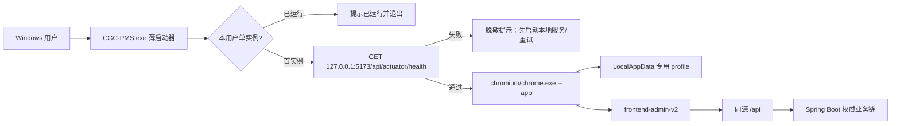

# 第82条主线：Windows 便携 Chromium 轻量启动壳

**Goal:** 在不改造 CGC-PMS 业务前后端、不引入 Electron/CEF/WebView2、不打包数据库或 Docker 的前提下，新增 Windows x64 轻量启动器，将固定版本便携 Chromium 作为旁载运行时，以应用模式打开现有本地 `http://127.0.0.1:5173/`，形成可复制、可校验、可回滚、用户数据隔离的本地桌面入口。 **Architecture:** 采用无第三方运行时依赖的 Win32 C++17 GUI 启动器，编译期固定应用 URL、健康检查 URL 和允许的 Chromium 参数；运行时只执行单实例检查、同源链路健康检查、专用 profile 定位、`chrome.exe --app=...` 启动、脱敏日志和退出码记录。Chromium 二进制不入 Git，通过锁定版本、来源、SHA-256 和许可证清单生成本地发行目录；继续复用 `frontend-admin-v2 → /api → Spring Boot` 权威链路，禁止扩展为桌面业务客户端、自动更新器、任意 URL 浏览器或非本地发布体系。

> 编制日期：2026-08-08
> 状态：`IMPLEMENTED / G0-G5_LOCAL_PASSED / GIT_DELIVERY_PENDING`
> 计划编号：第82条主线候选；第81条仍是当前已规划未实施主线，本计划暂不改写 `docs/plans/README.md` 或 Backlog 事实源
> 规划基线：`codex/mainline-81-live-e2e-code-cap@367d110e6e66dfbf3248d7b00299c98ebd526603`
> 工作区边界：编制时已有第81条后端、测试、Backlog、Codemap、计划索引等非本任务脏改动；本计划只新增本文档
> 环境边界：仅 Windows 10/11 x64 本地 dev/test/demo；不规划生产、预生产、外部域名、远程服务或目标环境验收
> 授权边界：原计划编制轮仅授权计划；2026-08-08 用户 `/goal` 已追加授权本地实施、验证与最终受保护 Git 交付
> 实施前置：当前机器未发现 `cl.exe`、`msbuild`、`cmake`、Go、Rust 或 .NET SDK；进入 G0 后需另行批准安装 Visual Studio Build Tools 2022 的 C++ 工具链和 Windows SDK
> 预计投入：1 名开发 5～7 人日，1 名验证人员 1～2 人日；属于估算，不是交付承诺

> 实施回写（2026-08-08）：用户 `/goal` 已授权串行实施与最终推送。G0 工具链、Chromium 来源和 Codemap 阻塞均已解决；Win32 启动壳、Windows CI、真实便携 Chromium、本地业务入口、文档与质量报告通过。正式证据见 [ISSUE-082 质量报告](../quality/2026-08-08-issue-082-Windows便携Chromium轻量启动壳.md)。

---

## 1. 结论与关键裁决

### 1.1 方案裁决

选用“Win32 薄启动器 + 随包 Chromium 目录”，不把 Chromium 源码静态链接进启动器，也不把全部运行时压入单一 EXE。

原因：

1. `--app=<URL>` 已能提供无常规地址栏的应用窗口，启动器无需实现浏览器内核。
2. Win32 启动器只使用 Windows API，运行体积和攻击面小于 Electron、CEF、Tauri 或 Node 单文件方案。
3. Chromium 保持完整原生目录，避免单文件自解压造成启动慢、临时目录残留、杀软误报和升级困难。
4. 现有 Web 页面、认证、Cookie、CSRF、文件、SSE 和 PWA 能力继续由同源 Web 链路负责；启动器不复制业务逻辑。
5. 本期只服务本机开发入口，固定 `127.0.0.1`，不引入可编辑环境地址或非本地部署假设。

### 1.2 技术裁决

| 项目 | 本期决定 | 理由 |
|---|---|---|
| 启动器 | Win32 C++17、Unicode、GUI 子系统、x64 | 无额外目标机运行时；直接使用进程、互斥量、路径、WinHTTP 和消息框 API |
| 构建 | Visual Studio Build Tools 2022 `cl.exe` + `rc.exe`，PowerShell 编排 | 不引入 CMake；仓库已有 PowerShell/Windows 脚本惯例 |
| Chromium | Windows x64 完整便携目录，精确版本锁定 | `chrome.exe` 不是独立文件，必须保留配套 DLL、pak、locales 等文件 |
| 应用入口 | `http://127.0.0.1:5173/` | 与 Compose loopback、安全边界和现有 Vite 入口一致 |
| 健康入口 | `http://127.0.0.1:5173/api/actuator/health` | 同时验证前端入口、`/api` 代理和后端健康，而非只测 8080 |
| 用户数据 | `%LOCALAPPDATA%\CGC-PMS\Desktop\profiles\chromium-<major>\UserData` | 不污染发行目录；Windows 用户隔离；按 Chromium major 支持可逆回退 |
| 配置 | 编译期固定，不提供外置 URL/flags 配置 | 消除参数注入、任意站点封装和误连非本地环境 |
| 更新 | 人工并行目录替换 | V1 不建设 updater；旧版本保留即可回滚 |
| 签名 | 本地 V1 不设正式 Authenticode 门禁 | 项目当前只有本地环境；外部分发、证书私钥和正式签名需另行授权 |

### 1.3 不选方案

| 方案 | 不选原因 |
|---|---|
| Electron | 重复打包 Node/Chromium，增加框架、依赖、补丁和业务桥接面 |
| CEF | 需要嵌入式浏览器生命周期、消息循环和安全更新维护，超过“启动壳”目标 |
| WebView2 | 依赖系统或固定版 WebView2 Runtime，不符合“随包 Chromium”约束 |
| Tauri/Rust | 当前无 Rust 工具链；为单一启动任务引入额外生态 |
| Node SEA/pkg | 启动器本身携带 Node 运行时，体积与供应链收益不足 |
| PowerShell/bat 直接交付 | 可作开发脚本，但不满足独立 GUI EXE、稳定单实例和一致错误提示 |
| 单 EXE 自解压 Chromium | 每次解压、临时文件、杀软与回收成本高；不利于人工版本回退 |

---

## 2. 当前仓库事实与编制依据

### 2.1 当前运行链

```text
CGC-PMS.exe
  → chromium/chrome.exe --app=http://127.0.0.1:5173/
  → frontend-admin-v2 / Vite
  → 同源 /api 代理
  → Spring Boot :8080/api
  → MySQL / Redis / MinIO / ClamAV
```

已确认事实：

1. 正式客户端是 `frontend-admin-v2`；开发入口是 `http://localhost:5173/`，本计划规范化为等价且边界更明确的 `http://127.0.0.1:5173/`。
2. [`frontend-admin-v2/vite.config.ts`](../../frontend-admin-v2/vite.config.ts) 固定 Vite `5173`，只允许 `localhost/127.0.0.1` Host，`/api` 代理到后端并改写上游 Host。
3. [`deploy/docker-compose.dev.yml`](../../deploy/docker-compose.dev.yml) 将前端和后端分别绑定到 `127.0.0.1:5173` 与 `127.0.0.1:8080`；桌面壳不得扩大监听范围。
4. 前端请求使用相对 `/api`、`credentials: same-origin`；壳必须打开前端同源入口，不能直接访问后端或把前端当成可离线复制的静态应用。
5. PWA Service Worker 已排除 `/api/**` 缓存；便携 Chromium profile 只承载浏览器本地状态，不成为业务权威数据源。
6. [`scripts/start-dev.bat`](../../scripts/start-dev.bat) 已提供本地 Docker 启动入口；桌面壳只检查服务，不自动启动、重启或关闭 Docker。
7. 仓库当前没有 Windows 启动器、安装器、Chromium 版本锁或桌面发行模块。
8. 现有 GitHub Actions 均运行在 Ubuntu；Windows 启动器需要新增独立 Windows 合同 job，不能伪装成现有 Linux 构建已覆盖。

### 2.2 Codemap 影响判断

当前 Codemap 可回答 Web 客户端、代理、认证和测试关系，但还不存在桌面启动器节点。正式实施前必须先刷新并扩展代码地图：

| 问题 | 当前答案 | 实施后要求 |
|---|---|---|
| 谁调用启动器 | Windows 用户双击快捷方式/EXE | 新增 `windows-desktop-launcher` 入口节点 |
| 启动器影响什么 | 固定本地 URL、Chromium 进程、LocalAppData profile、脱敏日志 | 边必须明确止于浏览器入口，不直接指向业务 Service/DB |
| 哪些测试覆盖 | 当前无启动器测试；已有前端 health、代理、登录、Playwright 门禁 | 新增 Windows 黑盒合同测试并链接既有前端/运行态验收 |

### 2.3 外部技术依据

- Chromium 源码将 `--app` 定义为以 application mode 启动关联 URL；该参数属于浏览器启动契约，不等于安全导航沙箱：<https://chromium.googlesource.com/chromium/src/+/master/chrome/common/chrome_switches.cc>。
- 若未来改用 .NET Native AOT，其 Windows 构建仍需要平台工具链；当前计划不因此引入 .NET：<https://learn.microsoft.com/dotnet/core/deploying/native-aot/>。

---

## 3. 目标、范围、非目标与不变量

### 3.1 可验收目标

1. 用户解压目录后双击 `CGC-PMS.exe`，无需安装程序、管理员权限或目标机开发工具。
2. 服务健康时只打开固定本地 CGC-PMS 应用窗口；不显示常规浏览器地址栏。
3. 服务未就绪时不打开空白/错误业务窗口，给出明确、脱敏、可重试提示。
4. 同一 Windows 会话重复启动时不形成第二套专用 Chromium profile 进程。
5. 浏览器数据只写入 `%LOCALAPPDATA%`，发行目录保持只读可复制。
6. Chromium 版本、来源、归档 SHA-256、启动器版本、发行清单和第三方许可证可追溯。
7. 发行包可与旧版本并存；失败时删除/停用新目录即可回到旧目录。
8. 现有普通登录、受控 dev-login、本地 PWA、文件下载上传、SSE、退出登录和 `/api` 代理行为分别验证且不回归。

### 3.2 本期范围

- Windows 10/11 x64 启动器源码、资源、构建脚本和黑盒合同测试；
- 精确 Chromium 版本锁、来源、校验和许可证登记；
- 本地发行目录生成、校验和 ZIP 打包；
- 固定 URL、健康检查、单实例、profile、启动、退出码和日志；
- Windows CI 编译与 fake-browser 合同测试；
- 实际便携 Chromium 本地运行验收；
- 快速开始、桌面使用说明、Codemap 和计划状态回写；
- 本地手工升级、回滚和 profile 清理说明。

### 3.3 明确非目标

- 不嵌入或修改 Chromium 源码；
- 不引入 Electron、CEF、WebView2、Tauri、Node 或 .NET 目标机运行时；
- 不打包或自动启动 Docker Desktop、backend、frontend、MySQL、Redis、MinIO、ClamAV、Nginx；
- 不连接非本地 URL，不设置生产、预生产、外网或局域网入口；
- 不新增登录、自动登录、凭据保管、Cookie 读取或 Token 代理；
- 不实现自动下载、静默升级、增量补丁、后台常驻 updater；
- 不实现系统托盘、开机启动、Windows 服务、计划任务、协议关联、文件关联；
- 不申请管理员权限，不修改注册表、防火墙、Defender/EDR 白名单；
- 不支持 x86、ARM64、macOS、Linux；
- 不承诺 `--app` 阻断所有页内导航；若未来需要严格域名 allowlist，必须另立前端/浏览器策略任务；
- 不把本地包称为生产发行、正式安装包或已签名可信软件。

### 3.4 架构不变量

1. Spring Boot 和数据库继续是所有业务、权限、租户、状态和文件事实的唯一权威源。
2. 启动器不读取或保存账号、密码、Cookie、JWT、CSRF、业务响应或文件内容。
3. 固定 URL 只能来自编译期常量；命令行和环境变量不得覆盖 URL 或 Chromium flags。
4. 禁止加入 `--ignore-certificate-errors`、`--disable-web-security`、`--allow-running-insecure-content`、远程调试端口或禁用沙箱参数。
5. 本地 dev-login 仍受 dev/local profile、显式开关和 Compose loopback 三重边界控制；启动器不扩大其适用范围。
6. 浏览器 profile 不进入包目录、Git、日志、ZIP 或测试制品；标准非管理员 Windows 账户依靠 `%LOCALAPPDATA%` 及继承的 NTFS ACL 相互隔离，管理员/SYSTEM 读取边界不属于本计划承诺。
7. Chromium 二进制不进入 Git；发行产物、下载缓存和日志必须被忽略。
8. 关闭浏览器窗口是正常退出路径；启动器不扫描或强杀系统中其他 Chrome/Chromium 进程。
9. 任何 Chromium 版本变化必须重新锁定、校验、执行实际包验收并保留上一版回滚包。
10. 当前项目仅有本地环境；不能以“未来生产”要求制造 G0～G5 阻塞项。

---

## 4. 目标架构与运行流程



### 4.1 启动契约

启动器只构造以下固定语义：

```text
<package>\chromium\chrome.exe
  --app=http://127.0.0.1:5173/
  --user-data-dir=%LOCALAPPDATA%\CGC-PMS\Desktop\profiles\chromium-<major>\UserData
  --no-first-run
  --no-default-browser-check
  --disable-sync
```

约束：

- 参数数组由源码常量构造并使用 Windows 正确引号规则；不拼接用户输入；
- 不接收任意命令行参数；未知参数直接拒绝并记录 `invalid_invocation`；
- 使用 `GetModuleFileNameW` 解析包目录，不依赖当前工作目录；
- 使用宽字符 API，中文路径和空格路径必须通过；
- `chrome.exe` 必须位于解析后的 `chromium` 子目录，禁止相对路径逃逸和重解析点跳转；
- Chromium 启动失败时记录 Win32 错误码与阶段，不记录完整用户目录、查询串或认证信息。

### 4.2 健康检查契约

- 使用 WinHTTP `GET /api/actuator/health`；单次连接/响应超时建议 2 秒；
- 总等待上限建议 30 秒，按 1 秒间隔重试；最终值在 G1 通过黑盒测试冻结；
- 响应正文设置 8 KiB 上限；只有 HTTP 2xx 且最小解析确认顶层 `status=UP` 才判定入口就绪，不解析或依赖数据库等详细健康字段；
- 失败消息指向既有 [`scripts/start-dev.bat`](../../scripts/start-dev.bat) 或快速开始文档；
- 启动器不得自动执行 `docker compose up/down/restart`，避免隐式环境写入；
- 用户选择取消后释放 mutex 并退出；重试仍在同一实例内完成。

### 4.3 单实例与退出契约

- 当前用户会话使用命名 mutex：`Local\CGCPMS.Desktop.Launcher`；
- 首实例持有 mutex 直至所启动的 Chromium browser-root process 退出；renderer、GPU、utility 等 Chromium 子进程属于正常多进程模型，不参与“单实例”数量断言；
- 启动成功后在 LocalAppData 原子写入只含 browser-root PID、进程创建时间和 Chromium major 的运行状态文件；正常退出时删除；
- 第二次启动只显示“CGC-PMS 已在运行”，不创建第二个 browser-root 或 `--app` 窗口；V1 不实现窗口枚举/强制前置；
- launcher 异常退出但 Chromium 仍存活时，新 launcher 通过“PID + 进程创建时间”核对状态文件；匹配则提示用户关闭遗留应用后重试，不再次启动同一 `UserData`；状态陈旧且进程不存在时清理状态后继续；
- 正常关闭 Chromium 后，启动器记录退出码、释放 mutex 并退出；
- 启动器异常终止时不强杀 Chromium，避免 profile/下载数据损坏；用户关闭遗留 Chromium 后可重新启动；
- 不枚举、不结束、不接管系统 Chrome、Edge 或其他 Chromium 实例。

### 4.4 Profile 与隐私契约

```text
%LOCALAPPDATA%\CGC-PMS\Desktop\
├─ profiles\
│  └─ chromium-<major>\UserData\
├─ runtime\
│  └─ launcher-state.json
└─ logs\
   ├─ launcher.log
   └─ launcher.log.1 ... launcher.log.4
```

- 标准非管理员 Windows 账户通过各自 LocalAppData 与继承的 NTFS ACL 隔离；G2 核对 owner/ACL，不承诺防止管理员或 SYSTEM 读取；不支持 profile 放在 U 盘或网络盘；
- Chromium major 升级使用新 profile 目录，保留上一 major，保证浏览器降级时不复用新格式 profile；代价是 major 升级后需要重新登录；
- 日志最大 1 MiB、最多 5 个文件；只记录 UTC/本地时间、launcher/chromium 版本、阶段、健康结果、PID、退出码和错误分类；
- 不记录用户名、Cookie、Token、完整业务 URL、请求/响应正文、下载文件名或 profile 内容；
- “卸载”仅删除发行目录；本地 profile 默认保留。清理 profile 必须由用户按文档显式执行并说明会删除登录态、缓存和未同步本地草稿。

### 4.5 Chromium 供应链契约

`desktop-launcher/chromium.lock.json` 至少包含：

```json
{
  "product": "chromium",
  "platform": "win-x64",
  "version": "精确版本，不允许 latest",
  "sourceUrl": "经批准的固定下载地址",
  "archiveSha256": "64位十六进制 SHA-256",
  "archiveFileName": "固定文件名",
  "licenseEvidence": ["LICENSE", "THIRD_PARTY_NOTICES"]
}
```

实施要求：

1. G0 必须确认下载源可信、稳定且允许本地再分发；不得默认把 Google Chrome 二进制当作可自由再分发 Chromium。
2. 下载脚本只接受锁文件 URL/文件名；下载到仓库外缓存，校验失败立即删除临时文件并失败。
3. 解压到临时目录，验证 `chrome.exe`、版本、必需目录和许可证后再原子移动到发行目录。
4. 包内生成 `checksums.sha256` 与 `BUILD-METADATA.json`；记录 launcher 版本、Chromium 版本、Git SHA、构建时间和锁文件摘要。
5. 不把浏览器归档、解压目录、发行 ZIP、profile、日志、PDB 或签名私钥提交 Git。

---

## 5. 建议文件范围与所有权

### 5.1 新增模块

```text
desktop-launcher/
├─ README.md
├─ chromium.lock.json
├─ src/
│  └─ main.cpp
├─ resources/
│  ├─ app.manifest
│  ├─ launcher.rc
│  └─ cgc-pms.ico
├─ scripts/
│  ├─ build.ps1
│  ├─ fetch-chromium.ps1
│  ├─ package.ps1
│  └─ verify-package.ps1
├─ tests/
│  ├─ fake-chromium.cpp
│  └─ launcher-contract.ps1
└─ THIRD_PARTY_NOTICES.md
```

### 5.2 允许修改的既有文件

| 文件 | 目的 | 边界 |
|---|---|---|
| `.gitignore` | 忽略 `desktop-launcher/.cache/`、`out/`、发行 ZIP、profile 和日志 | 不扩大到无关目录 |
| `.github/workflows/ci.yml` | 增加 Windows 启动器 compile/contract job | 不上传正式发行包，不修改现有 Linux job 语义 |
| `scripts/codemap/generate-codemap.mjs` | 将 `desktop-launcher/**` 纳入 delivery tooling 或独立模块 | 同步生成 Codemap 三件套 |
| `docs/codemap/*` | 记录 Windows 用户→启动器→V2 入口关系 | 不伪造业务 Service/DB 直接调用 |
| `docs/standards/01-快速开始.md` | 增加本地桌面入口启动与故障说明 | 保留现有 Docker/Web 入口 |
| `docs/manuals/windows-desktop-launcher.md` | 用户安装、启动、升级、回滚、profile 清理 | 不写非本地发布步骤 |
| `docs/plans/README.md` | 授权进入主线后登记唯一状态 | 当前第81条脏改动归属未清前不得并发修改 |
| 本计划 | 回写 G0～G5 证据与最终状态 | 计划通过不等于实现通过 |

### 5.3 禁止修改

- `backend/**`、数据库 migration、业务实体/Service/Controller；
- `frontend-admin-v2/src/**` 业务页面、认证、路由和 Service Worker，除非 G4 证明壳实际引入兼容性缺陷且用户批准重新开 G1；
- `deploy/docker-compose.dev.yml` 的 loopback 绑定；
- 已有第81条任务脏改动；
- 生产 Compose、非本地域名、证书或发布流程。

---

## 6. 阶段、任务与门禁

所有阶段按 `G0 → G1 → G2 → G3 → G4 → G5` 串行。计划获批不等于 G0 通过，G4 页面可打开不等于 G5 完成。

### G0：基线与工具链锁定

**阶段目标：** 建立可重复的本地 Windows 构建与 Chromium 来源基线，保护现有脏工作区。

任务：

1. 重新记录分支、HEAD、`git status --short`、worktree 和第81条文件归属；必要时创建独立 worktree，但创建/切换分支需用户另行授权。
2. 对照最新 `docs/codemap/codemap.lock`；若实现模块不在地图或锁已陈旧，先生成 Codemap 三件套。
3. 通过批准方式安装或提供 Visual Studio Build Tools 2022：MSVC x64、Windows 10/11 SDK、`cl.exe`、`link.exe`、`rc.exe`；记录版本。
4. 用最小 hello-window/hello-process spike 证明 `/MT`、`SUBSYSTEM:WINDOWS`、Unicode 和 x64 构建可用；spike 不进入正式代码。
5. 确定 Chromium 精确版本、来源、归档 hash、许可证和本地再分发边界；证据不足则停止，不下载未知“便携版”。
6. 冻结本地入口、健康入口、profile 路径、包名、启动器版本规则和 artifact 忽略规则。

**通过证据：** 工具链版本、受控 Chromium lock 草案、当前 Git/Codemap 基线、无非本任务文件写入。
**未通过动作：** 保持 `G0_PENDING`；不得编写正式 launcher 或下载不可追溯浏览器包。

### G1：启动、安全与测试契约冻结

**阶段目标：** 先冻结外部可观察行为，再开始实现。

任务：

1. 为以下场景编写 PowerShell 黑盒失败测试：运行时缺失、服务未就绪、健康超时、返回错误内容的 2xx、正常启动、路径含中文/空格、未知参数、重复启动、launcher 崩溃而 browser-root 存活、browser 非零退出、日志轮转。
2. 编译 `fake-chromium.exe`，只记录收到的 argv/profile 路径并按测试需要保持或退出；禁止使用真实浏览器验证参数拼接单测。
3. 冻结只允许的 Chromium 参数清单；安全禁用参数采用静态扫描断言。
4. 冻结日志字段白名单、错误分类、超时和退出码；不得记录业务数据。
5. 冻结 Chromium major 与 profile key 规则；验证新旧版本目录并存和 profile 不串用。
6. 评审 `--app` 边界：仅提供应用窗口，不声明导航沙箱、离线业务或原生安全隔离。

**通过证据：** 可运行的失败测试清单、固定参数/路径/日志契约、安全审查结论。
**未通过动作：** 不进入实现；调整契约而非边写边猜。

### G2：数据、目录与可恢复性门禁

**阶段目标：** 证明启动器不产生业务数据、数据库结构或不可逆系统状态。

任务：

1. 证明无 Flyway、数据库、租户、金额、业务状态或权限变更；G2 数据迁移项标记 `N/A with evidence`，不能省略。
2. 验证发行目录只读时仍能启动；所有可写内容落入当前用户 LocalAppData。
3. 验证两个标准非管理员 Windows 用户的 profile 分属各自 LocalAppData、目录 owner/继承 ACL 正确；管理员/SYSTEM 越权读取不在本计划安全承诺内；同一用户不同 Chromium major 不共用 profile。
4. 验证删除新发行目录不会删除旧发行目录或 LocalAppData；profile 清理必须独立显式执行。
5. 验证打包脚本只删除自己创建并解析确认的临时目录，禁止宽泛递归清理。
6. 验证 package/lock/hash 失败不会覆盖已有可用包。

**通过证据：** 文件系统差异、无数据库 diff、回滚演练记录、路径边界测试。
**未通过动作：** 停止打包；修复路径、清理或 profile 隔离根因。

### G3：启动器与本地发行闭环

**阶段目标：** 形成最小可工作的 launcher、构建脚本和可校验目录包。

任务：

1. 实现 `wWinMain`、模块路径解析、LocalAppData 解析、目录创建和 mutex。
2. 实现 WinHTTP 健康检查、有限重试、取消/重试提示和脱敏日志。
3. 实现固定参数的 `CreateProcessW`、browser process 等待、退出码和异常处理。
4. 实现日志大小限制与 5 文件轮转；任何日志异常不得阻止业务启动，但要静默降级。
5. 编写资源 manifest：`asInvoker`、x64/Windows 10/11、long-path aware、产品版本与图标。
6. 编写 `build.ps1`，直接调用 MSVC/RC，启用 `/std:c++17 /W4 /WX /permissive- /utf-8 /MT /O2`；不引入包管理器。
7. 编写 fetch/package/verify 脚本：锁定下载、SHA-256、临时解压、白名单布局、许可证、构建元数据、ZIP 和最终 hash。
8. 将 Windows CI job 限定到 launcher、相关脚本、Codemap/规则变更；CI 使用 fake browser，不下载或发布真实 Chromium。

**通过证据：** clean build、全部 launcher contract 测试、静态禁用参数扫描、包结构校验。
**未通过动作：** 归入失败分类并修复；不得用手工双击成功替代自动化契约。

### G4：真实本地运行态与浏览器验收

**阶段目标：** 使用实际便携 Chromium 包验证完整本地 Web 链，不把 fake browser 或 Edge E2E 当作目标运行时证据。

前置：

- 根据运行态 Skill 核对 Docker backend/frontend 真实容器和端口；
- `http://127.0.0.1:5173/api/actuator/health` 当前轮次返回 2xx 且顶层 `status=UP`；
- 记录 Chromium/launcher 版本、包 hash、分支、HEAD、运行 URL 和 feature flags；
- Compose 展开结果仍只绑定 loopback。

验收步骤：

1. 从含中文和空格的路径解压包，双击 `CGC-PMS.exe`。
2. 确认窗口为应用模式、入口为固定本地 URL、无任意 URL/flags 注入入口。
3. 使用受控本地账号完成普通登录、dashboard 与刷新后登录态验收；再仅在 dev/local profile 且显式开关启用时单独验收 dev-login，二者不得相互替代。
4. 验证 `/api` 权限错误、会话过期、退出登录与重新登录。
5. 验证至少一个文件下载/上传入口、一个 SSE/通知入口和一个普通列表页面。
6. 验证 PWA 静态缓存不缓存 `/api`；退出登录后上一身份数据不通过壳泄漏。
7. 重复启动 10 次，只保留一个受 launcher 管理的 browser-root PID、一个 `--app` 窗口和一个专用 profile lock；允许正常 renderer/GPU/utility 子进程；第二次启动提示一致。
8. 模拟 frontend 未启动、backend 未启动、端口被占用、Chromium 文件缺失和 browser crash；错误必须可理解且不泄密。
9. 关闭浏览器后确认 launcher 退出、mutex 与运行状态文件释放；重新启动成功。另模拟 launcher 异常退出且 Chromium 存活，确认新 launcher 不重复启动，关闭遗留 Chromium 后能够清理陈旧状态并恢复。
10. 用新旧两个版本目录演练升级与回滚；旧 Chromium major 使用旧 profile，新 major 不破坏旧 profile。
11. 运行现有前端 unit/type/build、健康/代理合同和相关 Playwright 测试，证明 Web 入口未回归。

**通过证据：** 实际包 hash、进程/窗口、URL、DOM、console、network、profile/日志路径、失败演练和回滚记录。
**未通过动作：** 先按唯一失败分类分诊；未分类不得修改业务代码或判定壳通过。

### G5：正式收口与可选 Git 交付

**阶段目标：** 文档、测试、Codemap、风险、回滚和问题载体齐全；只在另获 Git 授权后交付。

任务：

1. 更新快速开始、桌面用户手册、Chromium lock、许可证、Codemap 和本计划状态。
2. 生成本地质量报告，绑定 HEAD、launcher/chromium 版本、包 SHA-256 和全部命令结果。
3. 核对无浏览器二进制、profile、日志、下载缓存、构建目录、PDB、证书或私钥进入 Git diff。
4. 逐项处理发现：本轮修复并复验、正式承接、证据不足/无价值而关闭。
5. 给出新增后续项、关闭后续项和净变化；无唯一载体遗留时不得判定通过。
6. 若用户以后授权提交/推送，按当前 HEAD 执行本地门禁、same-SHA 等价 CI、独立 PR CI 和受保护合并；计划书通过不替代这些证据。

**通过证据：** G0～G5 证据索引、质量报告、零悬空统计、干净任务 diff；如有 Git 授权再附相应 CI/PR 证据。
**未通过动作：** 状态保持 `IMPLEMENTED_NOT_ACCEPTED` 或对应阻塞状态，不宣称完成。

---

## 7. 实施任务分解

| ID | 任务 | 主要输出 | 依赖 | 验收 |
|---|---|---|---|---|
| SHELL-001 | 锁定工具链与 Chromium 来源 | 工具链清单、`chromium.lock.json` | G0 | 版本/来源/hash/license 完整 |
| SHELL-002 | 建立 fake browser 合同测试 | `fake-chromium.cpp`、失败测试 | SHELL-001 | 测试先失败且场景齐全 |
| SHELL-003 | 实现启动器骨架 | `main.cpp`、资源 | SHELL-002 | Unicode/路径/mutex 通过 |
| SHELL-004 | 实现健康检查与错误处理 | WinHTTP、消息、错误分类 | SHELL-003 | 超时/重试/取消可验收 |
| SHELL-005 | 实现 Chromium 启动与退出 | 固定 argv、profile、wait | SHELL-004 | 无注入、重复启动受控 |
| SHELL-006 | 实现脱敏轮转日志 | 本地日志模块 | SHELL-003 | 白名单字段、1 MiB×5 |
| SHELL-007 | 建立构建与打包 | build/fetch/package/verify | SHELL-001～006 | 可重建 ZIP+SHA256 |
| SHELL-008 | 加入 Windows CI | compile/contract job | SHELL-007 | 变更触发且无真实包上传 |
| SHELL-009 | 实际 Chromium 本地验收 | G4 证据 | SHELL-007 | 核心链路、失败、回滚通过 |
| SHELL-010 | 文档、Codemap 与收口 | 手册、质量报告、状态回写 | SHELL-008～009 | G5 与零悬空通过 |

建议串行关键路径：`001 → 002 → 003 → 004/005/006 → 007 → 008/009 → 010`。同一 launcher 文件由单一实现者持有；真实运行环境、Git 和正式裁决由主线程串行处理。

---

## 8. 验收矩阵

| 编号 | 场景 | 验收标准 | 证据 |
|---|---|---|---|
| AC-01 | 无管理员运行 | 双击启动，无 UAC、无安装器 | 进程与屏幕证据 |
| AC-02 | 固定入口 | 只能打开 `127.0.0.1:5173`；CLI/env 不能改 URL | fake argv + 实际 network |
| AC-03 | 应用模式 | 无常规浏览器地址栏；非 kiosk 全屏 | 窗口证据 |
| AC-04 | 同源 API | 登录、Cookie、CSRF、`/api` 正常 | network/DOM/API 回读 |
| AC-05 | 健康门禁 | 前端或代理/后端异常、非健康 2xx 时不误报就绪；必须确认顶层 `status=UP` | 故障注入记录 |
| AC-06 | Loopback | 5173/8080 仍只绑定 `127.0.0.1` | Compose config/端口检查 |
| AC-07 | 单实例 | 连续 10 次启动仅有一个 browser-root、一个 `--app` 窗口和一个 profile lock；Chromium 子进程不计入 | PID/窗口/mutex/state 记录 |
| AC-08 | 路径兼容 | 中文、空格、长路径包目录可启动 | 自动化+实机 |
| AC-09 | 发行目录只读 | profile/log 不写包目录 | 文件系统 diff |
| AC-10 | Profile 隔离 | 标准非管理员用户 LocalAppData owner/ACL 正确，Chromium major 不串用；管理员/SYSTEM 非目标 | 路径、ACL与登录态检查 |
| AC-11 | 日志脱敏 | 无用户名、token、Cookie、正文、下载名 | 日志静态扫描 |
| AC-12 | 参数安全 | 禁用危险 flags；未知参数拒绝 | 静态扫描+黑盒测试 |
| AC-13 | 供应链 | 精确版本、来源、SHA256、license、metadata 齐全 | lock/manifest/包校验 |
| AC-14 | 退出恢复 | 正常关闭释放 mutex/state；browser crash 可重开；launcher crash 后不重复启动存活 browser-root | 进程、state 与日志 |
| AC-15 | 升级回滚 | 新旧目录并存；失败不覆盖旧包；旧 profile 可回用 | 回滚演练 |
| AC-16 | Web 回归 | 相关 unit/type/build/health/Playwright 通过 | 命令输出 |
| AC-17 | 产物洁净 | Git diff 无 Chromium、cache、profile、logs、PDB、secret | `git status`/secret scan |
| AC-18 | 文档闭环 | 快速开始、用户手册、Codemap、计划和质量报告一致 | 引用检查 |

### 8.1 最小自动验证命令草案

以下命令仅供获准实施后执行；工具链路径和脚本参数在 G1 冻结：

```powershell
pwsh -NoProfile -File desktop-launcher/scripts/build.ps1 -Configuration Release -Architecture x64
pwsh -NoProfile -File desktop-launcher/tests/launcher-contract.ps1
pwsh -NoProfile -File desktop-launcher/scripts/package.ps1 -ChromiumArchive <approved-archive>
pwsh -NoProfile -File desktop-launcher/scripts/verify-package.ps1 -PackagePath <package-directory>

pnpm --dir frontend-admin-v2 exec vitest run tests/unit/demo-environment-entry.test.ts tests/unit/health.test.ts
pnpm --dir frontend-admin-v2 type-check
pnpm --dir frontend-admin-v2 build
docker compose -f deploy/docker-compose.dev.yml config
git diff --check
```

### 8.2 性能与容量口径

- launcher 自身不设后台常驻服务；隐藏主进程只在 browser 生命周期内等待；
- 服务已就绪时，从双击到创建 Chromium process 的 launcher 额外耗时目标不超过 2 秒；实际页面首屏时间单独记录，不归因于 launcher；
- 健康检查总等待上限不超过 G1 冻结值，禁止无限等待；
- 日志固定 1 MiB × 5；profile 容量由 Chromium 管理，用户手册提供显式清理路径；
- ZIP 大小以锁定 Chromium 原包为基线，launcher/metadata 增量不得异常膨胀；不预设脱离实际版本的绝对 MiB 承诺。

---

## 9. 失败分类

所有失败先归入唯一类别，再决定是否重试或修改：

| 分类 | 示例 | 处理 |
|---|---|---|
| `environment_prerequisite` | 缺 MSVC/Windows SDK、Docker 未运行、端口占用 | 补齐本地前置，不修改业务代码 |
| `tool_config` | `cl` 环境未加载、PowerShell 执行策略、错误架构 | 修正命令或工具配置后复跑 |
| `dependency_download` | Chromium 源不可达 | 保留旧缓存；只重试下载步骤 |
| `supply_chain_integrity` | SHA256、版本或许可证不匹配 | 立即停止并丢弃候选归档 |
| `launcher_contract` | 参数、路径、mutex、日志或退出行为错误 | 修改 launcher/测试，复跑 G1～G3 |
| `runtime_proxy` | 5173 可达但 `/api/health` 失败 | 按运行态链路定位 Vite/后端代理 |
| `auth_security` | dev-login 边界、Cookie、CSRF 或跨用户 profile 异常 | 判定阻塞，重新打开 G1 |
| `browser_compatibility` | 锁定 Chromium 与 PWA/SSE/文件行为不兼容 | 固定复现；评估浏览器版本或最小 Web 兼容修复 |
| `test_assertion` | 测试预期与已批准契约冲突 | 修正错误断言，不迁就实现 |
| `product_defect` | 证据证明现有 Web 业务在所有受支持浏览器均失败 | 另行评估业务修复范围 |
| `governance_evidence` | Codemap、计划、质量报告或状态回写缺失 | 停在 G5，不宣称完成 |

同一失败未出现新证据时不得盲目重复执行；Chromium 下载、打包和浏览器验收各自只重试缺失步骤。

---

## 10. 风险与缓解

| 风险 | 影响 | 概率 | 缓解 |
|---|---|---|---|
| Chromium 来源或再分发权不清 | 不能合法形成共享包 | 中 | G0 锁定来源/license；证据不足不打包 |
| 便携 Chromium 无自动安全更新 | 浏览器补丁滞后 | 高 | 精确版本台账、人工更新周期、旧包并存回滚；自动 updater 非本期 |
| `--app` 行为随版本变化 | 地址栏/窗口/重复启动行为漂移 | 中 | 每次版本变更跑实际包合同，不使用 `latest` |
| 当前无 C++ 工具链 | 无法开始实现 | 已确认 | G0 获批安装 Build Tools；未获批则保持阻塞 |
| 启动器与 Chromium 生命周期不一致 | mutex 提前释放或遗留进程 | 中 | fake+真实进程测试；PID+创建时间状态核验；异常时不强杀浏览器 |
| Chromium major profile 不兼容回退 | 登录态或 profile 损坏 | 中 | 按 major 分目录，升级后重新登录，旧 profile 保留 |
| 杀软/SmartScreen 提示 | 本地包启动受阻 | 中 | 本地记录 hash；不混淆/自解压；正式签名需另立发行授权 |
| 包目录被篡改 | 运行错误或供应链风险 | 低～中 | 下载/打包/验收全链 SHA256；本地 V1 不声称抗恶意主机篡改 |
| 启动器错误记录敏感信息 | 凭据泄露 | 低 | 日志白名单、静态扫描、人工检查 |
| 壳掩盖后端未就绪 | 用户看到空白/错误页 | 中 | 健康请求必须走 5173 `/api` 代理后才启动 |
| 自动启动 Docker 扩大权限与副作用 | 隐式环境写入/数据风险 | 中 | V1 明确只检测，不自动管理 Docker |
| 与第81条脏改动冲突 | 覆盖他人成果 | 已确认 | 独立文件/后续独立 worktree；README/CI/Codemap 串行修改 |

---

## 11. 回滚与恢复矩阵

| 触发 | 恢复动作 | 数据影响 | 复验 |
|---|---|---|---|
| 新 launcher 启动失败 | 改回旧版本目录/快捷方式 | 无业务数据影响 | 旧包 health+登录 |
| 新 Chromium 不兼容 | 使用旧目录及旧 major profile | 新 major 登录态保留但不再使用 | PWA/API/SSE/文件 |
| 下载/hash/license 失败 | 删除本次临时下载，不动旧缓存/旧包 | 无 | 重新核验 lock/source |
| 健康检查误判 | 回退 launcher，Web 入口继续手工访问 | 无 | 5173 health 与故障注入 |
| 单实例/退出异常 | 关闭本任务 Chromium，回退旧 launcher | 可能丢失未保存页面输入；服务端事实不变 | profile 完整性+重启 |
| 日志泄密 | 停用新包、删除受影响日志、修复白名单 | 需评估本地敏感信息暴露 | 日志扫描 |
| profile 异常 | 保留故障目录、创建新 major/profile key | 登录态/本地缓存重置；服务端事实不变 | 登录、权限、业务回读 |
| Windows CI 不稳定 | 分类 runner/toolchain；本地证据不能替代正式 CI | 无 | 相同 SHA 复跑缺失 job |

回滚不执行数据库恢复，不修改 Docker volumes，不删除服务端业务数据。任何 profile 删除都必须由用户显式批准。

---

## 12. 实施前置与需确认事项

实施裁决已锁定：

1. 已安装 Visual Studio Build Tools 2022 C++ 组件与 Windows SDK；
2. 已从锁定官方 snapshot 下载并校验 Chromium，二进制只进入本地发行目录；
3. 已按用户要求在第81条基线上串行实施第82条；
4. 已增加独立 Windows launcher job；
5. 用户 `/goal` 已授权全部任务收口后的受保护 Git 交付。

以下内容不需要当前确定，且不得提前建设：正式代码签名证书、自动更新服务、非本地 URL、安装器、系统托盘、开机启动、多架构或生产发布。

---

## 13. 计划完成定义与零悬空

本计划实施完成标准：

- 目标、架构、范围、非目标、不变量、文件边界、G0～G5、任务、验收、失败分类、风险与回滚均已明确；
- 工具链、Chromium 来源/license 和第81条基线均已证据化解决；
- 启动器、CI、真实包运行态、文档和质量报告已实现并复验；
- Git 交付只在最终同 SHA 门禁通过后执行，不以本地证据预代远端结果。

本轮零悬空统计：

- 新增后续项：`0`；
- 关闭后续项：`0`；
- 后续项净变化：`0`；
- 当前裁决：`本地 G0～G5 通过；Git 交付进行中`。
