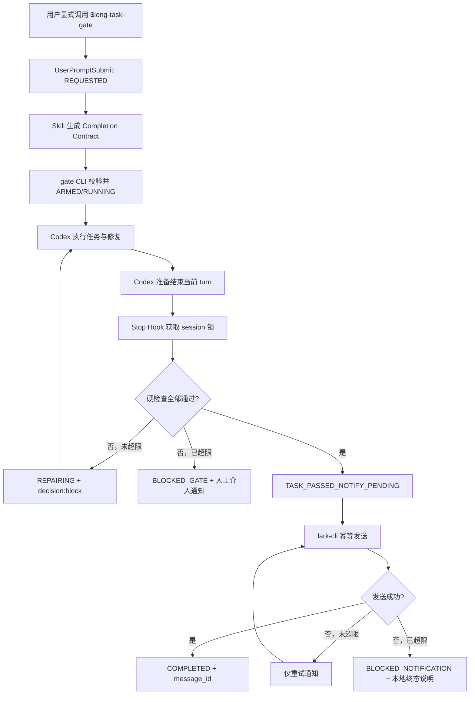

# 第83条主线：Codex 长任务门禁与飞书通知

**Goal:** 为 CGC-PMS 的显式长任务建立可观测、可恢复、默认不影响普通任务的 Completion Gate：任务准备结束时由 Codex `Stop` Hook 校验结构化完成契约，未通过则继续修复，通过后以幂等方式调用 `lark-cli` 发送一次飞书通知。 **Architecture:** V1 采用仓库级 `.codex/hooks.json`、一个显式调用的 `long-task-gate` Skill、一个 Node.js 标准库门禁 CLI 和用户级私有运行状态目录；Skill 只负责把任务目标转成 Completion Contract，Hook/CLI 负责确定性校验、状态原子写入、有限重试和通知。复用现有 `lark-cli` 及仓库飞书授权边界，不改现有全局 `notify`，不复用 AutoPilot 业务状态机，不引入数据库、后台守护进程、第三方运行库或非本地环境。

> 编制日期：2026-08-08
> 状态：`COMPLETED / G0-G5_PASSED / GIT_DELIVERED`
> 规划基线：`codex/mainline-81-live-e2e-code-cap@367d110e6e66dfbf3248d7b00299c98ebd526603`
> 当前工具：`codex-cli 0.146.0`、`lark-cli 1.0.70`；版本只代表编制时本机快照，实施 G0 必须重新核验
> 工作区边界：编制时已有第81/82条、Codemap、Backlog、前后端和测试等非本任务脏改动；本轮只新增本文档
> 环境边界：只规划本机 Windows Codex Desktop/CLI 与本地 CGC-PMS 仓库；不规划生产、预生产或目标环境
> 授权边界：原计划编制轮仅授权计划；2026-08-08 用户 `/goal` 已追加授权仓库级实施、私有状态、最小真实金丝雀与最终受保护 Git 交付
> 预计投入：开发 4～6 人日、独立验证 1～2 人日；属于估算，不是交付承诺

> 实施回写（2026-08-08）：用户 `/goal` 已授权仓库级金丝雀、Bot、自认证账号测试目标、私有状态和最终推送。被 `.gitignore` 屏蔽的交付路径改为精确白名单；Hook、Skill、CLI、有限续跑、幂等真实通知、CLI/App Server 金丝雀、文档与质量报告通过。正式证据见 [ISSUE-083 质量报告](../quality/2026-08-08-issue-083-Codex长任务门禁与飞书通知.md)。

---

## 1. 结论与关键裁决

### 1.1 方案裁决

采用“显式 Skill + `UserPromptSubmit` 请求登记 + `Stop` 强制校验 + `lark-cli` 幂等通知”。

| 组件 | 本期职责 | 裁决 |
| --- | --- | --- |
| `long-task-gate` Skill | 解析目标、生成完成契约、指导执行者登记/查询/取消门禁 | 必需；仅显式调用 |
| `UserPromptSubmit` Hook | 识别显式激活标识、登记 `REQUESTED`、注入必须建约的上下文 | 必需；脚本内自过滤 |
| `Stop` Hook | 校验活动契约；失败时返回 `decision: block`；通过后触发通知 | 必需；真正门禁 |
| `lark-cli` | 以 Bot 身份向明确目标发送成功或人工介入通知 | 必需；外部写入需授权 |
| 原生 `notify` | 现有每轮结束桌面提醒 | 保持不动，不参与完成裁决 |
| `SessionEnd` Hook | 会话关闭/闲置后的建议性处理 | V1 不建设 |

当前 OpenAI 官方文档已确认：

1. Codex 支持 `UserPromptSubmit`、`Stop`、`SessionEnd` 等生命周期 Hook；仓库级入口是 `<repo>/.codex/hooks.json`，项目 Hook 需信任审查：[OpenAI Hooks](https://learn.chatgpt.com/docs/hooks)。
2. `Stop` 返回 `{"decision":"block","reason":"..."}` 时，Codex 会自动创建 continuation prompt；`Stop` 和 `UserPromptSubmit` 当前都不支持 matcher，脚本必须自行判断是否存在活动长任务。
3. `SessionEnd` 是建议性事件，不能保持任务继续；不作为完成门禁。
4. Codex `notify` 当前仅支持 `agent-turn-complete`，它只能运行外部通知程序，不能证明目标完成或阻止结束：[OpenAI Advanced Configuration](https://learn.chatgpt.com/docs/config-file/config-advanced)。
5. Skill 支持仓库级 `.agents/skills`、显式调用和 `agents/openai.yaml`；V1 使用 `allow_implicit_invocation: false`，防止普通任务被误上锁：[OpenAI Build skills](https://learn.chatgpt.com/docs/build-skills)。
6. 飞书官方 `lark-cli` 支持消息发送、`--dry-run`、Bot/User 身份和结构化输出；当前本机帮助还确认 `--idempotency-key` 最大 50 字符：[Lark CLI](https://github.com/larksuite/cli)。

### 1.2 对引用会话的校正

引用会话提出的总体方向成立，但实施不能直接复制示例：

- Hook 输入/输出、Windows 命令、信任与超时以实施时官方文档和实际 Codex Host 为准；
- `Stop` 放行也输出合法 JSON，普通任务和无活动门禁统一返回 `{"continue":true}`；
- 不能让模型自述“已完成”成为证据；每个硬门禁必须是命令、文件、状态或结构化回读；
- 不能无限 `decision: block`；门禁修复和通知重试分别限次，耗尽后进入明确 `BLOCKED_*` 状态并做一次终态说明；
- 飞书发送失败不重新执行已通过的业务验收，只重试通知通道；仍失败则任务结果保持“业务已通过、通知阻塞”，不得伪称完整完成。

### 1.3 不选方案

| 方案 | 不选原因 |
| --- | --- |
| 纯 Skill | 依赖执行者自觉，不能在生命周期节点强制检查 |
| 纯 `notify` | 每个 turn 都触发，噪音大；无活动契约和阻断能力 |
| 纯 `SessionEnd` | 触发语义是会话结束/闲置，不等于目标完成；不能续跑 |
| 直接复用 AutoPilot state | 状态、checkpoint、Issue 与控制面语义过重，会耦合两套治理流程 |
| 新建数据库/服务/守护进程 | 本机单用户 V1 不需要；增加故障面与维护成本 |
| 默认全局 Hook | 未经试点会影响所有仓库和普通任务；先做 CGC-PMS 仓库级金丝雀 |
| 从飞书读取指令并继续执行 | 引入身份、重放、注入和授权扩大；V1 只出站通知 |

---

## 2. 当前事实与约束

### 2.1 当前本机与仓库事实

1. 仓库当前没有原生 `Stop`、`UserPromptSubmit` 或 `SessionEnd` Hook；`.codex/config.toml` 只含 sandbox、approval、model 与 agents 配置。
2. 用户级 Codex 配置已有 `notify = [..., "turn-ended"]`，仅作每轮结束提醒；本任务不覆盖、拼接或删除它。
3. `lark-cli 1.0.70` 已在 PATH，可发现 `im +messages-send`、`--chat-id`、`--user-id`、`--dry-run` 和 `--idempotency-key`；本轮未读取登录身份、未登录、未发送消息。
4. [`docs/prompt/lark-confirmation-flow.md`](../prompt/lark-confirmation-flow.md) 已规定飞书目标与授权边界：目标必须由当前调用显式提供或来自已验证上下文；仓库不得保存固定个人/群 ID；外部写入不得因超时自动扩大授权。
5. AutoPilot 已有单写者、原子状态、checkpoint、fencing 和完成核算经验，但只复用原则，不共享 `.codex-autopilot/state.json`、lock、run 或 Issue 状态。
6. 当前 Codemap、计划索引及其他多模块文件已有他人脏改动；正式实施前必须解决文件所有权或在另获授权后使用独立工作区。

### 2.2 安全与能力边界

- Hook 是本地治理护栏，不是对恶意仓库、恶意模型或管理员的安全隔离；用户可禁用 Hook，部分工具路径也可能不经过工具 Hook。
- 项目 Hook 只有在项目受信任且 Hook 定义通过审查后运行；任何命令或脚本变更都需重新做源代码审查和实际 `/hooks` 验证。
- 完成契约不能从网页、飞书消息、测试输出或其他不可信文本自动扩展为新命令。
- 门禁 CLI 执行命令时禁止 `shell: true`、字符串拼接和隐式 PowerShell；只接受显式 executable/args/cwd/timeout。
- 飞书凭据由 `lark-cli` 自己保管；门禁代码不读取、不复制、不记录 token、secret 或 auth 文件。
- 收件目标只能来自本次显式调用或用户级私有配置；仓库、计划、日志、测试 fixture 不出现真实 `oc_`、`ou_` 或 tenant 标识。
- 通知正文采用字段白名单；不包含 prompt 全文、命令输出、账号、绝对用户目录、token、Cookie、业务数据或内部错误堆栈。

---

## 3. 目标、范围、非目标与不变量

### 3.1 可验收目标

1. 普通任务没有活动契约时，两个 Hook 均在 1 秒级无副作用放行。
2. 用户显式调用 `$long-task-gate` 后，本会话产生唯一 `task_id`、完成契约、状态和事件记录。
3. 任一硬检查未通过时，`Stop` 必须阻止“完成”终态并给出失败分类、证据、责任动作和最小复验。
4. 所有硬检查通过后，只发送一次成功飞书通知，并记录可回读的消息结果与幂等键。
5. 重复 `Stop`、Codex continuation、进程中断或发送后落盘失败不产生重复通知。
6. 同一会话的后续普通 prompt 不复用已完成或已取消任务；新任务必须重新显式激活。
7. 门禁或通知连续失败达到阈值后停止自动循环，进入可解释的人工介入状态。
8. 卸载仓库 Hook/Skill 或删除其用户级状态目录即可回滚，不影响 CGC-PMS 业务数据、AutoPilot、全局 `notify` 或飞书凭据。

### 3.2 本期范围

- 仓库级 `UserPromptSubmit`、`Stop` Hook 配置；
- 仓库级 `long-task-gate` Skill、UI 元数据、契约参考和标准库脚本；
- 用户级私有运行状态、原子写、会话 fencing、有限重试与幂等 outbox；
- 命令、文件、Git 范围和结构化状态四类可观察检查；
- 飞书 Bot 文本消息、dry-run、真实金丝雀与失败路径；
- Node 内置测试、Hook fixture、Skill 校验、敏感标识扫描；
- Codex Desktop 与 CLI 的本地真实生命周期验收；
- 使用说明、Codemap、质量报告和计划收口。

### 3.3 明确非目标

- 不自动把所有长对话识别为门禁任务；
- 不读取模型“我已完成”、自然语言 TODO 或 transcript 作为唯一硬证据；
- 不建设通用 CI 编排器、工作流引擎、任务队列或后台通知服务；
- 不接收飞书回复，不通过飞书授权 Git、数据库、生产或外部写操作；
- 不修改现有全局 `notify`，不发送每轮进度消息；
- 不复用或修改 AutoPilot checkpoint、fencing、评分、调度和 Issue 状态；
- 不自动安装/升级 `lark-cli`，不自动创建飞书应用、申请权限或登录；
- 不自动 commit、push、PR、合并、Tag、Release 或发布；
- 不承诺恶意执行者无法篡改本地状态；V1 目标是防止误报、漏验和重复通知。

### 3.4 架构不变量

1. Skill 定义“应检查什么”，门禁 CLI 决定“客观检查是否通过”；两者不得互相伪造完成。
2. 活动任务以 `repo_key + session_id + task_id + generation + contract_hash` 唯一标识。
3. 一个 session 同时最多一个活动门禁；新激活遇到旧活动任务必须 fail-close 或显式取消，禁止静默覆盖。
4. 状态只能经门禁 CLI 原子写入；临时文件写完、flush 后再 replace，并使用单 session 锁防止并发 `Stop`。
5. `stop_hook_active` 只作为当前 turn 已被续跑的信号，真正防无限循环仍依赖持久化 attempt、错误指纹和上限。
6. 成功通知的幂等键在首次发送前确定，长度不超过 50，重试不得变化。
7. 业务检查一旦绑定同一代码/契约指纹通过，通知重试不得重新执行业务命令。
8. 任何损坏、版本不兼容、锁冲突或未知状态对活动任务 fail-close；对无活动任务 fail-open。
9. `COMPLETED` 只在门禁通过且飞书发送成功后成立；通知耗尽则为 `BLOCKED_NOTIFICATION`，不是 `COMPLETED`。
10. 本项目只有本地环境；计划和验收不得制造生产或目标环境阻塞项。

---

## 4. 目标架构与运行流程



### 4.1 Hook 输入输出契约

`UserPromptSubmit`：

- 输入只使用官方稳定字段：`session_id`、`turn_id`、`cwd`、`hook_event_name`、`prompt`、`permission_mode`；
- 只有实际 prompt 含 G1 冻结的显式标识时创建 `REQUESTED`；普通 prompt 返回 `{"continue":true}`；
- 激活时返回 `hookSpecificOutput.additionalContext`，要求执行者先完成契约登记；
- 不依赖 matcher，不读取 transcript 格式，不直接发送飞书。

`Stop`：

- 输入只使用：`session_id`、`turn_id`、`cwd`、`stop_hook_active`、`last_assistant_message`；
- 无活动状态、`COMPLETED` 或 `CANCELLED` 返回 `{"continue":true}`；
- `REQUESTED` 但缺契约、契约损坏或检查失败时返回 `decision: block`；
- reason 必须短且结构化：失败检查、七类失败分类、证据摘要、责任动作、最小复验；
- 超过修复上限时只再生成一次终态说明 continuation，随后以 `BLOCKED_GATE` 结束，禁止伪称完成；
- 多个匹配 Hook 可能并发启动，本 Hook 不假定能阻止其他 Hook；只保证自身状态与通知幂等。

### 4.2 Completion Contract V1

最小字段：

```json
{
  "schema_version": 1,
  "task_id": "stable-local-id",
  "title": "任务标题",
  "repo_root": "resolved-path",
  "activation_turn_id": "turn-id",
  "max_repair_rounds": 3,
  "notification": {
    "identity": "bot",
    "target_kind": "chat_id|user_id",
    "target_ref": "private-local-reference",
    "max_attempts": 2
  },
  "checks": [
    {
      "id": "typecheck",
      "kind": "command",
      "executable": "pnpm",
      "args": ["--dir", "frontend-admin-v2", "type-check"],
      "cwd": ".",
      "timeout_seconds": 600,
      "required": true
    }
  ]
}
```

约束：

- Skill 只从用户完成条件、仓库验收命令和正式计划提取检查，不凭空增加生产、Git 或外部写；
- `command` 使用数组参数与精确 cwd；禁止 shell 字符串、重定向、管道、通配符和命令替换；
- `file` 只允许仓库内精确相对路径，可选内容摘要/非空/更新时间条件；
- `git_scope` 以激活基线与当前 diff 比较任务允许范围，必须保留激活前脏改动；
- `state` 只读取明确 JSON 字段与枚举，不用正则猜测自然语言；
- `required:false` 只作建议，不影响 Gate；硬门禁禁止 `manual` 或“模型自评”；
- 长于 Hook 总超时的验证必须由仓库已有确定性 verifier 提供快速回读，不能把“曾经运行”当作通过；
- 合同冻结后任何检查、命令、目标或阈值变化都递增 generation、重算 hash，并重新打开 G1。

### 4.3 状态机与恢复

```text
IDLE
  → REQUESTED
  → ARMED
  → RUNNING
  → VERIFYING
      ├─ check fail → REPAIRING → VERIFYING
      ├─ attempts exhausted → BLOCKED_GATE
      └─ pass → TASK_PASSED_NOTIFY_PENDING
                    ├─ send pass → COMPLETED
                    └─ send fail → NOTIFY_RETRY
                                      ├─ retry pass → COMPLETED
                                      └─ exhausted → BLOCKED_NOTIFICATION

REQUESTED/ARMED/RUNNING/REPAIRING → CANCELLED 仅允许显式取消
```

用户级运行目录建议：

```text
<CODEX_HOME>/long-task-gate/
├─ config.local.json            # 可选私有目标别名；不入 Git
└─ repos/<repo-hash>/sessions/<session-id>/
   ├─ state.json
   ├─ contract.json
   ├─ events.jsonl
   ├─ outbox.json
   └─ gate.lock
```

运行目录只继承当前 Windows 用户 ACL；保存目标引用、状态、时间、摘要、失败分类和飞书 message id，不保存 credential、prompt 全文或命令完整输出。默认保留最近 30 天/50 个终态任务，清理只删除该工具自己创建且解析确认的精确目录；最终值在 G1 冻结。

### 4.4 飞书通知契约

V1 使用 Bot 文本消息，不用富文本卡片。发送顺序：

1. 门禁通过后原子写 `TASK_PASSED_NOTIFY_PENDING` 与稳定幂等键；
2. 先在 G3 用 `--dry-run` 验证请求；G4 获明确授权后执行真实发送；
3. 调用 `lark-cli im +messages-send --as bot`，目标参数只能是一个 `--chat-id` 或 `--user-id`；
4. 解析 JSON、验证成功字段并记录 message id；
5. 若“已发送、落盘前崩溃”，使用同一幂等键重试，禁止生成新键；
6. 失败只重试通知，最多 2 次；仍失败进入 `BLOCKED_NOTIFICATION`，由 Codex 最终消息明确报告。

成功消息字段白名单：

```text
✅ Codex 长任务完成
项目：<repo-name>
任务：<sanitized-title>
分支/HEAD：<branch>@<short-sha>
门禁：<passed>/<total> PASS
状态：COMPLETED
耗时：<duration>
报告：<repo-relative-path-or-none>
```

修复次数耗尽时可发送一次“需要人工介入”通知；通知通道本身失败时不尝试用同一通道发送失败通知。

---

## 5. 建议文件范围与所有权

### 5.1 计划内新增文件

```text
.codex/
└─ hooks.json

.agents/skills/long-task-gate/
├─ SKILL.md
├─ agents/
│  └─ openai.yaml
├─ references/
│  └─ completion-contract.md
├─ scripts/
│  └─ long-task-gate.mjs
└─ tests/
   └─ long-task-gate.test.mjs

docs/manuals/
└─ codex-long-task-gate.md
```

`SKILL.md` 保持简短命令式流程；契约细节放 `references/`；确定性状态与外部 CLI 调用放单一标准库脚本；Skill 内不新增 README、安装指南、changelog 或占位目录。

### 5.2 允许按证据修改的既有文件

| 文件 | 目的 | 边界 |
| --- | --- | --- |
| `docs/prompt/lark-confirmation-flow.md` | 仅在发现现有出站通知边界缺口时补充引用 | 不扩展为入站遥控 |
| `scripts/codex-autopilot/test-codex-task-execution-policy.ps1` | 增加无硬编码 ID、无默认授权、Hook 引用存在的静态契约 | 不改 AutoPilot 状态机 |
| `scripts/codemap/generate-codemap.mjs`、`docs/codemap/*` | 若当前地图不能表达 Hook→Skill→CLI→Lark 边界，则同步更新 | 不伪造业务 Service/DB 依赖 |
| `docs/plans/README.md` | G5 串行登记第83条状态 | 当前他人脏改动归属未解决前禁止写入 |
| 本计划与 `docs/quality/*` | 回写 G0～G5 证据和正式质量报告 | 计划通过不等于实现通过 |

### 5.3 禁止修改

- backend、frontend、Flyway migration、数据库、租户、金额、权限或业务状态机；
- `.codex-autopilot/state.json`、checkpoint、run、Issue、评分或调度控制面；
- 用户级现有 `notify` 配置、飞书凭据文件或其他全局 Skill/Hook；
- 第81/82条及当前其他任务脏改动；
- 生产、非本地环境、Git 发布和远端配置。

若 G0 决定从“仓库级金丝雀”升级为“用户级全局 Skill/Hook”或个人 Plugin，属于架构与写入范围变化，必须重新获授权并至少重开 G1；本计划不静默切换。

---

## 6. 阶段、任务与 G0～G5 门禁

所有阶段按 `G0 → G1 → G2 → G3 → G4 → G5` 串行。计划书完成不等于 G0 通过，Hook 单测通过不等于真实 Codex 生命周期通过，飞书 dry-run 不等于真实消息送达。

### G0：基线、授权与可行性锁定

任务：

1. 重新记录分支、HEAD、`git status --short`、worktree、Codemap lock 和任务允许文件；保护现有脏改动。
2. 记录实际 Codex Desktop Host 与 CLI 版本，确认 `[features].hooks` 未被关闭，检查 `/hooks` 信任流程。
3. 通过 `/hooks` 枚举用户、profile、项目、插件和 managed 等全部活动来源，列出所有 `UserPromptSubmit`/`Stop` Hook；存在重叠门禁、同目标通知或 `continue:false` 冲突时，必须先形成保留/禁用裁决和并发复验，无法裁决则 G0 阻塞。
4. 用最小临时 Hook 验证 Desktop 与 CLI 是否都提供计划所需字段、`commandWindows`、cwd、Stop continuation 和 `stop_hook_active`；临时资产验后删除。
5. 核对 Node 可执行文件和版本；V1 不新增 npm 依赖。
6. 执行 `lark-cli --version`、`auth status` 和消息 schema/help；不自动安装、升级、登录或申请权限。
7. 由用户确认仓库级金丝雀、Bot 身份、目标类型/目标、真实发信授权和“通知失败不重跑业务检查”策略。
8. 比较 Codemap；若陈旧或不能回答调用者、影响与测试，先在文件所有权解决后刷新三件套。

通过证据：版本、字段 fixture、Hook 信任截图/输出、lark schema/auth 状态、授权记录、工作区基线。

未通过动作：保持 `G0_BLOCKED`；不创建正式 Hook、不登录、不发信。

### G1：契约、测试与停止条件冻结

任务：

1. 冻结显式激活语法、Completion Contract schema、检查类型和字段白名单。
2. 冻结状态枚举、合法迁移、单活动任务、generation/hash、锁、原子写和崩溃恢复。
3. 冻结修复上限 3、通知上限 2、单检查/总 Hook 超时、终态说明和取消协议。
4. 冻结飞书消息、幂等键、成功 JSON 判定、脱敏和目标私有存储方式。
5. 先写失败测试：普通任务、缺契约、失败检查、通过、重复 Stop、锁冲突、损坏状态、超限、发送崩溃窗口和通知失败。
6. 冻结 Skill 的 `name`、description、显式触发、`allow_implicit_invocation:false` 和 `agents/openai.yaml`。

通过证据：契约评审、状态迁移表、fixture、失败测试基线、Skill 触发正反例。

未通过动作：不得进入实现；修改契约后重置 G1 证据。

### G2：本地状态、权限与数据边界

本任务无数据库迁移、租户或业务数据写入；G2 不能省略，只能以证据证明 `N/A`。

任务：

1. 证明 Git diff 无 Flyway、DB、backend/frontend 业务变更；不连接数据库。
2. 验证运行状态仅写入当前用户 Codex 私有目录，仓库与 Git 不出现 recipient、credential、state 或 outbox。
3. 验证原子 replace、单 session lock、陈旧锁处理、generation/hash fencing 和损坏状态 fail-close。
4. 验证基线脏改动被单独记录，`git_scope` 只比较任务增量，不能要求清理他人成果。
5. 验证清理命令只处理工具自有精确路径，终态数据可先预览后删除；不自动清理飞书凭据。
6. 验证日志/事件不含 prompt 全文、真实 ID、token、绝对用户目录或命令完整输出。

通过证据：文件系统 diff、ACL/路径、原子写/并发/崩溃测试、敏感信息扫描、数据库 `N/A` 记录。

未通过动作：停止 Hook 启用；修复状态或权限边界。

### G3：Hook、Skill、门禁和通知闭环

任务：

1. 用 `skill-creator` 初始化 Skill，生成准确 `SKILL.md` 与 `agents/openai.yaml`，删除无用占位资产。
2. 实现单一 `long-task-gate.mjs`，提供 `user-prompt`、`stop`、`arm`、`status`、`cancel`、`notify-retry` 子命令。
3. 实现严格 JSON/schema 校验、无 shell 命令执行、精确 cwd、timeout、输出大小上限和失败摘要。
4. 实现状态锁、原子写、事件追加、错误指纹、修复预算和合法状态迁移。
5. 实现飞书 outbox、稳定幂等键、JSON 解析、两次有限重试与脱敏消息。
6. 配置仓库 `hooks.json`；Windows 用 `commandWindows`，路径从 Git root 稳定解析；UserPrompt 与 Stop 均自过滤。
7. 执行全部 Node 内置测试、Hook JSON fixture、Skill `quick_validate.py`、hooks JSON 解析和 `lark-cli --dry-run`。

通过证据：全部自动测试、dry-run 请求、状态/事件/幂等回读、普通任务无副作用。

未通过动作：先按七类失败分类；不得以手工演示替代自动契约。

### G4：真实 Codex 与飞书金丝雀验收

前置：G0～G3 全通过；用户明确授权真实发送；使用专门测试会话或群，不向未验证目标发送。

验收路径：

1. Codex Desktop 普通任务：未显式激活，任务正常结束，无飞书消息、无活动状态。
2. Codex CLI 普通任务：同上；证明 Host 差异不影响 no-op。
3. 激活但未登记契约：Stop 被阻断，续跑 reason 明确，不发送成功通知。
4. 契约含故意失败命令：连续失败进入 REPAIRING；修复后重新检查并通过。
5. 契约通过：真实飞书只收到一条成功消息；message id、幂等键、状态可回读。
6. 对同一终态重复触发 Stop/恢复会话：不重复发送。
7. 模拟 `lark-cli` 不存在、未认证、目标无效、超时、非零退出和无效 JSON：不重跑业务检查，不误标 `COMPLETED`，最终进入 `BLOCKED_NOTIFICATION`。
8. 模拟发送后落盘前崩溃：同一幂等键恢复，无重复消息。
9. 连续 3 次相同门禁失败：停止自动修复，进入 `BLOCKED_GATE`，只生成一次人工介入终态说明。
10. 显式取消、同会话启动第二任务、Codex 重启/恢复、并发 Stop 与陈旧锁分别验证。
11. 检查全局 `notify` 仍按原语义工作，无重复飞书、无配置覆盖。

本阶段的真实运行态是 Codex Hook 生命周期与飞书回执；本功能不涉及 CGC-PMS 页面，DOM/浏览器业务验收记为 `N/A with evidence`，不能用网页截图替代 Hook 证据。

通过证据：真实 Hook event、continuation、状态/事件、lark message id、接收端消息、异常路径与回滚记录。

未通过动作：分类并修复；真实接收端无消息不得以 dry-run 或 CLI 退出码代替。

### G5：正式收口与可选 Git 交付

任务：

1. 更新用户手册、契约参考、Codemap（如 G0 判定需要）、本计划和 `docs/quality/` 正式报告。
2. 运行 Skill 校验、Hook fixture、Node test、敏感 ID/secret scan、文档引用和 `git diff --check`。
3. 核对 Git diff 无运行状态、recipient、token、飞书消息内容、临时 fixture、日志或其他任务改动。
4. 逐项处理发现：本轮修复并复验、超范围正式承接、证据不足/无价值关闭。
5. 统计新增后续项、关闭后续项和净变化；存在无载体遗留时不得通过。
6. 只有另获 Git 授权后才允许提交、push、PR 或合并；本地 G0～G5 不等于远端 CI 或发布完成。

通过证据：G0～G5 索引、质量报告、任务自有 diff、回滚记录、零悬空统计。

未通过动作：状态保持 `IMPLEMENTED_NOT_ACCEPTED` 或对应阻塞状态。

---

## 7. 实施任务分解

| ID | 任务 | 主要输出 | 依赖 | 验收 |
| --- | --- | --- | --- | --- |
| LTG-001 | 锁定 Host/Hook/Lark 基线和授权 | G0 记录、最小 fixture | 无 | Desktop/CLI 字段与信任可用 |
| LTG-002 | 冻结 Completion Contract 与状态机 | 契约参考、迁移表 | LTG-001 | 正反例与停止条件完整 |
| LTG-003 | 建立失败优先测试 | `long-task-gate.test.mjs` | LTG-002 | 目标场景先红 |
| LTG-004 | 创建显式 Skill | `SKILL.md`、`openai.yaml` | LTG-002 | quick_validate 与触发测试通过 |
| LTG-005 | 实现门禁 CLI | 单脚本、私有状态、检查执行 | LTG-003 | no-op/block/pass/recovery 通过 |
| LTG-006 | 接入 Codex Hook | `.codex/hooks.json` | LTG-005 | Desktop/CLI fixture 通过 |
| LTG-007 | 接入飞书 outbox | dry-run、幂等、解析、重试 | LTG-005 | 重复/崩溃/失败测试通过 |
| LTG-008 | 真实本地金丝雀 | Hook continuation、飞书回执 | LTG-006～007 | 成功、阻断、通道失败三路径通过 |
| LTG-009 | 文档、Codemap 与收口 | 手册、质量报告、计划回写 | LTG-008 | G5 与零悬空通过 |

关键路径：`001 → 002 → 003 → 004/005 → 006/007 → 008 → 009`。Hook 配置、状态目录、运行环境、飞书真实写入、Git 和正式裁决由主线程串行处理；子智能体只做只读调查或独立测试复核。

---

## 8. 验收矩阵

| 编号 | 场景 | 验收标准 | 门禁/证据 |
| --- | --- | --- | --- |
| AC-01 | 普通任务 | 1 秒级放行；无 state、无飞书 | G3/G4 Hook event |
| AC-02 | 显式激活 | 唯一 REQUESTED 与 task/session 标识 | G1/G4 state 回读 |
| AC-03 | 缺契约 | Stop 阻断并要求建约 | G3 fixture |
| AC-04 | 失败检查 | `decision:block`；reason 含分类/证据/动作/复验 | G3/G4 continuation |
| AC-05 | 修复后通过 | 重新检查通过，不沿用失败终态 | G3/G4 event ledger |
| AC-06 | 修复超限 | 3 次后 `BLOCKED_GATE`，无无限循环 | G3/G4 attempt 记录 |
| AC-07 | 成功通知 | 明确目标收到一条消息，状态 COMPLETED | G4 message id/接收端 |
| AC-08 | 重复 Stop | 同幂等键且无重复消息 | G3 mock + G4 实发 |
| AC-09 | 发送崩溃窗口 | 恢复后不重复，outbox 一致 | G3 fault injection |
| AC-10 | 通知失败 | 不重跑业务检查；2 次后 BLOCKED_NOTIFICATION | G3/G4 event ledger |
| AC-11 | 状态损坏/锁冲突 | 活动任务 fail-close，普通任务不受影响 | G2/G3 fixture |
| AC-12 | 同会话新任务 | 旧终态不复用；活动任务不被静默覆盖 | G3/G4 state |
| AC-13 | 重启/恢复 | generation/hash 不漂移，可继续或显式取消 | G3/G4 recovery |
| AC-14 | Skill 触发 | 显式调用命中；普通“长任务”文字不隐式命中 | G1 trigger tests |
| AC-15 | 安全执行 | 无 shell 拼接、路径逃逸、真实 ID/secret/全文日志 | G2 static/runtime scan |
| AC-16 | 全局兼容 | `/hooks` 全来源已清点并裁决同事件冲突；现有 `notify`、AutoPilot、其他 Hook 不被覆盖，并发不重复续跑/通知 | G0/G4 source list/config/event |
| AC-17 | 可回滚 | 停用仓库 Hook/Skill 后普通任务恢复，业务数据不变 | G4 rollback |
| AC-18 | 正式收口 | G0～G5、文档、风险、回滚、零悬空齐全 | G5 报告 |

### 8.1 最小自动验证命令草案

以下仅供获准实施后执行；实际路径在 G1 冻结：

```powershell
node --test .agents/skills/long-task-gate/tests/long-task-gate.test.mjs
node -e "JSON.parse(require('fs').readFileSync('.codex/hooks.json','utf8'))"
python "$env:USERPROFILE\.codex\skills\.system\skill-creator\scripts\quick_validate.py" .agents/skills/long-task-gate
if ([string]::IsNullOrWhiteSpace($env:LTG_TEST_CHAT_ID)) { throw 'LTG_TEST_CHAT_ID is required' }
if ([string]::IsNullOrWhiteSpace($env:LTG_TEST_IDEMPOTENCY_KEY)) { throw 'LTG_TEST_IDEMPOTENCY_KEY is required' }
lark-cli im +messages-send --as bot --chat-id $env:LTG_TEST_CHAT_ID --text "gate dry run" --idempotency-key $env:LTG_TEST_IDEMPOTENCY_KEY --dry-run
rg -n -e 'oc_[A-Za-z0-9]{8,}' -e 'ou_[A-Za-z0-9]{8,}' -e 'app_secret\s*[:=]' -e 'tenant_access_token\s*[:=]' .codex .agents/skills/long-task-gate docs/manuals
git diff --check
```

测试目标和幂等键必须由当前 PowerShell 进程的私有环境变量提供，执行完清除；不得把真实值保存到仓库命令、日志或文档。若 G1 选择 `user_id`，将命令固定改为互斥的 `LTG_TEST_USER_ID`/`--user-id`，不能同时传两类目标。

---

## 9. 失败分类

所有 Hook、Skill、CLI、测试和运行态失败必须先归入以下唯一七类之一；相同参数和前置下禁止原样重试。

| 分类 | 本任务示例 | 责任动作与最小复验 |
| --- | --- | --- |
| `tool_config` | Hooks 被关闭、未信任、Node/lark 版本不兼容、认证/目标未配置 | 修正配置或前置；复验最小 Hook/auth/schema |
| `tool_invocation` | Hook JSON、commandWindows、PowerShell 转义、lark 参数/schema 错 | 修正调用；只复验该命令/fixture |
| `environment_prerequisite` | 网络不可达、Codex Host 未重载、飞书服务暂不可用、文件锁被外部占用 | 恢复环境；复验缺失路径 |
| `ready_issue_config` | Completion Contract 命令、范围、报告路径或验收选择器失真 | 最小修正契约并递增 generation |
| `retrieval_gap` | 无法取得 Hook event、message id 或必要回读证据 | 使用允许的备用读取；不得作不存在断言 |
| `quality_or_security` | 状态迁移、幂等、脱敏、路径、重复通知或门禁逻辑可复现失败 | 修复实现/测试；重开对应门禁 |
| `unknown` | 证据冲突、间歇失败且无根因 | 补日志/fixture；禁止强行归因或放行 |

每条失败记录最少包含：失败任务/步骤、失败分类、关键证据、当前处理与最小复验、是否阻塞。工具/环境修复不能改写为“业务检查已通过”；后续复跑不得覆盖首次失败事实。

---

## 10. 风险、停止条件与缓解

| 风险 | 影响 | 缓解/停止条件 |
| --- | --- | --- |
| Hook 对普通任务误触发 | 所有 turn 被阻断 | 显式 Skill、prompt 自过滤、无活动状态 fail-open、G4 普通任务金丝雀 |
| Stop 无限续跑 | 长任务失控消耗时间 | 持久 attempt + error fingerprint；修复 3 次、通知 2 次后终止自动循环 |
| 模型伪造完成 | 未验收即通知 | 硬门禁只接受确定性命令/文件/状态；禁用模型自评 |
| Hook 脚本变更后继续受信 | 执行未经复核代码 | G0 验证信任语义；每次源变更审查 diff、hash/版本、`/hooks`；Hook 不视为安全沙箱 |
| 多 Hook 并发 | 状态竞争或重复通知 | 单 session 独占锁、原子状态、稳定 idempotency；不依赖 Hook 执行顺序 |
| lark 发送后落盘失败 | 重复消息 | 先落 outbox，再发送；同一幂等键恢复 |
| 飞书认证/网络失败 | 业务完成但无人收到通知 | 只重试通知；耗尽后 BLOCKED_NOTIFICATION 和本地终态说明 |
| 硬编码收件人/泄密 | 错发或敏感信息入库 | 私有目标引用、字段白名单、secret/ID scan、真实目标不入 Git |
| 检查命令被注入 | 持久 Hook 执行任意 shell | executable/args schema、禁止 shell/pipeline、契约变更重开 G1 |
| 运行状态损坏 | 误放行或永久卡住 | 活动任务 fail-close、备份最后有效状态、显式 status/cancel/recover |
| 跨 worktree/会话串线 | 错任务收到结果 | repo/session/task/generation/hash fencing |
| 与 AutoPilot/全局 notify 冲突 | 重复治理或提醒 | 独立命名空间，不写其状态和配置；G4 并存验证 |
| 当前脏工作区冲突 | 覆盖第81/82条成果 | G0 文件所有权确认；共享文件串行或另获授权后隔离 |
| 官方 Hook/Lark schema 漂移 | 升级后失效 | G0 锁版本；版本变化先跑 contract tests，不自动升级 |

立即停止条件：目标身份不明、Hook 信任/字段不成立、契约含未授权外部写/生产/Git、状态无法 fencing、真实消息可能错发、敏感信息进入输出、相同失败耗尽重试或当前脏文件所有权冲突。

---

## 11. 回滚与恢复矩阵

| 触发 | 恢复动作 | 数据影响 | 复验 |
| --- | --- | --- | --- |
| 普通任务被误锁 | 在 `/hooks` 禁用本仓库 Hook，保留状态证据 | 无业务数据影响 | 普通 prompt 正常结束 |
| Hook 配置/脚本错误 | 回退任务自有 Hook/Skill 文件；不动用户全局 config | 无 | fixture + `/hooks` |
| 状态损坏 | 停用 Hook，备份精确 session 目录，执行显式 recover/cancel | 仅本地门禁状态 | status + 新测试任务 |
| 无限 continuation 风险 | 依据 attempt 强制进入 BLOCKED_GATE；禁用 Hook | 任务未完成，不产生业务回滚 | 终态说明与事件账本 |
| 重复飞书消息 | 停止发送，保留 message id/idempotency 证据，修复 outbox | 已发消息不可撤回；不删除他人消息 | 重复测试 |
| 错收件人 | 立即停用真实发送，报告错发范围，清除本地目标别名 | 需按飞书权限评估外部信息暴露 | 目标绑定与脱敏复验 |
| lark-cli 不可用 | 保持 TASK_PASSED/BLOCKED_NOTIFICATION，手工恢复 CLI 后只重试 outbox | 业务检查不重跑 | notify-retry + message id |
| Skill 触发失真 | 禁用 Skill 隐式调用，回退 description/openai.yaml | 无 | 显式/隐式正反例 |
| Codex/Lark 升级不兼容 | 固定已验证版本或停用 Hook，重新跑 G0～G4 | 无业务数据影响 | 完整金丝雀 |
| 试点失败 | 删除/停用仓库 Hook 与 Skill，按预览清理其用户级状态 | 只丢门禁历史；飞书凭据不动 | 普通任务、AutoPilot、notify |

回滚不删除飞书凭据、不撤回消息、不修改数据库、不清理其他 Codex 状态、不回退现有全局 `notify`，也不覆盖其他任务脏改动。

---

## 12. 实施前置与需确认事项

实施裁决已锁定：

1. 采用 CGC-PMS 仓库级金丝雀，不扩为用户级全局 Hook 或 Plugin。
2. `.codex/hooks.json` 与 `.agents/skills/long-task-gate/**` 采用精确 Git 白名单；私有运行状态使用当前用户 Codex 目录。
3. 飞书使用 Bot；真实金丝雀目标限定为当前认证账号自身，目标值不落盘。
4. 已执行 dry-run 和一次真实成功消息；异常路径使用 mock，不向其他目标发送。
5. 通知失败不重跑业务检查，最多 2 次后 `BLOCKED_NOTIFICATION`。
6. 第81/82条、Codemap 与计划索引由主线程串行整合，无并发同文件写入。
7. 用户 `/goal` 已授权全部任务收口后的受保护 Git 交付。

无需当前建设：全局部署、Plugin 市场发布、飞书入站控制、后台守护进程、非本地环境、生产告警、数据库队列或富文本卡片。

---

## 13. 计划完成定义与零悬空

本计划书完成标准：

- 目标、架构、范围、非目标、不变量、状态机、Completion Contract、文件范围、G0～G5、任务、验收、失败分类、风险和回滚已明确；
- 当前 Codex Hook、Skill、notify 与 lark-cli 能力已按 2026-08-08 官方文档和本机只读证据校正；
- Hook/Skill、私有状态、Bot dry-run 与自认证账号真实金丝雀已完成；
- 未修改用户全局 Hook、notify、AutoPilot、数据库或业务代码；
- Git 交付只在最终同 SHA 门禁通过后执行，不以本地证据预代远端结果。

本轮零悬空统计：

- 新增后续项：`0`；
- 关闭后续项：`0`；
- 后续项净变化：`0`；
- 当前裁决：`G0～G5 通过；PR #415 已合并；master@ff9ae4c70414f924555e0c4a935a99e5b5934d22 post-merge 通过`。
