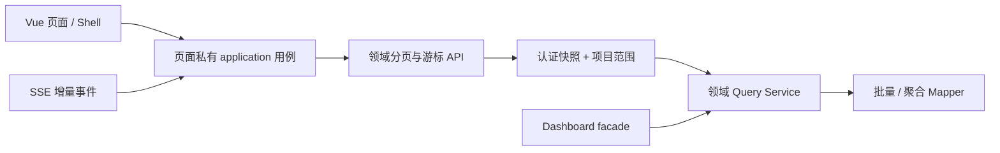

# 第91条主线：架构边界与查询性能分阶段整改

**Goal:** 在不改变现有业务结果、权限、金额、租户和状态语义的前提下，先收口三项并发任务形成的混合本地成果，再把已证实的请求放大、查询 N+1、无界历史加载、跨域服务膨胀和前端职责混杂问题分批整改为有界、可度量、可回滚的实现。 **Architecture:** 保留当前模块化单体、既有领域 Service/Mapper、JWT/黑名单、项目范围、Dashboard facade、通讯 SSE 与页面路由；采用“稳定精确基线 → 固定响应与查询预算 → SQL 批量/聚合与真分页 → 页面内垂直切片 → 当前 SHA 全链验收”的最小路径。不拆微服务，不建设通用缓存、查询网关、前端状态框架、消息队列或第二套权限/财务事实系统；跨请求授权缓存、异步 PDF 和新增索引必须先通过独立证据门。

> 日期：2026-08-11
> 计划状态：`IMPLEMENTED / AUTHORIZED / G0-G5_LOCAL_PASSED / GIT_DELIVERY_PENDING`
> 原始证据基线：本地 `master@6136f8ae82076e6dc8137cc8d0934873e8f76662` 与工作树混合成果；允许路径已保存为本地检查点 `40bbcaf29aac6b816140c2c9f57b96d474013c1a`
> 实施基线：`origin/master@e1b7adb238c499fb6a7672682473c30737794e04`；独立分支 `codex/mainline-91-architecture-query-performance` 与独立 worktree
> 最终代码证据 SHA：`b5b8eeaa8d65c848819145b30a04aa229b3b8d1a`；核心实现 SHA：`3aa0ec789465775ead00d27dc999851ab5fc5d0c`；浏览器门禁收口 SHA：`2a33977cf54add580734d5bccb1aac0518fdd4bf`；财务依赖验收 SHA：`c47f4fa76c4139067fd9a7ffe0395c1e175d565f`
> 环境边界：仅本地 dev/test/demo；不规划或发起非本地环境、生产数据库、生产部署或生产验收
> 当前授权：用户已明确授权本地实施、必要验证、branch/commit，以及全部收口后的受保护 push/PR/合并/清理；不授权非本地环境、生产数据库、生产部署、强推或绕过保护
> 唯一整改状态与验收载体：本计划 `M91-F01～M91-F13`；财务代码按第90条 M3 的唯一所有权实施，性能报告仅作为 `PERF-20260811-001～005` 的发现与证据来源

## 1. 三项任务收口裁决

### 1.1 已完成成果，不重复立项

| 来源任务 | 已完成最小改进 | 当前证据 | 本计划裁决 |
| --- | --- | --- | --- |
| 整洁架构重构 | 通讯发送拆为 `presentation → application ← infrastructure`；幂等重试、TTL 边界、附件续传和已发送草稿有定向测试 | 通讯单测 22/22、ESLint、TypeScript、生产构建与当时 Codemap 通过 | 作为前端垂直切片样板；G0 只做归属、集成和当前 SHA 复验，不重新设计 |
| 性能审查 | 通知/通讯首连去重；旧通知请求不能覆盖新状态；切换会话立即取消旧历史请求 | 540 个前端单测、类型检查、定向 lint、生产构建、包体门禁通过 | 保留改动；剩余五项按原 `PERF` 编号承接，不重复建立 Backlog |
| 架构审查 | 21 处本地日期默认值统一；项目详情和更新各减少一次重复项目查询 | 前端 3/3、后端 16/16、构建、GMT+8 浏览器和当时 Codemap 通过 | 作为已验证候选成果；G0 在稳定基线上确认进入或有据关闭，不再次实现 |

上述证据是本地任务证据，不等于当前工作树、Git 交付或合并证据。任何一项若不能在 G0 锁定后的精确 SHA 重现，只能判为“待重新集成”，不得沿用旧通过结论。

### 1.2 当前基线风险

1. 本地 `master` 的 `6136f8ae` 是混合提交，包含 CI/PDF 整改、通讯切片、日期 helper、架构文档和其他业务页面改动；不能整体 `reset`、`revert` 或按提交标题认定归属。
2. 当前未提交差异同时覆盖 `PmProjectService`、通讯 Shell/页面/application/tests、`scripts/ci` 和 Codemap 三件套；计划书不得接管或清理这些文件。
3. `docs/codemap/codemap.lock` 绑定 `6136f8ae`，记录 `working_tree_dirty=true`，且 `documentation` 为 stale；新增本计划后仍须等源码和文档冻结再统一生成、验证。
4. 三个任务已完成且无继续写入需求；后续实施必须单工作树、单批次、单写入者串行推进。数据库、Codemap、同文件修改和 Git 收口由主线程执行。
5. G0 仅按确认的任务路径白名单取证。`.omc/`、`.omo/`、`.opencode/`、`.claude/`、`.mimocode/`、`graphify-out/`、`.sisyphus/`、`.archive/`、`archive/v1.0/private/` 即使出现在混合提交中，也不得读取、扫描、总结、恢复、迁移或提交；除非用户以后逐项点名并明确解除禁止。

### 1.3 与既有主线和 Backlog 的关系

- 第76条已关闭项目文件授权扫描、通讯附件 N+1 和草稿清理竞态；本计划禁止重复整改。
- 第90条已规划资金与成本字段权威源收敛。`M91-F06/F07/F09` 和 `M91-F08` 的财务驾驶舱部分固定由第90条 M3 的“第91条依赖批次”作为唯一代码所有者实施；第91条只定义并裁决查询性能、金额、权限和响应验收，不在其他批次旁路修改相同财务服务。
- 第90条整体仍未获实施授权；为避免把第91条扩张成第90条全量实施，本轮只授权上述 M3 依赖批次。该批次不得推进 `M90-F01～F12` 的其他字段/迁移裁决，也不得宣称第90条 G0～G3 整体通过。
- `M91-F08` 的非财务 Dashboard facade/Query Service 拆分必须等待该依赖批次完成并锁定精确 SHA 后再实施。禁止两个批次并发写同一 Service、Mapper、DTO 或测试。
- 第90条计划必须正式回写依赖批次的文件所有权、范围边界及供第91条复用的精确 SHA/金额/权限/性能证据字段；未回写则第91条 G0 不通过。
- `docs/backlog/current-issues.json` 未发现与本计划五项性能问题或架构边界问题等价的活动项；本计划为唯一整改状态与验收载体，财务代码仍只在第90条 M3 实施，不另增重复 Issue。
- 2026-08-11 性能报告中的五个 `PERF` 项映射到本计划，报告继续保留原始证据，不作为第二状态源。

## 2. 发现项登记与优先级

| 计划 ID | 原始证据 | 优先级 | 问题与影响 | 目标裁决 |
| --- | --- | --- | --- | --- |
| `M91-F01` | 当前 Git/Codemap 状态 | G0 阻塞 | 混合本地提交和并发未提交差异使归属、验证与回滚边界失真 | 建立逐文件/逐 hunk 归属，形成单一稳定实施基线；禁止整树回退 |
| `M91-F02` | 架构审查 | P1/安全 | 默认已认证请求保留 1 次 Redis 黑名单检查，同时 `isCurrentCredential` 与 `isCurrentAuthorization` 重复加载用户，合计至少 4 次 MySQL | 合并为单次请求级认证快照校验；保留黑名单、角色/权限即时失效和 fail-close；默认不加跨请求缓存 |
| `M91-F03` | `PERF-20260811-001`、架构审查 | P1 | 四个全项目页面产生 `N～3N+1` 请求，项目范围先全量加载再 Java 过滤 | 各领域提供按服务端可见项目过滤的真分页查询；每视图 1 个 HTTP 数据请求，且 `Q(1)=Q(50)`、返回行不超过页大小、无 Java 二次范围过滤 |
| `M91-F04` | 架构审查 | P1 | 定时预警按项目、规则、9 个 evaluator 和业务事实逐层查询 | 固定 evaluator 集下 `Q(1)=Q(50)=Q(500)`，循环内 Mapper 调用为 0；保持规则、租户和状态语义 |
| `M91-F05` | `PERF-20260811-002` | P1 | 通讯首次串行拉取并渲染全部历史；1 万条消息约 100 次往返和 1 万 DOM 节点 | 增加向前游标，首屏只取最新 50～100 条，向上加载旧页，DOM 保持固定窗口 |
| `M91-F06` | `PERF-20260811-003` | P1/金额 | `PaymentTraceService` 对 K 个申请形成多层 N+1，并重复传输全部预算台账 | 以申请 ID 集合批量查询并分组组装；1/10/100 个申请查询数为常数级，响应图和金额完全一致 |
| `M91-F07` | `PERF-20260811-004` | P1/金额 | 现金摘要装载全部流水，待处理只取 `size()`，账户逐个 SUM | 使用条件聚合、COUNT 和按账户类型分组；1/100 账户查询数相同，10 万流水不实例化流水实体 |
| `M91-F08` | 架构审查 | P1/金额、P2/架构 | `DashboardSharedSupport` 约 691 行、26 个依赖；财务驾驶舱存在 N+1、无效历史期计算和重复超付算法 | 保留 Dashboard facade/响应契约；四种视图锁定精确 SQL 预算，历史视图实时风险调用为 0，超付计算权威实现仅 1 个；非财务拆分等待第90条 G3 精确 SHA |
| `M91-F09` | `PERF-20260811-005` | P2/金额 | 应收账龄对同一结果集执行五次查询和五次 Java 扫描 | 单条 H2/MySQL 兼容条件聚合 SQL 返回五桶；边界日和金额守恒通过 |
| `M91-F10` | 架构审查 | P2 | `PurchaseExecutionPage.vue` 约 2692 行，同时承担申请、订单、验收三套工作流 | 先拆三个页面私有 application 用例，再拆状态/组件；行为、路由和 API 不变 |
| `M91-F11` | 架构审查 | P2 | 26 个非 Dashboard 页面反向依赖 `pages/dashboard/model.ts` 的展示 helper | 仅把通用格式化/状态展示迁到一个中性共享文件；非 Dashboard 对 dashboard/model 的导入归零 |
| `M91-F12` | 架构审查 | P2 | `MatReceiptAssembler` 与 `MatRequisitionAssembler` 用反射读取 ID 并吞异常 | 为 `resolveEntities` 显式注入 `Function<T, Long>`；失败可观测，定向测试覆盖 |
| `M91-F13` | 架构审查 | P2/证据门 | 同步 PDF 占请求线程并持有 `byte[]`，但尚无大小、p95 或堆峰值证据 | 本轮先建立本地基准；异步实现进入 Ready 前必须签认决策阈值，G1 退出仍无阈值则以证据不足关闭且不留后续项 |

## 3. 范围与非目标

### 3.1 范围

1. 现有三任务成果的精确归属、稳定集成和当前 SHA 复验。
2. 认证快照校验、项目可见范围、全项目分页、预警批量评估。
3. 通讯历史游标、付款追踪、现金摘要、应收账龄和财务驾驶舱查询收敛。
4. Dashboard facade 内部拆分、采购执行页面垂直切片、展示 helper 依赖方向和两个物料 assembler。
5. PDF 仅做本地受控基准与“改/不改”决策，不默认实施异步化。
6. 相关后端/前端契约、查询数、金额、权限、浏览器和 Codemap 验证。

### 3.2 非目标

- 不拆微服务，不拆 Maven 物理模块，不建设通用 Query Bus、Repository 框架、缓存中台或前端全局 feature 框架。
- 不减少 Redis 黑名单检查，不信任 JWT 中的过期角色/权限，不放宽租户、项目、金额或 `SUPER_ADMIN` 隐藏语义。
- 不改变付款、现金、应收、预算、凭证和 Dashboard 的金额口径；不以性能为由绕过服务端权威计算。
- 不为减少 SQL 次数而无界扩大 `IN`、一次返回全量、在浏览器缓存全量数据或吞掉查询异常。
- 不修改已应用 Flyway migration；只有 `EXPLAIN` 证明现有索引不足时才新增对称版本化 migration。
- 不删除旧通讯游标或响应字段，直到兼容窗口、消费者搜索和回滚验证完成。
- 不顺带视觉重设计采购页，不变更路由、角色菜单或业务流程。
- 不连接或规划非本地环境，不重置当前数据库，不直接推送 `master`，不执行 Tag、Release 或生产发布；Git 只走用户已授权的受保护交付流程。

## 4. 目标依赖方向与不变量

1. 请求、SQL、返回行、DOM 节点和 JVM 实体数量必须有上界；分页后禁止客户端再全量拉取并 `slice`。
2. 认证每请求继续检查令牌有效性和黑名单；用户停用、密码变化、角色/权限变化、租户变化必须 fail-closed。
3. 项目范围由服务端 SQL 谓词下推；客户端项目 ID、分页参数和缓存不能扩大可见范围。
4. 金额优化前后以相同权威事实回读，精度、舍入、冲销、权限和响应图不变。
5. Dashboard 保持 facade 和现有 DTO；Query Service 只读，不反向修改领域事实。
6. 页面内 application 不导入 Vue、Router、DOM 或全局存储；页面继续作为组合点。
7. 通讯 SSE、游标页、去重和已读位点使用同一消息序号语义；旧请求取消不等于丢弃合法新消息。
8. 结构重构不引入新依赖；共享抽象仅在已证明多处复用时建立。

## 5. G0～G5 阶段计划

### G0：稳定基线与成果归属

1. 记录 `master`、`origin/master`、HEAD、status、worktree、暂存区和 Codemap lock；以只读方式保存 `6136f8ae`、工作树和三个任务最终文件清单。
2. 仅对确认的任务路径白名单逐文件、逐 hunk 标记：整洁架构、性能优化、架构优化、CI/PDF、未知归属。明确排除 1.2 所列禁读目录；未知归属和禁读路径不得自动接管、回退、迁移或提交。
3. 在用户另行授权后创建独立 `codex/` worktree；只迁入确认接受的任务成果，不使用 `git add -A`、整树 stash、reset 或整提交 revert。
4. 对 1.1 三项任务的已完成改进重新运行最小相关测试；通过则锁定为基线，失败则归类并回到对应任务修复，不以计划建议替代实现。
5. 源码和文档冻结后统一生成 `docs/codemap/codemap.html/json/lock` 并运行 `--verify`；三件套必须绑定同一快照。
6. 输出 G0 基线记录：精确 SHA、任务自有路径、未纳入路径、验证命令、有效结果、回滚点和第90条依赖状态。
7. 核对第90条计划已正式承接 1.3 所列有限财务依赖批次、唯一代码所有权与同 SHA 证据字段；核对不通过时停止，不允许第91条其他批次临时接管实现。

**G0 通过条件：** 独立工作树干净、任务成果归属明确、当前 SHA 可复验、Codemap 当前、无未知文件被纳入；否则保持 `G0_PENDING`，禁止修改后续模块。

#### G0 实施证据（2026-08-12）

- 实施分支与 worktree：`codex/mainline-91-architecture-query-performance`，从 `origin/master@e1b7adb238c499fb6a7672682473c30737794e04` 创建；G0 基线提交为 `993237a006b8e7d3ddbfde368c51be30a78ef57d`，提交后工作树干净。
- 原共享工作区先保存为本地检查点 `40bbcaf29aac6b816140c2c9f57b96d474013c1a`；仅迁入 39 个确认允许路径，所有禁扫目录均未迁入、未暂存、未纳入交付历史。
- 前端定向复验：通讯与工作区日期 4 文件、24 项通过；全量 ESLint 0 error（6 个既有 warning）、TypeScript、生产构建和包体 71 个 JS 资产门禁通过。
- 后端定向复验：首次因未注入本地 `TEST_JWT_SECRET` 而在 `JwtUtils` 启动阶段失败，分类为 `environment_prerequisite`；补齐测试变量后同一失败集 65 项、0 失败、0 错误，`BUILD SUCCESS`。
- 治理复验：工作流契约 14 项、push/post-merge evidence self-test、Codemap 生成与 `--verify` 均通过；第90条已登记有限财务依赖批次、唯一文件所有权和同 SHA 证据字段。
- G0 回滚点：未推送前保留 `origin/master@e1b7adb2` 与本地检查点；后续批次独立提交，失败只回退对应批次，不重置共享工作树或触碰禁扫路径。

### G1：响应契约、查询预算和失败测试

1. 为每个发现项记录当前请求数、SQL 数、返回行、DOM/实体数量和响应摘要；使用 mapper spy、测试计数器或现有日志，不新增观测依赖。
2. 固定以下最低预算：
   - 认证：每个普通已认证请求保留 1 次黑名单检查；用户凭证查询最多 1 次，总 MySQL 查询不高于 3 次。
   - 全项目页面：技术管理、质量安全、项目收尾、供应商寻源每个视图仅 1 个 HTTP 数据请求；固定分页参数下 `Q(1)=Q(50)`，每个端点的精确整数 SQL 上限在退出 G1 前由失败测试锁定；返回业务行不超过页大小，无 Java 二次范围过滤、无 429。MySQL `EXPLAIN` 必须命中可接受索引访问路径且无无界全表扫描。
   - 预警：固定规则和 9 个 evaluator 集合下 `Q(1)=Q(50)=Q(500)`，evaluator/项目循环内 Mapper 调用为 0；单批最多 500 个项目，返回事实行由规则集合和该批项目共同限定。
   - 通讯：1 万条历史时首屏 1 次请求、50～100 条；稳定后 DOM 窗口不超过 200 条。
   - 付款追踪：1/10/100 个申请的查询数不随 K 增长；无关预算台账不增加返回行。
   - 现金摘要：1/100 账户查询数相同；10 万流水不加载流水实体。
   - 应收账龄：严格 1 条聚合查询，覆盖 `-1/0/1/30/31/60/61/90/91` 日边界。
   - Dashboard：分别锁定单项目/当前、单项目/历史、全项目/当前、全项目/历史四种模式的精确整数 SQL 上限；全项目模式固定输入下 `Q(1)=Q(50)`，历史模式实时风险计算调用数为 0，超付计算权威实现计数为 1。
3. 保存优化前后 JSON、金额、状态、排序、权限和空值快照；所有高风险路径先写失败测试。
4. 固定通讯 `beforeSeq`、`limit`、SSE 追加、去重、已读位点和旧 `afterSeq` 兼容契约。
5. 固定 Dashboard facade 到现有 DTO 的契约；Query Service 拆分不得改变字段、权限或历史期语义。
6. 为 PDF 定义本地代表性文档集合，记录大小、行数、渲染时长和堆峰值；异步实现进入 Ready 前必须由业务/技术签认请求时限、堆预算和失败率阈值。若退出 G1 时仍无签认阈值，立即把 `M91-F13` 归入“证据不足而关闭”，不进入 G2～G5、不建立后续项。

**G1 通过条件：** `M91-F02～F12` 均有可重复基线、失败测试、量化验收指标和回滚路径；`M91-F13` 已取得签认阈值，或已按“证据不足”正式关闭且无后续项；金额/权限项完成独立只读复核。

#### G1/M1 当前证据（2026-08-12）

- `M91-F02`：普通 access token 路径保留黑名单 1 次，认证快照固定为用户凭证、角色、权限各 1 次，总 MySQL `Qauth=3`；显式关闭授权快照的测试兼容路径只读取用户凭证 1 次。Filter 不再直接依赖 `SysUserMapper`，refresh token 在黑名单、解析和数据库前拒绝。
- 失败契约覆盖租户、用户状态、凭据版本、角色、权限和运行时异常；全部 fail-close 为 401。`AuthServiceTest,JwtAuthenticationFilterTest` 共 17 项通过，0 失败、0 错误；回滚点为本批提交的直接父提交 `993237a006b8e7d3ddbfde368c51be30a78ef57d`。
- `M91-F03`：`ProjectAccessChecker.sqlScope()` 以参数化 SQL 下推当前租户、未删除项目、有效成员、有效角色及 `ALL/PROJECT_MEMBER/DEPT/DEPT_AND_CHILD/CUSTOM/SELF/NONE` 数据范围；构造范围不查询项目 ID，客户端 `projectId` 只追加 `AND`，隐藏 `SUPER_ADMIN` 与未知角色保持 fail-close。
- 四页全项目首屏均改为 1 个数据 HTTP：技术管理普通视图 `Q=2`、图纸/RFI/归档复合视图 `Q=3`；质量安全非空活动视图 `Q=2`；项目收尾 `Q=2`；供应商三表聚合工作台 `Q=6`，每张表各自不超过页大小。履约评价候选另以 `NOT EXISTS` 服务端查询锁定 `Q=2`，不依赖当前页客户端去重。
- 四域 count/metadata 与 page 查询均使用只读事务保持同一快照；所有新查询按 `created_at/date + id` 稳定排序，雪花 ID 在服务端转为字符串，供应商退货金额继续纳入 `BusinessAmountFieldCatalog` fail-close 脱敏目录，评分和数量仅按显式安全小数路径保留。
- 主线程统一复验：后端 `ProjectAccessCheckerTest`、四域分页和金额目录共 37 项通过；前端九个既有/新增契约文件共 41 项通过；contracts、Vue 类型检查通过，目标 ESLint 0 error。独立只读安全复核未发现租户、角色、项目或金额越权；其发现的跨 SQL 快照一致性问题已以只读事务修复。MySQL `EXPLAIN` 与当前 checkout 浏览器证据仍分别留待 G2、G4，故 G1 尚未整体通过。
- M1 精确提交：认证快照 `fdc30ef7b4ac851644d2e88074f6ce31ccbd6e99`；项目范围与四域真分页 `4164af108cb663d054081486248a39f745927315`。两次提交后均以提交后 HEAD 运行 Codemap `--verify` 通过。

#### G1/M2 当前证据（2026-08-12）

- `M91-F04`：定时入口按租户分组，服务层稳定去重项目后以每批最多 500 个调用批量 evaluator；规则配置、八类业务事实、收货入库联查和历史去重候选构成每批精确 11 次读，锁定 `Q(1)=Q(50)=Q(500)=11`，项目、规则和候选循环内 Mapper 查询为 0。项目选择、现金日记、命中持久化和通知属于明确外围预算。
- 预警去重保持旧语义：历史候选按当前租户与本批有界 `dedupKey` 集查询，不以历史记录的 `project_id` 错误收窄；`OPEN` 永久阻断、`PROCESSED` 按各规则窗口阻断、`INVALID` 不阻断，同一次调用跨 500 分片共享已命中键。规则结果、跨租户隔离和采购“已审批收货 + `IN` 入库”语义由批量及集成测试覆盖。
- `M91-F05`：后端保留旧 `afterSeq` 契约并增加 `beforeSeq`；`0` 表示最新页、正数为 exclusive 上界，两游标同时出现时 fail-close。非空历史页固定为成员、消息、附件 3 次查询，返回最多 100 条并保持升序；1 万条测试锁定最新 `9901～10000` 和前页 `9801～9900`。
- 通讯前端首屏只发 1 个最新历史请求；上翻按首条序号读取，窗口最多保留 200 个 `<article>`，历史窗口不推进已读，SSE 只提示“跳至最新”，切换、翻页和卸载继续使用 abort + generation 防止迟到覆盖。四个通讯测试文件共 26 项、Vue 类型检查和目标 ESLint 通过；后端 Controller/Service 共 15 项通过。独立只读复核无代码阻塞。
- M2 精确提交：`ebbedc1c919b2303da1214883a35bdc4758dfa99`。尚待真实 MySQL `EXPLAIN` 与当前 checkout 浏览器滚动锚点、SSE 和 DOM 验真，分别进入 G2/G4；本段不据此宣称 G1/G2/G4 整体通过。

#### G1/第90条 M3 财务依赖批次证据（2026-08-12）

- 第90条唯一代码批次已在精确 SHA `c47f4fa76c4139067fd9a7ffe0395c1e175d565f` 验收；生产实现祖先为 `ed73525a5bd47ee7e444989cacf82f51b685d087`，回滚点为 `ebbedc1c919b2303da1214883a35bdc4758dfa99`。第90条计划已回写文件所有权、范围、同 SHA 查询/金额/权限/状态证据；非财务 Dashboard 现可串行启动。
- `M91-F06`：付款追踪每个不超过 100 申请的分片固定 25 次 Mapper 读加 1 次 JDBC 读，申请循环内查询为 0；真实 H2 `byProject` 的 1/100 申请均为 MyBatis 30 次，加固定 JDBC 1 次。预算台账只按 tenant、project、业务类型和业务 ID 集返回。
- `M91-F07`：现金摘要固定现金日记聚合 1 次、账户类型余额聚合 1 次、可选保证金聚合 1 次，`Q(account=1)=Q(account=100)`；未归档冲销不计入，合法已归档冲销保持净额归零。
- `M91-F09`：五桶账龄严格 1 条 SQL，九个边界日通过；H2/MySQL 结果一致。
- `M91-F08`：自持活动预算的最坏路径将四模式精确 SQL 锁为 `17/6/18/3`，全项目 `Q(1)=Q(50)`；历史实时风险调用为 0，超付算法权威实现为 1。历史空项目、项目计划日期漂移和月末亚秒边界已回归。
- 财务 H2 17 类共 116 项通过；MySQL 约束夹具回归 30 项通过；真实本地 MySQL 定向 12/12 通过。`EXPLAIN` 证明账龄、现金汇总和账户聚合走现有 tenant/project/account 索引访问，付款台账由 tenant、project、业务类型与 ID 集有界收窄。无数据库结构变化，裁决为 `G2_NO_MIGRATION`。
- 两轮独立只读复核的金额、租户、权限、状态、冲销问题均已本轮修复并复验；未发现剩余财务代码阻塞。该证据只通过 `M91-F06/F07/F08` 财务部分和 `F09` 的依赖验收，不替代非财务 Dashboard、G2 其他域、G4 浏览器或 G5 全量门禁。

### G2：查询、索引与兼容数据契约

1. 优先使用现有索引上的分页、`IN` 批量查询、`COUNT`、`SUM(CASE...)`、`NOT EXISTS` 和分组聚合；避免把方言化日期函数作为账龄权威。
2. 对每个新 SQL 在 H2 和 MySQL 运行结果契约；MySQL 使用 `EXPLAIN` 记录访问路径、预计行数和临时表/排序情况。
3. 只有现有索引无法满足已签认预算时才新增 MySQL/H2 对称 migration；不修改历史 migration，不用索引掩盖无界查询。
4. 通讯向前游标优先复用 `(tenant_id, conversation_id, seq)` 语义；若现有索引足够，不新增列或 migration。
5. 金额查询对 0、NULL、负数、冲销、跨期、跨租户和无权限数据保持原语义；聚合后按服务端回读守恒。
6. 第90条若改变财务字段、来源或状态契约，本计划至少重开 G1/G2；禁止静默复用旧查询快照。

**G2 通过条件：** H2/MySQL 结果一致，查询计划满足预算，无跨租户/越权/金额差异；每个 migration 都有 fresh/upgrade 和回滚说明。

### G3：服务端闭环

#### M1：认证与项目范围

1. 将 `isCurrentCredential` 和 `isCurrentAuthorization` 合并为一次请求级验证快照：用户凭证只读一次，角色和权限各读一次。
2. 保留每请求黑名单检查、JWT 签名/类型/有效期、角色与权限 claim 对比和异常 fail-close；默认不增加跨请求缓存。
3. 若未来尝试授权版本，仅能在所有用户、角色、权限、租户变更入口可原子递增且撤权测试通过后启用；否则关闭该方案。
4. 把可见项目、成员、角色和数据范围下推现有 Mapper，并直接应用到分页查询；不先查全量 ID。

#### M2：预警与通讯

1. 预警按租户批量读取项目、规则和业务事实；每个 evaluator 以集合输入处理，禁止循环内 Mapper 调用。
2. 通讯后端增加向前游标，单次返回有界；前端首屏只取最新页，上拉读取旧页，SSE 只追加缺失序号。
3. 会话切换、退出和组件卸载继续取消旧请求；新旧会话状态和已读位点相互隔离。

#### M3：财务查询验收与非财务 Dashboard 拆分

1. 第90条 M3 的“第91条依赖批次”独占实现 `PaymentTraceService` 的集合批量查询、`CashJournalService.summary` 的条件聚合、`RevenueAdvancedService.aging` 的五桶聚合，以及财务 Dashboard 查询收敛；第91条其他批次不得编辑这些实现文件。
2. 第91条对该依赖批次的同一精确 SHA 执行查询计数、H2/MySQL、金额守恒、租户、权限、状态和响应快照验收；证据复用，不复制实现或测试事实源。
3. 依赖批次完成并锁定精确 SHA 后，才允许实施非财务 `DashboardSharedSupport` facade/Query Service 拆分；历史视图实时风险调用必须为 0，超付算法权威实现计数保持 1。
4. 金额对账、租户、权限、状态、响应或查询预算任一不一致，第91条性能验收不通过，并将缺陷回到第90条唯一代码批次修复；不得在第91条旁路修补财务实现。

**G3 通过条件：** 查询预算达标，服务端响应与金额/状态/权限基线一致，异常和超时 fail-closed，无平行计算或第二事实源。

### G4：前端职责、运行态与浏览器

1. `TechnicalManagementPage`、`QualitySafetyPage`、`ProjectCloseoutPage`、`SupplierSourcingPage` 改用各自真分页 API；筛选、翻页和项目切换不触发全量扇出。
2. 通讯页验证首屏、有历史/无历史、向上翻页、SSE 追加、重复事件、快速切换会话、已读位点和断线重连。
3. 复用通讯切片模式，把采购申请、订单、验收三个提交用例放入 `pages/supply-chain/purchase-execution/application/`；页面只保留组合、显示状态和竞态保护。
4. 仅将 `formatAmount`、`formatDecimal`、`dashboardStatusLabel` 迁入一个中性共享展示文件；迁移后非 Dashboard 页面对 `pages/dashboard/model` 的 import 为 0。
5. `MatReceiptAssembler`、`MatRequisitionAssembler` 的实体 ID 提取改为显式函数；无反射、无吞错，并补定向单测。
6. 在当前 checkout 对目标 URL 运行真实 DOM/交互/控制台验证；使用隔离端口时必须证明响应源码属于当前工作树，验收后精确停止临时进程。
7. 不做视觉重设计，不减少关键业务字段、审批入口、金额或追踪信息。

**G4 通过条件：** 页面请求和 DOM 有界，三套采购工作流行为不变，依赖方向收敛，浏览器无错误遮罩和相关 console error/warn。

### G5：全量复验与零悬空

1. 运行目标测试、相关模块回归、后端完整验证、前端全量单测、类型检查、构建、包体门禁和 `git diff --check`。
2. 运行 H2/MySQL 查询/迁移测试、查询预算和金额守恒测试；无数据库变更时明确记录 `G2_NO_MIGRATION` 依据。
3. 重新生成并验证 Codemap；报告当前 branch、HEAD、status、计划自有 diff 和未纳入差异。
4. 输出正式质量报告，逐项回写 `M91-F01～F13` 的通过/不通过、阻塞/非阻塞、依据、剩余风险和回滚条件。
5. 每项只能进入“本轮修复并复验”“证据不足或无明确价值而关闭”“超出范围并由唯一载体承接”；禁止无载体遗留。
6. 只有 G0～G5 本地完整通过后，才允许使用本轮已取得的 Git 授权执行受保护交付；禁止直接推送 `master`、强推或绕过保护。

**G5 通过条件：** 自动化、本地真实链路、查询预算、金额/权限不变量和 Codemap 全部通过；零无载体遗留项。

#### G1～G5 最终证据（2026-08-12）

核心实现证据为 `3aa0ec789465775ead00d27dc999851ab5fc5d0c`；本地 pre-push 发现通讯提示对比度和供应商 workspace E2E 夹具漂移后，以 `2a33977cf54add580734d5bccb1aac0518fdd4bf` 收口。首次远端 push CI 又暴露 SQL 安全扫描漏标和文档索引契约残留失效 Skill 路径，按 `quality_or_security / DELIVERY_GATE_OMISSION` 分类，以最小修复提交 `b5b8eeaa8d65c848819145b30a04aa229b3b8d1a` 收口，后者为最终代码证据；旧失败 SHA 不作为交付证据。以下阶段证据覆盖前文“当前证据”段落中的阶段性待办；收口文档与 Codemap 另以治理提交承接。

- `G1 PASS`：`M91-F02～F12` 均已由查询预算、失败契约和定向测试锁定；金额、权限、租户、状态、冲销与跨 SQL 快照完成独立只读复核。`M91-F13` 在固定 JVM 参数下完成三场景、每场景 5 次预热与 30 次正式样本，90 个正式样本 0 失败；因无业务/技术签认阈值，按计划以 `CLOSED / INSUFFICIENT_SIGNED_THRESHOLDS / NO_ASYNC` 关闭，不建后续项。
- `G2 PASS / G2_NO_MIGRATION`：H2 定向与完整后端测试通过；本地 MySQL 8.0.46 对四个分页工作区、通讯 `beforeSeq`、预警收货入库联查及财务聚合运行真实查询与 `EXPLAIN`。访问路径为 `ref/eq_ref/range` 或索引反向扫描，仅有页内有界排序，无无界扫描；H2/MySQL 的租户、金额、NULL、边界日、冲销和排序结果一致。现有索引满足预算，未新增或修改 migration。
- `G3 PASS`：认证 `Qauth=3` 且撤权/异常 fail-close；四域项目范围 SQL 下推；预警每批 11 次读且循环 Mapper 为 0；付款、现金、账龄及财务 Dashboard 复用第90条精确验收 SHA；非财务 Dashboard 两个服务脱离 `DashboardSharedSupport`，后者由约 691 行/26 依赖收敛为 105 行/8 个真实共享依赖/4 个活 helper。财务四模式预算保持 `17/6/18/3`；非财务单项目预算 `9/9/14/12/5`、全项目预算 `8/9/14/12/5`，均满足 `Q(1)=Q(50)`。
- `G4 PASS`：四个工作区、通讯和采购三路由在当前 checkout 的隔离本地实例 `127.0.0.1:8181/5273` 验真。`technical-management/workspace`、`quality-safety/workspace`、`project-closeouts/page`、`supplier-sourcing/workspace`、采购申请/订单/验收及通讯 `users/conversations/unread-count/stream` 均返回 200；技术页切换“图纸管理”成功，采购三路由分别显示对应标题与操作入口，通讯空历史 DOM `<article>=0≤200`，页面无错误遮罩，控制台 0 error/0 warn。富数据自动化在当前代码 SHA 覆盖 1 万历史、向上翻页、SSE 提示/补拉、重复/跨 gap 事件、快速切换、已读不回退和断线重连；其中 `communication-page.test.ts` 锁定历史窗口与会话竞态，`communication-shell.test.ts` 明确锁定首次握手与重连刷新，两文件定向复跑 19/19。首次 local profile 因 `minio.enabled=false` 未注册通讯 Bean，按 `environment_prerequisite` 分类后改用已有本地 MinIO dev 基线复验，未改生产代码；验收后精确停止隔离进程。应用内截图接口超时/不支持，截图留证改用本地 Playwright；DOM、交互、控制台和 HTTP 证据仍来自应用内浏览器与后端访问日志。
- `G4 pre-push 补充`：默认 Playwright 5173 实际挂载另一 worktree，按 `environment_prerequisite` 排除；在当前 worktree 隔离 5273 复验后，修正通讯历史提示 4.42:1 对比度与供应商 E2E 的旧三端点夹具。通讯/供应商定向 E2E 13/13、相关单测 24/24、目标 ESLint 与 Vue 类型检查通过；生产查询、权限、金额和响应契约未改。
- `G5 PASS`：精确 SHA 后端完整验证生成 358 份 Surefire 报告，2723 项、0 failure、0 error、25 条件跳过；前端全量 79 文件、567 项通过，contracts 类型、Vue 类型、生产构建与 71 个 JavaScript 资产包体门禁通过。最终治理文档冻结后已再次生成 Codemap 三件套并通过 `--verify`；`git diff --check` 与独立安全/金额/架构复核通过，三件套纳入同一治理提交。

| 发现项 | 最终状态 | 核心证据与处置 | 回滚点 |
| --- | --- | --- | --- |
| `M91-F01` | 本轮修复并复验 | 独立 worktree、允许路径迁入、禁区排除、逐批提交与 Codemap | `origin/master@e1b7adb2`；本地检查点不交付 |
| `M91-F02` | 本轮修复并复验 | 黑名单 1 次，认证 MySQL `Qauth=3`，17 项 fail-close 测试 | `993237a006b8e7d3ddbfde368c51be30a78ef57d` |
| `M91-F03` | 本轮修复并复验 | 四域真分页、SQL 项目范围、每视图 1 个 HTTP、MySQL `EXPLAIN` | `fdc30ef7b4ac851644d2e88074f6ce31ccbd6e99` |
| `M91-F04` | 本轮修复并复验 | `Q(1)=Q(50)=Q(500)=11`、循环查询 0、去重/跨租户守恒 | `4164af108cb663d054081486248a39f745927315` |
| `M91-F05` | 本轮修复并复验 | `beforeSeq`、每页 3 查询、首屏≤100、DOM≤200、旧契约兼容 | `4164af108cb663d054081486248a39f745927315` |
| `M91-F06` | 本轮修复并复验 | 内部批量组装器每个≤100申请分片固定 25 Mapper+1 JDBC、循环查询 0；`byProject` 在 SUPER_ADMIN 下端点总预算 30 MyBatis+1 JDBC | `ebbedc1c919b2303da1214883a35bdc4758dfa99` |
| `M91-F07` | 本轮修复并复验 | 条件/类型余额聚合，1/100 账户恒定，未归档冲销排除 | `ebbedc1c919b2303da1214883a35bdc4758dfa99` |
| `M91-F08` | 本轮修复并复验 | 财务 `17/6/18/3`；非财务 Query Service 与 SharedSupport 边界收敛 | 财务回滚 `ebbedc1c...`；非财务回滚 `c39c9d54...` |
| `M91-F09` | 本轮修复并复验 | 五桶单 SQL、九个边界日、H2/MySQL 一致 | `ebbedc1c919b2303da1214883a35bdc4758dfa99` |
| `M91-F10` | 本轮修复并复验 | 三个页面私有 application，用例/回滚语义 19/19 | `c39c9d54ee13a7b8c1ccb750e51ff68ab3ad6519` |
| `M91-F11` | 本轮修复并复验 | 中性展示 helper；26 个业务页迁移，反向 import=0，格式测试 38/38 | `c39c9d54ee13a7b8c1ccb750e51ff68ab3ad6519` |
| `M91-F12` | 本轮修复并复验 | 两 assembler 显式 ID 函数；无反射/吞错，相关 21/21 | `c39c9d54ee13a7b8c1ccb750e51ff68ab3ad6519` |
| `M91-F13` | 证据不足而关闭 | 90 样本 0 失败；无签认阈值，保留同步链，不实施异步、不建项 | 不适用；生产代码未改 |

## 6. 分批文件范围与测试所有权

| 批次 | 主要文件范围 | 最小验证 | 串行约束 |
| --- | --- | --- | --- |
| `M0` 基线集成 | 三任务已改文件、`docs/codemap/*`、性能报告 | 原任务定向测试、构建、Codemap verify | 只做归属和复验；不混入新功能 |
| `M1` 认证/范围/真分页 | `auth/filter/JwtAuthenticationFilter.java`、`auth/service/AuthService.java`、`SysUserMapper`、`project/auth/ProjectAccessChecker.java`；`tech/{controller,service,mapper}/**`、`quality/{controller,service,mapper}/**`、`closeout/{controller,service,mapper}/**`、`supplier/{controller,service,mapper}/**` 及相关 tests | token 黑名单、停用/改密/撤权/换租户、项目范围负向测试、四端点 `Q(1)=Q(50)`、行数和 `EXPLAIN` | 安全高风险，需独立只读复核 |
| `M2` 预警/通讯 | `alert/service/AlertEvaluationService.java`、`AlertRuleEvaluator.java`、communication controller/service/mapper、`CommunicationPage.vue` 与 tests | evaluator 批量、游标/SSE/已读/取消、1 万消息受控 fixture | 不与通讯现有 application 同文件并发 |
| `M3` 财务验收/Dashboard | 第90条 M3 的第91条依赖批次独占 `PaymentTraceService.java`、`CashJournalService.java`、`RevenueAdvancedService.java`、`DashboardFinanceManagementService.java` 及财务 Mapper/Tests；依赖批次完成后第91条才可改非财务 `DashboardSharedSupport.java`/Query Service | 四模式精确 SQL 预算、H2/MySQL、金额/权限/状态/响应快照、历史风险调用 0、超付实现 1 | 财务代码只由有限依赖批次修改；第91条只验收同一 SHA；不推进第90条其他范围 |
| `M4` 前端边界 | `TechnicalManagementPage.vue`、`QualitySafetyPage.vue`、`ProjectCloseoutPage.vue`、`SupplierSourcingPage.vue`、`PurchaseExecutionPage.vue`、页面私有 application、`dashboard/model.ts`、中性展示 helper、相关 tests | 请求数、mount 交互、类型、lint、构建、浏览器 | 先 API 后页面；不同时改同一 SFC |
| `M5` assembler/PDF/收口 | `MatReceiptAssembler.java`、`MatRequisitionAssembler.java`、定向 tests、DocumentGeneration 基准与质量报告 | 无反射、基准结果、完整门禁、Codemap | PDF 未过证据门只测不改架构 |

计划实施默认按 `M0 → M1 → M2 → 第90条M3有限财务依赖批次精确SHA → M3验收/非财务拆分 → M4 → M5` 串行。任何前置契约或基线变化至少重开 G1；财务唯一所有权不可通过调序跳过，不得以不同文件为由并行修改共享 Mapper、DTO、Codemap、数据库或 Git 状态。

## 7. 验证矩阵

### 7.1 安全与范围

- 黑名单服务缺失/异常继续按现有 profile fail-closed；黑名单 token、refresh token 不能访问普通 API。
- 用户停用、密码变化、角色减少、权限减少、租户变化后旧 token 首次请求即拒绝。
- 普通用户、项目成员、部门/公司范围和隐藏 `SUPER_ADMIN` 的项目/金额可见性不扩大。
- 认证查询预算和四个项目分页端点的 `Q(1)=Q(50)`、页大小、SQL 下推和 `EXPLAIN` 预算由自动化/查询计划证据断言，不只比较墙钟时间。

### 7.2 查询与金额

- 付款追踪在 1/10/100 申请和 10,000 条无关预算台账下保持相同响应关系与金额。
- 现金摘要在 0/1/100 账户、0/10 万流水、待归档和投标特殊来源下与原算法一致。
- 应收账龄覆盖九个边界日、NULL 到期日、负数/冲减和五桶总额守恒。
- 财务 Dashboard 单项目/全项目、当前/历史期分别满足 G1 锁定的精确 SQL 上限；全项目 `Q(1)=Q(50)`，历史实时风险调用为 0，超付权威实现为 1，且无权限/空数据/超付场景响应不变。
- Alert 在固定规则和 evaluator 集下满足 `Q(1)=Q(50)=Q(500)`，循环内 Mapper 调用为 0，命中规则、去重和状态完全一致。

### 7.3 前端与运行态

- 四个全项目页面首页各 1 个数据请求，翻页只请求目标页，快速切换筛选不被旧响应覆盖。
- 通讯 1 万历史首屏 1 请求；DOM ≤ 200；上拉、SSE、去重、重连、已读和会话切换通过。
- 采购申请、订单、验收的新建、编辑、提交、审批状态和错误反馈保持原行为。
- 非 Dashboard 页面不再 import `pages/dashboard/model`；展示格式快照不变。
- 当前 checkout 的目标页面、健康接口、源码响应、DOM 和控制台证据绑定同一运行实例。

### 7.4 PDF 证据门

- 在本地固定硬件和相同 JVM 参数下记录代表性模板的输入规模、输出大小、p50/p95、峰值堆和失败率。
- 若指标未超过签认的请求时限/堆预算，则 `M91-F13` 以“证据不支持异步化”关闭。
- 若超过阈值，在本计划 `M91-F13` 内补充最小异步设计并另获实施授权；不新建重复载体，不自动建设任务队列或修改文档状态机。
- 若 G1 退出仍无签认阈值，`M91-F13` 以“证据不足”关闭，不进入后续阶段且不新增 Backlog/计划项。

## 8. 风险与恢复矩阵

| 风险 | 停止条件 | 恢复方式 |
| --- | --- | --- |
| 混合成果误归属 | 任一 hunk 无法绑定任务证据或当前验证 | 保留原提交/工作树，停止迁入；用独立分支或补丁逐项恢复，不 reset 整树 |
| 授权优化导致撤权延迟 | 旧 token 在停用、改密、角色/权限变化后仍可访问 | 立即恢复原每请求校验路径；保持黑名单和 DB 校验，不启用跨请求缓存 |
| 项目分页扩大数据范围 | 返回非可见项目或客户端可伪造范围 | 回退新端点，恢复原服务端过滤；修复 SQL 谓词和负向测试 |
| 聚合 SQL 金额漂移 | 任一 H2/MySQL、租户、状态、冲销或边界日差异非 0 | 回退该批查询实现；保留原权威计算，不接受容差性通过 |
| 通讯游标漏/重消息 | SSE、上拉或重连出现序号缺口、重复或已读倒退 | 前端退回兼容端点；后端保留旧契约，修复序号/去重后再切换 |
| Dashboard 拆分改变响应 | JSON、排序、权限、历史期或公式快照变化 | facade 切回原实现；Query Service 保留在未接线状态或回退本批 |
| 页面拆分引入竞态 | 快速切换、提交或迟到响应覆盖当前状态 | 回退对应 use case 接线；保留原页面行为并补失败测试 |
| 新索引或 migration 不兼容 | fresh/upgrade H2/MySQL 任一失败或执行计划恶化 | 不修改已应用 migration；用后续纠正 migration 或回退代码路径 |
| PDF 改造价值不足 | 无签认阈值或基准未超限 | 关闭异步化建议，保留同步链路 |

### 8.1 失败分类、恢复与金丝雀边界

- 失败分类统一使用仓库契约：工具解析、环境前置、检索缺口、质量或安全及未知问题先归因再复验；门禁遗漏不得降级为通过。
- 恢复以提交边界和对应失败测试为单位，不重置共享工作树、不改写历史；同一失败前提只做一次最小等价重试。
- 本项目不存在非本地目标环境；金丝雀仅指本地单模块、单入口、单数据规模验证，随后仍须当前 SHA 全量门禁与受保护 Git 证据，不把本地金丝雀当作发布证明。

## 9. 最终验收标准

1. 三任务已完成成果在一个精确 SHA 上有清晰归属和当前验证；无混合提交被整体回退或错误提交。
2. 普通认证请求用户凭证最多查询一次、总 MySQL 不高于 3 次；黑名单和权限即时失效不弱化。
3. 四个全项目视图首页各 1 个 HTTP 数据请求，满足 `Q(1)=Q(50)` 和 G1 锁定的精确 SQL 上限；返回行不超过页大小、无 Java 二次范围过滤、无 429、无越权，`EXPLAIN` 无无界全表扫描。
4. Alert 在固定规则/evaluator 集下满足 `Q(1)=Q(50)=Q(500)`，循环内 Mapper 调用为 0，命中结果、租户和状态与原实现一致。
5. 通讯 1 万条历史首屏 1 请求、DOM ≤ 200，游标、SSE、去重、已读和取消全部正确。
6. 第90条 M3 的第91条依赖批次独占实施付款追踪、现金摘要、应收账龄和财务 Dashboard；第91条在其精确 SHA 上验收。四种 Dashboard 模式精确查询预算达标，历史实时风险调用为 0、超付权威实现为 1，金额/状态/权限/响应差异为 0。
7. Dashboard facade 保留；只读 Query Service 边界清晰，无第二计算或第二事实源。
8. 采购三套工作流分别进入页面私有 application；路由、API 和用户行为不变。
9. 非 Dashboard 页面到 `pages/dashboard/model` 的反向依赖为 0；两个物料 assembler 无反射 ID 提取和吞错。
10. PDF 有可重复基准和明确“实施/关闭”裁决；异步实现无签认阈值时在 G1 以证据不足关闭，不引入异步架构、不留后续项。
11. 相关自动化、H2/MySQL、前端全量、构建、包体、浏览器、Codemap 和 diff 检查全部通过。
12. `M91-F01～F13` 全部收口，新增/关闭/净变化统计齐全，无无载体遗留项。

## 10. 实施前置与本次计划收口

- 必须先完成 G0 的混合成果归属和独立工作树；当前共享 `master` 不是第91条可实施基线。
- 第90条整体仍是已规划、未授权的资金/成本字段权威主线；仅其 M3 的第91条依赖批次获本轮授权并承担 `M91-F06/F07/F09` 及 `M91-F08` 财务部分的唯一代码所有权，第91条只验收该批次精确 SHA。
- 用户已明确授权本地实施、必要验证及最终受保护 Git 生命周期；本计划不自动进入 AutoPilot，不授权生产或绕过保护。
- 本计划创建时未修改 `docs/plans/README.md`、`docs/backlog/current-issues.json`、性能报告、Codemap 或既有脏文件；G5 现按实际结果回写计划索引、性能证据、当前焦点、项目地图、正式质量报告和 Codemap。`current-issues.json` 无等价活动项，保持不变。
- 本次最终收口：新增后续项 0、关闭 13、净变化 `-13`；第91条自身承接既有 5 项、新增 8 项、关闭 13 项，净变化 `-5`；从原性能报告至第91条合计新增 13、关闭 13、净变化 `0`。
- 正式 Issue 新增 0、关闭 0、净变化 `0`；正式计划载体新增 1、关闭 1、净变化 `0`。无无载体遗留项。
- 财务代码仍由第90条 M3 依赖批次独占，验收 SHA `c47f4fa76c41` 已集成到第91条核心实现 SHA `3aa0ec789465`、浏览器门禁 SHA `2a33977cf54a` 及最终代码证据 `b5b8eeaa8d65`；第90条其余范围保持未授权、未实施。
- G0～G5 本地门禁已通过；受保护 Git 交付尚未执行，当前状态固定为 `GIT_DELIVERY_PENDING`。交付失败时保持源分支与本地证据，不改写历史、不推送 `master`、不触碰隔离检查点或禁扫路径。
